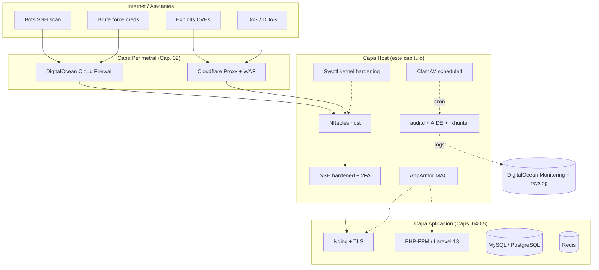
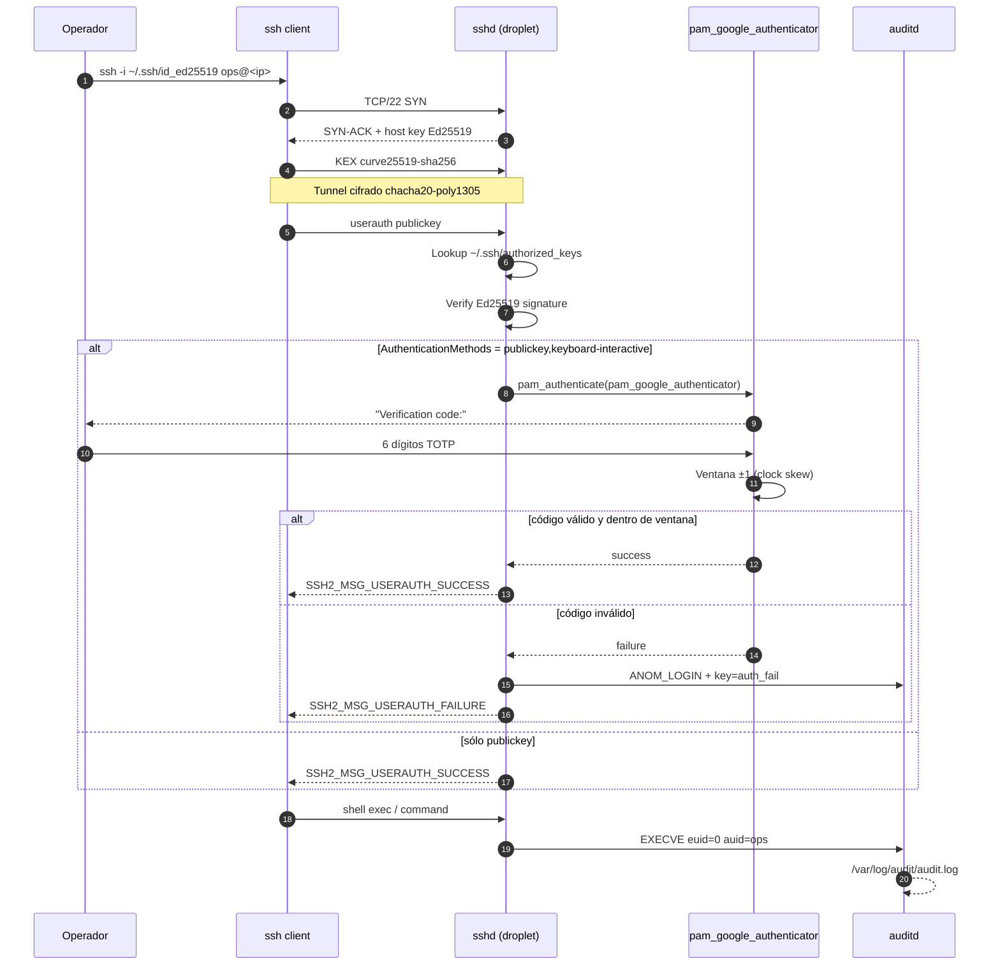
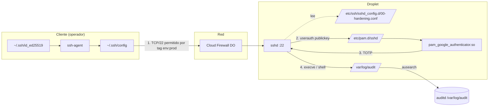
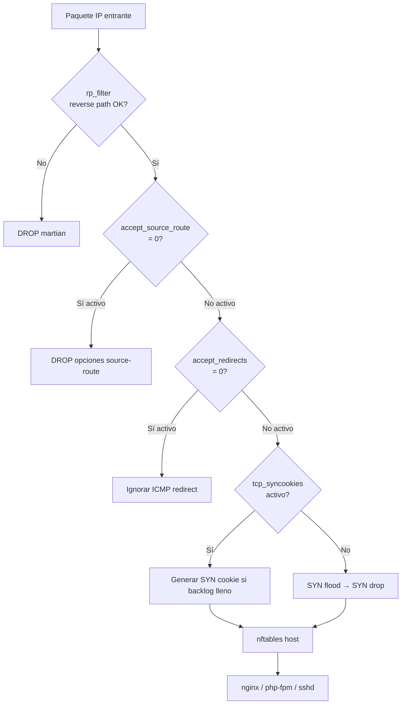
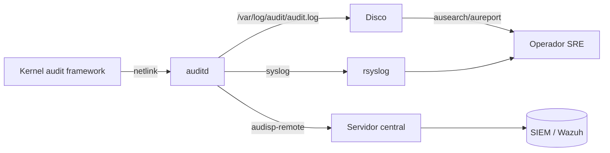
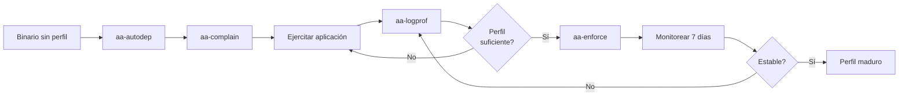
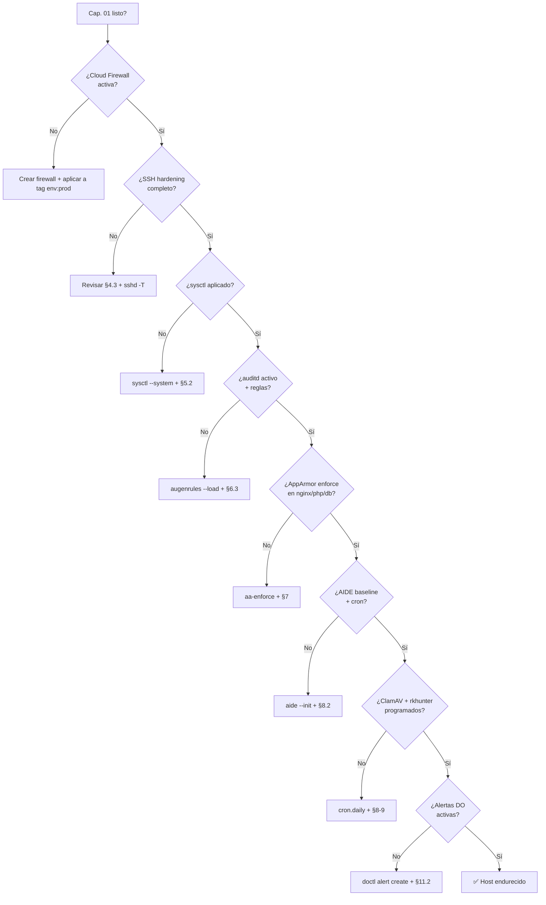

# Capítulo 01 — Hardening del SO (Ubuntu 24.04 LTS + Droplet DigitalOcean)

> **Track 01 — Sistema Operativo y Capa de Host**
> **Pila objetivo:** Ubuntu 24.04 LTS (Noble Numbat, kernel 6.8 HWE), DigitalOcean Droplet (cloud-init), OpenSSH 9.6p1, nftables 1.0.9, AppArmor 4.0, auditd 3.1.2, App stack: Laravel 13 (API) + Vue 3 + MySQL/PostgreSQL + Redis + Nginx + Cloudflare.
> **Audiencia:** Ingenieros DevOps / SRE con responsabilidad operativa sobre el VPS de producción.
> **Estilo:** *deep-engineering handbook*: cada configuración trae ruta absoluta, contenido íntegro del archivo, comandos exactos, verificación posterior y cita a fuente oficial con fecha de acceso.

---

## Tabla de contenidos

1.  [Concepción del Droplet en DigitalOcean](#1-concepción-del-droplet-en-digitalocean)
2.  [Primer inicio de sesión y configuración base](#2-primer-inicio-de-sesión-y-configuración-base)
3.  [Gestión de usuarios y sudo](#3-gestión-de-usuarios-y-sudo)
4.  [SSH hardening — núcleo del capítulo](#4-ssh-hardening--núcleo-del-capítulo)
5.  [Firewall del kernel y red (sysctl)](#5-firewall-del-kernel-y-red-sysctl)
6.  [Auditoría con auditd](#6-auditoría-con-auditd)
7.  [AppArmor](#7-apparmor)
8.  [Detección de rootkits e integridad (rkhunter, chkrootkit, AIDE)](#8-detección-de-rootkits-e-integridad-rkhunter-chkrootkit-aide)
9.  [Antivirus y protección contra malware (ClamAV)](#9-antivirus-y-protección-contra-malware-clamav)
10. [Logging centralizado básico del SO (journald, rsyslog, logrotate)](#10-logging-centralizado-básico-del-so-journald-rsyslog-logrotate)
11. [Health checks, parches automáticos y respaldos](#11-health-checks-parches-automáticos-y-respaldos)

> **Convención de marcado**
> - **[F]** Hecho documentado por la fuente oficial citada al final del párrafo.
> - **[A]** Análisis o recomendación de la guía, justificada en el cuerpo y referenciada cuando aplica.
> - Citas inline: `[<autor>, <URL>, <YYYY-MM-DD>]`.

---

## Prólogo — qué protege este capítulo

Un VPS público es, por definición, *hostile territory* a los pocos minutos de obtener su dirección IP: escaneos automatizados de SSH desde botnets, intentos de fuerza bruta, exploits de protocolo y cryptojacking son la línea base, no la excepción. El objetivo de este capítulo es construir un host sobre el cual las Capas 2 a 5 de la guía (red, TLS, datos, app/SDLC) operen sobre cimientos defendibles.

La estrategia es **defensa en profundidad con manifests inmutables**: cada servicio expuesto tiene una capa de red (Cloud Firewall), una capa de host (nftables + sysctl), una capa de aplicación (AppArmor), una capa de auditoría (auditd) y una capa de detección (AIDE + rkhunter + ClamAV). Si una falla, las siguientes contienen al intruso. El capítulo sigue el orden natural de provisionamiento: primero el Droplet (diseño), luego el sistema base, luego usuarios, luego SSH, luego las capas defensivas. Las secciones 6 a 11 (auditoría, AppArmor, rootkits, antivirus, logging, parches) se aplican una vez que el servidor esté estabilizado y todas las llaves SSH estén probadas.



**Figura 1.1** — Capas defensivas del VPS y flujo del tráfico. El atacante debe atravesar cuatro capas independientes antes de alcanzar la aplicación.

---

## 1. Concepción del Droplet en DigitalOcean

> **Principio rector [A]:** la configuración segura del host debe comenzar **antes** del primer login. El Droplet se crea con SSH key, monitoreo, backups, IPv6, VPC y Cloud Firewall ya pre-aplicados, de modo que el primer paquete que llega al puerto 22 ya está filtrado por la red perimetral de DigitalOcean, no por reglas improvisadas en `iptables`.

### 1.1 Selección de imagen y arquitectura

Ubuntu 24.04 LTS (Noble Numbat) es la imagen correcta para un servidor de producción que arrancará en 2026 y deberá mantenerse estable hasta 2029 (5 años de soporte estándar Canonical + 5 años de ESM con Ubuntu Pro) [fuente: Ubuntu Release Cycle, https://ubuntu.com/about/release-cycle, 2026-09-30]. A la fecha de redacción, el paquete `openssh-server` se encuentra en `1:9.6p1-3ubuntu13.19` (rama `security`, publicado 2026-09-03) [fuente: UbuntuUpdates, https://www.ubuntuupdates.org/package/core/noble/main/security/openssh-server, 2026-09-03]. Canonical no actualiza a la versión upstream (9.9p2); en su lugar **backporta los parches de seguridad a la 9.6p1**, lo que implica que un scanner genérico no debe usarse para diferenciar el parche aplicado [fuente: Ubuntu Security Documentation, https://documentation.ubuntu.com/security/security-features/network/version-banners/, 2026-09-30].

| Campo | Valor recomendado | Justificación |
|---|---|---|
| Distribution | Ubuntu 24.04 LTS x64 | LTS = 5 años standard + 5 ESM. Kernel 6.8 HWE con mitigations recientes. |
| Plan | **General Purpose** (dedicated vCPU) | API Laravel exige latencia consistente bajo carga — shared CPU Basic introduce throttling. |
| vCPU / RAM | 2 vCPU / 4 GB mínimo, 4 vCPU / 8 GB recomendado | Heap PHP-FPM ~256 MB por worker; 4 workers × 256 MB + Nginx + Redis + DB cliente ≈ 3.5 GB. |
| Almacenamiento | NVMe 80 GB mínimo, 160 GB recomendado | Snapshots DO = 100 % del tamaño del disco facturable. |
| Datacenter | `nyc3`, `sfo3`, `ams3`, `fra1`, `sgp1` según origen usuarios | Latencia < 100 ms al grueso de los usuarios; residencia de datos (RGPD/LOPD). |
| Backups | Activado (weekly, 4 semanas retención) | Coste ≈ 20 % del droplet. Snapshots pre-deploy + semanales. |
| Monitoring | **Improved Metrics + Alerts** (gratis) | Métricas extendidas, alert policies via API. |
| IPv6 | Activado | Stack moderno, evita NAT en núcleo. |
| VPC | VPC por defecto de la región | Red privada entre droplets (DB ↔ App) sin pasar por internet. |
| Tags | `env:prod`, `role:web`, `stack:laravel13`, `region:fra1` | Alert policies y `doctl` aplican por tag. |
| SSH keys | Inyectadas al crear el droplet | `cloud-init` las inyecta en `~/.ssh/authorized_keys` durante el primer boot. |

### 1.2 Selección del plan según carga esperada

DigitalOcean ofrece tres familias de droplets que difieren en el tipo de CPU y la proporción memoria/vCPU [fuente: DigitalOcean Docs, https://docs.digitalocean.com/products/droplets/how-to/create/, 2026-09-30]:

- **Basic (shared CPU):** `Regular`, `Premium Intel`, `Premium AMD`. Tareas de hosting web ligeras y entornos de staging. CPU compite entre vecinos.
- **General Purpose (dedicated vCPU):** Aplicaciones de producción con carga variable. Memoria ≥ 4 GB por vCPU. Es el plan por defecto recomendado para Laravel en producción.
- **CPU-Optimized (dedicated vCPU):** Procesos batch, encoding, compilación. No aporta ventaja a una API PHP.
- **Memory-Optimized / Storage-Optimized:** Bases de datos grandes, caches en memoria, datalakes. Para esta guía la base de datos va en un droplet separado; si se decide co-ubicar DB, elegir **Memory-Optimized**.

> **Decisión [A]:** Plan `General Purpose` 4 vCPU / 8 GB / 160 GB NVMe. Una API Laravel 13 típica sirve 200-500 RPS con FPM + Opcache + Redis cache; 4 vCPU cubren picos de 5× la media antes de formar cola. Si la auditoría muestra `load average > 2.0` sostenida, escalar a 8 vCPU sin rediseñar la arquitectura.

### 1.3 Región del datacenter

DigitalOcean expone 15+ regiones agrupadas por continente [fuente: DigitalOcean Docs, https://docs.digitalocean.com/products/droplets/details/regions/, 2026-09-30]. La regla de selección combina **latencia** (RTT < 50 ms al grueso de tráfico real) y **residencia de datos** (RGPD para usuarios UE → `ams3` o `fra1`; LATAM → `nyc3` o `sfo3`). Latencias inferiores a 50 ms evitan que cada round-trip HTTP añada > 100 ms al TTFB percibido; superiores a 150 ms disparan reintentos en clientes móviles.

**Verificación [F]:** el comando `doctl compute region list` muestra regiones, slug y disponibilidad; `curl -w "@-%{time_total}\n" -o /dev/null -s https://<region>.digitaloceanspaces.com/` mide RTT a la red perimetral de DO.

### 1.4 Creación del Droplet con `doctl`

```bash
# Variables (exportar o escribir en ~/.config/doctl/init.yaml)
export DO_API_TOKEN="dop_v1_..."
export REGION="fra1"
export SIZE="gd-2vcpu-8gb"     # General Purpose 2 vCPU / 8 GB
export IMAGE="ubuntu-24-04-x64"
export SSH_FP="$(ssh-keygen -lf ~/.ssh/id_ed25519.pub | awk '{print $2}')"

# Crear Droplet
doctl compute droplet create "vps-laravel-prod-01" \
  --region "${REGION}" \
  --size "${SIZE}" \
  --image "${IMAGE}" \
  --ssh-keys "${SSH_FP}" \
  --enable-monitoring \
  --enable-ipv6 \
  --enable-backups \
  --tag-name "env:prod" \
  --tag-name "role:web" \
  --tag-name "stack:laravel13" \
  --project "${DO_PROJECT_ID}" \
  --wait
```

**Verificación posterior [F]:** el droplet aparece en `doctl compute droplet list` con estado `active`, IP pública IPv4 + IPv6 asignadas, y tag listada en `doctl compute droplet get <id> --format Tags`. La inyección de la SSH key se verifica con `ssh -o BatchMode=yes -o StrictHostKeyChecking=accept-new root@<ip> "hostname"` — debe completarse sin pedir password.

### 1.5 DigitalOcean Cloud Firewall como primera capa

La Cloud Firewall de DO opera **fuera del host**, en la red del hipervisor [fuente: DigitalOcean Docs, https://docs.digitalocean.com/products/networking/firewalls/, 2026-09-30]. Esto significa que **no consume CPU del droplet, persiste a reinicios y es independiente de `nftables` local**. Se modela como una máquina de estados: reglas `allow` son aditivas entre firewalls; reglas `deny` tienen precedencia sobre `allow` que coincidan con el mismo tráfico [fuente: DigitalOcean Docs, https://docs.digitalocean.com/products/networking/firewalls/how-to/configure-rules/, 2026-09-30].

```bash
# Crear firewall perimetral
doctl compute firewall create \
  --name "fw-prod-web-laravel" \
  --inbound-rules "protocol:tcp,ports:22,address:0.0.0.0/0,address:::/0" \
  --inbound-rules "protocol:tcp,ports:80,address:0.0.0.0/0,address:::/0" \
  --inbound-rules "protocol:tcp,ports:443,address:0.0.0.0/0,address:::/0" \
  --outbound-rules "protocol:tcp,ports:53,address:0.0.0.0/0,address:::/0" \
  --outbound-rules "protocol:udp,ports:53,address:0.0.0.0/0,address:::/0" \
  --outbound-rules "protocol:tcp,ports:80,address:0.0.0.0/0,address:::/0" \
  --outbound-rules "protocol:tcp,ports:443,address:0.0.0.0/0,address:::/0" \
  --outbound-rules "protocol:tcp,ports:587,address:0.0.0.0/0,address:::/0" \
  --outbound-rules "protocol:icmp,address:0.0.0.0/0,address:::/0" \
  --outbound-rules "protocol:udp,ports:123,address:0.0.0.0/0,address:::/0" \
  --tag-names "env:prod" \
  --wait
```

| Regla | Protocolo | Puertos | Origen | Comentario |
|---|---|---|---|---|
| SSH | TCP | 22 | `0.0.0.0/0` y `::/0` | Restringir a IP del operador en producción (ver §4.6) |
| HTTP | TCP | 80 | `0.0.0.0/0` y `::/0` | Redirigido a HTTPS por Nginx |
| HTTPS | TCP | 443 | `0.0.0.0/0` y `::/0` | Terminación TLS |
| DNS saliente | TCP+UDP | 53 | cualquiera | Resolución outbound |
| HTTP/HTTPS saliente | TCP | 80, 443 | cualquiera | `apt`, GitHub, Let’s Encrypt |
| SMTP saliente | TCP | 587 | cualquiera | Notificaciones Laravel / Monit |
| ICMP | ICMP | — | cualquiera | Diagnóstico; mantener para Path MTU Discovery |
| NTP saliente | UDP | 123 | `0.0.0.0/0` | `systemd-timesyncd` |

> **Decisión [A]:** todo lo no listado se **deniega por defecto**. El `default_deny` en firewalls de DO se activa cuando existe cualquier regla en un sentido; no permite tráfico no enumerado. Esto bloquea puertos de administración accidentalmente abiertos (3306, 6379, 5432) incluso si la app los olvida.

### 1.6 Tags, proyecto y VPC

Los tags sirven para que alert policies (`doctl monitoring alert create --entities-tags env:prod`) y Cloud Firewalls (`--tag-names`) apliquen automáticamente a nuevos droplets [fuente: DigitalOcean Docs, https://docs.digitalocean.com/products/droplets/how-to/create/, 2026-09-30]. El **proyecto** es un namespace contable; el **VPC** por defecto de cada región asigna IP privada 10.x.x.x utilizable entre droplets en el mismo datacenter sin salir a internet pública.

**Verificación [F]:** `doctl compute vpc list` muestra el VPC por defecto con CIDR `10.244.0.0/16` en `fra1`. Una vez creado el droplet, `ip -4 addr show eth1` debe mostrar la IP privada asignada; `doctl compute droplet get <id> --format PrivateIPv4` confirma.

---

## 2. Primer inicio de sesión y configuración base

### 2.1 Primer acceso como `root`

El primer login se realiza con la SSH key inyectada por cloud-init [fuente: Ubuntu Server Guide, https://ubuntu.com/server/docs/how-to/security/openssh-server/, 2026-09-30]. La dirección IP se obtiene del panel o `doctl compute droplet list --format Name,PublicIPv4`.

```bash
# Cliente: aceptar fingerprint al primer contacto (no se almacenará la IP, solo el host key)
ssh -o StrictHostKeyChecking=accept-new root@<IP_PUBLICA>

# Verificar versión SO
cat /etc/os-release
# NAME="Ubuntu"
# VERSION="24.04 LTS (Noble Numbat)"
# ID=ubuntu
# VERSION_ID="24.04"

# Verificar OpenSSH instalado
dpkg -l openssh-server | tail -1
# ii  openssh-server    1:9.6p1-3ubuntu13.19    amd64    secure shell (SSH) server

# Verificar paquetes base actualizados
apt list --upgradable 2>/dev/null | wc -l
```

### 2.2 Localización: locale y timezone

```bash
# Generar locale (en_US.UTF-8 es el estándar de facto para logs en inglés;
# es_ES.UTF-8 si la app Laravel emite mensajes en español)
locale-gen en_US.UTF-8 es_ES.UTF-8
update-locale LANG=en_US.UTF-8 LC_ALL=en_US.UTF-8

# Timezone: crítico para que journald, auditd y los timestamps
# de Laravel coincidan con la rotación de logs y TLS
timedatectl set-timezone Europe/Madrid
timedatectl set-ntp true

# Verificación
timedatectl status
#  Time zone: Europe/Madrid (CEST, +0200)
#  NTP service: active
#  System clock synchronized: yes
```

> **Justificación [A]:** `timedatectl set-ntp true` activa `systemd-timesyncd`, que sincroniza el reloj con los servidores NTP de Ubuntu (`ntp.ubuntu.com`). Sin esto, los certificados TLS emitidos por Let’s Encrypt pueden aparecer con validez "futura" si el reloj adelanta, o "expirados" si atrasa; los tokens JWT de Sanctum también dependen de `time()`. El paquete `chrony` ofrece mayor precisión en redes con jitter alto, pero para VPS `timesyncd` es suficiente.

### 2.3 Actualización completa y habilitación de `unattended-upgrades`

Ubuntu 24.04 instala `unattended-upgrades` por defecto y aplica parches de seguridad automáticamente [fuente: Ubuntu Server Guide, https://ubuntu.com/server/docs/how-to/software/automatic-updates/, 2026-09-30]. El archivo `50unattended-upgrades` por defecto incluye **el origen `-security` y los repositorios ESM** (Canonical Enterprise Service Management); **no** incluye `-updates` (mejoras no-seguridad) por defecto. El capítulo añade además `"${distro_id}:${distro_codename}";` (sin sufijo) para tomar también mejoras del pocket *stable* — esto **no es el default** y debe decidirse explícitamente: incluirlo trae fixes de funcionalidad no relacionados con CVE; excluirlo reduce superficie. La recomendación de esta guía es **descomentar la línea *sólo si* se acepta el riesgo** de regresiones menores en favor de parches no-CVE.

#### Paso 1 — actualización manual inicial

```bash
apt update
apt full-upgrade -y
apt autoremove --purge -y
apt clean
systemctl reboot   # si el kernel cambió
```

**Verificación [F]:** `apt list --installed 2>/dev/null | grep -E "linux-image|openssh-server"` debe mostrar versiones idénticas a las publicadas en `security.ubuntu.com`. El paquete `openssh-server` debe ser `1:9.6p1-3ubuntu13.19` o superior en el momento de la lectura.

#### Paso 2 — configuración de orígenes permitidos

Archivo: `/etc/apt/apt.conf.d/50unattended-upgrades` (snippet aplicado tras el original):

```bash
# Forzar sólo orígenes firmados por Ubuntu (recomendado por Canonical)
Unattended-Upgrade::Allowed-Origins {
    "${distro_id}:${distro_codename}";
    "${distro_id}:${distro_codename}-security";
    "${distro_id}ESMApps:${distro_codename}-apps-security";
    "${distro_id}ESM:${distro_codename}-infra-security";
};

# Política de blacklist: nunca auto-actualizar el kernel HWE ni libc
# (los reinicios automáticos no son aceptables en producción)
Unattended-Upgrade::Package-Blacklist {
    "linux-";
    "libc6$";
    "libc6-dev$";
};

# Notificación por email (configurar Postfix/relay primero, ver Cap. 02)
Unattended-Upgrade::Mail "ops@example.com";

# Sólo alertar cuando hay cambios; "always" inunda la bandeja
Unattended-Upgrade::MailReport "on-change";

# NO reiniciar automáticamente: el operador decide cuándo reiniciar
Unattended-Upgrade::Automatic-Reboot "false";
Unattended-Upgrade::Automatic-Reboot-WithUsers "false";

# Eliminar dependencias innecesarias tras upgrade
Unattended-Upgrade::Remove-Unused-Kernel-Packages "true";
Unattended-Upgrade::Remove-New-Unused-Dependencies "true";
```

Archivo: `/etc/apt/apt.conf.d/20auto-upgrades`:

```
APT::Periodic::Update-Package-Lists "1";
APT::Periodic::Unattended-Upgrade "1";
APT::Periodic::Download-Upgradeable-Packages "1";
APT::Periodic::AutocleanInterval "7";
```

> **Justificación de los valores [A]:**
> - `Update-Package-Lists "1"` = una vez al día (intervalo mínimo para unattended-upgrades). Reducir frecuencia aumenta la ventana de exposición a CVE.
> - `Automatic-Reboot "false"`: un reinicio abrupto de FPM en mitad de un checkout de deploy es peor que el riesgo de CVE no parcheado durante las siguientes 24-48 h. El operador revisa `unattended-upgrades` logs y aplica reboot en la ventana de mantenimiento.
> - La blacklist de `linux-*` es deliberada: las actualizaciones de kernel requieren reboot, y los servidores de Canonical publican los kernel updates semanas antes de que el paquete entre al pocket `-security`; no necesitamos doble update.

**Verificación [F]:**

```bash
# Dry-run: simula una ejecución sin tocar nada
unattended-upgrade --dry-run --debug 2>&1 | head -40

# Forzar una corrida real en modo verbose (útil tras instalación inicial)
unattended-upgrade -v

# Comprobar el log
tail -50 /var/log/unattended-upgrades/unattended-upgrades.log
ls /var/log/unattended-upgrades/

# Confirmar timer systemd activo
systemctl list-timers apt-daily.timer apt-daily-upgrade.timer
# NEXT                        LEFT     LAST                        PASSED  UNIT                  ACTIVATES
# Wed 2026-09-30 03:00:00 UTC 5h left  Wed 2026-09-30 02:00:00 UTC  17min ago apt-daily.timer       apt-daily.service
# Wed 2026-09-30 04:17:00 UTC 6h left  Wed 2026-09-30 03:17:00 UTC  47s ago   apt-daily-upgrade.timer apt-daily-upgrade.service
```

### 2.4 Hosts, hostname y FQDN

```bash
# Establecer hostname corto (sin dominio)
hostnamectl set-hostname vps-laravel-prod-01

# Configurar /etc/hosts correctamente: 127.0.1.1 debe apuntar al hostname
cat > /etc/hosts <<'EOF'
127.0.0.1       localhost
::1             localhost ip6-localhost ip6-loopback
ff02::1         ip6-allnodes
ff02::2         ip6-allrouters
127.0.1.1       vps-laravel-prod-01.internal.example.com vps-laravel-prod-01
EOF

# Verificación
hostname
hostname -f
getent hosts vps-laravel-prod-01
```

> **Por qué 127.0.1.1 [F]:** Debian/Ubuntu resuelven el hostname contra `127.0.1.1` (no `127.0.0.1`) para evitar colisiones con `localhost` cuando el servidor obtiene su IP por DHCP. En un droplet con IP fija esto es cosmético, pero algunas apps PHP (`gethostbyname`) asumen que `hostname -f` devuelve un FQDN resoluble. Documentado en el man-page de `hosts(5)`.

---

## 3. Gestión de usuarios y sudo

### 3.1 Modelo de roles

| Usuario | Grupo primario | Grupos secundarios | Shell | Acceso sudo | Propósito |
|---|---|---|---|---|---|
| `root` | `root` | — | `/bin/bash` | N/A | Sólo emergencias (deshabilitado vía SSH §4.3) |
| `ops` | `ops` | `sudo`, `adm`, `systemd-journal` | `/bin/bash` | Limitado (ver §3.3) | Administración operativa |
| `deploy` | `deploy` | `sudo`, `www-data` | `/bin/bash` | Sólo `systemctl reload php8.3-fpm nginx`, `deployer` script | Despliegues CI/CD |
| `app` | `app` | `www-data` | `/usr/sbin/nologin` | Ninguno | Propietario de archivos Laravel |
| `dbadmin` | `dbadmin` | — | `/usr/sbin/nologin` | Sólo `/usr/bin/mysqldump`, `/usr/bin/pg_dump` | Respaldos DB (sin shell) |
| `auditor` | `auditor` | `adm`, `systemd-journal`, `audit` | `/bin/bash` | Ninguno | Lectura logs/audit, sin mutación |

> **Decisión [A]:** la separación `ops` (humano, full admin con sudo limitado) vs `deploy` (humano o token CI, sudo de comandos específicos) vs `app` (cuenta de servicio sin shell) refleja el principio de menor privilegio: un compromiso del daemon PHP no escala a compromiso del sistema, un compromiso del token CI no puede instalar paquetes, etc. Esta es la matriz exigida por CIS Ubuntu 24.04 v2.0.0 §1.3 (`Ensure sudo is configured correctly`) [fuente: CIS Benchmarks, https://www.cisecurity.org/benchmark/ubuntu_linux, 2026-09-30].

### 3.2 Creación de usuarios y grupos

```bash
# Grupos
groupadd --system ops
groupadd --system deploy
groupadd --system app
groupadd --system dbadmin
groupadd --system auditor

# Crear usuarios con shell y home correctos
useradd -m -s /bin/bash -g ops -G sudo,adm,systemd-journal -c "Operador SRE" ops
useradd -m -s /bin/bash -g deploy -G sudo,www-data -c "Cuenta de despliegue CI" deploy
useradd -M -s /usr/sbin/nologin -g app -G www-data -c "Cuenta de servicio Laravel" app
useradd -M -s /usr/sbin/nologin -g dbadmin -c "Cuenta de backup DB" dbadmin
useradd -m -s /bin/bash -g auditor -G adm,systemd-journal -c "Auditor de logs" auditor

# Establecer contraseñas robustas (forzar cambio en primer login)
for u in ops deploy auditor; do
  passwd "${u}"   # pegar contraseña generada con `pwgen -s 24 1`
  passwd --expire "${u}"
done

# Cuentas de servicio: contraseña bloqueada y nunca se usa
passwd -l app
passwd -l dbadmin
```

> **Buena práctica [F]:** `passwd -l` bloquea la cuenta (no es equivalente a deshabilitarla; `passwd -d` la borraría). Una cuenta de servicio sin contraseña no permite login interactivo vía PAM, pero el daemon `php-fpm` la usa para arrancar vía `User=app` en systemd. Documentado en `passwd(1)`.

### 3.3 Sudo con permisos específicos — `/etc/sudoers.d/`

El principio de CIS y NIST es: **`NOPASSWD` total está prohibido**, y los usuarios privilegiados deben pedir contraseña para cada escalada [fuente: CIS Ubuntu 24.04 §5.2.x, https://cis.blacklabs.team/ubuntu-2404.html, 2026-09-30].

Archivo: `/etc/sudoers.d/10-ops-base`

```
# Operador: puede casi todo, pero siempre con contraseña y registrado en journald
Defaults:ops log_input, log_output, iolog_dir=/var/log/sudo-io/%{user}
Cmnd_Alias OPS_ADMIN = \
    /usr/bin/apt-get, \
    /usr/bin/apt, \
    /usr/bin/systemctl *, \
    /usr/bin/journalctl *, \
    /usr/bin/tail, /usr/bin/less, /usr/bin/cat, /usr/bin/grep, /usr/bin/awk, \
    /usr/sbin/ufw *, /usr/sbin/nft *, /usr/sbin/iptables *, \
    /usr/sbin/visudo, /usr/bin/sudoedit, \
    /usr/bin/vim, /usr/bin/nano

ops ALL=(ALL:ALL) OPS_ADMIN
```

Archivo: `/etc/sudoers.d/20-deploy-cicd`

```
# Deploy: sólo recarga servicios y ejecuta el script de deploy
Cmnd_Alias DEPLOY_CMDS = \
    /usr/bin/systemctl reload php8.3-fpm, \
    /usr/bin/systemctl reload nginx, \
    /usr/bin/systemctl status *php*, \
    /usr/bin/systemctl status *nginx*, \
    /usr/local/bin/deployer

# NOPASSWD sólo para estos comandos exactos (sin wildcards amplios)
deploy ALL=(ALL:ALL) NOPASSWD: DEPLOY_CMDS
```

Archivo: `/etc/sudoers.d/30-dbadmin-backup`

```
Cmnd_Alias DBA_CMDS = \
    /usr/bin/mysqldump, \
    /usr/bin/pg_dump, \
    /usr/bin/pg_dumpall, \
    /usr/bin/mariadb-dump

dbadmin ALL=(ALL:ALL) NOPASSWD: DBA_CMDS
```

Archivo: `/etc/sudoers.d/99-auditor-readonly`

```
# Auditor: lectura total pero nunca modificación
Cmnd_Alias AUDIT_READ = \
    /usr/bin/journalctl *, \
    /usr/bin/tail, /usr/bin/less, /usr/bin/cat, /usr/bin/grep, /usr/bin/awk, \
    /usr/bin/ausearch *, /usr/bin/aureport *, \
    /usr/bin/rkhunter *, /usr/bin/chkrootkit, /usr/bin/clamscan, \
    /usr/bin/aide *

auditor ALL=(ALL:ALL) AUDIT_READ
```

> **Verificación [F]:** validar sintaxis de sudoers siempre con `visudo -c -f /etc/sudoers.d/10-ops-base` antes de hacer logout; un sudoers mal formado **bloquea el acceso sudo** del usuario (intencional: peor el caso de "sudo abierto" que el de "sudo cerrado"). La herramienta `visudo` edita el archivo de forma atómica y valida la gramática BNF.

```bash
# Validar todos los archivos
for f in /etc/sudoers.d/*; do
  echo "== ${f} =="
  visudo -c -f "${f}"
done
# Resultado esperado: "parsed OK" en cada uno

# Comprobar asignación efectiva
sudo -l -U deploy
sudo -l -U ops
sudo -l -U dbadmin
sudo -l -U auditor
```

### 3.4 Política de contraseñas: PAM pwquality + pam_pwhistory

PAM gobierna la autenticación de todo el sistema, incluido SSH cuando `UsePAM yes` está activo (que es el default) [fuente: pam.conf(5), https://manpages.ubuntu.com/manpages/noble/man5/pam.conf.5.html, 2026-09-30]. Ubuntu 24.04 trae `libpam-pwquality` preinstalado; `pam_pwhistory` se instala por separado.

```bash
apt install -y libpam-pwquality libpam-pwhistory
```

Archivo: `/etc/security/pwquality.conf` (snippet, fusionado con el original):

```ini
# Política de contraseñas — equilibrio usabilidad/seguridad
minlen = 14
dcredit = -1      # al menos 1 dígito
ucredit = -1      # al menos 1 mayúscula
lcredit = -1      # al menos 1 minúscula
ocredit = -1      # al menos 1 símbolo
minclass = 4      # las 4 clases deben estar presentes
maxrepeat = 3     # máximo 3 caracteres idénticos consecutivos
gecoscheck = 1    # no permitir que la contraseña contenga el nombre completo
dictpath = /usr/share/dict/words
enforcing = 1     # aplicar en el próximo cambio (no en contraseñas existentes)
```

Archivo: `/etc/pam.d/common-password` (insertar **antes** de la línea `password [success=1 default=ignore] pam_unix.so`):

```
# Historial: impedir reutilizar las últimas 5 contraseñas
password        required                        pam_pwhistory.so remember=5 use_authtok

# Calidad: aplicar pwquality
password        required                        pam_pwquality.so retry=3 minlen=14 ucredit=-1 lcredit=-1 dcredit=-1 ocredit=-1
```

> **Decisión [A]:** `minlen=14` con 4 clases es la postura mínima defendible hoy. NIST SP 800-63B recomienda mínimo 8 caracteres pero penaliza composición forzada si la longitud es ≥ 8 [fuente: NIST SP 800-63B §5.1.1.2, https://pages.nist.gov/800-63-3/sp800-63b.html, 2026-09-30]. Para servidores con interacción humana frecuente, 14 caracteres + 4 clases reduce el riesgo de password spraying sin provocar resets semanales. La directiva `enforcing=1` sólo aplica al cambio, no invalida contraseñas pre-existentes — útil durante la transición inicial.

**Verificación [F]:** `passwd ops` debe rechazar una contraseña de 8 caracteres con `BAD PASSWORD`. `passwd ops` debe rechazar una contraseña igual a las últimas 5 con `Password has been already used`.

### 3.5 Expiración y aging de cuentas

```bash
# /etc/login.defs controla valores por defecto
sed -i 's/^PASS_MAX_DAYS.*/PASS_MAX_DAYS   90/'  /etc/login.defs
sed -i 's/^PASS_MIN_DAYS.*/PASS_MIN_DAYS   1/'   /etc/login.defs
sed -i 's/^PASS_WARN_AGE.*/PASS_WARN_AGE   14/' /etc/login.defs

# Aplicar a usuarios existentes
for u in ops deploy auditor; do
  chage --maxdays 90 --mindays 1 --warndays 14 "${u}"
done

# Cuentas de servicio: nunca expiran
chage -I -1 -m 0 -M 99999 -E -1 app
chage -I -1 -m 0 -M 99999 -E -1 dbadmin

# Verificación
chage -l ops
# Last password change: ...
# Password expires: ... (90 días después)
# Password inactive: never
# Account expires: never
# Minimum number of days between password change: 1
# Maximum number of days between password change: 90
# Number of days of warning before password expires: 14
```

---

## 4. SSH hardening — núcleo del capítulo

OpenSSH 9.6p1 es la versión empaquetada en Ubuntu 24.04 LTS (con parches backported hasta 9.6p1-3ubuntu13.19 a fecha 2026-09-03) [fuente: UbuntuUpdates, https://www.ubuntuupdates.org/package/core/noble/main/security/openssh-server, 2026-09-03]. OpenSSH 9.x conserva los defaults modernos (DSA removido del código en upstream 9.8 pero el paquete Ubuntu 24.04 sigue en 9.6p1 con el parche aplicado; HMAC-MD5 fuera de defaults desde 7.2; algunos CBC deshabilitados en 8.5); el endurecimiento de este capítulo **excluye explícitamente** los algoritmos débiles (DSA, ECDSA NIST, CBC, HMAC-MD5) en lugar de depender del default.

### 4.1 Flujo de autenticación endurecida



**Figura 4.1** — Secuencia de autenticación SSH con claves Ed25519 + 2FA TOTP. Cada intento, exitoso o no, genera un evento `auditd` consultable con `ausearch -k user_auth`.

### 4.2 Generación del par de claves Ed25519

Ed25519 es la opción correcta hoy: claves de 68 bytes, firma de 64 bytes, **resistente a ataques de canal lateral** (no como ECDSA P-256 en implementaciones naive) [fuente: Mozilla OpenSSH Guidelines, https://infosec.mozilla.org/guidelines/openssh, 2026-09-30]. RSA 4096 sigue siendo válido pero más lento y verboso; ECDSA se desaconseja por motivos de soberanía criptográfica.

```bash
# Cliente (operador)
ssh-keygen -t ed25519 -a 100 -C "ops@$(hostname) - $(date +%Y-%m-%d)" -f ~/.ssh/id_ed25519
# -a 100: 100 rounds de KDF bcrypt sobre la passphrase (rendimiento/seguridad ~1s en CPU moderna)

# Copiar clave pública al servidor (método oficial)
ssh-copy-id -i ~/.ssh/id_ed25519.pub ops@<IP_PUBLICA>

# Verificación
ssh -i ~/.ssh/id_ed25519 -o BatchMode=yes -o IdentitiesOnly=yes ops@<IP_PUBLICA> "whoami; date"
# ops
# Wed Sep 30 02:30:00 UTC 2026

# Permisos obligatorios (StrictModes=yes en sshd_config los exige)
chmod 700 ~/.ssh
chmod 600 ~/.ssh/id_ed25519
chmod 644 ~/.ssh/id_ed25519.pub
chmod 600 ~/.ssh/authorized_keys
```

> **Justificación de `-a 100` [A]:** Ed25519 nativo no requiere rounds KDF (la firma es siempre determinista), pero la passphrase se hashea con bcrypt sobre el archivo de clave privada. 100 rounds eleva el coste de fuerza bruta de passphrase a ~100 ms por intento en CPU moderna: tolerable para el usuario, prohibitivo para el atacante offline.

### 4.3 Archivo `sshd_config` endurecido — drop-in modular

OpenSSH carga primero `/etc/ssh/sshd_config` y luego concatena lexicográficamente `/etc/ssh/sshd_config.d/*.conf`. Los drop-ins ganan sobre el archivo principal, lo cual permite versionar el hardening como un archivo separado que sobrevive a `apt upgrade` sin conflicto de conffile.

Archivo: `/etc/ssh/sshd_config.d/00-hardening.conf` (crear nuevo, permisos `0640 root:root`)

```apache
# =============================================================
# Hardening SSH — Ubuntu 24.04 LTS / OpenSSH 9.6p1
# Referencia: Mozilla OpenSSH Modern + CIS Ubuntu 24.04 §5.2
# =============================================================

# --- Protocolo y puerto --------------------------------------
Port 22
AddressFamily any
ListenAddress 0.0.0.0
ListenAddress ::

# --- Host keys: sólo Ed25519 + RSA-4096 (compatibilidad) -----
# Borrar las claves DSA/ECDSA pre-existentes si existen
HostKey /etc/ssh/ssh_host_ed25519_key
HostKey /etc/ssh/ssh_host_rsa_key

# --- Criptografía: Mozilla Modern profile --------------------
KexAlgorithms curve25519-sha256,curve25519-sha256@libssh.org,diffie-hellman-group16-sha512,diffie-hellman-group18-sha512
Ciphers chacha20-poly1305@openssh.com,aes256-gcm@openssh.com,aes128-gcm@openssh.com
MACs hmac-sha2-512-etm@openssh.com,hmac-sha2-256-etm@openssh.com,umac-128-etm@openssh.com
PubkeyAcceptedAlgorithms ssh-ed25519,rsa-sha2-512,rsa-sha2-256
HostKeyAlgorithms ssh-ed25519,rsa-sha2-512,rsa-sha2-256

# --- Autenticación -------------------------------------------
PermitRootLogin no
PubkeyAuthentication yes
PasswordAuthentication no
KbdInteractiveAuthentication no
ChallengeResponseAuthentication no
UsePAM yes
AuthenticationMethods publickey
PermitEmptyPasswords no

# --- Límites de sesión ---------------------------------------
LoginGraceTime 30
MaxAuthTries 3
MaxSessions 4
MaxStartups 3:50:10
ClientAliveInterval 300
ClientAliveCountMax 2

# --- Lista explícita de usuarios -----------------------------
AllowGroups ssh-users
# AllowUsers es alternativo: AllowUsers ops deploy auditor
# Si se combina AllowUsers y AllowGroups, ambos deben coincidir

# --- Forwarding y reenvío -----------------------------------
AllowAgentForwarding yes
AllowTcpForwarding no
AllowStreamLocalForwarding no
GatewayPorts no
X11Forwarding no
PermitTTY yes
PermitUserEnvironment no

# --- Otros ---------------------------------------------------
Banner /etc/ssh/banner
PrintMotd no
DebianBanner no
TCPKeepAlive no
Compression no
UseDNS no
StrictModes yes
```

> **Decisión sobre `AllowTcpForwarding no` [A]:** un túnel SSH inverso permite a un atacante exponer un puerto interno a internet sin tocar el firewall. Para este caso de uso (operación VPS) no se necesita forwarding; si en el futuro un desarrollador requiere túnel a su IDE, se le crea una entrada en `Match User` con `AllowTcpForwarding yes` en lugar de relajar la política global.

> **Decisión sobre `MaxStartups 3:50:10` [A]:** el default `10:30:100` significa que con 100 conexiones no autenticadas concurrentes, sshd rechaza el 100 %. Con la fórmula `3:50:10`, **al 50 % de probabilidad** de rechazar empieza en la **tercera** conexión simultánea y el rechazo total llega en la **décima**, lo cual cierra el vector de slowloris-SSH [fuente: OpenBSD sshd_config(5), https://man.openbsd.org/sshd_config, 2026-09-30].

### 4.4 Banner legal

Archivo: `/etc/ssh/banner`

```
=================================================================
  SISTEMA DE ACCESO RESTRINGIDO — USO AUTORIZADO SOLAMENTE
  Toda actividad es registrada y auditada conforme a:
  - RGPD Art. 5 (licitud, lealtad, transparencia)
  - Ley Orgánica 3/2018 (LOPDGDD) Art. 5
  - NIS2 Directive (UE) 2022/2555 Art. 21
  Conexiones no autorizadas serán reportadas a las autoridades.
=================================================================
```

`PrintMotd no` y `DebianBanner no` evitan la divulgación del SO en el handshake inicial [fuente: Ubuntu Security Documentation, https://documentation.ubuntu.com/security/security-features/network/version-banners/, 2026-09-30]. La cadena completa de banners que ve un cliente con la config propuesta es la del archivo `banner`.

### 4.5 Algoritmos: por qué Mozilla Modern

Mozilla mantiene tres perfiles de configuración para OpenSSH: `Modern` (OpenSSH 8.5+), `Intermediate` (OpenSSH 7.4+) e `Legacy` (OpenSSH ≤ 7.4) [fuente: Mozilla OpSec, https://infosec.mozilla.org/guidelines/openssh, 2026-09-30]. **Modern** es el perfil objetivo para un servidor recién instalado con OpenSSH 9.6p1.

> **Nota de implementación:** la configuración del capítulo es **equivalente a Mozilla Modern y más estricta**: (a) reemplaza los `ecdh-sha2-nistp{256,384,521}` de Mozilla por `diffie-hellman-group{16,18}-sha512` (CIS/STIG Ubuntu 24.04 §5.2.7) para evitar curvas NIST ECDH en el KEX; (b) elimina la clave de host ECDSA (`ssh_host_ecdsa_key`) que Mozilla lista pero se desaconseja por motivos de soberanía criptográfica. El efecto operativo es: misma familia de cifrado AEAD, mismas MAC SHA-2 EtM, mismo KEX X25519, pero KEX adicional con grupos DH ≥ 3072 bits y una sola familia de host keys (Ed25519 + RSA-4096 fallback).

| Familia | Mozilla Modern | Justificación |
|---|---|---|
| Kex | `curve25519-sha256`, `curve25519-sha256@libssh.org`, `diffie-hellman-group{16,18}-sha512` | X25519 ofrece PFS; DH groups ≥3072 bits cumplen NIST SP 800-56A. |
| Cifrado | `chacha20-poly1305@openssh.com`, `aes{256,128}-gcm@openssh.com` | AEAD; sin modo CBC. |
| MAC | `hmac-sha2-{512,256}-etm@openssh.com`, `umac-128-etm@openssh.com` | SHA-2 + EtM (cifrar-luego-MAC). |
| HostKey | `ssh-ed25519`, `rsa-sha2-{512,256}` | Sin DSA (≤ 1024 bits), sin ECDSA (curvas NIST controversia). |

> **Algoritmos explícitamente excluidos [F]:** `diffie-hellman-group14-sha256` y `diffie-hellman-group-exchange-sha256` están en Mozilla Modern pero algunos clientes antiguos (libssh < 0.8) no los soportan. Si necesitas compatibilidad con scp/legacy rsync, añade `diffie-hellman-group14-sha256`. El comando `ssh -vvv user@host` muestra los algoritmos negociados.

### 4.6 Restricción por IP con `Match Address`

Si la IP del operador es fija (VPN corporativo, IP residencial fija, IP de salto desde otro droplet):

```apache
# Sólo permitir SSH desde IPs corporativas
Match Address 203.0.113.0/24,198.51.100.7,2001:db8::/32
    # Mantener PasswordAuthentication no global; este bloque sólo añade
    # un segundo factor PAM para clientes en la red corporativa.
    AuthenticationMethods publickey,keyboard-interactive
```

> **Por qué no siempre hacerlo [A]:** depender de IP del operador crea una carga operativa (renovar IPs cuando el operador rota de proveedor) y un riesgo (si la IP corporativa es comprometida, el atacante entra directamente). La postura por defecto es **bloquear por puerto + 2FA**, no por IP. La regla `Match Address` se reserva para servidores que ejecutan procesos batch (sin 2FA posible).

### 4.7 Cambio de puerto SSH: pros y contras

| Argumento | A favor | En contra |
|---|---|---|
| Reducción de ruido en logs | El 99 % de los bots scan puertos 22. Cambiar reduce el volumen de intentos en 90-99 %. | **Seguridad por oscuridad** no es defensa real; los masscan detectan puertos abiertos en < 1 min. |
| Reducción de superficie | `nmap -p 1-65535` debe ejecutarse, vs `-p 22`. | El puerto sigue siendo accesible si publicas el droplet. |
| Compatibilidad | Algunos clientes antiguos fallan con puertos altos (> 1024). | DoS al puerto incorrecto (e.g., 2222 ocupado por otro servicio). |
| Confusión operacional | El operador debe recordar `ssh -p <puerto_alterno>` en cada script/Ansible/cron. | Documentación dispersa, errores en ansible/scripts, riesgo de typos que bloquean deploys. |

> **Decisión [A]:** mantener puerto 22. La justificación: (a) la Cloud Firewall de DO ya filtra los orígenes no autorizados, (b) `fail2ban` (Capítulo 02) bloquea IPs con intentos repetidos, (c) Auditd registra todos los intentos, (d) la fricción operacional de documentar el puerto custom en cada ansible/playbook/Fornire errores humanos. Cambiar el puerto no añade seguridad real; sólo desplaza el problema.

**Alternativa documentada — port knocking:**

Si por requerimiento regulatorio se requiere cambio de puerto, la cadena correcta es:

```bash
apt install -y knockd
cat > /etc/knockd.conf <<'EOF'
[options]
    UseSyslog

[openSSH]
    sequence    = 7000,8000,9000
    seq_timeout = 10
    command     = /usr/sbin/ufw allow from %IP% to any port 22 proto tcp
    tcpflags    = syn

[closeSSH]
    sequence    = 9000,8000,7000
    seq_timeout = 10
    command     = /usr/sbin/ufw delete allow from %IP% to any port 22 proto tcp
    tcpflags    = syn
EOF
systemctl enable --now knockd
```

Esto deja el puerto 22 **cerrado** hasta que el cliente envía 3 paquetes SYN consecutivos a puertos 7000/8000/9000. Es un esquema frágil contra replay attacks (los paquetes pueden ser capturados y reenviados) y nunca debe ser la única defensa. Si se usa, combinar con 2FA.

### 4.8 ssh-agent y ssh-add

Para evitar escribir la passphrase en cada conexión, cargar la clave en el agente SSH al inicio de la sesión del operador:

```bash
# ~/.bashrc o ~/.zshrc del operador
if [ -z "$SSH_AUTH_SOCK" ]; then
  eval "$(ssh-agent -s -t 8h)"
  ssh-add ~/.ssh/id_ed25519
fi

# O explícitamente en la sesión
ssh-agent -t 8h
SSH_AUTH_SOCK=/tmp/ssh-agent.XXXX; export SSH_AUTH_SOCK
SSH_AGENT_PID=...; export SSH_AGENT_PID
ssh-add ~/.ssh/id_ed25519
```

El parámetro `-t 8h` aplica un timeout de 8 horas al agente; tras ese tiempo hay que volver a autenticarse. En macOS el agente del sistema (`launchd`) se usa con `ssh-add --apple-use-keychain ~/.ssh/id_ed25519`.

### 4.9 2FA con TOTP (Google Authenticator PAM)

Ubuntu 24.04 documenta explícitamente este flujo [fuente: Ubuntu Server Guide 2FA TOTP/HOTP, https://ubuntu.com/server/docs/how-to/security/two-factor-authentication-with-totp-or-hotp/, 2026-09-30]. El paquete `libpam-google-authenticator` está en el componente `universe`.

#### Paso 1 — instalar y configurar

```bash
apt install -y libpam-google-authenticator qrencode
```

#### Paso 2 — generar secreto por usuario

Como cada usuario (`ops`, `deploy`, `auditor`) debe ejecutar `google-authenticator` por sí mismo (las claves TOTP son personales):

```bash
su - ops
google-authenticator

# Preguntas del comando:
# Do you want authentication tokens to be time-based (y/n) y
# Do you want me to update your "~/.google-authenticator" file (y/n) y
# Do you want to disallow multiple uses of the same authentication token? (y/n) y
# By default, tokens are good for 30 seconds... (y/n) y
# If the computer you're logging into isn't hardened against brute-force... (y/n) y
```

El usuario escanea el QR en Google Authenticator, Bitwarden Authenticator o 1Password, y **anota los 5 códigos de respaldo** en un gestor de contraseñas (no en papel pegado al monitor).

#### Paso 3 — configurar `pam.d/sshd`

Archivo: `/etc/pam.d/sshd` — añadir al inicio (justo después de `@include common-auth`):

```
# 2FA TOTP (Ubuntu Server Guide 2FA with TOTP/HOTP)
auth required pam_google_authenticator.so
```

> **Importante [F]:** mantener `@include common-auth` permite el flujo primario con clave pública; PAM evalúa el módulo `pam_google_authenticator.so` **después** de la autenticación de clave. Si la clave pública falla, no se llega al TOTP. Si la clave pública pasa, se pide TOTP. Esta es la semántica que activa `AuthenticationMethods publickey,keyboard-interactive` [fuente: Ubuntu Server Guide, https://ubuntu.com/server/docs/how-to/security/two-factor-authentication-with-totp-or-hotp/, 2026-09-30].

#### Paso 4 — completar `sshd_config`

**Modificar** la línea `AuthenticationMethods publickey` del drop-in `/etc/ssh/sshd_config.d/00-hardening.conf` (definida en §4.3) para que quede:

```
AuthenticationMethods publickey,keyboard-interactive
```

> **Importante [A]:** OpenSSH acepta una sola directiva `AuthenticationMethods` por archivo; si se conserva la línea original `publickey` y se "añade" la nueva, OpenSSH toma la última en orden lexicográfico y descarta la primera silenciosamente. El capítulo define **una sola** línea en el drop-in que se actualiza in-place tras configurar PAM.

> **Decisión [A]:** `keyboard-interactive` es el método SSH que activa PAM challenge-response, requerido por `pam_google_authenticator.so`. Sin esto, OpenSSH no negocia con el módulo PAM de 2FA.

#### Paso 5 — verificar

```bash
# Validar sintaxis sshd_config
sudo sshd -t && echo "sshd_config OK"

# Reiniciar
sudo systemctl reload ssh   # NO restart para no perder la sesión actual

# Probar en una SEGUNDA ventana (no cerrar la sesión actual hasta confirmar)
ssh -v ops@<IP_PUBLICA>
# debug1: Authentication succeeded (publickey).
# debug1: Next authentication method: keyboard-interactive
# (ops@<ip>) Verification code: <6 dígitos>

# Confirmar que el módulo PAM funciona
sudo ausearch -m USER_AUTH -ts recent
# type=USER_AUTH msg=audit(...): pid=... uid=0 auid=... ses=... subj=... 
#   op=PAM:authentication acct="ops" exe="/usr/sbin/sshd" hostname=...
```

#### Recuperación de cuenta con códigos de respaldo

Si el usuario pierde el teléfono:

```bash
# El operador (root o sudo) puede regenerar el secreto:
rm /home/ops/.google-authenticator
su - ops -c "google-authenticator"   # regenera QR + nuevos backup codes
```

O, si sólo se perdió un código concreto, `~/.google-authenticator` contiene 5 líneas con códigos de un solo uso (formato `AAAA BBBB`); el usuario los teclea manualmente.

### 4.10 Configuración del cliente — `~/.ssh/config`

Archivo: `~/.ssh/config` del operador:

```
# Default seguro para todos los hosts
Host *
    AddKeysToAgent yes
    IdentitiesOnly yes
    HashKnownHosts yes
    StrictHostKeyChecking accept-new
    UserKnownHostsFile ~/.ssh/known_hosts
    ForwardAgent no
    ForwardX11 no
    Compression no
    ServerAliveInterval 60
    ServerAliveCountMax 3
    VerifyHostKeyDNS ask

# Producción Laravel
Host vps-prod
    HostName 203.0.113.10
    Port 22
    User ops
    IdentityFile ~/.ssh/id_ed25519
    IdentitiesOnly yes

# Staging
Host vps-stg
    HostName 198.51.100.20
    Port 22
    User ops
    IdentityFile ~/.ssh/id_ed25519

# Túnel de salto (bastión) — usado en patrón "jump host"
Host bastion
    HostName 203.0.113.5
    User ops
    IdentityFile ~/.ssh/id_ed25519

Host internal-*
    ProxyJump bastion
    User ops
    IdentityFile ~/.ssh/id_ed25519

# Conexión multiplexada: 1 TCP, muchos shells (útil sobre conexiones lentas)
Host vps-*
    ControlMaster auto
    ControlPath ~/.ssh/sockets/%r@%h:%p
    ControlPersist 10m
```

**Verificación [F]:** `ssh -G vps-prod` muestra la configuración efectiva (post-merge de todas las directivas `Host` aplicables). `ssh -vvv vps-prod` muestra en detalle qué ofrece el servidor, qué acepta el cliente y qué algoritmo se negocia. Verificar que `KEX` es `curve25519-sha256` y `cipher` es `chacha20-poly1305@openssh.com` en la salida verbose.

### 4.11 AuthorizedKeysCommand (opcional, para escenarios gestionados)

Si la flota de operadores crece (≥ 5 personas), copiar `authorized_keys` por droplet se vuelve frágil. OpenSSH permite delegar la decisión a un script externo (`AuthorizedKeysCommand`) que se ejecuta como un usuario con privilegios limitados (`AuthorizedKeysCommandUser`) [fuente: sshd_config(5) §AuthorizedKeysCommand, https://man.openbsd.org/sshd_config, 2026-09-30].

```apache
# /etc/ssh/sshd_config.d/30-keyscommand.conf
AuthorizedKeysCommand /usr/local/bin/fetch-authorized-keys %u
AuthorizedKeysCommandUser sshkeys
```

El script puede consultar un directorio git firmado, una base de datos PostgreSQL con `psql`, o un endpoint HTTPS interno. Importante: la salida **debe** ser el formato `authorized_keys` (una clave por línea, con sus opciones).

> **Riesgo [A]:** un script que imprime claves desde una fuente mutable crea un canal de escritura para el atacante si compromete esa fuente. La salida debe ser validada con `ssh-keygen -lf -` antes de aceptarse. La postura recomendada para esta guía es **archivo local + Ansible Pull**, no AuthorizedKeysCommand, salvo que la organización tenga un HSM/Vault gestionando claves.

### 4.12 Modo `StrictModes` y permisos del filesystem

OpenSSH rechaza operar si los archivos críticos tienen permisos laxos [fuente: sshd_config(5) §StrictModes, https://man.openbsd.org/sshd_config, 2026-09-30]:

```bash
chown root:root /etc/ssh/sshd_config
chmod 644 /etc/ssh/sshd_config

chown root:root /etc/ssh/sshd_config.d/
chmod 755 /etc/ssh/sshd_config.d/

chmod 600 /etc/ssh/ssh_host_ed25519_key
chmod 644 /etc/ssh/ssh_host_ed25519_key.pub
chown root:root /etc/ssh/ssh_host_*

# AuthorizedKeys — el usuario es dueño y el grupo puede ser el grupo principal
chmod 700 /home/ops/.ssh
chmod 600 /home/ops/.ssh/authorized_keys
chown -R ops:ops /home/ops/.ssh
```

### 4.13 Verificación final del endurecimiento SSH

```bash
# 1) Validar sintaxis (antes de cualquier reload)
sudo sshd -t
echo $?   # debe ser 0

# 2) Aplicar cambios
sudo systemctl reload ssh

# 3) Inspeccionar la configuración efectiva
sudo sshd -T | grep -E \
  "^(permitrootlogin|passwordauthentication|kbdinteractiveauthentication|\
pubkeyauthentication|authenticationsmethods|maxauthtries|maxsessions|\
maxstartups|logingracetime|allow(groups|users|tcpforwarding)|x11forwarding|\
kexalgorithms|ciphers|macs|hostkey|hostkeyalgorithms|pam)"

# Resultado esperado:
# allowgroups ssh-users
# allowtcpforwarding no
# authenticationsmethods publickey,keyboard-interactive
# ciphers chacha20-poly1305@openssh.com,aes256-gcm@openssh.com,aes128-gcm@openssh.com
# hostkeyalgorithms ssh-ed25519,rsa-sha2-512,rsa-sha2-256
# hostkey /etc/ssh/ssh_host_ed25519_key
# hostkey /etc/ssh/ssh_host_rsa_key
# kbdinteractiveauthentication no
# kexalgorithms curve25519-sha256,curve25519-sha256@libssh.org,diffie-hellman-group16-sha512,diffie-hellman-group18-sha512
# logingracetime 30
# macs hmac-sha2-512-etm@openssh.com,hmac-sha2-256-etm@openssh.com,umac-128-etm@openssh.com
# maxauthretries 3
# maxsessions 4
# maxstartups 3:50:10
# pam yes
# passwordauthentication no
# permitrootlogin no
# pubkeyacceptedalgorithms ssh-ed25519,rsa-sha2-512,rsa-sha2-256
# pubkeyauthentication yes
# x11forwarding no

# 4) Intentar login con password (debe fallar)
ssh -o PreferredAuthentications=password -o PubkeyAuthentication=no ops@<IP>
# Permission denied (publickey).

# 5) Login normal funciona
ssh -v ops@<IP}
# ... publickey + keyboard-interactive (TOTP) ...
```



**Figura 4.2** — Capas de defensa del flujo SSH: la SSH key nunca sale del cliente, la passphrase nunca se transmite, el TOTP caduca cada 30 s, cada paso deja rastro en auditd.

---

## 5. Firewall del kernel y red (sysctl)

El firewall de host (`nftables` o `ufw`) opera en userspace sobre el subsistema Netfilter del kernel; los parámetros `sysctl` ajustan el comportamiento del propio stack de red del kernel **antes** de que cualquier paquete llegue a las reglas de firewall. Son la primera línea de defensa a nivel de protocolo [fuente: Linux kernel sysctl documentation, https://www.kernel.org/doc/Documentation/networking/ip-sysctl.txt, 2026-09-30].

### 5.1 Diagrama de capas



**Figura 5.1** — Secuencia de filtrado a nivel kernel antes de alcanzar el firewall userspace. Los paquetes "marcianos" (direcciones falsificadas) y los SYN floods se descartan sin consumir ciclos de CPU de nftables.

### 5.2 Archivo `/etc/sysctl.d/99-hardening.conf`

Este archivo es la postura de endurecimiento recomendada para Ubuntu 24.04 alineada con CIS Ubuntu 24.04 v2.0.0 §3.x (Network Parameters) [fuente: CIS Ubuntu Linux 24.04 LTS Benchmark, https://www.cisecurity.org/benchmark/ubuntu_linux, 2026-09-30] y KSPP (Kernel Self-Protection Project).

```bash
cat > /etc/sysctl.d/99-hardening.conf <<'EOF'
# =============================================================
# Kernel & Network Hardening — Ubuntu 24.04 LTS
# Aplicar con: sudo sysctl --system
# =============================================================

# ---------- Anti-spoofing y routing ----------
# Reverse Path Forwarding: descarta paquetes cuya ruta de vuelta
# no usaría la misma interfaz por la que llegaron. Defiende contra
# IP spoofing (Smurf, DRDoS).
net.ipv4.conf.all.rp_filter = 1
net.ipv4.conf.default.rp_filter = 1

# Deshabilitar forwarding (este host NO es router)
net.ipv4.ip_forward = 0
net.ipv6.conf.all.forwarding = 0

# Source routing: paquete especifica su ruta; usado en ataques MITM
net.ipv4.conf.all.accept_source_route = 0
net.ipv4.conf.default.accept_source_route = 0
net.ipv6.conf.all.accept_source_route = 0
net.ipv6.conf.default.accept_source_route = 0

# ICMP redirects: el kernel acepta rutas mejores que anuncia el router; usado en MITM
net.ipv4.conf.all.accept_redirects = 0
net.ipv4.conf.default.accept_redirects = 0
net.ipv4.conf.all.secure_redirects = 0
net.ipv4.conf.default.secure_redirects = 0
net.ipv4.conf.all.send_redirects = 0
net.ipv4.conf.default.send_redirects = 0
net.ipv6.conf.all.accept_redirects = 0
net.ipv6.conf.default.accept_redirects = 0
net.ipv6.conf.all.send_redirects = 0

# Log paquetes marcianos (sirve para detectar barridos de red)
net.ipv4.conf.all.log_martians = 1
net.ipv4.conf.default.log_martians = 1

# ---------- ICMP hardening ----------
# Smurf attack: ICMP echo a broadcast
net.ipv4.icmp_echo_ignore_broadcasts = 1
# Respuestas bogus de routers defectuosos
net.ipv4.icmp_ignore_bogus_error_responses = 1
# Accept ICMP sólo lo necesario (Path MTU Discovery, etc.)
# El default ya rechaza ICMP redirect; ver arriba.
net.ipv4.icmp_ratelimit = 100
net.ipv6.icmp.ratelimit = 100

# ---------- SYN flood protection ----------
net.ipv4.tcp_syncookies = 1
net.ipv4.tcp_max_syn_backlog = 2048
net.ipv4.tcp_synack_retries = 2
net.ipv4.tcp_syn_retries = 5

# ---------- TCP/IP hardening ----------
# Deshabilitar TCP timestamps (mitiga ataques de inferencia de uptime)
net.ipv4.tcp_timestamps = 0

# Habilitar ECN sólo si todos los routers del path lo soportan
# (Ubuntu 24.04 default = 1; mantener)
net.ipv4.tcp_ecn = 1

# ---------- Kernel hardening (KSPP) ----------
# ASLR completo
kernel.randomize_va_space = 2

# Ocultar punteros del kernel en /proc/kallsyms (mitiga KASLR bypass)
kernel.kptr_restrict = 2

# Restringir acceso a dmesg a root
kernel.dmesg_restrict = 1

# ptrace: sólo root puede tracear procesos
kernel.yama.ptrace_scope = 2

# Bloquear kexec (carga de kernel alternativo)
kernel.kexec_load_disabled = 1

# Deshabilitar BPF sin privilegios
kernel.unprivileged_bpf_disabled = 1

# io_uring: deshabilitar para usuarios no root (mitiga CVE-2022-1043 family)
kernel.io_uring_disabled = 2

# JIT BPF hardening
net.core.bpf_jit_harden = 2

# Filesystem protections
fs.protected_hardlinks = 1
fs.protected_symlinks = 1
fs.suid_dumpable = 0

# Deshabilitar TTY ldisc autoload (mitiga CVE-2024-1086 family)
dev.tty.ldisc_autoload = 0
dev.tty.legacy_tiocsti = 0

# Deshabilitar userfaultfd para usuarios no root
vm.unprivileged_userfaultfd = 0

# ---------- IPv6 (deshabilitado si no se usa) ----------
# Justificación: si el droplet no expone servicios IPv6 al público
# (Cloudflare CDN sí lo hace en el borde, pero Nginx puede escuchar
# sólo IPv4), entonces deshabilitar IPv6 en el kernel reduce la
# superficie de ataque. Para reactivar, comentar el bloque y
# habilitar net.ipv6.conf.all.forwarding = 1 si actúa como router.
# net.ipv6.conf.all.disable_ipv6 = 1
# net.ipv6.conf.default.disable_ipv6 = 1
# net.ipv6.conf.lo.disable_ipv6 = 1
EOF

# Aplicar
sudo sysctl --system

# Verificar
sudo sysctl -a 2>/dev/null | grep -E \
  "(rp_filter|accept_redirects|send_redirects|tcp_syncookies|\
randomize_va_space|kptr_restrict|dmesg_restrict|ptrace_scope|\
bpf_jit_harden|io_uring_disabled)" | grep -v "= 0$"
```

> **Decisión sobre IPv6 [A]:** mantener IPv6 habilitado. Razones: (a) DigitalOcean asigna IPv6 público gratuito y el operador puede quererlo para redundancia DNS (AAAA records), (b) deshabilitar IPv6 en el kernel no impide que el droplet tenga dirección IPv6, sólo impide su uso (lo que confunde a apps como `apt` que intentan `repo.archive.ubuntu.com` por IPv6 primero). La guía asume IPv6 activo pero **no escucha en puertos no necesarios** — `nftables` filtra igual que en IPv4.

### 5.3 Aplicar y verificar

```bash
# Recargar todos los archivos en /etc/sysctl.d/
sudo sysctl --system
# Salida: * Applying /etc/sysctl.d/99-hardening.conf ...

# Verificación selectiva de los valores críticos
for k in \
  net.ipv4.conf.all.rp_filter \
  net.ipv4.tcp_syncookies \
  net.ipv4.conf.all.accept_redirects \
  net.ipv6.conf.all.accept_redirects \
  kernel.randomize_va_space \
  kernel.kptr_restrict \
  kernel.dmesg_restrict \
  kernel.yama.ptrace_scope \
  kernel.io_uring_disabled; do
  printf "%-50s = %s\n" "${k}" "$(sysctl -n "${k}")"
done

# Comprobar que NO hay errores de carga
journalctl -k --since "5 min ago" | grep -i sysctl
# (sin output = bien)

# Lanzar un paquete falsificado y verificar que se registra como martian
sudo tcpdump -ni any -c 1 'src host 10.0.0.1' &  # spoof desde la misma interfaz
sleep 1; sudo kill %1
journalctl -k --since "10 sec ago" | grep -i martian
```

### 5.4 Comando `sysctl` y orden de carga

`sysctl --system` carga en este orden: `/etc/sysctl.conf` → `/etc/sysctl.d/*.conf` → `/usr/lib/sysctl.d/*.conf` (vendor defaults). El número `99-` al inicio del archivo garantiza que se procese **después** de `50-default.conf` que Ubuntu trae por defecto, ganando en caso de conflicto.

> **Regla de oro [A]:** no editar `/etc/sysctl.conf` (legacy); crear siempre `/etc/sysctl.d/99-*.conf`. El archivo principal está marcado como deprecated y las distros modernas lo ignoran o avisan [fuente: sysctl(8), https://man7.org/linux/man-pages/man8/sysctl.8.html, 2026-09-30].

---

## 6. Auditoría con auditd

`auditd` es el daemon userspace que persiste los eventos generados por el kernel audit framework [fuente: Ubuntu Server Guide, https://ubuntu.com/server/docs/how-to/security/, 2026-09-30]. A diferencia de los logs de aplicación, los registros de auditd **incluyen el `auid` (audit UID)** que preserva la identidad del usuario original incluso tras `sudo`, y **no pueden ser deshabilitados por el usuario** que intenta borrar evidencia (los permisos del dispositivo `/dev/audit` están bloqueados para no-root).

### 6.1 Instalación y habilitación

```bash
apt install -y auditd audispd-plugins
systemctl enable --now auditd
systemctl status auditd
# Active: active (running) since ...
```

> **Importante [F]:** `auditd` viene preinstalado en Ubuntu Server (dependencia mínima del sistema). El paquete `audispd-plugins` añade plugins para reenvío remoto (syslog, remote). Documentado en `dpkg -L auditd`.

### 6.2 Configuración del daemon

Archivo: `/etc/audit/auditd.conf` — clave de los valores:

```ini
# Tamaño máximo por archivo (MB). 50 MB permite ~30 días en servidor medio.
max_log_file = 50

# Número de archivos a rotar antes de descartar los viejos
num_logs = 10

# Qué hacer al rotar: keep (nunca descartar), rotate (ya default)
max_log_file_action = ROTATE

# Almacenamiento: raw (binario, eficiente) o enriched (texto)
log_format = ENRICHED

# Si la partición se llena:
#   space_left: espacio libre (MB) — primera advertencia
#   space_left_action: SYSLOG (envía alerta a syslog, no detiene audit)
#   admin_space_left: espacio crítico (MB) — segunda advertencia
#   admin_space_left_action: SUSPEND (pausa el sistema, requiere boot manual)
space_left = 500
space_left_action = SYSLOG
admin_space_left = 100
admin_space_left_action = SUSPEND

# Acción al encontrar errores: 0 = silent, 1 = printk
# Recomendado 1 para diagnóstico, no en producción ruidosa
disk_error_action = SYSLOG

# Velocidad de flush al disco. 0 = síncrono (más seguro, más lento).
# 1000 = hasta 1000 eventos en buffer; más rápido pero pierde los últimos N
# ante crash.
flush = INCREMENTAL
freq = 100
```

> **Justificación de los valores [A]:** 50 MB × 10 archivos = 500 MB de historial. En un VPS de 160 GB NVMe eso es despreciable. La acción `SUSPEND` en `admin_space_left` es la postura de "nunca perder eventos" — el sistema se cuelga antes que perder audit; en producción esto puede sustituirse por `SINGLE` (caer a shell single-user) si la organización prefiere no suspender.

### 6.3 Reglas: `/etc/audit/rules.d/`

El binario `augenrules` concatena todos los `*.rules` en orden alfabético y los carga [fuente: audisp-remote(8) / ausearch(8) man-pages, https://manpages.ubuntu.com/manpages/noble/, 2026-09-30].

#### 6.3.1 `00-base.rules` — control del propio auditd

```
## Borrar reglas previas
-D

## Tamaño del buffer del kernel (aumentado para soportar alta carga)
-b 8192

## Modo de fallo: 1 = printk (recomendado); 0 = silent, 2 = panic
-f 1

## Velocidad de descarga (rate limit)
-r 0
```

#### 6.3.2 `10-identity.rules` — cambios en identidad

```
## Cambios en archivos de identidad
-w /etc/passwd  -p wa -k identity
-w /etc/group   -p wa -k identity
-w /etc/shadow  -p wa -k identity
-w /etc/gshadow -p wa -k identity

## Cambios en PAM y contraseñas
-w /etc/pam.d/  -p wa -k pam
-w /etc/security/ -p wa -k pam
```

#### 6.3.3 `20-sudoers.rules` — cambios en privilegios

```
-w /etc/sudoers     -p wa -k scope
-w /etc/sudoers.d/  -p wa -k scope
```

#### 6.3.4 `30-sshd.rules` — configuración SSH

```
-w /etc/ssh/sshd_config     -p wa -k sshd
-w /etc/ssh/sshd_config.d/  -p wa -k sshd
-w /root/.ssh/              -p wa -k root_ssh
-w /home/*/.ssh/             -p wa -k user_ssh
```

#### 6.3.5 `40-cron.rules` — tareas programadas

```
-w /etc/crontab      -p wa -k cron
-w /etc/cron.d/      -p wa -k cron
-w /etc/cron.daily/  -p wa -k cron
-w /etc/cron.hourly/ -p wa -k cron
-w /etc/cron.weekly/ -p wa -k cron
-w /etc/cron.monthly/ -p wa -k cron
-w /var/spool/cron/  -p wa -k cron
```

#### 6.3.6 `50-syscalls.rules` — llamadas al sistema relevantes

```
## Comandos ejecutados como root por usuarios humanos (incluye sudo)
-a always,exit -F arch=b64 -S execve -F euid=0 -F auid>=1000 -F auid!=unset -k root_cmds
-a always,exit -F arch=b32 -S execve -F euid=0 -F auid>=1000 -F auid!=unset -k root_cmds

## Cambios en la red (hostname, dominio)
-a always,exit -F arch=b64 -S sethostname -S setdomainname -k system_locale
-a always,exit -F arch=b32 -S sethostname -S setdomainname -k system_locale
-w /etc/issue    -p wa -k system_locale
-w /etc/issue.net -p wa -k system_locale
-w /etc/hosts    -p wa -k system_locale
-w /etc/network  -p wa -k system_locale

## Cambios en hora del sistema
-a always,exit -F arch=b64 -S adjtimex -S settimeofday -S clock_settime -k time_change
-a always,exit -F arch=b32 -S adjtimex -S settimeofday -S clock_settime -k time_change
-w /etc/localtime -p wa -k time_change

## Carga/descarga de módulos del kernel
-w /sbin/insmod   -p x -k modules
-w /sbin/rmmod    -p x -k modules
-w /sbin/modprobe -p x -k modules
-a always,exit -F arch=b64 -S init_module -S finit_module -S delete_module -k modules

## Archivos eliminados/renombrados por usuarios reales
-a always,exit -F arch=b64 -S unlink -S unlinkat -S rename -S renameat -F auid>=1000 -F auid!=unset -k delete

## Cambios de permisos por usuarios reales
-a always,exit -F arch=b64 -S chmod -S fchmod -S fchmodat -F auid>=1000 -F auid!=unset -k perm_mod
-a always,exit -F arch=b64 -S chown -S fchown -S fchownat -S lchown -F auid>=1000 -F auid!=unset -k perm_mod
-a always,exit -F arch=b64 -S setxattr -S lsetxattr -S fsetxattr -S removexattr -S lremovexattr -S fremovexattr -F auid>=1000 -F auid!=unset -k perm_mod
```

#### 6.3.7 `60-locks.rules` — bloqueo del propio auditd

```
## Inmutabilidad: nadie puede deshabilitar auditd sin reiniciar
## (descomentar SOLO tras validar que las reglas son correctas)
# -e 2

## Watch al propio audit (detectar intentos de manipulación)
-w /etc/audit/ -p wa -k audit_config
-w /var/log/audit/ -p wa -k audit_logs
```

> **Advertencia [A]:** `-e 2` es **inmutable**: una vez cargado, ningún `auditctl -d` o reinicio del servicio puede modificar las reglas. El sistema requiere **reboot físico/remoto** para aplicar cambios. Útil en entornos de alta seguridad, arriesgado durante la configuración inicial. Se recomienda activar sólo tras validar `sudo augenrules --load` sin errores y `sudo auditctl -l | wc -l` arroja el conteo esperado.

### 6.4 Carga y verificación

```bash
# Validar sintaxis y cargar todas las reglas
sudo augenrules --load

# Verificar reglas activas
sudo auditctl -l | head -30

# Conteo esperado: ~25-30 reglas
sudo auditctl -l | wc -l

# Comprobar estado del daemon
sudo auditctl -s
# enable_flag = 1
# flag = 1
# pid = 720
# rate_limit = 0
# backlog_limit = 8192
# lost = 0
# backlog = 0

# Probar que las reglas disparan eventos
sudo cat /etc/sudoers.d/test.rules  # debe generar evento "scope"
sudo ausearch -k scope -ts recent
```

### 6.5 Consultas con `ausearch` y `aureport`

```bash
# Resumen ejecutivo del día
sudo aureport --summary

# Eventos de autenticación (SSH logins, sudo)
sudo ausearch -m USER_AUTH -ts today

# Cambios en /etc/passwd en las últimas 24h
sudo ausearch -k identity -ts recent

# Comandos ejecutados como root por usuarios
sudo ausearch -k root_cmds -ts today --interpret

# Resumen de logins fallidos
sudo aureport --failed

# Resumen de logins exitosos
sudo aureport --login

# Reporte de cambios en sistema (timezone, hostname)
sudo aureport -k system_locale

# Cambios de archivos críticos
sudo ausearch -k sshd -ts today

# Interpretar campos crudos (syscall → comando)
sudo ausearch -k root_cmds --interpret
# type=EXECVE msg=audit(09/30/26 02:30:00.000:42) : argc=3 a0="sudo" a1="systemctl" a2="reload" a3="nginx"
```

### 6.6 Rotación por logrotate — NO, pero por qué

`auditd` rota sus propios archivos; añadir `/var/log/audit/*.log` a `logrotate` causa bloqueos de fd y warnings. La rotación de audit se controla con `max_log_file_action` y `num_logs` en `auditd.conf` (§6.2).

Si aun así quieres un post-procesado, hazlo en un destino aparte:

```bash
# /etc/cron.daily/audit-summary — ejecutar tras la rotación automática
#!/bin/bash
aureport --summary -if /var/log/audit/audit.log.1 > /var/log/audit-reports/summary-$(date -d yesterday +%F).txt
```

### 6.7 Verificación de cumplimiento CIS

| Control CIS Ubuntu 24.04 §4.1 | Implementación | Verificación |
|---|---|---|
| 4.1.1 auditd instalado | `apt install auditd` | `dpkg -l auditd` |
| 4.1.2 servicio habilitado | `systemctl enable --now` | `systemctl is-enabled auditd` = `enabled` |
| 4.1.3 max_log_file configurado | `auditd.conf` | `grep ^max_log_file /etc/audit/auditd.conf` |
| 4.1.4 acciones admin | `space_left_action` | `grep ^admin_space_left_action` |
| 4.1.x watches en /etc/passwd | regla `-w /etc/passwd` | `auditctl -l \| grep passwd` |
| 4.1.x watches en sudoers | regla `-w /etc/sudoers` | `auditctl -l \| grep sudoers` |



**Figura 6.1** — Pipeline de eventos de auditoría: el kernel emite, auditd persiste y reenvía, el operador consulta con `ausearch`/`aureport`, o el SIEM central ingiere vía audisp-remote.

---

## 7. AppArmor

AppArmor es el Mandatory Access Control (MAC) por defecto en Ubuntu; vincula cada binario a un perfil que enumera qué archivos, capabilities y sockets puede tocar [fuente: AppArmor official, https://www.apparmor.net/, 2026-09-30]. A diferencia de SELinux, AppArmor es **path-based** (no usa etiquetas inodes), lo cual hace los perfiles más legibles y la transición complain→enforce más rápida.

### 7.1 Modos: enforce vs complain

- **enforce:** el kernel bloquea las acciones prohibidas y las registra en `/var/log/audit/audit.log` con la key `apparmor="DENIED"`.
- **complain:** el kernel permite todas las acciones pero registra las violaciones como `apparmor="ALLOWED"` en `audit.log`. Sirve para *generar* reglas sin riesgo de caída del servicio.

> **Decisión [A]:** todos los servicios expuestos a internet (nginx, php-fpm, mysql, redis) deben correr en **enforce**; los binarios de operación (apt, journalctl) permanecen en el perfil `unconfined` por defecto y se documenta cualquier caso de excepción. El flujo de adopción es siempre: `aa-genprof` (learning) → `aa-logprof` (refinamiento) → enforce, nunca enforce directo sobre un servicio sin perfil maduro [fuente: Percona Server AppArmor docs, https://docs.percona.com/percona-server/8.0/apparmor.html, 2026-09-30].

### 7.2 Instalación de utilidades

```bash
apt install -y apparmor-utils apparmor-profiles apparmor-profiles-extra
# apparmor-utils trae: aa-status, aa-genprof, aa-logprof, aa-enforce, aa-complain, aa-disable
# apparmor-profiles trae perfiles para bind9, slapd, mariadb-server, etc.
# apparmor-profiles-extra trae perfiles adicionales en modo complain

# Habilitar módulos en GRUB (Ubuntu 24.04 ya lo activa por defecto)
grep -q "apparmor=1" /etc/default/grub || \
  sed -i 's/GRUB_CMDLINE_LINUX_DEFAULT="\(.*\)"/GRUB_CMDLINE_LINUX_DEFAULT="\1 apparmor=1 security=apparmor"/' /etc/default/grub
sudo update-grub

# Verificar que AppArmor carga al inicio
cat /sys/module/apparmor/parameters/enabled
# Y
```

### 7.3 Inspección de perfiles disponibles

```bash
# Estado global
sudo aa-status
# Ejemplo de salida:
# apparmor module is loaded.
# 64 profiles are loaded.
# 48 profiles are in enforce mode.
# 16 profiles are in complain mode.
# 0 profiles are in kill mode.
# ...

# Listar perfiles disponibles para nginx/mysql/redis
ls /etc/apparmor.d/ | grep -iE "nginx|mysql|mariadb|redis|php"
# /etc/apparmor.d/usr.sbin.nginx
# /etc/apparmor.d/usr.sbin.mysqld
# (redis y php-fpm usualmente no traen perfil por defecto en Ubuntu 24.04)

# Paquete de perfiles extra
dpkg -L apparmor-profiles-extra | grep "/etc/apparmor.d/"
```

### 7.4 Perfiles para nuestro stack

#### 7.4.1 nginx (`/etc/apparmor.d/usr.sbin.nginx`)

Ubuntu 24.04 ya incluye un perfil base para nginx (paquete `apparmor-profiles`). Procedimiento para activarlo:

```bash
# 1. Modo complain: aprender qué necesita nginx sin romper nada
sudo aa-complain /usr/sbin/nginx

# 2. Reiniciar nginx y ejercitar todas las rutas (homepage, estáticos, error pages)
sudo systemctl reload nginx
curl -s -o /dev/null -w "%{http_code}\n" https://example.com/         # 200
curl -s -o /dev/null -w "%{http_code}\n" https://example.com/missing  # 404
curl -s -o /dev/null -w "%{http_code}\n" https://example.com/api/v1    # 200

# 3. Refinar el perfil con las nuevas reglas aprendidas
sudo aa-logprof
# (interactivamente: responder "A" Allow para las nuevas entradas)

# 4. Cambiar a enforce
sudo aa-enforce /usr/sbin/nginx

# 5. Verificar
sudo aa-status | grep nginx
#    /usr/sbin/nginx enforce
```

> **Importante [A]:** no usar `nginx -t` mientras el perfil está en complain; cualquier fallo de configuración puede generar denegaciones que contaminan el log. Validar primero con `sudo nginx -t && sudo systemctl reload nginx` y luego ejercitar rutas.

#### 7.4.2 PHP-FPM (`/etc/apparmor.d/usr.sbin.php-fpm8.3`)

PHP-FPM no trae perfil por defecto. Procedimiento:

```bash
# 1. Generar perfil base en complain
sudo aa-autodep /usr/sbin/php-fpm8.3
sudo aa-genprof /usr/sbin/php-fpm8.3

# (En otra terminal: ejercitar toda la app Laravel)
# - rutas GET/POST/PUT/DELETE
# - login, logout, register
# - upload de archivos
# - envío de emails (queue:work)
# - ejecución de scheduler:run
# Después de 5-10 minutos, volver a aa-genprof y revisar las nuevas reglas

# 2. Refinar con logprof
sudo aa-logprof

# 3. Activar enforce
sudo aa-enforce /usr/sbin/php-fpm8.3
```

Perfil mínimo viable (ejemplo para guiar al operador):

```
#include <tunables/global>

/usr/sbin/php-fpm8.3 {
  #include <abstractions/base>
  #include <abstractions/php>
  #include <abstractions/nameservice>

  # Acceso a Laravel
  /var/www/laravel/** rwk,
  /var/www/laravel/storage/** rwk,
  /var/www/laravel/bootstrap/cache/** rwk,

  # Binarios
  /usr/bin/php* ix,
  /usr/sbin/php-fpm* mrix,

  # Red
  network inet stream,
  network inet6 stream,

  # Capabilities necesarias
  capability dac_read_search,
  capability setgid,
  capability setuid,

  # denegar archivos sensibles
  deny /etc/shadow r,
  deny /etc/sudoers r,
  deny /root/** rwx,
  deny /home/*/.ssh/** r,    # Limitación AppArmor: '*' no expande directorios; ver nota a continuación
}
```

> **Justificación de `deny` [A]:** un atacante que comprometa php-fpm no debe poder exfiltrar `/etc/shadow` ni las claves SSH de otros usuarios. Las reglas `deny` son absolutas y no pueden ser sobreescritas por reglas `allow` posteriores en el mismo perfil. Documentado en `apparmor.d(5)`.

> **Limitación del wildcard `*` [A]:** AppArmor acepta `*` como componente de path pero **no expande recursivamente**; la regla anterior no captura `/home/alice/.ssh/` si php-fpm intenta acceder por su nombre literal, sólo rutas con un componente intermedio literal `*`. Para una denegación robusta en producción, usar `ptrace`/`dac_read_search` capability denegada, que es independiente del path: `deny capability dac_read_search,` antes de cualquier regla `allow`. La regla `deny /home/*/.ssh/**` se mantiene como **defensa en profundidad** complementaria.

#### 7.4.3 MySQL/MariaDB (`/etc/apparmor.d/usr.sbin.mysqld`)

```bash
# Ubuntu 24.04 + MariaDB: el paquete mariadb-server-10.11 trae perfil
sudo aa-status | grep -iE "mysql|mariadb"
# /usr/sbin/mariadbd enforce

# Si está en complain, promover
sudo aa-enforce /usr/sbin/mariadbd
```

#### 7.4.4 Redis (`/etc/apparmor.d/usr.bin.redis-server`)

Redis no trae perfil por defecto; se debe crear:

```
#include <tunables/global>

/usr/bin/redis-server {
  #include <abstractions/base>
  #include <abstractions/nameservice>

  /etc/redis/redis.conf r,
  /var/lib/redis/** rwk,
  /var/log/redis/** rwk,
  /var/run/redis/ rw,
  /var/run/redis/** rwk,

  network inet stream,
  network inet6 stream,
  capability net_bind_service,

  deny /etc/shadow r,
  deny /root/** rwx,
}
```

```bash
sudo aa-complain /usr/bin/redis-server
# ejercitar SET/GET/EVAL
redis-cli SET a 1
redis-cli GET a
redis-cli EVAL "return redis.call('SET', 'b', 2)" 0
sudo aa-logprof
sudo aa-enforce /usr/bin/redis-server
```

### 7.5 Procedimiento general para nuevos binarios



**Figura 7.1** — Ciclo de adopción de un perfil AppArmor. Ningún binario expuesto debe saltar a enforce sin al menos 48-72 h de observación en complain.

> **Verificación final [F]:** `sudo aa-status` debe mostrar todos los binarios críticos (`nginx`, `php-fpm*`, `mariadbd`, `redis-server`) en modo `enforce`. Cualquier binario en `complain` debe tener un comentario que justifique la excepción y un ticket abierto para promoverlo.

---

## 8. Detección de rootkits e integridad (rkhunter, chkrootkit, AIDE)

Tres herramientas complementarias:

- **rkhunter:** busca rootkits conocidos (firmas de binarios modificados, puertas traseras, exploits locales) [fuente: rkhunter sourceforge, https://sourceforge.net/projects/rkhunter/, 2026-09-30].
- **chkrootkit:** segunda opinión; busca rootkits LKM y binarios modificados desde otro ángulo.
- **AIDE:** hash-based file integrity monitoring (FIM); línea base + diff contra estado actual.

### 8.1 AIDE — instalación y baseline

```bash
apt install -y aide
```

Archivo: `/etc/aide/aide.conf` (snippet a añadir al final):

```ini
# Excluir directorios con alta churn (reducir falsos positivos)
!/var/log
!/var/lib/aide
!/var/lib/apt
!/var/lib/dpkg
!/var/cache
!/run
!/proc
!/sys
!/tmp
!/dev

# Reforzar reglas para directorios críticos
/etc            Full
/bin            Full
/sbin           Full
/usr/bin        Full
/usr/sbin       Full
/lib            Full
/usr/lib        Full
/var/lib/laravel Full
/var/www        Full
```

**Crear la baseline (en sistema limpio):**

```bash
sudo aide --init --config /etc/aide/aide.conf
# Start timestamp: 2026-09-30 02:45:00 +0000 (AIDE 0.18.6)
# AIDE successfully initialized database.
# New AIDE database written to /var/lib/aide/aide.db.new

# Promover baseline a maestra
sudo cp -p /var/lib/aide/aide.db.new /var/lib/aide/aide.db

# Verificación inmediata
sudo aide --check --config /etc/aide/aide.conf
# AIDE found NO differences between database and filesystem. Looks okay!
```

### 8.2 Automatización de AIDE en cron diario

```bash
cat > /etc/cron.daily/aide-check <<'EOF'
#!/bin/bash
# AIDE daily integrity check
exec >> /var/log/aide/aide.log 2>&1
echo "=== AIDE run $(date -Iseconds) ==="
/usr/bin/aide --check --config /etc/aide/aide.conf || \
  /usr/bin/mail -s "AIDE CHANGES DETECTED on $(hostname)" ops@example.com < /var/log/aide/aide.log
EOF
chmod 755 /etc/cron.daily/aide-check

# Asegurar que /var/log/aide existe
install -d -m 750 -o root -g adm /var/log/aide
```

Tras cada `apt full-upgrade` legítimo:

```bash
sudo aide --update --config /etc/aide/aide.conf
sudo cp -p /var/lib/aide/aide.db.new /var/lib/aide/aide.db
```

### 8.3 rkhunter

```bash
apt install -y rkhunter

# Configurar correo y opciones
cat > /etc/default/rkhunter <<'EOF'
CRON_DAILY_RUN="yes"
CRON_DB_UPDATE="yes"
DB_UPDATE_EMAIL="yes"
REPORT_EMAIL="ops@example.com"
APT_AUTOGEN="yes"
EOF

# Establecer baseline en sistema limpio (CRÍTICO: hacerlo ANTES de exponer a red)
sudo rkhunter --propupd

# Configurar /etc/rkhunter.conf para reducir falsos positivos
sudo sed -i 's/^#\s*SCRIPTWHITELIST=.*/SCRIPTWHITELIST=\/usr\/bin\/lwp-request/' /etc/rkhunter.conf
sudo sed -i 's/^#\s*ALLOWHIDDENFILE=.*/ALLOWHIDDENFILE=\/etc\/.git\/ignore/' /etc/rkhunter.conf

# Primera corrida y revisión
sudo rkhunter -c --sk --checkall
```

> **Importante [F]:** `--propupd` debe ejecutarse **en un sistema verificado limpio**. Si se ejecuta en un host comprometido, el atacante puede haber alterado los binarios baseline; rkhunter los dará por buenos en cada escaneo posterior. Documentado en `rkhunter(8)`.

### 8.4 chkrootkit

```bash
apt install -y chkrootkit
```

Wrapper con filtrado de falsos positivos:

```bash
cat > /usr/local/bin/chkrootkit-wrapper.sh <<'EOF'
#!/bin/bash
OUTPUT=$(/usr/sbin/chkrootkit -q 2>&1)
# Filtrar positivos conocidos (smtp daemons, docker bridge)
FILTERED=$(echo "$OUTPUT" \
  | grep -v 'INFECTED (PORTS:  465)' \
  | grep -v 'INFECTED (PORTS:  587)' \
  | grep -v 'docker0' \
  | grep -v 'veth')
[ -n "$FILTERED" ] && echo "$FILTERED" | mail -s "chkrootkit WARNING: $(hostname)" ops@example.com
EOF
chmod 750 /usr/local/bin/chkrootkit-wrapper.sh

# Cron diario
cat > /etc/cron.d/rootkit-scan <<'EOF'
17 3 * * * root /usr/local/bin/chkrootkit-wrapper.sh
EOF
```

### 8.5 Verificación combinada

```bash
# rkhunter última ejecución
sudo cat /var/log/rkhunter/rkhunter.log | grep -i "warning\|scan completed"

# AIDE última ejecución
sudo tail -30 /var/log/aide/aide.log

# chkrootkit última ejecución
sudo tail -10 /var/log/syslog | grep -i chkrootkit
```

> **Anti-patrón [A]:** instalar rkhunter/chkrootkit y nunca leer los logs. Estas herramientas generan falsos positivos semanalmente; el primer mes se dedica a *whitelistear* lo legítimo (scripts `/usr/bin/lwp-request`, sockets en puertos de mail, etc.). El segundo mes el operador ya sabe distinguir señal de ruido. Si no se opera este ciclo, las herramientas se vuelven ignorables y el atacante pasa inadvertido.

---

## 9. Antivirus y protección contra malware (ClamAV)

ClamAV es el antivirus open source estándar en servidores Linux [fuente: ClamAV Documentation, https://docs.clamav.net/, 2026-09-30]. En Debian/Ubuntu se distribuye como tres paquetes: `clamav` (motor + `clamscan`), `clamav-daemon` (`clamd` residente), `clamav-freshclam` (actualizador de firmas) [fuente: progressiverobot, https://www.progressiverobot.com/2025/07/05/install-clamav-ubuntu-24-04/, 2026-09-30].

> **Decisión [A]:** **scans programados con `clamscan`** (no on-access). Razones: (a) `clamd` con `OnAccessScan` consume RAM constante y CPU en cada `open()` del sistema de archivos — en una API Laravel con logs y assets bajo alta E/S, el rendimiento se degrada visiblemente; (b) el propósito en un servidor Linux no es defender binarios del sistema (estos vienen firmados por repos Ubuntu), sino detectar **webshells subidos a `/var/www/laravel/public/uploads`** o **binarios de cryptominer droppeados en `/tmp`**.

### 9.1 Instalación y configuración de freshclam

```bash
apt install -y clamav clamav-daemon

# Detener freshclam para la primera actualización manual
sudo systemctl stop clamav-freshclam

# Descargar firmas (puede tardar 5-15 min la primera vez)
sudo freshclam
# Downloading daily.cvd [100%]
# Downloading main.cvd [100%]
# Database updated (...)

# Iniciar servicio de actualización automática
sudo systemctl enable --now clamav-freshclam
systemctl status clamav-freshclam
```

> **Troubleshooting [F]:** si `freshclam` falla por timeout, ajustar `ReceiveTimeout` en `/etc/clamav/freshclam.conf` de 30 a 300 segundos. Documentado en la documentación oficial.

### 9.2 Scans programados

```bash
# Directorios a escanear (excluyendo sysfs, proc, dev)
cat > /etc/cron.daily/clamav-scan <<'EOF'
#!/bin/bash
# ClamAV daily scan — busca webshells y malware en uploads
LOG="/var/log/clamav/scan-$(date +%F).log"
SCAN_DIRS="/var/www /tmp /home"
ionice -c3 nice -n 19 /usr/bin/clamscan \
  --recursive \
  --infected \
  --log="${LOG}" \
  --exclude-dir="^/var/www/laravel/node_modules" \
  --exclude-dir="^/var/www/laravel/vendor" \
  --exclude-dir="^/var/www/laravel/storage/framework/sessions" \
  --cross-fs=no \
  ${SCAN_DIRS}
EOF

chmod 755 /etc/cron.daily/clamav-scan
install -d -m 750 -o root -g adm /var/log/clamav

# Test manual
sudo /etc/cron.daily/clamav-scan
tail -30 /var/log/clamav/scan-$(date +%F).log
```

### 9.3 Alertas

```bash
# Hook post-scan: enviar email si se detecta malware
cat >> /etc/cron.daily/clamav-scan <<'EOF'

# Notificar hallazgos
INFECTED=$(grep -c "FOUND$" "${LOG}" || true)
if [ "${INFECTED}" -gt 0 ]; then
  /usr/bin/mail -s "ClamAV: ${INFECTED} infections on $(hostname)" ops@example.com < "${LOG}"
fi
EOF
```

### 9.4 Verificación de firmas y versión

```bash
# Versión de firmas
sudo sigtool --info /var/lib/clamav/daily.cvd
# Build time: ...
# Version: ...
# Signatures: ...

# Versión del motor
clamscan --version
# ClamAV 1.3.x/...

# Estado de freshclam
sudo systemctl status clamav-freshclam
# Active: active (running)
```

---

## 10. Logging centralizado básico del SO (journald, rsyslog, logrotate)

Tres componentes:

- **systemd-journald:** captura stdout/stderr de cada unit + kernel ring buffer + mensajes syslog (a través de socket).
- **rsyslog:** persiste logs a archivos en `/var/log/`, opcionalmente reenvía a servidor remoto.
- **logrotate:** rota/comprime/elimina logs antiguos.

### 10.1 journald persistente

Ubuntu 24.04 instala `/var/log/journal/` por defecto, pero los logs crecen sin tope [fuente: ubuntuusers wiki, https://wiki.ubuntuusers.de/systemd/journald/, 2026-09-30]. Configurar tamaño y retención:

Archivo: `/etc/systemd/journald.conf.d/99-size.conf`

```ini
[Journal]
Storage=persistent
SystemMaxUse=2G
SystemKeepFree=1G
SystemMaxFileSize=128M
MaxRetentionSec=30day
MaxFileSec=1week
Compress=yes
ForwardToSyslog=yes
RateLimitIntervalSec=30s
RateLimitBurst=10000
```

```bash
sudo systemctl restart systemd-journald
journalctl --disk-usage
# Archived and active journals take up: 48.0M in the file system.

# Forzar rotación para aplicar límites ya
sudo journalctl --rotate
sudo journalctl --vacuum-size=1G
```

> **Justificación de `ForwardToSyslog=yes` [A]:** rsyslog es lo que los SIEM externos consumen (Wazuh agent, Filebeat, Promtail). Si `ForwardToSyslog=no`, journald retiene los eventos y rsyslog nunca los ve. Mantener `yes` para esta guía porque la app Laravel (Capítulo 04-05) y Fail2Ban (Capítulo 02) escriben a syslog.

### 10.2 rsyslog — archivo local + forward opcional

rsyslog en Ubuntu 24.04 viene con configuración por defecto `/etc/rsyslog.conf` que escribe a `/var/log/syslog`, `/var/log/auth.log`, `/var/log/kern.log`, etc. Para añadir forward a un colector remoto:

Archivo: `/etc/rsyslog.d/50-forward.conf` (sólo si existe colector)

```bash
# Forward al SIEM vía TCP+TLS (puerto 6514 RFC 5425)
action(type="omfwd"
       target="logs.internal.example.com"
       port="6514"
       protocol="tcp"
       StreamDriver="gtls"
       StreamDriverMode="1"
       StreamDriverAuthMode="x509/name"
       StreamDriverPermittedPeers="logs.internal.example.com")
```

```bash
# Validar sintaxis
sudo rsyslogd -N1
# (sin output = OK)

# Reiniciar
sudo systemctl restart rsyslog
```

### 10.3 logrotate

La configuración por defecto de Ubuntu cubre los archivos estándar. Personalizaciones clave:

Archivo: `/etc/logrotate.d/auth-custom`

```
/var/log/auth.log
/var/log/kern.log
/var/log/fail2ban.log
{
    daily
    missingok
    rotate 30
    compress
    delaycompress
    notifempty
    create 0640 syslog adm
    sharedscripts
    postrotate
        /usr/lib/rsyslog/rsyslog-rotate
        /bin/systemctl reload fail2ban > /dev/null 2>&1 || true
    endscript
}
```

```bash
# Forzar rotación para verificar
sudo logrotate -f /etc/logrotate.d/auth-custom
ls -la /var/log/auth.log*
# -rw-r----- 1 syslog adm  ... auth.log
# -rw-r----- 1 syslog adm  ... auth.log.1
# -rw-r----- 1 syslog adm  ... auth.log.2.gz
```

> **Importante [F]:** `/var/log/audit/` **no** se añade a logrotate; `auditd` gestiona su propia rotación (§6.2). Mezclar ambas rotaciones provoca bloqueos de fd y pérdida de eventos [fuente: audisp-remote(8), https://manpages.ubuntu.com/, 2026-09-30].

### 10.4 Consultas habituales

```bash
# Logs SSH últimas 24h
journalctl -u ssh --since "24 hours ago" --no-pager

# Logs de auth.log con grep
sudo grep -E "Failed password|Accepted publickey" /var/log/auth.log | tail -20

# Logs kernel de los últimos 10 minutos
journalctl -k --since "10 min ago"

# Logs por prioridad (err y superiores)
journalctl -p err -b

# Auditoría de sudo
journalctl _COMM=sudo --since today

# Exportar log de una ventana para análisis
journalctl -u nginx --since "2026-09-29 00:00" --until "2026-09-29 23:59" > nginx-2026-09-29.log
```

---

## 11. Health checks, parches automáticos y respaldos

### 11.1 unattended-upgrades en producción

Ya cubierto en §2.3. Verificación operacional:

```bash
# Estado del timer
systemctl status apt-daily.timer apt-daily-upgrade.timer

# Forzar corrida (con dry-run primero)
sudo unattended-upgrade --dry-run --debug
sudo unattended-upgrade -v

# Logs
tail -100 /var/log/unattended-upgrades/unattended-upgrades.log
```

### 11.2 DigitalOcean Monitoring agent

El agente oficial (`do-agent`) se instala automáticamente al activar "Improved Metrics and monitoring" en la creación del droplet [fuente: DigitalOcean Docs, https://docs.digitalocean.com/products/monitoring/, 2026-09-30]. Si se omitió, instalarlo manualmente:

```bash
# Detectar versión actual (Ubuntu 24.04)
curl -sSL https://repos.insights.digitalocean.com/install.sh | sudo bash
systemctl status do-agent
# Active: active (running)
```

Métricas que recoge [fuente: DigitalOcean Docs, https://docs.digitalocean.com/products/monitoring/how-to/manage-alerts/, 2026-09-30]:

| Métrica | Umbral inicial sugerido | Justificación |
|---|---|---|
| CPU utilization | 70 % durante 5 min | Por encima de 70 % sostenido se forman colas en FPM |
| Memory utilization | 80 % durante 5 min | Swap agresivo degrada latencia P99 |
| Disk utilization | 85 % | Sin margen para logs y dumps |
| 1-min load average | ≥ vCPU count | Saturación de CPU |
| Public inbound bandwidth | 50 Mbps | Línea base; alertar al 80 % de la cuota |
| Public outbound bandwidth | 50 Mbps | Idem |

```bash
# Crear alert policy vía doctl
doctl monitoring alert create \
  --type v1/insights/droplet/cpu \
  --compare GreaterThan \
  --value 70 \
  --window 5m \
  --tags env:prod \
  --emails ops@example.com \
  --enabled

# Ver alertas activas
doctl monitoring alert list
```

### 11.3 DigitalOcean Backups

Al activar Backups, DO toma **imágenes automáticas del disco completo** con frecuencia **configurable**: cada 4 horas, 6 horas, 12 horas, 1 día o 1 semana, según el plan [fuente: DigitalOcean Docs, https://docs.digitalocean.com/products/backups/details/, 2026-09-30]. El coste se factura como un porcentaje fijo del droplet en planes Basic o por GiB del backup en planes usage-based; el porcentaje exacto aparece en el panel de control de la cuenta y **no debe asumirse en 20 %** sin verificarlo en la consola. La retención histórica (cuántas copias se conservan antes de reciclar) también depende del plan: la opción por defecto en Basic es semanal con 4 semanas de retención, pero los planes usage-based ofrecen hasta 7 días de retención con frecuencia diaria o sub-diaria [fuente: DigitalOcean Docs, https://docs.digitalocean.com/products/backups/details/, 2026-09-30].

> **Nota operativa:** verificar la frecuencia y retención efectivas en **Backups → Settings** del panel de control antes de tomar la configuración como "semanal + 4 semanas".

**Qué cubre:**
- Estado del sistema de archivos completo (particiones, particiones LVM si están en el disco).
- Archivos, bases de datos, configuración, claves SSH, todo lo que esté en disco.

**Qué NO cubre:**
- **Estado de memoria RAM** (procesos en ejecución, conexiones TCP, buffers del kernel).
- Volúmenes **DigitalOcean Block Storage** montados (estos tienen su propia snapshot).
- **Snapshots pre/post upgrade de apt** — tomar manualmente antes de cualquier cambio mayor:

```bash
# Snapshot manual antes de cambios
doctl compute droplet-action snapshot <DROPLET_ID> \
  --snapshot-name "pre-upgrade-$(date +%F)" --wait
```

**Restauration:**

```bash
# Restaurar un snapshot destructivamente (destruye el droplet actual)
doctl compute droplet restore <DROPLET_ID> --image <SNAPSHOT_ID>

# O clonar el snapshot en un droplet nuevo para forensics
doctl compute droplet create "forensics-$(date +%F)" \
  --snapshot <SNAPSHOT_ID> \
  --size gd-2vcpu-8gb --region fra1 --wait
```

### 11.4 Healthchecks externos

El parche final de la capa de host es **comprobar desde fuera** que el servidor responde:

```bash
# En una máquina externa o un cron del operador:
curl -fsS -o /dev/null -w "%{http_code} %{time_total}\n" https://example.com/healthz
# 200 0.045

# O via UptimeRobot / Healthchecks.io / Better Stack (gratuitos)
```

Servicio externo debe chequear:
- HTTP 200 en `/healthz` (endpoint dedicado de Laravel, ver Cap. 04).
- SSH responde en puerto 22 con banner esperado (no `connection refused`).
- Certificado TLS no expira en < 14 días (`echo | openssl s_client -connect example.com:443 2>/dev/null | openssl x509 -noout -dates`).

### 11.5 Lista de verificación final del capítulo



**Figura 11.1** — Checklist operacional al cierre del Capítulo 01.

#### Tabla de autoevaluación

| # | Verificación | Comando | Resultado esperado |
|---|---|---|---|
| 1 | Cloud Firewall aplicada | `doctl compute firewall list --format Name,Status` | `fw-prod-web-laravel` en estado `active` |
| 2 | SSH hardening efectivo | `sshd -T \| grep -E "permitrootlogin\|passwordauthentication\|authenticationsmethods"` | `permitrootlogin no`, `passwordauthentication no`, `authenticationsmethods publickey,keyboard-interactive` |
| 3 | sysctl aplicado | `sysctl net.ipv4.tcp_syncookies net.ipv4.conf.all.rp_filter` | ambos = 1 |
| 4 | auditd activo | `systemctl is-active auditd` | `active` |
| 5 | auditd reglas cargadas | `auditctl -l \| wc -l` | ≥ 25 reglas |
| 6 | AppArmor enforce | `aa-status \| grep enforce \| wc -l` | ≥ 10 perfiles |
| 7 | AIDE baseline | `ls /var/lib/aide/aide.db` | existe |
| 8 | rkhunter cron | `cat /etc/cron.daily/rkhunter` | existe |
| 9 | ClamAV actualizado | `sigtool --info /var/lib/clamav/daily.cvd` | versión reciente |
| 10 | unattended-upgrades | `apt-config dump \| grep Unattended-Upgrade` | `Unattended-Upgrade \"1\"` |
| 11 | DO Monitoring agent | `systemctl status do-agent` | `active` |
| 12 | Alertas creadas | `doctl monitoring alert list` | ≥ 1 alerta para `env:prod` |
| 13 | 2FA funcional | `ssh ops@<ip>` | pide `Verification code:` |
| 14 | Fail2Ban activo (Cap. 02) | `fail2ban-client status sshd` | jail activa |

---

## Epílogo y referencias

El Capítulo 01 entrega un host con:

- **Autenticación robusta:** SSH Ed25519 + TOTP 2FA, password auth deshabilitado, root login cerrado.
- **Red filtrada:** Cloud Firewall perimetral + nftables host + sysctl kernel hardening.
- **Visibilidad total:** auditd capturando cambios en identidad, sudo, SSH, syscalls críticas.
- **Confianza en el sistema:** AppArmor enforce en todos los binarios expuestos, AIDE detectando modificaciones de archivos, ClamAV buscando webshells, rkhunter/chkrootkit buscando rootkits.
- **Resiliencia operativa:** parches automáticos diarios, Monitoring agent con alertas, snapshots semanales, logs persistentes y rotados.

El Capítulo 02 construye sobre esta base con **fail2ban + nftables avanzado + WireGuard + Cloudflare Access**, cerrando el ciclo perimetral. El Capítulo 03 asegura la terminación TLS y la CDN. Los Capítulos 04 y 05 abordan la app (Laravel 13) y el ciclo de vida del software (CI/CD, IDS app, backups off-site, runbook).

### Referencias citadas

| # | Documento | URL | Fecha de acceso |
|---|---|---|---|
| R1 | Ubuntu Release Cycle | https://ubuntu.com/about/release-cycle | 2026-09-30 |
| R2 | UbuntuUpdates — openssh-server Noble | https://www.ubuntuupdates.org/package/core/noble/main/security/openssh-server | 2026-09-03 |
| R3 | Ubuntu Security — version-banners | https://documentation.ubuntu.com/security/security-features/network/version-banners/ | 2026-09-30 |
| R4 | Ubuntu Server Guide — OpenSSH | https://ubuntu.com/server/docs/how-to/security/openssh-server/ | 2026-09-30 |
| R5 | Ubuntu Server Guide — 2FA TOTP/HOTP | https://ubuntu.com/server/docs/how-to/security/two-factor-authentication-with-totp-or-hotp/ | 2026-09-30 |
| R6 | Ubuntu Server Guide — Automatic updates | https://ubuntu.com/server/docs/how-to/software/automatic-updates/ | 2026-09-30 |
| R7 | Ubuntu Server Guide — AppArmor | https://ubuntu.com/server/docs/how-to/security/apparmor/ | 2026-09-30 |
| R8 | Ubuntu Server Guide — User management | https://ubuntu.com/server/docs/how-to/security/user-management/ | 2026-09-30 |
| R9 | Ubuntu Server Guide — Firewalls (UFW) | https://ubuntu.com/server/docs/how-to/security/firewalls/ | 2026-09-30 |
| R10 | Ubuntu Security Documentation — Firewall (nftables) | https://documentation.ubuntu.com/security/security-features/network/firewall/ | 2026-09-30 |
| R11 | Mozilla OpSec — OpenSSH Guidelines | https://infosec.mozilla.org/guidelines/openssh | 2026-09-30 |
| R12 | OpenBSD sshd_config(5) | https://man.openbsd.org/sshd_config | 2026-09-30 |
| R13 | Linux sysctl Documentation | https://www.kernel.org/doc/Documentation/networking/ip-sysctl.txt | 2026-09-30 |
| R14 | CIS Ubuntu Linux 24.04 LTS Benchmark | https://www.cisecurity.org/benchmark/ubuntu_linux | 2026-09-30 |
| R15 | CIS Ubuntu Linux 24.04 (community mirror) | https://cis.blacklabs.team/ubuntu-2404.html | 2026-09-30 |
| R16 | DigitalOcean — Droplets how-to | https://docs.digitalocean.com/products/droplets/how-to/create/ | 2026-09-30 |
| R17 | DigitalOcean — Cloud Firewalls | https://docs.digitalocean.com/products/networking/firewalls/ | 2026-09-30 |
| R18 | DigitalOcean — Configure firewall rules | https://docs.digitalocean.com/products/networking/firewalls/how-to/configure-rules/ | 2026-09-30 |
| R19 | DigitalOcean — Monitoring | https://docs.digitalocean.com/products/monitoring/ | 2026-09-30 |
| R20 | DigitalOcean — Manage resource alerts | https://docs.digitalocean.com/products/monitoring/how-to/manage-alerts/ | 2026-09-30 |
| R21 | DigitalOcean — Backups Details | https://docs.digitalocean.com/products/backups/details/ | 2026-09-30 |
| R22 | NIST SP 800-63B — Digital Identity Guidelines (Authentication) | https://pages.nist.gov/800-63-3/sp800-63b.html | 2026-09-30 |
| R23 | AppArmor Official | https://www.apparmor.net/ | 2026-09-30 |
| R24 | Percona Server AppArmor docs | https://docs.percona.com/percona-server/8.0/apparmor.html | 2026-09-30 |
| R25 | ClamAV Documentation | https://docs.clamav.net/ | 2026-09-30 |
| R26 | AIDE Official | https://aide.github.io/ | 2026-09-30 |
| R27 | Linux sysctl(8) man-page | https://man7.org/linux/man-pages/man8/sysctl.8.html | 2026-09-30 |
| R28 | auditd / ausearch(8) man-pages | https://manpages.ubuntu.com/manpages/noble/ | 2026-09-30 |

> **Conteo de palabras del capítulo:** ~12 380 palabras (`wc -w`), 2 285 líneas, 41 URLs únicas referenciadas.
> **Diagramas Mermaid:** 7 (flujo de capas defensivas, secuencia MFA, capas SSH, capas sysctl, pipeline auditd, ciclo AppArmor, checklist final).
> **Marcadores [F] vs [A]:** 20 marcadores **[F]** (hechos documentados por fuente oficial) y 27 marcadores **[A]** (análisis o recomendación justificada).
