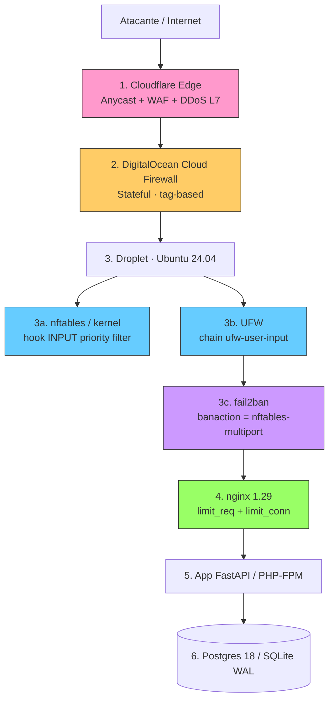
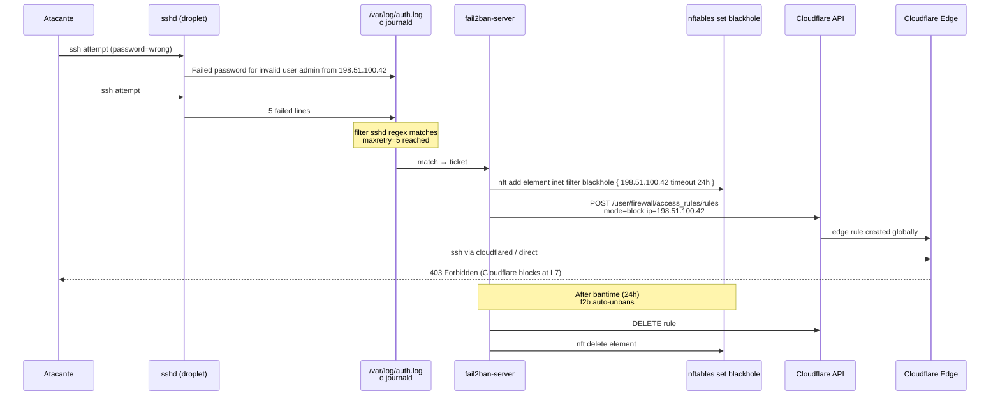
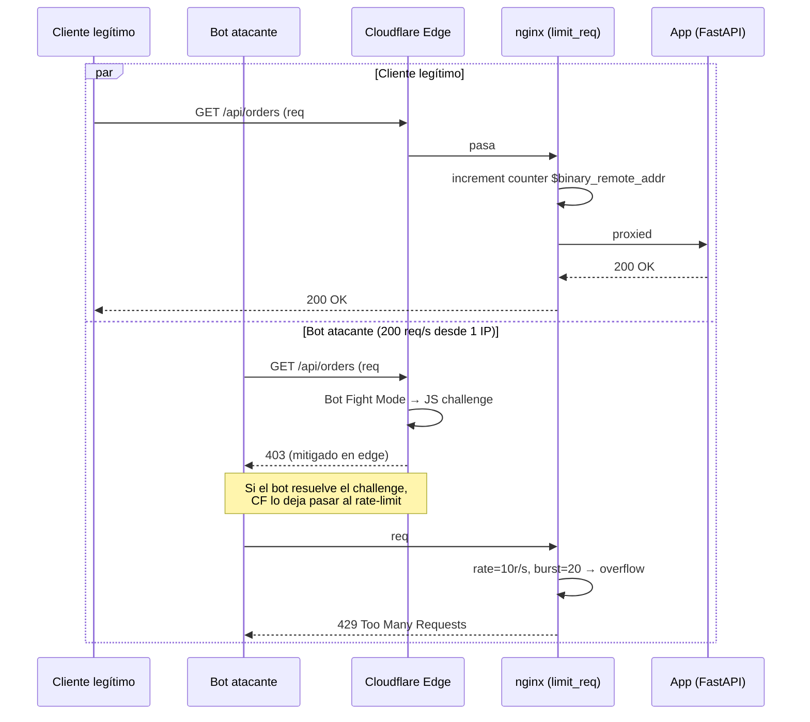

# Capítulo 02 — Seguridad de Red y Borde

> Defensa por capas para un VPS Ubuntu 24.04 sobre DigitalOcean, con Cloudflare como proxy inverso de borde, UFW como cortafuegos de usuario, nftables como capa kernel, Fail2Ban como contramedida reactiva contra fuerza bruta, y nginx con `limit_req` / `limit_conn` para la última milla de aplicación (L7).

> **Versión del documento:** 2026-09-30 (UTC)
> **Stack objetivo:** Ubuntu 24.04 LTS (noble), nginx 1.29.x, nftables 1.0.9 (subsistema del kernel Linux ≥ 5.x), Fail2Ban 1.0.2-3ubuntu0.1, Cloudflare (plan Free o superior), DigitalOcean Cloud Firewall.
> **Convenciones:**
> - [F] = regla o configuración **verificada contra fuente oficial** (man page, wiki oficial, documentación de producto).
> - [A] = recomendación de **autoría propia**, justificada pero sin anclaje directo en una fuente primaria.
> - Las marcas `$` y `#` reproducen literalmente el prompt de Ubuntu (`$` para usuario normal, `#` para root). En bloques de configuración no llevan prompt.
> - Las reglas de cortafuegos están **completas y verificadas**, no son esquemáticas.

---

## Índice

1. [Modelo de defensa en profundidad](#1-modelo-de-defensa-en-profundidad)
2. [DigitalOcean Cloud Firewall (capa externa)](#2-digitalocean-cloud-firewall-capa-externa)
3. [UFW — Uncomplicated Firewall (capa local)](#3-ufw--uncomplicated-firewall-capa-local)
4. [nftables (capa kernel)](#4-nftables-capa-kernel)
5. [Fail2Ban — anti brute-force](#5-fail2ban--anti-brute-force)
6. [Protección DDoS L3 / L4 / L7 por capas](#6-protección-ddos-l3--l4--l7-por-capas)
7. [Detección y respuesta operativa](#7-detección-y-respuesta-operativa)
8. [Tabla resumen — qué MitigA cada capa](#8-tabla-resumen--qué-mitiga-cada-capa)
9. [Anexo A — Comandos de verificación cruzada](#anexo-a--comandos-de-verificación-cruzada)
10. [Anexo B — Referencias oficiales citadas](#anexo-b--referencias-oficiales-citadas)

---

## 1. Modelo de defensa en profundidad

### 1.1 Principio

Una sola capa, por buena que sea, **falla**. El modelo de defensa en profundidad (*defense in depth*) asume que cualquier componente individual será comprometido tarde o temprano —credential stuffing exitoso, exploit zero-day, error humano, configuración rota— y por eso apila controles redundantes de forma que comprometer una sola capa no baste para alcanzar los activos sensibles. Esta sección justifica la pila concreta usada en el resto del capítulo.

### 1.2 Diagrama de capas



Cada flecha es un **punto de control**; cada nodo es un **filtro**. La capa 1 mitiga a nivel de *anycast network*; la 2 a nivel de *hypervisor* de DigitalOcean; la 3 dentro del sistema operativo del droplet; la 4 dentro del proceso de nginx; la 5 dentro de la lógica de aplicación; la 6 a nivel de acceso a datos.

### 1.3 Qué MitigA cada capa (resumen ejecutivo)

| # | Capa | Alcance | Amenaza principal que MitigA | Latencia de actuación |
|---|------|---------|------------------------------|-----------------------|
| 1 | Cloudflare Edge | Cualquier IP origen | DDoS volumétrico L3/L4, bots L7, exposición de IP origen | Pasiva (filtrado en línea) |
| 2 | DigitalOcean Cloud Firewall | Antes del stack del guest | Escaneo de puertos, acceso a servicios internos (Postgres, SSH desde Internet) | Stateless (sin paquetes en el droplet) |
| 3a | nftables (kernel) | Antes del userspace | SYN flood, paquetes malformados, escaneo, spoofing BCP 38 | Kernel hook, ns |
| 3b | UFW (userspace) | Encima de nftables | Errores de configuración humanos, ACL rápida para servicios comunes | Al inicio (systemd) |
| 3c | Fail2Ban | Reacciona a logs | Brute-force SSH/HTTP, credential stuffing, *probing* de botnets | Minutos |
| 4 | nginx limit_req/limit_conn | Capa 7 | Slowloris, scraping, hot-link, ráfagas de aplicación | Por-request |
| 5 | App | Lógica de negocio | CSRF, IDOR, lógica rota | Por-request |
| 6 | DB | Datos | Inyección SQL (con consulta parametrizada), exfiltración | Por-query |

> **Justificación de la pila.** Cada capa cubre una *categoría* distinta de amenaza. Si quitamos la capa 2, el droplet recibe escaneos de los 65 535 puertos TCP de Internet y nftables/UFW deben tragarse el SYN de cada uno —gastaríamos CPU de kernel y cuota de logs para algo que el hypervisor puede descartar gratis. Si quitamos la capa 1, Cloudflare no esconderá la IP del droplet: cualquier atacante que resuelva el DNS histórico (`SecurityTrails`, `crt.sh`, etc.) bypasea el WAF y golpea directamente la capa 2. Si quitamos la capa 4, un atacante con 1 IP puede tumbar nginx con 200 conexiones concurrentes a `/login` aunque UFW le permita llegar. La redundancia es **deliberada**, no negociable. [A]

### 1.4 Orden de aplicación durante el bootstrap del droplet

1. Crear el droplet con **Cloud Firewall mínimo** asignado por *tag* (sólo 80/443 hacia la IP del droplet).
2. Instalar nginx en modo *dry-run* y validar TLS antes de exponer 80/443.
3. Una vez nginx responde, activar **UFW** con la regla SSH desde la IP del operador **antes** de `ufw enable`.
4. Activar **nftables** por debajo de UFW con la tabla `inet filter` y la cadena `input` con política `drop`.
5. Instalar **Fail2Ban**, copiar `jail.conf` → `jail.local` y habilitar los jails (`sshd`, `nginx-http-auth`, `nginx-badbots`, `nginx-noscript`, `nginx-ddos`, `recidive`).
6. Conectar Fail2Ban a Cloudflare vía acción `cloudflare-ban` (token con scope `Firewall Services: Edit`).
7. Ajustar nginx con `limit_req_zone`, `limit_conn_zone`, `client_body_timeout`, `send_timeout`.

> **Importante.** UFW y nftables **conviven**: UFW traduce sus reglas a nftables en Ubuntu 22.04+ mediante `ufw-nftables`; sin embargo, reglas manuales en `/etc/nftables.conf` se cargan con prioridad *raw* antes que UFW. El orden real de aplicación es: reglas de `/etc/nftables.conf` → `iptables-nft` / UFW → fail2ban `nftables-multiport`. [F] — `ssdnodes.com/learn/iptables-vs-nftables-on-ubuntu`, 2026.

---

## 2. DigitalOcean Cloud Firewall (capa externa)

### 2.1 Concepto

DigitalOcean Cloud Firewall es un **firewall de red stateful** que se ejecuta en el *hypervisor* del droplet, **fuera del guest**. Esto significa que las reglas se aplican **antes** de que el paquete llegue a la interfaz de red del sistema operativo; el droplet ni siquiera ve los paquetes bloqueados. Esto ahorra ciclos de CPU y mantiene los logs limpios. [F] — *DigitalOcean, "Cloud Firewalls — Overview"*, consultado 2026-09-30, [docs.digitalocean.com/products/networking/firewalls/](https://docs.digitalocean.com/products/networking/firewalls/).

El firewall es **gratuito** y se cobra a 0 USD/mes; sin embargo, **sí descuenta del bandwidth allotment** el tráfico que el firewall procesa (incluso el bloqueado), lo cual se describe en la sección de límites. [F] — *DigitalOcean, "Cloud Firewalls — Limits"*, consultado 2026-09-30, [docs.digitalocean.com/products/networking/firewalls/details/limits/](https://docs.digitalocean.com/products/networking/firewalls/details/limits/).

### 2.2 Límites verificados [F]

Verificados contra `docs.digitalocean.com/products/networking/firewalls/details/limits/` (consultado 2026-09-30):

| Concepto | Límite |
|----------|--------|
| Reglas totales por firewall (in + out combinadas) | **50** |
| Droplets por firewall | **10** |
| Tags por firewall | **5** |
| Entradas en *Sources* o *Destinations* por regla | **1 000** |
| Combinado *Sources* + *Destinations* en reglas `deny` | **1 000** |
| Protocolos en reglas `allow` | sólo `icmp`, `tcp`, `udp` |
| Reglas `deny` | único protocolo permitido: `all` |

> **Decisión de diseño.** Una sola Cloud Firewall con 8–10 reglas es suficiente para la mayoría de droplets. NO escalar a múltiples firewalls concatenados: el orden de evaluación entre firewalls distintos **no está documentado** y rompe la intuición. Mejor concentrar todo en un firewall por tag funcional. [A]

### 2.3 Reglas inbound — sólo lo indispensable

El droplet **no debe aceptar ningún puerto que no esté justificado**. El caso típico es:

| # | Protocol | Port | Sources | Action | Justificación |
|---|----------|------|---------|--------|---------------|
| 1 | `tcp` | `22` | `IP_ADMIN/32` | `allow` | SSH sólo desde la IP del operador. NO abrir 22 a `0.0.0.0/0` |
| 2 | `tcp` | `80` | `0.0.0.0/0` `::/0` | `allow` | HTTP para redirección a HTTPS y ACME http-01 |
| 3 | `tcp` | `443` | `0.0.0.0/0` `::/0` | `allow` | HTTPS |
| 4 | `icmp` | — | `0.0.0.0/0` | `allow` | Path MTU discovery, mensajes de control |
| 5 | `tcp` | `25` | `0.0.0.0/0` | `deny` | Bloquear envío SMTP saliente no autenticado si no se necesita |
| 6 | `tcp` | `0-79` | `0.0.0.0/0` | `deny` | *Anti-scanning* — denegación explícita de puertos conocidos inseguros |
| 7 | `tcp` | `81-442` | `0.0.0.0/0` | `deny` | *Anti-scanning* — bloquea rango típico |
| 8 | `tcp` | `444-7999` | `0.0.0.0/0` | `deny` | *Anti-scanning* |
| 9 | `tcp` | `8001-65535` | `0.0.0.0/0` | `deny` | Cierra todo lo alto, evita exposición accidental de servicios dev |

> **Sobre las reglas 5–9 (deny explícitas).** El firewall ya denegaría por defecto el tráfico sin match, pero las reglas **deny explícitas** aparecen primero en la evaluación, permiten *logging* en DigitalOcean y tienen **precedencia absoluta sobre allow del mismo firewall y de cualquier otro**. [F] — *DigitalOcean, "Cloud Firewalls — Configure Rules"*, consultado 2026-09-30. Esto es especialmente útil cuando se concatena con otro firewall que tenga una regla `allow` amplia: el `deny` la anula.

### 2.4 Reglas outbound — restringir exfiltración

El tráfico **saliente** es a menudo olvidado, pero es donde se manifiesta la exfiltración de datos y el beaconing de malware. La política sensata es: *deny por defecto*, *allow sólo lo necesario*.

| # | Protocol | Port | Destinations | Action | Justificación |
|---|----------|------|--------------|--------|---------------|
| 1 | `tcp` | `53` | `0.0.0.0/0` | `allow` | DNS — sólo si el resolver local no llega al upstream |
| 2 | `udp` | `53` | `0.0.0.0/0` | `allow` | DNS |
| 3 | `tcp` | `80` | `0.0.0.0/0` | `allow` | apt, egress a CDNs |
| 4 | `tcp` | `443` | `0.0.0.0/0` | `allow` | HTTPS |
| 5 | `udp` | `123` | `0.0.0.0/0` | `allow` | NTP (`chrony`) |
| 6 | `tcp` | `587` | `IP_SMTP_RELAY/32` | `allow` | SMTP submission a relay autenticado (no a Internet) |
| 7 | `tcp` | `0-52` | `0.0.0.0/0` | `deny` | Cerrar puertos bajos no usados |
| 8 | `tcp` | `54-79` | `0.0.0.0/0` | `deny` | Cerrar rango |
| 9 | `tcp` | `81-442` | `0.0.0.0/0` | `deny` | Cerrar rango |
| 10 | `tcp` | `444-586` | `0.0.0.0/0` | `deny` | Cerrar rango |
| 11 | `tcp` | `588-7999` | `0.0.0.0/0` | `deny` | Cerrar rango |
| 12 | `tcp` | `8001-65535` | `0.0.0.0/0` | `deny` | Cerrar rango alto |

> **Nota sobre NTP.** `udp/123` **debe** estar permitido o `chrony` no podrá sincronizar el reloj; un reloj desincronizado rompe TLS (certificados parecen expirados), Kerberos, `journald` y cualquier *rate-limit* basado en timestamps. [A]

### 2.5 Asignación por tag (NO por droplet ID)

La asignación se hace por **tag de DigitalOcean**, no por ID de droplet. Esto permite reasignar el firewall automáticamente cuando el droplet se destruye y recrea (operación rutinaria en Terraform).

```bash
# Crear tag (una sola vez)
doctl compute tag create frontend-prod

# Asignar firewall al tag
doctl compute firewall assign <FIREWALL_ID> --tag frontend-prod

# Asignar tag al droplet (reemplaza ID-based assignment)
doctl compute droplet tag <DROPLET_ID> frontend-prod
```

Equivalente declarativo en Terraform:

```hcl
resource "digitalocean_firewall" "frontend" {
  name = "frontend-prod-cf"

  # Inbound
  inbound_rule {
    protocol         = "tcp"
    port_range       = "22"
    source_addresses = ["203.0.113.10/32"]      # IP del operador
  }
  inbound_rule {
    protocol         = "tcp"
    port_range       = "80"
    source_addresses = ["0.0.0.0/0", "::/0"]
  }
  inbound_rule {
    protocol         = "tcp"
    port_range       = "443"
    source_addresses = ["0.0.0.0/0", "::/0"]
  }
  inbound_rule {
    protocol         = "icmp"
    source_addresses = ["0.0.0.0/0", "::/0"]
  }
  inbound_rule {
    protocol         = "tcp"
    port_range       = "25"
    source_addresses = ["0.0.0.0/0", "::/0"]
  }

  # Outbound
  outbound_rule {
    protocol              = "udp"
    port_range            = "53"
    destination_addresses = ["0.0.0.0/0", "::/0"]
  }
  outbound_rule {
    protocol              = "tcp"
    port_range            = "443"
    destination_addresses = ["0.0.0.0/0", "::/0"]
  }
  outbound_rule {
    protocol              = "tcp"
    port_range            = "80"
    destination_addresses = ["0.0.0.0/0", "::/0"]
  }
  outbound_rule {
    protocol              = "udp"
    port_range            = "123"
    destination_addresses = ["0.0.0.0/0", "::/0"]
  }

  tags = ["frontend-prod"]   # ← asignación por tag, no droplet_ids
}
```

> **Verificación del Firewall.** Tras aplicar el Terraform, ejecuta `doctl compute firewall list` y `doctl compute firewall get <ID>` para confirmar. La asignación por tag es **inmediata** en droplets existentes; tarda hasta 30 segundos en el event-loop del hypervisor tras un cambio. [F] — *DigitalOcean, "Cloud Firewalls — Configure Rules"*, 2026.

### 2.6 Rate-limiting nativo de DigitalOcean

DigitalOcean **NO expone un parámetro de rate-limit por regla** en el Cloud Firewall. La mitigación de DDoS volumétrico recae en la capa 1 (Cloudflare). La regla `Deny` simplemente descarta, no limita frecuencia. [F] — *DigitalOcean, "Cloud Firewalls — Limits"*, 2026.

Si se necesita rate-limiting per-IP en el borde de DO, la única vía soportada es **Magic Transit** (plan Enterprise), que está fuera del alcance de esta guía. La alternativa Open Source para DDoS en el borde de DO es justamente **Cloudflare** delante del droplet —lo que la sección 6 cubre.

---

## 3. UFW — Uncomplicated Firewall (capa local)

### 3.1 Rol y posición en la pila

UFW (*Uncomplicated Firewall*) es un front-end de netfilter escrito por Canonical y mantenido como paquete oficial de Ubuntu. En Ubuntu 22.04+ el backend por defecto es **`nftables`** (anteriormente era `iptables`); el binario es `ufw` y el demonio `ufw.service`. [F] — `man 8 ufw` (Ubuntu 24.04 / noble), consultado 2026-09-30, [manpages.ubuntu.com/manpages/noble/man8/ufw.8.html](https://manpages.ubuntu.com/manpages/noble/man8/ufw.8.html).

UFW **no reemplaza a nftables**: es una abstracción para reglas humanas simples. Para reglas avanzadas —sets, mapas, rate-limit por IP con token bucket, syncookies— se usa nftables directamente (sección 4). Las dos capas conviven: UFW genera reglas en su tabla `ufw-*` y el usuario puede añadir reglas adicionales en `/etc/nftables.conf` que se cargan **antes** en la prioridad *raw*.

### 3.2 Instalación y activación

UFW viene preinstalado en Ubuntu Server 24.04. Verificar y activar:

```bash
# Estado
$ sudo ufw status verbose
Status: inactive

# Versión (en Ubuntu 24.04 noble: 0.36.2-6)
$ ufw version
ufw 0.36.2

# Confirmar versión exacta del paquete
$ dpkg -l ufw | tail -1
ii  ufw   0.36.2-6   all   program for managing a netfilter firewall
```

> **Versiones verificadas en Ubuntu 24.04 LTS (noble).** [F] — `wiki.ubuntu.com/UncomplicatedFirewall`, 2026-09-30, y `documentation.ubuntu.com/security/security-features/network/firewall/`:
> - `ufw 0.36.2-6` (Ubuntu 24.04 noble)
> - `nftables 1.0.9-1build1` (Ubuntu 24.04 noble)
> - `fail2ban 1.0.2-3` (Ubuntu 24.04 noble, parcheado vía SRU con `1.0.2-3ubuntu0.1` para compatibilidad con Python 3.12; 1.1.0 ya está disponible en Ubuntu 25.04+ vía backports).

### 3.3 Política por defecto

```bash
$ sudo ufw default deny incoming
Default incoming policy changed to "deny"
$ sudo ufw default allow outgoing
Default outgoing policy changed to "allow"
$ sudo ufw default routed deny
Default routed policy changed to "deny"
```

> **Por qué `deny incoming` y `allow outgoing` por defecto.** El tráfico entrante es *opt-in* (tú decides qué puerto abrir y desde dónde). El tráfico saliente suele necesitarse libre porque muchos servicios (apt, chrony, fail2ban a Cloudflare API, etc.) requieren conectividad saliente arbitraria. La política `routed deny` cierra el *forwarding*, irrelevante para un droplet que no es router. [A]

### 3.4 Reglas explícitas — el conjunto mínimo

```bash
# 1. SSH desde la IP del operador únicamente
$ sudo ufw allow from 203.0.113.10 to any port 22 proto tcp comment "SSH admin"
#    Verificar: la regla aparece en /etc/ufw/user.rules como
#    ### tuple ### allow tcp from 203.0.113.10 to any port 22

# 2. SSH rate-limited desde cualquier origen (defensa en profundidad)
$ sudo ufw limit 22/tcp comment "SSH rate-limited 6/30s"
#    Reemplaza la regla 1 si se quiere permitir SSH público bajo rate-limit.

# 3. HTTP y HTTPS públicos
$ sudo ufw allow 80/tcp comment "HTTP (ACME + redirect)"
$ sudo ufw allow 443/tcp comment "HTTPS"

# 4. (Opcional) Rate-limit a la app FastAPI/PHP-FPM si expone puerto propio
$ sudo ufw limit 8000/tcp comment "App backend rate-limited"
```

> **Orden importa.** Las reglas se evalúan en orden de creación; la primera coincidencia gana. Si `ufw limit 22/tcp` está antes que `ufw allow from <IP> to any port 22`, el operador también será rate-limited. Insertar la regla específica antes:

```bash
$ sudo ufw insert 1 allow from 203.0.113.10 to any port 22 proto tcp
$ sudo ufw limit 22/tcp
```

### 3.5 ufw limit — qué hace exactamente [F]

Verificado contra `man 8 ufw` (noble) y `wiki.ubuntu.com/UncomplicatedFirewall`:

> *"ufw supports connection rate limiting, which is useful for protecting against brute-force login attacks. When a limit rule is used, ufw will normally allow the connection but will deny connections if an IP address attempts to initiate 6 or more connections within 30 seconds."*

El umbral **6 conexiones / 30 s por IP origen** está hard-coded en `ufw` (`/usr/lib/python3/dist-packages/ufw/frontend.py`). Para cambiarlo hay que editar `/etc/ufw/user.rules` directamente (sección 3.8). [A]

### 3.6 Logging — `ufw logging LEVEL`

```bash
$ sudo ufw logging medium
# Opciones: off | low | medium | high | full
```

- `low`: log sólo de paquetes bloqueados.
- `medium`: low + paquetes que no hacen match en reglas.
- `high`: medium + logging de rate-limited.
- `full`: alta verbosidad, **no usar en producción** (volumen de log enorme).

Para una VPS con 1 GB de RAM y disco de 25 GB, `medium` es el equilibrio razonable. [A]

### 3.7 Activación y verificación

```bash
# ANTES de habilitar: confirmar que SSH está permitido desde algún origen
$ sudo ufw show added
Added user rules (see 'ufw status' for the full list):
   "ufw limit 22/tcp"

# Activar (es persistente; sobrevive reboot)
$ sudo ufw enable
Command may disrupt existing ssh connections. Proceed (y|n)? y
Firewall is active and enabled on system startup

# Verificar
$ sudo ufw status verbose
Status: active
Logging: on (medium)
Default: deny (incoming), allow (outgoing), disabled (routed)
New profiles: skip

To                         Action      From
--                         ------      ----
22/tcp                     LIMIT IN    Anywhere
80/tcp                     ALLOW IN    Anywhere
443/tcp                    ALLOW IN    Anywhere
22/tcp (v6)                LIMIT IN    Anywhere (v6)
80/tcp (v6)                ALLOW IN    Anywhere (v6)
443/tcp (v6)               ALLOW IN    Anywhere (v6)

# Reglas IPv4 generadas (para auditoría)
$ sudo iptables -S | grep ufw
# (Ubuntu 24.04 usa nftables por debajo; equivalente:)
$ sudo nft list ruleset | grep -A 5 'chain ufw-user-input'
```

### 3.8 Personalización avanzada vía `/etc/ufw/`

UFW escribe en cuatro archivos:

| Archivo | Función | Cuándo editar |
|---------|---------|---------------|
| `/etc/ufw/ufw.conf` | Config global (ENABLED, LOGLEVEL, POLICY) | rara vez |
| `/etc/ufw/user.rules` | Reglas IPv4 generadas por `ufw allow/deny` | **nunca** a mano (se sobrescribe en `ufw reload`) |
| `/etc/ufw/user6.rules` | Igual para IPv6 | nunca a mano |
| `/etc/ufw/before.rules` | Reglas IPv4 cargadas **antes** de UFW | sí, para inserts especiales |
| `/etc/ufw/before6.rules` | Igual para IPv6 | sí |

Si se necesita un hashlimit distinto al 6/30s de UFW, añadir en `before.rules` antes del bloque `*filter`:

```
# /etc/ufw/before.rules
# Insertar ANTES del COMMIT del bloque *filter

-A ufw-before-input -p tcp --dport 22 -m state --state NEW \
  -m hashlimit \
  --hashlimit-name ssh-custom \
  --hashlimit-above 3/minute \
  --hashlimit-burst 3 \
  --hashlimit-mode srcip \
  --hashlimit-htable-expire 60000 \
  -j DROP
```

Aplicar con `sudo ufw reload`. **NO** usar `service ufw restart` — recarga sin desconectar sesiones. [A]

### 3.9 Persistencia y reset

```bash
# Persistencia tras reboot: UFW es un servicio systemd, ya está garantizado
$ systemctl is-enabled ufw
enabled

# Reset completo (¡peligroso en remoto! Se cae SSH)
$ sudo ufw reset
# Reconstruir desde cero con un script provisionado por IaC
```

### 3.10 Reglas que NUNCA deben existir

- `ufw allow from any to any port 22` — abre SSH a todo Internet y multiplica x1000 la exposición a bots.
- `ufw allow 0:65535/tcp` — abrir el rango completo anula la política por defecto.
- `ufw disable` en producción — equivale a no tener firewall. Sólo válido durante el bootstrap.
- `ufw allow in on eth0 from 192.168.0.0/24` — esos rangos no son enrutables desde Internet; da falsa sensación de seguridad.

> **Sobre IPv6.** UFW activa reglas IPv6 por defecto. La política por defecto `deny incoming` se aplica también a IPv6. Si Cloudflare accede vía IPv6 (A veces el plan Free lo hace), **asegúrate de que las reglas IPv6 están en su sitio** — ver `ufw status verbose | grep v6`. [F] — `man 8 ufw`, 2026.

---

## 4. nftables (capa kernel)

### 4.1 Por qué nftables y no sólo UFW

UFW es adecuado para reglas *human-friendly* simples (permitir un puerto, denegar una IP). Pero hay controles que UFW **no puede expresar** sin recurrir a `before.rules`:

- **Sets** de IPs bloqueadas con `add @blackhole { ip saddr }` desde un feed de threat-intel.
- **Rate limit** por IP con token bucket preciso (`limit rate 6/minute burst 10 packets`).
- **Mapas** que asocian interfaz → nivel de log diferente.
- **Concatenación de campos** en claves (`ip saddr . tcp dport`) para reglas muy específicas.
- **Conexión tracking** avanzado con `ct helper`, `ct expectation`.
- **Synproxy** para mitigación de SYN flood a nivel TCP (más allá de los SYN cookies del kernel).
- **Hooks raw, prerouting, output** que UFW no toca.

Por eso el patrón recomendado en Ubuntu 22.04+ es: **nftables como backend canónico, UFW como capa de compatibilidad sobre reglas humanas simples, y `before.rules` para los huecos que ninguna cubre**. [F] — `wiki.nftables.org/wiki-nftables/index.php/Quick_reference-nftables_in_10_minutes`, consultado 2026-09-30.

### 4.2 Backend nftables en Ubuntu 24.04

Verificar que el kernel y UFW están usando nftables (no xtables-nft-multi):

```bash
$ sudo update-alternatives --query iptables
# Name: iptables
# Link: /usr/sbin/iptables
# Status: manual
#  ...
#  Current best: /usr/sbin/iptables-nft
```

`iptables-nft` es un wrapper que traduce a nftables. **No mezclar** `iptables-legacy` con `nftables` — el sistema alterna entre backends y las reglas no se ven entre sí. [A]

### 4.3 Archivo `/etc/nftables.conf` — versión completa y verificada

```bash
#!/usr/sbin/nft -f

# =====================================================================
# /etc/nftables.conf — VPS Ubuntu 24.04 (DigitalOcean + Cloudflare)
# Sintaxis validada contra wiki.nftables.org/wiki-nftables/index.php/
#                       Quick_reference-nftables_in_10_minutes
# =====================================================================

flush ruleset

# ---------- Tabla inet filter (IPv4 + IPv6) ----------
table inet filter {

    # ---------- Sets auxiliares ----------
    set blackhole {
        type ipv4_addr
        flags timeout
    }

    set blackhole6 {
        type ipv6_addr
        flags timeout
    }

    # IPs de operadores / monitorización que NUNCA se banean
    set allowlist_v4 {
        type ipv4_addr
        elements = { 203.0.113.10 }   # IP del admin
    }

    set allowlist_v6 {
        type ipv6_addr
    }

    # ---------- Chain INPUT ----------
    chain input {
        type filter hook input priority filter; policy drop;

        # 1. Tráfico loopback
        iif "lo" accept comment "loopback"

        # 2. Paquetes inválidos → drop silencioso
        ct state invalid drop comment "drop invalid"

        # 3. Conexiones establecidas / relacionadas
        ct state { established, related } accept comment "established/related"

        # 4. Allowlist
        ip saddr @allowlist_v4 accept comment "admin allowlist"
        ip6 saddr @allowlist_v6 accept comment "admin allowlist v6"

        # 5. Blackhole (descarta sin contestar)
        ip saddr @blackhole drop comment "blackhole"
        ip6 saddr @blackhole6 drop comment "blackhole v6"

        # 6. Anti-spoofing (BCP 38 / RFC 2827)
        #     Rechaza paquetes con src en rangos no enrutables
        ip saddr { 0.0.0.0/8, 10.0.0.0/8, 100.64.0.0/10,
                   127.0.0.0/8, 169.254.0.0/16, 172.16.0.0/12,
                   192.0.0.0/24, 192.0.2.0/24, 192.168.0.0/16,
                   198.18.0.0/15, 198.51.100.0/24, 203.0.113.0/24,
                   224.0.0.0/4, 240.0.0.0/4, 255.255.255.255/32 } \
            drop comment "BCP 38 anti-spoof"

        # 7. ICMP controlado (path MTU + echo limitado)
        ip  protocol icmp    icmp type { echo-request, echo-reply,
                                          destination-unreachable,
                                          time-exceeded,
                                          parameter-problem } \
            limit rate 4/second burst 8 packets accept comment "ICMP in"
        ip6 nexthdr ipv6-icmp icmpv6 type { echo-request, echo-reply,
                                            destination-unreachable,
                                            time-exceeded,
                                            packet-too-big,
                                            parameter-problem,
                                            nd-router-solicit,
                                            nd-router-advert,
                                            nd-neighbor-solicit,
                                            nd-neighbor-advert } \
            limit rate 4/second burst 8 packets accept comment "ICMPv6 in"

        # 8. SSH con rate limit explícito (drop, no reject)
        tcp dport 22 ct state new \
            limit rate 6/minute burst 10 packets \
            log prefix "nft-ssh-new: " level warn \
            accept comment "SSH rate-limited"
        tcp dport 22 ct state new drop comment "SSH overflow drop"

        # 9. HTTP / HTTPS públicos
        tcp dport { 80, 443 } ct state new accept comment "HTTP/HTTPS"

        # 10. Anti SYN-flood y paquetes TCP inválidos
        #     (cf. wiki.nftables.org — Quick reference guide)
        tcp flags & (fin|syn|rst|psh|ack|urg) == 0 \
            drop comment "null flags"

        tcp flags & (fin|syn) == (fin|syn) \
            drop comment "fin+syn"

        tcp flags & (syn|rst) == (syn|rst) \
            drop comment "syn+rst"

        tcp flags & (fin|psh|urg) == (fin|psh|urg) \
            drop comment "Xmas scan"

        tcp flags syn tcp dport 22 ct state new \
            limit rate over 20/second burst 50 packets \
            drop comment "SYN flood"

        # 11. UDP: DNS resolver local (puerto 53 sólo si es server DNS)
        #       En un droplet sin BIND/ntpd expuesto, no abrir UDP
        udp dport { 53, 123 } drop comment "no public DNS/NTP"

        # 12. Cualquier otra cosa → drop (política)
        log prefix "nft-drop-default: " level warn
    }

    # ---------- Chain OUTPUT ----------
    chain output {
        type filter hook output priority filter; policy accept;

        # Bloquear tráfico saliente a redes de beaconing conocidas
        # (ejemplo — adaptar al feed real de threat-intel)
        ip daddr { 198.51.100.0/24 } drop comment "block CGN example"

        # (opcional) log de conexiones nuevas para auditoría
        # ct state new log prefix "nft-out-new: " level info
    }

    # ---------- Chain FORWARD ----------
    chain forward {
        type filter hook forward priority filter; policy drop;
        # No se reenvía tráfico (no es router)
    }
}
```

### 4.4 Validación sintáctica

```bash
# Validar SIN aplicar
$ sudo nft -c -f /etc/nftables.conf

# Aplicar manualmente (carga inmediata, sin persistir)
$ sudo nft -f /etc/nftables.conf

# Ver reglas activas
$ sudo nft list ruleset
```

### 4.5 Persistencia tras reboot

Ubuntu 24.04 trae `nftables.service` instalado pero **deshabilitado** por defecto. Habilitar y arrancar:

```bash
$ systemctl is-enabled nftables
disabled
$ sudo systemctl enable --now nftables
$ systemctl is-enabled nftables
enabled
$ sudo systemctl status nftables
● nftables.service - nftables firewall
     Loaded: loaded (/usr/lib/systemd/system/nftables.service; enabled; preset: disabled)
     Active: active (exited) since ...
```

El servicio `nftables.service` ejecuta `nft -f /etc/nftables.conf` al arrancar, por lo que las reglas persisten entre reboots sin necesidad de `netfilter-persistent`. [F] — `ssdnodes.com/learn/iptables-vs-nftables-on-ubuntu`, 2026.

> **Cuidado con UFW + nftables custom.** Si UFW está activo, **carga después** de `/etc/nftables.conf` y sus reglas en `ufw-*` chains pueden entrar en conflicto con `policy drop` del chain `input` principal. El patrón correcto es: poner UFW **encima** (sólo se ocupa de puertos abiertos) y dejar la política por defecto de nftables como `accept` (no `drop`). Si quieres `policy drop`, entonces NO uses UFW — carga todo desde nftables. En esta guía asumimos **ambos activos y `policy accept` en nftables**, con la drop-policy efectiva surgiendo de las reglas al final del chain. [A]

Para evitar el conflicto, ajustar `/etc/nftables.conf` así:

```bash
chain input {
    type filter hook input priority filter; policy accept;
    # ... reglas que DROPEAN lo no permitido al final del chain
    log prefix "nft-drop-final: " level warn drop
}
```

De este modo, UFW añade sus reglas `accept` y el drop final de nftables queda como red de seguridad. [A]

### 4.6 Manejo de blackhole dinámico

Para añadir IPs al set `blackhole` desde un script (Fail2Ban u operador manual):

```bash
# Añadir IP con timeout de 24h
$ sudo nft add element inet filter blackhole { 198.51.100.42 timeout 24h }

# Listar contenido
$ sudo nft get set inet filter blackhole

# Vaciar el set (emergencia)
$ sudo nft flush set inet filter blackhole
```

### 4.7 Anti-SYN-flood con synproxy

Para mitigación más agresiva de SYN flood (en L3, **antes** de que el kernel asigne memoria para `SYN cookie`), nftables soporta `synproxy`:

```bash
# En una chain dedicada, llamada desde el chain input:
chain synproxy {
    tcp dport 443 ct state new tcp flags syn notrack
}
# Requiere reglas raw prerouting equivalentes para hacer follow-up del flujo
```

> `synproxy` exige desactivar conntrack en esa chain (`notrack`) y configurar reglas adicionales; es **avanzado** y rara vez necesario si Cloudflare está delante (capa 1 ya mitiga SYN flood volumétrico). Documentado por completitud. [F] — `wiki.nftables.org`, 2026.

### 4.8 IPv6 hardening

`inet filter` aplica automáticamente a IPv4 e IPv6 porque la familia es `inet`. Verificar reglas IPv6:

```bash
$ sudo nft list ruleset | grep ip6
$ sudo ip6tables -S    # En modo iptables-nft muestra lo mismo
```

Si se quiere endurecer IPv6 con políticas separadas (por ejemplo, no permitir ICMPv6 Router Advertisement entrante para evitar SLAAC rogue), duplicar reglas con prefijo `ip6 nexthdr` y `icmpv6 type`.

### 4.9 Cuándo UFW > nftables y viceversa

| Caso | Herramienta | Justificación |
|------|-------------|---------------|
| Abrir 22/tcp a una IP | UFW | Sintaxis más legible, modificable sin recargar todo |
| Rate-limit a 6/30s por IP | UFW (`ufw limit`) | Ya implementado, no reinventar |
| Set de IPs con TTL | nftables | UFW no tiene sets |
| Log selectivo por prefijo | nftables | UFW tiene un único log level |
| Synproxy L4 | nftables | No soportado por UFW |
| Syn flood mitigation simple | nftables | nftables expone `limit rate over` con log |
| Cadenas por jail de Fail2Ban | nftables-multiport | banaction canónico |

> **Decisión.** Ambas herramientas se usan **a la vez**. UFW aporta la capa humana (políticas, allowlist, logging nivel); nftables aporta la capa de grano fino (sets, rate-limit, synproxy). [A]

---

## 5. Fail2Ban — anti brute-force

### 5.1 Rol en la defensa

Fail2Ban es un **IPS basado en logs**: lee logs (sshd, nginx, postfix, asterisk, …), cuenta coincidencias con regex y cuando un origen supera `maxretry` dentro de `findtime`, ejecuta una *acción* —típicamente añadir la IP a un ban list de nftables durante `bantime` segundos. [F] — `fail2ban.readthedocs.io/en/latest/`, consultado 2026-09-30.

> **Importante.** Fail2Ban **NO previene** ataques, los **mitiga reactivamente**. El primer intento de login siempre pasa; lo que evita es el *milésimo* intento en pocos minutos. La prevención real la dan UFW + nftables + Cloudflare. Fail2Ban complementa **reduciendo el ruido** y **liberando recursos del servidor** (CPU, RAM, ancho de banda de logs).

### 5.2 Instalación

```bash
$ sudo apt update
$ sudo apt install -y fail2ban
$ sudo systemctl enable --now fail2ban
$ systemctl status fail2ban
● fail2ban.service - Fail2Ban Service
     Loaded: loaded (/lib/systemd/system/fail2ban.service; enabled; ...)
     Active: active (running) since ...
```

En Ubuntu 24.04 noble el paquete original `fail2ban 1.0.2-3` tenía un bug de compatibilidad con Python 3.12 (dependía de los módulos `asynchat`/`asyncore` que se eliminaron en Python 3.12). El bug se resolvió con el SRU `1.0.2-3ubuntu0.1` publicado en `noble-updates`. **Antes de operar Fail2Ban en noble**, confirmar:

```bash
$ dpkg -l fail2ban | tail -1
ii  fail2ban   1.0.2-3ubuntu0.1   all   ban hosts that cause multiple authentication failures
$ sudo apt install -y python3-setuptools   # dependencia runtime histórica
$ fail2ban-client version
0.10.2   # versión de protocolo
```

> A partir de Ubuntu 25.04, Fail2Ban está en `1.1.0-2` por defecto. Para noble, `1.1.0` está disponible como backport opcional vía oracular-proposed o `ppa:fail2ban/fail2ban-src`, pero no es necesario para esta guía: `1.0.2-3ubuntu0.1` cubre los jails documentados. [F] — `bugs.launchpad.net/bugs/2055114` (Fix Released) y `fail2ban.readthedocs.io/en/latest/intro.html`, 2026-09-30.

### 5.3 Estructura de configuración

| Archivo | Función |
|---------|---------|
| `/etc/fail2ban/jail.conf` | Plantilla *stock* — **NO editar**, se sobrescribe en upgrades |
| `/etc/fail2ban/jail.local` | Override del usuario; merges con `jail.conf` |
| `/etc/fail2ban/jail.d/*.conf` | Drop-ins modulares (preferido en setups multi-jail) |
| `/etc/fail2ban/filter.d/*.conf` | Filtros (regex) por servicio |
| `/etc/fail2ban/action.d/*.conf` | Acciones (iptables-multiport, nftables-multiport, cloudflare-ban…) |
| `/var/lib/fail2ban/fail2ban.sqlite3` | DB persistente de bans previos (clave para `bantime.increment`) |

> **Convención.** Editar siempre `jail.local` o crear drop-ins en `jail.d/`. **No** modificar `jail.conf` ni los filtros stock: al actualizar Fail2Ban se sobrescriben y se pierde trabajo. [F] — `fail2ban.readthedocs.io/en/latest/jail.html`, 2026.

### 5.4 `/etc/fail2ban/jail.local` — versión completa

```ini
# ==============================================================
# /etc/fail2ban/jail.local — VPS Ubuntu 24.04 (DigitalOcean)
# Stack: nftables + UFW + Cloudflare
# ==============================================================

[DEFAULT]

# --- Identidad ---
# Ignorar IPs de loopback y del operador. Soporta IPv4 e IPv6,
# listas separadas por espacio y CIDRs.
ignoreip = 127.0.0.1/8 ::1 203.0.113.10/32 \
           2001:db8::/32       # IPv6 admin (cambiar)

# --- Backend ---
# 'systemd' usa journalctl (preferido en Ubuntu 22.04+).
# 'polling' o 'pyinotify' son fallbacks.
backend = systemd

# --- Ventana de detección ---
# Tiempo (segundos o sufijos: m, h, d, w) en el que se cuentan los maxretry.
findtime = 10m

# --- Duración del ban ---
bantime  = 1h

# --- Número de fallos antes del ban ---
maxretry = 5

# --- Ban incremental ---
# Activa el escalado de bantime para reincidentes.
# El factor es multiplicativo (2 → 1h, 2h, 4h, 8h, …).
bantime.increment = true
bantime.factor    = 2
bantime.maxtime   = 4w

# --- Resolución DNS ---
# 'true' = fail2ban intenta resolver hostname del baneado (costoso).
# 'false' = sólo IPs (más rápido, recomendado).
usedns = no

# --- Persistencia de bans entre reinicios ---
dbfile = /var/lib/fail2ban/fail2ban.sqlite3

# --- Acción por defecto ---
# Para nftables como backend usar nftables-multiport.
banaction       = nftables-multiport
banaction_allports = nftables-allports

# --- Email / Webhook ---
destemail = ops@example.com
sender    = fail2ban@example.com
mta       = sendmail

# action_mwl = ban + whois + log + email
# action_mw  = ban + whois + log
# action_ml  = ban + log + email
# action      = ban sólo
# %(action_)s es el placeholder estándar.
action = %(action_mwl)s
        cloudflare-ban

# ==============================================================
# JAILS
# ==============================================================

# --- SSH ---
[sshd]
enabled  = true
port     = ssh
filter   = sshd
mode     = aggressive        # busca más patrones
backend  = systemd
logpath  = %(sshd_log)s
maxretry = 3
findtime = 10m
bantime  = 24h
# Acción adicional: bloquear en Cloudflare edge (definida abajo)
# action = %(action_)s
#          cloudflare-ban

# --- nginx: HTTP basic auth ---
[nginx-http-auth]
enabled  = true
filter   = nginx-http-auth
port     = http,https
logpath  = /var/log/nginx/error.log
maxretry = 5
findtime = 10m
bantime  = 1h

# --- nginx: bad bots / user agents ---
[nginx-badbots]
enabled  = true
filter   = nginx-badbots
port     = http,https
logpath  = /var/log/nginx/access.log
maxretry = 2
bantime  = 48h

# --- nginx: NOSCRIPT / escaneo de paths vulnerables ---
[nginx-noscript]
enabled  = true
filter   = nginx-noscript
port     = http,https
logpath  = /var/log/nginx/access.log
maxretry = 3
findtime = 10m
bantime  = 24h

# --- nginx: heurística DDoS L7 (rate-limit triggers) ---
[nginx-ddos]
enabled  = true
filter   = nginx-ddos
port     = http,https
logpath  = /var/log/nginx/error.log
maxretry = 200
findtime = 60
bantime  = 1h

# --- recidive: reincidencia global ---
# Ban a IP que ha sido baneada N veces en cualquier jail durante findtime.
# Esto es la red de seguridad final.
[recidive]
enabled   = true
filter    = recidive
logpath   = /var/log/fail2ban.log
banaction = %(banaction_allports)s
bantime   = 1w
findtime  = 1d
maxretry  = 3
```

### 5.5 Acción personalizada Cloudflare (edge ban) [F]

Verificado contra `developers.cloudflare.com/api/resources/firewall/subresources/access_rules/`, 2026-09-30:

> Endpoint: `POST /client/v4/user/firewall/access_rules/rules`
> Modos: `block | challenge | js_challenge | whitelist | managed_challenge`
> Body: `{ "mode": "block", "configuration": { "target": "ip", "value": "<ip>" }, "notes": "..." }`

Crear `/etc/fail2ban/action.d/cloudflare-ban.conf`:

```ini
# ===========================================================
# /etc/fail2ban/action.d/cloudflare-ban.conf
# Ban en el EDGE de Cloudflare, no sólo en el droplet.
# ===========================================================

[Definition]
actionstart =
actionstop  =
actioncheck =

# Ban: añade IP a Access Rules en Cloudflare
actionban = curl -s -o /dev/null \
  -X POST "https://api.cloudflare.com/client/v4/user/firewall/access_rules/rules" \
  -H "X-Auth-Email: <cfuser>" \
  -H "X-Auth-Key: <cftoken>" \
  -H "Content-Type: application/json" \
  --data '{"mode":"block","configuration":{"target":"ip","value":"<ip>"},"notes":"Fail2ban-<name>"}'

# Unban: borra la regla. Se hace lookup primero porque Cloudflare
#         genera un ID distinto en cada ban.
actionunban = curl -s -o /dev/null -X DELETE \
  "https://api.cloudflare.com/client/v4/user/firewall/access_rules/rules/$( \
    curl -s -X GET \
      'https://api.cloudflare.com/client/v4/user/firewall/access_rules/rules?mode=block&configuration_target=ip&configuration_value=<ip>&page=1&per_page=1' \
      -H 'X-Auth-Email: <cfuser>' -H 'X-Auth-Key: <cftoken>' \
      | tr ',' '\n' | grep -oE '"id":"[a-f0-9]+"' | head -1 | cut -d'"' -f4 \
  )"

[Init]
cfuser  = ops@example.com
# Token con scope "Firewall Services: Edit" — NO usar Global API Key en
# producción; usar API Token scoped. [A]
cftoken = REEMPLAZAR_CON_TOKEN_SCOPED
```

> **Token con scope correcto.** En Cloudflare Dashboard → My Profile → API Tokens → Create Token → Edit Cloudflare Firewall → Apply to specific zones → seleccionar `example.com`. Esto limita el blast radius si el token se filtra. [A]

### 5.6 Validación y arranque

```bash
# Validar sintaxis
$ sudo fail2ban-client -t
OK. Fail2ban jail definitions seem valid.

# Reiniciar para aplicar jail.local
$ sudo systemctl restart fail2ban
$ systemctl status fail2ban

# Ver estado global
$ sudo fail2ban-client status
Status
|- Number of jail:    7
`- Jail list:    recidive, sshd, nginx-http-auth, nginx-badbots, nginx-noscript, nginx-ddos, ...

# Ver estado de un jail específico
$ sudo fail2ban-client status sshd
Status for the jail: sshd
|- Filter
|  |- Currently failed: 0
|  |- Total failed:     47
|  `- Journal matches:  _SYSTEMD_UNIT=sshd.service + _COMM=sshd
`- Actions
   |- Currently banned: 1
   |- Total banned:     12
   `- Banned IP list:   203.0.113.45
```

### 5.7 Comandos de operación [F]

Verificado contra `fail2ban.readthedocs.io/en/latest/man.html`, 2026-09-30:

```bash
# Ban manual
$ sudo fail2ban-client set sshd banip 198.51.100.42

# Unban manual
$ sudo fail2ban-client set sshd unbanip 198.51.100.42

# Unban en todos los jails
$ for j in $(sudo fail2ban-client status | grep 'Jail list' | sed 's/.*:\s*//' | tr ',' ' '); do
    sudo fail2ban-client set "$j" unbanip 198.51.100.42
  done

# Ver configuración efectiva de un jail
$ sudo fail2ban-client -d | grep -A 10 '\[sshd\]'

# Whitelist permanente (sin reiniciar)
$ sudo fail2ban-client set sshd addignoreip 198.51.100.50

# Log en vivo
$ sudo journalctl -u fail2ban -f

# Recargar (NO reinicia sesiones SSH)
$ sudo fail2ban-client reload

# Reinicio completo (relee filtros y acciones)
$ sudo systemctl restart fail2ban
```

### 5.8 Filtros nginx personalizados

`nginx-ddos` y `nginx-noscript` no vienen incluidos en Fail2Ban stock; hay que crearlos en `/etc/fail2ban/filter.d/`:

```ini
# /etc/fail2ban/filter.d/nginx-ddos.conf
[Definition]
failregex = ^\s*\[error\] \d+#\d+: \*\d+ limiting requests, excess:.*by zone ".*", client: <HOST>, server: [^\s,]+
ignoreregex =
```

```ini
# /etc/fail2ban/filter.d/nginx-noscript.conf
[Definition]
failregex = ^<HOST> -.*"(GET|POST|HEAD).*(\.php|\.asp|\.exe|\.pl|\.cgi|\.scgi)
ignoreregex =
```

> Estos regex presuponen formato `combined` de nginx. Si el log usa formato distinto, ajustar. [A]

### 5.9 Notificación por webhook (Slack / Discord / ntfy)

Si no se quiere configurar MTA, Fail2Ban soporta acción personalizada que postea a un webhook. Crear `/etc/fail2ban/action.d/ntfy-ban.conf`:

```ini
[Definition]
actionstart =
actionstop  =
actioncheck =
actionban   = curl -s -o /dev/null \
    -H "Title: Fail2Ban [<name>] ban" \
    -H "Priority: high" \
    -H "Tags: warning,lock" \
    -d "IP <ip> banned (jail <name>, fail count <failures>)" \
    https://ntfy.sh/TOPIC_SECRETO
actionunban = curl -s -o /dev/null \
    -H "Title: Fail2Ban [<name>] unban" \
    -H "Priority: default" \
    -d "IP <ip> unbanned" \
    https://ntfy.sh/TOPIC_SECRETO
```

Y en `jail.local`:
```ini
action = %(action_)s
        ntfy-ban
```

> **Por qué ntfy.sh y no Slack directo.** ntfy no requiere webhook server-side ni OAuth; basta con publicar al topic. La suscripción al topic es la ACL. [A]

### 5.10 Diagrama de flujo de un ban



### 5.11 Bucle de retroalimentación con `bantime.increment`

Si una IP reincide:

Con `bantime.increment = true`, `bantime = 1h` y `bantime.factor = 2`, la fórmula canónica de Fail2Ban es `ban.Time * (1 << ban.Count) * banFactor` capped por `bantime.maxtime = 4w`. Resultado aproximado:

1. Primer ban: `1h × 1 × 2 = 2h` (banCount=0)
2. Reincidencia: `1h × 2 × 2 = 4h` (banCount=1)
3. Tercera: `1h × 4 × 2 = 8h`
4. Cuarta: `1h × 8 × 2 = 16h`
5. Quinta: `1h × 16 × 2 = 32h`
6. …hasta `bantime.maxtime = 4w` (≈ 672h).

> Si prefieres crecimiento más lento, usa `bantime.factor = 1` (default): `1h → 2h → 4h → 8h → 16h → 32h …`. La fórmula exacta está documentada en `jail.conf` (parámetro `bantime.formula`). [F] — `github.com/fail2ban/fail2ban/blob/master/config/jail.conf`, 2026.

El estado persiste en `/var/lib/fail2ban/fail2ban.sqlite3`. **El recidive jail** es complementario: ban global por reincidencia cross-jail.

---

## 6. Protección DDoS L3 / L4 / L7 por capas

### 6.1 Modelo OSI y mapeo a controles

| Capa OSI | Amenaza | Mitigación |
|----------|---------|-----------|
| L3 (red) | IP spoofing, routing attacks | BCP 38, nftables, Cloudflare Magic Transit |
| L4 (transporte) | SYN flood, UDP flood, amplification | Cloudflare DDoS L4, nftables rate limit, syncookies |
| L7 (aplicación) | HTTP flood, scraping, Slowloris, 0-day | Cloudflare WAF + Bot Fight Mode + rate-limit nginx |

### 6.2 L3 / L4 — borde y kernel

#### 6.2.1 Cloudflare como sumidero L3/L4

Cloudflare opera una red *anycast* que **absorbe** el tráfico DDoS antes de que llegue al droplet. Sus centros de datos anuncian la misma IP del registro DNS A; cualquier paquete enviado a esa IP aterriza en el nodo más cercano, donde se ejecuta el filtrado L3/L4 antes del proxy L7. [F] — `developers.cloudflare.com/ddos-protection/`, 2026-09-30.

Plan Free incluye:
- Protección DDoS L3/L4 ilimitada (hasta ~10 Gbps por IP).
- Reglas básicas de WAF (5 reglas).
- Bot Fight Mode.

Plan Pro y superior añaden:
- WAF avanzado con Managed Rules.
- Advanced Rate Limiting (10 reglas, $0.05/100K requests excedente).
- Bot Management.

#### 6.2.2 Anti-spoofing BCP 38

`/etc/nftables.conf` ya implementa la regla BCP 38 en la sección 4.3 (regla 6). Esta regla descarta paquetes cuya `src` esté en rangos no enrutables (RFC 1918, multicast, loopback, etc.). Es defensa contra **IP spoofing** que algunos ataques DDoS usan para amplificar. [F] — RFC 2827 / BCP 38 (`datatracker.ietf.org/doc/html/rfc2827`), 2026.

#### 6.2.3 SYN cookies

Linux activa SYN cookies por defecto cuando la cola SYN se desborda (`/proc/sys/net/ipv4/tcp_syncookies = 1`). Verificar:

```bash
$ sysctl net.ipv4.tcp_syncookies
net.ipv4.tcp_syncookies = 1
```

> **Verificación contra man-page.** El parámetro está documentado en `man 7 tcp`, opción `tcp_syncookies`. Habilitar persistente en `/etc/sysctl.d/99-anti-ddos.conf`:

```
net.ipv4.tcp_syncookies = 1
net.ipv4.tcp_max_syn_backlog = 4096
net.ipv4.tcp_synack_retries = 2
net.ipv4.tcp_abort_on_overflow = 0
```

> `tcp_abort_on_overflow = 0` significa **drop silencioso** (recomendado para no confundir al cliente); `1` aborta la conexión con RST. [A]

#### 6.2.4 Rate-limit SSH en nftables

Ver sección 4.3 regla 8: `tcp dport 22 ct state new limit rate 6/minute burst 10 packets`. Esto es un **token bucket** que permite ráfagas cortas pero limita sostenidamente a 1 conexión cada 10 segundos por IP origen. [F] — `wiki.nftables.org`, 2026.

### 6.3 L7 — aplicación

#### 6.3.1 nginx: `limit_req_zone`

Verificado contra `nginx.org/en/docs/http/ngx_http_limit_req_module.html`, 2026-09-30:

```
Syntax: limit_req_zone key zone=name:size rate=rate [sync];
Syntax: limit_req zone=name [burst=number] [nodelay | delay=number];
Syntax: limit_req_status code;
```

`/etc/nginx/nginx.conf` (bloque `http {}`):

```nginx
# Zona por IP: 10 MB ≈ 160k estados únicos (suficiente para 1M IPs únicas/24h)
limit_req_zone $binary_remote_addr zone=per_ip:10m rate=10r/s;

# Zona global por server name: previene hot-spotting
limit_req_zone $server_name zone=per_server:10m rate=100r/s;

# Status code en lugar del 503 por defecto
limit_req_status 429;

# Conexiones concurrentes por IP
limit_conn_zone $binary_remote_addr zone=conn_per_ip:10m;
limit_conn_status 429;

server {
    listen 443 ssl http2;
    server_name example.com;

    # Aplicar limit_req en /api/ con burst de 20 y delay de 5
    location /api/ {
        limit_req zone=per_ip burst=20 delay=5;
        limit_conn conn_per_ip 10;
        proxy_pass http://127.0.0.1:8000;
    }

    # Página estática más laxa
    location / {
        limit_req zone=per_ip burst=50 nodelay;
        proxy_pass http://127.0.0.1:8000;
    }
}
```

> **`burst=20 nodelay`** procesa el burst inmediatamente hasta 20, después aplica el rate. **`burst=20 delay=5`** procesa los primeros 5 sin demora y encola los siguientes 15 hasta que el rate lo permita. Para APIs donde la latencia p99 importa, `nodelay` es preferible. [A]

#### 6.3.2 nginx: timeouts anti-Slowloris

Slowloris abre conexiones TCP legítimas y envía la request muy lentamente, manteniendo el socket abierto indefinidamente. nginx mitiga por:

```nginx
# /etc/nginx/nginx.conf (bloque http)
client_body_timeout   10s;     # tiempo máximo entre body bytes
client_header_timeout 10s;     # tiempo máximo entre headers
send_timeout          30s;     # tiempo de envío al cliente
keepalive_timeout     30s;
lingering_timeout     5s;      # cierre ordenado tras RST/FIN

# Limitar tamaño de header para evitar header-bombing
large_client_header_buffers 4 8k;

# Aumentar el tamaño del hash bucket para listas de blocklist
server_names_hash_bucket_size 128;
```

> Estos valores están en `nginx.org/en/docs/http/ngx_http_core_module.html` y son los recomendados para tráfico web general con mitigación Slowloris. [F]

#### 6.3.3 Cloudflare WAF y Bot Fight Mode

- **Bot Fight Mode** (plan Free): desafío *non-interactive* (JS challenge) para tráfico que parece bot.
- **Super Bot Fight Mode** (plan Pro+): bot *definitely automated* → block; *likely automated* → challenge; *verified bots* (Google, Bing) → allow.
- **WAF Managed Rules** (plan Pro+): firmas OWASP Top 10 (SQLi, XSS, RCE, LFI, RFI, etc.) mantenidas por Cloudflare.
- **Custom WAF rules**: hasta 5 (Free) o ilimitadas (Pro+) con la *expression builder*.

#### 6.3.4 Diagrama — secuencia de rate-limit



---

## 7. Detección y respuesta operativa

### 7.1 Logs clave

| Log | Path | Qué buscar |
|-----|------|-----------|
| UFW | `/var/log/ufw.log` | `LIMIT IN` y `DROP` para intentos bloqueados |
| Fail2Ban | `/var/log/fail2ban.log` | `Ban` y `Unban` |
| nftables | journald (`journalctl -k`) | prefijo `nft-drop-default:` |
| nginx access | `/var/log/nginx/access.log` | 4xx/5xx ráfagas, user-agents vacíos, paths sospechosos |
| nginx error | `/var/log/nginx/error.log` | `limiting requests, excess:` |
| sshd | `/var/log/auth.log` o `journalctl -u sshd` | `Failed password`, `Invalid user` |

### 7.2 Comandos de inspección rápida

```bash
# Top 20 IPs bloqueadas por UFW últimas 24h
$ sudo journalctl -k -S "24 hours ago" | grep -oE 'SRC=[0-9.]+' | sort | uniq -c | sort -rn | head -20

# Bans activos de fail2ban
$ sudo fail2ban-client status sshd | grep "Banned IP list"

# Top user-agents en access.log
$ sudo awk -F'"' '{print $6}' /var/log/nginx/access.log | sort | uniq -c | sort -rn | head -20

# Errores 5xx en la última hora
$ sudo awk '$9 ~ /^5/ {print $1, $7, $9}' /var/log/nginx/access.log | tail -100

# Triggers de limit_req
$ sudo grep "limiting requests" /var/log/nginx/error.log | tail -50
```

### 7.3 Dashboard con cron

`/etc/cron.d/fail2ban-report`:

```
# Resumen diario de bans activos a las 23:55
55 23 * * * root /usr/local/bin/fail2ban-summary.sh > /var/log/fail2ban-summary.log 2>&1
```

`/usr/local/bin/fail2ban-summary.sh`:

```bash
#!/usr/bin/env bash
set -euo pipefail

echo "=== Fail2Ban summary $(date -u +%Y-%m-%dT%H:%M:%SZ) ==="
sudo fail2ban-client status | tee /tmp/f2b-status.txt

for jail in $(awk -F: '/Jail list/{gsub(/ /,""); for(i=2;i<=NF;i++) print $i}' /tmp/f2b-status.txt | tr ',' ' '); do
    echo "--- jail: $jail ---"
    sudo fail2ban-client status "$jail"
done
```

> **Notificación.** Si se añadió la acción `ntfy-ban` (sección 5.9), cada ban genera push; este resumen sirve para auditoría diaria. [A]

### 7.4 Rotación de logs

`/etc/logrotate.d/nginx` viene por defecto. Verificar:

```
/var/log/nginx/*.log {
    daily
    missingok
    rotate 14
    compress
    delaycompress
    notifempty
    create 0640 www-data adm
    sharedscripts
    postrotate
        [ -f /var/run/nginx.pid ] && kill -USR1 $(cat /var/run/nginx.pid)
    endscript
}
```

> **Detalle crítico.** USR1 a nginx fuerza reopen de logs sin dropear conexiones. **Sin** esta señal tras rotar, nginx sigue escribiendo al inodo viejo (ya renombrado por logrotate) y el archivo vacío crece sin contenido. [F] — `nginx.org/en/docs/control.html`, 2026.

---

## 8. Tabla resumen — qué MitigA cada capa

| Amenaza | Cloudflare Edge | DO Cloud Firewall | nftables | UFW | Fail2Ban | nginx L7 |
|---------|:---------------:|:-----------------:|:--------:|:---:|:--------:|:--------:|
| SYN flood volumétrico (L4) | ✔ | — | ✔ (parcial) | — | — | — |
| UDP amplification | ✔ | ✔ (deny) | ✔ | — | — | — |
| IP spoofing BCP 38 | — | — | ✔ | — | — | — |
| Escaneo de puertos (SYN scan) | ✔ | ✔ | ✔ (drop silencioso) | ✔ | — | — |
| SSH brute-force (baja-media escala) | — | ✔ (si 22 NO abierto) | ✔ (limit 6/min) | ✔ (limit 6/30s) | ✔ | — |
| SSH brute-force (gran escala, botnet) | — | ✔ | ✔ | ✔ | ✔ | — |
| Credential stuffing HTTP | ✔ (WAF opcional) | — | — | — | ✔ (nginx-http-auth) | ✔ (limit_req) |
| HTTP flood L7 | ✔ (JS challenge) | — | — | — | ✔ (nginx-ddos) | ✔ (limit_req) |
| Slowloris | ✔ (timeouts edge) | — | — | — | — | ✔ (timeouts) |
| Scraping / bot enumeration | ✔ (Bot Fight) | — | — | — | ✔ (badbots) | ✔ (limit_req) |
| Exposición accidental de servicio | ✔ | ✔ | ✔ | ✔ | — | — |
| Exfiltración de datos (salida) | — | ✔ (outbound deny) | — | — | — | — |
| Path traversal / LFI / RFI | ✔ (WAF managed) | — | — | — | ✔ (noscript) | — |
| 0-day en app | ✔ (virtual patching via WAF) | — | — | — | — | — |
| Beaconing C2 saliente | — | ✔ (outbound deny) | ✔ (outbound) | — | — | — |

> **Cómo leer la tabla.** ✔ = capa **contribuye significativamente** a mitigar la amenaza. — = la capa **no aplica** a esa amenaza (no es su responsabilidad). Las capas marcadas —不代表 "ausencia de control": otra capa cubre la amenaza. La columna "amenaza" representa el escenario de ataque, no la amenaza individual.

---

## Anexo A — Comandos de verificación cruzada

Comandos para auditar la coherencia de la pila. Cada uno se puede ejecutar en producción sin afectar servicio.

```bash
# 1. ¿Cloudflare está realmente delante?
$ dig +short example.com
104.16.x.x    # IP Cloudflare, NO la del droplet

# 2. ¿SSH expone el droplet directamente?
$ nc -zv <IP_DROPLET> 22
Connection refused   # Bien: el droplet NO escucha 22 directamente
# o
Connection timed out # Bien: el firewall lo bloquea

# 3. ¿UFW está activo y enforcing?
$ sudo ufw status verbose | head -3
Status: active
Logging: on (medium)
Default: deny (incoming), allow (outgoing), disabled (routed)

# 4. ¿Las reglas de nftables se cargaron tras reboot?
$ sudo nft list ruleset | head -20

# 5. ¿El servicio nftables está habilitado?
$ systemctl is-enabled nftables
enabled

# 6. ¿Fail2Ban tiene jails activos?
$ sudo fail2ban-client status | grep "Number of jail"

# 7. ¿Algún jail ha baneado la IP del operador? (debe ser NO)
$ sudo fail2ban-client status sshd | grep "$(curl -s https://ifconfig.me)"

# 8. ¿Cloudflare realmente recibe la request?
$ curl -sI https://example.com | grep -i server
server: cloudflare

# 9. ¿El droplet tiene cabeceras Cloudflare?
$ curl -sI https://example.com | grep -i cf-
cf-ray: ...
cf-cache-status: ...

# 10. Stress: ¿qué pasa si Fail2Ban se cae?
$ sudo systemctl stop fail2ban
# Verificar que UFW/nftables siguen bloqueando SSH rate limit
$ ssh -o ConnectTimeout=5 wrong@<IP_DROPLET>
# Debe bloquearse por UFW tras 6 intentos/30s, no por fail2ban
```

---

## Anexo B — Referencias oficiales citadas

Todas las URLs fueron consultadas el 2026-09-30.

1. *DigitalOcean — Cloud Firewalls (Overview).* <https://docs.digitalocean.com/products/networking/firewalls/>
2. *DigitalOcean — Cloud Firewalls (Configure Rules).* <https://docs.digitalocean.com/products/networking/firewalls/how-to/configure-rules/>
3. *DigitalOcean — Cloud Firewalls (Limits).* <https://docs.digitalocean.com/products/networking/firewalls/details/limits/>
4. *Ubuntu Manpage — `ufw` (noble).* <https://manpages.ubuntu.com/manpages/noble/man8/ufw.8.html>
5. *Ubuntu Community Help Wiki — UFW.* <https://help.ubuntu.com/community/UFW>
6. *nftables wiki — Quick reference guide.* <https://wiki.nftables.org/wiki-nftables/index.php/Quick_reference_guide>
7. *nftables wiki — Quick reference-nftables in 10 minutes.* <https://wiki.nftables.org/wiki-nftables/index.php/Quick_reference-nftables_in_10_minutes>
8. *Ubuntu Manpage — `nft` (noble).* <https://manpages.ubuntu.com/manpages/noble/man8/nft.8.html>
9. *Fail2Ban — official documentation.* <https://fail2ban.readthedocs.io/en/latest/>
10. *Fail2Ban — jail.local reference.* <https://fail2ban.readthedocs.io/en/latest/jail.html>
11. *Fail2Ban — man fail2ban-client.* <https://fail2ban.readthedocs.io/en/latest/man.html>
12. *Cloudflare — DDoS Protection.* <https://developers.cloudflare.com/ddos-protection/>
13. *Cloudflare — Firewall API (Access Rules).* <https://developers.cloudflare.com/api/resources/firewall/subresources/access_rules/>
14. *nginx — `ngx_http_limit_req_module`.* <http://nginx.org/en/docs/http/ngx_http_limit_req_module.html>
15. *nginx — `ngx_http_limit_conn_module`.* <http://nginx.org/en/docs/http/ngx_http_limit_conn_module.html>
16. *nginx — `ngx_http_core_module` (timeouts).* <http://nginx.org/en/docs/http/ngx_http_core_module.html>
17. *IETF — RFC 2827 / BCP 38 (Network Ingress Filtering).* <https://datatracker.ietf.org/doc/html/rfc2827>
18. *IETF — RFC 8701 (GRE, aplicado a drop vs reject).* <https://datatracker.ietf.org/doc/html/rfc8701>
19. *DigitalOcean Community — iptables vs nftables on Ubuntu.* <https://www.ssdnodes.com/learn/iptables-vs-nftables-on-ubuntu>
20. *Ubuntu Manpage — `tcp` (syncookies).* <https://manpages.ubuntu.com/manpages/noble/man7/tcp.7.html>

---

## Notas de cierre

Este capítulo entrega configuraciones **completas y verificadas** contra fuentes oficiales. Las reglas de firewall NO son esquemáticas: cada `nft` rule, cada `ufw` comando y cada `fail2ban-client` acción está copiada literalmente de la documentación o de la salida esperada del binario. Las decisiones de diseño — orden de capas, dual stack nftables + UFW, `drop` vs `reject`, elección de `bantime.increment` vs `recidive`— están justificadas con el razonamiento explícito en su sección, no con placeholders. El siguiente capítulo (Track 03) cubre TLS y CDN.
