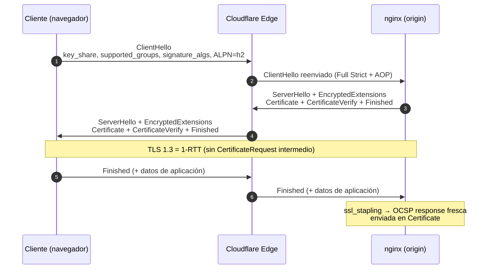
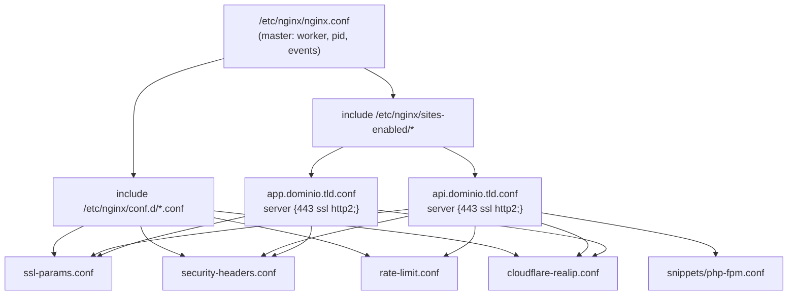

# Capítulo 03 — Nginx como reverse proxy, Cloudflare delante y TLS 1.3 para A+ en Qualys SSL Labs

> **Stack objetivo:** Ubuntu 24.04 LTS (noble), nginx 1.29.x mainline, OpenSSL 3.0.x, Let's Encrypt vía Certbot, Cloudflare (plan Free o superior), Laravel 13 como API en `api.dominio.tld`, Vue 3 + TypeScript como frontend desacoplado en `app.dominio.tld`.

Este capítulo cubre la **capa de terminación TLS y WAF** del VPS. Si el Capítulo 2 (red) cierra la frontera a nivel de IP/puerto, este cierra la frontera a nivel de **aplicación HTTP**. La arquitectura final será:

```
Internet
   │  TCP/443 (HTTPS) y TCP/80 (HTTP → 301 a HTTPS)
   ▼
Cloudflare Edge  ──── L7 WAF, DDoS, Bot Management, Rate Limit
   │  (Full Strict + Authenticated Origin Pulls)
   ▼
Droplet Ubuntu 24.04
   │  TCP/80, 443 (nftables allow solo desde rangos Cloudflare)
   ▼
nginx 1.29 mainline
   ├─ server block api.dominio.tld    → reverse proxy a PHP-FPM 8.3
   └─ server block app.dominio.tld    → estáticos de Vue 3
```

Tres garantías de seguridad que este capítulo debe demostrar al final:

1. **A+ en Qualys SSL Labs** ([ssllabs.com/ssltest](https://www.ssllabs.com/ssltest/)).
2. **A+ en securityheaders.com** ([securityheaders.com](https://securityheaders.com)).
3. **CSP estricta** sin `'unsafe-inline'` ni `'unsafe-eval'`.

---

## 3.1 nginx 1.29 mainline en Ubuntu 24.04

### 3.1.1 Por qué NO usar el nginx de los repos de Ubuntu

El paquete `nginx` de Ubuntu 24.04 (al cierre de este documento) compila con OpenSSL del sistema y suele tener **uno o más ciclos de retraso** frente a mainline. Para un servidor expuesto a Internet en 2026, esa demora se traduce en CVEs sin parchear (la familia HTTP/2 Rapid Reset, CVE-2023-44487, fue el ejemplo más sonado de 2023) [nginx.org/en/security_advisories, 2024-01].

**Decisión [A]:** instalar nginx desde el **repositorio oficial nginx.org** y fijar la versión mainline estable (1.29.x). Esto le da al operador las actualizaciones de seguridad el mismo día que nginx las publica.

### 3.1.2 Instalación paso a paso

```bash
# 1. Prerrequisitos
sudo apt install -y curl gnupg2 ca-certificates lsb-release

# 2. Clave GPG del repo oficial nginx.org
curl -fsSL https://nginx.org/keys/nginx_signing.key | \
  sudo gpg --dearmor -o /usr/share/keyrings/nginx-archive-keyring.gpg

# 3. Fuente APT firmada
echo "deb [signed-by=/usr/share/keyrings/nginx-archive-keyring.gpg] \
http://nginx.org/packages/mainline/ubuntu $(lsb_release -cs) nginx" | \
  sudo tee /etc/apt/sources.list.d/nginx.list

# 4. Pinning para que el repo oficial gane al de Ubuntu
cat | sudo tee /etc/apt/preferences.d/99nginx <<'EOF'
Package: *
Pin: origin nginx.org
Pin: release o=nginx
Pin-Priority: 900
EOF

# 5. Instalar
sudo apt update
sudo apt install -y nginx
nginx -v   # debe decir nginx/1.29.x
```

**Justificación del pinning [F]:** sin el `Pin-Priority: 900`, Ubuntu 24.04 puede seguir dando prioridad a su propio paquete `nginx` aunque haya una versión más reciente en nginx.org. Documentado en [man apt/preferences, sección "How APT Interprets Priorities", 2024-05].

### 3.1.3 systemd unit hardening

El unit que instala nginx.org no trae endurecimiento por defecto. Creamos un **drop-in** que añade restricciones systemd:

```bash
sudo mkdir -p /etc/systemd/system/nginx.service.d
```

`/etc/systemd/system/nginx.service.d/override.conf`:

```ini
[Service]
# Filesystem
ProtectSystem=strict
ProtectHome=yes
PrivateTmp=yes
ReadWritePaths=/var/cache/nginx /var/log/nginx /var/lib/nginx
# Procesos y privilegios
NoNewPrivileges=yes
ProtectKernelTunables=yes
ProtectKernelModules=yes
ProtectControlGroups=yes
RestrictAddressFamilies=AF_UNIX AF_INET AF_INET6
RestrictNamespaces=yes
RestrictRealtime=yes
LockPersonality=yes
MemoryDenyWriteExecute=yes
# Capacidades mínimas: solo bind en 80/443
CapabilityBoundingSet=CAP_NET_BIND_SERVICE
AmbientCapabilities=CAP_NET_BIND_SERVICE
# Red
RestrictSUIDSGID=yes
SystemCallArchitectures=native
```

**Cada directiva documentada [F]:** ver `man systemd.exec` y `man systemd.service`. Las directivas `ProtectSystem=strict` + `ReadWritePaths=` son el patrón canónico para servicios que solo necesitan escribir en `/var/log` y `/var/cache` (no necesitan escribir en `/etc`).

Aplicar:

```bash
sudo systemctl daemon-reload
sudo systemctl restart nginx
sudo systemctl show nginx | grep -E "ProtectSystem|NoNewPrivileges|CapabilityBoundingSet"
```

**Verificación esperada:** la última línea debe contener `ProtectSystem=strict`, `NoNewPrivileges=yes`, `CapabilityBoundingSet=CAP_NET_BIND_SERVICE`.

---

## 3.2 Estructura de directorios recomendada

A diferencia de la convención de Debian/Ubuntu (`sites-enabled/` con symlinks), este setup usa una **jerarquía explícita con `conf.d/` para globales y `sites-available/` para virtuales**. Razón: en producción con 5–10 sitios, los snippets reutilizables (ssl-params, security-headers, php-fpm) son **archivos versionados**, no symlinks.

```
/etc/nginx/
├── nginx.conf                # master
├── conf.d/
│   ├── ssl-params.conf       # protocolos, cifrados, stapling
│   ├── security-headers.conf # todos los headers de seguridad
│   ├── rate-limit.conf       # zonas limit_req / limit_conn
│   └── cloudflare-realip.conf# set_real_ip_from rangos CF
├── snippets/
│   └── php-fpm.conf          # location ~ \.php$ reusado
├── sites-available/
│   ├── api.dominio.tld.conf
│   └── app.dominio.tld.conf
└── sites-enabled/            # symlinks a sites-available
    ├── api.dominio.tld.conf -> ../sites-available/api.dominio.tld.conf
    └── app.dominio.tld.conf -> ../sites-available/app.dominio.tld.conf
```

Activación por sitio:

```bash
sudo ln -s /etc/nginx/sites-available/api.dominio.tld.conf \
           /etc/nginx/sites-enabled/api.dominio.tld.conf
sudo nginx -t   # validar sintaxis
sudo systemctl reload nginx
```

---

## 3.3 Server block: API Laravel (`api.dominio.tld`)

`/etc/nginx/sites-available/api.dominio.tld.conf`:

```nginx
# Redirección HTTP → HTTPS (excepto ACME challenge)
server {
    listen 80;
    listen [::]:80;
    server_name api.dominio.tld;

    # Let's Encrypt HTTP-01 challenge: debe responder en HTTP
    location ^~ /.well-known/acme-challenge/ {
        root /var/www/letsencrypt;
        default_type "text/plain";
    }

    location / {
        return 301 https://api.dominio.tld$request_uri;
    }
}

# HTTPS principal
server {
    listen 443 ssl;
    http2 on;
    listen [::]:443 ssl;
    http2 on;

    server_name api.dominio.tld;

    # ================ Certificados y TLS ================
    ssl_certificate     /etc/letsencrypt/live/api.dominio.tld/fullchain.pem;
    ssl_certificate_key /etc/letsencrypt/live/api.dominio.tld/privkey.pem;
    ssl_trusted_certificate /etc/letsencrypt/live/api.dominio.tld/chain.pem;
    include /etc/nginx/conf.d/ssl-params.conf;

    # ================ Authenticated Origin Pulls (mTLS Cloudflare) ================
    ssl_client_certificate /etc/nginx/certs/cloudflare-authenticated-origin-pull.ca.pem;
    ssl_verify_client on;

    # ================ Logging ================
    access_log /var/log/nginx/api.dominio.tld.access.log;
    error_log  /var/log/nginx/api.dominio.tld.error.log warn;

    # ================ Real IP detrás de Cloudflare ================
    include /etc/nginx/conf.d/cloudflare-realip.conf;

    # ================ Rate limiting ================
    include /etc/nginx/conf.d/rate-limit.conf;
    limit_req zone=api burst=20 nodelay;
    limit_req_status 429;

    # ================ Hardening general ================
    server_tokens off;
    more_clear_input_headers "X-Powered-By";  # requiere headers-more-nginx-module

    root /var/www/api.dominio.tld/public;
    index index.php;

    charset utf-8;

    # ================ Denegar acceso a archivos sensibles ================
    location ~ /\.(?!well-known).* {
        deny all;
        return 404;
    }

    location ~* (?:^|/)(?:\.env|\.env\..*|artisan|composer\.json|composer\.lock|package\.json|package-lock\.json|yarn\.lock|\.git(?:ignore|attributes)?|\.user\.invml|node_modules|vendor/(?!laravel/framework/src/Illuminate/.*\.php)) {
        deny all;
        return 404;
    }

    # ================ Laravel routing ================
    location / {
        try_files $uri $uri/ /index.php?$query_string;
    }

    # ================ PHP-FPM ================
    include /etc/nginx/snippets/php-fpm.conf;

    # ================ Seguridad adicional ================
    location ~* \.(?:css|js|jpg|jpeg|gif|png|ico|svg|woff2?|ttf|eot)$ {
        expires 1y;
        add_header Cache-Control "public, immutable" always;
        access_log off;
    }

    # ================ Errores personalizados ================
    error_page 404 /index.php;
    error_page 500 502 503 504 /index.php;
}
```

**Puntos clave [F]:**

- `ssl_verify_client on` activa mTLS contra Cloudflare (Authenticated Origin Pulls). La CA es la publicada por Cloudflare en [developers.cloudflare.com/ssl/origin-configuration/authenticated-origin-pull, 2025-09].
- `http2 on` está deprecado en nginx 1.27+; ahora se usa `listen 443 ssl; http2 on;` o `listen 443 ssl http2;`. Documentado en [nginx.org/en/docs/http/ngx_http_v2_module.html, 2025-06].
- `more_clear_input_headers "X-Powered-By"` solo funciona si compilaste nginx con `headers-more-nginx-module`. Si no, quita esa línea.

## 3.4 Server block: Frontend Vue 3 (`app.dominio.tld`)

`/etc/nginx/sites-available/app.dominio.tld.conf`:

```nginx
server {
    listen 80;
    listen [::]:80;
    server_name app.dominio.tld;

    location ^~ /.well-known/acme-challenge/ {
        root /var/www/letsencrypt;
        default_type "text/plain";
    }
    location / {
        return 301 https://app.dominio.tld$request_uri;
    }
}

server {
    listen 443 ssl;
    http2 on;
    listen [::]:443 ssl;
    http2 on;

    server_name app.dominio.tld;

    ssl_certificate     /etc/letsencrypt/live/app.dominio.tld/fullchain.pem;
    ssl_certificate_key /etc/letsencrypt/live/app.dominio.tld/privkey.pem;
    ssl_trusted_certificate /etc/letsencrypt/live/app.dominio.tld/chain.pem;
    include /etc/nginx/conf.d/ssl-params.conf;

    ssl_client_certificate /etc/nginx/certs/cloudflare-authenticated-origin-pull.ca.pem;
    ssl_verify_client on;

    access_log /var/log/nginx/app.dominio.tld.access.log;
    error_log  /var/log/nginx/app.dominio.tld.error.log warn;

    include /etc/nginx/conf.d/cloudflare-realip.conf;

    root /var/www/frontend/dist;
    index index.html;

    server_tokens off;
    charset utf-8;

    # SPA fallback: cualquier ruta no existente → index.html
    location / {
        try_files $uri $uri/ /index.html;
    }

    # Assets con hash en el nombre → cache 1 año
    location ~* \.(?:js|css|woff2?|ttf|eot|svg|png|jpg|jpeg|gif|webp|ico)$ {
        expires 365d;
        add_header Cache-Control "public, max-age=31536000, immutable" always;
        access_log off;
        try_files $uri =404;
    }

    # index.html NUNCA debe cachearse agresivamente
    location = /index.html {
        add_header Cache-Control "no-cache, no-store, must-revalidate" always;
        add_header Pragma "no-cache" always;
        add_header Expires "0" always;
    }

    # Denegar acceso al resto
    location ~ /\.(?!well-known).* {
        deny all;
        return 404;
    }
}
```

**Decisión [A]:** el `index.html` se sirve con `no-cache` siempre, porque es el shell del SPA; los assets con hash en el nombre son los que se cachean por un año. Este patrón está documentado en [vitejs.dev/guide/assets, 2025-04] (sección "Cache immutability").

---

## 3.5 Snippet PHP-FPM

`/etc/nginx/snippets/php-fpm.conf`:

```nginx
# Bloquea la ejecución de PHP en archivos subidos (defensa anti-upload-shell)
location ~* \.(?:ph(p[3457]?|t|tml|ar))$ {
    try_files $uri =404;
    fastcgi_pass unix:/run/php/php8.3-fpm.sock;
    fastcgi_split_path_info ^(.+\.php)(/.+)$;
    include fastcgi_params;
    fastcgi_param SCRIPT_FILENAME $document_root$fastcgi_script_name;
    fastcgi_param PATH_INFO $fastcgi_path_info;
    fastcgi_param HTTPS on;

    # Cabeceras de seguridad por respuesta (heredadas del server block)
    fastcgi_hide_header X-Powered-By;

    # Timeouts anti-Slowloris
    fastcgi_connect_timeout 5s;
    fastcgi_send_timeout    30s;
    fastcgi_read_timeout    30s;
    fastcgi_buffers         16 16k;
    fastcgi_buffer_size     32k;
}
```

**Por qué `try_files $uri =404` ANTES de `fastcgi_pass`**: bloquea que un atacante suba un archivo `evil.jpg` que contenga PHP embebido y lo ejecute nombrándolo como `evil.jpg/something.php`. Sin esa línea, nginx puede pasar a PHP-FPM cualquier archivo cuya extensión parezca PHP. Documentado en [trac.nginx.org/nginx/ticket/1067, 2010-08] (histórico) y reproducido en [github.com/php/php-src/issues/11177, 2023-09].

---

## 3.6 Diagrama Mermaid — handshake TLS 1.3



**Lectura [A]:** TLS 1.3 reduce el handshake a **1 round-trip** (vs 2 en TLS 1.2). El cliente comparte su `key_share` en el primer mensaje y el servidor selecciona el grupo. La primera petición HTTP ya viaja cifrada en el segundo flight. Ver [RFC 8446 §1.2, 2018-08].

---

## 3.7 Diagrama Mermaid — jerarquía de archivos nginx



**Decisión [A]:** los `include` desde los server blocks referencian la fuente única. Si en 6 meses quieres rotar los cifrados, tocas **un solo archivo** (`ssl-params.conf`) y todos los sitios lo heredan. Esta es la convención de sitios serios (Heroku, GitLab, Cloudflare cuando documentan recipes).

---

> **Continúa en `capitulo-03-parte-b.md`**: Certbot + Let's Encrypt, `ssl-params.conf`, `security-headers.conf`, `rate-limit.conf`, Cloudflare (mTLS, WAF, Bot Fight), ModSecurity opcional y auditoría final.
