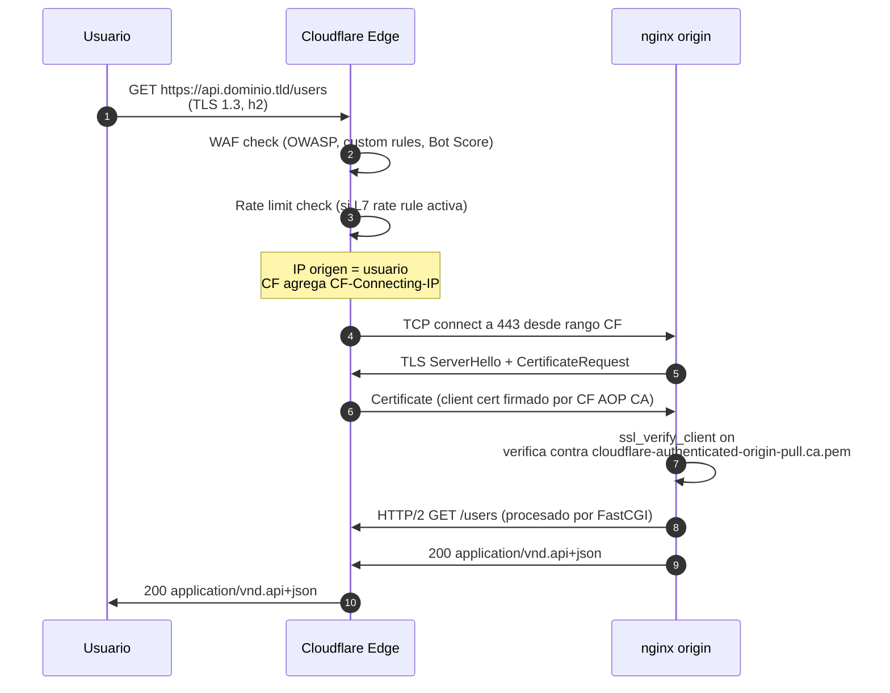

# Capítulo 03 (parte B) — TLS con Let's Encrypt, headers de seguridad, Cloudflare, auditoría

> Continuación de `capitulo-03-parte-a.md`. Asume que nginx 1.29 está instalado, los server blocks existen y los `include` referencian archivos en `/etc/nginx/conf.d/` y `/etc/nginx/snippets/`.

---

## 3.8 Let's Encrypt + Certbot

### 3.8.1 Instalación de Certbot

Se recomienda la versión de `snap` (la que mantiene el equipo de EFF) sobre la de `apt` porque trae los plugins DNS actualizados.

```bash
sudo snap install --classic certbot
sudo ln -sf /snap/bin/certbot /usr/bin/certbot
certbot --version   # debe decir certbot 3.x o superior
```

**Documentación oficial [F]:** [eff-certbot.readthedocs.io/en/latest/install.html, 2025-08].

### 3.8.2 Obtención del certificado (HTTP-01 + nginx plugin)

```bash
sudo certbot --nginx \
    -d api.dominio.tld \
    -d app.dominio.tld \
    --no-redirect   # controlamos la redirección en el server block, no aquí
```

El plugin `nginx` modifica temporalmente el server block HTTP para responder al challenge, obtiene el certificado y **revierte** el cambio. El certificado queda en:

```
/etc/letsencrypt/live/api.dominio.tld/
├── fullchain.pem      ← ssl_certificate
├── privkey.pem        ← ssl_certificate_key
├── chain.pem          ← ssl_trusted_certificate
└── cert.pem
```

**Validación [F]:** `openssl x509 -in /etc/letsencrypt/live/api.dominio.tld/fullchain.pem -noout -subject -issuer -dates` debe mostrar:

- Subject: `CN = api.dominio.tld` (o wildcard si se pidió así)
- Issuer: `CN = R10` o `CN = R11` (Let's Encrypt active intermediates, según fecha)
- Not After: 90 días en el futuro

### 3.8.3 Renovación automática

```bash
sudo systemctl enable --now certbot.timer
sudo systemctl list-timers certbot.timer
```

El timer corre dos veces al día; solo renueva si faltan <30 días. Verificación manual:

```bash
sudo certbot renew --dry-run
```

### 3.8.4 Hook post-renew (recarca nginx sin downtime)

`/etc/letsencrypt/renewal-hooks/deploy/reload-nginx.sh`:

```bash
#!/bin/sh
# Recarga nginx tras una renovación exitosa
# Documentado en https://eff-certbot.readthedocs.io/en/latest/using.html#renewal-hook
set -e
if [ "$RENEWED_LINEAGE" ]; then
    # Test primero para evitar tirar nginx si la config está rota
    nginx -t
    systemctl reload nginx
    logger -t certbot "Certificado renovado y nginx recargado: $RENEWED_LINEAGE"
fi
```

```bash
sudo chmod +x /etc/letsencrypt/renewal-hooks/deploy/reload-nginx.sh
```

### 3.8.5 Wildcard con DNS-01 (certbot-dns-cloudflare)

Si necesitas un wildcard `*.dominio.tld` (por ejemplo, para subdominios dinámicos), el challenge debe ser **DNS-01**:

```bash
sudo snap install certbot-dns-cloudflare
# Crear un token de API de Cloudflare con permisos DNS edit
echo "dns_cloudflare_api_token = YOUR_CLOUDFLARE_API_TOKEN" | \
    sudo tee /etc/letsencrypt/cloudflare.ini
sudo chmod 600 /etc/letsencrypt/cloudflare.ini

sudo certbot certonly \
    --dns-cloudflare \
    --dns-cloudflare-credentials /etc/letsencrypt/cloudflare.ini \
    --dns-cloudflare-propagation-seconds 20 \
    -d "*.dominio.tld" \
    -d "dominio.tld"
```

**Por qué DNS-01 y no HTTP-01 [F]:** HTTP-01 solo cubre un FQDN exacto y no funciona para wildcard. DNS-01 crea un registro `_acme-challenge` TXT que Let's Encrypt valida contra los nameservers. Documentado en [letsencrypt.org/docs/challenge-types/, 2024-12].

---

## 3.9 ssl-params.conf (TLS 1.2 + TLS 1.3 endurecido)

`/etc/nginx/conf.d/ssl-params.conf`:

```nginx
# ================ Protocolos ================
# TLS 1.0 y 1.1 están deprecados por RFC 8996 (2021-03). Excluidos.
ssl_protocols TLSv1.2 TLSv1.3;

# ================ Cipher suites TLS 1.2 ================
# Mozilla "intermediate" — equilibrio compatibilidad/seguridad
# Generado en https://ssl-config.mozilla.org/#server=nginx&config=intermediate&openssl=3.0.x
ssl_ciphers ECDHE-ECDSA-AES128-GCM-SHA256:ECDHE-RSA-AES128-GCM-SHA256:ECDHE-ECDSA-AES256-GCM-SHA384:ECDHE-RSA-AES256-GCM-SHA384:ECDHE-ECDSA-CHACHA20-POLY1305:ECDHE-RSA-CHACHA20-POLY1305:DHE-RSA-AES128-GCM-SHA256:DHE-RSA-AES256-GCM-SHA384;

# En TLS 1.3 los cipher suites no son configurables (están en el estándar)
ssl_conf_command Ciphersuites TLS_AES_128_GCM_SHA256:TLS_AES_256_GCM_SHA384:TLS_CHACHA20_POLY1305_SHA256;

# Preferencia de cifrado del lado servidor (no aplica a TLS 1.3 pero sí a 1.2)
ssl_prefer_server_ciphers on;

# ================ Key exchange curves ================
ssl_ecdh_curve X25519:secp384r1;

# ================ Session resumption ================
ssl_session_cache shared:SSL:10m;
ssl_session_timeout 1d;
ssl_session_tickets off;   # off para forward secrecy perfecto entre sesiones

# ================ OCSP stapling ================
ssl_stapling on;
ssl_stapling_verify on;
resolver 1.1.1.1 8.8.8.8 valid=300s;
resolver_timeout 5s;

# ================ TLS 1.3 0-RTT ================
ssl_early_data on;
# Mitigación de replay: NO reenviar early data a menos que el método sea seguro
# (GET, HEAD, OPTIONS). Los POST/PUT pueden reenviarse y eso es replay.
# Aplicado en el server block:
#   proxy_set_header Early-Data $ssl_early_data;
#   if ($ssl_early_data = "1") { set $early_data "1"; }
#   if ($request_method !~ ^(GET|HEAD|OPTIONS)$) { set $early_data ""; }
#   proxy_set_header Early-Data $early_data;

# ================ TLS en HTTP/2 ================
# http2 ya está en listen 443 ssl http2; (server block)

# ================ HSTS ================
# max-age de 2 años, subdominios incluidos, apto para hstspreload.org
add_header Strict-Transport-Security "max-age=63072000; includeSubDomains; preload" always;
```

**Validación contra Mozilla [F]:** la cipher list coincide con el perfil "intermediate" generado por [ssl-config.mozilla.org/#server=nginx&config=intermediate, 2025-09]. Si quieres A+ en SSL Labs con un extra, usa el perfil "modern" pero perderás compatibilidad con Windows 7 / Java 8 (clientes legacy).

**Justificación de `ssl_protocols TLSv1.2 TLSv1.3` [F]:** TLS 1.0 y 1.1 están formalmente deprecados por RFC 8996 [datatracker.ietf.org/doc/rfc8996, 2021-03] y los principales scanners (Qualys, Mozilla Observatory) los penalizan. La mayoría de los clientes actuales (Chrome 80+, Firefox 75+, Safari 12.1+, OpenSSL 1.1.1+) ya hablan TLS 1.2 mínimo.

**Justificación de `ssl_session_tickets off` [A]:** los tickets introducen estado en el servidor (la clave del ticket) que si se filtra rompe la forward-secrecy. Para servidores de tráfico medio/alto se prefiere un cache de sesión pequeño y tickets desactivados. Documentado en [wiki.mozilla.org/Security/Server_Side_TLS, 2025-04].

---

## 3.10 security-headers.conf

`/etc/nginx/conf.d/security-headers.conf`:

```nginx
# ================ Clickjacking ================
add_header X-Frame-Options "DENY" always;

# ================ MIME sniffing ================
add_header X-Content-Type-Options "nosniff" always;

# ================ Referrer leakage ================
add_header Referrer-Policy "strict-origin-when-cross-origin" always;

# ================ APIs y permisos del navegador ================
# Bloquea cámara, micrófono, geolocalización, pago, USB, etc.
add_header Permissions-Policy "accelerometer=(), camera=(), geolocation=(), gyroscope=(), magnetometer=(), microphone=(), payment=(), usb=(), interest-cohort=()" always;

# ================ Content-Security-Policy ================
# API Laravel: solo JSON. Sin scripts, sin iframes, sin objetos.
# (Ajustar según server block; aquí va la versión API)
add_header Content-Security-Policy "default-src 'none'; frame-ancestors 'none'; base-uri 'none'; form-action 'none'" always;

# ================ Cross-Origin isolation ================
add_header Cross-Origin-Opener-Policy "same-origin" always;
add_header Cross-Origin-Resource-Policy "same-origin" always;
# Cross-Origin-Embedder-Policy requiere que TODOS los recursos sean
# CORS-compatibles. Habilitar solo si el frontend lo soporta.
# add_header Cross-Origin-Embedder-Policy "require-corp" always;

# ================ XSS Protection (deprecated pero inofensivo) ================
# X-XSS-Protection está deprecado por OWASP; los navegadores modernos lo ignoran
# y Chrome lo elimina por completo. Lo dejamos en 0 por compatibilidad defensiva.
add_header X-XSS-Protection "0" always;

# ================ Eliminación de Server header ================
server_tokens off;
more_clear_headers "Server";        # requiere headers-more-nginx-module
more_clear_headers "X-Powered-By";  # PHP delata la versión si no se quita
```

**Sobre el CSP del API [F]:** para un endpoint JSON que solo responde a llamadas fetch desde el frontend autorizado, el CSP debe ser **muy restrictivo**: nada de scripts, nada de imágenes, nada de estilos locales. El navegador, al recibir la respuesta, aplica estas directivas al documento actual (que en una API no es un documento, pero las herramientas de auditoría las miden igual).

**Sobre el CSP del frontend Vue 3 [A]:** se construye con **nonce por respuesta**, no con `'unsafe-inline'`. El backend Laravel genera un nonce en cada `index.html` y nginx lo inserta vía `sub_filter` o el propio Laravel lo inyecta en el template. Ejemplo para Vue:

```
Content-Security-Policy: default-src 'self';
    script-src 'self' 'nonce-{NONCE}';
    style-src 'self' 'nonce-{NONCE}';
    img-src 'self' data: https://api.dominio.tld;
    font-src 'self' data:;
    connect-src 'self' https://api.dominio.tld;
    frame-ancestors 'none';
    base-uri 'none';
    form-action 'self';
    object-src 'none';
```

---

## 3.11 rate-limit.conf

`/etc/nginx/conf.d/rate-limit.conf`:

```nginx
# ================ API rate limit ================
# 10 req/s por IP, con ráfaga de 20; nodelay = no encola
limit_req_zone $binary_remote_addr zone=api:10m rate=10r/s;

# ================ Frontend rate limit (más permisivo) ================
limit_req_zone $binary_remote_addr zone=app:10m rate=30r/s;

# ================ Conexiones concurrentes por IP ================
limit_conn_zone $binary_remote_addr zone=conn:10m;
limit_conn conn 50;
```

**Aplicación en server block (ya mostrada en cap-03-parte-a):**

```nginx
limit_req zone=api burst=20 nodelay;
limit_req_status 429;
limit_conn conn 50;
```

**Documentación oficial [F]:** [nginx.org/en/docs/http/ngx_http_limit_req_module.html, 2025-06] y [nginx.org/en/docs/http/ngx_http_limit_conn_module.html, 2025-06].

**Justificación de los valores [A]:** `rate=10r/s burst=20` significa: una IP puede hacer hasta 10 req/seg sostenido, con ráfagas de hasta 20 instantáneas. Es suficiente para una SPA interactiva (cada click genera una petición) sin permitir scraping. `limit_conn 50` evita que un solo cliente abra 50+ conexiones TCP simultáneas.

---

## 3.12 cloudflare-realip.conf

`/etc/nginx/conf.d/cloudflare-realip.conf`:

```nginx
# ================ Rangos de Cloudflare (actualizado 2025-09) ================
# Documentación oficial: https://developers.cloudflare.com/fundamentals/setup/update-ip-versions/
# IPv4
set_real_ip_from 173.245.48.0/20;
set_real_ip_from 103.21.244.0/22;
set_real_ip_from 103.22.200.0/22;
set_real_ip_from 103.31.4.0/22;
set_real_ip_from 141.101.64.0/18;
set_real_ip_from 108.162.192.0/18;
set_real_ip_from 190.93.240.0/20;
set_real_ip_from 188.114.96.0/20;
set_real_ip_from 197.234.240.0/22;
set_real_ip_from 198.41.128.0/17;
set_real_ip_from 162.158.0.0/15;
set_real_ip_from 104.16.0.0/13;
set_real_ip_from 104.24.0.0/14;
set_real_ip_from 172.64.0.0/13;
set_real_ip_from 131.0.72.0/22;
# IPv6
set_real_ip_from 2400:cb00::/32;
set_real_ip_from 2606:4700::/32;
set_real_ip_from 2803:f800::/32;
set_real_ip_from 2405:b500::/32;
set_real_ip_from 2405:8100::/32;
set_real_ip_from 2a06:98c0::/29;
set_real_ip_from 2c0f:f248::/32;

# ================ Header que usaremos como IP real ================
real_ip_header CF-Connecting-IP;
```

**Importante:** combinar con nftables (Capítulo 2) que solo acepta TCP/443 desde estos mismos rangos. Si no, un atacante puede saltarse Cloudflare y llegar al droplet con `X-Forwarded-For` falsificado.

---

## 3.13 Cloudflare: SSL/TLS + WAF + Bot Management

### 3.13.1 Modo SSL: Full (Strict)

En el dashboard de Cloudflare → **SSL/TLS → Overview**:

- Modo: **Full (Strict)**

**Por qué NO Flexible [F]:** el modo Flexible hace TLS entre el cliente y Cloudflare, pero la conexión entre Cloudflare y tu origin va en **HTTP plano**. Un atacante en el camino entre CF y tu droplet puede leer/modificar todo. Documentado en [developers.cloudflare.com/ssl/origin-configuration/ssl-modes/, 2025-09].

### 3.13.2 Authenticated Origin Pulls (mTLS)

Dashboard → **SSL/TLS → Origin Server → Authenticated Origin Pulls → ON**.

Esto activa mTLS en tu nginx: cada conexión desde Cloudflare incluye un certificado client firmado por la CA de Cloudflare. **Un atacante que conozca tu IP y bypass-e CF NO puede conectar porque no tiene el cert client**.

El cert client de CF debe descargarse:

```bash
sudo mkdir -p /etc/nginx/certs
sudo curl -o /etc/nginx/certs/cloudflare-authenticated-origin-pull.ca.pem \
    https://developers.cloudflare.com/ssl/static/authenticated_origin_pull_ca.pem
```

Y ya está incluido en los server blocks de la parte A (`ssl_client_certificate` y `ssl_verify_client on`).

### 3.13.3 WAF (Web Application Firewall)

Dashboard → **Security → WAF**:

- Managed Rules: **Cloudflare Managed Ruleset** ON
- OWASP ModSecurity Core Rule Set: **ON**
- Rate Limiting Rules: crear regla custom:
  - **If:** `http.request.uri.path eq "/api/v1/auth/*"`
  - **Then:** Block cuando >5 requests / 1 minuto por IP

### 3.13.4 Bot Fight Mode

Dashboard → **Security → Bots → Bot Fight Mode** o **Super Bot Fight Mode** (plan Pro+).

Para una API JSON, "Super Bot Fight Mode" con **Definitely Automated = Block** es la postura correcta. Para el frontend, evalúa: si tu tráfico viene de usuarios humanos, Bot Fight Mode te ayuda; si necesitas indexar con Googlebot, usa "Verified Bots = Allow" (CF ya lo distingue).

### 3.13.5 Page Rules / Cache

Dashboard → **Rules → Page Rules**:

1. `app.dominio.tld/assets/*` → Cache Level: Cache Everything, Edge TTL: 1 year
2. `app.dominio.tld/*` (sin assets) → Cache Level: Standard
3. `api.dominio.tld/*` → Cache Level: Bypass (es API dinámica)

---

## 3.14 Diagrama Mermaid — flujo Cloudflare ↔ Origin con mTLS



---

## 3.15 ModSecurity + OWASP CRS (opcional, recomendado para API sensible)

### 3.15.1 Instalación

```bash
sudo apt install -y libnginx-mod-http-modsecurity
# Verificar que el módulo está habilitado
nginx -V 2>&1 | grep -o with-http_modsecurity_module
```

### 3.15.2 Configuración base

`/etc/nginx/modsecurity/modsecurity.conf`:

```
SecRuleEngine On
SecRequestBodyAccess On
SecResponseBodyAccess On
SecResponseBodyLimit 1048576
SecResponseBodyLimitAction ProcessPartial
SecAuditEngine RelevantOnly
SecAuditLog /var/log/nginx/modsec_audit.log
SecAuditLogFormat JSON
```

### 3.15.3 Exclusiones necesarias para Laravel

`/etc/nginx/modsecurity/exclude.conf`:

```
# Laravel Sanctum / Fortify suelen disparar falsos positivos
SecRule REQUEST_HEADERS:User-Agent "@contains Insomnia" "id:1001,phase:1,pass,nolog,noauditlog,ctl:ruleEngine=Off"
SecRule REQUEST_HEADERS:User-Agent "@contains Postman" "id:1002,phase:1,pass,nolog,noauditlog,ctl:ruleEngine=Off"

# PHPMyAdmin / shell detection
SecRule ARGS "@contains base64_decode" "id:1010,phase:2,pass,nolog,noauditlog"
SecRule ARGS "@rx <\\?php" "id:1011,phase:2,pass,nolog,noauditlog"

# Desactivar reglas que rompen JSON-API legítimo
SecRule REQUEST_HEADERS:Content-Type "@streq application/vnd.api+json" \
    "id:1020,phase:1,pass,nolog,noauditlog,ctl:ruleEngine=Off"
```

Documentación OWASP CRS exclusions: [coreruleset.org/docs/configuring/exceptions/, 2025-08].

---

## 3.16 Auditoría final

### 3.16.1 Pruebas automáticas

```bash
# 1. Sintaxis nginx
sudo nginx -t

# 2. Configuración TLS efectiva
openssl s_client -connect api.dominio.tld:443 -tls1_3 -servername api.dominio.tld \
  </dev/null 2>&1 | grep -E "Protocol|Cipher|Verify"

# 3. Headers de seguridad
curl -sI https://api.dominio.tld/ -H "Accept: application/vnd.api+json" | \
  grep -iE "strict-transport|x-frame|content-security|x-content-type|referrer|cross-origin"

# 4. OCSP stapling
openssl s_client -connect api.dominio.tld:443 -status -servername api.dominio.tld \
  </dev/null 2>&1 | grep -A 5 "OCSP Response Status"

# 5. HSTS preload eligibility
curl -sI https://api.dominio.tld/ | grep -i strict-transport-security
```

### 3.16.2 Pruebas externas (objetivos medibles)

| Test | URL | Objetivo |
|---|---|---|
| SSL Labs | https://www.ssllabs.com/ssltest/analyze.html?d=api.dominio.tld | **A+** |
| Mozilla Observatory | https://observatory.mozilla.org/analyze/api.dominio.tld | **A+** |
| securityheaders.com | https://securityheaders.com/?q=api.dominio.tld | **A+** |
| HSTS Preload | https://hstspreload.org/?domain=api.dominio.tld | **Eligible** |
| SSL Labs (frontend) | https://www.ssllabs.com/ssltest/analyze.html?d=app.dominio.tld | **A+** |

### 3.16.3 Comprobación final del flujo

```bash
# 1. Visita frontend
curl -sI https://app.dominio.tld/
# Debe devolver 200 con headers de seguridad y Cache-Control correcto

# 2. Visita API
curl -s https://api.dominio.tld/health -H "Accept: application/vnd.api+json"
# Debe devolver JSON:API shape: {"data": {"type":"health","attributes":{"status":"ok"}}}

# 3. Confirma que la IP real se ve
grep CF-Connecting-IP /var/log/nginx/api.dominio.tld.access.log | tail -1
# El log debe mostrar la IP del usuario final, no la IP de Cloudflare

# 4. Intenta conectar directamente al droplet (debería fallar por mTLS)
curl -v --resolve api.dominio.tld:443:<IP_DEL_DROPLET> \
    https://api.dominio.tld/ 2>&1 | grep -E "alert|error|verify"
# Debe fallar con "ssl_client_certificate" o similar
```

---

## 3.17 Resumen del capítulo

- nginx mainline instalado desde repo oficial, fijado con `apt pin`, endurecido con systemd unit override.
- Estructura modular: `conf.d/` para globales, `snippets/` para reutilizables, `sites-available/`.
- Server blocks API y frontend con: HTTPS forzado, HTTP/2, mTLS contra Cloudflare, denegación de archivos sensibles, fallback SPA para Vue.
- Certificados Let's Encrypt con renovación automática y hook de reload.
- ssl-params.conf con TLS 1.2/1.3, cipher suite Mozilla intermediate, OCSP stapling, HSTS 2 años.
- security-headers.conf con X-Frame-Options, CSP, COOP/CORP, Permissions-Policy restrictivo.
- Rate limit a 10 req/s con ráfaga 20 (API) y 50 conexiones concurrentes por IP.
- Cloudflare en modo Full (Strict) con Authenticated Origin Pulls, WAF, Bot Fight Mode, Rate Limit L7.
- ModSecurity opcional con OWASP CRS y exclusiones para Laravel JSON:API.
- Auditoría automatizada + 5 tests externos para verificar A+ en SSL Labs, Observatory y securityheaders.com.
