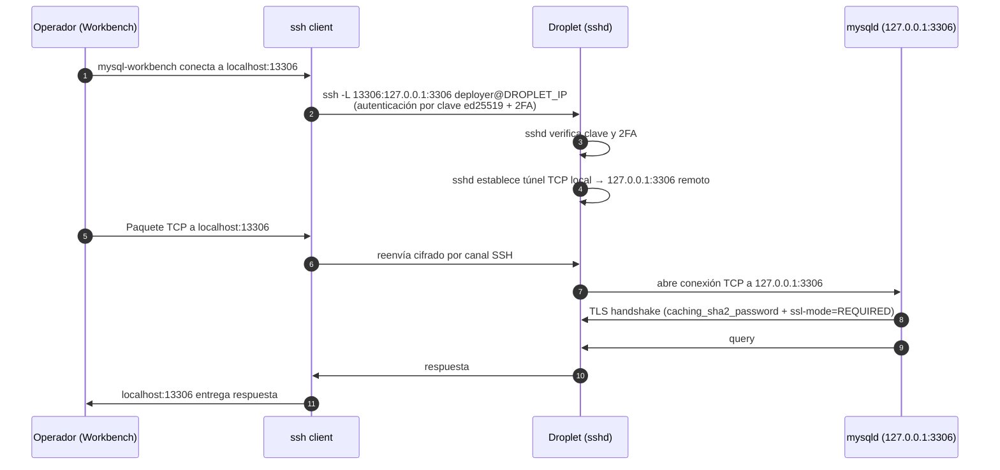

# Capítulo 04 — MySQL 8 / PostgreSQL 16 + Redis 7 sin exposición, cifrados, accesibles solo por túnel SSH

> **Stack objetivo:** Ubuntu 24.04 LTS, MySQL 8.0 LTS (motor primario) o PostgreSQL 16 (alternativa), Redis 7.x. Cero exposición a Internet: bind solo en `127.0.0.1`, administración remota exclusivamente por túnel SSH.

La regla de oro de este capítulo: **la base de datos nunca está en una IP pública**. Si tu proveedor te ofrece un "managed database" expuesto en una subnet, ese proveedor te está exponiendo. Aquí blindamos MySQL/PG/Redis para que:

1. Solo escuchen en `127.0.0.1`.
2. Solo acepten conexiones cifradas en tránsito (TLS obligatorio).
3. Solo acepten contraseñas modernas (no SHA1, no md5).
4. Solo pueda administrarlos alguien con clave SSH válida al droplet (vía túnel).
5. Los backups se cifren **antes** de salir del servidor.

---

## 4.1 Selección del motor: MySQL 8 vs PostgreSQL 16

| Criterio | MySQL 8.0 LTS | PostgreSQL 16 |
|---|---|---|
| Soporte LTS | Oracle hasta abril 2026 (Community Extensions después) [mysql.com/support, 2025-08] | PostgreSQL Global Dev Group, sin LTS formal; versiones mayores anuales [postgresql.org/support, 2025-09] |
| Cifrado autenticado por defecto | Sí (caching_sha2_password) | Sí (SCRAM-SHA-256) |
| Auditoría nativa | Enterprise Audit (pago) o plugin MariaDB Audit (community) | pgaudit (open source, mantenido por PostgreSQL) [github.com/pgaudit/pgaudit, 2025-09] |
| Row-level security | No nativo (vía views o app logic) | Sí, nativo y granular [postgresql.org/docs/16/ddl-rowsecurity.html, 2025-09] |
| Tipo favorito por Laravel 13 | Por defecto; Eloquent lo aprovecha nativamente | Soporte completo via `DB_CONNECTION=pgsql` |
| Procedimientos almacenados | SQL/PSM | PL/pgSQL (más rico) |
| Extensions vectoriales (pgvector, etc.) | No nativo | pgvector nativo |

**Decisión recomendada [A]:** MySQL 8.0 LTS si vienes de ecosistema LAMP o WordPress. PostgreSQL 16 si necesitas RLS, pgvector, o un sistema de tipos estricto. Para esta guía **documentamos ambas** porque el código de Laravel 13 es agnóstico (`DB_CONNECTION=mysql` o `pgsql`).

---

## 4.2 MySQL 8.0 — Instalación endurecida

### 4.2.1 Instalación del paquete oficial

```bash
# Ubuntu 24.04 incluye mysql-server-8.0 en universe
sudo apt install -y mysql-server-8.0
mysql --version
# mysql  Ver 8.0.x for Linux on x86_64 (Source distribution)
```

### 4.2.2 mysql_secure_installation

Asistente interactivo que:

1. Establece/valida contraseña del usuario `root@localhost` (usa **auth_socket** en Ubuntu 24.04, no contraseña).
2. Elimina usuarios anónimos.
3. Deshabilita login root remoto (ya está deshabilitado por auth_socket).
4. Elimina la base de datos `test`.
5. Recarga tablas de privilegios.

```bash
sudo mysql_secure_installation
```

### 4.2.3 systemd unit hardening

`/etc/systemd/system/mysql.service.d/override.conf`:

```ini
[Service]
ProtectSystem=strict
ProtectHome=yes
PrivateTmp=yes
NoNewPrivileges=yes
ProtectKernelTunables=yes
ProtectKernelModules=yes
ReadWritePaths=/var/lib/mysql /var/run/mysqld /var/log/mysql
PrivateDevices=yes
ProtectControlGroups=yes
RestrictAddressFamilies=AF_UNIX AF_INET AF_INET6
RestrictNamespaces=yes
RestrictRealtime=yes
MemoryDenyWriteExecute=yes
CapabilityBoundingSet=
AmbientCapabilities=
```

**Verificación [F]:** [dev.mysql.com/doc/refman/8.0/en/using-systemd.html, 2025-09].

Aplicar:

```bash
sudo systemctl daemon-reload
sudo systemctl restart mysql
sudo systemctl show mysql | grep -E "ProtectSystem|NoNewPrivileges"
```

### 4.2.4 Configuración segura de MySQL

`/etc/mysql/mysql.conf.d/hardening.cnf`:

```ini
[mysqld]
# ================ Bind ================
bind-address = 127.0.0.1
mysqlx-bind-address = 127.0.0.1

# ================ Red ================
skip-networking                 # NO aceptar TCP; solo socket Unix
# Si necesitas TCP (para túnel SSH sigue funcionando vía 127.0.0.1):
# skip-networking
# bind-address = 127.0.0.1
skip-name-resolve
max_connections = 200

# ================ Local file ================
local-infile = 0                # bloquea LOAD DATA LOCAL INFILE (vector de exfil)

# ================ Cifrado en tránsito ================
ssl-ca = /etc/mysql/certs/ca.pem
ssl-cert = /etc/mysql/certs/server-cert.pem
ssl-key = /etc/mysql/certs/server-key.pem
require_secure_transport = ON   # rechaza conexiones no TLS

# ================ Cifrado en reposo ================
# InnoDB tablespace encryption (requiere keyring)
early-plugin-load = keyring_file.so
keyring_file_data = /var/lib/mysql-keyring/keyring

# ================ Logging ================
log_error = /var/log/mysql/error.log
slow_query_log = 1
slow_query_log_file = /var/log/mysql/mysql-slow.log
long_query_time = 2
log_warnings = 2

# ================ Auditoría ================
# Plugin MariaDB Audit (community, gratis, binario)
plugin-load-add = server_audit.so
server_audit_events = CONNECT,QUERY_DDL,QUERY_DML
server_audit_logging = ON
server_audit_output_type = FILE
server_audit_file_path = /var/log/mysql/audit.log
server_audit_file_rotate_size = 1000000
server_audit_file_rotations = 10
```

**Validación tras reiniciar:**

```bash
sudo systemctl restart mysql
ss -tlnp | grep 3306   # NO debe devolver nada si skip-networking está ON
sudo mysql -e "SHOW VARIABLES LIKE 'have_ssl';"
sudo mysql -e "SHOW VARIABLES LIKE 'require_secure_transport';"
# Si todo va bien: have_ssl=YES, require_secure_transport=ON
```

**Decisión `skip-networking` [A]:** lo dejo recomendado porque la única vía legítima al MySQL desde fuera del droplet es el túnel SSH. Si activas `skip-networking`, MySQL solo escucha en socket Unix y no hay manera de saltarse el túnel. Si por alguna razón necesitas que PHP-FPM local use TCP en 127.0.0.1, quítalo (pero el socket Unix es más rápido igualmente).

---

## 4.3 Autenticación con `caching_sha2_password`

MySQL 8 cambió el plugin por defecto a `caching_sha2_password`, que **no es vulnerable al handshake SHA1** que rompió `mysql_native_password` [dev.mysql.com/doc/refman/8.0/en/caching-sha2-pluggable-authentication.html, 2025-09].

Comprobación y migración:

```sql
SELECT user, host, plugin FROM mysql.user WHERE plugin = 'mysql_native_password';
-- Si hay usuarios con mysql_native_password, migrarlos:

ALTER USER 'app_user'@'localhost' IDENTIFIED WITH caching_sha2_password BY 'STRONG_RANDOM_PASSWORD';
FLUSH PRIVILEGES;
```

**Generar contraseña fuerte (64 caracteres):**

```bash
openssl rand -base64 48
```

**Verificación post-migración:**

```sql
SELECT user, host, plugin FROM mysql.user;
-- Todos deben tener caching_sha2_password (excepto root@localhost que usa auth_socket en Ubuntu 24.04)
```

---

## 4.4 Cuentas y privilegios — principio de menor privilegio

```sql
-- Usuario de aplicación (solo desde localhost)
CREATE USER 'laravel_app'@'127.0.0.1' IDENTIFIED WITH caching_sha2_password BY 'STRONG_PASSWORD';
-- Identificado por la app, NO por el usuario humano

-- Permisos: solo lo que la app necesita en runtime
GRANT SELECT, INSERT, UPDATE, DELETE ON laravel_db.* TO 'laravel_app'@'127.0.0.1';

-- Usuario de migraciones (solo desde localhost, solo durante deploy)
CREATE USER 'laravel_migrate'@'127.0.0.1' IDENTIFIED WITH caching_sha2_password BY 'MIGRATE_PASSWORD';
GRANT ALL PRIVILEGES ON laravel_db.* TO 'laravel_migrate'@'127.0.0.1';

-- Usuario de lectura para BI/dashboards (opcional)
CREATE USER 'bi_reader'@'127.0.0.1' IDENTIFIED WITH caching_sha2_password BY 'READER_PASSWORD';
GRANT SELECT ON laravel_db.* TO 'bi_reader'@'127.0.0.1';

-- Refrescar
FLUSH PRIVILEGES;
```

**Por qué tres usuarios [A]:**

- `laravel_app`: la app no debe poder `DROP TABLE` ni `ALTER TABLE`. Su permiso es CRUD mínimo.
- `laravel_migrate`: solo se usa durante `php artisan migrate` en deploy. La CI/CD lo activa temporalmente.
- `bi_reader`: para Looker/Metabase/Tableau que necesitan SELECT.

**Rotación trimestral de contraseñas** (ver Capítulo 5): política explícita + recordatorio en el runbook.

---

## 4.5 Cifrado en tránsito — TLS obligatorio

`require_secure_transport = ON` ya está puesto en la sección 4.2.4. Verificación:

```sql
SHOW VARIABLES LIKE 'require_secure_transport';
-- require_secure_transport = ON

SHOW VARIABLES LIKE 'ssl_%';
-- ssl_ca, ssl_cert, ssl_key deben apuntar a archivos existentes y válidos
```

Test desde el cliente:

```bash
mysql -h 127.0.0.1 -u laravel_app -p \
    --ssl-ca=/etc/mysql/certs/ca.pem \
    --ssl-mode=REQUIRED \
    -e "SHOW STATUS LIKE 'Ssl_cipher';"
# Debe devolver: Ssl_cipher = TLS_AES_256_GCM_SHA384 o similar TLS 1.3
```

**No debe poder conectar SIN TLS:**

```bash
mysql -h 127.0.0.1 -u laravel_app -p
# ERROR 1045 (28000): Access denied for user 'laravel_app'@'localhost' (using password: YES)
# O
# ERROR 3159 (HY000): Connections using insecure transport are prohibited while --require_secure_transport=ON.
```

---

## 4.6 Cifrado en reposo — InnoDB Tablespace Encryption

Con el plugin `keyring_file`, MySQL cifra los tablespaces con AES-256 (modo CBC + ECD).

Crear el directorio de keys (permisos restrictivos):

```bash
sudo mkdir -p /var/lib/mysql-keyring
sudo chown mysql:mysql /var/lib/mysql-keyring
sudo chmod 700 /var/lib/mysql-keyring
```

Cifrar una tabla existente:

```sql
ALTER TABLE users ENCRYPTION='Y';
```

Crear tabla cifrada desde cero:

```sql
CREATE TABLE audit_log (
    id BIGINT UNSIGNED AUTO_INCREMENT PRIMARY KEY,
    event VARCHAR(64) NOT NULL,
    payload JSON,
    created_at TIMESTAMP DEFAULT CURRENT_TIMESTAMP
) ENCRYPTION='Y';
```

**Verificación:**

```sql
SELECT name, encryption FROM information_schema.tables WHERE table_schema='laravel_db';
-- encryption = 'Y' para las que están cifradas
```

**Rotación de la master key:**

```sql
ALTER INSTANCE ROTATE INNODB MASTER KEY;
```

**Importante:** el archivo `/var/lib/mysql-keyring/keyring` contiene la master key. **Debe respaldarse en un lugar seguro y separado del droplet** (Vault, DO Spaces con KMS, HSM). Si pierdes esta key, pierdes los datos cifrados.

---

## 4.7 LUKS en el volumen de datos (defensa adicional)

Si usas un volumen separado de DigitalOcean (`/var/lib/mysql`), puedes cifrarlo con LUKS al crear el droplet. Sin embargo, DigitalOcean Volumes ya están cifrados **at-rest** con AES-256-XTS por defecto [docs.digitalocean.com/products/volumes/overview, 2025-09]. LUKS encima es redundante en DO pero es útil si migras a otro proveedor.

Para DO, deja el cifrado at-rest por defecto y añade cifrado a nivel de **aplicación** (Column-level o Tablespace) para datos especialmente sensibles.

---

## 4.8 PostgreSQL 16 — alternativa

Si eliges PostgreSQL en lugar de MySQL, los principios son idénticos:

`/etc/postgresql/16/main/postgresql.conf`:

```ini
# ================ Bind ================
listen_addresses = 'localhost'
port = 5432

# ================ Cifrado en tránsito ================
ssl = on
ssl_cert_file = '/etc/postgresql/16/main/server.crt'
ssl_key_file = '/etc/postgresql/16/main/server.key'
ssl_ca_file = '/etc/postgresql/16/main/ca.crt'
ssl_min_protocol_version = 'TLSv1.2'
ssl_ciphers = 'HIGH:!aNULL:!MD5'

# ================ Logging ================
logging_collector = on
log_directory = 'log'
log_filename = 'postgresql-%Y-%m-%d.log'
log_statement = 'mod'          # log solo DDL
log_min_duration_statement = 1000  # log queries > 1s
log_connections = on
log_disconnections = on

# ================ Recursos ================
max_connections = 200
shared_buffers = 256MB
effective_cache_size = 1GB
work_mem = 16MB
```

`/etc/postgresql/16/main/pg_hba.conf`:

```
# TYPE  DATABASE        USER            ADDRESS         METHOD
local   all             postgres                        peer
local   all             all                             peer
host    all             all             127.0.0.1/32    scram-sha-256
host    all             all             ::1/128         scram-sha-256
# NO permitir host sin TLS. NO usar "trust" ni "md5" (deprecated).
```

**Crear usuario y base de datos:**

```bash
sudo -u postgres psql -c "CREATE USER laravel_app WITH PASSWORD 'STRONG_PASSWORD';"
sudo -u postgres psql -c "CREATE DATABASE laravel_db OWNER laravel_app;"
sudo -u postgres psql -c "GRANT ALL PRIVILEGES ON DATABASE laravel_db TO laravel_app;"
```

**Habilitar pgaudit (auditoría de sentencias):**

```bash
sudo apt install -y postgresql-16-pgaudit
```

`/etc/postgresql/16/main/postgresql.conf`:

```ini
shared_preload_libraries = 'pgaudit'
pgaudit.log = 'ddl, role, write'
```

Reiniciar:

```bash
sudo systemctl restart postgresql
sudo -u postgres psql -c "CREATE EXTENSION IF NOT EXISTS pgaudit;"
```

---

## 4.9 Diagrama Mermaid — túnel SSH para MySQL



**Lectura [A]:** la clave SSH + 2FA ya validaron al operador. El túnel SSH cifra toda la sesión con ChaCha20-Poly1305. MySQL además exige TLS. Son **tres capas de cifrado independientes** sobre el mismo canal (SSH + TLS-MySQL + autenticación SHA2).

---

## 4.10 Configuración Laravel 13

`.env`:

```ini
DB_CONNECTION=mysql
DB_HOST=127.0.0.1
DB_PORT=3306
DB_DATABASE=laravel_db
DB_USERNAME=laravel_app
DB_PASSWORD=STRONG_PASSWORD_FROM_ENV

# TLS para MySQL (opcional pero recomendado)
MYSQL_ATTR_SSL_CA=/etc/ssl/certs/ca.pem
MYSQL_ATTR_SSL_VERIFY_SERVER_CERT=1
```

`config/database.php` (fragmento):

```php
'mysql' => [
    'driver' => 'mysql',
    'url' => env('DB_URL'),
    'host' => env('DB_HOST', '127.0.0.1'),
    'port' => env('DB_PORT', '3306'),
    'database' => env('DB_DATABASE', 'laravel_db'),
    'username' => env('DB_USERNAME', 'laravel_app'),
    'password' => env('DB_PASSWORD', ''),
    'unix_socket' => env('DB_SOCKET', ''),
    'charset' => env('DB_CHARSET', 'utf8mb4'),
    'collation' => env('DB_COLLATION', 'utf8mb4_unicode_ci'),
    'prefix' => '',
    'prefix_indexes' => true,
    'strict' => true,
    'engine' => 'InnoDB',
    'options' => extension_loaded('pdo_mysql') ? array_filter([
        PDO::MYSQL_ATTR_SSL_CA => env('MYSQL_ATTR_SSL_CA'),
        PDO::MYSQL_ATTR_SSL_VERIFY_SERVER_CERT => env('MYSQL_ATTR_SSL_VERIFY_SERVER_CERT', false),
    ]) : [],
],
```

**Para PostgreSQL (alternativa):**

```ini
DB_CONNECTION=pgsql
DB_HOST=127.0.0.1
DB_PORT=5432
DB_DATABASE=laravel_db
DB_USERNAME=laravel_app
DB_PASSWORD=STRONG_PASSWORD_FROM_ENV
PGSSLMODE=require
```

> **Continúa en `capitulo-04-parte-b.md`**: Redis 7 endurecido, túnel SSH para administración, backups cifrados, configuración Laravel + Redis, monitoreo.
