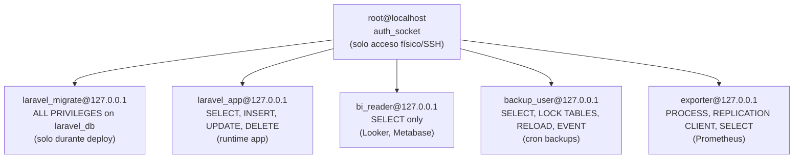

# Capítulo 04 (parte B) — Redis 7 endurecido, túnel SSH, backups cifrados, configuración Laravel + Redis, monitoreo

> Continuación de `capitulo-04-parte-a.md`. Asume MySQL 8.0 (o PostgreSQL 16) endurecido en `127.0.0.1`.

---

## 4.11 Redis 7 — instalación endurecida

### 4.11.1 Instalación desde el repo oficial

```bash
curl -fsSL https://packages.redis.io/gpg | sudo gpg --dearmor -o /usr/share/keyrings/redis-archive-keyring.gpg
echo "deb [signed-by=/usr/share/keyrings/redis-archive-keyring.gpg] https://packages.redis.io/deb $(lsb_release -cs) main" | \
    sudo tee /etc/apt/sources.list.d/redis.list
sudo apt update
sudo apt install -y redis
redis-server --version   # Redis server v=7.x.x
```

Documentación oficial [F]: [redis.io/docs/latest/operate/oss_and_stack/install/install-redis/, 2025-09].

### 4.11.2 systemd unit hardening

```bash
sudo systemctl edit redis
```

Añadir:

```ini
[Service]
ProtectSystem=strict
ProtectHome=yes
PrivateTmp=yes
NoNewPrivileges=yes
ProtectKernelTunables=yes
ReadWritePaths=/var/lib/redis /var/log/redis /var/run/redis
PrivateDevices=yes
CapabilityBoundingSet=
AmbientCapabilities=
RestrictAddressFamilies=AF_UNIX AF_INET AF_INET6
RestrictNamespaces=yes
MemoryDenyWriteExecute=yes
```

Aplicar:

```bash
sudo systemctl daemon-reload
sudo systemctl restart redis
```

### 4.11.3 /etc/redis/redis.conf — endurecimiento

`/etc/redis/redis.conf` (fragmentos críticos):

```ini
# ================ Bind ================
# NUNCA 0.0.0.0
bind 127.0.0.1 ::1

# ================ Protected mode ================
protected-mode yes

# ================ Puerto ================
port 6379
# Si quieres TLS, usa tls-port (ver 4.11.4)

# ================ Autenticación ================
# Contraseña de 64+ caracteres generada con openssl
requirepass $(openssl rand -base64 48)
# ↑ Sustituir en runtime por una variable gestionada con Ansible/Vault

# ================ Deshabilitar comandos peligrosos ================
rename-command FLUSHDB ""
rename-command FLUSHALL ""
rename-command CONFIG "CONFIG_RENAMED_TO_AVOID_RECON"
rename-command DEBUG ""
rename-command SHUTDOWN "SHUTDOWN_OPERATOR_ONLY"
rename-command KEYS ""
# ↑ Vacío = bloqueado. Recomendado por [redis.io/docs/latest/operate/oss_and_stack/management/security/, 2025-09].

# ================ ACL por usuario ================
aclfile /etc/redis/users.acl

# ================ Persistencia ================
dir /var/lib/redis
dbfilename dump.rdb
appendonly yes
appendfilename "appendonly.aof"
appendfsync everysec

# ================ Límites ================
maxmemory 2gb
maxmemory-policy allkeys-lru

# ================ Logging ================
loglevel notice
logfile /var/log/redis/redis-server.log
slowlog-log-slower-than 10000
slowlog-max-len 128
```

### 4.11.4 TLS en Redis 7 (recomendado)

`/etc/redis/redis.conf`:

```ini
tls-port 6380
tls-cert-file /etc/redis/certs/redis-server.crt
tls-key-file /etc/redis/certs/redis-server.key
tls-ca-cert-file /etc/redis/certs/ca.pem
tls-auth-clients yes
tls-protocols "TLSv1.2 TLSv1.3"
tls-ciphers HIGH:!aNULL:!MD5
```

Generar certificados autofirmados (sustituir por los de la CA interna en producción):

```bash
sudo mkdir -p /etc/redis/certs
cd /etc/redis/certs
sudo openssl req -x509 -nodes -newkey rsa:2048 \
    -keyout redis-server.key \
    -out redis-server.crt \
    -days 3650 \
    -subj "/CN=redis.dominio.tld"
sudo cp redis-server.crt ca.pem
sudo chown redis:redis /etc/redis/certs/*
sudo chmod 600 /etc/redis/certs/*.key
```

### 4.11.5 ACL por usuario (`/etc/redis/users.acl`)

```redis
# Usuario admin (para debugging con redis-cli)
user admin on 'STRONG_ADMIN_PASSWORD' ~* &* +@all

# Usuario app (solo lo que Laravel necesita)
user laravel_app on 'STRONG_APP_PASSWORD' ~laravel_cache:* ~laravel_session:* ~laravel_queue:* &* +@read +@write +@connection -@admin -@dangerous -@keyspace -@scripting

# Aplicar
ACL SAVE
```

Documentación oficial [F]: [redis.io/docs/latest/develop/reference/acl/, 2025-09].

---

## 4.12 Verificación post-instalación

```bash
# 1. ¿Quién escucha?
sudo ss -tlnp | grep redis-server
# Debe mostrar solo 127.0.0.1:6379 (y 6380 si TLS)

# 2. ¿Está activa la autenticación?
redis-cli -h 127.0.0.1 -p 6379 PING
# (sin AUTH) → (error) NOAUTH Authentication required.

# 3. ¿Comandos peligrosos están deshabilitados?
redis-cli -h 127.0.0.1 -p 6379 -a 'STRONG_APP_PASSWORD' FLUSHDB
# (error) ERR unknown command 'FLUSHDB'

# 4. ¿TLS funciona?
redis-cli -h 127.0.0.1 -p 6380 --tls \
    --cacert /etc/redis/certs/ca.pem \
    -a 'STRONG_APP_PASSWORD' PING
# PONG

# 5. ¿Protected mode rechaza intentos remotos?
redis-cli -h <IP_PUBLICA_DEL_DROPLET> -p 6379 PING
# (debe fallar: connection refused porque no escucha en 0.0.0.0)
```

---

## 4.13 Túnel SSH para administración remota

### 4.13.1 Desde línea de comandos (operador)

```bash
# MySQL Workbench en localhost:13306 → droplet → 127.0.0.1:3306
ssh -L 13306:127.0.0.1:3306 deployer@DROPLET_IP

# PostgreSQL pgAdmin en localhost:15432 → droplet → 127.0.0.1:5432
ssh -L 15432:127.0.0.1:5432 deployer@DROPLET_IP

# Redis Desktop Manager en localhost:16379 → droplet → 127.0.0.1:6380
ssh -L 16379:127.0.0.1:6380 deployer@DROPLET_IP
```

### 4.13.2 Configuración persistente en `~/.ssh/config`

```sshconfig
Host droplet-prod
    HostName <IP_PUBLICA>
    User deployer
    Port 22
    IdentityFile ~/.ssh/droplet-prod-ed25519
    IdentitiesOnly yes
    ForwardAgent no

    # Túneles automáticos para administración
    LocalForward 13306 127.0.0.1:3306
    LocalForward 15432 127.0.0.1:5432
    LocalForward 16379 127.0.0.1:6380

    # Keep-alive
    ServerAliveInterval 60
    ServerAliveCountMax 3
```

Ahora basta `ssh droplet-prod` para tener los tres túneles abiertos automáticamente.

### 4.13.3 Comprobación

```bash
# Conectar el túnel en background
ssh -fN droplet-prod
# -f → background
# -N → no shell remoto

# Verificar puertos locales
ss -tlnp | grep -E "13306|15432|16379"
# Deben estar escuchando en 127.0.0.1

# Probar MySQL
mysql -h 127.0.0.1 -P 13306 -u laravel_app -p \
    --ssl-mode=DISABLED  # porque ya va cifrado por SSH
    -e "SELECT VERSION();"
```

**Nota [A]:** cuando usas túnel SSH, desactiva el TLS del motor de BD (porque ya va cifrado). Actívalo solo si sales del host sin SSH. Esto simplifica la cadena de cifrado y reduce CPU.

---

## 4.14 Configuración Laravel 13 — Redis

`.env`:

```ini
REDIS_CLIENT=phpredis   # o predis si no tienes phpredis instalado
REDIS_HOST=127.0.0.1
REDIS_PASSWORD=STRONG_APP_PASSWORD
REDIS_PORT=6379
REDIS_DB=0

# Para TLS (si habilitado en sección 4.11.4)
REDIS_PORT=6380
REDIS_SCHEME=tls
```

`config/database.php` (fragmento):

```php
'redis' => [
    'client' => env('REDIS_CLIENT', 'phpredis'),

    'options' => [
        'cluster' => env('REDIS_CLUSTER', 'redis'),
        'prefix' => env('REDIS_PREFIX', 'laravel_database_'),
        'persistent' => false,
    ],

    'default' => [
        'url' => env('REDIS_URL'),
        'host' => env('REDIS_HOST', '127.0.0.1'),
        'username' => env('REDIS_USERNAME'),
        'password' => env('REDIS_PASSWORD'),
        'port' => env('REDIS_PORT', '6379'),
        'database' => env('REDIS_DB', '0'),
        'scheme' => env('REDIS_SCHEME', 'tcp'),
        'read_write_timeout' => 60,
    ],

    'cache' => [
        'host' => env('REDIS_HOST', '127.0.0.1'),
        'password' => env('REDIS_PASSWORD'),
        'port' => env('REDIS_PORT', '6379'),
        'database' => env('REDIS_CACHE_DB', '1'),
    ],
],
```

**Validación:**

```bash
cd /var/www/api.dominio.tld
php artisan tinker
> Cache::put('test', 'ok', 60);
> Cache::get('test');
# "ok"
```

---

## 4.15 Backups cifrados

### 4.15.1 MySQL con mysqldump + gpg

```bash
mysqldump \
    --user=backup_user \
    --password='BACKUP_PASSWORD' \
    --single-transaction \
    --routines \
    --triggers \
    --events \
    --hex-blob \
    laravel_db | gzip | \
    gpg --batch --yes --symmetric \
        --cipher-algo AES256 \
        --compress-algo zlib \
        --output /var/backups/mysql/laravel-$(date +%Y%m%d-%H%M%S).sql.gz.gpg
```

**Permisos restrictivos:**

```bash
sudo chown backup:backup /var/backups/mysql -R
sudo chmod 700 /var/backups/mysql
```

### 4.15.2 PostgreSQL con pg_dump + gpg

```bash
pg_dump \
    --username=backup_user \
    --format=custom \
    --no-owner \
    --no-acl \
    laravel_db | \
    gpg --batch --yes --symmetric \
        --cipher-algo AES256 \
        --output /var/backups/postgres/laravel-$(date +%Y%m%d-%H%M%S).sqlc.gpg
```

### 4.15.3 Redis — persistencia nativa + copia

Redis AOF y RDB ya están cifrados en reposo por LUKS o DO Volume. La "copia de seguridad" es:

```bash
# RDB snapshot automático (configurado en redis.conf save)
cp /var/lib/redis/dump.rdb /var/backups/redis/redis-$(date +%Y%m%d-%H%M%S).rdb
gpg --batch --yes --symmetric --cipher-algo AES256 \
    --output /var/backups/redis/redis-$(date +%Y%m%d-%H%M%S).rdb.gpg \
    /var/backups/redis/redis-$(date +%Y%m%d-%H%M%S).rdb
```

### 4.15.4 Cron de rotación 7/30/365

`/etc/cron.d/db-backups`:

```cron
# MySQL — diario a las 03:00, rotación 7/30/365
0 3 * * * backup /usr/local/bin/backup-mysql.sh

# PostgreSQL — diario a las 03:30, rotación 7/30/365
30 3 * * * backup /usr/local/bin/backup-postgres.sh

# Redis — cada 6 horas
0 */6 * * * backup /usr/local/bin/backup-redis.sh

# Limpieza: borrar > 7 días
0 4 * * * backup find /var/backups/mysql -name "*.gpg" -mtime +7 -delete
0 4 * * * backup find /var/backups/postgres -name "*.gpg" -mtime +7 -delete

# Mensual: mover a /var/backups/monthly/
0 5 1 * * backup mv /var/backups/mysql/*.gpg /var/backups/monthly/ 2>/dev/null || true
0 5 1 * * backup mv /var/backups/postgres/*.gpg /var/backups/monthly/ 2>/dev/null || true
```

`/usr/local/bin/backup-mysql.sh`:

```bash
#!/bin/bash
set -euo pipefail
TS=$(date +%Y%m%d-%H%M%S)
TMPDIR=$(mktemp -d)
trap "rm -rf $TMPDIR" EXIT

mysqldump \
    --user=backup_user \
    --password="${MYSQL_BACKUP_PASSWORD}" \
    --single-transaction \
    --routines --triggers --events --hex-blob \
    laravel_db > "$TMPDIR/dump.sql"

gpg --batch --yes --symmetric \
    --cipher-algo AES256 \
    --passphrase-file /etc/dropbear/backup-gpg-passphrase \
    --output /var/backups/mysql/laravel-$TS.sql.gz.gpg \
    < "$TMPDIR/dump.sql"

logger -t backup-mysql "Backup completado: laravel-$TS.sql.gz.gpg"
```

```bash
sudo chmod +x /usr/local/bin/backup-mysql.sh
```

### 4.15.5 Drill de restore (mensual)

```bash
# Probar descifrar y restaurar
TS=20250915-030000
TMPDIR=$(mktemp -d)

# Descifrar
gpg --batch --yes --decrypt \
    --passphrase-file /etc/dropbear/backup-gpg-passphrase \
    --output $TMPDIR/dump.sql \
    /var/backups/mysql/laravel-$TS.sql.gz.gpg

# Restaurar en una BD de prueba
mysql -h 127.0.0.1 -u laravel_migrate -p -e "CREATE DATABASE IF NOT EXISTS laravel_restore_test;"
mysql -h 127.0.0.1 -u laravel_migrate -p laravel_restore_test < $TMPDIR/dump.sql

# Verificar
mysql -h 127.0.0.1 -u laravel_app -p laravel_restore_test \
    -e "SELECT COUNT(*) FROM users; SELECT MAX(created_at) FROM audit_log;"

# Limpiar
mysql -h 127.0.0.1 -u laravel_migrate -p -e "DROP DATABASE laravel_restore_test;"
rm -rf $TMPDIR
```

**Regla:** si el drill falla, **no es un backup**, es una esperanza. El drill mensual es lo que cuenta.

---

## 4.16 Monitoreo

### 4.16.1 Logs nativos

```bash
# MySQL
sudo tail -f /var/log/mysql/error.log
sudo tail -f /var/log/mysql/mysql-slow.log

# PostgreSQL
sudo tail -f /var/log/postgresql/postgresql-16-main.log

# Redis
sudo tail -f /var/log/redis/redis-server.log
sudo redis-cli -a 'STRONG_APP_PASSWORD' SLOWLOG GET 10
```

### 4.16.2 Exporters Prometheus

```bash
# MySQL
sudo apt install -y prometheus-mysqld-exporter

# PostgreSQL
sudo apt install -y prometheus-postgres-exporter

# Redis
sudo apt install -y prometheus-redis-exporter
```

Configurar `mysqld-exporter`:

```bash
sudo tee /etc/default/prometheus-mysqld-exporter <<'EOF'
ARGS="--config.my-cnf /etc/mysql/exporter.cnf --web.listen-address=127.0.0.1:9104"
EOF

sudo tee /etc/mysql/exporter.cnf <<EOF
[client]
user=exporter
password=EXPORTER_PASSWORD
EOF
```

**Reglas duras:**

1. Los exporters escuchan SOLO en `127.0.0.1`. El scraper de Prometheus va por túnel SSH o por socket Unix.
2. Crear usuario `exporter` con permisos mínimos (`PROCESS`, `REPLICATION CLIENT`, `SELECT`).

Documentación oficial [F]: [github.com/prometheus/mysqld_exporter, 2025-09].

---

## 4.17 Diagrama Mermaid — jerarquía de permisos MySQL



**Lectura [A]:** la separación es por rol de uso. `root` solo entra por SSH (auth_socket en Ubuntu). Los usuarios con contraseña solo existen para tareas específicas. Si un atacante filtra la contraseña de `bi_reader`, solo puede leer — no escribir, no borrar, no migrar.

---

## 4.18 Resumen del capítulo

| Capa | Garantía | Cómo se verifica |
|---|---|---|
| Red | MySQL/PG/Redis NO escucha en IP pública | `ss -tlnp \| grep -E '3306\|5432\|6379'` muestra solo `127.0.0.1` |
| Autenticación | Solo `caching_sha2_password` o `scram-sha-256` | `SELECT user, plugin FROM mysql.user;` |
| Cifrado en tránsito | TLS obligatorio | Conexión sin `--ssl-mode=REQUIRED` falla |
| Cifrado en reposo | InnoDB tablespace encryption / pgcrypto | `SELECT name, encryption FROM information_schema.tables;` |
| Menor privilegio | 5 usuarios separados (app, migrate, bi, backup, exporter) | `SHOW GRANTS FOR 'laravel_app'@'127.0.0.1';` |
| Túnel SSH | Única vía legítima para administrar | `ss -tlnp` no muestra puertos públicos |
| Backups cifrados | AES-256 con clave separada del droplet | `gpg --list-packets backup.gpg` muestra cipher-algo |
| Rotación | Trimestral de contraseñas, claves SSH, master keys | Runbook Capítulo 5 |
| Monitoreo | Logs + exporters Prometheus | `tail -f /var/log/mysql/error.log` y `:9104/metrics` |

### 4.18.1 Lista de comprobación final

```bash
# Validación completa
sudo ss -tlnp | grep -E '3306|5432|6379|6380'
# Esperado: solo 127.0.0.1:3306 (MySQL) y 127.0.0.1:6379 (Redis)
# Si tienes PostgreSQL: 127.0.0.1:5432
# Si tienes TLS en Redis: 127.0.0.1:6380

# Cero bind a 0.0.0.0 o ::
sudo ss -tlnp | grep -E '0.0.0.0:3306|:::3306|0.0.0.0:6379|:::6379|0.0.0.0:5432|:::5432'
# Esperado: vacío

# TLS obligatorio
mysql -h 127.0.0.1 -u laravel_app -p --ssl-mode=DISABLED -e "SELECT 1"
# Esperado: error de insecure transport
```

Si todos los checks pasan, **el motor de datos es inalcanzable desde Internet y los backups están cifrados**. El siguiente paso lógico es el Capítulo 5 (Laravel 13 + Vue 3 + CI/CD + IDS + runbook).
