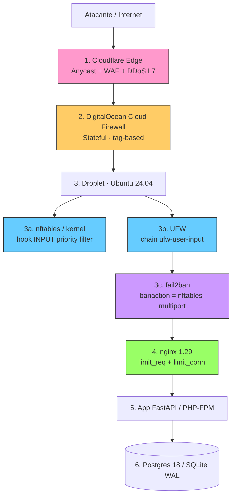

# Informe de extracción literal — `docs-security/capitulo-02.md`

**Fuente:** `docs-security/capitulo-02.md`, 1423 líneas, leído íntegro por tramos (1-250, 251-500, 501-750, 751-1000, 1001-1250, 1251-1423).
**Regla aplicada:** sólo lo que el documento dice, citado como `capitulo-02.md:línea`. Donde no consta, se escribe **no consta**.
**Versión declarada del documento:** 2026-09-30 UTC (`capitulo-02.md:5`).

---

## 1. Modelo de defensa en profundidad

### 1.1 Principio

Una sola capa, por buena que sea, **falla**; el modelo asume que cualquier componente será comprometido (credential stuffing exitoso, zero-day, error humano, configuración rota) y apila controles redundantes (`capitulo-02.md:34`).

### 1.2 Diagrama de capas (literal, `capitulo-02.md:38-56`)



Cada flecha es un punto de control; cada nodo un filtro. Capa 1 = *anycast network*; capa 2 = *hypervisor*; capa 3 = dentro del SO del droplet; capa 4 = dentro del proceso nginx; capa 5 = lógica de aplicación; capa 6 = acceso a datos (`capitulo-02.md:58`).

### 1.3 Qué mitiga cada capa (tabla literal, `capitulo-02.md:62-71`)

| # | Capa | Alcance | Amenaza principal que MitigA | Latencia de actuación |
|---|------|---------|------------------------------|-----------------------|
| 1 | Cloudflare Edge | Cualquier IP origen | DDoS volumétrico L3/L4, bots L7, exposición de IP origen | Pasiva (filtrado en línea) |
| 2 | DigitalOcean Cloud Firewall | Antes del stack del guest | Escaneo de puertos, acceso a servicios internos (Postgres, SSH desde Internet) | Stateless (sin paquetes en el droplet) |
| 3a | nftables (kernel) | Antes del userspace | SYN flood, paquetes malformados, escaneo, spoofing BCP 38 | Kernel hook, ns |
| 3b | UFW (userspace) | Encima de nftables | Errores de configuración humanos, ACL rápida para servicios comunes | Al inicio (systemd) |
| 3c | Fail2Ban | Reacciona a logs | Brute-force SSH/HTTP, credential stuffing, *probing* de botnets | Minutos |
| 4 | nginx limit_req/limit_conn | Capa 7 | Slowloris, scraping, hot-link, ráfagas de aplicación | Por-request |
| 5 | App | Lógica de negocio | CSRF, IDOR, lógica rota | Por-request |
| 6 | DB | Datos | Inyección SQL (con consulta parametrizada), exfiltración | Por-query |

Justificación cuantitativa: sin capa 2 el droplet recibe escaneos de los **65 535 puertos TCP** de Internet y nftables/UFW deben tragarse el SYN de cada uno; sin capa 1 un atacante que resuelva DNS histórico (`SecurityTrails`, `crt.sh`) bypasea el WAF; sin capa 4, **1 IP con 200 conexiones concurrentes a `/login`** puede tumbar nginx aunque UFW le permita llegar (`capitulo-02.md:73`). La redundancia es "deliberada, no negociable" `[A]` (`capitulo-02.md:73`).

### 1.4 Orden de aplicación durante el bootstrap del droplet (`capitulo-02.md:77-83`)

1. Crear el droplet con **Cloud Firewall mínimo** asignado por *tag* (sólo 80/443 hacia la IP del droplet) (`:77`).
2. Instalar nginx en modo *dry-run* y validar TLS antes de exponer 80/443 (`:78`).
3. Una vez nginx responde, activar **UFW** con la regla SSH desde la IP del operador **antes** de `ufw enable` (`:79`).
4. Activar **nftables** por debajo de UFW con la tabla `inet filter` y la cadena `input` con política `drop` (`:80`).
5. Instalar **Fail2Ban**, copiar `jail.conf` → `jail.local` y habilitar los jails (`sshd`, `nginx-http-auth`, `nginx-badbots`, `nginx-noscript`, `nginx-ddos`, `recidive`) (`:81`).
6. Conectar Fail2Ban a Cloudflare vía acción `cloudflare-ban` (token con scope `Firewall Services: Edit`) (`:82`).
7. Ajustar nginx con `limit_req_zone`, `limit_conn_zone`, `client_body_timeout`, `send_timeout` (`:83`).

**Orden real de aplicación declarado** (nota "Importante", `capitulo-02.md:85`): UFW y nftables conviven porque UFW traduce sus reglas a nftables en Ubuntu 22.04+ mediante `ufw-nftables`; las reglas manuales en `/etc/nftables.conf` "se cargan con prioridad *raw* antes que UFW". Orden: reglas de `/etc/nftables.conf` → `iptables-nft` / UFW → fail2ban `nftables-multiport` `[F]` (`:85`).

### 1.5 Docker en el modelo de capas

**no consta.** En las 1423 líneas no aparece ninguna mención de Docker, contenedores, `compose`, ni la interacción Docker–iptables–UFW (búsqueda exhaustiva sobre el archivo). El modelo de capas sólo describe "Droplet · Ubuntu 24.04" y el stack del guest (`capitulo-02.md:42`, `:65`).

---

## 2. DigitalOcean Cloud Firewall

### 2.1 Concepto (`capitulo-02.md:93-95`)

Firewall de red **stateful** que se ejecuta en el **hypervisor** del droplet, fuera del guest: las reglas se aplican **antes** de que el paquete llegue a la interfaz del SO y el droplet ni ve los paquetes bloqueados (`:93`). Es **gratuito**, 0 USD/mes, pero **sí descuenta del bandwidth allotment** el tráfico que el firewall procesa, **incluso el bloqueado** (`:95`).

### 2.2 Límites verificados (`capitulo-02.md:103-109`)

| Concepto | Límite |
|----------|--------|
| Reglas totales por firewall (in + out combinadas) | **50** |
| Droplets por firewall | **10** |
| Tags por firewall | **5** |
| Entradas en *Sources* o *Destinations* por regla | **1 000** |
| Combinado *Sources* + *Destinations* en reglas `deny` | **1 000** |
| Protocolos en reglas `allow` | sólo `icmp`, `tcp`, `udp` |
| Reglas `deny` | único protocolo permitido: `all` |

Decisión de diseño `[A]`: una sola Cloud Firewall con **8–10 reglas**; **NO** escalar a múltiples firewalls concatenados porque el orden de evaluación entre firewalls distintos **no está documentado** (`capitulo-02.md:111`).

### 2.3 Reglas inbound exactas (`capitulo-02.md:117-127`)

| # | Protocol | Port | Sources | Action | Justificación (literal) |
|---|----------|------|---------|--------|---------------|
| 1 | `tcp` | `22` | `IP_ADMIN/32` | `allow` | SSH sólo desde la IP del operador. NO abrir 22 a `0.0.0.0/0` |
| 2 | `tcp` | `80` | `0.0.0.0/0` `::/0` | `allow` | HTTP para redirección a HTTPS y ACME http-01 |
| 3 | `tcp` | `443` | `0.0.0.0/0` `::/0` | `allow` | HTTPS |
| 4 | `icmp` | — | `0.0.0.0/0` | `allow` | Path MTU discovery, mensajes de control |
| 5 | `tcp` | `25` | `0.0.0.0/0` | `deny` | Bloquear envío SMTP saliente no autenticado si no se necesita |
| 6 | `tcp` | `0-79` | `0.0.0.0/0` | `deny` | *Anti-scanning* — denegación explícita de puertos conocidos inseguros |
| 7 | `tcp` | `81-442` | `0.0.0.0/0` | `deny` | *Anti-scanning* — bloquea rango típico |
| 8 | `tcp` | `444-7999` | `0.0.0.0/0` | `deny` | *Anti-scanning* |
| 9 | `tcp` | `8001-65535` | `0.0.0.0/0` | `deny` | Cierra todo lo alto, evita exposición accidental de servicios dev |

**Qué NO se abre:** el puerto 22 **no** se abre a `0.0.0.0/0` (`:119`); no hay ninguna regla `allow` para ningún puerto distinto de 22/80/443 ni para `icmp`; todo lo no listado queda denegado por defecto (`:129`).

Precedencia declarada `[F]`: las reglas **deny explícitas** aparecen primero en la evaluación, permiten *logging* en DigitalOcean y tienen **precedencia absoluta sobre allow del mismo firewall y de cualquier otro**; concatenado con otro firewall con `allow` amplia, el `deny` la anula (`capitulo-02.md:129`).

### 2.4 Reglas outbound exactas (`capitulo-02.md:137-148`)

| # | Protocol | Port | Destinations | Action | Justificación (literal) |
|---|----------|------|--------------|--------|---------------|
| 1 | `tcp` | `53` | `0.0.0.0/0` | `allow` | DNS — sólo si el resolver local no llega al upstream |
| 2 | `udp` | `53` | `0.0.0.0/0` | `allow` | DNS |
| 3 | `tcp` | `80` | `0.0.0.0/0` | `allow` | apt, egress a CDNs |
| 4 | `tcp` | `443` | `0.0.0.0/0` | `allow` | HTTPS |
| 5 | `udp` | `123` | `0.0.0.0/0` | `allow` | NTP (`chrony`) |
| 6 | `tcp` | `587` | `IP_SMTP_RELAY/32` | `allow` | SMTP submission a relay autenticado (no a Internet) |
| 7 | `tcp` | `0-52` | `0.0.0.0/0` | `deny` | Cerrar puertos bajos no usados |
| 8 | `tcp` | `54-79` | `0.0.0.0/0` | `deny` | Cerrar rango |
| 9 | `tcp` | `81-442` | `0.0.0.0/0` | `deny` | Cerrar rango |
| 10 | `tcp` | `444-586` | `0.0.0.0/0` | `deny` | Cerrar rango |
| 11 | `tcp` | `588-7999` | `0.0.0.0/0` | `deny` | Cerrar rango |
| 12 | `tcp` | `8001-65535` | `0.0.0.0/0` | `deny` | Cerrar rango alto |

Política declarada: *deny por defecto, allow sólo lo necesario* (`capitulo-02.md:133`). Nota `[A]`: `udp/123` **debe** estar permitido o `chrony` no sincroniza; un reloj desincronizado rompe TLS, Kerberos, `journald` y todo *rate-limit* por timestamps (`:150`).

### 2.5 Asignación por tag, no por droplet ID (`capitulo-02.md:152-165`)

Razonamiento: permite reasignar el firewall automáticamente cuando el droplet se destruye y recrea (operación rutinaria en Terraform) (`:154`).

```bash
# Crear tag (una sola vez)
doctl compute tag create frontend-prod

# Asignar firewall al tag
doctl compute firewall assign <FIREWALL_ID> --tag frontend-prod

# Asignar tag al droplet (reemplaza ID-based assignment)
doctl compute droplet tag <DROPLET_ID> frontend-prod
```

Equivalente declarativo en Terraform (`capitulo-02.md:170-222`): recurso `digitalocean_firewall.frontend`, `name = "frontend-prod-cf"`, con **5 bloques `inbound_rule`** (tcp/22 ← `203.0.113.10/32` marcado `# IP del operador`; tcp/80 ← `0.0.0.0/0, ::/0`; tcp/443 ← `0.0.0.0/0, ::/0`; icmp ← `0.0.0.0/0, ::/0`; tcp/25 ← `0.0.0.0/0, ::/0`) y **4 bloques `outbound_rule`** (udp/53, tcp/443, tcp/80, udp/123, todos a `0.0.0.0/0, ::/0`), cerrando con `tags = ["frontend-prod"]   # ← asignación por tag, no droplet_ids` (`:174-221`).

Verificación: `doctl compute firewall list` y `doctl compute firewall get <ID>`; la asignación por tag es "inmediata" en droplets existentes y "tarda hasta 30 segundos en el event-loop del hypervisor tras un cambio" `[F]` (`capitulo-02.md:225`).

### 2.6 Rate limiting nativo de DigitalOcean (`capitulo-02.md:229-231`)

**NO** existe un parámetro de rate-limit por regla en el Cloud Firewall; la regla `Deny` simplemente descarta, no limita frecuencia `[F]` (`:229`). La única vía soportada para rate-limiting per-IP en el borde de DO es **Magic Transit** (plan Enterprise), declarado **fuera del alcance** de la guía; la alternativa Open Source es Cloudflare delante del droplet (`:231`).

---

## 3. UFW — Uncomplicated Firewall

### 3.1 Versión exacta (`capitulo-02.md:252-264`)

```
$ ufw version
ufw 0.36.2
$ dpkg -l ufw | tail -1
ii  ufw   0.36.2-6   all   program for managing a netfilter firewall
```

- `ufw 0.36.2-6` (Ubuntu 24.04 noble) (`:252`, `:262`)
- `nftables 1.0.9-1build1` (Ubuntu 24.04 noble) (`:263`)
- `fail2ban 1.0.2-3` (noble), parcheado vía SRU con `1.0.2-3ubuntu0.1` para compatibilidad con Python 3.12; `1.1.0` "ya está disponible en Ubuntu 25.04+ vía backports" (`:264`)
- Backend por defecto de UFW en Ubuntu 22.04+: **`nftables`** (antes `iptables`); binario `ufw`, demonio `ufw.service` `[F]` (`:239`)

### 3.2 Política por defecto (`capitulo-02.md:268-275`)

```bash
$ sudo ufw default deny incoming
Default incoming policy changed to "deny"
$ sudo ufw default allow outgoing
Default outgoing policy changed to "allow"
$ sudo ufw default routed deny
Default routed policy changed to "deny"
```

Razonamiento `[A]`: entrante *opt-in*; saliente libre porque apt, chrony y fail2ban→Cloudflare API necesitan conectividad arbitraria; `routed deny` cierra el *forwarding*, irrelevante para un droplet que no es router (`capitulo-02.md:277`).

### 3.3 Todas las reglas explícitas (`capitulo-02.md:281-304`)

| # | Comando exacto | Justificación (literal) / nota |
|---|----------------|-------------------------------|
| 1 | `sudo ufw allow from 203.0.113.10 to any port 22 proto tcp comment "SSH admin"` | SSH desde la IP del operador únicamente; aparece en `/etc/ufw/user.rules` como `### tuple ### allow tcp from 203.0.113.10 to any port 22` (`:283-285`) |
| 2 | `sudo ufw limit 22/tcp comment "SSH rate-limited 6/30s"` | SSH rate-limited desde cualquier origen (defensa en profundidad); "Reemplaza la regla 1 si se quiere permitir SSH público bajo rate-limit" (`:288-289`) |
| 3 | `sudo ufw allow 80/tcp comment "HTTP (ACME + redirect)"` | HTTP y HTTPS públicos (`:292`) |
| 4 | `sudo ufw allow 443/tcp comment "HTTPS"` | HTTPS (`:293`) |
| 5 | `sudo ufw limit 8000/tcp comment "App backend rate-limited"` | **(Opcional)** rate-limit a la app FastAPI/PHP-FPM si expone puerto propio (`:295-296`) |

Orden (nota "Orden importa", `capitulo-02.md:299`): las reglas se evalúan en **orden de creación**; la primera coincidencia gana; si `ufw limit 22/tcp` está antes que el allow, el operador también será rate-limited. Corrección exacta (`:301-304`):

```bash
$ sudo ufw insert 1 allow from 203.0.113.10 to any port 22 proto tcp
$ sudo ufw limit 22/tcp
```

### 3.4 `ufw limit` — comportamiento exacto (`capitulo-02.md:306-312`)

Cita textual `[F]`: *"ufw supports connection rate limiting… ufw will normally allow the connection but will deny connections if an IP address attempts to initiate 6 or more connections within 30 seconds."* (`:310`). El umbral **6 conexiones / 30 s por IP origen** está **hard-coded** en `/usr/lib/python3/dist-packages/ufw/frontend.py` (`:312`).

### 3.5 Logging (`capitulo-02.md:316-326`)

`$ sudo ufw logging medium`; opciones `off | low | medium | high | full`. Semántica declarada: `low` = sólo paquetes bloqueados; `medium` = low + paquetes que no hacen match; `high` = medium + logging de rate-limited; `full` = alta verbosidad, **no usar en producción** (`:317-324`). Para VPS de **1 GB de RAM y disco de 25 GB**, `medium` es el equilibrio razonable `[A]` (`:326`).

### 3.6 Activación y verificación (`capitulo-02.md:330-361`)

```bash
$ sudo ufw show added
Added user rules (see 'ufw status' for the full list):
   "ufw limit 22/tcp"

$ sudo ufw enable
Command may disrupt existing ssh connections. Proceed (y|n)? y
Firewall is active and enabled on system startup

$ sudo ufw status verbose
Status: active
Logging: on (medium)
Default: deny (incoming), allow (outgoing), disabled (routed)
New profiles: skip

To                         Action      From
--                         ------      ----
22/tcp                     LIMIT IN    Anywhere
80/tcp                     ALLOW IN    Anywhere
443/tcp                    ALLOW IN    Anywhere
22/tcp (v6)                LIMIT IN    Anywhere (v6)
80/tcp (v6)                ALLOW IN    Anywhere (v6)
443/tcp (v6)               ALLOW IN    Anywhere (v6)
```

Auditoría (`:357-360`): `sudo iptables -S | grep ufw` y, "Ubuntu 24.04 usa nftables por debajo; equivalente:", `sudo nft list ruleset | grep -A 5 'chain ufw-user-input'`.

### 3.7 Archivos de configuración (`capitulo-02.md:365-373`)

| Archivo | Función | Cuándo editar |
|---------|---------|---------------|
| `/etc/ufw/ufw.conf` | Config global (ENABLED, LOGLEVEL, POLICY) | rara vez |
| `/etc/ufw/user.rules` | Reglas IPv4 generadas por `ufw allow/deny` | **nunca** a mano (se sobrescribe en `ufw reload`) |
| `/etc/ufw/user6.rules` | Igual para IPv6 | nunca a mano |
| `/etc/ufw/before.rules` | Reglas IPv4 cargadas **antes** de UFW | sí, para inserts especiales |
| `/etc/ufw/before6.rules` | Igual para IPv6 | sí |

Hashlimit a medida (`:375-389`), a insertar en `/etc/ufw/before.rules` "ANTES del COMMIT del bloque `*filter`":

```
-A ufw-before-input -p tcp --dport 22 -m state --state NEW \
  -m hashlimit \
  --hashlimit-name ssh-custom \
  --hashlimit-above 3/minute \
  --hashlimit-burst 3 \
  --hashlimit-mode srcip \
  --hashlimit-htable-expire 60000 \
  -j DROP
```

Aplicar con `sudo ufw reload`; **NO** usar `service ufw restart` `[A]` (`:391`).

### 3.8 Persistencia, reset y prohibiciones (`capitulo-02.md:396-412`)

- `systemctl is-enabled ufw` → `enabled`; persistencia garantizada por systemd (`:396-398`).
- `sudo ufw reset` = reset completo, "¡peligroso en remoto! Se cae SSH"; reconstruir desde cero con script de IaC (`:400-402`).
- Reglas que **NUNCA** deben existir (`:407-410`): `ufw allow from any to any port 22`; `ufw allow 0:65535/tcp`; `ufw disable` en producción (sólo válido durante el bootstrap); `ufw allow in on eth0 from 192.168.0.0/24` (rangos no enrutables desde Internet, "da falsa sensación de seguridad").
- IPv6 `[F]`: UFW activa reglas IPv6 por defecto y `deny incoming` aplica también a IPv6; si Cloudflare accede vía IPv6, verificar con `ufw status verbose | grep v6` (`:412`).

### 3.9 Convivencia con Docker (el punto crítico)

**no consta.** El documento no menciona Docker en ningún punto: no describe que Docker escriba en iptables, ni el bypass de UFW por las cadenas de Docker, ni la cadena `DOCKER-USER`, ni ninguna solución al respecto. Lo único que el documento dice sobre convivencia es entre **UFW y nftables** (`capitulo-02.md:85`, `:241`, `:618-630`) y entre **UFW y fail2ban** (`:45`, `:85`).

---

## 4. nftables (capa kernel)

### 4.1 Por qué (más allá de UFW) — `capitulo-02.md:420-430`

Controles que UFW no puede expresar sin `before.rules`: sets de IPs (`add @blackhole { ip saddr }`), rate limit por IP con token bucket (`limit rate 6/minute burst 10 packets`), mapas interfaz→nivel de log, concatenación de campos (`ip saddr . tcp dport`), `ct helper`/`ct expectation`, **synproxy**, y hooks raw/prerouting/output que UFW no toca (`:422-428`). Patrón recomendado: "nftables como backend canónico, UFW como capa de compatibilidad sobre reglas humanas simples, y `before.rules` para los huecos" `[F]` (`:430`).

Backend (`:437-445`): `sudo update-alternatives --query iptables` debe mostrar `Current best: /usr/sbin/iptables-nft`; **no mezclar** `iptables-legacy` con `nftables` `[A]` (`:445`).

### 4.2 `/etc/nftables.conf` — reproducción COMPLETA y literal (`capitulo-02.md:449-585`)

```bash
#!/usr/sbin/nft -f

# =====================================================================
# /etc/nftables.conf — VPS Ubuntu 24.04 (DigitalOcean + Cloudflare)
# Sintaxis validada contra wiki.nftables.org/wiki-nftables/index.php/
#                       Quick_reference-nftables_in_10_minutes
# =====================================================================

flush ruleset

# ---------- Tabla inet filter (IPv4 + IPv6) ----------
table inet filter {

    # ---------- Sets auxiliares ----------
    set blackhole {
        type ipv4_addr
        flags timeout
    }

    set blackhole6 {
        type ipv6_addr
        flags timeout
    }

    # IPs de operadores / monitorización que NUNCA se banean
    set allowlist_v4 {
        type ipv4_addr
        elements = { 203.0.113.10 }   # IP del admin
    }

    set allowlist_v6 {
        type ipv6_addr
    }

    # ---------- Chain INPUT ----------
    chain input {
        type filter hook input priority filter; policy drop;

        # 1. Tráfico loopback
        iif "lo" accept comment "loopback"

        # 2. Paquetes inválidos → drop silencioso
        ct state invalid drop comment "drop invalid"

        # 3. Conexiones establecidas / relacionadas
        ct state { established, related } accept comment "established/related"

        # 4. Allowlist
        ip saddr @allowlist_v4 accept comment "admin allowlist"
        ip6 saddr @allowlist_v6 accept comment "admin allowlist v6"

        # 5. Blackhole (descarta sin contestar)
        ip saddr @blackhole drop comment "blackhole"
        ip6 saddr @blackhole6 drop comment "blackhole v6"

        # 6. Anti-spoofing (BCP 38 / RFC 2827)
        #     Rechaza paquetes con src en rangos no enrutables
        ip saddr { 0.0.0.0/8, 10.0.0.0/8, 100.64.0.0/10,
                   127.0.0.0/8, 169.254.0.0/16, 172.16.0.0/12,
                   192.0.0.0/24, 192.0.2.0/24, 192.168.0.0/16,
                   198.18.0.0/15, 198.51.100.0/24, 203.0.113.0/24,
                   224.0.0.0/4, 240.0.0.0/4, 255.255.255.255/32 } \
            drop comment "BCP 38 anti-spoof"

        # 7. ICMP controlado (path MTU + echo limitado)
        ip  protocol icmp    icmp type { echo-request, echo-reply,
                                          destination-unreachable,
                                          time-exceeded,
                                          parameter-problem } \
            limit rate 4/second burst 8 packets accept comment "ICMP in"
        ip6 nexthdr ipv6-icmp icmpv6 type { echo-request, echo-reply,
                                            destination-unreachable,
                                            time-exceeded,
                                            packet-too-big,
                                            parameter-problem,
                                            nd-router-solicit,
                                            nd-router-advert,
                                            nd-neighbor-solicit,
                                            nd-neighbor-advert } \
            limit rate 4/second burst 8 packets accept comment "ICMPv6 in"

        # 8. SSH con rate limit explícito (drop, no reject)
        tcp dport 22 ct state new \
            limit rate 6/minute burst 10 packets \
            log prefix "nft-ssh-new: " level warn \
            accept comment "SSH rate-limited"
        tcp dport 22 ct state new drop comment "SSH overflow drop"

        # 9. HTTP / HTTPS públicos
        tcp dport { 80, 443 } ct state new accept comment "HTTP/HTTPS"

        # 10. Anti SYN-flood y paquetes TCP inválidos
        #     (cf. wiki.nftables.org — Quick reference guide)
        tcp flags & (fin|syn|rst|psh|ack|urg) == 0 \
            drop comment "null flags"

        tcp flags & (fin|syn) == (fin|syn) \
            drop comment "fin+syn"

        tcp flags & (syn|rst) == (syn|rst) \
            drop comment "syn+rst"

        tcp flags & (fin|psh|urg) == (fin|psh|urg) \
            drop comment "Xmas scan"

        tcp flags syn tcp dport 22 ct state new \
            limit rate over 20/second burst 50 packets \
            drop comment "SYN flood"

        # 11. UDP: DNS resolver local (puerto 53 sólo si es server DNS)
        #       En un droplet sin BIND/ntpd expuesto, no abrir UDP
        udp dport { 53, 123 } drop comment "no public DNS/NTP"

        # 12. Cualquier otra cosa → drop (política)
        log prefix "nft-drop-default: " level warn
    }

    # ---------- Chain OUTPUT ----------
    chain output {
        type filter hook output priority filter; policy accept;

        # Bloquear tráfico saliente a redes de beaconing conocidas
        # (ejemplo — adaptar al feed real de threat-intel)
        ip daddr { 198.51.100.0/24 } drop comment "block CGN example"

        # (opcional) log de conexiones nuevas para auditoría
        # ct state new log prefix "nft-out-new: " level info
    }

    # ---------- Chain FORWARD ----------
    chain forward {
        type filter hook forward priority filter; policy drop;
        # No se reenvía tráfico (no es router)
    }
}
```

### 4.3 Políticas, sets y rate limits exactos

| Elemento | Valor exacto | Línea |
|---|---|---|
| `flush ruleset` al inicio | sí (borra todo el ruleset) | `:458` |
| Tabla | `table inet filter` (IPv4 + IPv6) | `:461` |
| Set `blackhole` | `type ipv4_addr`, `flags timeout` | `:464-467` |
| Set `blackhole6` | `type ipv6_addr`, `flags timeout` | `:469-472` |
| Set `allowlist_v4` | `elements = { 203.0.113.10 }` | `:475-478` |
| Set `allowlist_v6` | `type ipv6_addr` (vacío) | `:480-482` |
| Chain `input` | `type filter hook input priority filter; policy drop;` | `:486` |
| Chain `output` | `type filter hook output priority filter; policy accept;` | `:569` |
| Chain `forward` | `type filter hook forward priority filter; policy drop;` | `:581` |
| ICMP v4/v6 | `limit rate 4/second burst 8 packets` accept | `:519`, `:529` |
| SSH | `limit rate 6/minute burst 10 packets` log warn accept; overflow → `drop` | `:532-536` |
| SYN flood | `limit rate over 20/second burst 50 packets` drop | `:555-557` |
| UDP | `udp dport { 53, 123 } drop` ("no public DNS/NTP") | `:561` |
| Log final del chain input | `log prefix "nft-drop-default: " level warn` | `:564` |
| Regla outbound de ejemplo | `ip daddr { 198.51.100.0/24 } drop comment "block CGN example"` | `:573` |

### 4.4 Validación y persistencia (`capitulo-02.md:589-616`)

```bash
$ sudo nft -c -f /etc/nftables.conf     # validar SIN aplicar
$ sudo nft -f /etc/nftables.conf        # aplicar (carga inmediata, sin persistir)
$ sudo nft list ruleset                 # ver reglas activas

$ systemctl is-enabled nftables
disabled
$ sudo systemctl enable --now nftables
$ systemctl is-enabled nftables
enabled
```

`nftables.service` ejecuta `nft -f /etc/nftables.conf` al arrancar, por lo que las reglas persisten entre reboots sin `netfilter-persistent` `[F]` (`:602-616`).

### 4.5 Cómo se integra con UFW (`capitulo-02.md:618-630`)

Advertencia literal `[A]`: "Si UFW está activo, **carga después** de `/etc/nftables.conf` y sus reglas en `ufw-*` chains pueden entrar en conflicto con `policy drop` del chain `input` principal. El patrón correcto es: poner UFW **encima** (sólo se ocupa de puertos abiertos) y dejar la política por defecto de nftables como `accept` (no `drop`). Si quieres `policy drop`, entonces NO uses UFW — carga todo desde nftables. **En esta guía asumimos ambos activos y `policy accept` en nftables**, con la drop-policy efectiva surgiendo de las reglas al final del chain." (`:618`). Ajuste propuesto (`:622-628`):

```bash
chain input {
    type filter hook input priority filter; policy accept;
    # ... reglas que DROPEAN lo no permitido al final del chain
    log prefix "nft-drop-final: " level warn drop
}
```

### 4.6 Cómo se integra con Docker

**no consta.** Sin menciones de Docker en el capítulo. Nótese que la chain `forward` tiene `policy drop` (`capitulo-02.md:581`) y el capítulo la justifica sólo con "No se reenvía tráfico (no es router)" (`:582`), sin mencionar contenedores.

### 4.7 Blackhole dinámico y synproxy (`capitulo-02.md:632-659`)

```bash
$ sudo nft add element inet filter blackhole { 198.51.100.42 timeout 24h }
$ sudo nft get set inet filter blackhole
$ sudo nft flush set inet filter blackhole   # vaciar (emergencia)
```

Synproxy (`:649-659`): chain dedicada `chain synproxy { tcp dport 443 ct state new tcp flags syn notrack }`, llamada desde `input`, y "Requiere reglas raw prerouting equivalentes para hacer follow-up del flujo"; exige desactivar conntrack (`notrack`); es avanzado y "rara vez necesario si Cloudflare está delante"; documentado por completitud `[F]`.

IPv6 (`:663-670`): `inet filter` aplica a IPv4 e IPv6; verificar con `sudo nft list ruleset | grep ip6` y `sudo ip6tables -S`.

Tabla de decisión UFW vs nftables (`capitulo-02.md:674-682`): abrir 22/tcp a una IP → UFW; rate-limit 6/30 s por IP → UFW (`ufw limit`); set de IPs con TTL → nftables; log selectivo por prefijo → nftables; synproxy L4 → nftables; syn flood simple → nftables (`limit rate over`); cadenas por jail de Fail2Ban → `nftables-multiport`. Decisión `[A]`: ambas herramientas **a la vez** (`:684`).

---

## 5. Fail2Ban — anti brute-force

### 5.1 Rol (`capitulo-02.md:690-694`)

IPS basado en logs: lee logs, cuenta coincidencias con regex y cuando un origen supera `maxretry` dentro de `findtime` ejecuta una acción —típicamente añadir la IP a un ban list de nftables durante `bantime` segundos `[F]` (`:692`). **NO previene**, mitiga reactivamente: "El primer intento de login siempre pasa" (`:694`).

### 5.2 Instalación y versiones (`capitulo-02.md:698-718`)

`sudo apt install -y fail2ban`, `sudo systemctl enable --now fail2ban`. Bug de compatibilidad con Python 3.12 (`asynchat`/`asyncore` eliminados) resuelto con el SRU `1.0.2-3ubuntu0.1` en `noble-updates` (`:708`):

```
ii  fail2ban   1.0.2-3ubuntu0.1   all   ban hosts that cause multiple authentication failures
$ sudo apt install -y python3-setuptools   # dependencia runtime histórica
$ fail2ban-client version
0.10.2   # versión de protocolo
```

Desde Ubuntu 25.04, Fail2Ban está en `1.1.0-2` por defecto; para noble, `1.1.0` está como backport opcional vía oracular-proposed o `ppa:fail2ban/fail2ban-src`, pero no es necesario `[F]` (`:718`).

### 5.3 `/etc/fail2ban/jail.local` — configuración global literal (`capitulo-02.md:735-795`)

```ini
# ==============================================================
# /etc/fail2ban/jail.local — VPS Ubuntu 24.04 (DigitalOcean)
# Stack: nftables + UFW + Cloudflare
# ==============================================================

[DEFAULT]

# --- Identidad ---
# Ignorar IPs de loopback y del operador. Soporta IPv4 e IPv6,
# listas separadas por espacio y CIDRs.
ignoreip = 127.0.0.1/8 ::1 203.0.113.10/32 \
           2001:db8::/32       # IPv6 admin (cambiar)

# --- Backend ---
# 'systemd' usa journalctl (preferido en Ubuntu 22.04+).
# 'polling' o 'pyinotify' son fallbacks.
backend = systemd

# --- Ventana de detección ---
# Tiempo (segundos o sufijos: m, h, d, w) en el que se cuentan los maxretry.
findtime = 10m

# --- Duración del ban ---
bantime  = 1h

# --- Número de fallos antes del ban ---
maxretry = 5

# --- Ban incremental ---
# Activa el escalado de bantime para reincidentes.
# El factor es multiplicativo (2 → 1h, 2h, 4h, 8h, …).
bantime.increment = true
bantime.factor    = 2
bantime.maxtime   = 4w

# --- Resolución DNS ---
# 'true' = fail2ban intenta resolver hostname del baneado (costoso).
# 'false' = sólo IPs (más rápido, recomendado).
usedns = no

# --- Persistencia de bans entre reinicios ---
dbfile = /var/lib/fail2ban/fail2ban.sqlite3

# --- Acción por defecto ---
# Para nftables como backend usar nftables-multiport.
banaction       = nftables-multiport
banaction_allports = nftables-allports

# --- Email / Webhook ---
destemail = ops@example.com
sender    = fail2ban@example.com
mta       = sendmail

# action_mwl = ban + whois + log + email
# action_mw  = ban + whois + log
# action_ml  = ban + log + email
# action      = ban sólo
# %(action_)s es el placeholder estándar.
action = %(action_mwl)s
        cloudflare-ban
```

### 5.4 Jails exactos (`capitulo-02.md:802-865`)

| Jail | enabled | filter | port | logpath | maxretry | findtime | bantime | banaction / action |
|---|---|---|---|---|---|---|---|---|
| `[sshd]` (`:802-814`) | `true` | `sshd` (`mode = aggressive`, `backend = systemd`) | `ssh` | `%(sshd_log)s` | **3** | **10m** | **24h** | hereda DEFAULT (`%(action_mwl)s` + `cloudflare-ban`); su `action` propia está comentada (`:812-814`) |
| `[nginx-http-auth]` (`:817-824`) | `true` | `nginx-http-auth` | `http,https` | `/var/log/nginx/error.log` | **5** | **10m** | **1h** | hereda DEFAULT |
| `[nginx-badbots]` (`:827-833`) | `true` | `nginx-badbots` | `http,https` | `/var/log/nginx/access.log` | **2** | *(no declarado → 10m)* | **48h** | hereda DEFAULT |
| `[nginx-noscript]` (`:836-843`) | `true` | `nginx-noscript` | `http,https` | `/var/log/nginx/access.log` | **3** | **10m** | **24h** | hereda DEFAULT |
| `[nginx-ddos]` (`:846-853`) | `true` | `nginx-ddos` | `http,https` | `/var/log/nginx/error.log` | **200** | **60** | **1h** | hereda DEFAULT |
| `[recidive]` (`:858-865`) | `true` | `recidive` | — | `/var/log/fail2ban.log` | **3** | **1d** | **1w** | `banaction = %(banaction_allports)s` (`:862`) |

Recidive se describe como "red de seguridad final": ban a IP baneada N veces en cualquier jail durante `findtime` (`:856-857`).

Estructura de archivos (`:722-729`): `jail.conf` es plantilla stock — **NO editar**; `jail.local` es el override; `jail.d/*.conf` drop-ins; `filter.d/*.conf` filtros; `action.d/*.conf` acciones (`iptables-multiport`, `nftables-multiport`, `cloudflare-ban`…); `/var/lib/fail2ban/fail2ban.sqlite3` DB persistente de bans previos, "clave para `bantime.increment`". Convención `[F]`: editar siempre `jail.local` o drop-ins en `jail.d/` (`:731`).

### 5.5 Acción custom contra la API de Cloudflare (`capitulo-02.md:868-914`)

Contrato declarado `[F]` (`:872-874`):

> Endpoint: `POST /client/v4/user/firewall/access_rules/rules`
> Modos: `block | challenge | js_challenge | whitelist | managed_challenge`
> Body: `{ "mode": "block", "configuration": { "target": "ip", "value": "<ip>" }, "notes": "..." }`

`/etc/fail2ban/action.d/cloudflare-ban.conf` (literal, `:878-912`):

```ini
# ===========================================================
# /etc/fail2ban/action.d/cloudflare-ban.conf
# Ban en el EDGE de Cloudflare, no sólo en el droplet.
# ===========================================================

[Definition]
actionstart =
actionstop  =
actioncheck =

# Ban: añade IP a Access Rules en Cloudflare
actionban = curl -s -o /dev/null \
  -X POST "https://api.cloudflare.com/client/v4/user/firewall/access_rules/rules" \
  -H "X-Auth-Email: <cfuser>" \
  -H "X-Auth-Key: <cftoken>" \
  -H "Content-Type: application/json" \
  --data '{"mode":"block","configuration":{"target":"ip","value":"<ip>"},"notes":"Fail2ban-<name>"}'

# Unban: borra la regla. Se hace lookup primero porque Cloudflare
#         genera un ID distinto en cada ban.
actionunban = curl -s -o /dev/null -X DELETE \
  "https://api.cloudflare.com/client/v4/user/firewall/access_rules/rules/$( \
    curl -s -X GET \
      'https://api.cloudflare.com/client/v4/user/firewall/access_rules/rules?mode=block&configuration_target=ip&configuration_value=<ip>&page=1&per_page=1' \
      -H 'X-Auth-Email: <cfuser>' -H 'X-Auth-Key: <cftoken>' \
      | tr ',' '\n' | grep -oE '"id":"[a-f0-9]+"' | head -1 | cut -d'"' -f4 \
  )"

[Init]
cfuser  = ops@example.com
# Token con scope "Firewall Services: Edit" — NO usar Global API Key en
# producción; usar API Token scoped. [A]
cftoken = REEMPLAZAR_CON_TOKEN_SCOPED
```

**Flujo** (§5.10, `capitulo-02.md:1030-1054`): atacante falla SSH → sshd escribe en `/var/log/auth.log` o journald → el filtro `sshd` alcanza `maxretry` → ticket en `fail2ban-server` → **dos** acciones en paralelo: (a) `nft add element inet filter blackhole { 198.51.100.42 timeout 24h }`, (b) `POST /user/firewall/access_rules/rules` con `mode=block` e `ip=198.51.100.42` → Cloudflare crea la regla en el edge → el atacante recibe `403 Forbidden` en el edge → tras `bantime` (24h) fail2ban hace auto-unban con `DELETE rule` + `nft delete element` (`:1040-1053`). Token: Cloudflare Dashboard → My Profile → API Tokens → Create Token → **Edit Cloudflare Firewall** → Apply to specific zones → seleccionar `example.com` `[A]` (`:914`).

### 5.6 Validación y operación (`capitulo-02.md:918-976`)

```
$ sudo fail2ban-client -t
OK. Fail2ban jail definitions seem valid.
$ sudo systemctl restart fail2ban
$ sudo fail2ban-client status
Status
|- Number of jail:    7
`- Jail list:    recidive, sshd, nginx-http-auth, nginx-badbots, nginx-noscript, nginx-ddos, ...
```

Comandos `[F]` (`:950-976`): `fail2ban-client set sshd banip 198.51.100.42`; `... unbanip 198.51.100.42`; bucle de unban en todos los jails con `for j in $(sudo fail2ban-client status | grep 'Jail list' | sed 's/.*:\s*//' | tr ',' ' ')`; `sudo fail2ban-client -d | grep -A 10 '\[sshd\]'`; `sudo fail2ban-client set sshd addignoreip 198.51.100.50` (whitelist permanente sin reiniciar); `journalctl -u fail2ban -f`; `sudo fail2ban-client reload` (no reinicia sesiones SSH); `sudo systemctl restart fail2ban`.

### 5.7 Filtros nginx custom (`capitulo-02.md:978-996`)

Se afirma que `nginx-ddos` y `nginx-noscript` **no vienen incluidos** en Fail2Ban stock y hay que crearlos en `/etc/fail2ban/filter.d/`:

```ini
# /etc/fail2ban/filter.d/nginx-ddos.conf
[Definition]
failregex = ^\s*\[error\] \d+#\d+: \*\d+ limiting requests, excess:.*by zone ".*", client: <HOST>, server: [^\s,]+
ignoreregex =
```

```ini
# /etc/fail2ban/filter.d/nginx-noscript.conf
[Definition]
failregex = ^<HOST> -.*"(GET|POST|HEAD).*(\.php|\.asp|\.exe|\.pl|\.cgi|\.scgi)
ignoreregex =
```

Nota `[A]`: "Estos regex presuponen formato `combined` de nginx. Si el log usa formato distinto, ajustar." (`:996`).

### 5.8 Webhook ntfy (`capitulo-02.md:998-1026`)

`/etc/fail2ban/action.d/ntfy-ban.conf` con `actionban`/`actionunban` = `curl -s -o /dev/null -H "Title: Fail2Ban [<name>] ban" -H "Priority: high" -H "Tags: warning,lock" -d "IP <ip> banned (jail <name>, fail count <failures>)" https://ntfy.sh/TOPIC_SECRETO` (y variante unban con `Priority: default`); y en `jail.local` `action = %(action_)s` + `ntfy-ban` (`:1002-1024`). Razón `[A]`: ntfy no requiere webhook server-side ni OAuth; "La suscripción al topic es la ACL" (`:1026`).

### 5.9 Cómo se evita auto-bloquearse

Únicamente por tres vías declaradas:
1. `ignoreip = 127.0.0.1/8 ::1 203.0.113.10/32 2001:db8::/32` (`capitulo-02.md:746-747`).
2. El set `allowlist_v4`/`allowlist_v6` de nftables, descrito como "IPs de operadores / monitorización que NUNCA se banean" (`:474`, `:497-499`).
3. Comprobación y whitelist en caliente: Anexo A #7 "¿Algún jail ha baneado la IP del operador? (debe ser NO)" (`:1373`) y `fail2ban-client set sshd addignoreip <IP>` (`:966`).

No consta ningún jail de auto-protección del propio operador en UFW aparte del orden de reglas descrito en §3.4 (`:299`).

### 5.10 Escalado de bantime (`capitulo-02.md:1056-1071`)

Fórmula declarada `[F]`: `ban.Time * (1 << ban.Count) * banFactor`, capada por `bantime.maxtime = 4w`. Con `bantime = 1h` y `factor = 2`: 1.º `1h × 1 × 2 = 2h` (banCount=0); 2.º `4h`; 3.º `8h`; 4.º `16h`; 5.º `32h`; … hasta `4w` (≈ 672h) (`:1060-1067`). Con `factor = 1` (default): `1h → 2h → 4h → 8h → 16h → 32h …` (`:1069`). Estado persistido en `/var/lib/fail2ban/fail2ban.sqlite3` (`:1071`).

---

## 6. DDoS por capas

### 6.1 Mapeo OSI (`capitulo-02.md:1079-1083`)

| Capa OSI | Amenaza | Mitigación |
|----------|---------|-----------|
| L3 (red) | IP spoofing, routing attacks | BCP 38, nftables, Cloudflare Magic Transit |
| L4 (transporte) | SYN flood, UDP flood, amplification | Cloudflare DDoS L4, nftables rate limit, syncookies |
| L7 (aplicación) | HTTP flood, scraping, Slowloris, 0-day | Cloudflare WAF + Bot Fight Mode + rate-limit nginx |

### 6.2 L3/L4

- **Cloudflare anycast** absorbe el DDoS antes de llegar al droplet; el filtrado L3/L4 ocurre antes del proxy L7 `[F]` (`:1089`).
- Plan **Free**: DDoS L3/L4 "ilimitada (hasta ~10 Gbps por IP)", reglas básicas de WAF (**5 reglas**), Bot Fight Mode (`:1092-1094`).
- Plan **Pro+**: WAF avanzado con Managed Rules, Advanced Rate Limiting (**10 reglas, $0.05/100K requests excedente**), Bot Management (`:1097-1099`).
- **BCP 38**: implementado en `/etc/nftables.conf` regla 6; descarta `src` en rangos no enrutables `[F]` (`:1103`).
- **SYN cookies**: Linux las activa por defecto cuando la cola SYN se desborda; `sysctl net.ipv4.tcp_syncookies` → `1` (`:1107-1112`). Persistente en `/etc/sysctl.d/99-anti-ddos.conf` (`:1114-1121`):

```
net.ipv4.tcp_syncookies = 1
net.ipv4.tcp_max_syn_backlog = 4096
net.ipv4.tcp_synack_retries = 2
net.ipv4.tcp_abort_on_overflow = 0
```

`tcp_abort_on_overflow = 0` = drop silencioso (recomendado); `1` aborta con RST `[A]` (`:1123`).
- **Rate-limit SSH en nftables**: §6.2.4 afirma que `tcp dport 22 ct state new limit rate 6/minute burst 10 packets` "es un token bucket que permite ráfagas cortas pero limita sostenidamente a **1 conexión cada 10 segundos por IP origen**" `[F]` (`:1127`).

### 6.3 L7

`limit_req` declarado `[F]` contra `nginx.org/en/docs/http/ngx_http_limit_req_module.html` (`:1133-1139`):

```
Syntax: limit_req_zone key zone=name:size rate=rate [sync];
Syntax: limit_req zone=name [burst=number] [nodelay | delay=number];
Syntax: limit_req_status code;
```

`/etc/nginx/nginx.conf` (`:1143-1173`):

```nginx
# Zona por IP: 10 MB ≈ 160k estados únicos (suficiente para 1M IPs únicas/24h)
limit_req_zone $binary_remote_addr zone=per_ip:10m rate=10r/s;

# Zona global por server name: previene hot-spotting
limit_req_zone $server_name zone=per_server:10m rate=100r/s;

# Status code en lugar del 503 por defecto
limit_req_status 429;

# Conexiones concurrentes por IP
limit_conn_zone $binary_remote_addr zone=conn_per_ip:10m;
limit_conn_status 429;

server {
    listen 443 ssl http2;
    server_name example.com;

    # Aplicar limit_req en /api/ con burst de 20 y delay de 5
    location /api/ {
        limit_req zone=per_ip burst=20 delay=5;
        limit_conn conn_per_ip 10;
        proxy_pass http://127.0.0.1:8000;
    }

    # Página estática más laxa
    location / {
        limit_req zone=per_ip burst=50 nodelay;
        proxy_pass http://127.0.0.1:8000;
    }
}
```

Semántica `[A]` (`:1176`): `burst=20 nodelay` procesa el burst inmediatamente hasta 20 y después aplica el rate; `burst=20 delay=5` procesa los primeros 5 sin demora y encola 15; para p95/p99 `nodelay` es preferible.

Timeouts anti-Slowloris (`:1182-1194`):

```nginx
client_body_timeout   10s;     # tiempo máximo entre body bytes
client_header_timeout 10s;     # tiempo máximo entre headers
send_timeout          30s;     # tiempo de envío al cliente
keepalive_timeout     30s;
lingering_timeout     5s;      # cierre ordenado tras RST/FIN
large_client_header_buffers 4 8k;
server_names_hash_bucket_size 128;
```

Cloudflare (`:1201-1204`): Bot Fight Mode (Free) = desafío JS no interactivo; Super Bot Fight Mode (Pro+) = *definitely automated* → block, *likely automated* → challenge, *verified bots* → allow; WAF Managed Rules (Pro+) = firmas OWASP Top 10 (SQLi, XSS, RCE, LFI, RFI); Custom WAF rules = hasta 5 (Free) o ilimitadas (Pro+).

Diagrama de rate-limit (`:1208-1232`): cliente legítimo pasa; bot con 200 req/s desde 1 IP → Bot Fight Mode JS challenge → `403 (mitigado en edge)`; si resuelve el challenge, "req #11 (zona per_ip, burst=20 agotado)" → `429 Too Many Requests` (`:1228-1230`).

### 6.4 Fuera de alcance (declarado explícitamente)

- **Magic Transit** (rate-limiting per-IP en el borde de DO): plan Enterprise, "fuera del alcance de esta guía" (`capitulo-02.md:231`).
- **TLS y CDN**: corresponden al capítulo siguiente, "Track 03" (`:1423`).
- **synproxy**: se documenta "por completitud", rara vez necesario con Cloudflare delante (`:659`).
- No consta un apartado genérico de "fuera de alcance" más allá de estos tres puntos.

---

## 7. Verificación

El capítulo **no tiene una sección titulada "Verificación"**; §7 es "Detección y respuesta operativa" (`capitulo-02.md:1236`) y la verificación cruzada vive en el **Anexo A** (`:1342-1390`).

### 7.1 Anexo A — 10 comprobaciones con comando y resultado esperado (`capitulo-02.md:1346-1390`)

| # | Comando | Resultado esperado (literal) | Línea |
|---|---|---|---|
| 1 | `dig +short example.com` | `104.16.x.x    # IP Cloudflare, NO la del droplet` | `:1348-1349` |
| 2 | `nc -zv <IP_DROPLET> 22` | `Connection refused   # Bien: el droplet NO escucha 22 directamente` **o** `Connection timed out # Bien: el firewall lo bloquea` | `:1352-1355` |
| 3 | `sudo ufw status verbose \| head -3` | `Status: active` / `Logging: on (medium)` / `Default: deny (incoming), allow (outgoing), disabled (routed)` | `:1358-1361` |
| 4 | `sudo nft list ruleset \| head -20` | (sin salida esperada en el documento) | `:1364` |
| 5 | `systemctl is-enabled nftables` | `enabled` | `:1367-1368` |
| 6 | `sudo fail2ban-client status \| grep "Number of jail"` | (sin salida esperada en el documento) | `:1371` |
| 7 | `sudo fail2ban-client status sshd \| grep "$(curl -s https://ifconfig.me)"` | "(debe ser NO)" → ningún ban de la IP del operador | `:1373-1374` |
| 8 | `curl -sI https://example.com \| grep -i server` | `server: cloudflare` | `:1377-1378` |
| 9 | `curl -sI https://example.com \| grep -i cf-` | `cf-ray: ...` / `cf-cache-status: ...` | `:1381-1383` |
| 10 | `sudo systemctl stop fail2ban` + `ssh -o ConnectTimeout=5 wrong@<IP_DROPLET>` | "Debe bloquearse por UFW tras 6 intentos/30s, no por fail2ban" | `:1386-1389` |

Advertencia del anexo: cada comando "se puede ejecutar en producción sin afectar servicio" (`:1344`).

### 7.2 Verificación por capa dentro del capítulo

| Capa | Comando | Resultado esperado | Línea |
|---|---|---|---|
| DO firewall | `doctl compute firewall list` / `doctl compute firewall get <ID>` | confirmación tras aplicar Terraform | `:225` |
| UFW (estado) | `sudo ufw status verbose` | `Status: active`, `Logging: on (medium)`, `Default: deny (incoming), allow (outgoing), disabled (routed)` + tabla de reglas | `:342-355` |
| UFW (pre-enable) | `sudo ufw show added` | `"ufw limit 22/tcp"` | `:332-334` |
| UFW (auditoría) | `sudo iptables -S \| grep ufw` / `sudo nft list ruleset \| grep -A 5 'chain ufw-user-input'` | reglas IPv4 generadas | `:358-360` |
| UFW (persistencia) | `systemctl is-enabled ufw` | `enabled` | `:397-398` |
| nftables (sintaxis) | `sudo nft -c -f /etc/nftables.conf` | validación sin aplicar | `:591` |
| nftables (activo) | `sudo nft list ruleset` | reglas cargadas | `:597`, `:1364` |
| nftables (persistencia) | `systemctl is-enabled nftables` | `disabled` → `enabled` tras `enable --now` | `:605-609` |
| nftables (IPv6) | `sudo nft list ruleset \| grep ip6` / `sudo ip6tables -S` | reglas IPv6 presentes | `:666-667` |
| Fail2Ban (sintaxis) | `sudo fail2ban-client -t` | `OK. Fail2ban jail definitions seem valid.` | `:920-921` |
| Fail2Ban (estado) | `sudo fail2ban-client status` | `Number of jail: 7` + lista | `:928-931` |
| Fail2Ban (jail) | `sudo fail2ban-client status sshd` | contadores + `Banned IP list: 203.0.113.45` | `:934-943` |
| Fail2Ban (config efectiva) | `sudo fail2ban-client -d \| grep -A 10 '\[sshd\]'` | volcado de config | `:963` |
| sysctl | `sysctl net.ipv4.tcp_syncookies` | `net.ipv4.tcp_syncookies = 1` | `:1110-1111` |

### 7.3 Detección y respuesta operativa (`capitulo-02.md:1240-1314`)

Logs clave (`:1240-1247`): UFW `/var/log/ufw.log` buscando `LIMIT IN` y `DROP`; Fail2Ban `/var/log/fail2ban.log` buscando `Ban`/`Unban`; nftables en journald (`journalctl -k`) con prefijo `nft-drop-default:`; nginx access `/var/log/nginx/access.log` (4xx/5xx en ráfaga, user-agents vacíos, paths sospechosos); nginx error `/var/log/nginx/error.log` (`limiting requests, excess:`); sshd `/var/log/auth.log` o `journalctl -u sshd` (`Failed password`, `Invalid user`).

Comandos de inspección (`:1251-1266`): top 20 IPs bloqueadas últimas 24h con `journalctl -k -S "24 hours ago" | grep -oE 'SRC=[0-9.]+' | sort | uniq -c | sort -rn | head -20`; bans activos con `fail2ban-client status sshd | grep "Banned IP list"`; top user-agents con `awk -F'"' '{print $6}'`; 5xx última hora; `grep "limiting requests" /var/log/nginx/error.log | tail -50`.

Dashboard con cron (`:1270-1290`): `/etc/cron.d/fail2ban-report` → `55 23 * * * root /usr/local/bin/fail2ban-summary.sh > /var/log/fail2ban-summary.log 2>&1`; el script usa `set -euo pipefail` y recorre los jails desde `/tmp/f2b-status.txt`.

Rotación (`:1296-1314`): `/etc/logrotate.d/nginx` con `daily`, `missingok`, `rotate 14`, `compress`, `delaycompress`, `notifempty`, `create 0640 www-data adm`, `sharedscripts` y `postrotate [ -f /var/run/nginx.pid ] && kill -USR1 $(cat /var/run/nginx.pid) endscript`. Detalle crítico `[F]`: sin la señal USR1 nginx sigue escribiendo al inodo viejo (`:1314`).

---

## 8. Defectos, contradicciones y referencias rotas

### A. Contradicciones de valores numéricos / precedencia (impacto alto)

1. **El `deny` de DO sobre `tcp 0-79` anula el `allow` de SSH.** La regla inbound 6 deniega `tcp 0-79` (`capitulo-02.md:124`) y la regla 1 permite `tcp 22` desde `IP_ADMIN/32` (`:119`). El propio capítulo declara que las reglas **deny tienen precedencia absoluta sobre allow del mismo firewall y de cualquier otro** (`:129`). Consecuencia: el SSH queda bloqueado incluso para el operador. Contradicción directa entre `:119`, `:124` y `:129`.
2. **Las reglas deny violan el límite que el propio documento verifica.** `:109` establece que en reglas `deny` el único protocolo permitido es `all`, pero las deny inbound 5-9 (`:123-127`) y outbound 7-12 (`:143-148`) usan protocolo `tcp`.
3. **El diagrama de ban usa `maxretry=5` para `sshd`.** `:1044` dice "maxretry=5 reached", pero el jail `[sshd]` define `maxretry = 3` (`:809`).
4. **El rate-limit SSH de nftables no es por IP.** `:1127` afirma que limita "1 conexión cada 10 segundos **por IP origen**", pero la regla `tcp dport 22 ct state new limit rate 6/minute burst 10 packets` (`:532-535`) no usa `meter`/`ip saddr`: es un límite **global** del droplet. Contradice además §4.9, que atribuye a nftables el "rate-limit por IP con token bucket" (`:423`, `:677`) y §8, que lo resume como "limit 6/min" (`:1326`).
5. **La regla anti-SYN-flood de SSH es letra muerta.** `tcp flags syn tcp dport 22 ct state new limit rate over 20/second burst 50 packets drop` (`:555-557`) está **después** de la regla que acepta todo SSH dentro del límite y dropea el excedente (`:532-536`); en nftables la primera coincidencia gana, así que a la regla 555-557 no le llega ningún paquete `dport 22 ct state new`.
6. **Puerto 8000 fuera de todo deny.** Los rangos deny inbound `0-79`, `81-442`, `444-7999`, `8001-65535` (`:124-127`) y los outbound `0-52`, `54-79`, `81-442`, `444-586`, `588-7999`, `8001-65535` (`:143-148`) dejan **8000** sin cubrir, que es el puerto que la propia guía usa para el backend (`ufw limit 8000/tcp`, `:296`; `proxy_pass http://127.0.0.1:8000`, `:1165`).
7. **IPv6 sin deny explícito.** Los allow inbound incluyen `::/0` (`:120-121`, y en Terraform `:182-188`), pero las cinco deny usan sólo `0.0.0.0/0` (`:123-127`), y el allow de SSH es sólo IPv4 (`:119`).
8. **Firewall "stateful" vs "Stateless".** §2.1 lo describe como "firewall de red **stateful**" (`:93`) y la tabla §1.3 dice "**Stateless** (sin paquetes en el droplet)" (`:65`).
9. **Asignación por tag: "inmediata" y "hasta 30 segundos".** `:225` sostiene ambas cosas en la misma frase.
10. **29 vs 30 segundos de propagación**: no consta ninguna fuente para el valor de 30 s más allá de la referencia genérica `[F] — DigitalOcean, "Cloud Firewalls — Configure Rules", 2026` (`:225`).
11. **7 jails vs 6 configurados.** La salida esperada dice `Number of jail: 7` (`:930`) y la lista termina en `..., ...` (`:931`), pero §1.4 paso 5 enumera 6 jails (`:81`) y `jail.local` define exactamente 6 (`:802-865`, más el `[DEFAULT]`). No se identifica el séptimo.
12. **Diagrama de rate-limit L7 inconsistente.** Con `rate=10r/s` y `burst=20`, la request "#11" no es el punto de overflow (`:1228-1230`), y contradice la explicación de `burst`/`nodelay`/`delay` del propio capítulo (`:1176`) y de la configuración (`location /` usa `burst=50 nodelay`, `:1170`).
13. **"DDoS L3/L4 ilimitada (hasta ~10 Gbps por IP)"** (`:1092`): ilimitado y acotado a 10 Gbps en la misma línea, sin fuente.
14. **"10 MB ≈ 160k estados únicos (suficiente para 1M IPs únicas/24h)"** (`:1144`): la segunda cifra no se deriva de la primera y el capítulo no la justifica.
15. **Versiones de Fail2Ban en Ubuntu 25.04.** `:264` dice que `1.1.0` "ya está disponible en Ubuntu 25.04+ vía backports"; `:718` dice que en 25.04 está "por defecto" y que para noble se obtiene vía "oracular-proposed" (oracular es 24.10, no una vía de noble).

### B. Contradicciones de configuración (el ruleset no es el que el texto dice)

16. **`policy drop` vs `policy accept`.** El ruleset de §4.3, presentado como "versión completa y verificada" (`:447`), declara `chain input … policy drop;` (`:486`); §4.5 afirma "En esta guía asumimos **ambos activos y `policy accept` en nftables**" y da una versión distinta del chain (`:618-628`). Son dos configuraciones incompatibles y el capítulo no dice cuál se aplica.
17. **`priority raw` vs `priority filter`.** `:85` y `:241` afirman que `/etc/nftables.conf` se carga "con prioridad *raw*" antes que UFW; el ruleset declara `type filter hook input priority filter` (`:486`, repetido en `:624`) y el diagrama dice "hook INPUT priority filter" (`:43`).
18. **`flush ruleset` borra UFW (y fail2ban).** `flush ruleset` (`:458`) vacía **todo** el ruleset, incluidas las tablas `ufw-*` que el propio capítulo atribuye a UFW (`:241`) y las cadenas que crea `nftables-multiport` (`:45`, `:781`). El capítulo ordena validar y **aplicar en caliente** con `sudo nft -f /etc/nftables.conf` (`:594`) y habilitar `nftables.service` al arranque (`:607`) sin advertir que eso deja a UFW sin reglas ni fijar el orden `ufw.service` ↔ `nftables.service`.
19. **Dos chains base en el mismo hook y prioridad sin orden definido.** UFW y `table inet filter` compiten en `input`/`priority filter`; el capítulo reconoce que el orden entre firewalls distintos "no está documentado" (`:111`) y lo asume como problema, pero no resuelve el mismo problema entre UFW y nftables en el host.
20. **La allowlist nftables acepta todo, no sólo "no banear".** El set se documenta como "IPs de operadores / monitorización que NUNCA se banean" (`:474`) pero la regla es `ip saddr @allowlist_v4 accept` sin restricción de puerto ni de estado (`:498`): para la IP del operador anula el filtrado completo (puertos altos, límite SSH, blackhole, y el deny de UDP en `:561`, ya que va después).
21. **La IP de ejemplo del admin cae dentro del set anti-spoofing.** `203.0.113.10` está en `allowlist_v4` (`:477`) y también dentro del rango `203.0.113.0/24` que la regla BCP 38 dropea (`:510`). Sólo funciona por el orden (allowlist en `:498` antes de BCP 38 en `:507`); cualquier reordenamiento, o la variante de §4.5, deja al operador fuera.
22. **BCP 38 dropea rangos RFC 1918 sin mencionar VPC/private networking de DigitalOcean** (10.0.0.0/8, 172.16.0.0/12, 192.168.0.0/16 en `:507-509`). El capítulo nunca menciona VPC, redes privadas ni excepciones para servicios internos.
23. **Regla outbound mal etiquetada.** `ip daddr { 198.51.100.0/24 } drop comment "block CGN example"` (`:573`): 198.51.100.0/24 es el bloque de documentación TEST-NET-2, no CGN (el CGN del propio ruleset es `100.64.0.0/10` en `:508`). Además ese mismo rango se usa como IP de ejemplo del atacante (`:638`, `:952`, `:1041`).
24. **`nginx-noscript` declarado como no-stock sin evidencia.** `:980` afirma que `nginx-ddos` y `nginx-noscript` no vienen en Fail2Ban stock, sin marca `[F]` ni `[A]` ni fuente, pese a que la convención del capítulo exige marcar toda afirmación (`:8-9`); y §1.4 paso 5 manda habilitar esos jails directamente (`:81`), sin paso previo de creación de filtros.
25. **Regex de `nginx-noscript` sin cerrar.** `failregex = ^<HOST> -.*"(GET|POST|HEAD).*(\.php|\.asp|\.exe|\.pl|\.cgi|\.scgi)` (`:992`) no cierra la expresión del request; el capítulo se limita a advertir que "presuponen formato combined" (`:996`) y no aporta ninguna comprobación con `fail2ban-regex` ni salida esperada.
26. **`usedns` documentado con valores que no son los usados.** El comentario dice "'true' = … / 'false' = …" (`:772-773`) pero el valor real es `usedns = no` (`:774`).
27. **`[recidive]` con `logpath` y `backend = systemd` global.** `:861` declara `logpath = /var/log/fail2ban.log` mientras `DEFAULT` fija `backend = systemd` (`:752`) y recidive no lo sobreescribe: el capítulo no aclara de dónde lee realmente recidive ni si hereda `backend` del DEFAULT.
28. **La acción Cloudflare no puede usar el API Token que el propio capítulo exige.** `actionban`/`actionunban` se autentican con `X-Auth-Email` + `X-Auth-Key` (`:892-893`, `:903`), que es el esquema de **Global API Key**, mientras el mismo archivo dice "NO usar Global API Key en producción; usar API Token scoped" (`:909-910`) y el bootstrap exige "token con scope `Firewall Services: Edit`" (`:82`). Con un token scoped la cabecera sería `Authorization: Bearer`, que no aparece en ningún punto del capítulo.
29. **Endpoint de usuario vs token de zona.** El endpoint usado es user-level: `POST /client/v4/user/firewall/access_rules/rules` (`:872`, `:891`), pero la instrucción de creación del token dice "Apply to specific zones → seleccionar `example.com`" (`:914`). El capítulo no da el endpoint por zona (`/zones/{zone_id}/firewall/access_rules/rules`).
30. **Fail2Ban no escribe en el set `blackhole`.** El diagrama afirma `F2B->>NFT: nft add element inet filter blackhole { … timeout 24h }` (`:1046`) y §4.6 dice que el set se alimenta "desde un script (Fail2Ban u operador manual)" (`:634`), pero la configuración sólo define `banaction = nftables-multiport` (`:781`), que no usa la tabla `inet filter` ni el set `blackhole`. Ninguna acción del capítulo añade elementos a `blackhole` salvo el ejemplo manual de `:638`. Además el `timeout 24h` del ejemplo coincide con `bantime` de `sshd` (24h, `:811`) pero no con los de los otros jails (1h, 48h, 1w).
31. **`action_mwl` + `mta = sendmail` sin MTA y con la salida restringida.** El DEFAULT usa `action = %(action_mwl)s` (`:794`) con `destemail`/`sender`/`mta = sendmail` (`:785-787`), pero el capítulo nunca instala un MTA y la política de egreso sólo permite `tcp/587` a `IP_SMTP_RELAY/32` (`:142`); §5.9 reconoce implícitamente el problema ("Si no se quiere configurar MTA…", `:1000`).
32. **El `[sshd]` hereda una acción que el comentario da por comentada.** `:813-814` comenta `# action = %(action_)s / # cloudflare-ban`, de modo que `sshd` no usa `action_` sino el `action_mwl` global + cloudflare-ban (`:794-795`) — el efecto real (email + whois por cada ban SSH) no se explicita.

### C. Comandos y verificaciones que no funcionarían / no comprueban lo que dicen

33. **Anexo A #2.** `nc -zv <IP_DROPLET> 22` y tratar `Connection refused` como "Bien: el droplet NO escucha 22 directamente" (`:1352-1353`) contradice el diseño del propio capítulo (SSH permitido desde la IP del operador, `:119`, `:283`; §1.4 paso 3, `:79`) y el paso #10, que asume sesiones SSH. Un filtrado de firewall produce timeout, no `refused`.
34. **Anexo A #7.** Dice comprobar "¿Algún jail ha baneado la IP del operador?" (`:1373`) pero ejecuta `curl -s https://ifconfig.me` (`:1374`), que devuelve la IP de salida **del droplet**, no la del operador: la comprobación no mide lo que afirma.
35. **Anexo A #10.** "Debe bloquearse por UFW tras 6 intentos/30s" (`:1389`) no puede ocurrir como se describe: el operador está en `ignoreip` (`:746`) y en la allowlist nftables que acepta todo (`:498`); y §3.4 advierte que hay que poner la regla específica antes "para que el operador no sea rate-limited" (`:299`).
36. **§3.7: la salida esperada de `ufw status verbose` no corresponde al conjunto mínimo definido.** La tabla muestra sólo `22/tcp LIMIT`, `80/tcp`, `443/tcp` (v4 y v6) (`:350-355`), sin la regla de admin de §3.4 regla 1 (`:283`) ni la opcional de 8000 (`:296`).
37. **§3.8: hashlimit con sintaxis iptables sobre un sistema nftables.** El bloque usa `-A ufw-before-input … -m hashlimit …` (`:381-388`) cuando el propio capítulo dice que el backend en noble es nftables (`:239`, `:445`) y que nftables es donde se hacen sets y rate-limits (`:423`); el capítulo no indica si `iptables-nft` traduce `hashlimit`.
38. **§3.8: "Insertar ANTES del COMMIT" con `-A`.** La instrucción (`:379`) es incompatible con un `-A` (append): la regla se añade al final de `ufw-before-input`, después de las reglas preexistentes del chain, y el capítulo no demuestra que quede antes del punto donde UFW resuelve `allow 22`; tampoco reproduce `before.rules`. Es el único mecanismo que el capítulo ofrece para el hashlimit a medida.
39. **§5.2: `fail2ban-client version` no confirma la versión del paquete.** El texto dice "Antes de operar Fail2Ban en noble, confirmar:" y muestra `0.10.2   # versión de protocolo` (`:710-715`), que no es `1.0.2-3ubuntu0.1` (`:712`) — el comando no verifica lo que el texto pretende.
40. **§4.5/§3.9: orden de arranque no fijado.** Se activan UFW (paso 3, `:79`) y nftables (paso 4, `:80`) y se habilita `nftables.service` "deshabilitado por defecto" (`:602-609`) sin definir el orden entre servicios, siendo `flush ruleset` (`:458`) la primera instrucción del archivo.
41. **Anexo A sin salida esperada en #4 y #6** (`:1364`, `:1371`), a diferencia del resto de comprobaciones.
42. **El Anexo A no verifica el punto más crítico de la pila:** si el acceso directo a la IP del droplet está realmente cerrado. El único intento (#2) lo da por bueno con una salida incorrecta (`:1352-1355`).

### D. Referencias, convención y coherencia editorial

43. **`[F]` sobre una fuente de terceros.** `:85` y `:616` marcan `[F]` citando `ssdnodes.com/learn/iptables-vs-nftables-on-ubuntu`, cuando la convención define `[F]` como "verificada contra **fuente oficial** (man page, wiki oficial, documentación de producto)" (`:8`).
44. **Anexo B #19 mal titulado.** Se rotula "*DigitalOcean Community — iptables vs nftables on Ubuntu*" con URL `https://www.ssdnodes.com/learn/iptables-vs-nftables-on-ubuntu` (`:1416`): el título atribuye la fuente a DigitalOcean y la URL es de otro proveedor.
45. **Anexo B #18 es una referencia colgante y mal descrita.** "*IETF — RFC 8701 (GRE, aplicado a drop vs reject)*" (`:1415`): RFC 8701 no se cita en ningún punto del texto y el capítulo no contiene una sección de `drop` vs `reject` (la única mención es el comentario "drop, no reject" en `:531`).
46. **Anexo B #5 apunta a otra URL que la cita inline.** El anexo da `help.ubuntu.com/community/UFW` (`:1402`) mientras las citas en el cuerpo usan `wiki.ubuntu.com/UncomplicatedFirewall` (`:261`, `:308`).
47. **Marcas `[F]`/`[A]` ausentes en bloques enteros.** §2.5 (comandos `doctl` y Terraform, `:152-225`) y §2.6 (`:229-231`) no llevan ninguna marca pese a la convención (`:8-9`), y los comandos `doctl` no tienen salida esperada ni fuente.
48. **Corrupción de texto.** `:1338` contiene caracteres CJK: "Las capas marcadas —不代表 "ausencia de control"".
49. **Sustitución defectuosa sistemática.** "MitigA" con A mayúscula en `:24`, `:60`, `:62`, `:1318`, `:1320` (y en las cabeceras `:62`), frente a "mitigar/mitiga" en el resto. También "A veces el plan Free lo hace" con mayúscula inicial (`:412`) y "Track 03" sin traducir (`:1423`).
50. **§1.4 paso 2 remite a algo que no existe en el capítulo.** "Instalar nginx en modo *dry-run*" (`:78`): nginx no tiene modo *dry-run* y el capítulo no define el término, no da comando y no vuelve a mencionarlo (no aparece `nginx -t` en el documento).
51. **§7.1 promete `/var/log/ufw.log`** (`:1242`) mientras §3.6 sólo activa logging con `ufw logging medium` (`:317`) y no consta el estado por defecto ni la ruta del archivo en ningún otro punto.
52. **§2.3 clasifica como inbound una razón de outbound.** La regla inbound 5 (`tcp 25`, `:123`) se justifica como "Bloquear envío SMTP **saliente** no autenticado", y el Terraform correspondiente la declara `inbound_rule` sin acción, es decir un **allow** de entrada al 25 (`:193-197`), contradiciendo el `deny` de la tabla.
53. **El Terraform no es equivalente al conjunto de reglas.** Frente a las 9 inbound + 12 outbound de §2.3/§2.4 (`:119-148`), el recurso define 5 inbound + 4 outbound (`:174-219`): faltan las 5 deny inbound, las 6 deny outbound y los allow `tcp/53` y `tcp/587`, y el icmp pasa de `0.0.0.0/0` (`:122`) a `["0.0.0.0/0", "::/0"]` (`:191`).
54. **§1.4 paso 1 vs §2.3.** El bootstrap dice "Cloud Firewall mínimo … (sólo 80/443 hacia la IP del droplet)" (`:77`), mientras §2.3 abre también 22, icmp y define cinco denies (`:119-127`); además "hacia la IP del droplet" describe mal el campo *Sources*.
55. **§8 se contradice con §2.3 en el SSH del firewall.** La tabla resume el DO Firewall como mitigación de brute-force SSH "✔ (**si 22 NO abierto**)" (`:1326`), pero §2.3 abre 22 desde `IP_ADMIN/32` (`:119`).
56. **§6.1 incluye Magic Transit como mitigación L3** (`:1081`) mientras §2.6 lo declara expresamente fuera de alcance de la guía (`:231`).
57. **Ninguna mención a Cloudflare como origen autenticado.** No hay allowlist de rangos de Cloudflare, ni `real_ip`/`X-Forwarded-For`, ni mTLS, ni "authenticated origin" en todo el capítulo, aunque 80/443 se abren a `0.0.0.0/0` (`:120-121`) y §1.3 promete mitigar "exposición de IP origen" (`:64`). La capa 2/4 no fuerza que el tráfico venga de Cloudflare.

### E. Ausencias relevantes para el plan de construcción

58. **Docker: no consta.** Cero menciones de Docker, contenedores, `compose`, `DOCKER-USER`, redes de contenedores, publicación de puertos o el bypass de UFW por iptables en las 1423 líneas. Para un despliegue con Docker, el capítulo no aporta ninguna indicación —ni siquiera advierte del problema.
59. **Postgres/servicios internos: no consta** ningún control específico más allá de los rangos deny de DO (`:124-127`) y la mención genérica en §1.3 (`:65`).
60. **No consta** verificación de `fail2ban-regex` en ningún punto, pese a definir dos filtros propios (`:982-994`).
61. **No consta** política de rollback/versionado de rulesets, ni integración de la configuración de firewall en IaC salvo el `digitalocean_firewall` de §2.5 (`:170-222`).
62. **No consta** tratamiento de geo-blocking, listas de reputación, ni sincronización del set `blackhole` con feeds externos (sólo el ejemplo manual, `:638`).

---

## 9. Hechos verificados (extraídos del documento)

1. El Cloud Firewall de DigitalOcean es gratuito (0 USD/mes) pero **descuenta del bandwidth allotment** el tráfico que procesa, **incluso el bloqueado** — `capitulo-02.md:95`.
2. Límite de **50 reglas** totales por firewall (in + out combinadas) — `capitulo-02.md:103`.
3. Límite de **10 droplets** por firewall — `capitulo-02.md:104`.
4. Límite de **5 tags** por firewall — `capitulo-02.md:105`.
5. Límite de **1 000 entradas** en *Sources* o *Destinations* por regla, y **1 000 combinado** en reglas `deny` — `capitulo-02.md:106-107`.
6. En reglas `allow` sólo se admiten `icmp`, `tcp`, `udp`; en `deny` el único protocolo permitido es `all` — `capitulo-02.md:108-109`.
7. Inbound: `tcp 22` desde `IP_ADMIN/32`; `tcp 80` y `tcp 443` desde `0.0.0.0/0` y `::/0`; `icmp` desde `0.0.0.0/0`; el 22 **no** se abre a `0.0.0.0/0` — `capitulo-02.md:119-122`.
8. Inbound deny: `tcp 25`, `tcp 0-79`, `tcp 81-442`, `tcp 444-7999`, `tcp 8001-65535` — `capitulo-02.md:123-127`.
9. Outbound allow: `tcp/53`, `udp/53`, `tcp/80`, `tcp/443`, `udp/123` a `0.0.0.0/0` y `tcp/587` sólo a `IP_SMTP_RELAY/32` — `capitulo-02.md:137-142`.
10. Outbound deny: `tcp 0-52`, `54-79`, `81-442`, `444-586`, `588-7999`, `8001-65535` — `capitulo-02.md:143-148`.
11. Las reglas `deny` tienen **precedencia absoluta** sobre `allow` del mismo firewall y de cualquier otro — `capitulo-02.md:129`.
12. DigitalOcean **no expone rate-limit por regla** en el Cloud Firewall; la regla `Deny` descarta, no limita frecuencia; la única vía per-IP es Magic Transit (Enterprise), fuera de alcance — `capitulo-02.md:229-231`.
13. Asignación por tag con `doctl compute firewall assign <FIREWALL_ID> --tag frontend-prod` y `doctl compute droplet tag <DROPLET_ID> frontend-prod` — `capitulo-02.md:158-164`.
14. El Terraform declara `tags = ["frontend-prod"]` "← asignación por tag, no droplet_ids" — `capitulo-02.md:221`.
15. UFW en Ubuntu 24.04 noble es **0.36.2-6** (`ufw 0.36.2`) — `capitulo-02.md:252-258`, `:262`.
16. nftables en noble es **1.0.9-1build1**; fail2ban **1.0.2-3** parcheado por SRU a **1.0.2-3ubuntu0.1** — `capitulo-02.md:263-264`.
17. Política por defecto de UFW: `deny incoming`, `allow outgoing`, `routed deny` — `capitulo-02.md:269-274`.
18. `ufw limit` deniega a una IP que inicie **6 o más conexiones en 30 segundos**; el umbral está *hard-coded* en `/usr/lib/python3/dist-packages/ufw/frontend.py` — `capitulo-02.md:310-312`.
19. Conjunto mínimo de reglas UFW: allow SSH desde `203.0.113.10`, `limit 22/tcp`, `allow 80/tcp`, `allow 443/tcp`, (opcional) `limit 8000/tcp` — `capitulo-02.md:283-296`.
20. `ufw logging` admite `off | low | medium | high | full`; `full` no debe usarse en producción; `medium` es el equilibrio para 1 GB de RAM y 25 GB de disco — `capitulo-02.md:317-326`.
21. El ruleset nftables define los sets `blackhole` (ipv4, timeout), `blackhole6` (ipv6, timeout), `allowlist_v4 = { 203.0.113.10 }` y `allowlist_v6` vacío — `capitulo-02.md:464-482`.
22. Políticas de las chains: `input` **drop**, `output` **accept**, `forward` **drop** — `capitulo-02.md:486`, `:569`, `:581`.
23. Anti-spoofing BCP 38 dropea 15 rangos, entre ellos `10.0.0.0/8`, `100.64.0.0/10`, `192.168.0.0/16`, `198.51.100.0/24`, `203.0.113.0/24`, `240.0.0.0/4` y `255.255.255.255/32` — `capitulo-02.md:507-512`.
24. ICMP aceptado con `limit rate 4/second burst 8 packets` (tipos v4 y v6 listados) — `capitulo-02.md:515-529`.
25. SSH: `limit rate 6/minute burst 10 packets` + `log prefix "nft-ssh-new: " level warn` + accept; el excedente cae a `tcp dport 22 ct state new drop` — `capitulo-02.md:532-536`.
26. Drops de flags TCP: `null flags`, `fin+syn`, `syn+rst`, `fin+psh+urg` (Xmas scan) — `capitulo-02.md:543-553`.
27. Anti-SYN-flood: `limit rate over 20/second burst 50 packets` drop — `capitulo-02.md:555-557`.
28. `udp dport { 53, 123 } drop` con comentario "no public DNS/NTP" — `capitulo-02.md:561`.
29. `nftables.service` está **deshabilitado por defecto** en Ubuntu 24.04 y ejecuta `nft -f /etc/nftables.conf` al arrancar — `capitulo-02.md:602-616`.
30. Blackhole dinámico: `sudo nft add element inet filter blackhole { 198.51.100.42 timeout 24h }` — `capitulo-02.md:638`.
31. Fail2Ban DEFAULT: `findtime = 10m`, `bantime = 1h`, `maxretry = 5`, `bantime.increment = true`, `bantime.factor = 2`, `bantime.maxtime = 4w`, `usedns = no`, `banaction = nftables-multiport`, `banaction_allports = nftables-allports`, `dbfile = /var/lib/fail2ban/fail2ban.sqlite3`, `backend = systemd` — `capitulo-02.md:752-782`.
32. `ignoreip = 127.0.0.1/8 ::1 203.0.113.10/32 2001:db8::/32` — `capitulo-02.md:746-747`.
33. Jails y umbrales: `sshd` 3/10m/24h; `nginx-http-auth` 5/10m/1h; `nginx-badbots` 2/(10m)/48h; `nginx-noscript` 3/10m/24h; `nginx-ddos` 200/60s/1h; `recidive` 3/1d/1w con `banaction_allports` — `capitulo-02.md:802-865`.
34. La acción Cloudflare hace `POST https://api.cloudflare.com/client/v4/user/firewall/access_rules/rules` con `X-Auth-Email`/`X-Auth-Key` y cuerpo `{"mode":"block","configuration":{"target":"ip","value":"<ip>"},"notes":"Fail2ban-<name>"}`; el unban hace GET+DELETE por ID — `capitulo-02.md:890-905`.
35. Modos de Access Rules declarados: `block | challenge | js_challenge | whitelist | managed_challenge` — `capitulo-02.md:873`.
36. Fórmula de `bantime.increment`: `ban.Time * (1 << ban.Count) * banFactor`, capada por `4w` (≈ 672h) — `capitulo-02.md:1060-1067`.
37. Cloudflare Free: DDoS L3/L4 "hasta ~10 Gbps por IP", 5 reglas WAF básicas, Bot Fight Mode; Pro+: Managed Rules, Advanced Rate Limiting (10 reglas, $0.05/100K requests de excedente), Bot Management — `capitulo-02.md:1092-1099`.
38. sysctl anti-DDoS: `net.ipv4.tcp_syncookies = 1`, `tcp_max_syn_backlog = 4096`, `tcp_synack_retries = 2`, `tcp_abort_on_overflow = 0` — `capitulo-02.md:1117-1120`.
39. nginx: `limit_req_zone $binary_remote_addr zone=per_ip:10m rate=10r/s`; `$server_name zone=per_server:10m rate=100r/s`; `limit_req_status 429`; `limit_conn_zone … conn_per_ip:10m`; `/api/` → `burst=20 delay=5` + `limit_conn … 10`; `/` → `burst=50 nodelay`; `proxy_pass http://127.0.0.1:8000` — `capitulo-02.md:1145-1172`.
40. Timeouts nginx: `client_body_timeout 10s`, `client_header_timeout 10s`, `send_timeout 30s`, `keepalive_timeout 30s`, `lingering_timeout 5s`, `large_client_header_buffers 4 8k`, `server_names_hash_bucket_size 128` — `capitulo-02.md:1184-1194`.
41. Observabilidad: cron `55 23 * * * root /usr/local/bin/fail2ban-summary.sh > /var/log/fail2ban-summary.log 2>&1` — `capitulo-02.md:1274`; logrotate nginx `daily`, `rotate 14`, `create 0640 www-data adm`, `kill -USR1` — `capitulo-02.md:1299-1311`.
42. Fail2Ban debe confirmarse con `fail2ban-client -t` → `OK. Fail2ban jail definitions seem valid.` antes de reiniciar — `capitulo-02.md:920-924`.
