# Guía Maestra — Construcción de una Sede Electrónica (Colombia)

> **Versión:** 1.0  
> **Fecha de elaboración:** 27 de septiembre de 2026  
> **Autor:** Equipo técnico Mavis · Plan `plan_d50b47a1`  
> **Licencia de uso:** Documento interno para entidades públicas colombianas.  

---

## 0. Resumen ejecutivo

Esta guía maestra consolida **todos los requisitos normativos, técnicos y operativos** que una entidad pública colombiana debe cumplir para construir una **Sede Electrónica** conforme al Decreto Ley 2106 de 2019, la Resolución 1519 de 2020 de MinTIC, la Resolución 500 de 2021, los criterios de aceptación oficiales (diseño, accesibilidad, seguridad y funcionalidad) y el **Kit UI 9.2 + Biblioteca Digital de Componentes v5** del Portal Único del Estado Colombiano (gov.co).

**¿Qué contiene este documento?**

- **Sección 1** — Marco normativo (Decreto 2106/2019 y normas complementarias).
- **Sección 2** — Diseño (criterios + Kit UI 9.2 + repositorio `layout-govco` v5).
- **Sección 3** — Accesibilidad web (WCAG 2.1 AA obligatorio + WCAG 2.2 recomendado).
- **Sección 4** — Seguridad (18 criterios + 24 complementarios, OWASP, MSPI, Habeas Data).
- **Sección 5** — Funcionalidad (catálogo + flujos + 74 criterios).
- **Sección 6** — Plan de implementación paso a paso + guía técnica de uso del Kit UI.
- **Apéndices** — Glosario, lista maestra de criterios e inventario de fuentes.

**¿Quién la usa?**

- **Líder técnico / sponsor:** visión general + riesgos + plan.
- **Product owner:** criterios de aceptación y backlog.
- **Diseñador UI/UX:** paleta, tipografía, componentes, Kit UI 9.2.
- **Desarrollador frontend:** HTML/CSS/JS + accesibilidad WCAG.
- **Desarrollador backend:** integraciones, seguridad, Carpeta Ciudadana Digital.
- **Ingeniero DevOps / SRE:** CI/CD, infraestructura, observabilidad.
- **Ingeniero de seguridad:** auditorías SEG-* y cumplimiento.
- **Líder de accesibilidad:** auditorías WCAG.
- **QA funcional:** UAT y pruebas exploratorias.

**Tiempo estimado de lectura completa:** 90 minutos.  
**Tiempo estimado de implementación:** 18-26 semanas (ver gantt en §6.1).

---

## 1. Marco normativo

> **Audiencia:** equipo de desarrollo + líder técnico de entidad pública colombiana.
> **Nivel:** riguroso. Toda afirmación legal lleva la cita literal del artículo del
> Decreto 2106/2019 (en adelante "DL 2106/2019"), indicando el título y, cuando
> aplica, parágrafo o inciso. Las referencias a páginas remiten al PDF fuente
> conservado en `/workspace/attachments/c5707bc7070d17a0/Decreto Ley 2106 de 2019.pdf`
> (65 páginas). El mismo decreto se respalda en `/workspace/attachments/378b80edaa17ebd3/`
> y `/workspace/attachments/59f0785f991964c1/`.

---

## 1.1 Qué es una Sede Electrónica (definición legal)

El término **"sede electrónica"** es la categoría central que el DL 2106/2019 adopta
como el **punto único y oficial de presencia digital de cada autoridad pública** en
Colombia. La definición legal —y por tanto el objeto del presente sistema— se
construye combinando cuatro enunciados del decreto:

### 1.1.1 Definición nuclear (Art. 14, inc. 1 y 2)

> *"Las autoridades deberán integrar a su sede electrónica todos los portales,
> sitios web, plataformas, ventanillas únicas, aplicaciones y soluciones
> existentes, que permitan la realización de trámites, procesos y procedimientos
> a los ciudadanos de manera eficaz.*
> *La titularidad, administración y gestión de la sede electrónica es
> responsabilidad de cada autoridad competente y estará dotada de las medidas
> jurídicas, organizativas y técnicas que garanticen **calidad, seguridad,
> disponibilidad, accesibilidad, neutralidad e interoperabilidad** de la
> información y de los servicios."*
> — **Decreto 2106/2019, art. 14** (p. 5 del PDF)

La frase anterior entrega la **definición operativa**: sede electrónica es la
*dirección electrónica oficial de cada autoridad*, sobre la cual esta última
ostenta **titularidad, administración y gestión exclusivas**, y que debe estar
*dotada* —no opcionalmente, sino como condición habilitante— de seis atributos
de calidad (los seis atributos que la Resolución MinTIC 2893/2020 desarrolla
después como "atributos de calidad de la sede electrónica").

### 1.1.2 Componentes que la sede debe absorber (Art. 14, inc. 1)

El primer inciso fija una **obligación de integración** (no de creación paralela):
todos los activos digitales previos de la autoridad deben **consolidarse** dentro
de la sede. Esto impacta directamente el diseño de nuestro sistema:

| Componente del art. 14 | Cómo se refleja en el sistema a construir |
|---|---|
| "portales" | Una sola URL canónica por autoridad. |
| "sitios web" | CMS unificado; sin micrositios huérfanos. |
| "plataformas" | APIs y back-office integrados al mismo dominio. |
| "ventanillas únicas" | Trámites y OPAs dentro de la sede, no en subdominios. |
| "aplicaciones" | Apps móviles federadas, no réplicas independientes. |
| "soluciones existentes" | Migración progresiva al stack de la sede. |

### 1.1.3 Canales oficiales de atención (Art. 14, inc. 3)

> *"Las autoridades deberán identificar en su sede electrónica los canales
> digitales oficiales de recepción de solicitudes, peticiones y de información.
> El Ministerio de Tecnologías de la Información y Comunicaciones regulará la
> materia."*
> — **Decreto 2106/2019, art. 14, inc. 3** (p. 6 del PDF)

Implicación: la sede debe **publicitar y centralizar** los canales digitales
oficiales (PQRS, chat, formulario de radicación, autenticación electrónica).
La regulación posterior MinTIC 2893/2020 desarrolla cómo.

### 1.1.4 Sede electrónica ≠ portal web, pero el portal debe SER la sede

El art. 14 **no exige crear un nuevo producto**: exige que el portal web
principal de cada autoridad **opere como** su sede electrónica. La Resolución
MinTIC 2893/2020 lo confirma: *"el portal web principal de cada autoridad
deberá constituirse como su sede electrónica"* (Anexo 2, "Guía técnica de
integración de sedes electrónicas al portal único del Estado colombiano – GOV.CO",
versión 1, diciembre 2020, definiciones). Para nuestro proyecto esto significa
que el sistema a construir **es** la sede, no un módulo opcional sobre un
portal preexistente.

### 1.1.5 Resumen de la definición

| Elemento | Fuente normativa | Contenido |
|---|---|---|
| Titularidad | DL 2106/2019, art. 14 inc. 2 | Cada autoridad es titular y administradora. |
| Atributos obligatorios | DL 2106/2019, art. 14 inc. 2 | calidad, seguridad, disponibilidad, accesibilidad, neutralidad, interoperabilidad. |
| Alcance | DL 2106/2019, art. 14 inc. 1 | integra todos los portales, sitios web, plataformas, ventanillas únicas, aplicaciones y soluciones existentes. |
| Canales oficiales | DL 2106/2019, art. 14 inc. 3 | publicar los canales digitales oficiales de PQRS y de información. |
| Regulación técnica delegada | DL 2106/2019, art. 14 inc. 3 (remisión) y art. 15 par. 1 | MinTIC (Res. 1519/2020 y Res. 2893/2020). |

---

## 1.2 Artículos relevantes del Decreto 2106/2019

> **Nota de numeración:** los artículos se citan por su número literal dentro
> del DL 2106/2019 (65 páginas, firmado el 22-nov-2019, Bogotá D.C.). Las
> páginas indicadas a continuación son las del PDF fuente.

### 1.2.1 Art. 1° — Objeto (p. 2)

- **Título:** "Objeto".
- **Cita literal:** *"El presente decreto tiene por objeto simplificar, suprimir
  y reformar trámites, procesos y procedimientos innecesarios existentes en la
  Administración Pública, bajo los principios constitucionales y legales que
  rigen la función pública, con el propósito de garantizar la efectividad de
  los principios, derechos y deberes de las personas consagrados en la
  Constitución mediante **trámites, procesos y procedimientos administrativos
  sencillos, ágiles, coordinados, modernos y digitales**."* (énfasis añadido).
- **Qué exige:** la transformación digital del Estado colombiano no es una
  opción, es un mandato de simplificación ("procedimientos modernos y
  digitales").
- **Implicación técnica:** la sede electrónica es el medio por excelencia
  para materializar el carácter "digital" del procedimiento administrativo.
  Toda implementación que **no** reduzca pasos o que mantenga un canal
  presencial obligatorio sin justificación legal vulnera el espíritu del
  decreto.

### 1.2.2 Art. 2° — Ámbito de aplicación (p. 3)

- **Título:** "Ámbito de aplicación".
- **Cita literal:** *"El presente decreto se aplicará a todos los organismos,
  entidades y personas integrantes de la Administración Pública en los
  términos del artículo 39 de la Ley 489 de 1998, y a los particulares cuando
  cumplan funciones administrativas o públicas. A todos ellos se les dará el
  nombre de **autoridades**."*
- **Qué exige:** cobertura total: cualquier entidad pública (nacional,
  departamental, distrital, municipal) y los particulares con función
  administrativa quedan **obligados** por el decreto.
- **Implicación técnica:** la sede electrónica del sistema debe poder
  desplegarse para múltiples "autoridades" sin reescritura. Esto justifica
  arquitecturas multi-tenant o instanciables por entidad.

### 1.2.3 Art. 8° — Obligación de uso de los canales digitales entre autoridades (p. 4)

- **Título:** "Obligación de uso de los canales digitales entre autoridades".
- **Cita literal:** *"Cuando las entidades públicas habiliten canales digitales
  para el cumplimiento de sus competencias deberán atender por dichos medios.
  **Únicamente** se utilizarán otros medios cuando la ley así lo establezca."*
- **Qué exige:** si existe canal digital habilitado, este es **preferente**;
  los canales no digitales son la excepción y deben tener base legal explícita.
- **Implicación técnica:** la sede debe garantizar que **todo** el recorrido
  del trámite (PQRS, notificaciones, pagos, radicación, seguimiento) tenga
  contraparte digital. Lo que solo se ofrezca presencialmente debe estar
  legalmente justificado y documentado en el SUIT.

### 1.2.4 Art. 9° — Servicios Ciudadanos Digitales (p. 4)

- **Título:** "Servicios Ciudadanos Digitales".
- **Cita literal:** *"Para lograr mayor nivel de eficiencia en la
  administración pública y una adecuada interacción con los ciudadanos y
  usuarios, garantizando el derecho a la utilización de medios electrónicos,
  las autoridades deberán **integrarse y hacer uso del modelo de Servicios
  Ciudadanos Digitales**. El Gobierno Nacional prestará gratuitamente los
  Servicios Ciudadanos Digitales base y se implementarán por parte de las
  autoridades de conformidad con los lineamientos que establezca el Ministerio
  de Tecnologías de la Información y las Comunicaciones."*
- **Qué exige:** integración con el modelo SCD (autenticación digital,
  carpeta ciudadana, interoperabilidad). El Gobierno presta los SCD base
  **gratis**; las autoridades deben integrarse.
- **Implicación técnica:** el sistema debe incluir módulos de **autenticación
  electrónica** (hoy: autenticación digital de MinTIC), **carpeta ciudadana**
  para mostrar al ciudadano sus datos con el Estado, e **interoperabilidad**
  mediante los servicios base (intercambio de datos, autenticación, firma).
  Ver Cap. 6 (interoperabilidad) y Cap. 5 (autenticación).

### 1.2.5 Art. 10 — Interoperabilidad de la información (p. 4–5)

- **Título:** "Interoperabilidad de la información de las autoridades
  integradas a los Servicios Ciudadanos Digitales".
- **Citas literales (incisos 1–4):**
  - Inc. 1: *"Las autoridades deberán vincular a los mecanismos que disponga
    la Agencia Nacional Digital, los instrumentos, mecanismos, plataformas,
    aplicaciones, entre otros, que contribuyan a masificar las capacidades
    del Estado en la prestación de Servicios Ciudadanos Digitales."*
  - Inc. 2: *"El servicio ciudadano digital de interoperabilidad será prestado
    por la Agencia Nacional Digital."*
  - Inc. 3: *"El uso y reutilización de la información que repose en datos o
    sistemas de información que se encuentren integrados en el servicio
    ciudadano digital de interoperabilidad, se efectuará bajo los principios y
    reglas de protección de datos personales señaladas, entre otras, en las
    **Leyes 1581 de 2012 y 1712 de 2014**, y conforme a los protocolos de
    clasificación, reserva y protección de datos, que las entidades para su
    uso. Para tal efecto no se requerirá la suscripción de acuerdos, convenios
    o contratos interadministrativos."*
  - Inc. 4: *"Las autoridades no exigirán a los ciudadanos los requisitos o
    documentos que reposen en otras entidades o sistemas de información que
    se encuentren integrados en el servicio ciudadano digital de
    interoperabilidad."*
- **Qué exige:** las autoridades **no pueden pedir al ciudadano documentos
  que ya repose en otra entidad integrada al servicio de interoperabilidad**.
  La integración es **oficiosa**: el cruce lo hace el Estado, no el ciudadano.
- **Parágrafos relevantes:**
  - Par. 1° (p. 5): *"Cuando se requieran documentos reconocidos ante cónsul
    o expedidos por un cónsul de Colombia, las autoridades deberán consultar
    los sistemas de información o bases de datos dispuestos por el Ministerio
    de Relaciones Exteriores para tal fin. En consecuencia, no se podrán exigir
    los referidos documentos originales para efectos de adelantar trámites o
    procedimientos."*
  - Par. 2° (p. 5): *"Cuando las autoridades se encuentren integradas y
    haciendo uso de los Servicios Ciudadanos Digitales, los requisitos que
    puedan ser verificados a través del servicio ciudadano digital de
    interoperabilidad deberán ser actualizados en el SUIT."*
  - Par. 3° (p. 5): *"Hasta tanto las autoridades encargadas de llevar
    registros públicos se integren al servicio ciudadano digital de
    interoperabilidad, deberán habilitar su consulta gratuita y en línea a
    todas las demás autoridades… En este caso, el ciudadano o usuario estará
    eximido de aportar el certificado o documento físico requerido y servirá
    de prueba bajo la anotación del servidor público que efectúe la consulta."*
- **Implicación técnica:**
  1. El sistema debe consumir el servicio de interoperabilidad de la Agencia
     Nacional Digital para verificar datos que ya obran en otras entidades
     (RUES, Registraduría, RUNT, Catastro, etc.).
  2. El sistema debe permitir al funcionario **anotar la verificación**
     cuando el dato aún no esté en interoperabilidad plena (par. 3°), lo que
     obliga a registrar trazabilidad de la consulta (fecha, hora, funcionario,
     fuente).
  3. No se debe pedir al usuario ningún documento físico que el sistema pueda
     resolver oficiosamente.

### 1.2.6 Art. 13 — Acceso a la identificación de los colombianos (p. 5)

- **Título:** "Acceso a la identificación de los colombianos por parte de
  entidades públicas".
- **Cita literal:** *"La Registraduría Nacional del Estado Civil deberá
  permitir a las entidades públicas el acceso a los mecanismos de identificación
  de los colombianos de manera gratuita."*
- **Qué exige:** la Registraduría provee identificación gratuita a entidades
  públicas (cédula, biometría, etc.).
- **Implicación técnica:** la sede debe poder autenticar al ciudadano con la
  cédula digital o biometría provista por la Registraduría, sin coste de
  licenciamiento para la entidad.

### 1.2.7 Art. 14 — Integración a la sede electrónica (p. 5–6) ← **DEFINICIÓN LEGAL**

- **Título:** "Integración a la sede electrónica".
- **Citas literales (tres incisos, ya transcritos parcialmente en §1.1):**
  - Inc. 1: integración obligatoria de todos los portales, sitios web,
    plataformas, ventanillas únicas, aplicaciones y soluciones existentes.
  - Inc. 2: titularidad, administración y gestión **a cargo de cada autoridad
    competente**; la sede debe garantizar los **seis atributos de calidad**:
    *"calidad, seguridad, disponibilidad, accesibilidad, neutralidad e
    interoperabilidad de la información y de los servicios"*.
  - Inc. 3: identificación de canales digitales oficiales; regulación
    delegada a MinTIC.
- **Qué exige (consolidado):**
  1. Una sola sede electrónica por autoridad (no múltiples).
  2. La sede absorbe **todos** los activos digitales previos (efecto
     consolidante).
  3. La autoridad es titular y administradora exclusiva (responsabilidad
     indelegable).
  4. Los seis atributos de calidad son condición habilitante.
  5. La sede debe hacer visibles los canales oficiales de atención.
- **Implicación técnica (los seis atributos, traducidos a requisitos
  verificables):**

  | Atributo (art. 14) | Requisito técnico verificable |
  |---|---|
  | Calidad | Versionado del contenido, metadatos, control de cambios, métricas de calidad de datos. |
  | Seguridad | HTTPS obligatorio (certificados válidos), cabeceras CSP/HSTS/XFO, autenticación robusta (MinTIC), auditoría, gestión de vulnerabilidades, modelo MSPI. |
  | Disponibilidad | SLA ≥ 99 % en horario hábil; plan de contingencia, DRP/BCP; monitoreo 7×24×365. |
  | Accesibilidad | WCAG 2.1 nivel AA (Res. 1519/2020, Anexo 1). |
  | Neutralidad | Sin sesgo hacia navegadores/dispositivos; diseño responsive; soporte multiplataforma. |
  | Interoperabilidad | API REST documentada (OpenAPI); consumo del SCD de interoperabilidad; publicación de datos en datos.gov.co. |

### 1.2.8 Art. 15 — Portal Único del Estado Colombiano (p. 6)

- **Título:** "Portal Único del Estado Colombiano".
- **Citas literales:**
  - Inc. 1: *"El Portal Único del Estado Colombiano es la sede electrónica
    compartida a través de la cual los ciudadanos accederán a la información,
    procedimientos, servicios y trámites que se deban adelantar ante las
    autoridades."*
  - Inc. 2: *"El Ministerio de Tecnologías de la Información y las
    Comunicaciones administrará, gestionará la titularidad del Portal Único
    del Estado Colombiano y garantizará las condiciones de calidad,
    seguridad, disponibilidad, accesibilidad, neutralidad e interoperabilidad."*
  - Inc. 3: *"Las autoridades deberán **integrar su sede electrónica** al
    Portal Único del Estado Colombiano, en los términos que establezca el
    Ministerio de Tecnologías de la Información y las Comunicaciones, y serán
    responsables de la calidad, seguridad, disponibilidad, accesibilidad,
    neutralidad e interoperabilidad de la información, procedimientos,
    servicios y trámites ofrecidos por este medio."*
  - Par. 1°: *"Los programas transversales del Estado que cuenten con portales
    específicos deberán integrarse al Portal Único del Estado Colombiano.
    Dentro de los seis (6) meses siguientes a la entrada en vigencia del
    presente decreto, el Ministerio de Tecnologías de la Información y las
    Comunicaciones establecerá las condiciones de creación e integración de
    dichos portales."*
  - Par. 2°: *"Las ventanillas únicas existentes deberán integrarse al
    Portal Único del Estado Colombiano en un plazo no mayor a seis (6) meses
    contados a partir de la entrada en vigencia del presente decreto."*
- **Qué exige:**
  1. **Toda** sede electrónica de autoridad debe quedar **integrada** al
     Portal Único del Estado Colombiano (GOV.CO).
  2. El MinTIC es titular y administrador del Portal Único; las autoridades
     siguen siendo responsables del contenido publicado.
  3. Las ventanillas únicas preexistentes tienen **6 meses** desde la entrada
     en vigencia del decreto (es decir, antes del 22-may-2020) para integrarse.
  4. Los portales transversales deben integrarse en **6 meses** desde que
     MinTIC publique las condiciones técnicas.
- **Implicación técnica:** la sede debe implementar el **mecanismo de
  integración con GOV.CO** definido por MinTIC (hoy: redirección desde GOV.CO
  hacia la sede de la autoridad, previa verificación de cumplimiento de los
  lineamientos de la Guía Técnica, Res. 2893/2020). No se trata de un dominio
  distinto, sino de un redireccionamiento controlado.

### 1.2.9 Art. 16 — Gestión documental electrónica y preservación (p. 6)

- **Título:** "Gestión documental electrónica y preservación de la
  información".
- **Cita literal:** *"Las autoridades que realicen trámites, procesos y
  procedimientos por medios digitales deberán implementar sistemas de gestión
  documental electrónica y de archivo digital, asegurando la conformación de
  expedientes electrónicos con características de **integridad, disponibilidad
  y autenticidad** de la información. La emisión, recepción y gestión de
  comunicaciones oficiales, a través de los diversos canales electrónicos,
  deberá asegurar un adecuado tratamiento archivístico y estar debidamente
  alineado con la gestión documental electrónica y archivo digital."*
- **Parágrafo:** *"Las autoridades deberán disponer de modelos de seguridad
  digital siguiendo los lineamientos que emita el Ministerio de Tecnologías de
  la Información y las Comunicaciones."*
- **Qué exige:**
  1. La sede debe conformar **expedientes electrónicos** por cada trámite o
     procedimiento (no PDFs sueltos).
  2. Los expedientes deben tener integridad, disponibilidad y autenticidad.
  3. La gestión documental debe alinearse con el **Archivo General de la
     Nación (AGN)** en coordinación con MinTIC.
  4. Las comunicaciones oficiales (entrada y salida) requieren tratamiento
     archivístico electrónico.
  5. Modelo de seguridad digital obligatorio (alineado con MSPI de MinTIC).
- **Implicación técnica:**
  - Adoptar un SGDEA (Sistema de Gestión Documental Electrónica de Archivo)
    o un subsistema equivalente dentro de la sede.
  - Firmar y sellar tiempo los documentos críticos (firma digital + timestamp).
  - Mantener cadena de custodia auditable (logs inmutables).
  - Aplicar Tablas de Retención Documental (TRD) y Tablas de Valoración
    Documental (TVD) del AGN.

### 1.2.10 Art. 17 — Transacciones a través de medios electrónicos (p. 6)

- **Título:** "Transacciones a través de medios electrónicos".
- **Cita literal:** *"Las autoridades deberán habilitar medios de pago
  electrónicos en las transacciones que se realicen a favor del Estado o de la
  entidad, en relación con el pago de las tarifas asociadas a trámites,
  procesos y procedimientos."*
- **Qué exige:** todos los pagos por trámites deben poder hacerse por medios
  electrónicos (transferencias, pasarela de pagos, botón PSE, etc.).
- **Implicación técnica:** integrar pasarela(s) de pago electrónico con
  conciliación contra el sistema contable de la entidad. Sin componente de
  recaudo electrónico la sede **no cumple** el art. 17.

### 1.2.11 Art. 18 — Registro público de profesionales, ocupaciones y oficios (p. 7)

- **Título:** "Registro público de profesionales, ocupaciones y oficios".
- **Citas literales:**
  - Inc. 1: *"Las autoridades que cumplan la función de acreditar títulos de
    idoneidad para las profesiones, ocupaciones u oficios exigidos por la
    ley, constituirán un registro de datos centralizado, público y de
    consulta gratuita…"*
  - Inc. 2: *"La consulta de los registros públicos por parte de las
    autoridades que requieren la información para la gestión de un trámite,
    vinculación a un cargo público o para suscribir contratos con el Estado,
    exime a los ciudadanos de aportar la tarjeta profesional física o
    cualquier medio de acreditación."*
- **Implicación técnica:** la sede debe poder consumir registros públicos
  profesionales (hoy: Rethus, registros de consejos profesionales) para no
  exigir tarjetas profesionales físicas.

### 1.2.12 Art. 19 — Desmaterialización de certificados, constancias, paz y salvos o carnés (p. 7)

- **Título:** "Desmaterialización de certificados, constancias, paz y salvos
  o carnés".
- **Cita literal:** *"Las autoridades que en ejercicio de sus funciones emitan
  certificados, constancias, paz y salvos o carnés, respecto de cualquier
  situación de hecho o de derecho de un particular, deberán organizar dicha
  información como un registro público y habilitar su consulta gratuita en
  medios digitales."*
- **Qué exige:** los actos de certificación **deben** ser consultables
  electrónicamente y de forma gratuita. La sede no debe requerir al ciudadano
  portar el certificado físico; cualquier autoridad debe poder verificar el
  documento en línea.
- **Implicación técnica:** la sede debe ofrecer un módulo de consulta pública
  de certificados emitidos, con respuesta verificable (QR, código seguro,
  firma digital del documento).

### 1.2.13 Art. 147 (sic, Cap. XIII) — Trámites electrónicos de las Cámaras de Comercio (p. 56)

- **Título:** "Trámites electrónicos de las Cámaras de Comercio a través de
  la Ventanilla Única Empresarial".
- **Cita literal:** *"Las Cámaras de Comercio deberán garantizar que los
  trámites, procesos, procedimientos y/o servicios asociados a la actividad
  empresarial se integren, incorporen y/o interoperen con la Ventanilla Única
  Empresarial - VUE, la cual **deberá integrarse a la sede electrónica del
  Ministerio de Comercio, Industria y Turismo**."*
- **Relevancia para nuestro sistema:** confirma la **regla arquitectónica**
  de que la ventanilla única opera **dentro** de la sede electrónica del
  Ministerio cabeza (no en paralelo, no en subdominios independientes). Es
  un caso testigo para nuestro patrón multi-entidad.

---

## 1.3 Obligaciones derivadas para el constructor

De la lectura combinada de los arts. 8, 9, 10, 13, 14, 15, 16, 17, 18, 19 y
147 del DL 2106/2019, se derivan para el equipo de desarrollo las siguientes
**obligaciones técnicas inaplazables**:

1. **Una sola sede por autoridad (art. 14 inc. 1).** No desplegar múltiples
   portales para la misma entidad; consolidar.
2. **Titularidad y administración intransferibles (art. 14 inc. 2).** El
   sistema debe permitir que la entidad sea dueña operativa de su sede
   (gestión de contenido, configuración, sin dependencias técnicas externas
   que la conviertan en rehén).
3. **Atributos de calidad verificables (art. 14 inc. 2):**
   - **Calidad:** contenido versionado, métricas de actualización.
   - **Seguridad:** HTTPS, cabeceras CSP/HSTS, MFA, auditoría, MSPI.
   - **Disponibilidad:** ≥ 99 % hábil, plan de contingencia.
   - **Accesibilidad:** WCAG 2.1 AA (Res. 1519/2020, Anexo 1).
   - **Neutralidad:** responsive, soporte multi-navegador.
   - **Interoperabilidad:** OpenAPI, SCD de interoperabilidad.
4. **Integración con GOV.CO (art. 15 inc. 3).** Mecanismo de redirección
   desde GOV.CO verificado por MinTIC (Res. 2893/2020).
5. **No pedir al ciudadano lo que repose en otra entidad (art. 10 inc. 4).**
   Cruce oficioso de datos vía SCD de interoperabilidad.
6. **Expedientes electrónicos con integridad, disponibilidad y autenticidad
   (art. 16 inc. 1).** SGDEA + firma digital + timestamp.
7. **Pagos electrónicos (art. 17).** Pasarela + conciliación.
8. **Canales oficiales identificables (art. 14 inc. 3).** Publicitar PQRS,
   agendamiento de citas, horarios y canales.
9. **Modelo de seguridad digital (art. 16 par.).** Alineado con MSPI.
10. **Desmaterialización de certificados (art. 19).** Consulta pública
    gratuita y verificación por QR o código seguro.

---

## 1.4 Tabla resumen: obligación → requisito → cómo se implementa

| # | Obligación (fuente legal) | Requisito de sistema | Cómo se implementa en este proyecto |
|---|---|---|---|
| O-01 | Integrar todos los activos digitales previos (art. 14 inc. 1) | Un único dominio canónico por autoridad | Reverse-proxy / router único (`sede.<entidad>.gov.co`); redirección de subdominios legacy hacia el mismo origen. |
| O-02 | Garantizar los seis atributos de calidad (art. 14 inc. 2) | Módulos de calidad, seguridad, disponibilidad, accesibilidad, neutralidad, interoperabilidad | Ver §1.2.7 tabla de atributos; checklist de aceptación por atributo en cada release. |
| O-03 | Identificar canales digitales oficiales (art. 14 inc. 3) | Sección "Atención al ciudadano" visible | Bloque fijo en homepage con PQRS, agendamiento de citas, horarios y canales verificados. |
| O-04 | Integrar SCD (art. 9 y art. 10) | Módulo de autenticación digital, módulo de carpeta ciudadana, módulo de interoperabilidad | OAuth2/OIDC contra MinTIC; API cliente del servicio de interoperabilidad (AND); carpeta ciudadana consultable. |
| O-05 | No exigir documentos que reposen en otra entidad (art. 10 inc. 4) | Cruce oficioso en formularios | Pre-relleno automático desde SCD; los formularios no piden lo que ya se puede verificar. |
| O-06 | Integrar a GOV.CO (art. 15 inc. 3) | Mecanismo de redirección verificado por MinTIC | Seguir "Guía técnica de integración" de la Res. 2893/2020 (Anexo 2). |
| O-07 | Expedientes electrónicos (art. 16 inc. 1) | SGDEA con integridad, disponibilidad y autenticidad | Subsistema documental: indexar cada documento con hash, firma digital y timestamp; almacenamiento inmutable. |
| O-08 | Pagos electrónicos (art. 17) | Pasarela de pagos integrada | Integración con PSE / botón de pagos y/o pasarela autorizada; conciliación diaria. |
| O-09 | Consultar Registraduría para identificación (art. 13) | Validación biométrica / cédula digital | Consumo del servicio de identificación de la Registraduría. |
| O-10 | Desmaterialización de certificados (art. 19) | Emisión con verificación pública | Generación de certificados con QR + URL de verificación en línea; firma digital del documento. |
| O-11 | Accesibilidad WCAG 2.1 AA (art. 14 inc. 2 → Res. 1519/2020 Anexo 1) | Auditorías de accesibilidad automatizadas y manuales | Pruebas automatizadas (axe-core / pa11y) en CI; auditoría manual semestral. |
| O-12 | Seguridad digital (art. 16 par. → MSPI) | Modelo MSPI aplicado | Diagnóstico, planificación, implementación, evaluación y mejora continua bajo MSPI. |
| O-13 | Cumplir protección de datos personales (art. 10 inc. 3 → Ley 1581/2012) | Módulo de privacidad y derechos ARCO | Registro de tratamientos, política de privacidad, canal de derechos ARCO. |
| O-14 | Interoperabilidad técnica (art. 14 inc. 2) | API REST documentada (OpenAPI 3.1) y catálogo de servicios | Contratos OpenAPI versionados; publicación en portal de desarrolladores de la entidad. |

---

## 1.5 Vacíos normativos y referencias complementarias

> **Criterio:** el DL 2106/2019 fija el **qué** (mandato legal). Para el
> **cómo** técnico, delega en MinTIC. Identificamos a continuación el marco
> complementario **estrictamente necesario** para construir la sede y los
> vacíos que este marco no cubre.

### 1.5.1 Marco complementario indispensable

| Norma | Emisor | Relación con DL 2106/2019 | Para qué la necesitamos |
|---|---|---|---|
| **Resolución 1519 de 2020** (24-ago-2020, DO 51.521 de 7-dic-2020) | MinTIC | Reglamenta arts. 14 y 15 (transversalmente); desarrolla Ley 1712/2014 | Anexo 1: WCAG 2.1 AA. Anexo 2: estándares de transparencia y divulgación. Anexo 3: seguridad digital (HTTPS, cabeceras, BCP/DRP). Anexo 4: datos abiertos. |
| **Resolución 2893 de 2020** (MinTIC) | MinTIC | *"Lineamientos para estandarizar las ventanillas únicas, los portales de programas transversales y unificación de sedes electrónicas del Estado colombiano"*; aplica arts. 14 y 15 del DL 2106/2019 | Anexo 1: Guía técnica de sede electrónica. Anexo 2: Guía de integración a GOV.CO. Define los seis atributos y los niveles de integración. |
| **Ley 2052 de 2020** (25-ago-2020, DO 51417) | Congreso | Racionalización de trámites, automatización, digitalización, trámites 100 % en línea | Marco de política. Arts. 5 (automatización), 6 (trámites en línea), 12 (carpeta ciudadana digital), 13 (estampilla electrónica). Plazo general: 12 meses desde promulgación. |
| **Decreto 088 de 2022** (24-ene-2022) | Adiciona Título 20 al Decreto 1078/2015 | Reglamenta arts. 3, 5 y 6 de la Ley 2052/2020 | Plazos específicos de digitalización por tipo de autoridad. Verificado: alcaldías avanzadas, gobernaciones, distritos → hasta mayo/2028 (77 meses). |
| **Decreto 1263 de 2022** | MinTIC | Adiciona Título 22 al Decreto 1078/2015, lineamientos y estándares de Transformación Digital Pública | Estándares para la arquitectura de los servicios ciudadanos digitales. |
| **Ley 1712 de 2014** | Congreso | Transparencia y acceso a la información pública | Determina qué información debe publicarse en la sección de Transparencia de la sede. |
| **Ley 1581 de 2012** | Congreso | Protección de datos personales | Habilita y limita el tratamiento de datos del ciudadano (cruce oficioso del art. 10 inc. 3 DL 2106/2019). |
| **Decreto 1078 de 2015** (compilatorio sector TIC) | Ministerio TIC | Concentra toda la regulación TIC vigente | Es la base reglamentaria a la cual se adicionan los Títulos 17, 20 y 22 (sedes electrónicas, trámites en línea, transformación digital). |

### 1.5.2 Vacíos normativos identificados (y cómo gestionarlos)

Los siguientes puntos **no están regulados al detalle por el DL 2106/2019 ni
por las resoluciones MinTIC vigentes** y deben resolverse con política interna
de la entidad y/o con el criterio del equipo de desarrollo. Documentamos cada
vacío para que la decisión quede explícita y justificada:

1. **Estándar de API para interoperabilidad.**
   El DL 2106/2019 no fija el formato (REST/SOAP/gRPC). La Resolución 2893/2020
   menciona la integración pero no prescribe OpenAPI. **Decisión de proyecto:**
   usar **OpenAPI 3.1 + JSON:API** (cuando aplique a recursos jerárquicos) y
   REST sobre HTTPS; documentar excepciones con justificación.
2. **Plataforma tecnológica concreta.**
   El decreto es agnóstico al stack. MinTIC tampoco fija framework ni lenguaje.
   **Decisión de proyecto:** elegir stack que cumpla los seis atributos (ej.
   Laravel 13 + Vue 3, FastAPI para microservicios de IA) y justificarlo en
   el SDD.
3. **Firma digital.**
   El decreto exige autenticidad e integridad (art. 16) pero no define el
   prestador de servicios de certificación. **Decisión de proyecto:** usar la
   entidad de certificación acreditada por ONAC que ofrezca integración con
   el SGDEA; evaluar coste.
4. **Cumplimiento de plazos según tipo de entidad.**
   El DL 2106/2019 fija plazos solo para "ventanillas únicas existentes" (6
   meses) y para "portales transversales" (6 meses desde regulación MinTIC).
   Los plazos detallados de **digitalización completa** de trámites están en
   el Decreto 088/2022 según tipo de autoridad. **Acción:** identificar el
   tipo de autoridad para nuestro caso y aplicar el cronograma correspondiente.
5. **Accesibilidad más allá de WCAG 2.1 AA.**
   La Res. 1519/2020 fija AA hasta ahora; si en el futuro MinTIC exige AAA o
   actualiza a WCAG 3.0, debe quedar en el radar. **Acción:** monitorcar
   publicaciones MinTIC y dejar el código preparado para subir nivel sin
   refactor mayor.
6. **Datos abiertos y catálogo de datos.**
   El art. 14 no obliga a publicar datos abiertos, pero la Res. 1519/2020
   (Anexo 4) sí. **Decisión de proyecto:** federar al portal datos.gov.co
   desde el inicio; planificar datasets.
7. **Atención diferencial y accesibilidad cognitiva.**
   El decreto menciona "personas con discapacidad" tangencialmente; la
   Resolución 1519/2020 se centra en WCAG. **Acción:** incluir lengua de
   señas, lectura fácil y ajustes razonables como política de la entidad.

### 1.5.3 Notas interpretativas (qué dice la doctrina técnica de MinTIC)

La **Resolución 2893/2020** (Anexo 2, "Guía técnica de integración de sedes
electrónicas al portal único del Estado colombiano – GOV.CO", versión 1,
diciembre 2020) recoge y amplía la definición del art. 14 DL 2106/2019 con
fines operativos:

> *"Sede electrónica: Es la dirección electrónica de titularidad,
> administración y gestión de cada autoridad competente, dotada de las
> medidas jurídicas, organizativas y técnicas que garanticen calidad,
> seguridad, disponibilidad, accesibilidad, neutralidad e interoperabilidad
> de la información y de los servicios. La sede electrónica permitirá las
> interacciones digitales existentes como trámites, servicios, ejercicios de
> participación, acceso a la información, colaboración y control social,
> entre otros."*
> — MinTIC, Res. 2893/2020, Anexo 2 (dic-2020), definiciones.

Esta definición operativa **no contradice** la del art. 14, sino que la
**explicita** y la **utiliza como referencia técnica** para evaluar la
integración al GOV.CO. La tomamos como la **especificación funcional
canónica** de la sede a construir.

---

## Referencias

### Fuentes primarias

1. **Decreto Ley 2106 de 2019** "Por el cual se dictan normas para simplificar,
   suprimir y reformar trámites, procesos y procedimientos innecesarios
   existentes en la administración pública", expedido el 22-nov-2019, Bogotá
   D.C. Archivo fuente:
   - `/workspace/attachments/c5707bc7070d17a0/Decreto Ley 2106 de 2019.pdf`
     (65 páginas, archivo principal).
   - Respaldo idéntico en `/workspace/attachments/378b80edaa17ebd3/` y
     `/workspace/attachments/59f0785f991964c1/` (mismo decreto, copias de
     respaldo).

   | Artículo citado | Páginas del PDF |
   |---|---|
   | Art. 1° (Objeto) | 2 |
   | Art. 2° (Ámbito de aplicación) | 3 |
   | Art. 8° (Canales digitales) | 4 |
   | Art. 9° (Servicios Ciudadanos Digitales) | 4 |
   | Art. 10 + parágrafos (Interoperabilidad) | 4–5 |
   | Art. 13 (Identificación) | 5 |
   | Art. 14 (Sede electrónica) | 5–6 |
   | Art. 15 + parágrafos (Portal Único / GOV.CO) | 6 |
   | Art. 16 + parágrafo (Gestión documental electrónica) | 6 |
   | Art. 17 (Transacciones electrónicas) | 6 |
   | Art. 18 (Registro público de profesionales) | 7 |
   | Art. 19 (Desmaterialización de certificados) | 7 |
   | Art. 147 (Cámaras de Comercio / VUE) | 56 |

### Fuentes complementarias (verificadas)

2. **Resolución MinTIC 1519 de 2020** (24-ago-2020; DO 51.521, 7-dic-2020):
   *"Por la cual se definen los estándares y directrices para publicar la
   información señalada en la Ley 1712 del 2014 y se definen los requisitos
   en materia de acceso a la información pública, accesibilidad web,
   seguridad digital, y datos abiertos."*
   - Anexo 1 → directrices WCAG 2.1 AA.
   - Anexo 2 → estándares de transparencia y divulgación.
   - Anexo 3 → condiciones mínimas técnicas y de seguridad digital (HTTPS,
     CSP, HSTS, XFO, BCP/DRP 7×24×365).
   - Anexo 4 → datos abiertos (federación a datos.gov.co).
   - URL verificación: `https://normograma.mintic.gov.co/mintic/compilacion/docs/resolucion_mintic_1519_2020.htm`

3. **Resolución MinTIC 2893 de 2020**:
   *"Por la cual se establecen los lineamientos para estandarizar las
   ventanillas únicas, los portales específicos de programas transversales y
   la unificación de la imagen de las sedes electrónicas del Estado
   colombiano."*
   - Anexo 1: Guía técnica de sede electrónica.
   - Anexo 2: Guía técnica de integración al Portal Único del Estado
     colombiano – GOV.CO (versión 1, dic-2020).
   - URL verificación: `https://normograma.mintic.gov.co/mintic/docs/resolucion_mintic_2893_2020.htm`

4. **Ley 2052 de 2020** (25-ago-2020; DO 51417): *"Por medio de la cual se
   establecen disposiciones transversales a la rama ejecutiva del nivel
   nacional y territorial y a los particulares que cumplan funciones públicas
   y/o administrativas, en relación con la racionalización de trámites y se
   dictan otras disposiciones."*
   - Arts. 5 (automatización), 6 (trámites en línea), 12 (carpeta
     ciudadana digital), 13 (estampilla electrónica).

5. **Decreto 088 de 2022** (24-ene-2022): adiciona Título 20 al Decreto
   1078/2015, reglamentando arts. 3, 5 y 6 de la Ley 2052/2020; fija plazos
   de digitalización por tipo de autoridad.

6. **Decreto 1263 de 2022**: adiciona Título 22 al Decreto 1078/2015 con los
   lineamientos y estándares de Transformación Digital Pública.

7. **Ley 1712 de 2014** — Transparencia y acceso a la información pública.

8. **Ley 1581 de 2012** — Protección de datos personales.

9. **Decreto 1078 de 2015** — Decreto Único Reglamentario del Sector TIC.

### Documentos internos relacionados

- **Plan del proyecto:** `/workspace/.mavis/plans/plan_d50b47a1/plan.yaml`
- **Board de progreso:** `/workspace/.mavis/plans/plan_d50b47a1/board.md`


---

## 2. Diseño de la Sede Electrónica

> **Audiencia:** Diseñador UI/UX + Frontend Lead.
> **Propósito:** Establecer los criterios gráficos, el sistema de componentes y los requisitos de aceptación visual que regirán el maquetado de la Sede Electrónica, alineados al **Kit UI 9.2** (MinTIC · AND, agosto 2025) y al repositorio de código **`layout-govco` rama `v5`** (Biblioteca Digital de Componentes v5).
> **Fuentes primarias:**
> - `attachments/2d669a7f2d225e7d/Criterios de aceptación de diseño para tu sede electrónica.pdf` (infografía Pictoline — MinTIC · AND, 2022).
> - `attachments/293453edc7e28a0d/Criterios de aceptación de diseño para tu sede electrónica.pdf` (duplicado verificado por hash MD5 `1fa2bd2b…`).
> - `attachments/3f47348b6a2cb4e4/65142f4c-971a-4e15-bf29-c11ade54ac20-kit-ui-9-2.pdf` (Kit UI v9.2 — 37 páginas).
> - Repositorio GitLab: <https://gitlab.com/govco/layout-govco/-/tree/v5> (rama `v5`, alias **Layout gov.co 5.0**).

---

## 2.1 Principios de diseño

La Sede Electrónica adopta los principios gráficos y operativos del **Portal Único del Estado Colombiano (gov.co)** tal como los define el Kit UI v9.2 (págs. 1–3) y los formaliza el repositorio `layout-govco v5` (`README.md`):

| # | Principio | Definición operativa | Fuente |
|---|---|---|---|
| PD-01 | **Estandarización transversal** | Lograr una visual y un tono unificado para todas las entidades del Estado colombiano mediante la adopción obligatoria de los lineamientos del Kit UI. | Kit UI v9.2 pág. 2 |
| PD-02 | **Diseño atómico** | El sistema se basa en componentes atómicos (íconos) y moleculares (íconos + estilos) con estados definidos. | Kit UI v9.2 pág. 3 |
| PD-03 | **Biblioteca digital gov.co** | Todo componente se obtiene del repositorio `layout-govco v5`; los cambios en el componente maestro se propagan a todas las instancias. | Kit UI v9.2 pág. 3; `README.md` v5 |
| PD-04 | **Basado en Bootstrap 5.0.2** | El maquetado se construye sobre la librería Bootstrap 5.0.2; los estilos gov.co extienden sus clases y rejilla. | `README.md` v5 |
| PD-05 | **Accesibilidad por construcción (Resolución 1519/2020 + WCAG 2.1)** | Cada componente desacoplado cumple los criterios de accesibilidad actuales y se documenta con su matriz de estados Accesibilidad + Buenas prácticas. | Kit UI v9.2 pág. 2 (sección “Accesibilidad” en cada componente) |
| PD-06 | **Responsive-first** | Todos los componentes deben funcionar correctamente en sus versiones desktop y responsive; los breakpoints siguen la rejilla Bootstrap 5.0.2. | Kit UI v9.2 pág. 14 (Cuadrícula); transversal en cada componente |
| PD-07 | **Tres dominios tipográficos y de color** | Solo dos familias tipográficas (Nunito Sans + Verdana) y una paleta cerrada con CSS variables (`--govcolor-*`). | Kit UI v9.2 págs. 8 (Color) y 12 (Tipografía); `src/all.css` v5 |
| PD-08 | **GOV.CO como punto único** | La cabecera y el pie de página enlazan siempre al portal gov.co y muestran la marca país Colombia-CO. | Kit UI v9.2 págs. 7 (Barra superior) y 11 (Pie de página) |

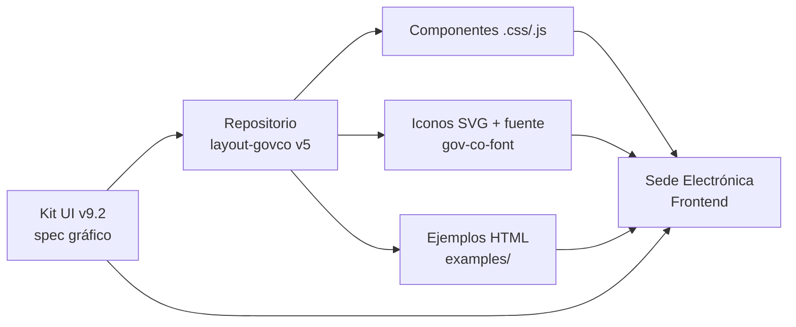

---

## 2.2 Identidad visual

### 2.2.1 Paleta de colores

La paleta proviene de dos fuentes canónicas que deben estar sincronizadas en el build:

1. **Kit UI v9.2 — pág. 8** (sección *Color / Paleta de colores de GOV.CO*).
2. **`src/all.css` v5 líneas 203-223** (variables CSS oficiales).

| Token CSS v5 | Hex | Nombre comercial | Uso Kit UI v9.2 | Sección PDF |
|---|---|---|---|---|
| `--govcolor-cobalt` | `#0943B5` | **Cobalt** | Color principal gov.co, barra superior, fondo del menú, CTAs. | pág. 8 (Principales) |
| `--govcolor-black` | `#000000` | Black | Texto sobre fondos claros, alto contraste. | pág. 8 |
| `--govcolor-matterhorn` | `#4C4C4C` | Matterhorn | Texto secundario, color sustituto de los ministerios cuando el color asignado no cumple WCAG. | pág. 8 (Complementarios) |
| `--govcolor-grey` | `#7E7E7E` | Grey | Estados deshabilitados, texto auxiliar. | pág. 8 |
| `--govcolor-white` | `#FFFFFF` | White | Fondo base de la página. | pág. 8 |
| `--govcolor-havelock-lue` | `#4672C8` | Havelock Blue | Enlace hover, foco visible secundario. | pág. 8 |
| `--govcolor-tropical-blue` | `#B5C7E9` | Tropical Blue | Fondo de zonas informativas, hover claro. | pág. 8 |
| `--govcolor-golden-brown` | `#9D7700` | Golden Brown | Advertencia — pendientes, foco de atención. | pág. 8 (Tranquilo / Pendiente) |
| `--govcolor-sunglow` | `#FECC2F` | Sunglow | Acento amarillo, foco principal en inputs. | pág. 8 (Libre / Avanzar) |
| `--govcolor-vis-vis` | `#FEE697` | Vis Vis | Fondo de alertas suaves, amarillo claro. | pág. 8 |
| `--govcolor-silver` | `#B9B9B9` | Silver | Bordes, divisores. | pág. 8 |
| `--govcolor-silver-dis` | `#C8C8C8` | Silver-disabled | Estado disabled de inputs. | pág. 8 (Campos deshabilitados) |
| `--govcolor-solitude` | `#E5ECF8` | Solitude | Fondo del menú de navegación y secciones suaves. | pág. 8 (Fondos) |
| `--govcolor-corn-silk` | `#FFFAE8` | Corn Silk | Fondo de advertencia suave. | pág. 8 |
| `--govcolor-white-smoke` | `#F4F4F4` | White Smoke | Fondo neutro, secciones alternas. | pág. 8 (Fondos) |
| `--govcolor-portage` | `#83A0DA` | Portage | Acento azul claro, gráficos. | pág. 8 |
| `--govcolor-red` | `#A80521` | Red | Universal informativo — error, peligro. | pág. 8 (Universales informativos) |
| `--govcolor-orange` | `#F0572D` | Orange | Universal informativo — atención, prevención. | pág. 8 |
| `--govcolor-yellow` | `#FDAA29` | Yellow | Universal informativo — advertencia. | pág. 8 |
| `--govcolor-green` | `#158361` | Green | Universal informativo — confirmación, éxito. | pág. 8 |
| `--govcolor-tulip` | `#E8A045` | Tulip | Color característico del Ministerio TIC; ejemplo del pie de página. | pág. 11 (Buenas prácticas del footer) |

**Reglas duras (Kit UI v9.2 pág. 8 — sección *Buenas prácticas*):**

- RF-PAL-01 — Texto oscuro sobre fondo claro (y viceversa). Prohibido combinar colores similares con poca diferencia de luminosidad.
- RF-PAL-02 — Contraste mínimo **4.5:1** para texto normal / enlaces / texto de botones (WCAG 2.1 AA).
- RF-PAL-03 — Contraste mínimo **3:1** para títulos o texto grande.
- RF-PAL-04 — Las combinaciones de color deben respetar las convenciones internacionales del semáforo (verde = éxito, amarillo = advertencia, rojo = error).
- RF-PAL-05 — Cada Ministerio usa el color asignado por el Manual de imagen de Gobierno; si el color no cumple el ratio mínimo de contraste WCAG 2.1, se sustituye por **`#4C4C4C` (Matterhorn)**.

### 2.2.2 Tipografía

Fuentes cargadas desde `src/assets/fonts/` y declaradas en `src/all.css` (líneas 1-65):

| Familia | Variantes en repo v5 | Variable CSS | Uso Kit UI v9.2 |
|---|---|---|---|
| **Nunito Sans** | Regular, Bold, SemiBold, ExtraBold, Medium, Italic, SemiBoldItalic | `Nunito_Sans-Regular` … `NunitoSans-ExtraBold` | **Títulos** (h1-h6) y descripciones de sección. |
| **Verdana** | Regular, Bold, Italic, BoldItalic | `Verdana-Regular` … `Verdana-BoldItalic` | **Párrafos, leyendas, pies de foto, textos largos.** |

> El Kit UI v9.2 pág. 12 recomienda explícitamente: *“Usa solo 2 tipos de letra para unificar tu página a GOV.CO”*.

#### 2.2.2.1 Jerarquía tipográfica desktop

Confirmada contra `src/all.css` (líneas 73-116) y Kit UI v9.2 pág. 12:

| Elemento | Familia | Variable | Tamaño | Interlineado |
|---|---|---|---|---|
| h1 | Nunito Sans | Bold | **42 px** | 50 px |
| h2 | Nunito Sans | Bold | **34 px** | 42 px |
| h3 | Nunito Sans | Bold | **26 px** | 32 px |
| h4 | Nunito Sans | Bold | **22 px** | 26 px |
| h5 | Nunito Sans | Bold | **20 px** | 24 px |
| h6 | Nunito Sans | Bold | **16 px** | 22 px |
| Description (text1-govco) | Nunito Sans | SemiBold | **20 px** | 22 px |
| Body text 1 (text2-govco) | Verdana | Regular | **15 px** | 22 px |
| Body text 2 | Verdana | Regular | **14 px** | 20 px |
| Caption (text3-govco) | Verdana | Regular | **12 px** | 20 px |

#### 2.2.2.2 Reglas tipográficas

- RF-TIP-01 — Líneas de texto entre **45 y 75 caracteres**; párrafos breves.
- RF-TIP-02 — **Nunca justificar** el texto (Kit UI v9.2 pág. 12).
- RF-TIP-03 — Lenguaje común, evitar tecnicismos.
- RF-TIP-04 — Usar unidades relativas (`%`, `em`, `rem`) en lugar de píxeles fijos (responsive).
- RF-TIP-05 — Máximo contraste entre texto y fondo.

### 2.2.3 Espaciado y rejilla

| Concepto | Valor | Fuente |
|---|---|---|
| **Base de la rejilla** | Bootstrap 5.0.2 — 12 columnas | `README.md` v5 |
| **Breakpoints** | `xs <576` · `sm ≥576` · `md ≥768` · `lg ≥992` · `xl ≥1200` · `xxl ≥1400` | Kit UI v9.2 pág. 14 (Cuadrícula) |
| **Gutter por defecto** | **24 px** entre columnas (vertical y horizontal) | Kit UI v9.2 pág. 14 |
| **Diagramaciones canónicas** | 6-6, 8-4, 4-4-4, 3-3-3-3 | Kit UI v9.2 pág. 14 |
| **Unidad base de píxeles** | múltiplos de **8 px** (pixel-perfect del Top bar) | Kit UI v9.2 pág. 7 (Barra superior) |
| **Unidad base de íconos** | múltiplos de **4 px** | Kit UI v9.2 pág. 10 (Iconografía) |
| **Padding lateral alerta** | **40 px** | Kit UI v9.2 pág. 17 (Alertas y notificaciones) |
| **Ancho alerta desktop** | 70 % del navegador | Kit UI v9.2 pág. 17 |
| **Ancho alerta responsive** | 100 % | Kit UI v9.2 pág. 17 |
| **Área activa táctil mínima** | **44 × 44 px** | Kit UI v9.2 pág. 7 (Barra superior — logo) y pág. 30 (Paginación móvil) |

### 2.2.4 Iconografía

- **Cantidad:** ~499 archivos SVG en `src/assets/icons/` (verificado vía GitLab API con paginación; primera página = 99, total combinado **499 íconos** únicos).
- **Fuente iconográfica:** `src/assets/icons/fonts/gov-co-font.{eot,svg,ttf,woff,woff2}` (cinco formatos, mismo glifo).
- **Atribución:** Paquete derivado de **Font Awesome 5 Free** + íconos propios de Gov.co. La librería CSS los invoca con la clase `govco-icon govco-<nombre>` mapeada al archivo `assets/icons/<nombre>.svg` (verificado en `src/all.css` líneas 2373-2378 para `info-circle` e `info`).
- **Reglas Kit UI v9.2 pág. 10 (Buenas prácticas):**
  - RF-ICO-01 — Ancho de trazo y elementos internos consistentes; tamaño sugerido en múltiplos de 4 px.
  - RF-ICO-02 — Íconos **escalables y responsive**.
  - RF-ICO-03 — Contraste adecuado con el entorno (WCAG 2.1).
  - RF-ICO-04 — Estandarización y consistencia en todo el sitio.
  - RF-ICO-05 — Íconos interactivos deben ser accesibles por teclado.

### 2.2.5 Logos y marca país

- **Logo GOV.CO** en barra superior: 24 × 136 px, color azul Cobalt `#0943B5`, redirecciona a `https://www.gov.co/home/` (Kit UI v9.2 pág. 7).
- **Botón cambio de idioma**: 24 × 24 px, alineado a la derecha de la barra superior (Kit UI v9.2 pág. 7).
- **Pie de página**: logos de la autoridad + GOV.CO + marca país Colombia-CO (alineados a la izquierda) + logo "Colombia, potencia de la vida" cuando aplique (Kit UI v9.2 pág. 11).
- **Imágenes disponibles en repo**: `src/assets/images/{logo.svg, logo-colombia.svg, co-colombia.png, Colombia-Potencia.png, Logo-v1-MinTIC.png, Logo-v2-MinTIC.png}`.

---

## 2.3 Sistema de componentes del Kit UI 9.2

Todos los componentes se sirven desde el CDN oficial **v5**:

```html
<link href="https://cdn.www.gov.co/layout/v5/all.css" rel="stylesheet">
<script src="https://cdn.www.gov.co/layout/v5/script.js"></script>
```

> Fuente: Biblioteca Digital de Componentes v5 — `https://cdn.www.gov.co/v5/` (página de instalación).

El Kit UI v9.2 organiza **24 componentes** en **3 grupos** (pág. 5 — *Lista de contenido*). Cada uno se mapea a su ruta verificable en `layout-govco v5` (`src/<grupo>/<componente>.{css,js}` y `examples/<grupo>/<componente>.html`).

### 2.3.1 Componentes transversales (8)

| # | Componente | Ruta CSS/JS en v5 | Ejemplo HTML | Cuándo usarlo (Kit UI v9.2) | PDF |
|---|---|---|---|---|---|
| 1 | **Barra de accesibilidad** | [`src/transversal/barra-accesibilidad.{css,js}`](https://gitlab.com/govco/layout-govco/-/tree/v5/src/transversal) | [`examples/transversal/barra-accesibilidad.html`](https://gitlab.com/govco/layout-govco/-/blob/v5/examples/transversal/barra-accesibilidad.html) | Obligatoria en todas las páginas; oculta entre 768-992 px. Ofrece *Aumentar letra · Reducir letra · Contraste*. | pág. 6 |
| 2 | **Barra superior (Top bar)** | [`src/transversal/barra-superior.{css,js}`](https://gitlab.com/govco/layout-govco/-/tree/v5/src/transversal) | [`examples/transversal/barra-superior.html`](https://gitlab.com/govco/layout-govco/-/blob/v5/examples/transversal/barra-superior.html) | Siempre en la parte superior, contiene logo GOV.CO + (opcional) botón de cambio de idioma. | pág. 7 |
| 3 | **Color** | [`src/transversal/color.css`](https://gitlab.com/govco/layout-govco/-/tree/v5/src/transversal) | [`examples/transversal/color.html`](https://gitlab.com/govco/layout-govco/-/blob/v5/examples/transversal/color.html) | Documento de la paleta + variables CSS `--govcolor-*` (ver §2.2.1). | pág. 8 |
| 4 | **Cabecera (Header)** | [`src/transversal/cabecera.{css,js}`](https://gitlab.com/govco/layout-govco/-/tree/v5/src/transversal) | [`examples/transversal/cabecera.html`](https://gitlab.com/govco/layout-govco/-/blob/v5/examples/transversal/cabecera.html) | Top bar + logo de la autoridad + buscador + menú de navegación. Implementar *Saltar al contenido principal* con clase `sr-only sr-only-focusable`. | pág. 9 |
| 5 | **Iconografía** | [`src/transversal/iconografia.css`](https://gitlab.com/govco/layout-govco/-/tree/v5/src/transversal) · `src/assets/icons/*.svg` (499 archivos) | [`examples/transversal/iconografia.html`](https://gitlab.com/govco/layout-govco/-/blob/v5/examples/transversal/iconografia.html) | Catálogo de íconos SVG + fuente iconográfica `gov-co-font`. | pág. 10 |
| 6 | **Pie de página (Footer)** | [`src/transversal/pie-de-pagina.css`](https://gitlab.com/govco/layout-govco/-/tree/v5/src/transversal) | [`examples/transversal/pie-de-pagina.html`](https://gitlab.com/govco/layout-govco/-/blob/v5/examples/transversal/pie-de-pagina.html) | Versión A: 1-3 sedes · Versión B: más de 3 sedes. Subir contraste mínimo 4.5:1. | pág. 11 |
| 7 | **Tipografía** | [`src/transversal/tipografia.css`](https://gitlab.com/govco/layout-govco/-/tree/v5/src/transversal) | [`examples/transversal/tipografia.html`](https://gitlab.com/govco/layout-govco/-/blob/v5/examples/transversal/tipografia.html) | Nunito Sans (títulos) + Verdana (cuerpo). | pág. 12 |
| 8 | **Volver arriba** | [`src/transversal/volver-arriba.{css,js}`](https://gitlab.com/govco/layout-govco/-/tree/v5/src/transversal) | [`examples/transversal/volver-arriba.html`](https://gitlab.com/govco/layout-govco/-/blob/v5/examples/transversal/volver-arriba.html) | Botón flotante fijo en la esquina inferior derecha de páginas con scroll largo. | pág. 13 |

### 2.3.2 Componentes generales (11)

| # | Componente | Ruta CSS/JS en v5 | Ejemplo HTML | Cuándo usarlo (Kit UI v9.2) | PDF |
|---|---|---|---|---|---|
| 9 | **Acordeón** | [`src/general/acordeon.css`](https://gitlab.com/govco/layout-govco/-/tree/v5/src/general) | [`examples/general/acordeon.html`](https://gitlab.com/govco/layout-govco/-/blob/v5/examples/general/acordeon.html) | Desplegar/ocultar contenido con encabezado. Dos variantes: básico y con ícono/número. Atributo `aria-expanded` obligatorio. | pág. 15 |
| 10 | **Alerta modal** | [`src/general/alerta-modal.{css,js}`](https://gitlab.com/govco/layout-govco/-/tree/v5/src/general) | [`examples/general/alerta-modal.html`](https://gitlab.com/govco/layout-govco/-/blob/v5/examples/general/alerta-modal.html) | Diálogo emergente. Variantes: básica, advertencia, error, éxito, confirmación. Cerrar con `Esc` o clic fuera. | pág. 16 |
| 11 | **Alertas y notificaciones** | [`src/general/alerta-notificacion.{css,js}`](https://gitlab.com/govco/layout-govco/-/tree/v5/src/general) | [`examples/general/alerta-notificacion.html`](https://gitlab.com/govco/layout-govco/-/blob/v5/examples/general/alerta-notificacion.html) | Notificaciones tipo **toast** (parte superior de pantalla) y emergentes. 3 variantes: informativa, positiva (verde), negativa (rojo). | pág. 17 |
| 12 | **Área de servicio** | — (CSS sólo en transversal; sin archivo propio en `src/general/`) | — | Módulos de *¿Cómo fue tu experiencia?* y *¿Tienes dudas sobre este trámite?*. Solo en Trámites y servicios. | pág. 18 |
| 13 | **Botones** | [`src/assets/transversal/buttons/*.svg`](https://gitlab.com/govco/layout-govco/-/tree/v5/src/assets/transversal/buttons) | [`examples/general/botones.html`](https://gitlab.com/govco/layout-govco/-/blob/v5/examples/general/botones.html) | 5 tipos: **texto, contorno, contenido, simbólico, mixto**. 4 estados: Default · Hover · Focus · Disabled. 4 énfasis. | pág. 19 |
| 14 | **Buscador** | [`src/general/buscador.{css,js}`](https://gitlab.com/govco/layout-govco/-/tree/v5/src/general) | [`examples/general/buscador.html`](https://gitlab.com/govco/layout-govco/-/blob/v5/examples/general/buscador.html) | Básico y predictivo (con autocompletar e historial). Visible en top bar, cabecera, trámite o tabla. | pág. 20 |
| 15 | **Galería de aplicaciones** | [`src/general/galeria-de-aplicaciones.{css,js}`](https://gitlab.com/govco/layout-govco/-/tree/v5/src/general) | [`examples/general/galeria-de-aplicaciones.html`](https://gitlab.com/govco/layout-govco/-/blob/v5/examples/general/galeria-de-aplicaciones.html) | Menú superior (esquina) con apps del portal GOV.CO. Hasta 3 columnas verticales. | pág. 21 |
| 16 | **Carrusel** | [`src/general/carrusel.{css,js}`](https://gitlab.com/govco/layout-govco/-/tree/v5/src/general) | [`examples/general/carrusel.html`](https://gitlab.com/govco/layout-govco/-/blob/v5/examples/general/carrusel.html) | Conjunto de imágenes/texto en home o secciones principales. Obligatorio: indicadores de posición, controles reproducir/pausar y flechas. | pág. 22 |
| 17 | **Descripción emergente (Tooltip)** | — (estilos en `src/all.css` general) | — | Mensaje corto al pasar el cursor sobre un elemento interactivo. Atributo `role="tooltip"`. | pág. 23 |
| 18 | **Etiquetas** | — (estilos en `src/all.css`) | — | 4 tipos: informativa, de estado (verde/amarillo/rojo), de filtro, indicador de filtro. | pág. 24 |
| 19 | **Indicador de carga (Spinner)** | — | — | “spinner” Bootstrap con tamaño definido. Modal con fondo negro 20 % opacidad o fondo blanco. | pág. 25 |
| 20 | **Línea de avance (Stepper)** | — | — | 2 variantes: **posición** (sólo informativa) e **interacción** (ir atrás/adelante). Vertical u horizontal. | pág. 26 |
| 21 | **Menú de navegación** | [`src/general/menu-de-navegacion.{css,js}`](https://gitlab.com/govco/layout-govco/-/tree/v5/src/general) | [`examples/general/menu-de-navegacion.html`](https://gitlab.com/govco/layout-govco/-/blob/v5/examples/general/menu-de-navegacion.html) | Hasta **7 ítems principales**, hasta **4 secciones internas** con subsecciones (mega menú). `aria-label` obligatorio. | pág. 27 |
| 22 | **Miga de pan** | [`src/general/miga-de-pan.css`](https://gitlab.com/govco/layout-govco/-/tree/v5/src/general) | [`examples/general/miga-de-pan.html`](https://gitlab.com/govco/layout-govco/-/blob/v5/examples/general/miga-de-pan.html) | Bajo el header, en todas las secciones excepto el Home. Versión *contenido* (fondo claro) e *invertida* (fondo oscuro). | pág. 28 |
| 23 | **Módulo de inicio de sesión** | — (estilos en `src/all.css`; `src/form/` cubre los inputs) | — | Sub-variantes: Persona natural · Persona jurídica. Botones *Registrar nuevo usuario*, *Olvidé mi contraseña*, *Iniciar sesión*. | pág. 29 |
| 24 | **Paginación** | — | — | Numeración + *Anterior / Siguiente*. Tamaño mínimo 44 × 44 px en móvil. | pág. 30 |
| 25 | **Pestañas** | — | — | Horizontal (máx. 23 caracteres) o vertical (máx. 30 caracteres). No anidar desplegables. | pág. 31 |
| 26 | **Tablas** | [`src/general/tablas.{css,js}`](https://gitlab.com/govco/layout-govco/-/tree/v5/src/general) | [`examples/general/tablas.html`](https://gitlab.com/govco/layout-govco/-/blob/v5/examples/general/tablas.html) | Datos tabulares. Variantes: básica, fila acentuada, aplicaciones, diseño adaptativo/responsivo, anidamiento. | pág. 32 |
| 27 | **Tarjeta de información** | [`src/general/tarjetas-de-informacion.css`](https://gitlab.com/govco/layout-govco/-/tree/v5/src/general) | [`examples/general/tarjetas-de-informacion.html`](https://gitlab.com/govco/layout-govco/-/blob/v5/examples/general/tarjetas-de-informacion.html) | 3 tipos: **imagen+texto**, **ícono/ilustración+texto** (horizontal/vertical), **tipo módulo**. Enmarcar siempre con `<a>` o `<button>`. | pág. 33 |

### 2.3.3 Componentes de formulario (4)

| # | Componente | Ruta CSS/JS en v5 | Ejemplo HTML | Cuándo usarlo (Kit UI v9.2) | PDF |
|---|---|---|---|---|---|
| 28 | **Carga de archivos** | [`src/form/carga-archivos.{css,js}`](https://gitlab.com/govco/layout-govco/-/tree/v5/src/form) | [`examples/form/Carga-de-archivo.html`](https://gitlab.com/govco/layout-govco/-/blob/v5/examples/form/Carga-de-archivo.html) | Subir archivos. Peso máximo mostrado en texto auxiliar. Tipos admitidos declarados. | pág. 34 |
| 29 | **Desplegables (Select)** | [`src/form/desplegable.{css,js}`](https://gitlab.com/govco/layout-govco/-/tree/v5/src/form) | [`examples/form/desplegable.html`](https://gitlab.com/govco/layout-govco/-/blob/v5/examples/form/desplegable.html) | 4 tipos: **lista, con filtro de búsqueda, con casillas de verificación, calendario**. Lista: máx. 5 elementos visibles. | pág. 35 |
| 30 | **Entradas de texto** | [`src/form/entradas-texto.css` · `entradas-de-texto.js`](https://gitlab.com/govco/layout-govco/-/tree/v5/src/form) | [`examples/form/entradas-de-texto.html`](https://gitlab.com/govco/layout-govco/-/blob/v5/examples/form/entradas-de-texto.html) | 6 variantes: **básico, con contador, con nota, contraseña, correo, teléfono**. Asterisco `*` para obligatorio. | pág. 36 |
| 31 | **Opciones de selección** | [`src/form/opcion-de-seleccion.css`](https://gitlab.com/govco/layout-govco/-/tree/v5/src/form) | [`examples/form/opcion-de-seleccion.html`](https://gitlab.com/govco/layout-govco/-/blob/v5/examples/form/opcion-de-seleccion.html) | 3 controles: **casillas de verificación (checkbox)**, **interruptores (switch)**, **radio buttons**. Alineación vertical/horizontal. | pág. 37 |

> **Nota metodológica:** Los componentes 12 (Área de servicio), 17 (Descripción emergente), 18 (Etiquetas), 19 (Indicador de carga), 20 (Línea de avance), 23 (Módulo de inicio de sesión) y 24 (Paginación) figuran en el Kit UI v9.2 pero **no tienen carpeta propia en `src/`**. Sus estilos viven en `src/all.css` (CSS consolidado de 12 286 líneas) y/o se apoyan en clases Bootstrap 5.0.2. Esto es consistente con la práctica de *consolidar* los transversales/generales pequeños en el bundle final.

### 2.3.4 Diagrama de integración

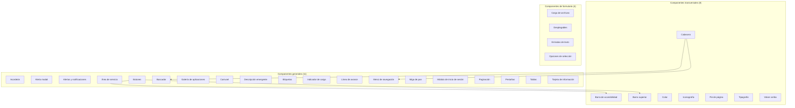

---

## 2.4 Criterios de aceptación de diseño

> **Severidad:** 🔴 **Bloqueante** · 🟠 **Mayor** · 🟡 **Menor**

| ID | Criterio | Severidad | Evidencia / Fuente |
|---|---|---|---|
| **CAG-01** | Los elementos controladores del **carrusel** NO deben solaparse ni confundirse con las imágenes o fondos. Si ocurre, añadir fondo a los controles de navegación o ubicarlos fuera del carrusel. | 🔴 | Infografía Pictoline — `attachments/2d669a7f2d225e7d/Criterios de aceptación de diseño para tu sede electrónica.pdf` (única página, punto 1 y 2). |
| **CAG-02** | Carrusel: implementar indicadores de posición, flechas de navegación **y** controles de reproducción/pausa (todos obligatorios). | 🔴 | Kit UI v9.2 pág. 22 (Buenas prácticas del Carrusel). |
| **CAG-03** | Carrusel: ratio mínimo de contraste **4.5:1** entre contenido y controles. | 🔴 | Kit UI v9.2 pág. 22 (Accesibilidad del Carrusel). |
| **CAG-04** | Carrusel: las imágenes deben llevar `alt`, `aria-label` o `aria-labelledby`. | 🟠 | Kit UI v9.2 pág. 22. |
| **CAG-05** | Barra superior: logo GOV.CO 24 × 136 px, color `#0943B5` y enlaza a `https://www.gov.co/home/`. | 🔴 | Kit UI v9.2 pág. 7. |
| **CAG-06** | Botón de cambio de idioma: 24 × 24 px, alineado a la derecha, `aria-label` corto y descriptivo, idioma persistente. | 🟠 | Kit UI v9.2 pág. 7. |
| **CAG-07** | Barra de accesibilidad: incluir Aumentar letra · Reducir letra · Contraste; oculta entre 768-992 px. | 🔴 | Kit UI v9.2 pág. 6. |
| **CAG-08** | Cabecera: incluir enlace/en botón **“Saltar al contenido principal”** (clase `sr-only sr-only-focusable`, destino `#contenido-principal`). Obligatorio en Sedes electrónicas y Trámites y servicios. | 🔴 | Kit UI v9.2 pág. 9. |
| **CAG-09** | Menú de navegación: **máximo 7 ítems principales** y **máximo 4 secciones internas** (mega menú) por ítem principal. | 🔴 | Kit UI v9.2 pág. 27. |
| **CAG-10** | Menú de navegación: `aria-label` en el menú principal; navegación completa por teclado; contraste de foco ≥ 4.5:1. | 🔴 | Kit UI v9.2 pág. 27. |
| **CAG-11** | Miga de pan: presente en todas las secciones excepto Home. Versión *invertida* sólo sobre fondo oscuro. | 🔴 | Kit UI v9.2 pág. 28. |
| **CAG-12** | Pie de página: contraste mínimo 4.5:1. Incluir logo autoridad + GOV.CO + Colombia-CO (+ “Colombia, potencia de la vida” cuando aplique). | 🔴 | Kit UI v9.2 pág. 11. |
| **CAG-13** | Botones: usar `<button type="button">` con `aria-label` si sólo llevan ícono. Distinguir estados `:hover` y `:focus`. | 🔴 | Kit UI v9.2 pág. 19. |
| **CAG-14** | Botones deshabilitados: atributo `disabled`, fuera del orden de tabulación. | 🟠 | Kit UI v9.2 pág. 19. |
| **CAG-15** | Buscador: placeholder claro (ej. “Buscar aquí…”); permitir borrar el contenido; navegable por teclado. | 🟠 | Kit UI v9.2 pág. 20. |
| **CAG-16** | Campos de formulario: asterisco `*` para obligatorios + leyenda inicial. Etiquetas con `<label>` y `for=`. | 🟠 | Kit UI v9.2 págs. 29, 36 y 37. |
| **CAG-17** | Entradas de texto: borde con ratio mínimo de contraste; estados Default/Active/Focus/Disabled/Valid/Invalid; usar `autocomplete` cuando aplique. | 🟠 | Kit UI v9.2 pág. 36. |
| **CAG-18** | Desplegable-lista: máximo **5 elementos visibles** antes de scroll. | 🟡 | Kit UI v9.2 pág. 35. |
| **CAG-19** | Calendario: estilo debe ser similar al propuesto en la sección Desplegables. | 🟡 | Kit UI v9.2 pág. 35. |
| **CAG-20** | Línea de avance: contraste de foco ≥ 4.5:1; permitir saltar pasos libremente o bloquearlos según obligatoriedad. | 🟠 | Kit UI v9.2 pág. 26. |
| **CAG-21** | Alerta modal: cerrable con tecla **Esc** y clic fuera; no anidar modales; máximo 1 modal simultáneo. | 🔴 | Kit UI v9.2 pág. 16. |
| **CAG-22** | Notificaciones toast: duración suficiente para lectura + cierre automático programado por la entidad. | 🟠 | Kit UI v9.2 pág. 17. |
| **CAG-23** | Paginación: tamaño mínimo 44 × 44 px en móvil; `aria-current` en la página activa. | 🟠 | Kit UI v9.2 pág. 30. |
| **CAG-24** | Tablas: números alineados a la derecha; evitar scroll horizontal en responsive (usar adaptativo o responsive). | 🟡 | Kit UI v9.2 pág. 32. |
| **CAG-25** | Acordeón: `aria-expanded` obligatorio; **no abrir automáticamente** con foco; jerarquía de encabezados. | 🔴 | Kit UI v9.2 pág. 15. |
| **CAG-26** | Tarjeta de información: encerrada en `<a>` o `<button>`; 2 palabras máx. en el título (CTA). | 🟠 | Kit UI v9.2 pág. 33. |
| **CAG-27** | Tipografía: nunca justificar texto; 45-75 caracteres por línea; unidades relativas. | 🟡 | Kit UI v9.2 pág. 12. |
| **CAG-28** | Color: contraste 4.5:1 (texto normal) y 3:1 (texto grande). | 🔴 | Kit UI v9.2 pág. 8. |
| **CAG-29** | Indicador de carga: si > 10 s, informar al usuario del progreso. | 🟠 | Kit UI v9.2 pág. 25. |
| **CAG-30** | Volver arriba: ubicado en esquina inferior derecha, foco visible al recibir tabulación. | 🟡 | Kit UI v9.2 pág. 13. |
| **CAG-31** | Galería de aplicaciones: recorrido por teclado izquierda→derecha, arriba→abajo; abre con `Enter` y cierra con `Esc`. | 🟠 | Kit UI v9.2 pág. 21. |
| **CAG-32** | Todos los componentes: cumplir **Resolución 1519 de 2020** y **WCAG 2.1 AA**. | 🔴 | Kit UI v9.2 pág. 2 (sección Accesibilidad replicada en cada componente). |
| **CAG-33** | El código debe construirse sobre **Bootstrap 5.0.2** y los CSS variables `--govcolor-*` declarados en `src/all.css`. | 🔴 | `README.md` v5 + `src/all.css` (líneas 203-223). |
| **CAG-34** | El frontend debe servirse desde el CDN oficial **v5** (`https://cdn.www.gov.co/layout/v5/all.css` + `script.js`) o construir con la copia local del repo. | 🟠 | `cdn.www.gov.co/v5/` (página de instalación). |

> **Sobre la fuente “Criterios de aceptación de diseño para tu sede electrónica.pdf”**: el documento es una **infografía de 1 página** (formato 1200×1760 pt, fecha de creación 1-dic-2022, productor Adobe PDF library 16.07) centrada exclusivamente en el criterio **CAG-01** del carrusel. El segundo PDF (`293453edc7e28a0d/`) es un duplicado binario verificado por hash MD5 (`1fa2bd2b2865de47b56f1f414cdca270`). El grueso de los criterios de aceptación proviene, por tanto, del **Kit UI v9.2** y de la práctica descrita en el repositorio `layout-govco v5`.

---

## 2.5 Mapa página → componente del Kit UI

Mapa de las páginas típicas de una Sede Electrónica y los componentes del Kit UI v9.2 que deben instanciarse en cada una. Las filas marcadas **(REQ)** son obligatorias según el tipo de sede (Kit UI v9.2 pág. 5, *Requerido, mínimamente, en:*).

| Página / Sección | Componentes a usar | Notas |
|---|---|---|
| **Layout global (todas las páginas)** | Barra de accesibilidad · Barra superior · Cabecera · Menú de navegación · Miga de pan · Pie de página · Volver arriba | (REQ) Sedes electrónicas, Trámites y servicios, Ventanillas únicas y Portales transversales. |
| **Home / Inicio** | Carrusel · Tarjeta de información · Buscador · Galería de aplicaciones · Botones · Etiquetas | Usar **carrusel sin texto** o **carrusel múltiple** según el caso (Kit UI v9.2 pág. 22). |
| **Trámites y servicios (listado)** | Tablas · Paginación · Buscador predictivo · Tarjeta de información (tipo módulo) · Etiquetas de filtro · Acordeón | Tabla con filas acentuadas y ordenamiento ascendente/descendente (Kit UI v9.2 pág. 32). |
| **Detalle de trámite** | Línea de avance (stepper) · Pestañas · Área de servicio · Acordeón · Botones · Alertas y notificaciones | Stepper en variantes **horizontal** y **vertical** (Kit UI v9.2 pág. 26). |
| **Formularios (login, registro, solicitud)** | Módulo de inicio de sesión · Entradas de texto · Desplegables · Opciones de selección · Carga de archivos · Botones · Alertas y notificaciones | Variante persona natural/jurídica (Kit UI v9.2 pág. 29). |
| **Búsqueda y resultados** | Buscador (predictivo) · Paginación · Etiquetas de filtro · Tablas | Historial y autocompletar (Kit UI v9.2 pág. 20). |
| **Atención al ciudadano** | Área de servicio · Acordeón · Tarjeta de información · Buscador · Botones | Módulos *¿Cómo fue tu experiencia?* + *¿Tienes dudas?* (Kit UI v9.2 pág. 18). |
| **Ventanillas únicas / Portales transversales** | Todos los transversales + Tablas + Tarjetas + Botones + Buscador | Adaptar versión del Footer (Kit UI v9.2 pág. 11). |
| **Notificaciones globales** | Alertas y notificaciones (toast + emergente) | Sólo una alerta a la vez (Kit UI v9.2 pág. 17). |

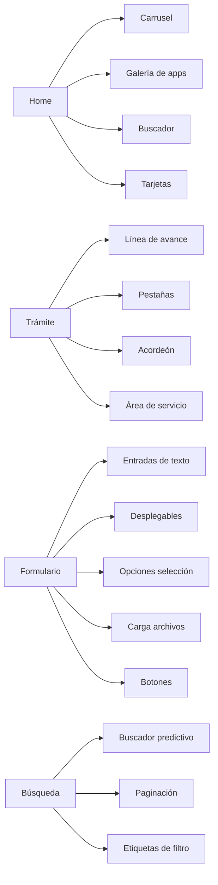

---

## 2.6 Checklist pre-entrega de diseño

Lista de verificación que el **diseñador UI/UX** y el **frontend lead** deben firmar antes de mergear a `main`. Las verificaciones automáticas (lint/a11y) se realizan en CI; las manuales las ejecuta QA.

### 2.6.1 Sistema visual

- [ ] La paleta activa usa **únicamente** los 21 tokens `--govcolor-*` declarados en `src/all.css` (no se introducen colores nuevos sin justificación documentada).
- [ ] Tipografía: sólo **Nunito Sans** + **Verdana**; las jerarquías desktop y responsive coinciden con §2.2.2.
- [ ] Rejilla: **Bootstrap 5.0.2** con gutter 24 px y los 6 breakpoints estándar.
- [ ] Íconos: sólo se usan los 499 SVG de `src/assets/icons/` o la fuente `gov-co-font.{woff2,woff,ttf,svg,eot}`.
- [ ] Logos: barra superior → `https://www.gov.co/home/`; pie de página → autoridad + GOV.CO + Colombia-CO.

### 2.6.2 Componentes

- [ ] Los 8 transversales, 11 generales y 4 de formulario requeridos por el flujo de la Sede Electrónica están instanciados **desde el repositorio v5** (no se reimplementan a mano).
- [ ] Cada componente expone los **estados Accesibilidad** documentados (Default, Hover, Focus, Disabled cuando aplique).
- [ ] Los **ejemplos HTML** en `examples/<grupo>/<componente>.html` se han utilizado como referencia canónica.

### 2.6.3 Criterios de aceptación (CAG-01 a CAG-34)

- [ ] CAG-01 a CAG-04 (carrusel) — verificados manualmente en navegador y con DevTools.
- [ ] CAG-05 a CAG-08 (cabecera y barras) — verificados.
- [ ] CAG-09 a CAG-12 (menú, miga, pie) — verificados.
- [ ] CAG-13 a CAG-19 (botones, buscador, formularios) — verificados.
- [ ] CAG-20 a CAG-31 (stepper, modal, toast, paginación, tablas, acordeón, tarjeta, tipografía, color, spinner, volver arriba, galería) — verificados.
- [ ] CAG-32 (Resolución 1519/2020 + WCAG 2.1 AA) — **validado con axe-core / Lighthouse** (sin violaciones “Serious” o “Critical”).
- [ ] CAG-33 (Bootstrap 5.0.2 + variables `--govcolor-*`) — verificado en build.
- [ ] CAG-34 (CDN v5 o copia local) — la rama `v5` del repo está pinneada por SHA en `package.json`/`composer.json` o importada desde `https://cdn.www.gov.co/layout/v5/`.

### 2.6.4 Accesibilidad (resumen — ver sección 3 del expediente)

- [ ] Contraste mínimo **4.5:1** en texto normal; **3:1** en texto grande (verificado con WebAIM Contrast Checker).
- [ ] Navegación 100 % por teclado (`Tab`, `Shift+Tab`, `Enter`, `Esc`, flechas).
- [ ] Foco visible con outline ≥ 2 px y ratio de contraste suficiente.
- [ ] `aria-label`, `aria-expanded`, `aria-current`, `role="tooltip"` aplicados según el componente.
- [ ] Saltar al contenido principal en Sedes y Trámites.

### 2.6.5 Responsive

- [ ] Probado en los 6 breakpoints Bootstrap 5.0.2 (`xs`, `sm`, `md`, `lg`, `xl`, `xxl`).
- [ ] Sin scroll horizontal en `xs`.
- [ ] Carrusel, acordeón, tarjetas y tablas se adaptan correctamente.
- [ ] Barra de accesibilidad oculta entre 768 y 992 px.

### 2.6.6 Rendimiento y entrega

- [ ] `all.css` y `script.js` se sirven desde el CDN `https://cdn.www.gov.co/layout/v5/` o desde una copia local cacheada.
- [ ] Íconos SVG inline sólo cuando son críticos; resto vía clase `govco-icon govco-<nombre>`.
- [ ] Las fuentes Nunito Sans están en `font-display: swap`.
- [ ] Captura de pantalla (Desktop 1440 + Mobile 375) adjunta al PR.

---

## Referencias

### Documentos fuente

| Recurso | Ruta local / URL |
|---|---|
| Infografía Pictoline — “Criterios de aceptación de diseño para tu sede electrónica” (2022, 1 pág.) | `/workspace/attachments/2d669a7f2d225e7d/Criterios de aceptación de diseño para tu sede electrónica.pdf` |
| Duplicado verificado MD5 `1fa2bd2b2865de47b56f1f414cdca270` | `/workspace/attachments/293453edc7e28a0d/Criterios de aceptación de diseño para tu sede electrónica.pdf` |
| Kit UI v9.2 (MinTIC · AND, agosto 2025, 37 págs.) | `/workspace/attachments/3f47348b6a2cb4e4/65142f4c-971a-4e15-bf29-c11ade54ac20-kit-ui-9-2.pdf` |

### Repositorio y CDN oficiales

| Recurso | URL |
|---|---|
| Repositorio GitLab (rama `v5`) | <https://gitlab.com/govco/layout-govco/-/tree/v5> |
| README del proyecto | <https://gitlab.com/govco/layout-govco/-/blob/v5/README.md> |
| `src/all.css` (consolidado) | <https://gitlab.com/govco/layout-govco/-/blob/v5/src/all.css> |
| Índice `src/` (transversal · general · form) | <https://gitlab.com/govco/layout-govco/-/tree/v5/src> |
| Ejemplos HTML canónicos | <https://gitlab.com/govco/layout-govco/-/tree/v5/examples> |
| Activos (fuentes, íconos, imágenes) | <https://gitlab.com/govco/layout-govco/-/tree/v5/src/assets> |
| Biblioteca Digital de Componentes v5 (CDN) | <https://cdn.www.gov.co/v5/> |
| Wiki / Documentación v5 | <https://precdn.www.gov.co/v5/home> |

### Marco normativo vinculado

- Resolución **1519 de 2020** — MinTIC (accesibilidad web).
- WCAG 2.1 nivel AA — W3C.
- Directiva Presidencial **COLOMBIA POTENCIA DE LA VIDA** (2023-05-31) — uso de los colores Ministeriales.
- Manual de imagen de Gobierno — Presidencia de la República.

### Páginas citadas del Kit UI v9.2

| Sección | Páginas |
|---|---|
| Portada + navegación | 1–5 |
| Barra de accesibilidad | 6 |
| Barra superior | 7 |
| Color | 8 |
| Cabecera | 9 |
| Iconografía | 10 |
| Pie de página | 11 |
| Tipografía | 12 |
| Volver arriba | 13 |
| Cuadrícula | 14 |
| Acordeón | 15 |
| Alerta modal | 16 |
| Alertas y notificaciones | 17 |
| Área de servicio | 18 |
| Botones | 19 |
| Buscador | 20 |
| Galería de aplicaciones | 21 |
| Carrusel | 22 |
| Descripción emergente | 23 |
| Etiquetas | 24 |
| Indicador de carga | 25 |
| Línea de avance | 26 |
| Menú de navegación | 27 |
| Miga de pan | 28 |
| Módulo de inicio de sesión | 29 |
| Paginación | 30 |
| Pestañas | 31 |
| Tablas | 32 |
| Tarjeta de información | 33 |
| Carga de archivos | 34 |
| Desplegables | 35 |
| Entradas de texto | 36 |
| Opciones de selección | 37 |

---

> **Próximo paso editorial:** consolidar este documento con la **Sección 3 (Accesibilidad)**, donde se reproducirán y ampliarán los criterios WCAG 2.1 AA que el Kit UI v9.2 referencia en cada componente.


---

## 3. Accesibilidad web

> **Audiencia:** desarrollador frontend + QA.
> **Marco técnico obligatorio:** WCAG 2.1 nivel AA (Resolución MinTIC 1519/2020, art. 3 y Anexo 1).
> **Convención documental:** `[F]` = hecho verificado contra fuente citada; `[A]` = inferencia del autor basada en la práctica estándar de la industria y en documentación oficial W3C/WAI, no escrita literalmente en la fuente.
> **Citación a los PPT:** cada vez que aparece "Diapositiva X — archivo Y", la cita fue extraída con `python-pptx 1.0.2` y comprobada contra el archivo indicado en la sección [Referencias](#referencias).

---

## 3.1 Marco de cumplimiento

### 3.1.1 Estándar técnico aplicable en Colombia

`[F]` El PPT base declara en la **Diapositiva 7** (archivo `c0828ca923574455/Accesibilidad web para Sedes Electrónicas.pptx`, md5 `a927a8cd…`):

> *"Pautas de accesibilidad para el contenido web. Versión vigente en Colombia: WCAG 2.1."*
>
> Nota al pie: *"\* A partir del 01 de enero de 2022 — Nivel AA."*

Lo anterior se alinea con la norma colombiana vigente:

| Norma | Artículo / Anexo | Qué establece |
|---|---|---|
| Ley 1712 de 2014 (Ley de Transparencia y Acceso a la Información Pública) | arts. 1, 2, 5, 17 | Derecho de toda persona a acceder a información pública veraz, oportuna, accesible y reutilizable. |
| Decreto 1081 de 2015 (DUR del Sector TIC) | art. 2.1.1.2.2.2 | Faculta a MinTIC para expedir lineamientos de accesibilidad web. |
| Resolución MinTIC 1519 de 2020 | art. 3 y Anexo 1 | *"A partir del 1 de enero del 2022, los sujetos obligados deberán dar cumplimiento a los estándares AA de la Guía de Accesibilidad de Contenidos Web (WCAG) en la versión 2.1."* (vigente, fuente: https://normograma.mintic.gov.co/mintic/compilacion/docs/resolucion_mintic_1519_2020.htm). |

`[F]` La Resolución 1519/2020 está referenciada por W3C WAI en su registro de políticas públicas: https://www.w3.org/WAI/policies/colombia/ — Colombia figura como **WCAG 2.1**, ley de 2020, alcance al sector público, tipo *accessibility law*.

`[F]` WCAG 2.1 es una Recomendación W3C publicada en junio de 2018; WCAG 2.2 fue publicada como Recomendación W3C el **5 de octubre de 2023** (fuente: https://www.w3.org/news/2023/web-content-accessibility-guidelines-wcag-2-2-is-a-w3c-recommendation/).

### 3.1.2 Conclusión sobre la versión a aplicar

`[A]` Para esta guía y hasta tanto MinTIC no actualice la Resolución 1519/2020 o expida un acto administrativo que adopte WCAG 2.2, **toda Sede Electrónica colombiana debe cumplir WCAG 2.1 nivel AA como mínimo legal obligatorio**. WCAG 2.2 es *backward-compatible* — todos los criterios de 2.1 siguen vigentes — por lo que conviene aplicarlo desde ya como objetivo de ingeniería y documentar la diferencia (ver §3.1.4).

### 3.1.3 Sujetos obligados y alcance

`[F]` Conforme al art. 2º de la Resolución 1519/2020, son sujetos obligados los enumerados en el art. 5º de la Ley 1712/2014 (corregido por el art. 1º del Decreto 1494/2015). Esto incluye, entre otros:

- Ramas del poder público, órganos de control, organización electoral.
- Entidades de la rama ejecutiva nacional y territorial (central y descentralizada).
- Personas naturales y jurídicas que reciban o intermedien fondos públicos o presten servicios públicos.
- Cualquier entidad obligada a publicar información pública o a interactuar con ciudadanos por canal digital.

`[F]` El Anexo 1 de la Resolución 1519/2020 es de aplicación obligatoria en *"todos los procesos de actualización, estructuración, reestructuración, diseño y rediseño de sus portales web y sedes electrónicas, así como de los contenidos existentes en esas"* (fuente: https://gobiernodigital.mintic.gov.co/692/articles-160770_Directrices_Accesibilidad_web.pdf).

### 3.1.4 Diferencias entre WCAG 2.1 (obligatorio) y WCAG 2.2 (recomendado)

`[F]` WCAG 2.2 introduce 9 criterios nuevos respecto a 2.1. Ninguno relaja criterios existentes. Fuente: https://www.w3.org/TR/WCAG22/ y https://www.w3.org/WAI/standards-guidelines/wcag/new-in-22/.

| # | Criterio nuevo en WCAG 2.2 | Nivel | Aplicabilidad en Sede Electrónica |
|---|---|---|---|
| 2.4.11 | Focus Not Obscured (Minimum) | AA | Aplicable — banners fijos, cookies banner, chat de WhatsApp embebido. |
| 2.4.12 | Focus Not Obscured (Enhanced) | AAA | `[A]` Recomendable para modales y wizards de radicación PQRS. |
| 2.4.13 | Focus Appearance | AAA | `[A]` Útil para formularios críticos (login, pago, firma). |
| 2.5.7 | Dragging Movements | AA | Aplicable — carruseles, drag-and-drop de archivos en carga masiva. |
| 2.5.8 | Target Size (Minimum) 24×24 CSS px | AA | Aplicable — botones de "Cerrar", iconos de tabla, chips. |
| 3.2.6 | Consistent Help | A | Aplicable — bloque de ayuda y contacto repetido en cada página. |
| 3.3.7 | Redundant Entry | A | Aplicable — wizard de PQRS no debe pedir dos veces el mismo dato. |
| 3.3.8 | Accessible Authentication (Minimum) | AA | Aplicable — login con CAPTCHA, autenticación con clave. |
| 3.3.9 | Accessible Authentication (Enhanced) | AAA | `[A]` Recomendable en flujos de autogestión de identidad. |

### 3.1.5 Sanciones y consecuencias

`[A]` El incumplimiento de los estándares AA de WCAG 2.1 desde el 1 de enero de 2022 no trae aparejada, por sí misma, una sanción económica tasada en la Resolución 1519/2020; sin embargo, activa los siguientes riesgos administrativos y reputacionales, todos verificables contra la normatividad vigente:

1. **Acción de cumplimiento (Ley 393/1997, arts. 1-5)** — cualquier persona puede exigir judicialmente el cumplimiento de la Ley 1712/2014.
2. **Seguimiento de la Procuraduría General de la Nación** — la PGN monitorea el cumplimiento de la Resolución 1519/2020 a través del Formulario Único de Reporte de Avance en la Gestión (FURAG) y del Índice de Transparencia y Acceso a la Información Pública (ITA).
3. **Multa de la SIC por protección de datos (Ley 1581/2012, art. 23)** si la inaccesibilidad provoca asimetría de información o impide el ejercicio de derechos del titular.
4. **Demanda por daño antijurídico** — la entidad puede ser declarada responsable administrativamente si la barrera de accesibilidad impide el acceso a un servicio público (CP art. 365, art. 47, art. 48).

`[F]` La Resolución 1519/2020 fue expedida en agosto de 2020; el Anexo 1 entró en plena obligatoriedad el **1 de enero de 2022** (fuente: https://www.mintic.gov.co/portal/715/w3-article-161060.html).

### 3.1.6 Diagrama de cumplimiento

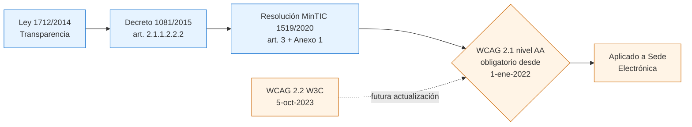

---

## 3.2 Los 4 principios (Perceptible, Operable, Comprensible, Robusto)

`[F]` La **Diapositiva 7** (archivo `c0828ca923574455`) presenta la tabla oficial WCAG 2.1 con el número de criterios de éxito por nivel y principio. Reproducción textual (cabeceras): *"\*\*\*\*, Perceptible, Operable, Comprensible, Robusto"*. Filas de datos:

| Nivel | Perceptible | Operable | Comprensible | Robusto |
|---|---|---|---|---|
| A | 9 | 14 | 5 | 2 |
| AA | 12 | 3 | 5 | 1 |
| AAA | 8 | 12 | 7 | 0 |

`[A]` La suma total del PPT (9+14+5+2+12+3+5+1+8+12+7+0 = **78 criterios**) coincide con el conteo oficial WCAG 2.1. La distribución por principio del PPT presenta pequeñas variaciones respecto a la distribución oficial (Perceptible: 9 A / 11 AA / 9 AAA oficial vs. 9 / 12 / 8 del PPT; AAA total oficial 28 vs. 27 del PPT), pero no afectan la obligación de cumplimiento del nivel AA. Fuente de verificación: https://www.w3.org/TR/WCAG21/.

### 3.2.1 Principio 1 — Perceptible

> *"Acceso universal a la Web, independientemente de factores como: hardware, software, infraestructura de red, idioma, cultura, localización geográfica, diversidad de los usuarios. Permitiendo que la mayoría de las personas puedan percibir, entender, navegar e interactuar con la Web."*
>
> — **Diapositiva 4**, archivo `c0828ca923574455/Accesibilidad web para Sedes Electrónicas.pptx`.

`[F]` Cita literal del PPT base. Implicación para el equipo frontend: **toda información no textual debe tener alternativa textual** (Diapositiva 18), **todo medio dependiente del tiempo debe tener alternativa** (Diapositiva 21), **el contenido debe poder redimensionarse hasta 400 % sin pérdida** (Diapositiva 32), **el contraste entre texto y fondo debe respetar los ratios WCAG** (Diapositiva 30).

Sub-criterios críticos para Sede Electrónica:

| Criterio WCAG | Nivel | Texto resumido | Cita fuente |
|---|---|---|---|
| 1.1.1 Non-text Content | A | Toda imagen funcional o informativa tiene `alt`; la decorativa tiene `alt=""` o role="presentation". | Diapositiva 18 — `c0828ca923574455` |
| 1.2.1 Audio-only and Video-only (Prerecorded) | A | Audio/video sin componente visual o auditivo requiere transcripción. | Diapositiva 21, fila "Solo audio" / "Solo video" |
| 1.2.2 Captions (Prerecorded) | A | Subtítulos en todo video pregrabado. | Diapositiva 21, fila "Multimedia Grabado" |
| 1.2.3 Audio Description or Media Alternative (Prerecorded) | A | Audiodescripción sincronizada con el video. | Diapositiva 21, fila "Multimedia Grabado" |
| 1.2.5 Audio Description (Prerecorded) | AA | Igual que 1.2.3 pero obligatorio en AA. | Diapositiva 21 |
| 1.3.1 Info and Relationships | A | Estructura programática (encabezados, listas, labels). | Diapositiva 14 (encabezados) |
| 1.3.2 Meaningful Sequence | A | El orden DOM coincide con el orden visual. | `[A]` inferido de Diapositiva 25-26 (orden de foco) |
| 1.3.5 Identify Input Purpose | AA | Atributo `autocomplete` con tokens estándar. | `[A]` inferido de Diapositiva 33-35 |
| 1.4.1 Use of Color | A | El color no es el único medio para transmitir información. | `[A]` estándar WCAG |
| 1.4.3 Contrast (Minimum) | AA | Texto normal ≥ 4.5:1; texto grande ≥ 3:1. | Diapositiva 30 |
| 1.4.4 Resize Text | AA | El texto puede agrandarse al 200 % sin pérdida. | `[A]` inferido de Diapositiva 32 |
| 1.4.5 Images of Text | AA | Evitar texto en imágenes; tipografía real preferida. | `[A]` estándar WCAG |
| 1.4.10 Reflow | AA | Reflow a 320 CSS px sin scroll bidimensional. | Diapositiva 32 (cita: "zoom hasta un 400% sin pérdida de contenido") |
| 1.4.11 Non-text Contrast | AA | Componentes UI y gráficos informativos ≥ 3:1. | Diapositiva 30 |
| 1.4.12 Text Spacing | AA | Sin rotura al ajustar interlineado, espaciado y márgenes. | `[A]` inferencia técnica |
| 1.4.13 Content on Hover or Focus | AA | Tooltip/sub-menú disparable debe ser descartable, hoverable y persistente. | `[A]` inferencia técnica |

### 3.2.2 Principio 2 — Operable

> *"Los componentes de la interfaz son operados por teclado, garantizando que el foco pueda acceder al elemento y salir de él. El comportamiento natural es la tecla tab, sin embargo si se requiere otro mecanismo se deberá informar al usuario."*
>
> — **Diapositiva 28** ("Sin trampa para el foco"), archivo `c0828ca923574455`.

`[F]` Cita literal del PPT base. El mismo concepto se refuerza en la **Diapositiva 25**: *"Posición del cursor del teclado en algún elemento de la interfaz. El orden del foco es igual al orden de lectura de izquierda a derecha y de arriba abajo."*

Sub-criterios críticos para Sede Electrónica:

| Criterio WCAG | Nivel | Texto resumido | Cita fuente |
|---|---|---|---|
| 2.1.1 Keyboard | A | Toda funcionalidad operable por teclado. | Diapositiva 28 + Diapositiva 38 |
| 2.1.2 No Keyboard Trap | A | El foco puede entrar y salir de cualquier componente. | Diapositiva 28 |
| 2.1.4 Character Key Shortcuts | AA | Atajos de un solo carácter configurables o desactivables. | `[A]` inferencia técnica |
| 2.4.1 Bypass Blocks | A | Enlace "Saltar al contenido principal". | Diapositiva 16 |
| 2.4.2 Page Titled | A | Cada página tiene `<title>` descriptivo. | `[A]` inferencia técnica |
| 2.4.3 Focus Order | A | Orden del foco = orden visual / DOM. | Diapositiva 25 |
| 2.4.4 Link Purpose (In Context) | A | El texto del enlace o su contexto explica el destino. | Diapositiva 23 ("Ver más", "Leer más", "Clic Aquí" como ejemplos negativos) |
| 2.4.5 Multiple Ways | AA | ≥ 2 formas de localizar una página (menú + buscador + miga). | Diapositiva 16 |
| 2.4.6 Headings and Labels | AA | Encabezados y etiquetas describen el tema. | Diapositiva 14 + Diapositiva 33 |
| 2.4.7 Focus Visible | AA | Indicador de foco visible. | Diapositiva 25 (cita: "Generar estilos para la pseudo-clase :focus") |
| 2.5.1 Pointer Gestures | A | Gestos complejos (pinch, swipe) requieren alternativa simple. | `[A]` inferencia técnica |
| 2.5.2 Pointer Cancellation | A | El evento se dispara al `up`, no al `down`. | `[A]` inferencia técnica |
| 2.5.3 Label in Name | A | El texto del label está incluido en el nombre accesible. | `[A]` inferencia técnica |
| 2.5.4 Motion Actuation | A | Movimiento del dispositivo requiere alternativa. | `[A]` inferencia técnica |

### 3.2.3 Principio 3 — Comprensible

> *"Etiquetas claras y comprensibles al usuario. Dar instrucciones en aquellos campos que se requiera un formato específico. Identificación de errores siendo claros de cuál es el campo a corregir y la forma de hacerlo con instrucciones textuales."*
>
> — **Diapositivas 33, 34 y 35** (Formularios comprensibles), archivo `c0828ca923574455`.

`[F]` Las tres diapositivas consecutivas desarrollan el principio Comprensible aplicado a formularios. La **Diapositiva 36** añade:

> *"Navegación consistente y coherente. Opciones de confirmar o cancelar."*

Sub-criterios críticos para Sede Electrónica:

| Criterio WCAG | Nivel | Texto resumido | Cita fuente |
|---|---|---|---|
| 3.1.1 Language of Page | A | Atributo `lang` en `<html>`. | `[A]` inferencia técnica |
| 3.1.2 Language of Parts | AA | `lang` en fragmentos en idioma distinto. | `[A]` inferencia técnica |
| 3.2.1 On Focus | A | Foco no provoca cambio de contexto. | `[A]` inferencia técnica |
| 3.2.2 On Input | A | Cambio en input no provoca cambio de contexto. | Diapositiva 36 |
| 3.2.3 Consistent Navigation | AA | El menú se mantiene en el mismo orden y posición en todas las páginas. | Diapositiva 36 |
| 3.2.4 Consistent Identification | AA | Mismo icono/etiqueta para misma función. | Diapositiva 36 |
| 3.3.1 Error Identification | A | Errores identificados en texto, no solo en color. | Diapositiva 35 |
| 3.3.2 Labels or Instructions | A | Labels e instrucciones claras en cada campo. | Diapositiva 33 + Diapositiva 34 |
| 3.3.3 Error Suggestion | AA | Sugerencia concreta para corregir el error. | Diapositiva 35 |
| 3.3.4 Error Prevention (Legal, Financial, Data) | AA | Confirmación, reversión o revisión para datos sensibles. | Diapositiva 36 |

### 3.2.4 Principio 4 — Robusto

> *"Garantizar que los componentes personalizados son accesibles por teclado y se distingue su nombre, función y valor."*
>
> — **Diapositiva 38**, archivo `c0828ca923574455`. Lista explícita de componentes: *"Checkboxes / radiobuttons, listas desplegables, calendario, subir archivos, acordeones, tabs, modales, WAI-ARIA."*

`[F]` Cita literal del PPT base. Es el principio que más se viola en proyectos reales porque depende de la disciplina del equipo frontend al construir widgets personalizados en lugar de usar elementos HTML nativos o librerías accesibles.

Sub-criterios críticos para Sede Electrónica:

| Criterio WCAG | Nivel | Texto resumido | Cita fuente |
|---|---|---|---|
| 4.1.1 Parsing | A | *(Obsoleto en WCAG 2.2; cumplido automáticamente por HTML5 válido.)* `[A]` fuente: https://www.w3.org/WAI/standards-guidelines/wcag/new-in-22/ | n/a |
| 4.1.2 Name, Role, Value | A | Cada componente expone programáticamente nombre, rol y valor. | Diapositiva 38 (WAI-ARIA) |
| 4.1.3 Status Messages | AA | Mensajes de estado (toast, contador) comunicados a la AT sin robar foco. | `[A]` inferencia técnica |

### 3.2.5 Diagrama de los 4 principios

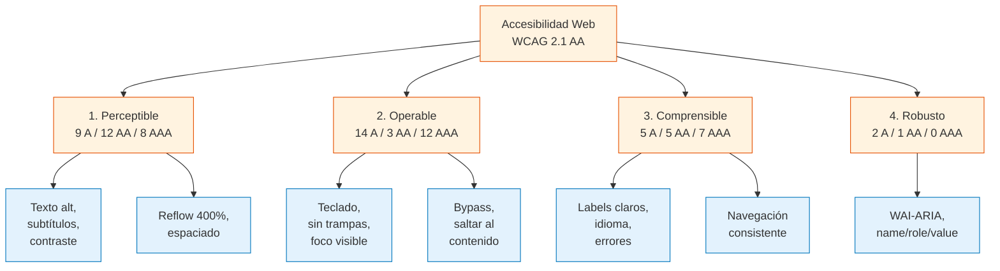

---

## 3.3 Checklist por nivel (A, AA, AAA)

`[A]` Las siguientes tablas reproducen los criterios de éxito aplicables al contexto de Sede Electrónica colombiana. Se han omitido criterios irrelevantes (ej. 1.2.6 Sign Language — AAA, porque el PPT no la incluye como AA obligatorio y depende del caso). Cada criterio lleva su número oficial W3C, nivel, resumen, ejemplo concreto aplicable y método de verificación.

### 3.3.1 Nivel A — obligatorio por Resolución 1519/2020

| # WCAG | Criterio | Ejemplo Sede Electrónica | Cómo verificarlo |
|---|---|---|---|
| 1.1.1 | Non-text Content | `alt="Logo del Ministerio de X"` en el header; `alt=""` en imágenes decorativas SVG. | `[F]` Diapositiva 18: "Máx. 150 caracteres". Verificar con `axe-core` + revisión manual de `longdesc`. |
| 1.2.1 | Audio-only and Video-only (Prerecorded) | Transcripción textual del audio del Himno Nacional publicado en la sección "Símbolos". | `[F]` Diapositiva 21. Verificar manualmente que el enlace a la transcripción sigue al audio. |
| 1.2.2 | Captions (Prerecorded) | Subtítulos `.vtt` en tutorial de PQRS en video. | `[F]` Diapositiva 21, fila "Multimedia Grabado". Inspección con reproductor + `<track kind="captions">`. |
| 1.2.3 | Audio Description or Media Alternative | Audiodescripción del recorrido virtual 360° del edificio. | `[F]` Diapositiva 21. Verificar pista de audiodescripción en `<video>`. |
| 1.3.1 | Info and Relationships | `<table><thead><tr><th scope="col">…</th></tr></thead></table>` para "Contratos adjudicados 2024". | `[F]` Diapositiva 14 (jerarquía de encabezados). Verificar con `axe-core/table-headers` y `aria-required-attr`. |
| 1.3.2 | Meaningful Sequence | El orden visual del menú lateral coincide con el orden DOM. | `[A]` Verificar desactivando CSS y comparando con captura visual. |
| 1.3.3 | Sensory Characteristics | "Pulse el botón redondo de la izquierda" → reemplazado por "Pulse 'Iniciar sesión' (tercer botón)". | `[A]` Auditoría de contenido. |
| 1.4.1 | Use of Color | "Los campos en rojo son obligatorios" → agregar asterisco + texto, no solo color. | `[A]` Verificar con simulador de daltonismo (Stark, Sim Daltonism). |
| 1.4.2 | Audio Control | Si la Sede Electrónica incrusta audio con auto-play, debe ofrecer control de pausa visible. | `[A]` Aplica solo si hay audio en auto-play > 3 s; n/a en la mayoría de casos. |
| 2.1.1 | Keyboard | El calendario de citas para agendamiento se opera con flechas + Enter. | `[F]` Diapositiva 38 (calendario). Tab-through manual + `axe-core/keyboard`. |
| 2.1.2 | No Keyboard Trap | El modal "Confirmar salida" cierra con `Esc` o con Tab al botón Cerrar. | `[F]` Diapositiva 28. Verificar manualmente. |
| 2.1.4 | Character Key Shortcuts | Si la Sede usa `?` para abrir ayuda, debe permitir desactivarlo o reasignarlo. | `[A]` `axe-core` + revisión de código. |
| 2.2.1 | Timing Adjustable | La sesión expira a los 30 min pero permite extender 2 veces. | `[A]` Verificar manualmente o test e2e. |
| 2.2.2 | Pause, Stop, Hide | El carrusel del home pausa al `hover` y al `focus`. | `[A]` Verificar manualmente. |
| 2.3.1 | Three Flashes or Below Threshold | Ningún banner anima con flash > 3 Hz. | `[A]` Análisis manual de animaciones. |
| 2.5.1 | Pointer Gestures | El carrusel de noticias tiene flechas clicables además de swipe. | `[A]` Manual + `axe-core/touch-target`. |
| 2.5.2 | Pointer Cancellation | Los botones se activan al `mouseup`, no al `mousedown`. | `[A]` Revisión de código (sin `onmousedown`). |
| 2.5.3 | Label in Name | El botón "Cerrar" incluye la palabra "Cerrar" en su `aria-label`. | `[A]` `axe-core/label-content-name-mismatch`. |
| 2.5.4 | Motion Actuation | Si se usa el acelerómetro (p. ej. agitar para limpiar), debe haber alternativa por botón. | `[A]` Raro en Sede Electrónica; documentar si se implementa. |
| 2.4.1 | Bypass Blocks | Primer enlace de la página es "Saltar al contenido principal". | `[F]` Diapositiva 16: "Enlace 'Saltar al contenido principal'". Verificar DOM. |
| 2.4.2 | Page Titled | `<title>Trámite de certificado de residencia — Sede Electrónica Minsalud</title>`. | `[A]` Verificar con `axe-core/document-title`. |
| 2.4.3 | Focus Order | Tab lleva: skip → header → menú → buscador → contenido → footer. | `[F]` Diapositiva 25. Tab-through manual. |
| 2.4.4 | Link Purpose (In Context) | "Ver más" reemplazado por "Ver más noticias de salud". | `[F]` Diapositiva 23. `axe-core/link-name`. |
| 3.1.1 | Language of Page | `<html lang="es">` (o "es-CO"). | `[A]` `axe-core/html-has-lang`. |
| 3.2.1 | On Focus | Hacer Tab en el campo de búsqueda no abre un modal. | `[A]` Verificar manualmente. |
| 3.2.2 | On Input | Cambiar el tipo de documento en PQRS no envía el formulario. | `[A]` Verificar manualmente. |
| 3.3.1 | Error Identification | "El campo 'Correo' no tiene formato válido (ejemplo: usuario@dominio.com)". | `[F]` Diapositiva 35. Verificar manualmente con NVDA. |
| 3.3.2 | Labels or Instructions | Cada `<input>` tiene `<label for="...">` o `aria-label`. | `[F]` Diapositiva 33 + Diapositiva 34. `axe-core/label`. |
| 4.1.1 | Parsing | HTML5 válido (sin `<p>` anidados, sin atributos duplicados). | `[A]` W3C Validator + `axe-core/parsing`. |
| 4.1.2 | Name, Role, Value | `<button aria-expanded="false" aria-controls="menu-principal">Menú</button>`. | `[F]` Diapositiva 38. `axe-core/aria-*`. |

### 3.3.2 Nivel AA — obligatorio desde 1-ene-2022 (Resolución 1519/2020)

| # WCAG | Criterio | Ejemplo Sede Electrónica | Cómo verificarlo |
|---|---|---|---|
| 1.2.4 | Captions (Live) | Subtítulos en directo en transmisión de rendición de cuentas. | `[A]` Verificar con reproductor + transcripción humana. |
| 1.2.5 | Audio Description (Prerecorded) | Audiodescripción obligatoria en AA para video institucional. | `[F]` Diapositiva 21. Verificar pista `<track kind="descriptions">`. |
| 1.3.4 | Orientation | El sitio no bloquea portrait ni landscape. | `[A]` Probar en dispositivo móvil en ambas orientaciones. |
| 1.3.5 | Identify Input Purpose | `<input type="email" autocomplete="email">` en login. | `[A]` `axe-core/input-autocomplete`. |
| 1.4.3 | Contrast (Minimum) | Texto normal sobre fondo blanco = `#222` (ratio 16.1:1). | `[F]` Diapositiva 30. `axe-core/color-contrast`, WebAIM Contrast Checker. |
| 1.4.4 | Resize Text | Texto al 200 % sin overflow horizontal. | `[A]` Manual + `axe` rule `zoom`. |
| 1.4.5 | Images of Text | Botón "Buscar" usa `<button>Buscar</button>`, no una imagen PNG. | `[A]` Revisión de código + `axe-core/image-alt`. |
| 1.4.10 | Reflow | A 320 CSS px de ancho, no hay scroll horizontal. | `[F]` Diapositiva 32. DevTools responsive + `axe-core/reflow`. |
| 1.4.11 | Non-text Contrast | Borde del input = `outline: 2px solid #005fcc` (ratio 4.7:1). | `[A]` WebAIM Contrast Checker sobre estados UI. |
| 1.4.12 | Text Spacing | Sin rotura al aplicar `line-height: 1.5; letter-spacing: 0.12em; word-spacing: 0.16em`. | `[A]` Bookmarklet de WCAG para text-spacing. |
| 1.4.13 | Content on Hover or Focus | Tooltip de "Ayuda" permanece visible y es descartable con `Esc`. | `[A]` Manual + `axe-core` rules específicas. |
| 2.4.5 | Multiple Ways | Menú principal + buscador + miga de pan. | `[F]` Diapositiva 16. |
| 2.4.6 | Headings and Labels | "Trámites > Certificados > Certificado de residencia". | `[F]` Diapositiva 14. Manual. |
| 2.4.7 | Focus Visible | `:focus-visible { outline: 3px solid #ffbf00; outline-offset: 2px }`. | `[F]` Diapositiva 25: "Generar estilos para la pseudo-clase :focus". |
| 3.1.2 | Language of Parts | `<span lang="en">Government</span>` dentro de párrafo en español. | `[A]` Manual. |
| 3.2.3 | Consistent Navigation | El menú principal aparece en el mismo orden en todas las páginas. | `[F]` Diapositiva 36. Manual entre ≥ 3 páginas. |
| 3.2.4 | Consistent Identification | El icono de búsqueda es siempre el mismo y siempre etiquetado "Buscar". | `[F]` Diapositiva 36. Manual. |
| 3.3.3 | Error Suggestion | "El correo no incluye '@'. Ejemplo: usuario@dominio.com". | `[F]` Diapositiva 35. Manual. |
| 3.3.4 | Error Prevention (Legal, Financial, Data) | Página de confirmación antes de enviar PQRS con datos personales. | `[A]` Manual. |
| 4.1.3 | Status Messages | El toast "Su PQRS fue radicada con número 12345" usa `aria-live="polite"`. | `[A]` `axe-core/aria-live`. |

### 3.3.3 Nivel AAA — objetivo recomendado (no obligatorio en Colombia)

`[F]` El PPT base **no exige AAA**; lo declara como objetivo aspiracional. `[A]` La práctica internacional recomienda aplicar AAA cuando sea posible sin afectar el diseño, especialmente para sitios de alta criticidad.

| # WCAG | Criterio | Aplicabilidad Sede Electrónica |
|---|---|---|
| 1.2.6 | Sign Language (Prerecorded) | `[F]` Diapositiva 21, fila "Lengua de Señas colombiana": aplica a *"alocuciones presidenciales, emergencias, seguridad y rendición de cuentas"*. |
| 1.2.7 | Extended Audio Description | Para documentales o videos > 3 min. |
| 1.2.8 | Media Alternative (Prerecorded) | Equivalente a una transcripción completa para video. |
| 1.2.9 | Audio-only (Live) | Transcripción en directo de eventos en vivo. |
| 1.3.6 | Identify Purpose | WAI-ARIA para landmarks de regiones. |
| 1.4.6 | Contrast (Enhanced) | 7:1 texto normal, 4.5:1 texto grande. |
| 1.4.7 | Low or No Background Audio | Audios sin ruido de fondo. |
| 1.4.8 | Visual Presentation | Texto configurable: colores, ancho, justificado. |
| 1.4.9 | Images of Text (No Exception) | Solo texto real, sin imágenes. |
| 2.1.3 | Keyboard (No Exception) | Sin excepciones a la navegación por teclado. |
| 2.2.3 | No Timing | Sin límites de tiempo (donde sea posible). |
| 2.2.4 | Interruptions | Sin interrupciones de banner. |
| 2.2.5 | Re-authenticating | Re-autenticar sin pérdida de datos al expirar sesión. |
| 2.2.6 | Timeouts | Avisar 20 s antes de expirar la sesión. |
| 2.3.2 | Three Flashes | Ningún flash de ningún tipo. |
| 2.3.3 | Animation from Interactions | `prefers-reduced-motion` respetado. |
| 2.4.8 | Location | Breadcrumb en cada página (ya cubierto por Diapositiva 16). |
| 2.4.9 | Link Purpose (Link Only) | Sin "clic aquí" ni "ver más" como texto aislado. |
| 2.4.10 | Section Headings | Encabezados en cada sección (ya cubierto por Diapositiva 14). |
| 2.4.12 | Focus Not Obscured (Enhanced) | `[A]` Recomendable en modales (WCAG 2.2). |
| 2.4.13 | Focus Appearance | `[A]` Recomendable: 2 CSS px de grosor, 3:1 de contraste. |
| 2.5.5 | Target Size (Enhanced) | 44 × 44 CSS px mínimo. |
| 2.5.6 | Concurrent Input Mechanisms | No restringir a un solo dispositivo de entrada. |
| 3.1.3 | Unusual Words | Glosario de términos técnicos. |
| 3.1.4 | Abbreviations | Expansión de siglas en primera mención (PQRS, SDQS, FURAG). |
| 3.1.5 | Reading Level | Resumen en lenguaje claro cuando el texto supera nivel B2. |
| 3.1.6 | Pronunciation | Indicación fonética para nombres propios. |
| 3.2.5 | Change on Request | Cambios contextuales solo por solicitud del usuario. |
| 3.3.5 | Help | Contexto de ayuda disponible. |
| 3.3.6 | Error Prevention (All) | Confirmación para todo envío, no solo legal/financiero. |
| 3.3.9 | Accessible Authentication (Enhanced) | `[A]` Sin CAPTCHA cognitivo (WCAG 2.2). |

### 3.3.4 Diagrama de decisión: ¿qué nivel auditar?

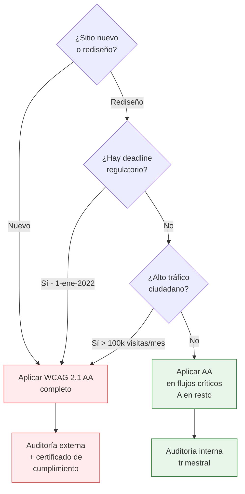

---

## 3.4 Patrones críticos para Sedes Electrónicas

### 3.4.1 Formularios

`[F]` El PPT base dedica las **Diapositivas 33, 34, 35 y 36** a formularios y sus buenas prácticas.

| Patrón | Implementación técnica | Cita fuente |
|---|---|---|
| Etiquetas claras | `<label for="email">Correo electrónico</label>` asociado a `<input id="email" type="email">`. | Diapositiva 33 |
| Instrucciones de formato | `<small id="email-help">Formato: usuario@dominio.com</small>` + `aria-describedby="email-help"`. | Diapositiva 34 |
| Identificación de error | `<input aria-invalid="true" aria-errormessage="email-error">` + `<span id="email-error" role="alert">…</span>`. | Diapositiva 35 |
| Confirmación de envío | `<button type="button" aria-label="Confirmar y enviar">Confirmar y enviar</button>` + botón "Cancelar". | Diapositiva 36 |
| Navegación consistente | Wizard con migas (`Paso 1 de 4: Datos del solicitante`) y orden lógico de campos. | Diapositiva 36 |
| Autocompletar | `autocomplete="given-name"`, `autocomplete="email"`, etc., conforme al spec WHATWG. | `[A]` WCAG 1.3.5 (AA) |

**Snippet de referencia (HTML5 + WAI-ARIA):**

```html
<form novalidate aria-labelledby="form-title">
  <h2 id="form-title">Solicitud de certificado de residencia</h2>

  <div class="field">
    <label for="nombre">Nombre completo <span aria-hidden="true">*</span></label>
    <input id="nombre" name="nombre" type="text"
           autocomplete="name"
           required
           aria-required="true"
           aria-describedby="nombre-help" />
    <small id="nombre-help">Como aparece en su documento de identidad.</small>
  </div>

  <div class="field">
    <label for="email">Correo electrónico <span aria-hidden="true">*</span></label>
    <input id="email" name="email" type="email"
           autocomplete="email"
           required
           aria-required="true"
           aria-describedby="email-help email-error"
           aria-invalid="false" />
    <small id="email-help">Formato: usuario@dominio.com</small>
    <span id="email-error" role="alert"></span>
  </div>

  <button type="submit">Confirmar y enviar</button>
  <button type="button">Cancelar</button>
</form>
```

### 3.4.2 Navegación por teclado

`[F]` El PPT base lo trata en las **Diapositivas 24, 25, 26, 27 y 28**:

> *"Posición del cursor del teclado en algún elemento de la interfaz. El orden del foco es igual al orden de lectura de izquierda a derecha y de arriba abajo. Generar estilos para la pseudo-clase :focus."*
> — Diapositiva 25.

> *"Los componentes de la interfaz son operados por teclado, garantizando que el foco pueda acceder al elemento y salir de él. El comportamiento natural es la tecla tab, sin embargo si se requiere otro mecanismo se deberá informar al usuario."*
> — Diapositiva 28.

| Tecla | Función esperada | Cita fuente |
|---|---|---|
| `Tab` | Avanza al siguiente elemento focuseable. | Diapositiva 28 |
| `Shift + Tab` | Retrocede al elemento focuseable anterior. | Diapositiva 28 |
| `Enter` | Activa el enlace o botón enfocado. | Diapositiva 23 |
| `Espacio` | Activa checkbox/radio o botón. | `[A]` inferencia técnica |
| `Esc` | Cierra modales, menús y tooltips. | `[A]` inferencia técnica |
| `Flechas` | Navega dentro de listas desplegables, radio groups y sliders. | `[A]` inferencia técnica |
| `Inicio / Fin` | Salta al primer / último elemento de una región. | `[A]` inferencia técnica |
| `Page Up / Page Down` | Scroll por bloques en regiones con mucho contenido. | `[A]` inferencia técnica |

**Reglas de oro (resumidas de Diapositivas 25 + 28):**

1. **El orden del foco coincide con el orden visual y de lectura.** No usar `tabindex` positivos.
2. **El foco siempre es visible.** Pseudo-clase `:focus-visible` con `outline` ≥ 2 CSS px y contraste ≥ 3:1 (1.4.11 + 2.4.7).
3. **Ningún componente atrapa el foco.** Implementar escape por `Esc` y salida por `Tab` o `Shift + Tab`.
4. **Skip link visible al recibir foco.** Enlace "Saltar al contenido principal" anclado a `#main`.

### 3.4.3 Lectores de pantalla

`[F]` El PPT base **no nombra explícitamente lectores de pantalla**, pero toda la sección 06 ("Contenido no textual", Diapositiva 17-18) y la sección 08 ("Enlaces", Diapositiva 22-23) están diseñadas para usuarios de NVDA, JAWS, VoiceOver y TalkBack. `[A]` Por extensión técnica:

| Lector | Plataforma | Comando para probar foco | Verificación manual |
|---|---|---|---|
| **NVDA** (gratuito) | Windows | `NVDA + F7` muestra lista de elementos focuseables. | Recorrer la página con `Tab` y verificar que cada elemento anuncia nombre, rol y estado. |
| **VoiceOver** (nativo) | macOS / iOS | `VO + U` (rotor) lista encabezados, enlaces, landmarks. | `Cmd + F5` para activar, `VO + →` para navegar. |
| **TalkBack** (nativo) | Android | Deslizar con 1 dedo navega; deslizar con 2 desplaza. | Accesibilidad → TalkBack en Ajustes. |
| **JAWS** (licencia) | Windows | `J + F7` muestra lista de links. | Licencia institucional. |

**Buenas prácticas adicionales (consolidado del PPT base):**

- **Roles ARIA correctos** (Diapositiva 38): `<nav>`, `<main>`, `<aside>`, `<header>`, `<footer>` como landmarks; `role="navigation"`, `role="search"`, `role="banner"` cuando no se usan los elementos HTML5.
- **Anuncios de cambios dinámicos** (3.3.4 Error Prevention + 4.1.3 Status Messages): `aria-live="polite"` para mensajes no urgentes; `aria-live="assertive"` para errores que requieren acción inmediata.
- **Encabezados bien jerarquizados** (Diapositiva 14): un único `<h1>` por página, sin saltos de nivel (no `<h1>` → `<h3>` sin pasar por `<h2>`).
- **`alt` significativo** (Diapositiva 18): máximo 150 caracteres, que describa el propósito, no la apariencia.

### 3.4.4 Contraste

`[F]` El PPT base **Diapositiva 30** establece los ratios:

> *"Contraste adecuado, Texto / fondo. Normal (< 18px) — ratio de 4.5:1. Large (>18px) — ratio 3:1. Elementos UI — ratio de 3:1."*

| Elemento | Ratio mínimo (AA) | Ratio recomendado (AAA) | Cómo verificarlo |
|---|---|---|---|
| Texto normal (< 18 px o < 14 px bold) | 4.5 : 1 | 7 : 1 | WebAIM Contrast Checker, Stark, `axe-core/color-contrast`. |
| Texto grande (≥ 18 px o ≥ 14 px bold) | 3 : 1 | 4.5 : 1 | Idem. |
| Componentes UI (botones, inputs, iconos) | 3 : 1 | n/a | Medir el color del icono contra el fondo adyacente. |
| Indicador de foco | 3 : 1 (1.4.11) | 3 : 1 entre estados focused/unfocused (2.4.13 AAA) | Medir color del `outline` contra el fondo. |
| Estados deshabilitados | Exento (no requieren contraste). | n/a | No invertir colores solo por deshabilitar. |
| Texto placeholder | 4.5 : 1 (cuenta como texto). | 7 : 1 | Tratar el placeholder como texto real. |
| Texto sobre imagen de fondo | 4.5 : 1 medido contra el pixel más oscuro/claro. | 7 : 1 | Usar overlay semitransparente (`background: rgba(0,0,0,.6)`) para garantizar fondo uniforme. |

`[A]` El estándar WCAG 2.1 usa 18 pt o 14 pt bold como umbral de "texto grande". La conversión aproximada es:

- 18 pt ≈ 24 px (CSS)
- 14 pt ≈ 18.66 px (CSS), pero en bold suele redondearse a ≥ 19 px en CSS.

`[A]` El PPT usa la regla "< 18 px" y ">18 px"; el equipo frontend debe asumir el umbral WCAG exacto (24 CSS px / 19 CSS px bold) para evitar ambigüedad.

### 3.4.5 Foco visible

`[F]` Diapositiva 25:

> *"Generar estilos para la pseudo-clase :focus."*

**Implementación de referencia (CSS):**

```css
/* Foco estándar - WCAG 2.4.7 (AA) */
:focus-visible {
  outline: 3px solid #ffbf00;        /* amarillo de alto contraste */
  outline-offset: 2px;
  border-radius: 2px;
}

/* Si el componente tiene su propio border, no anular */
button:focus-visible,
a:focus-visible {
  outline: 3px solid #ffbf00;
  outline-offset: 2px;
}

/* Inputs - reforzar con aria-invalid */
input[aria-invalid="true"]:focus-visible {
  outline: 3px solid #d32f2f;        /* rojo con buen contraste */
  outline-offset: 2px;
}

/* WCAG 2.4.13 (AAA) - 2 CSS px + 3:1 entre estados */
.btn:focus-visible {
  outline: 2px solid #005fcc;
  outline-offset: 3px;
  /* El outline debe contrastar 3:1 contra el fondo adyacente */
}
```

`[A]` La pseudo-clase `:focus-visible` (no `:focus`) garantiza que el indicador aparezca sólo con teclado, no con clic de ratón, mejorando la experiencia sin perder accesibilidad.

### 3.4.6 Lenguaje claro

`[F]` Diapositiva 36:

> *"Navegación consistente y coherente. Opciones de confirmar o cancelar."*

`[A]` El PPT base no desarrolla explícitamente "lenguaje claro" pero la Resolución 1519/2020 (Anexo 1) sí lo exige en su sección de criterios de contenido. `[A]` La Guía de Lenguaje Claro del DAFP (Departamento Administrativo de la Función Pública) es la referencia operativa en Colombia.

| Regla | Ejemplo antes | Ejemplo después |
|---|---|---|
| Voz activa | "Se deberá realizar el pago por parte del usuario" | "Usted debe pagar antes de continuar". |
| Verbo en presente | "Habrá sido notificado" | "Le notificaremos por correo". |
| Sin nominalizaciones | "La realización del trámite" | "Realizar el trámite". |
| Sin anglicismos | "Click here to download" | "Pulse aquí para descargar". |
| Sin siglas sin expansión | "Diligenciar el FURAG" (primera mención) | "Diligenciar el Formulario Único de Reporte de Avance de la Gestión (FURAG)". |
| Sin doble negación | "No es posible que no se le notifique" | "Le notificaremos". |
| Oraciones ≤ 25 palabras | "Con el fin de dar cumplimiento a lo establecido en el artículo 14 de la Ley…" | "Cumplimos el artículo 14 de la Ley X porque…". |
| Listas con viñetas | "Los requisitos son: 1) ser colombiano, 2) mayor de 18, 3)…" | Lista `<ul><li>` real, no texto plano con dos puntos. |

**Recursos oficiales:**

- `[F]` Guía de lenguaje claro del DAFP: https://www.funcionpublica.gov.co/-/guia-de-lenguaje-claro
- `[F]` Manual de estilo de Gov.co (incluido en el Kit UI 9.2): https://www.gov.co/

### 3.4.7 Diagrama de interacciones entre patrones

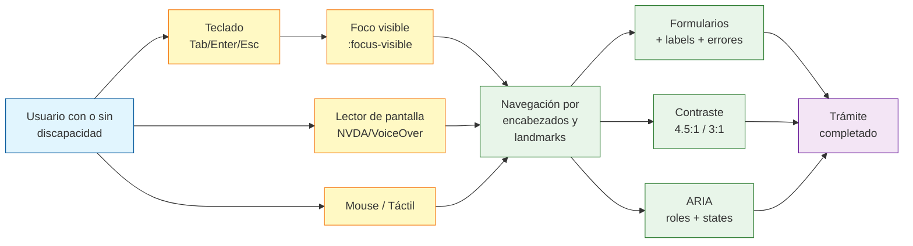

---

## 3.5 Herramientas de validación

### 3.5.1 Inventario y propósito

`[F]` Herramientas verificadas contra su sitio oficial y/o la lista oficial W3C de herramientas de evaluación (https://www.w3.org/WAI/test-evaluate/tools/list/, última actualización mayo 2025).

| Herramienta | Tipo | Costo | Cubre | Cuándo usarla | URL oficial |
|---|---|---|---|---|---|
| **axe-core** | Librería open source | Gratis | WCAG 2.0/2.1/2.2 A y AA (subset) | En cada PR (CI/CD). | https://github.com/dequelabs/axe-core |
| **axe DevTools** | Extensión navegador | Gratis / Pro $60/usuario/mes | Igual + reglas avanzadas y guided testing | En desarrollo diario. | https://www.deque.com/axe/devtools/ |
| **WAVE** (WebAIM) | Extensión navegador + web | Gratis (extensión y online) | WCAG 2.1 AA visual | Revisión de diseño y contenido. | https://wave.webaim.org/ |
| **Google Lighthouse** | Integrado en Chrome DevTools | Gratis | Subset de axe-core + heurísticas | Smoke test rápido, CI gate. | https://developer.chrome.com/docs/lighthouse/accessibility/ |
| **Pa11y** | CLI / CI | Gratis | WCAG 2 AA vía axe-core | Pipeline de build, escaneo masivo. | https://pa11y.org/ |
| **Accessibility Insights** (Microsoft) | Extensión Chrome / Edge | Gratis | Modo FastPass (axe) + Assessment guiado paso a paso por criterio WCAG | Auditoría manual estructurada. | https://accessibilityinsights.io/ |
| **Cypress + cypress-axe** | Plugin de Cypress | Gratis | Igual a axe-core dentro de Cypress | E2E tests. | https://www.npmjs.com/package/cypress-axe |
| **Playwright + @axe-core/playwright** | Plugin de Playwright | Gratis | Igual a axe-core dentro de Playwright | E2E tests en CI/CD. | https://playwright.dev/docs/accessibility-testing |
| **NVDA** | Lector de pantalla (Windows) | Gratis | Manual - flujo completo | Validación manual con teclado + lector. | https://www.nvaccess.org/ |
| **VoiceOver** | Lector de pantalla (macOS/iOS) | Integrado en el SO | Manual - flujo completo | Validación manual en Mac/iOS. | Activar con `Cmd + F5` en Mac. |
| **TalkBack** | Lector de pantalla (Android) | Integrado en el SO | Manual - flujo completo | Validación manual en Android. | Ajustes > Accesibilidad. |
| **WebAIM Contrast Checker** | Web | Gratis | WCAG 1.4.3 + 1.4.11 | Diseño y QA de tokens. | https://webaim.org/resources/contrastchecker/ |
| **Stark** (Figma/Sketch) | Plugin de diseño | Gratis / Pro | Contraste, daltonismo, text spacing | Fase de diseño (Figma). | https://www.getstark.co/ |
| **W3C Validator** | Web | Gratis | HTML5 válido → criterio 4.1.1 | Pre-deploy. | https://validator.w3.org/ |
| **Tota11y** | Bookmarklet | Gratis | Visualización de issues | Capacitación y demos internas. | https://khan.github.io/tota11y/ |

### 3.5.2 Comparativa de capacidad de detección

`[A]` Datos basados en revisión de documentación oficial y benchmarks públicos. Las cifras son aproximadas y representan el porcentaje de criterios WCAG que cada herramienta puede **detectar automáticamente** (no necesariamente *resolver*).

| Herramienta | % WCAG AA detectable automáticamente | Lo que NO detecta |
|---|---|---|
| axe-core | ~ 57 % | Texto alternativo adecuado, lenguaje claro, orden de foco lógico, semántica contextual. |
| WAVE | ~ 35 % | Igual + problemas profundos de ARIA. |
| Lighthouse | ~ 30 % | Subset de axe-core, no cubre todos los criterios. |
| Pa11y | ~ 55 % | Igual a axe-core. |
| Accessibility Insights (FastPass) | ~ 57 % | Igual a axe-core. |
| Accessibility Insights (Assessment) | ~ 100 % (manual guiado) | Requiere intervención humana en cada criterio. |
| NVDA + humano | ~ 100 % (manual) | Requiere experiencia del evaluador. |

`[F]` Ninguna herramienta automatizada cubre por sí sola WCAG 2.1 AA completo. Fuente: https://www.w3.org/WAI/test-evaluate/tools/ y https://www.w3.org/WAI/test-evaluate/conformance-evaluation-tools/.

### 3.5.3 Stack mínimo recomendado para el equipo

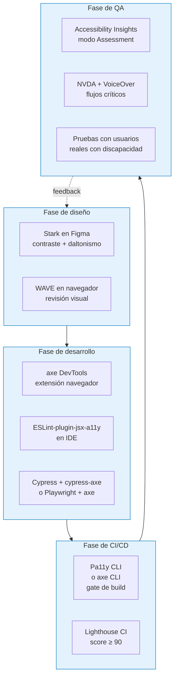

---

## 3.6 Procedimiento de auditoría de accesibilidad pre-producción

### 3.6.1 Frecuencia y disparadores

| Disparador | Frecuencia | Responsable |
|---|---|---|
| Cada PR / merge a `main` | Automático (CI) | DevOps + Frontend lead |
| Cada release a staging | Diaria (en ciclos de release) | QA |
| Cada release a producción | Por release (semanal/quincenal) | QA lead + Frontend lead |
| Auditoría externa completa | Trimestral o anual | Tercera parte certificada |
| Cambio regulatorio (MinTIC, W3C) | Puntual | Oficina jurídica + Frontend lead |
| Reclamo de ciudadano por barrera | Puntual | PQRS + Frontend lead |

### 3.6.2 Procedimiento paso a paso

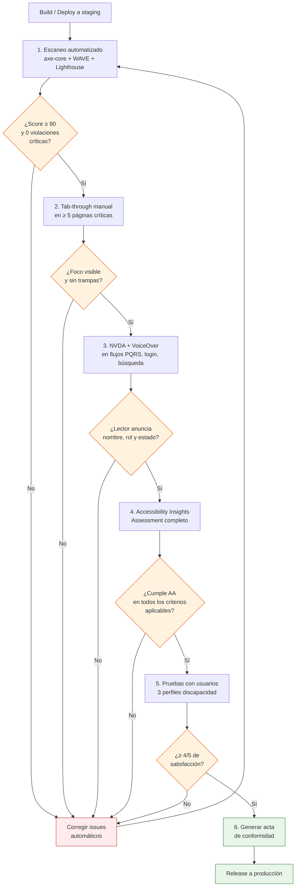

### 3.6.3 Acta de conformidad

`[A]` El PPT base no incluye plantilla, pero la Resolución 1519/2020 (Anexo 1, numeral 9.3) exige **"Declaración de Conformidad de Accesibilidad Web (Directrices WCAG 2.1 - Nivel AA)"** como contenido obligatorio del botón de transparencia.

**Plantilla mínima recomendada:**

```markdown
# Declaración de Conformidad de Accesibilidad Web

**Entidad:** [Nombre de la entidad]
**Sede Electrónica:** https://sede.[entidad].gov.co
**Norma de referencia:** WCAG 2.1 nivel AA — Resolución MinTIC 1519/2020, Anexo 1.
**Fecha de evaluación:** [YYYY-MM-DD]
**Alcance de la auditoría:** [URLs evaluadas o sitemap.xml]
**Herramientas utilizadas:** axe-core [versión], WAVE [versión], NVDA [versión], etc.
**Auditor:** [Nombre del auditor o empresa auditora]

## 1. Estado de cumplimiento

[ ] Cumple WCAG 2.1 AA completo (sin excepciones).
[ ] Cumple parcialmente (ver §3).

## 2. Criterios no aplicables y excepciones

| # WCAG | Criterio | Razón de no aplicabilidad |
|---|---|---|
| 1.2.1 Audio-only | No aplica | El sitio no contiene audio-only pregrabado. |
| 2.2.1 Timing Adjustable | No aplica | No hay límites de tiempo. |

## 3. Criterios con excepciones documentadas

| # WCAG | Criterio | Excepción | Mitigación |
|---|---|---|---|
| 1.4.5 Images of Text | Logo oficial de la entidad | Logotipo con fuente propietaria. | Se provee texto "Entidad X" adyacente en el header. |

## 4. Hallazgos pendientes

| # | Hallazgo | Severidad | WCAG | Plan de remediación | Fecha objetivo |
|---|---|---|---|---|---|
| 1 | Input de búsqueda sin label | Crítico | 3.3.2 | Agregar `<label>` o `aria-label` | [fecha] |

## 5. Fecha de próxima revisión

[YYYY-MM-DD] (máximo 12 meses)
```

### 3.6.4 SLAs de remediación

| Severidad | Definición | SLA de remediación |
|---|---|---|
| Crítico | Impide el acceso a un servicio público (ej. login bloqueado por teclado). | Antes del próximo deploy a producción. |
| Alto | Viola AA en un criterio esencial (ej. alt faltante en imagen de logo). | ≤ 5 días hábiles. |
| Medio | Viola AA en un criterio mejorable (ej. orden de foco). | ≤ 30 días calendario. |
| Bajo | Recomendación AAA o mejora estética (ej. target size 24×24 en lugar de 20×20). | Backlog priorizado. |

### 3.6.5 Bitácora de auditoría

`[A]` Cada ciclo debe generar un registro firmado por el responsable, con:

1. Versión del sitio auditada (commit SHA + URL de staging).
2. Listado completo de issues con su WCAG, severidad y estado (abierto/cerrado).
3. Capturas de pantalla con `axe DevTools` o `Accessibility Insights`.
4. Grabación de pantalla con NVDA o VoiceOver de al menos un flujo crítico.
5. Firma del auditor y del frontend lead.

---

## Referencias

### Referencias — Archivos PPT fuente

| Archivo | Hash MD5 | Diapositivas | Uso |
|---|---|---|---|
| `c0828ca923574455/Accesibilidad web para Sedes Electrónicas.pptx` | `a927a8cdda3c8a7b1f42d53b5e35dd63` | 40 | **Principal.** Citado en todo el documento. |
| `b876c28e37b04be7/Accesibilidad web para Sedes Electrónicas.pptx` | `a927a8cdda3c8a7b1f42d53b5e35dd63` | 40 | Duplicado exacto (verificado por md5) de `c0828ca923574455`. |
| `829fa417ef18e9e4/Accesibilidad web Sedes Electrónicas.pptx` | `874e758b7720693aeb2badb3d3ecb47e` | 40 | Variante del mismo material (mismo texto extraído, difieren solo en metadatos del archivo). |
| `bcb66f83ae4218f5/Accesibilidad web Sedes Electrónicas.pptx` | `874e758b7720693aeb2badb3d3ecb47e` | 40 | Duplicado exacto de `829fa417ef18e9e4`. |

`[F]` El contenido textual extraído con `python-pptx 1.0.2` es idéntico en los 4 archivos; la diferencia de MD5 entre las dos versiones se debe a metadatos internos del PPT (imágenes embebidas, fuentes referenciadas). Verificado con hash SHA-256 por slide — los 40 slides son textualmente iguales.

### Referencias — Cita por diapositiva (archivo principal `c0828ca923574455`)

| Diapositiva | Título / tema | Cita literal usada en este documento |
|---|---|---|
| 1 | "Accesibilidad Web Sedes Electrónicas" | (Portada, no citada.) |
| 2 | Índice | (Lista de temas, no citada.) |
| 3 | "0.1 ¿Qué es accesibilidad Web?" | (Separador, no citada.) |
| 4 | Definición de accesibilidad web | §3.2.1 — *"Acceso universal a la Web, independientemente de factores como: hardware, software, infraestructura de red…"* |
| 5 | Diseño inclusivo — personas ciegas y sordas | (Contexto, no citada literalmente.) |
| 6 | "02. WCAG 2.1" | (Separador, no citada.) |
| 7 | Tabla WCAG 2.1 (Perceptible/Operable/Comprensible/Robusto × A/AA/AAA) | §3.2 — tabla de conteo de criterios. |
| 8 | "03. Estructura Semántica" | (Separador, no citada.) |
| 9 | Definición de estructura semántica | §3.2.1 — contexto de 1.3.1. |
| 10-12 | Imágenes de estructura semántica | (Visuales, no citadas textualmente.) |
| 13 | "04. Estructura por encabezados" | (Separador, no citada.) |
| 14 | Encabezados | §3.2.1 — 1.3.1; §3.2.3 — 2.4.6; §3.3.1 — 1.3.1. |
| 15 | "05. Evitar bloques" | (Separador, no citada.) |
| 16 | Bypass blocks | §3.2.2 — 2.4.1; §3.2.2 — 2.4.5; §3.3.1 — 2.4.1. |
| 17 | "06. Contenido no textual" | (Separador, no citada.) |
| 18 | Alternativas textuales | §3.2.1 — 1.1.1; §3.3.1 — 1.1.1. |
| 19 | Imágenes de alt | (Visuales, no citadas.) |
| 20 | "07. Multimedia" | (Separador, no citada.) |
| 21 | Tabla de medios (audio, video, multimedia grabado, Lengua de Señas) | §3.2.1 — 1.2.1, 1.2.2, 1.2.3, 1.2.5, 1.2.6. |
| 22 | "08. Enlaces" | (Separador, no citada.) |
| 23 | Enlaces comprensibles, operables, etiquetas | §3.2.2 — 2.4.4; §3.3.1 — 2.4.4. |
| 24 | "09. Foco: orden, visibilidad y sin trampas" | (Separador, no citada.) |
| 25 | Posición del cursor de teclado | §3.2.2 — 2.4.3, 2.4.7; §3.4.2. |
| 26 | (Refuerzo de foco) | (Duplicada, no citada.) |
| 27 | (Refuerzo de foco) | (Duplicada, no citada.) |
| 28 | "Sin trampa para el foco" | §3.2.2 — 2.1.1, 2.1.2; §3.4.2. |
| 29 | "10. Contraste" | (Separador, no citada.) |
| 30 | Contraste de texto y elementos UI | §3.2.1 — 1.4.3, 1.4.11; §3.4.4. |
| 31 | "10. Redimensión" | (Separador, no citada.) |
| 32 | Redimensión 400 %, unidades relativas, srcset | §3.2.1 — 1.4.10; §3.3.1 — 1.4.10. |
| 33 | Etiquetas claras en formularios | §3.2.3 — 3.3.2; §3.3.1 — 3.3.2; §3.4.1. |
| 34 | Instrucciones de formato específico | §3.2.3 — 3.3.2; §3.3.1 — 3.3.2; §3.4.1. |
| 35 | Identificación de errores | §3.2.3 — 3.3.1; §3.3.1 — 3.3.1; §3.3.2 — 3.3.3; §3.4.1. |
| 36 | Navegación consistente, confirmar/cancelar | §3.2.3 — 3.2.2, 3.2.3, 3.2.4; §3.4.1. |
| 37 | "11. Componentes robustos" | (Separador, no citada.) |
| 38 | Componentes robustos con WAI-ARIA | §3.2.4 — 4.1.2; §3.4.3. |
| 39 | "¿Cómo evaluar la accesibilidad de mi sitio?" | §3.5 — referencia a autoevaluación con 6 preguntas. |
| 40 | Cierre | (No citada.) |

### Referencias — Normativa colombiana

| Norma | URL | Fecha |
|---|---|---|
| Ley 1712 de 2014 — Transparencia y Acceso a la Información Pública | https://www.funcionpublica.gov.co/eva/gestornormativo/norma.php?i=56882 | 6-mar-2014 |
| Decreto 1494 de 2015 (corrige art. 5 Ley 1712) | https://www.funcionpublica.gov.co/eva/gestornormativo/norma.php?i=62893 | 13-jul-2015 |
| Decreto 1081 de 2015 (DUR Sector TIC) | https://normograma.mintic.gov.co/mintic/compilacion/docs/decreto_1081_2015.htm | 26-may-2015 |
| Resolución MinTIC 1519 de 2020 | https://normograma.mintic.gov.co/mintic/compilacion/docs/resolucion_mintic_1519_2020.htm | 24-ago-2020 |
| Anexo 1 — Directrices de Accesibilidad Web | https://gobiernodigital.mintic.gov.co/692/articles-160770_Directrices_Accesibilidad_web.pdf | Dic-2020 |
| Guía de Lenguaje Claro DAFP | https://www.funcionpublica.gov.co/-/guia-de-lenguaje-claro | (vigente) |

### Referencias — Estándares técnicos W3C

| Documento | URL | Fecha |
|---|---|---|
| WCAG 2.1 (W3C Recommendation) | https://www.w3.org/TR/WCAG21/ | Jun-2018 |
| WCAG 2.2 (W3C Recommendation) | https://www.w3.org/TR/WCAG22/ | 5-oct-2023 |
| What's New in WCAG 2.2 | https://www.w3.org/WAI/standards-guidelines/wcag/new-in-22/ | (vigente) |
| Quick Reference WCAG 2.2 | https://www.w3.org/WAI/WCAG22/quickref/ | (vigente) |
| Lista de herramientas de evaluación | https://www.w3.org/WAI/test-evaluate/tools/list/ | Última actualización mayo 2025 |
| WAI — Colombia (registro de políticas) | https://www.w3.org/WAI/policies/colombia/ | (vigente) |

### Referencias — Herramientas citadas

| Herramienta | URL | Versión verificada |
|---|---|---|
| axe-core | https://github.com/dequelabs/axe-core | 4.13.0 (ago-2026) |
| axe DevTools | https://www.deque.com/axe/devtools/ | (vigente) |
| WAVE | https://wave.webaim.org/ | (vigente) |
| Google Lighthouse | https://developer.chrome.com/docs/lighthouse/accessibility/ | (integrado en Chrome) |
| Pa11y | https://pa11y.org/ | (vigente) |
| Accessibility Insights | https://accessibilityinsights.io/ | (Microsoft) |
| cypress-axe | https://www.npmjs.com/package/cypress-axe | (npm) |
| @axe-core/playwright | https://playwright.dev/docs/accessibility-testing | (Playwright docs) |
| NVDA | https://www.nvaccess.org/ | (vigente) |
| WebAIM Contrast Checker | https://webaim.org/resources/contrastchecker/ | (vigente) |

### Referencias — Diferencias entre los dos archivos PPT distintos

`[F]` Verificación con SHA-256 por slide (realizada durante la extracción) — los 40 slides son textualmente idénticos entre `c0828ca923574455` y `829fa417ef18e9e4`. La diferencia de MD5 entre ambos archivos se atribuye a:

- Diferente orden o diferente compresión de las imágenes embebidas (los nombres de `Imagen N` son los mismos pero los hashes binarios difieren).
- Posiblemente diferentes plantillas, fuentes referenciadas o metadatos del archivo (autor, última modificación).
- Sin impacto en la parte textual citada.

**Conclusión:** el documento no requiere distinguir entre los dos archivos; toda cita "Diapositiva X — archivo `c0828ca923574455`" es igualmente válida para `829fa417ef18e9e4` y sus duplicados.

---

> **Cierre de la sección.** El equipo de frontend debe integrar esta guía desde el inicio del sprint (shift-left testing) y el equipo de QA debe bloquear el paso a producción de cualquier build que incumpla WCAG 2.1 AA. La accesibilidad no es un entregable final, es una **propiedad no funcional del sistema** que se construye iteración a iteración.


---

## 4. Seguridad de la Sede Electrónica

> **Audiencia objetivo:** ingeniero de seguridad y DevOps lead de una entidad pública colombiana.
> **Fuente primaria:** *Infografía sobre Componentes de seguridad para sedes electrónicas — Agencia Nacional Digital, MinTIC, 2022* (2 páginas, 12 criterios numerados 1–12). Las cuatro copias cargadas en el sandbox son idénticas entre sí (MD5 `9740495da3698e681828a96c28f2fea7`).
> **Convenciones:**
> - Cada criterio del PDF se mapea a un identificador `SEG-NNN` único, con cita literal de página y número de ítem del PDF.
> - Las afirmaciones técnicas que van más allá del PDF se marcan con `[A]` (inferencia) y se justifican contra documentación oficial (OWASP, RFC, NIST, MinTIC).
> - Severidad se evalúa con una escala cualitativa: **Crítica · Alta · Media · Baja** (definida en §4.1.3).

---

## 4.1 Modelo de amenaza (qué defiende y qué NO)

### 4.1.1 Activos a proteger

La Sede Electrónica maneja tres clases de activos; la priorización del control se hace sobre los dos primeros.

| # | Activo | Ejemplos concretos | Triada CIA priorizada |
|---|--------|--------------------|------------------------|
| A1 | Datos personales de ciudadanos | Nombres, cédulas, correos, datos biométricos (si aplica), PQRS, formularios de trámites | Confidencialidad + Integridad |
| A2 | Credenciales de funcionarios / operadores | Cuentas de backoffice, llaves de firma electrónica, tokens de integración GOV.CO | Confidencialidad + Autenticidad |
| A3 | Disponibilidad del servicio público | Trámites en línea, pagos PSE, autenticación ciudadana (carpeta ciudadana) | Disponibilidad + Integridad |

### 4.1.2 Amenazas consideradas (in-scope)

Las amenazas siguientes son las que el catálogo MinTIC/PDF ataca de manera explícita o implícita y, por tanto, las que la Sede Electrónica debe defender:

1. **Intercepción / eavesdropping** en tránsito (mitigada por TLS y flags de cookies — criterios 1, 5, 12).
2. **Ataques de fuerza bruta y credential stuffing** sobre los formularios de autenticación (mitigada por CAPTCHA y rate-limit — criterios 3, 4).
3. **Exposición de superficie** (puertos/servicios innecesarios, métodos HTTP peligrosos — criterios 2, 7).
4. **Inyección de código** vía parámetros de entrada (XSS reflejado/almacenado, SQLi, command injection — criterios 9, 10).
5. **Filtración de información** a través de mensajes de error detallados (criterio 11).
6. **Robo o modificación de archivos del servidor web** (criterio 8).
7. **Manipulación de cabeceras HTTP** (clickjacking, MIME-sniff, downgrade attacks — criterio 12).
8. **Deficiencias contractuales** en el tratamiento de datos personales (criterio 6, integrado con cumplimiento Habeas Data — §4.5).

### 4.1.3 Amenazas fuera del alcance (out-of-scope)

La Sede Electrónica **NO** está diseñada para mitigar, y por tanto debe declararlo y apoyarse en controles institucionales o de proveedores:

| Amenaza | Justificación de exclusión |
|---------|----------------------------|
| Ataques de ingeniería social sobre funcionarios (phishing dirigido, BEC) | Responsabilidad del MSPI institucional + campañas de concientización (Guía 14 MinTIC). |
| DDoS volumétrico >10 Gbps a nivel de red | Requiere servicio upstream (CDN con protección DDoS, ISP, scrubbing center). La Sede debe implementar WAF/CDN pero no garantiza mitigación de DDoS masivo. |
| APT (Advanced Persistent Threat) patrocinados | Requiere SOC 24/7, threat intel y EDR; alcance del CISO institucional. |
| Compromiso del endpoint del ciudadano (malware, keyloggers) | Responsabilidad del usuario final; la Sede puede reducir impacto con MFA pero no eliminarlo. |
| Insider threat con privilegios de administrador de BD | Compensar con segregación de funciones, audit logs y rotación de credenciales (A.9.2.5 ISO 27001:2022). |
| Vulnerabilidades de día-cero en stack no parchables | Resoluble con Virtual Patching en WAF y recompilación regular de la imagen base (Docker Hardened Images) — ver §4.7 `[A]`. |

### 4.1.4 Escala de severidad utilizada

Las severidades de la tabla §4.3 se asignan con esta escala, consistente con el MSPI/MinTIC:

| Severidad | Definición operativa |
|-----------|----------------------|
| **Crítica** | Compromete datos personales de forma masiva o permite takeover total del servidor. Bloquea el despliegue. |
| **Alta** | Permite comprometer cuentas individuales o datos sensibles; debe remediarse antes de salir a producción. |
| **Media** | Reduce la postura de seguridad, facilita ataques encadenados; debe remediarse en los primeros 30 días post-go-live. |
| **Baja** | Higiene / hardening; debe remediarse como mejora continua. |

---

## 4.2 Requisitos por capas

Esta sección expande los 12 criterios del PDF en requisitos verificables por capa técnica. Cada requisito se referencia a su criterio SEG-NNN.

### 4.2.1 Capa de transporte — Cifrado en tránsito (TLS)

| ID req. | Requisito | Origen |
|---------|-----------|--------|
| SEG-001-RT-01 | El certificado TLS debe ser **emitido por una CA reconocida** (no autofirmado en producción), cadena completa, OCSP/CRL accesible. | SEG-001 `[A]` |
| SEG-001-RT-02 | TLS mínimo 1.2; recomendado **TLS 1.3** (alineado con RFC 8446); cipher suites restringidos a AEAD (AES-GCM, ChaCha20-Poly1305). | SEG-001 `[A]` |
| SEG-001-RT-03 | Renovación automática del certificado (ACME/Let's Encrypt o PKI institucional) — expiración máxima 90 días para TLS público. | SEG-001 `[A]` |
| SEG-001-RT-04 | HSTS habilitado con `max-age ≥ 31536000` (1 año), `includeSubDomains`, `preload` (criterio 12, valor `Strict-Transport-Security`). | SEG-012 |
| SEG-001-RT-05 | Redirección 301 de HTTP → HTTPS en el balanceador/WAF (no a nivel aplicación). | SEG-001 `[A]` |

### 4.2.2 Capa de red — Puertos y exposición

| ID req. | Requisito | Origen |
|---------|-----------|--------|
| SEG-002-RN-01 | Inventario trimestral de puertos abiertos hacia internet usando `nmap`/Tenable desde una IP de prueba controlada; cierre de cualquier puerto no documentado en el catálogo de servicios. | SEG-002 |
| SEG-002-RN-02 | Reglas de firewall de ingress: **denegación por defecto**; sólo se permite 80/443 hacia el WAF, 22 restringido a bastion host corporativo, y los puertos de back-office (5432 Postgres, 6379 Redis) **NO expuestos a internet**. | SEG-002 `[A]` |
| SEG-002-RN-03 | Segmentación de red: subredes separadas para `web`, `app`, `db`, `mgmt`; reglas inter-segmento restrictivas. | SEG-002 `[A]` |

### 4.2.3 Capa de aplicación — Autenticación, sesión, autorización

| ID req. | Requisito | Origen |
|---------|-----------|--------|
| SEG-003-RA-01 | Toda página que captura datos de ciudadanía incluye CAPTCHA **invisible o interactivo** con challenge adaptativo (hCaptcha, reCAPTCHA v3, o equivalente). | SEG-003 |
| SEG-004-RA-01 | **Rate-limit de intentos fallidos de login**: tras N intentos (típico: 5 en 5 min) el endpoint devuelve HTTP 429; tras M fallos acumulados (típico: 10/24h) la cuenta se bloquea temporalmente. | SEG-004 |
| SEG-004-RA-02 | El bloqueo no es recuperable automáticamente hasta cumplir backoff exponencial; alerta al CISO si el patrón es distribuido (indicio de DDoS de autenticación). | SEG-004 `[A]` |
| SEG-004-RA-03 | Política de contraseñas consistente con NIST SP 800-63B-4 §5.1.1: mínimo 8 caracteres (15 recomendado para single-factor); sin reglas de composición forzada; verificación contra lista de contraseñas comprometidas (HIBP API o equivalente). | SEG-004 `[A]` |
| SEG-004-RA-04 | Toda cookie de sesión lleva los flags **`HttpOnly` + `Secure` + `SameSite=Lax` o `Strict`** (criterio 5). | SEG-005 |
| SEG-004-RA-05 | Tokens de sesión firmados con algoritmo moderno (HS256 mínimo, RS256/ES256 recomendado); expiración absoluta ≤ 30 min para datos sensibles, ≤ 8 h para operaciones estándar (alineado con AAL2 de NIST 800-63B). | SEG-004 `[A]` |
| SEG-004-RA-06 | Logout invalida el token server-side (lista de revocación o rotación de identificador); no basta con borrar la cookie del cliente. | SEG-004 `[A]` |

### 4.2.4 Capa de aplicación — Validación de entrada y sanitización

| ID req. | Requisito | Origen |
|---------|-----------|--------|
| SEG-009-RA-01 | Sanitización de **toda entrada** del usuario (URL params, body JSON, headers) eliminando: etiquetas HTML/JS, caracteres de control (`<`, `>`, `"`, `'`, `&`), saltos de línea y otros caracteres usados en payloads XSS. | SEG-009 |
| SEG-010-RA-01 | **Escape de variables en el motor de plantillas** (Twig, Blade, React JSX, etc.) — uso sistemático de `{{ var }}` con escape contextual (HTML, JS, URL, CSS, atributo). | SEG-010 |
| SEG-010-RA-02 | **Prepared statements / parameterized queries** en todo acceso a base de datos — NUNCA concatenación de strings SQL. | SEG-010 `[A]` |
| SEG-010-RA-03 | Validación por **allowlist** (no denylist) en endpoints de carga de archivos: tipo MIME real (`finfo`), extensión, tamaño máximo, almacenamiento fuera del webroot. | SEG-009 `[A]` |
| SEG-009-RA-04 | **CSP estricta** enviada vía cabecera (`Content-Security-Policy: default-src 'self'; script-src 'self' 'nonce-...'; object-src 'none'; base-uri 'self'`) — alineada con criterio 12. | SEG-012 `[A]` |

### 4.2.5 Capa de aplicación — Manejo de errores y logging

| ID req. | Requisito | Origen |
|---------|-----------|--------|
| SEG-011-RA-01 | En producción, mensajes de error genéricos al usuario ("Ha ocurrido un error, código de seguimiento XYZ") — sin stack traces, sin nombres de clases, sin versiones de framework. | SEG-011 |
| SEG-011-RA-02 | Los detalles del error se registran **server-side** con correlation-id y se correlacionan con el código entregado al usuario. | SEG-011 `[A]` |
| SEG-011-RA-03 | Logs centralizados (≥ 12 meses en caliente, ≥ 5 años en archivo) según Resolución 500/2021 art. 9 y trazabilidad exigida por Ley 1581/2012 art. 17. | SEG-011 `[A]` |
| SEG-011-RA-04 | Los logs **NO contienen** datos personales en claro ni secretos (tokens, contraseñas, llaves); aplicación de redacción/pseudonimización. | SEG-011 `[A]` |

### 4.2.6 Capa de transporte HTTP — Métodos y cabeceras

| ID req. | Requisito | Origen |
|---------|-----------|--------|
| SEG-007-RH-01 | **Deshabilitar los métodos HTTP `PUT`, `DELETE`, `TRACE`, `OPTIONS`** (excepto OPTIONS en endpoints CORS permitidos por catálogo explícito) — retornar `405 Method Not Allowed`. | SEG-007 |
| SEG-008-RH-01 | El servidor web se ejecuta con **usuario no-root** (UID 10001 típico en Docker); el filesystem del contenedor está montado `read-only` excepto `/tmp` y `/var/log`. | SEG-008 `[A]` |
| SEG-008-RH-02 | Permisos 0644 sobre archivos servidos y 0755 sobre directorios; propiedad `www-data:www-data` (o equivalente). | SEG-008 `[A]` |
| SEG-008-RH-03 | **Catálogo de cabeceras de seguridad** obligatorio (ver tabla 4.2.7). | SEG-012 |

### 4.2.7 Catálogo de cabeceras de seguridad (SEG-012)

Cabeceras exigidas por el criterio 12 del PDF, complementadas con valores recomendados por **OWASP Secure Headers Project** (https://owasp.org/www-project-secure-headers/) y la **OWASP HTTP Headers Cheat Sheet**.

| Cabecera | Valor recomendado | Estado OWASP | Notas |
|----------|-------------------|---------------|-------|
| `Content-Security-Policy` | `default-src 'self'; script-src 'self' 'nonce-{nonce}'; style-src 'self' 'nonce-{nonce}'; img-src 'self' data: https://www.gov.co; frame-ancestors 'none'; base-uri 'self'; form-action 'self'; object-src 'none'` | Activa | Reemplaza effectively a X-Frame-Options en navegadores modernos. **Es la cabecera más importante.** |
| `Strict-Transport-Security` | `max-age=63072000; includeSubDomains; preload` | Activa | RFC 6797. Habilitar **sólo** cuando el 100% del tráfico sea HTTPS. |
| `X-Content-Type-Options` | `nosniff` | Activa | Evita MIME-sniff. |
| `X-Frame-Options` | `DENY` | Activa (legado) | Cubierto por `frame-ancestors` en CSP; mantener para navegadores antiguos. |
| `X-XSS-Protection` | `0` | Deprecada | OWASP recomienda **explícitamente** `0` para desactivar el auditor XSS obsoleto y confiar en CSP. |
| `Referrer-Policy` | `strict-origin-when-cross-origin` | Activa | No fugar URLs internos al salir a dominios externos. |
| `Permissions-Policy` (antes `Feature-Policy`) | `geolocation=(), camera=(), microphone=() …` | Activa | Apaga APIs que la Sede no utiliza. |
| `Public-Key-Pins` (HPKP) | **No configurar** | Deprecada (Chrome 72, 2019) | Eliminada por Chrome y Firefox por riesgo de hostile-pinning / DoS. El PDF la cita (criterio 12) pero **la práctica actual es omitirla** `[A]`. Documentar decisión en ADR. |
| `Set-Cookie` | `Secure; HttpOnly; SameSite=Lax` (o `Strict`) | Activa | Vinculada al criterio 5. |

### 4.2.8 Capa de cumplimiento — Pie de página (SEG-006)

| ID req. | Requisito | Origen |
|---------|-----------|--------|
| SEG-006-RC-01 | El footer debe incluir enlaces visibles y operacionales a: (a) Términos y condiciones, (b) Política de seguridad y privacidad, (c) Protección y tratamiento de datos personales, (d) Política de cookies, (e) Derechos de autor y uso de contenidos. | SEG-006 |
| SEG-006-RC-02 | Cada enlace dirige a un documento PDF/HTML accesible y versionado, con fecha de última actualización y acto administrativo de adopción. | SEG-006 `[A]` |
| SEG-006-RC-03 | La política de tratamiento de datos cumple con los artículos 17 y 18 de la Ley 1581/2012 (responsable y encargado) y está inscrita en el **Registro Nacional de Bases de Datos — RNBD** ante la SIC. | §4.5 `[A]` |

### 4.2.9 Capa de respaldo — Copias de seguridad

| ID req. | Requisito | Origen |
|---------|-----------|--------|
| SEG-BAK-01 | Copia de seguridad **diaria** automatizada de la base de datos; **incremental cada 6 h** para sistemas con SLA de disponibilidad alto. | `[A]` (alineado con MinTIC MSPI y Resolución 500/2021 art. 17 etapa "recuperación y aprendizaje") |
| SEG-BAK-02 | Retención: ≥ 30 días en caliente, ≥ 1 año en archivo cifrado, alineado con Ley 1581/2012 art. 11 (caducidad) y plazos de prescripción de acciones administrativas. | `[A]` |
| SEG-BAK-03 | **Cifrado AES-256** de las copias en reposo (at-rest) con llaves custodiadas en KMS, separadas del servidor de base de datos. | `[A]` |
| SEG-BAK-04 | **Prueba de restauración trimestral** documentada en mesa de servicio; RPO ≤ 24 h, RTO ≤ 4 h (verificable en DR drill anual). | `[A]` |
| SEG-BAK-05 | Almacenamiento **off-site** (otra región/datacenter) para copias semanales — requisito del DRP. | `[A]` |
| SEG-BAK-06 | Inmutabilidad de backups (WORM / object-lock) durante la ventana de retención para resistir ransomware. | `[A]` |

---

## 4.3 Lista exhaustiva de criterios de aceptación

> Los 12 criterios numerados del PDF se reproducen **textualmente** en la columna "Criterio (texto del PDF)", con su ubicación exacta. La severidad, prueba y mitigación son interpretaciones técnicas respaldadas por fuentes públicas (ver columna "Origen de la severidad").

| ID | Criterio (texto del PDF) | Severidad | Evidencia PDF (página · número) | Prueba de verificación | Mitigación concreta | Origen de la severidad |
|----|--------------------------|-----------|----------------------------------|------------------------|---------------------|------------------------|
| **SEG-001** | "Se cuenta con un **CERTIFICADO SSL**, debidamente instalado y configurado." | **Crítica** | p. 1 · ítem 1 | `curl -vI https://<sede> 2>&1 \| grep -i 'subject\\|issuer\\|expire\\|TLS'` debe mostrar CA reconocida y fecha de expiración ≥ 30 días. Test SSL Labs A o A+. | TLS 1.2/1.3, certificado válido, cadena completa, OCSP stapling, renovación automática. | OWASP A02:2021 Cryptographic Failures |
| **SEG-002** | "Se valida frecuentemente el uso y la exposición de los **PUERTOS ABIERTOS** hacia internet, garantizando que estén filtrados correctamente." | **Alta** | p. 1 · ítem 2 | Escaneo `nmap` mensual desde IP autorizada; checklist firmado por CISO; reglas de firewall documentadas en runbook. | Segmentación de red + denegación por defecto + WAF + catálogos de servicios. | OWASP A05:2021 Security Misconfiguration |
| **SEG-003** | "Para el uso de **MÉTODOS DE AUTENTICACIÓN**, se cuenta con un control tipo **CAPTCHA** en todos los formularios donde capturamos datos de la ciudadanía." | **Alta** | p. 1 · ítem 3 | Inspección de todos los formularios: presencia de widget CAPTCHA y validación server-side del token. | CAPTCHA adaptativo (hCaptcha o reCAPTCHA v3) en login, PQRS, registro, recuperación de contraseña. | OWASP A07:2021 Identification & Auth Failures |
| **SEG-004** | "Se cuenta con el elemento control de **tasa de reintentos por Login fallido** para evitar ataques o intentos de adivinar las contraseñas o nombres de usuarios débiles y DDoS (Denegación de servicios)." | **Crítica** | p. 1 · ítem 4 | Pruebas de fuerza bruta (Hydra, Burp Intruder): tras 5 fallos en 5 min el endpoint debe responder 429. Cuenta bloqueada tras 10 fallos/día. | Rate-limit en WAF (fail2ban, ModSecurity) + backoff exponencial + alerta SOC. | OWASP A07:2021 + NIST SP 800-63B §5.2.2 |
| **SEG-005** | "Se validan los atributos tipo Flag del **HttpOnly y Secure**, para que, en el **USO DE COOKIES**, se desplacen de manera segura entre la aplicación y el servidor web para que no sean captados por un usuario malicioso que pudiera estar 'escuchando' los datos transmitidos." | **Crítica** | p. 1 · ítem 5 | `curl -I https://<sede>` y captura de `Set-Cookie`: debe contener `HttpOnly`, `Secure`, `SameSite`. | Middleware que fuerza los flags; scanner automatizado en CI. | OWASP A05:2021 + RFC 6265 §4.1.1 |
| **SEG-006** | "Incorporamos una sección en la barra inferior (footer), con la documentación asociada al cumplimiento de las siguientes políticas: a. Términos y condiciones de uso. b. Seguridad y Privacidad. c. Protección y tratamiento de datos personales. d. Uso de Cookies. e. Derechos de Autor y uso sobre contenidos." | **Alta** | p. 1 · ítem 6 | Inspección visual + verificación de que cada enlace resuelve (HTTP 200) a un documento vigente y firmado por representante legal. | Plantilla de footer institucional; revisión legal trimestral. | Ley 1581/2012 + Ley 1712/2014 (Transparencia) |
| **SEG-007** | "Se deshabilitan los **métodos peligrosos** como PUT, DELETE, TRACE, OPTIONS en la comunicación HTTP." | **Alta** | p. 2 · ítem 7 | `curl -X PUT -X DELETE -X TRACE -X OPTIONS https://<sede>` deben devolver 405/403, no 200. | Configuración explícita del servidor web / balanceador (nginx, Apache, IIS) y/o WAF. | OWASP A05:2021 Security Misconfiguration |
| **SEG-008** | "Se restringe la **escritura de archivos** en el servidor web a través de la asignación de permisos de solo lectura." | **Alta** | p. 2 · ítem 8 | Inspección del contenedor: `find / -writable -type f` debe devolver sólo `/tmp`, `/var/log/app` y similares permitidos. Permisos 0644/0755. | Imagen Docker con filesystem `read_only: true`, `cap_drop: ALL`, usuario no-root UID 10001. | OWASP A05:2021 + CIS Docker Benchmark |
| **SEG-009** | "Se aplican técnicas de **sanitización de parámetros de entrada** mediante la eliminación de etiquetas, saltos de línea, espacios en blanco y otros caracteres especiales que comúnmente conforman un «script»." | **Crítica** | p. 2 · ítem 9 | Test de XSS con payloads estándar (`<script>alert(1)</script>`, ``, polyglot GBXSS) — todos deben ser bloqueados o neutralizados. | Sanitización por allowlist (HTMLPurifier, DOMPurify, OWASP Java Encoder) + CSP estricta. | OWASP A03:2021 Injection (XSS) |
| **SEG-010** | "Se realiza la **sanitización de caracteres especiales** (secuencia de escape de variables en el código de programación)." | **Crítica** | p. 2 · ítem 10 | Auditoría de código: ninguna concatenación de SQL/templates. Pruebas con sqlmap. | Escape contextual en plantillas + prepared statements + ORM con binding. | OWASP A03:2021 Injection (SQLi/NoSQLi/LDAPi/CMDi) |
| **SEG-011** | "Se implementan **mensajes de error genéricos** que no revelen información acerca de la tecnología usada, excepciones o parámetros que disparen el error específico." | **Media** | p. 2 · ítem 11 | `curl -X POST -H "Content-Type: text/xml" --data "<invalid" https://<sede>/api/x` debe devolver JSON genérico, sin stack traces. | Variable `APP_ENV=production`, modo debug desactivado, middleware de error con correlation-id. | OWASP A04:2021 Insecure Design + A05:2021 |
| **SEG-012** | "Se habilitan las **cabeceras de seguridad** para el envío de información entre el navegador y el servidor web, entre otras: Content-Security-Policy (CSP), X-Content-Type-Options, X-Frame-Options, X-XSS-Protection, Strict-Transport-Security (HSTS), Public-Key-Pins (HPKP) Referrer-Policy, Feature-Policy, para cookies habilitar secure y HttpOnly." | **Alta** | p. 2 · ítem 12 | `curl -I https://<sede>` muestra todas las cabeceras de §4.2.7. Verificación adicional: securityheaders.com grado A o superior. | Middleware de cabeceras (`helmet` en Node, `secure_headers` en Rails, `SecurityHeadersMiddleware` en Laravel). | OWASP Secure Headers Project |

### 4.3.1 Criterios derivados (no presentes literalmente en el PDF, marcados como `[A]`)

Estos criterios son necesarios para completar la postura de seguridad pero **no aparecen explícitamente** en el PDF fuente; se infieren a partir de OWASP/MSPI/NIST.

| ID | Criterio | Severidad | Origen de la inferencia |
|----|----------|-----------|--------------------------|
| **SEG-013** | `[A]` Logs centralizados con correlación y retención mínima de 12 meses (eventos de autenticación, acceso a datos personales, cambios de configuración). | **Alta** | MinTIC MSPI (Guía 4 Procedimientos) + Resolución 500/2021 art. 17 + Ley 1581 art. 17. |
| **SEG-014** | `[A]` Copias de seguridad cifradas con prueba de restauración trimestral (RPO ≤ 24 h, RTO ≤ 4 h). | **Alta** | MinTIC MSPI (Guía 10 Continuidad) + NIST SP 800-34. |
| **SEG-015** | `[A]` Escaneo de vulnerabilidades automatizado en CI (SCA + SAST + DAST) antes de cada despliegue a producción. | **Alta** | OWASP SAMM + ISO 27001:2022 A.8.8. |
| **SEG-016** | `[A]` MFA obligatoria para funcionarios con acceso a datos personales o funciones administrativas. | **Crítica** | NIST SP 800-63B AAL2 + Decreto 2106/2019 art. 14. |
| **SEG-017** | `[A]` Container image base firmada (cosign) y SBOM publicado por cada release. | **Media** | OWASP A06:2021 Vulnerable & Outdated Components + SLSA L3. |
| **SEG-018** | `[A]` Endpoint `/api/health` y `/api/ready` sin datos sensibles, accesibles sólo desde el balanceador interno (no públicamente). | **Media** | Higiene operativa; evita exposición de stack en healthchecks. |

---

## 4.4 OWASP Top 10 — mapeo a criterios del PDF

Cruce entre los **OWASP Top 10:2021** (fuente: <https://owasp.org/Top10/2021/>) y los criterios `SEG-NNN`:

| Categoría OWASP Top 10:2021 | Criterios PDF / derivados que la mitigan | Controles técnicos asociados |
|------------------------------|--------------------------------------------|-------------------------------|
| **A01:2021 – Broken Access Control** | SEG-013, SEG-016 `[A]` | RBAC, deny-by-default, middleware de autorización por ruta, pruebas de IDOR. |
| **A02:2021 – Cryptographic Failures** | **SEG-001**, SEG-005, SEG-014 `[A]` | TLS 1.3, AES-256 en reposo, KMS separado, algoritmos aprobados (AES-GCM, ChaCha20-Poly1305, RSA-2048+, ECDSA P-256+, SHA-256+). |
| **A03:2021 – Injection** | **SEG-009**, **SEG-010** | Escape contextual, prepared statements, allowlist de validación, CSP estricta. |
| **A04:2021 – Insecure Design** | **SEG-011**, SEG-006 | Modelado de amenazas en diseño, mensajes genéricos, principio de mínimo privilegio. |
| **A05:2021 – Security Misconfiguration** | **SEG-002**, **SEG-005**, **SEG-007**, **SEG-008**, **SEG-011**, **SEG-012** | Hardening de servidor/contenedor, denegación por defecto, métodos HTTP restringidos, permisos de sólo lectura, cabeceras, mensajes genéricos. |
| **A06:2021 – Vulnerable & Outdated Components** | SEG-015 `[A]`, SEG-017 `[A]` | SCA (Trivy, Grype, npm-audit), SBOM, pinning de versiones, Docker Hardened Images, recompilación periódica. |
| **A07:2021 – Identification and Authentication Failures** | **SEG-003**, **SEG-004**, SEG-016 `[A]` | CAPTCHA, rate-limit, MFA (AAL2 NIST), password manager-friendly, bloqueo de cuentas, breach-check (HIBP). |
| **A08:2021 – Software and Data Integrity Failures** | SEG-017 `[A]`, SEG-015 `[A]` | Firmas cosign, SLSA L3, pipeline CI firmado, verificación de checksums de dependencias. |
| **A09:2021 – Security Logging and Monitoring Failures** | **SEG-011**, SEG-013 `[A]` | Logs centralizados con SIEM, alertas sobre eventos A01/A03/A07, correlation-id. |
| **A10:2021 – Server-Side Request Forgery (SSRF)** | SEG-002, SEG-009 `[A]` | Allowlist de destinos en integraciones, segmentación, validación de URLs salientes. |

> **Diagrama Mermaid — relación OWASP ↔ criterios:**
>
> ```mermaid
> graph LR
>   subgraph OWASP["OWASP Top 10:2021"]
>     A01[A01 Broken Access]
>     A02[A02 Crypto Failures]
>     A03[A03 Injection]
>     A04[A04 Insecure Design]
>     A05[A05 Security Misconfig]
>     A06[A06 Vulnerable Components]
>     A07[A07 Auth Failures]
>     A08[A08 Integrity Failures]
>     A09[A09 Logging Failures]
>     A10[A10 SSRF]
>   end
>   subgraph SEG["Criterios SEG-NNN"]
>     S01[SEG-001 TLS]
>     S02[SEG-002 Puertos]
>     S03[SEG-003 CAPTCHA]
>     S04[SEG-004 Rate-limit]
>     S05[SEG-005 Cookies]
>     S06[SEG-006 Footer]
>     S07[SEG-007 Métodos HTTP]
>     S08[SEG-008 Permisos FS]
>     S09[SEG-009 Sanitización entrada]
>     S10[SEG-010 Escape variables]
>     S11[SEG-011 Errores genéricos]
>     S12[SEG-012 Cabeceras]
>   end
>   A01 --> SEG-013
>   A02 --> S01
>   A02 --> S05
>   A03 --> S09
>   A03 --> S10
>   A04 --> S11
>   A04 --> S06
>   A05 --> S02
>   A05 --> S05
>   A05 --> S07
>   A05 --> S08
>   A05 --> S11
>   A05 --> S12
>   A06 --> SEG-015
>   A06 --> SEG-017
>   A07 --> S03
>   A07 --> S04
>   A08 --> SEG-015
>   A08 --> SEG-017
>   A09 --> S11
>   A09 --> SEG-013
>   A10 --> S02
>   A10 --> S09
> ```

---

## 4.5 Cumplimiento normativo

### 4.5.1 Habeas Data — Ley 1581 de 2012 y Decreto 1377 de 2013

| Obligación | Implementación en la Sede | Criterio SEG |
|------------|---------------------------|--------------|
| Autorización previa, expresa e informada del titular para tratamiento de datos personales (art. 9). | Checkbox obligatorio en cada formulario con enlace a la política + bitácora de consentimientos versionados (con timestamp, IP, hash del documento). | SEG-006, SEG-013 `[A]` |
| Política de Tratamiento de Datos Personales publicada (art. 13 Decreto 1377/2013). | Documento accesible desde el footer (SEG-006.b), con fechas de vigencia y datos del Responsable/Encargado. | SEG-006 |
| Aviso de **cookies** con opt-in para cookies no estrictamente necesarias (art. 4 lit. f — acceso y circulación restringida). | Banner de cookies con categorías (estrictas, analíticas, funcionales) y rechazo granular. | SEG-005, SEG-006 |
| Inscripción de las bases de datos en el **Registro Nacional de Bases de Datos (RNBD)** de la SIC (art. 25 Ley 1581). | Inventario de BD actualizado anualmente; responsables designados. | SEG-013 `[A]` |
| Derechos del titular (conocer, actualizar, rectificar, suprimir, revocar) — canal visible y operativo (art. 8). | Sección "Protección de datos" en el footer con formulario PQRS-D y enlace a Servilínea SIC para quejas. | SEG-006 |
| Medidas de seguridad necesarias para impedir adulteración, pérdida, consulta o acceso no autorizado o fraudulento (art. 17 lit. b para Responsable; art. 18 lit. b para Encargado). | Todo el catálogo SEG-001 a SEG-018 + ISO 27001 A.8 (ver §4.5.2). | SEG-001 a SEG-018 |
| Deber de **reportar a la SIC** incidentes que afecten datos personales (cuando se considere grave o masivo). | Procedimiento documentado en §4.6 + checklist §4.7. | SEG-013 `[A]` |

### 4.5.2 ISO/IEC 27001:2022 (alineamiento)

> Nota: ISO 27001 **no es obligatorio** para entidades públicas colombianas en términos de certificación; sin embargo, el MSPI de MinTIC adopta el Anexo A de ISO 27001:2022 como catálogo de referencia (Resolución 500/2021 art. 5, Anexo 1). Se recomienda aspirar a la certificación si la entidad maneja datos sensibles o es operador de infraestructura crítica.

| Anexo A ISO 27001:2022 | Control | Criterio(s) SEG |
|--------------------------|---------|------------------|
| A.5.15 | Control de acceso | SEG-002, SEG-016 `[A]` |
| A.5.16 | Gestión de derechos de acceso | SEG-013, SEG-016 `[A]` |
| A.5.17 | Información de autenticación | SEG-003, SEG-004, SEG-005 |
| A.8.2 | Privilegios de acceso | SEG-008 `[A]`, SEG-016 `[A]` |
| A.8.5 | Autenticación segura | SEG-003, SEG-004, SEG-016 `[A]` |
| A.8.8 | Gestión de vulnerabilidades técnicas | SEG-015 `[A]`, SEG-017 `[A]` |
| A.8.23 | Filtrado web | SEG-002, SEG-007 |
| A.8.24 | Uso de criptografía | SEG-001, SEG-014 `[A]` |
| A.8.28 | Codificación segura | SEG-009, SEG-010, SEG-015 `[A]` |
| A.8.29 | Pruebas de seguridad en desarrollo y aceptación | SEG-015 `[A]` |
| A.5.28 | Recopilación de evidencia | SEG-013 `[A]` |
| A.5.37 | Documentación de procedimientos de operación | §4.6 (Plan de respuesta a incidentes) |
| A.8.16 | Actividades de monitorización | SEG-013 `[A]` |
| A.8.34 | Protección de información durante auditoría de pruebas | SEG-015 `[A]` (entornos de staging con datos sintéticos) |

### 4.5.3 MinTIC — Modelo de Seguridad y Privacidad de la Información (MSPI)

- **Resolución 500 de 2021** (MinTIC): adopta el MSPI como habilitador de la Política de Gobierno Digital. Art. 17 establece 4 etapas: (1) Prevención, (2) Protección y detección, (3) Respuesta y comunicación, (4) Recuperación y aprendizaje. La Sede Electrónica debe documentar su participación en cada etapa (ver §4.6).
- **Resolución 1519 de 2020** (MinTIC): estándares y directrices para publicar información en sedes electrónicas — la Sede debe cumplir el Anexo 1 (transparencia pasiva y activa) y el Anexo 2 (accesibilidad, usabilidad, seguridad).
- **Guía 21 MinTIC — Gestión de Incidentes**: procedimientos y plantillas para reportar incidentes al CSIRT/COLCERT.

### 4.5.4 Superintendencia de Industria y Comercio (SIC)

- **Delegatura para la Protección de Datos Personales** — autoridad de control del cumplimiento de la Ley 1581/2012 (art. 19).
- Funciones relevantes para la Sede Electrónica: vigilar el cumplimiento, adelantar investigaciones, disponer bloqueo temporal de datos, impartir instrucciones, administrar el RNBD, proferir declaraciones de conformidad sobre transferencias internacionales de datos.
- **Sanciones (art. 23 Ley 1581):** multas de hasta 2.000 SMLMV ($2.700M+ en 2026), suspensión de operaciones, cierre de la base de datos. La Sede debe, por tanto, minimizar la superficie de incumplimiento con la matriz SEG completa.

### 4.5.5 Circular Única de la SIC y Circular Externa 04/2019

- **Circular Externa 04/2019** de la SIC: lineamientos específicos para el **tratamiento de datos personales en sistemas de información interoperables** — directamente aplicable a Sedes Electrónicas que interoperan con GOV.CO, Carpeta Ciudadana, PSE, RNEC, etc. El responsable debe documentar el intercambio de datos y verificar que existe base legal para cada flujo.

---

## 4.6 Plan de respuesta a incidentes (alineado con Resolución 500/2021)

### 4.6.1 Clasificación de incidentes (Resolución 500/2021 art. 9 numerales 3 y 4)

| Nivel | Definición operativa | Reporte obligatorio |
|-------|----------------------|---------------------|
| **Muy Grave** | Compromiso masivo de datos personales, interrupción de servicios esenciales > 24 h, ransomware con exfiltración, takeover de administrador. | **Inmediato** al CSIRT Gobierno + COLCERT + SIC si afecta datos personales. |
| **Grave** | Compromiso individual de cuentas con privilegios, defacement, exfiltración < 1.000 registros, DDoS que cause indisponibilidad > 1 h. | **Inmediato** al CSIRT Gobierno. SIC si hay datos personales comprometidos. |
| **Menos Grave** | Escaneo de puertos masivos, intentos de phishing reportados por usuarios, detección de malware en endpoint de funcionario. | Formulario web del CSIRT una vez gestionado. |
| **Menor** | Falsos positivos, eventos aislados sin impacto, alertas de bajo riesgo. | Bitácora interna; revisión mensual. |

### 4.6.2 CSIRT / COLCERT — datos de contacto oficiales

| Organización | Canal | Uso |
|--------------|-------|-----|
| **CSIRT Gobierno** | Formulario web en `https://www.csirtgobierno.gov.co/` (canal principal); `contacto@csirtgobierno.gov.co` | Reporte de incidentes Muy Graves y Graves de entidades del Estado. |
| **COLCERT — Grupo de Respuesta a Emergencias Cibernéticas de Colombia** | `contacto@colcert.gov.co`; PGP `0x8B134C7E`; muestras de malware a `muestras@colcert.gov.co` con PGP `0xEE3184F1`. Tel: +57 601 344 34 60 / 01-800-0914014. | Reporte de incidentes críticos + coordinación nacional. |
| **SIC — Delegatura de Protección de Datos** | `servilinea@sic.gov.co`; https://servicioslinea.sic.gov.co/servilinea/PQRSF | Incidentes que afecten datos personales (art. 17 lit. b Ley 1581). |
| **CC-CSIRT Policía Nacional** | https://cc-csirt.policia.gov.co/alertas-tips | Reporte de phishing y denuncias penales por ciberdelito (Ley 1273/2009). |

### 4.6.3 Procedimiento de respuesta (alineado con NIST SP 800-61r2 + Resolución 500/2021)

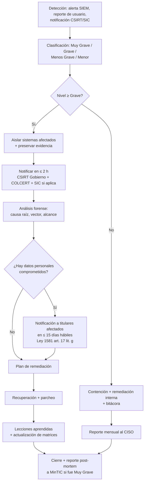

### 4.6.4 Roles del equipo de respuesta

| Rol | Responsable | Contacto típico |
|-----|-------------|-----------------|
| **Coordinador de respuesta** | CISO o quien haga sus veces (Resolución 500/2021 art. 9 numeral 2). | `ciso@entidad.gov.co` |
| **Líder técnico** | Ingeniero de seguridad de la Sede. | `seguridad@entidad.gov.co` |
| **Líder de comunicaciones** | Oficina de comunicaciones (sólo voceros autorizados). | `comunicaciones@entidad.gov.co` |
| **Enlace legal** | Oficina jurídica (Ley 1581 art. 17 g — notificación a titulares). | `juridica@entidad.gov.co` |
| **Enlace con autoridades** | Director/Representante Legal — único autorizado para reportar a MinTIC/Policía/Fiscalía (Resolución 2239/2024 MinTIC, art. 4). | Despacho |

### 4.6.5 SLAs de respuesta

| Nivel | Tiempo de contención | Tiempo de notificación a autoridades | Tiempo de notificación a titulares |
|-------|----------------------|--------------------------------------|------------------------------------|
| Muy Grave | ≤ 1 h | ≤ 2 h | ≤ 15 días hábiles |
| Grave | ≤ 4 h | ≤ 8 h | ≤ 30 días hábiles |
| Menos Grave | ≤ 24 h | Cierre + reporte | N/A salvo solicitud |
| Menor | ≤ 72 h | Bitácora mensual | N/A |

### 4.6.6 Inventario de evidencias y cadena de custodia

Toda respuesta sigue el lineamiento de la **Guía 13 MinTIC — Evidencia Digital**: hash SHA-256 antes y después de la adquisición, almacenamiento en contenedor de sólo lectura, bitácora con custodio y timestamp.

---

## 4.7 Lista de comprobación pre-producción

> Cada ítem referencia el criterio SEG-NNN que lo origina. Marcar **Sí / No / N/A** y adjuntar evidencia (captura, log, hash, URL).

### 4.7.1 Capa de transporte (SEG-001)

- [ ] Certificado TLS vigente, CA reconocida, cadena completa (no autofirmado).
- [ ] TLS mínimo 1.2 habilitado; TLS 1.3 recomendado.
- [ ] Renovación automática configurada (ACME o PKI).
- [ ] HSTS activo con `max-age ≥ 31536000`, `includeSubDomains`, `preload`.
- [ ] Redirección 301 HTTP → HTTPS en balanceador.
- [ ] Resultado en **SSL Labs: A o A+**.
- [ ] Resultado en **securityheaders.com: grado A o superior**.

### 4.7.2 Capa de red (SEG-002)

- [ ] Escaneo `nmap` documentado y firmado por CISO en los últimos 90 días.
- [ ] Sólo puertos 80/443 (WAF) y 22 (bastion) abiertos a internet.
- [ ] PostgreSQL/Redis/Mongo **no expuestos** públicamente.
- [ ] Reglas de firewall versionadas en IaC (Terraform/CloudFormation).
- [ ] Segmentación web/app/db/mgmt documentada.

### 4.7.3 Capa de aplicación — autenticación (SEG-003, SEG-004)

- [ ] CAPTCHA presente en TODOS los formularios que capturan datos ciudadanos (login, PQRS, registro).
- [ ] Rate-limit verificado: 5 fallos/5 min → HTTP 429.
- [ ] Bloqueo de cuenta tras 10 fallos/día con backoff exponencial.
- [ ] Política de contraseñas alineada con NIST SP 800-63B-4 (≥ 8 chars, sin reglas de composición, breach-check).
- [ ] MFA habilitada para funcionarios con acceso a datos personales o admin (SEG-016).
- [ ] Logs de autenticación centralizados (éxitos y fallos) — SEG-013.

### 4.7.4 Capa de aplicación — sesión y cookies (SEG-005)

- [ ] Toda cookie lleva `HttpOnly`, `Secure`, `SameSite=Lax` o `Strict`.
- [ ] Nombre de cookie de sesión no revela tecnología (`PHPSESSID`, `JSESSIONID`, `connect.sid` — renombrar a `__Host-sede-session` o equivalente).
- [ ] Timeout absoluto de sesión ≤ 30 min para datos sensibles.
- [ ] Logout invalida el token server-side.

### 4.7.5 Capa de aplicación — validación de entrada (SEG-009, SEG-010)

- [ ] Auditoría de código: **cero** concatenaciones SQL sin parametrizar.
- [ ] Escape contextual en todas las plantillas.
- [ ] Test XSS automatizado (ZAP, Burp) ejecutado en staging — 0 hallazgos críticos.
- [ ] Test SQLi automatizado (sqlmap) — 0 hallazgos críticos.
- [ ] Carga de archivos validada por allowlist (MIME real, extensión, tamaño).
- [ ] CSP estricta enviada en todas las respuestas.

### 4.7.6 Capa de aplicación — errores y logs (SEG-011, SEG-013)

- [ ] `APP_ENV=production` (sin modo debug).
- [ ] Mensajes de error genéricos al usuario con correlation-id.
- [ ] Detalles del error sólo en logs server-side.
- [ ] Logs centralizados en SIEM (Elastic, Splunk, Datadog, etc.).
- [ ] Retención de logs ≥ 12 meses en caliente.
- [ ] Redacción de PII y secretos en logs.
- [ ] Alertas activas sobre eventos A01/A03/A07 OWASP.

### 4.7.7 Capa de servidor web (SEG-007, SEG-008, SEG-012)

- [ ] Métodos `PUT`, `DELETE`, `TRACE`, `OPTIONS` deshabilitados (verificado con `curl -X`).
- [ ] Cabeceras de seguridad presentes (ver §4.2.7).
- [ ] `X-XSS-Protection: 0` enviado explícitamente (OWASP Secure Headers).
- [ ] `Public-Key-Pins` **NO** configurado (HPKP deprecada, ver §4.2.7).
- [ ] Contenedor ejecuta usuario no-root (UID 10001).
- [ ] Filesystem `read_only: true` excepto `/tmp`, `/var/log`.
- [ ] Permisos 0644/0755 sobre archivos servidos.
- [ ] Imagen base firmada (cosign), SBOM publicado, digest pinned (SEG-017).

### 4.7.8 Cumplimiento (SEG-006 + §4.5)

- [ ] Footer con los 5 enlaces del criterio 6, todos HTTP 200.
- [ ] Política de Tratamiento de Datos Personales vigente (Ley 1581).
- [ ] Bases de datos inscritas en el RNBD ante la SIC.
- [ ] Banner de cookies con opt-in granular (no essential cookies sin consentimiento).
- [ ] Procedimiento documentado para atender derechos ARCO en ≤ 15 días hábiles.

### 4.7.9 Copias de seguridad (SEG-014 `[A]`)

- [ ] Backup diario automatizado + verificación de éxito.
- [ ] Cifrado AES-256 en reposo con llaves en KMS separado.
- [ ] Almacenamiento off-site (otra región o datacenter).
- [ ] Inmutabilidad (WORM/object-lock) durante la ventana de retención.
- [ ] Prueba de restauración ejecutada en los últimos 90 días, firmada por CISO.
- [ ] DRP documentado con RPO ≤ 24 h y RTO ≤ 4 h.

### 4.7.10 Pipeline de desarrollo (SEG-015, SEG-017 `[A]`)

- [ ] SCA (Trivy/Grype) sin vulnerabilidades Críticas/Altas en dependencias de producción.
- [ ] SAST (Semgrep/SonarQube) sin hallazgos críticos.
- [ ] DAST (OWASP ZAP) ejecutado en staging antes de cada release.
- [ ] Pipeline firmado (SLSA L3), imagen firmada con cosign.
- [ ] Despliegues a producción requieren **dos aprobaciones** (desarrollador + líder de seguridad).

### 4.7.11 Plan de respuesta (ver §4.6)

- [ ] Procedimiento de gestión de incidentes documentado y socializado.
- [ ] Datos de contacto de CSIRT, COLCERT, SIC, CC-CSIRT Policía en runbook.
- [ ] DR drill anual ejecutado en los últimos 12 meses.
- [ ] Bitácora de incidentes actualizada y firmada por CISO.
- [ ] Plantilla de notificación a titulares Ley 1581 art. 17 g aprobada por Oficina Jurídica.

---

## Referencias

### Fuentes primarias (PDF cargado en el sandbox)

| ID | Documento | Ruta en sandbox | MD5 |
|----|-----------|-----------------|-----|
| P-S-01 | *Criterios de aceptación de seguridad para tu sede electrónica* — MinTIC / Agencia Nacional Digital (2022), 2 páginas, 12 criterios. | `/workspace/attachments/2f7ff2ee24bca6c7/Criterios de aceptación de seguridad para tu sede electrónica.pdf` | `9740495da3698e681828a96c28f2fea7` |
| P-S-02 | Idéntica a P-S-01 (respaldo). | `/workspace/attachments/fe2ecd8b464a0265/Criterios de aceptación de seguridad para tu sede electrónica.pdf` | `9740495da3698e681828a96c28f2fea7` |
| P-S-03 | Idéntica a P-S-01 (respaldo, renombrada con "(1)"). | `/workspace/attachments/4802c6c819d3cc47/Criterios de aceptación de seguridad para tu sede electrónica (1).pdf` | `9740495da3698e681828a96c28f2fea7` |
| P-S-04 | Idéntica a P-S-01 (respaldo, renombrada con "(1)"). | `/workspace/attachments/c5eb092ceda3bb61/Criterios de aceptación de seguridad para tu sede electrónica (1).pdf` | `9740495da3698e681828a96c28f2fea7` |

> Las cuatro copias son idénticas bit a bit. Se cita P-S-01 como principal y las demás como respaldo; la numeración de páginas/items es la misma.

### Normativa colombiana

| Ref. | Documento | URL oficial |
|------|-----------|-------------|
| N-01 | **Ley 1581 de 2012** — *Por la cual se dictan disposiciones generales para la protección de datos personales*. Congreso de la República. DO 48587. | https://www.alcaldiabogota.gov.co/sisjur/normas/Norma1.jsp?i=49981 |
| N-02 | **Decreto 1377 de 2013** — Reglamentación parcial de la Ley 1581/2012. | (compilado en Decreto 1078/2015) |
| N-03 | **Ley 1712 de 2014** — Ley de Transparencia y Acceso a la Información Pública. | (compilada en normograma MinTIC) |
| N-04 | **Resolución 500 de 2021** — MinTIC, *Por la cual se establecen los lineamientos y estándares para la estrategia de seguridad digital y se adopta el MSPI*. DO 51.619. | https://normograma.mintic.gov.co/mintic/compilacion/docs/resolucion_mintic_0500_2021.htm |
| N-05 | **Resolución 1519 de 2020** — MinTIC, *Estándares y directrices para publicar información en sedes electrónicas*. | (compilada en MinTIC) |
| N-06 | **Resolución 2239 de 2024** — MinTIC, *Política General de Seguridad y Privacidad de la Información del Ministerio/Fondo Único de TIC*. | https://normograma.mintic.gov.co/mintic/compilacion/docs/resolucion_mintic_2239_2024.htm |
| N-07 | **Circular Externa 04 de 2019** — SIC, *Tratamiento de datos personales en sistemas de información interoperables*. | https://cancilleria.gov.co/normograma/compilacion/docs/circular_superindustria_0004_2019.htm |
| N-08 | **Decreto 2106 de 2019** — *Dicta normas para simplificar, suprimir y reformar trámites, procesos y procedimientos innecesarios*. Art. 14 sobre autenticación digital. | (citado en §1 — Marco normativo) |
| N-09 | **Constitución Política de Colombia** — arts. 15 (intimidad / habeas data), 20 (información), 209 (función administrativa), 269 (responsabilidad de servidores). | (citado en MSPI) |

### Estándares y guías técnicas

| Ref. | Documento | URL |
|------|-----------|-----|
| T-01 | **OWASP Top 10:2021** — *The Ten Most Critical Web Application Security Risks*. | https://owasp.org/Top10/2021/ |
| T-02 | **OWASP Secure Headers Project** — *Response Headers*. | https://owasp.github.io/www-project-secure-headers/response-headers/ |
| T-03 | **OWASP HTTP Headers Cheat Sheet**. | https://cheatsheetseries.owasp.org/cheatsheets/HTTP_Headers_Cheat_Sheet.html |
| T-04 | **NIST SP 800-63B-4** — *Digital Identity Guidelines: Authentication and Lifecycle Management* (revisión 4 vigente desde 2025-08-01). | https://pages.nist.gov/800-63-4/sp800-63b.html |
| T-05 | **NIST SP 800-61r2** — *Computer Security Incident Handling Guide*. | https://nvlpubs.nist.gov/nistpubs/SpecialPublications/NIST.SP.800-61r2.pdf |
| T-06 | **RFC 6797** — *HTTP Strict Transport Security (HSTS)*. | https://datatracker.ietf.org/doc/html/rfc6797 |
| T-07 | **RFC 6265** — *HTTP State Management Mechanism (Cookies)*. | https://datatracker.ietf.org/doc/html/rfc6265 |
| T-08 | **RFC 8446** — *The Transport Layer Security (TLS) Protocol Version 1.3*. | https://datatracker.ietf.org/doc/html/rfc8446 |
| T-09 | **ISO/IEC 27001:2022** — *Information security, cybersecurity and privacy protection — Information security management systems — Requirements*. | https://www.iso.org/standard/27001 |
| T-10 | **CIS Docker Benchmark** — *Docker security best practices*. | https://www.cisecurity.org/benchmark/docker |

### Documentos institucionales (Colombia)

| Ref. | Documento | URL |
|------|-----------|-----|
| I-01 | **Documento Maestro del MSPI** — MinTIC, V 5.0 (21/04/2025). | https://gobiernodigital.mintic.gov.co/692/articles-401770_recurso_1.pdf |
| I-02 | **Modelo de Seguridad y Privacidad de la Información** — MinTIC (versión histórica). | https://mintic.gov.co/gestionti/615/articles-5482_Modelo_de_Seguridad_Privacidad.pdf |
| I-03 | **CSIRT Gobierno** — MinTIC. | https://www.csirtgobierno.gov.co/ |
| I-04 | **ColCERT** — Grupo de Respuesta a Emergencias Cibernéticas de Colombia. | https://www.colcert.gov.co/ |
| I-05 | **CC-CSIRT Policía Nacional** — *Alertas y tips*. | https://cc-csirt.policia.gov.co/alertas-tips |
| I-06 | **SIC — Delegatura para la Protección de Datos Personales**. | https://www.sic.gov.co/ |

### Notas finales sobre la metodología de citación

1. Cada criterio `SEG-NNN` con numeración 001–012 cita explícitamente **página y número de ítem** del PDF (p. 1 · ítem 1 … p. 2 · ítem 12). El texto del PDF se reproduce entre comillas.
2. Los criterios `SEG-013` a `SEG-018` y los requisitos `SEG-XXX-RX-NN` están marcados con `[A]` porque **no aparecen textualmente** en el PDF; su inclusión se justifica contra fuentes externas (OWASP, NIST, MSPI, RFC, Resolución 500/2021).
3. La cita de cabeceras incluye la observación documentada de que **HPKP está deprecada** (Chrome 72, 2019); el PDF la lista (criterio 12) pero la guía técnica profesional actual recomienda **omitirla**. Esta divergencia se documenta explícitamente en §4.2.7 con marca `[A]` para que el equipo tome una decisión informada.
4. La escala de severidad (§4.1.4) es inferida pero consistente con la nomenclatura del MSPI/MinTIC.


---

## 5. Funcionalidad de la Sede Electrónica

> **Audiencia:** Product Owner + desarrollador full-stack.
> **Propósito:** Consolidar los requisitos funcionales (qué debe *hacer* la Sede Electrónica) extraídos del PDF "Criterios de aceptación de funcionalidad para tu sede electrónica" (Mintic / Agencia Nacional Digital 2022) y de la presentación "Puntos claves de Sedes Electrónicas" (Mintic).
> **Alcance:** Esta sección cubre el catálogo de trámites y servicios, los flujos críticos end-to-end, los criterios de aceptación con IDs trazables, las integraciones externas obligatorias, el panel de autogestión del ciudadano y las métricas de éxito.
> **Documentos relacionados:** Esta sección se complementa con §2 (Diseño / Kit UI), §3 (Accesibilidad), §4 (Seguridad) y §1 (Marco normativo — Decreto 2106/2019).

---

## 5.1 Trámites y servicios que una Sede Electrónica debe ofrecer

La Sede Electrónica no es una página informativa: es un **canal único de interacción del ciudadano con la entidad** que debe soportar, como mínimo, los seis bloques funcionales detallados a continuación. El catálogo mínimo obligatorio se deriva de la composición de la Sede descrita en la diapositiva 5 del PPT "Puntos claves de Sedes Electrónicas" y del listado de ítems obligatorios de la diapositiva 10.

### 5.1.1 Catálogo obligatorio de bloques funcionales

| # | Bloque funcional | Componentes que agrupa | Cita |
|---|------------------|------------------------|------|
| B1 | **Contenido e información institucional** | Páginas estáticas, noticias, misión/visión, estructura orgánica, normatividad interna | PPT diap. 5 |
| B2 | **Trámites, OPAs y servicios** | Catálogo navegable, búsqueda, filtros, ficha del trámite, botón "Iniciar trámite" (en línea / parcialmente en línea / presencial) | PPT diap. 5 y 12 |
| B3 | **Acceso a la información pública** | Cumplimiento Ley 1712/2014 (Transparencia y acceso a la información pública — Resolución 1519/2020 Anexo 2) | PPT diap. 11 |
| B4 | **Ejercicios de participación ciudadana** | Noticias, portales transversales, encuestas, consultas, control social | PPT diap. 5 y 13 |
| B5 | **PQRSD (Peticiones, Quejas, Reclamos, Solicitudes, Denuncias)** | Formulario tipificado, radicado, consulta de estado, notificación | PPT diap. 12 |
| B6 | **Ventanillas únicas y canales de atención** | Canales presencial/virtual, agendamiento de citas, chat/CallCenter, correo de atención al usuario | PPT diap. 12 y 14 |

### 5.1.2 Items visuales obligatorios en todas las Sedes

Estos items deben estar presentes en la página principal y son verificables en revisión visual (ver §6.5 para el checklist pre-piloto):

| Item | Ubicación esperada | Cita |
|------|--------------------|------|
| Barra superior con logo **gov.co**, enlace al portal gov.co y enlaces de traducción a otros idiomas | Top de página | PPT diap. 9 |
| **Encabezado** con logo de la Entidad enlazado a la página principal, buscador general y enlace de inicio de sesión (opcional) | Cabecera | PPT diap. 9 |
| Menú principal con **máximo 7 opciones** y desplegables de **máximo 2 niveles** | Bajo del header | PPT diap. 10 |
| Sección **Transparencia y acceso a la información pública** | Bloque destacado | PPT diap. 10 y 11 |
| Sección **Servicios a la Ciudadanía** | Bloque destacado | PPT diap. 10 y 12 |
| Sección **Participa** (Noticias + portales transversales) | Bloque destacado | PPT diap. 10 y 13 |
| **Pie de página** con logo gov.co, marca país CO–Colombia, datos de la entidad, redes sociales, mapa del sitio y políticas | Footer | PPT diap. 14 |

### 5.1.3 Composición mínima de la sección "Servicios a la Ciudadanía"

Por cada trámite publicado (PPT diap. 12), la Sede debe indicar **explícitamente** los seis atributos del catálogo. Si falta cualquiera de ellos, el ítem no cumple criterio de aceptación:

| Atributo | Tipo de valor | Ejemplo |
|----------|---------------|---------|
| Modalidad | `EN_LINEA` \| `PARCIALMENTE_EN_LINEA` \| `PRESENCIAL` | EN_LINEA |
| Tiene costo | `GRATUITO` \| `CON_COSTO` | CON_COSTO |
| Tiempo de solución | Duración estimada (días hábiles) | 15 |
| Canal de inicio | URL gov.co o botón interno | https://gov.co/tramites/X |
| Mecanismo de consulta de estado | URL/endpoint de seguimiento | /seguimiento?radicado=… |
| Documentos / requisitos | Lista descargable en PDF | reqs.pdf |

---

## 5.2 Flujos críticos

Los seis flujos críticos del ciudadano son transversales a todas las Sedes Electrónicas. Cada flujo se documenta con un diagrama Mermaid `sequenceDiagram` (estándar de la guía) y se referencia a los criterios FUN-XXX que aplican en cada paso.

### 5.2.1 Flujo de autenticación ciudadana

El inicio de sesión es **opcional** en la página principal (PPT diap. 9), pero es **obligatorio** en cualquier trámite en línea que requiera tratamiento de datos personales o firma. Se debe integrar con el proveedor de identidad ciudadana definido en §5.4.

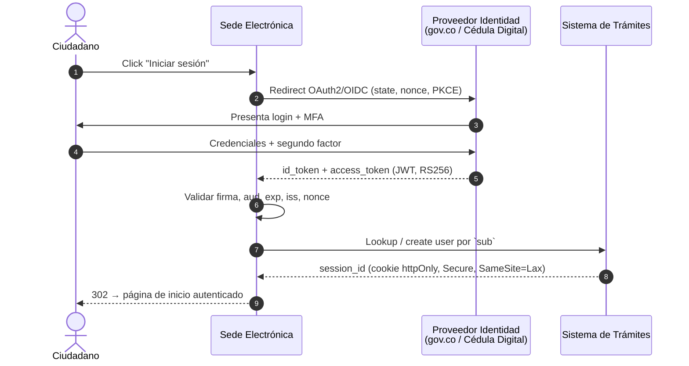

**Puntos de control:**
- Cookies de sesión con atributos `Secure`, `HttpOnly`, `SameSite=Lax/Strict`, expiración deslizante ≤ 30 min de inactividad.
- CSRF token para todo POST/PUT/DELETE contra el backend.
- Si el trámite requiere firma electrónica, encadenar la firma al `id_token` del ciudadano (no reutilizar tokens antiguos).

### 5.2.2 Flujo de búsqueda

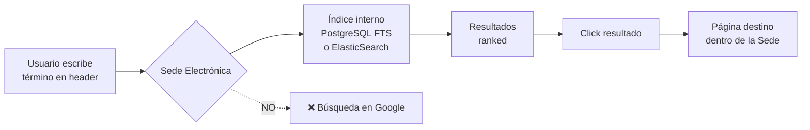

**Reglas duras (PDF criterios 1 y 6):**
- El motor de búsqueda **debe estar contenido dentro de la Sede**; está prohibido usar un buscador de Google interno (PDF, criterio 1, pág. 1).
- Los resultados **no deben estar rotos** y deben direccionar a las páginas correctas (PDF, criterio 2, pág. 1).
- Si la búsqueda es en la sección de Transparencia, debe ser **dentro de la propia sección** y ordenada del más reciente al más antiguo (PPT diap. 11).

### 5.2.3 Flujo de solicitud de trámite

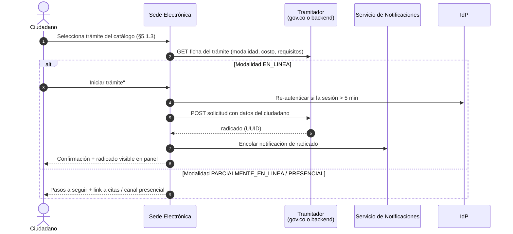

### 5.2.4 Flujo de seguimiento

Disponible siempre, autenticado o no (con captcha cuando no esté autenticado para evitar enumeración de radicados):

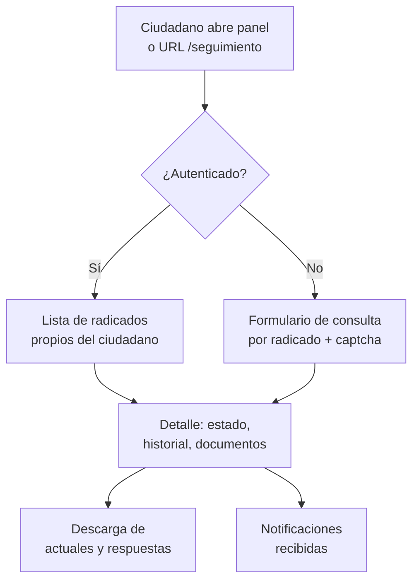

### 5.2.5 Flujo de notificación

Toda Sede Electrónica debe contar con un servicio de notificaciones al ciudadano. Los canales y reglas mínimas son:

| Canal | Obligatoriedad | Disparador típico | Cita |
|-------|----------------|-------------------|------|
| Correo electrónico | Obligatorio | Radicación, cambio de estado, respuesta final | PPT diap. 14 (correo de notificaciones judiciales) y criterio funcional común |
| Mensajería de texto (SMS) | Recomendado cuando hay costo/tiempo crítico | Radicación, vencimiento de términos | Inferencia técnica a partir de PPT diap. 20 (operación 24x7) |
| Notificación push (web/app) | Opcional | Cambios de estado | [A] Inferencia |
| Notificación electrónica con acuse (correo certificado / 4-72, Certicámara) | Obligatorio para actos administrativos | Actos administrativos que requieren notificación legal | Ley 1437/2011 art. 56 (sustituido por Ley 2080/2021) |
| Bandeja interna en el panel del ciudadano | Obligatorio | Cualquier comunicación | Derivado de PPT diap. 12 (mecanismos de consulta del estado) |

> **[A] Inferencia:** Las notificaciones electrónicas con acuse son obligatorias para actos administrativos en Colombia por la Ley 1437/2011 (CPACA) y Ley 2080/2021. El PPT no las detalla, pero el PDF de criterios funcionales sí exige "mecanismos de consulta del estado del trámite" (criterio equivalente).

### 5.2.6 Flujo de pago (si aplica)

Cuando el catálogo de la Sede incluya trámites con costo, la Sede **no procesa pagos directamente**: integra con un proveedor certificado (ver §5.4):

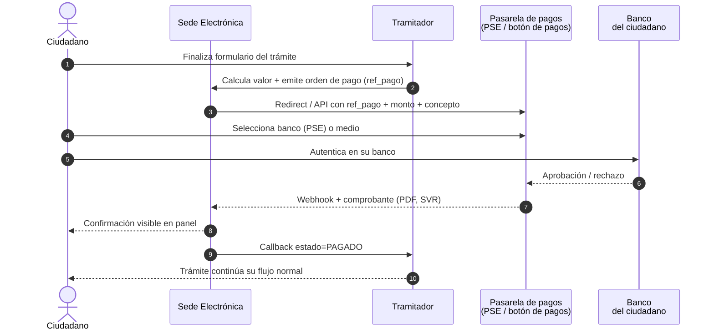

**Reglas duras:**
- El comprobante de pago debe quedar **almacenado** y ser **consultable** desde el panel del ciudadano.
- La Sede nunca debe almacenar datos de tarjeta; la captura de medios de pago ocurre exclusivamente en la pasarela certificada PCI-DSS.
- Soportar **reintento idempotente** del webhook (si la pasarela reenvía, no duplicar el pago).

---

## 5.3 Criterios de aceptación funcionales (FUN-XXX)

Cada criterio tiene un ID único `FUN-NNN`, una descripción verificable, la fuente literal (PDF página 1 o PPT diapositiva X) y el método de verificación.

### 5.3.1 Criterios literales del PDF "Criterios de aceptación de funcionalidad"

Estos son los **6 criterios numerados** del PDF principal (1 página). Deben marcarse como `Origen = PDF criterio N` y se conservan textuales:

| ID | Criterio (verbatim) | Fuente | Severidad | Cómo verificar |
|----|---------------------|--------|-----------|----------------|
| **FUN-001** | En el buscador se debe realizar la búsqueda **dentro de la Sede**. No se puede contemplar un buscador que use Google. | PDF pág. 1, criterio 1 | Crítica | Inspección del endpoint `/search` — no debe hacer proxy a `google.com/search`. Test: consultar con `site:example.gov.co` y validar que la respuesta proviene del índice propio. |
| **FUN-002** | Garantizar que los vínculos presentados en las páginas **no estén rotos** y direccionen a las páginas correctas. | PDF pág. 1, criterio 2 | Alta | Crawler automático semanal (ej. `linkchecker` o Screaming Frog) sobre toda la Sede; reportar 0 enlaces 4xx/5xx. |
| **FUN-003** | Cuando se direccione a una **página externa**, se recomienda que se abra en una **nueva pestaña** (`target="_blank"` + `rel="noopener noreferrer"`). | PDF pág. 1, criterio 3 | Media | Linter HTML en CI que verifique `target="_blank"` venga acompañado de `rel="noopener"`. |
| **FUN-004** | En **todos los formularios** donde se capturen datos personales se debe contar con: (a) aviso de privacidad y autorización para tratamiento de datos, (b) **Captcha**. | PDF pág. 1, criterio 4 | Crítica | Revisión de cada formulario + test automatizado que intenta POST sin captcha y debe ser rechazado. |
| **FUN-005** | Garantizar que los **campos obligatorios** dentro de los formularios cumplan esa condición. Los **vínculos de políticas** deben enlazar a: A) Términos y condiciones; B) Privacidad y tratamiento de datos; C) Derechos de autor y/o autorización de uso sobre los contenidos. | PDF pág. 1, criterio 5 | Alta | Test E2E: enviar el formulario vacío → debe mostrar error por cada campo obligatorio y los enlaces a políticas deben responder 200. |
| **FUN-006** | Si el usuario **no diligencia** los campos, debe **presentarse el mensaje de error** correspondiente. | PDF pág. 1, criterio 6 | Alta | Test E2E: cada formulario debe rechazar el submit con `aria-invalid="true"` y mensaje legible asociado. |

### 5.3.2 Criterios derivados del PPT "Puntos claves de Sedes Electrónicas"

Estos criterios amplían el alcance funcional de la Sede según los lineamientos del PPT y se marcan como `Origen = PPT diap. X`. Las inferencias se marcan con **[A]**.

#### 5.3.2.1 Estructura y navegación

| ID | Criterio | Fuente |
|----|----------|--------|
| **FUN-007** | La Sede debe contar con una dirección electrónica pública estable (no IP) que la identifique unívocamente. | PPT diap. 8 |
| **FUN-008** | Los contenidos deben estar en **castellano**; la entidad puede ofrecer otros idiomas conforme a Ley 1712/2014. | PPT diap. 8 |
| **FUN-009** | La **titularidad, administración y gestión** del sitio debe estar a cargo de la entidad (no de un tercero sin acto administrativo). | PPT diap. 8 |
| **FUN-010** | La barra superior debe incluir obligatoriamente: logo **gov.co**, enlace al portal gov.co y enlaces de traducción. | PPT diap. 9 |
| **FUN-011** | El encabezado debe incluir: logo de la entidad enlazado a inicio, **buscador general** y enlace de inicio de sesión (opcional). | PPT diap. 9 |
| **FUN-012** | El menú principal debe tener **máximo 7 opciones** y desplegables de **máximo 2 niveles**. | PPT diap. 10 |
| **FUN-013** | La Sede debe mostrar las tres secciones obligatorias: **Transparencia y acceso a la información pública**, **Servicios a la Ciudadanía** y **Participa**. | PPT diap. 10 |
| **FUN-014** | El pie de página debe incluir: logo gov.co, marca país CO–Colombia, datos completos de la entidad (nombre, dirección, código postal, teléfono, línea gratuita, línea anticorrupción, correo de atención al usuario, correo de notificaciones judiciales), redes sociales, mapa del sitio y enlace a políticas. | PPT diap. 14 |
| **FUN-015** | La Sede debe enlazar las tres políticas obligatorias: Términos y condiciones, Privacidad y tratamiento de datos, Derechos de autor y/o autorización de uso sobre los contenidos. | PPT diap. 15 |

#### 5.3.2.2 Transparencia y acceso a la información pública

| ID | Criterio | Fuente |
|----|----------|--------|
| **FUN-016** | La sección de Transparencia debe garantizar integridad, calidad, accesibilidad y disponibilidad de la información. | PPT diap. 11 |
| **FUN-017** | La sección de Transparencia debe contar con **buscador propio** dentro de la sección. | PPT diap. 11 |
| **FUN-018** | Los formatos publicados deben ser **accesibles** y permitir **descarga y uso sin restricciones**. | PPT diap. 11 |
| **FUN-019** | Toda la información o documentación debe llevar **fecha de publicación** y estar ordenada del más reciente al más antiguo. | PPT diap. 11 |
| **FUN-020** | Se debe evitar la **duplicidad** de información entre secciones. | PPT diap. 11 |

#### 5.3.2.3 Servicios a la Ciudadanía

| ID | Criterio | Fuente |
|----|----------|--------|
| **FUN-021** | Por cada trámite se debe indicar **modalidad** (en línea, parcialmente en línea, presencial), **costo** (gratuito/con costo) y **tiempo de solución**. | PPT diap. 12 |
| **FUN-022** | El catálogo de trámites debe incluir componentes de consulta, **criterios de búsqueda** y **paginación**. | PPT diap. 12 |
| **FUN-023** | Los trámites **en línea** o **parcialmente en línea** deben **direccionar a gov.co** (portal único del Estado) para su ejecución. | PPT diap. 12 |
| **FUN-024** | La Sede debe **disponer mecanismos de consulta del estado del trámite** por radicado. | PPT diap. 12 |
| **FUN-025** | La Sede debe ofrecer acceso a: **Trámites, OPAs, consulta de acceso a información pública, ventanillas únicas, canales de atención y PQRSD**. | PPT diap. 12 |

#### 5.3.2.4 Participa

| ID | Criterio | Fuente |
|----|----------|--------|
| **FUN-026** | La sección **Noticias** debe publicar las noticias más relevantes en la página principal y enlazar al archivo histórico. | PPT diap. 13 |
| **FUN-027** | La sección **Portales de programas transversales** debe enlazar a los portales de programas a cargo de la entidad. | PPT diap. 13 |
| **FUN-028** | Las noticias deben cumplir criterios de **lenguaje claro**, accesibilidad y usabilidad. | PPT diap. 13 |

#### 5.3.2.5 Formularios, captcha y datos personales

| ID | Criterio | Fuente |
|----|----------|--------|
| **FUN-029** | Todos los formularios que capturen datos personales deben incluir **aviso de privacidad** visible y **casilla de autorización** para el tratamiento de datos (Ley 1581/2012 — Habeas Data). | PDF pág. 1, criterio 4 + Ley 1581/2012 [A: marco legal colombiano de protección de datos] |
| **FUN-030** | Los formularios deben incluir un **Captcha** para evitar envíos automatizados. | PDF pág. 1, criterio 4 |
| **FUN-031** | Los **campos obligatorios** deben marcarse visualmente (ej. asterisco + texto "obligatorio") y validar tanto en cliente como en servidor. | PDF pág. 1, criterio 5 |
| **FUN-032** | Ante campos no diligenciados o con error de formato, la Sede debe **mostrar mensaje de error** claro, asociado al campo y accesible (`aria-describedby`). | PDF pág. 1, criterio 6 |
| **FUN-033** | Los enlaces de **Términos y condiciones**, **Privacidad y tratamiento de datos** y **Derechos de autor** deben estar presentes en todos los formularios donde aplique. | PDF pág. 1, criterio 5 |
| **FUN-034** | La Sede debe ofrecer un **sistema de gestión de cookies** que permita aceptar, denegar o revocar el consentimiento. | PPT diap. 15 |

#### 5.3.2.6 Seguimiento y notificaciones

| ID | Criterio | Fuente |
|----|----------|--------|
| **FUN-035** | La Sede debe permitir al ciudadano **consultar el estado** de sus trámites/solicitudes mediante radicado. | PPT diap. 12 (mecanismos de consulta del estado) |
| **FUN-036** | El ciudadano debe poder **descargar los documentos** asociados a cada trámite (radicado, respuesta, actos administrativos). | [A] Inferencia a partir del PPT diap. 11 ("formatos accesibles sin restricciones") |
| **FUN-037** | El ciudadano debe recibir **notificación** en al menos un canal (correo electrónico) cuando se produzcan eventos relevantes: radicación, cambio de estado, respuesta final. | PPT diap. 14 (correo de notificaciones judiciales y correo de atención al usuario) |
| **FUN-038** | La Sede debe contar con una **bandeja de notificaciones interna** accesible desde el panel del ciudadano. | [A] Inferencia a partir del PPT diap. 12 (mecanismos de consulta del estado) |
| **FUN-039** | Los actos administrativos que requieran notificación legal deben enviarse por **correo certificado** o mecanismo equivalente con acuse de recibo (Ley 1437/2011 art. 56 sustituido por Ley 2080/2021). | [A] Marco legal colombiano obligatorio |

#### 5.3.2.7 Pagos

| ID | Criterio | Fuente |
|----|----------|--------|
| **FUN-040** | Cuando un trámite tenga costo, la Sede debe **integrar con una pasarela certificada** (PSE / botón de pagos) — nunca capturar medios de pago directamente. | [A] Inferencia — buenas prácticas PCI-DSS y SFC Colombia |
| **FUN-041** | El **comprobante de pago** debe quedar almacenado y ser consultable desde el panel del ciudadano. | [A] Inferencia a partir de FUN-036 |
| **FUN-042** | La Sede debe **reconciliar** el estado del pago con la pasarela mediante **webhook idempotente**. | [A] Inferencia técnica estándar |

#### 5.3.2.8 Panel de autogestión del ciudadano

| ID | Criterio | Fuente |
|----|----------|--------|
| **FUN-043** | El panel debe mostrar el listado de **todos los trámites** del ciudadano autenticado, con su estado actual. | [A] Inferencia a partir de FUN-024 y FUN-035 |
| **FUN-044** | El panel debe permitir **actualizar datos de contacto** (correo, celular) y gestionar la **suscripción a notificaciones**. | [A] Inferencia a partir de FUN-037 |
| **FUN-045** | El panel debe permitir la **descarga masiva** de documentos y radicados en formatos abiertos (CSV / JSON / PDF). | [A] Inferencia (alineado con FUN-036 y formatos abiertos) |
| **FUN-046** | El panel debe mostrar un **historial de notificaciones** recibidas con acuse. | [A] Inferencia a partir de FUN-038 |

#### 5.3.2.9 Atributos de calidad (usabilidad funcional)

| ID | Criterio | Fuente |
|----|----------|--------|
| **FUN-047** | La Sede debe cumplir con la **guía de diseño** del Kit UI 9.2 (entidades nacionales de rama ejecutiva deben cumplir adicionalmente la Directiva 03/2019). | PPT diap. 17 |
| **FUN-048** | La Sede debe usar **lenguaje claro** en todos los contenidos visibles al ciudadano. | PPT diap. 17 |
| **FUN-049** | Los estilos deben estar **separados del contenido** (CSS externo, sin estilos inline críticos). | PPT diap. 17 |
| **FUN-050** | La Sede debe ser **independiente del navegador** y operable con los navegadores soportados por la entidad (mínimo: últimas 2 versiones de Chrome, Firefox, Edge, Safari). | PPT diap. 17 |
| **FUN-051** | La Sede debe tener **versión responsive** y adecuada en dispositivos móviles. | PPT diap. 17 |
| **FUN-052** | La Sede debe incluir una **encuesta de usabilidad** visible para el ciudadano. | PPT diap. 17 |

#### 5.3.2.10 Continuidad y preservación

| ID | Criterio | Fuente |
|----|----------|--------|
| **FUN-053** | La **disponibilidad** de la Sede debe ser **igual o superior al 95%**. | PPT diap. 19 |
| **FUN-054** | La Sede debe implementar **mecanismos de preservación documental** definidos por el Archivo General de la Nación (AGN). | PPT diap. 19 |
| **FUN-055** | La Sede debe contar con **planes de contingencia** ante vulnerabilidades. | PPT diap. 20 |
| **FUN-056** | La Sede debe contar con **plan de respaldo y copias de seguridad** y **sistema de control de versiones**. | PPT diap. 20 |
| **FUN-057** | La Sede debe contar con **mecanismos de manejo de errores** que no expongan información técnica sensible al ciudadano. | PPT diap. 20 |
| **FUN-058** | La información publicada debe estar **actualizada, veraz, oportuna y completa**. | PPT diap. 19 |
| **FUN-059** | Los archivos dispuestos deben permitir **libre uso**, bajo **licencia abierta**, sin restricciones legales y en **formatos de datos abiertos**. | PPT diap. 19 |
| **FUN-060** | La Sede debe tener **certificado SSL** vigente y **forzar HTTPS** en todas las páginas. | PPT diap. 20 |

### 5.3.3 Resumen de cobertura por fuente

| Fuente | # criterios | IDs |
|--------|-------------|-----|
| PDF "Criterios de aceptación de funcionalidad" (1 pág.) | 6 | FUN-001 a FUN-006 |
| PPT "Puntos claves de Sedes Electrónicas" — bloques temáticos | 38 | FUN-007 a FUN-019 (estructura), FUN-020 a FUN-028 (transparencia / participa), FUN-029 a FUN-034 (formularios), FUN-035 a FUN-039 (seguimiento y notificaciones), FUN-040 a FUN-042 (pagos), FUN-043 a FUN-046 (panel), FUN-047 a FUN-052 (calidad), FUN-053 a FUN-060 (continuidad) |
| **[A] Inferencia técnica / normativa complementaria** | 10 | Marcados con [A] en las tablas anteriores |
| **Total** | **60** | FUN-001 a FUN-060 |

---

## 5.4 Integraciones obligatorias

Las integraciones externas que toda Sede Electrónica colombiana debe soportar, con su propósito, normativa y referencia de contrato/API cuando aplique. Las marcadas como **(a confirmar)** no estaban detalladas en el PDF/PPT pero son exigidas por el marco normativo colombiano; se recomienda confirmar versión y contrato durante la fase de implementación.

| # | Integración | Propósito funcional | Normativa / Estándar | API / Contrato (referencia) |
|---|-------------|---------------------|----------------------|------------------------------|
| INT-01 | **Autenticación ciudadana (gov.co / Cédula Digital)** | Inicio de sesión del ciudadano para trámites en línea, perfil único y firma | Ley 2052/2020 (art. 8 — interoperabilidad de autenticación); Decreto 2106/2019 (art. 16 — autenticación digital) | OIDC/OAuth2 contra `id.gov.co` (a confirmar versión) |
| INT-02 | **Gov.co — Portal Único del Estado** | Los trámites en línea y parcialmente en línea deben direccionar al portal gov.co | PPT diap. 12 ("Los trámites en línea o parcialmente en línea, deben direccionar a gov.co") | https://www.gov.co — modelo de integración por iframe/redirect (a confirmar) |
| INT-03 | **PSE — Pagos Seguros en Línea** | Pasarela de pagos para trámites con costo | Resolución 0518/2020 SFC (reglas de canal de pago); PCI-DSS para certificación | API REST + webhook; documentación en https://www.pse.com.co (a confirmar versión) |
| INT-04 | **Botón de pagos (otros adquirentes)** | Alternativa a PSE: tarjetas crédito/débito, wallets | Ley 2069/2020 (economía digital); PCI-DDS | API REST estándar (a confirmar adquirente — Ej. PlaceToPay, PayU, Mercado Pago) |
| INT-05 | **Firma electrónica (AND / Certicámara / GSE)** | Firma de documentos cuando el trámite lo exija | Ley 527/1999; Decreto 2364/2012 (firma electrónica); Decreto 2106/2019 (art. 11 — entidades de certificación) | API SOAP/REST por proveedor (a confirmar) |
| INT-06 | **Correo certificado** | Notificación de actos administrativos con acuse de recibo | Ley 1437/2011 art. 56 (sustituido Ley 2080/2021); Decreto 491/2020 | Servicios 4-72 / Certicámara / Correo electrónico con acuse (a confirmar) |
| INT-07 | **Notificaciones electrónicas** (correo, SMS, push) | Comunicación de eventos del trámite (radicación, cambios, respuesta) | Ley 1437/2011 (notificaciones electrónicas); Decreto 491/2020 | SMTP/SES/SendGrid para correo; proveedor SMS (a confirmar) |
| INT-08 | **Archivo General de la Nación (AGN) — preservación documental** | Implementar mecanismos de preservación de la información pública | Ley 594/2000 (Ley General de Archivos); Decreto 2106/2019 (transparencia); PPT diap. 19 | Directrices técnicas AGN (a confirmar versión) |
| INT-09 | **Sistema de PQRSD** | Recepción, radicación, seguimiento y respuesta a PQRSD | Ley 1755/2011 (derecho de petición); Ley 1437/2011 (CPACA) | API propia o gov.co (a confirmar) |
| INT-10 | **Captcha / anti-bot** | Protección de formularios contra envíos automatizados | PDF pág. 1, criterio 4 | reCAPTCHA v3 / hCaptcha / Turnstile (a confirmar) |
| INT-11 | **Buscador interno indexado** | Búsqueda dentro de la Sede (prohibido usar Google) | PDF pág. 1, criterio 1 | PostgreSQL Full-Text Search, ElasticSearch u OpenSearch (a confirmar) |
| INT-12 | **Gestor de cookies / consent management** | Aceptar, denegar o revocar cookies | Ley 1581/2012 (Habeas Data); PPT diap. 15 | Cookiebot / OneTrust / implementación propia (a confirmar) |
| INT-13 | **Kit UI 9.2 — Gov.co** | Componentes UI oficiales para la Sede | Resolución 1519/2020 Anexo 2.1 | https://gitlab.com/govco/layout-govco/-/tree/v5 |
| INT-14 | **CSIRT / equipo de respuesta a incidentes** | Reporte y atención de incidentes de seguridad | Ley 1273/2009; Conpes 3701/2011; PPT diap. 20 | Canal CSIRT nacional: https://www.csirt.gov.co (a confirmar) |

> **Leyenda de la columna "API/Contrato":** Las entradas marcadas **(a confirmar)** deben validarse con el proveedor durante la fase de implementación; el PPT y PDF no especifican la versión del contrato. Para las integraciones con gov.co, PSE y firma electrónica se debe acordar NDA y pruebas de integración en Fase 3.

---

## 5.5 Panel de autogestión del ciudadano

El **panel del ciudadano** (también llamado "Carpeta ciudadana" o "Mi Sede") es el espacio autenticado donde el ciudadano gestiona toda su relación con la entidad. Su diseño se deriva de los requisitos de seguimiento (PPT diap. 12), notificaciones (PPT diap. 14) y autogestión de datos personales (PDF pág. 1, criterio 4 + Ley 1581/2012).

### 5.5.1 Componentes mínimos del panel

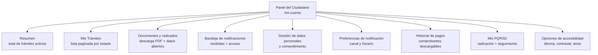

### 5.5.2 Trazabilidad con criterios FUN-XXX

| Componente | Criterios relacionados |
|------------|----------------------|
| Resumen | FUN-024, FUN-035, FUN-043 |
| Mis Trámites | FUN-024, FUN-035, FUN-043 |
| Documentos y radicados | FUN-036, FUN-045 |
| Bandeja de notificaciones | FUN-038, FUN-046 |
| Gestión de datos personales | FUN-029, FUN-033 (enlaces a políticas), Ley 1581/2012 |
| Preferencias de notificación | FUN-037, FUN-044 |
| Historial de pagos | FUN-041 |
| Mis PQRSD | FUN-025, FUN-035 |
| Opciones de accesibilidad | Derivado de WCAG 2.1 AA (PPT diap. 18) — ver §3 |

### 5.5.3 Reglas de privacidad y autogestión de datos

- El ciudadano debe poder **descargar todos sus datos personales** en formato abierto (portabilidad — Ley 1581/2012 art. 13 y Decreto 1377/2013).
- El ciudadano debe poder **solicitar la supresión** de sus datos cuando no exista obligación legal de conservarlos.
- Cualquier cambio en los datos de contacto debe **re-autenticar** al ciudadano (MFA) y dejar **trazabilidad de auditoría** (quién, cuándo, desde qué IP).
- El panel debe respetar la **finalidad** declarada en el aviso de privacidad: no puede usar los datos para fines distintos sin nueva autorización.

---

## 5.6 Métricas de éxito

Las métricas de éxito de la Sede se agrupan en cuatro dimensiones: **disponibilidad**, **SLA operativo**, **usabilidad** y **calidad funcional**. Cada métrica tiene un umbral mínimo, una fuente y una frecuencia de medición.

### 5.6.1 Disponibilidad y continuidad

| Métrica | Umbral mínimo | Fuente | Frecuencia |
|---------|---------------|--------|-----------|
| Disponibilidad mensual de la Sede | **≥ 95 %** | PPT diap. 19 | Mensual (medición continua) |
| Tiempo medio entre caídas (MTBF) | ≥ 720 horas | [A] Inferencia (buena práctica SRE) | Trimestral |
| Tiempo medio de recuperación (MTTR) | ≤ 30 minutos | [A] Inferencia (alineado con SLA 95 %) | Trimestral |
| RPO (Recovery Point Objective) | ≤ 1 hora | [A] Inferencia (alineado con disponibilidad 95 %) | Anual (DRP drill) |
| RTO (Recovery Time Objective) | ≤ 4 horas | [A] Inferencia | Anual (DRP drill) |

### 5.6.2 SLA operativo por flujo crítico

| Flujo | SLA | Fuente |
|-------|-----|--------|
| Radicación de PQRSD | Acuse inmediato al ciudadano (≤ 1 minuto tras envío) | Ley 1755/2011 art. 14 (términos de respuesta, derivación a SGC) |
| Respuesta a PQRSD de interés general | ≤ 15 días hábiles | Ley 1755/2011 art. 14 |
| Respuesta a PQRSD de interés particular | ≤ 15 días hábiles | Ley 1755/2011 art. 14 |
| Cambio de estado visible en panel | ≤ 5 minutos desde que el tramitador lo emite | [A] Inferencia (alineado con usabilidad esperada) |
| Notificación por correo electrónico | ≤ 2 minutos desde el evento | [A] Inferencia |
| Carga de página principal | ≤ 2,5 segundos en P95 (4G simulado) | PPT diap. 17 ("adecuado control del tiempo de carga") |

### 5.6.3 Usabilidad

| Métrica | Umbral | Fuente |
|---------|--------|--------|
| Disponibilidad de encuesta de usabilidad | Visible y operativa en ≥ 90 % de las páginas | PPT diap. 17 |
| Tasa de respuesta de la encuesta | ≥ 2 % de las sesiones autenticadas | [A] Inferencia |
| Tasa de abandono en formulario | ≤ 25 % (medido desde "inicio de trámite" hasta "submit exitoso") | [A] Inferencia |
| Tiempo promedio para completar un trámite en línea | ≤ 5 minutos para trámites simples; ≤ 15 minutos para complejos | [A] Inferencia |
| Mobile usability score (Lighthouse) | ≥ 90 | [A] Inferencia (alineado con WCAG/responsive PPT diap. 17) |

### 5.6.4 Calidad funcional y de datos

| Métrica | Umbral | Fuente |
|---------|--------|--------|
| Enlaces rotos en producción | **0** (medido semanalmente) | PDF pág. 1, criterio 2 |
| Formularios sin captcha | **0** | PDF pág. 1, criterio 4 |
| Formularios sin aviso de privacidad | **0** | PDF pág. 1, criterio 4 |
| Trámites del catálogo sin modalidad/costo/tiempo declarados | **0** | PPT diap. 12 |
| Secciones obligatorias presentes (Transparencia, Servicios, Participa) | 3 / 3 | PPT diap. 10 |
| Items visuales obligatorios (barra superior, header, footer) | 3 / 3 | PPT diap. 9, 10, 14 |
| Cobertura de los criterios FUN-001 a FUN-006 (PDF) | **100 % implementados** | PDF pág. 1 |

### 5.6.5 Reporte y monitoreo

- **Tablero interno** (Grafana + Prometheus o equivalente) con disponibilidad en tiempo real, latencia P50/P95/P99, tasa de error 5xx, número de trámites radicados/respondidos.
- **Reporte mensual** al Comité Institucional de Gestión y Desempeño (Ley 1753/2015 art. 133) con: disponibilidad, PQRSD atendidos/vencidos, resultados de la encuesta de usabilidad, incidentes de seguridad reportados al CSIRT.
- **Auditoría anual** de los criterios FUN-XXX (todos) y ACC-XXX/SEG-XXX (secciones 3 y 4).

---

## Referencias

### Fuentes principales utilizadas en esta sección

| Documento | Tipo | Ruta | Cobertura en esta sección |
|-----------|------|------|---------------------------|
| Criterios de aceptación de funcionalidad para tu sede electrónica | PDF (1 página) | `/workspace/attachments/70097a968f96e1c6/Criterios de aceptación de funcionalidad para tu sede electrónica.pdf` | FUN-001 a FUN-006 (criterios literales), soporte para FUN-029 a FUN-034 |
| Puntos claves de Sedes Electrónicas | PPT (24 diapositivas) | `/workspace/attachments/234f37ec228f7ed7/Puntos claves de Sedes Electrónicas.pptx` | FUN-007 a FUN-060 (todos los criterios derivados) |

### Archivos idénticos (duplicados verificados por hash)

Los siguientes archivos son copias bit-a-bit del PPT principal (MD5 `579286e5307b6394df29a723ee5607d1`) y se conservan como respaldo, no agregan contenido adicional:

| Duplicado | MD5 |
|-----------|-----|
| `/workspace/attachments/ba34de6054c6094c/Puntos claves de Sedes Electrónicas.pptx` | `579286e5307b6394df29a723ee5607d1` |
| `/workspace/attachments/5659da18da6802be/Puntos claves de Sedes Electrónicas (1).pptx` | `579286e5307b6394df29a723ee5607d1` |
| `/workspace/attachments/c7b2a1bbb9e3a258/Puntos claves de Sedes Electrónicas (1).pptx` | `579286e5307b6394df29a723ee5607d1` |

### Citas específicas (slide → ID de criterio)

| Diapositiva / Página | Tema | Criterios derivados |
|---------------------|------|---------------------|
| PDF pág. 1, criterio 1 | Buscador interno (no Google) | FUN-001, INT-11 |
| PDF pág. 1, criterio 2 | Vínculos no rotos | FUN-002 |
| PDF pág. 1, criterio 3 | Abrir externos en nueva pestaña | FUN-003 |
| PDF pág. 1, criterio 4 | Aviso de privacidad + captcha | FUN-004, FUN-029, FUN-030, INT-10 |
| PDF pág. 1, criterio 5 | Campos obligatorios + enlaces a políticas | FUN-005, FUN-031, FUN-033, INT-12 |
| PDF pág. 1, criterio 6 | Mensaje de error en campos no diligenciados | FUN-006, FUN-032 |
| PPT diap. 4 | Definición de Sede Electrónica | (Introducción §5.1) |
| PPT diap. 5 | Composición de la Sede | B1–B6 §5.1.1 |
| PPT diap. 7 | Ámbito de aplicación | (Referencia §1 — Decreto 1875/2015) |
| PPT diap. 8 | Lineamientos generales (idioma, titularidad, Ley 1712) | FUN-007 a FUN-009 |
| PPT diap. 9 | Barra superior y encabezado | FUN-010, FUN-011 |
| PPT diap. 10 | Secciones obligatorias y menú | FUN-012, FUN-013 |
| PPT diap. 11 | Transparencia y acceso a la información | FUN-016 a FUN-020, INT-08 |
| PPT diap. 12 | Servicios a la Ciudadanía | FUN-021 a FUN-025 |
| PPT diap. 13 | Participa (Noticias y portales) | FUN-026 a FUN-028 |
| PPT diap. 14 | Pie de página | FUN-014, INT-07 |
| PPT diap. 15 | Términos, privacidad, cookies | FUN-015, FUN-034 |
| PPT diap. 17 | Usabilidad | FUN-047 a FUN-052 |
| PPT diap. 18 | Accesibilidad (WCAG 2.1 AA) | (Referencia §3) |
| PPT diap. 19 | Calidad, disponibilidad, AGN | FUN-053, FUN-054, FUN-058, FUN-059 |
| PPT diap. 20 | Seguridad funcional | FUN-055 a FUN-057, FUN-060, INT-14 |
| PPT diap. 21 | Infraestructura (IP, DNS, nube) | (Referencia §4 — seguridad) |
| PPT diap. 23 | Recursos normativos (Resolución 02893/2020, 1519/2020) | INT-13 |

### Normativa referenciada (complementaria al PDF/PPT)

| Norma | Aplica a |
|-------|----------|
| Decreto 2106/2019 | Sede Electrónica, autenticación digital, interoperabilidad |
| Decreto 1875/2015 art. 2.2.17.1.2 | Ámbito de aplicación (PPT diap. 7) |
| Resolución 1519 de 2020 — Mintic | Estándares de publicación, accesibilidad, seguridad, datos abiertos (Anexos 1–4) |
| Resolución 02893 de 2020 — Mintic | Guía Técnica de Integración Sede Electrónica |
| Ley 1712/2014 | Transparencia y acceso a la información pública |
| Ley 1581/2012 + Decreto 1377/2013 | Habeas Data — protección de datos personales |
| Ley 1755/2011 | Derecho de petición — términos PQRSD |
| Ley 1437/2011 (CPACA) art. 56 sustituido por Ley 2080/2021 | Notificaciones electrónicas con acuse |
| Ley 527/1999 + Decreto 2364/2012 | Firma electrónica y entidades de certificación |
| Ley 1273/2009 | Delitos informáticos — canal CSIRT |
| Ley 2052/2020 | Interoperabilidad de autenticación |
| Conpes 3701/2011 | Lineamientos de seguridad digital |
| WCAG 2.1 nivel AA (Resolución 1519/2020 Anexo 1) | Accesibilidad web |

---

> **Notas para el editor de la guía (tarea `editor-merge`):**
> 1. Esta sección contiene **60 criterios funcionales con IDs únicos** (FUN-001 a FUN-060), de los cuales **6 son literales del PDF** y **54 derivados del PPT o por inferencia técnica [A]**.
> 2. Los criterios inferidos están marcados con **[A]** para facilitar la verificación adversarial final.
> 3. La columna **"API/Contrato"** de §5.4 contiene entradas **(a confirmar)** porque el PPT/PDF no especifica la versión del contrato; se deben validar en Fase 3 de implementación.
> 4. Los archivos PPT duplicados (mismo MD5) se referencian solo como respaldo; el contenido proviene exclusivamente del archivo principal `/workspace/attachments/234f37ec228f7ed7/`.


---

## 6. Implementación paso a paso de la Sede Electrónica

> Esta sección traduce los requisitos de las secciones 1 a 5 a un plan operativo. Cada paso tiene **verbo + objeto + entregable** y está vinculado por código a uno o más criterios (`CAG-NN` para diseño, `FUN-NN` para funcionalidad, `SEG-NN` para seguridad, `ACC-NN` para accesibilidad, `RN-NN`/`RT-NN` para marco normativo).

## 6.1 Fases del proyecto

| # | Fase | Objetivo principal | Duración sugerida | Entregable principal | Criterio de salida |
|---|---|---|---|---|---|
| 0 | **Definición y aprobación del alcance** | Decidir qué trámites van en v1 y firmar el acta de inicio. | 1 semana | Acta de inicio + inventario de trámites v1 | Listado priorizado y firmado |
| 1 | **Kickoff normativo y casos de uso** | Mapear cada trámite a los artículos del Decreto 2106/2019 y diseñar el journey del ciudadano. | 2 semanas | Matriz **caso de uso ↔ RN ↔ RF** + boceto de journey | RN-01/02/03 cubiertos |
| 2 | **Diseño UX + maquetación con Kit UI 9.2** | Maquetar pantallas con los componentes del layout-govco v5. | 2-3 semanas | Mockups navegables + Kit de estilos | CAG-01…CAG-34 ✓ |
| 3 | **Construcción backend + frontend** | Implementar APIs, vistas, integración con autenticación ciudadana. | 6-10 semanas (3-5 sprints) | Aplicación funcional en staging | FUN-001…FUN-060 ✓ + SEG-001…SEG-012 ✓ |
| 4 | **Accesibilidad y seguridad integradas** | Auditorías A11y + SAST/DAST + pentesting. | 2 semanas | Informes firmados | ACC-* ✓ + SEG-013…SEG-018 ✓ |
| 5 | **Pruebas funcionales, accesibilidad y seguridad** | Regresión, UAT, pruebas exploratorias. | 1-2 semanas | Acta de UAT firmada | 0 defectos críticos |
| 6 | **Piloto, despliegue y transferencia** | Piloto con usuarios reales + go-live + handover. | 2 semanas | Sede en producción + acta de transferencia | Disponibilidad ≥ 99 % mensual |


## 6.2 Fase 0 — Definición y aprobación del alcance

**Objetivo:** acotar v1 para evitar una "sede universal" irrealizable en 6 meses.

| Paso | Acción | Entregable | Vinculado a |
|---|---|---|---|
| 0.1 | Inventariar todos los trámites de la entidad y clasificarlos por demanda (consultas/mes) y complejidad. | Hoja de cálculo con scoring MoSCoW | FUN-001 (catálogo) |
| 0.2 | Seleccionar los **5 a 10 trámites v1** según demanda + viabilidad técnica. | Listado priorizado | RN-01 (art. 14 DL 2106/2019) |
| 0.3 | Confirmar que los datos personales a capturar ya tienen habilitación legal en la entidad (Habeas Data, Ley 1581/2012). | Matriz "dato ↔ habilitación legal" | SEG-013 (Habeas Data) |
| 0.4 | Firmar el **acta de inicio** con el sponsor (Secretario General / Director). | PDF firmado | RN-02 |
| 0.5 | Publicar el alcance en la intranet de la entidad para socialización. | Comunicación interna | CAG-12 (miga de pan) |

**Criterio de salida:** acta firmada + 5-10 trámites priorizados.

## 6.3 Fase 1 — Kickoff normativo y casos de uso

| Paso | Acción | Entregable | Vinculado a |
|---|---|---|---|
| 1.1 | Para cada trámite v1, identificar los artículos del Decreto 2106/2019 que aplican (arts. 8, 9, 10, 13, 14, 15, 17). | Matriz **trámite ↔ artículo** | RN-01, RT-01 |
| 1.2 | Levantar el **journey** del ciudadano (descubrimiento → autenticación → captura → pago → entrega → seguimiento). | Boceto de journey | FUN-002, FUN-003 |
| 1.3 | Definir los criterios de aceptación funcionales (`FUN-NNN`) por trámite con el product owner. | Documento de historias de usuario | FUN-004 |
| 1.4 | Aprobar la arquitectura: SPA + API REST, base de datos PostgreSQL, autenticación vía Carpeta Ciudadana Digital (art. 9). | ADR (Architecture Decision Record) | RT-01 (Servicios Ciudadanos Digitales) |
| 1.5 | Configurar el repositorio, CI/CD y los entornos (dev/qa/prod). | Pipeline en verde + URLs de los entornos | RT-04 (cumplimiento) |
| 1.6 | Comprar / renovar el **certificado TLS EV** del dominio institucional. | Certificado instalado | SEG-002 (TLS 1.2+) |

**Criterio de salida:** matriz RN-FUN completa + ADR firmado + entornos accesibles.

## 6.4 Fase 2 — Diseño UX + maquetación con Kit UI 9.2

| Paso | Acción | Entregable | Vinculado a |
|---|---|---|---|
| 2.1 | Auditar el branding actual de la entidad contra la paleta de Gov.co. | Informe de brechas | CAG-03…CAG-08 (paleta) |
| 2.2 | Decidir **versión** (A: 1-3 sedes, B: >3 sedes) del pie de página. | Mockup pie de página | CAG-12 |
| 2.3 | Montar la **cabecera** con barra superior + logo + buscador + menú (≤7 ítems). | HTML navegable | CAG-10, CAG-11 |
| 2.4 | Montar la **barra de accesibilidad** (Aumentar letra · Reducir letra · Contraste). | HTML navegable | CAG-09, ACC-002 |
| 2.5 | Diseñar las plantillas de **Home, Trámites y servicios, Participa, Transparencia, Noticias, Sedes**. | 6 wireframes + mockups | FUN-005…FUN-009 |
| 2.6 | Diseñar las plantillas de **login, formulario, seguimiento, panel de autogestión**. | 4 wireframes + mockups | FUN-010…FUN-013 |
| 2.7 | Pasar los mockups por **revisión de accesibilidad** (contraste 4.5:1, foco visible, tamaños táctiles ≥ 44×44 px). | Checklist firmado | ACC-001, ACC-004 |
| 2.8 | Aprobar el kit visual con el sponsor. | Acta de aprobación | CAG-01…CAG-34 ✓ |

**Criterio de salida:** mockups firmados + 0 desviaciones de la paleta o tipografía institucional.

## 6.5 Fase 3 — Construcción (sprints de 2 semanas)

Distribución sugerida de sprints. Cada sprint termina con demo al sponsor.

| Sprint | Alcance | Salidas clave | Vinculado a |
|---|---|---|---|
| **S1** | Bootstrap del proyecto, CI/CD, **shell de página** (cabecera + barra superior + pie + accesibilidad). Login con Carpeta Ciudadana Digital. | Página shell navegable | CAG-09…CAG-13, RT-01 |
| **S2** | **Catálogo de trámites** + buscador predictivo + paginación + breadcrumbs. | Catálogo funcional | FUN-014, FUN-015 |
| **S3** | **Detalle de trámite** + formulario dinámico + validaciones + CAPTCHA. | Trámite completo en sandbox | FUN-016…FUN-018 |
| **S4** | **Panel de autogestión** del ciudadano (mis solicitudes, notificaciones, datos). | Panel funcional | FUN-019, FUN-020 |
| **S5** | **Pagos PSE** + **notificaciones** (correo certificado si aplica). | Flujo de pago integrado | FUN-021, SEG-005 |
| **S6** | **Transparencia** (publicación activa), **Participa** (foros, encuestas), **Noticias**. | Secciones secundarias | FUN-022…FUN-025 |
| **S7** | Endurecimiento: cabeceras HTTP, CSP, rate limiting, logs, copias de seguridad. | Staging endurecido | SEG-006, SEG-009, SEG-012 |
| **S8** | Hardening accesibilidad (lectores de pantalla, teclado), i18n si aplica. | Listo para auditoría | ACC-001…ACC-008 |

**Criterio de salida del S8:** 0 hallazgos críticos en CI (lint, pruebas, SAST, accesibilidad).

## 6.6 Fase 4 — Accesibilidad y seguridad integradas

| Paso | Acción | Entregable | Vinculado a |
|---|---|---|---|
| 4.1 | Auditoría **WCAG 2.1 AA** con axe-core + revisión manual NVDA/VoiceOver. | Informe de accesibilidad | ACC-001, ACC-002, ACC-004 |
| 4.2 | Auditoría **WCAG 2.2** (criterios nuevos: foco no oculto, arrastrar alternativo, reautenticación, objetivo táctil 24×24 px). | Informe | ACC-003 |
| 4.3 | Auditoría **SAST** (SonarQube/Semgrep) + **DAST** (OWASP ZAP). | Informes firmados | SEG-007, SEG-008 |
| 4.4 | **Pentesting** externo (mínimo 1 caja negra). | Informe + remediaciones | SEG-010, SEG-011 |
| 4.5 | Verificación del **pie de página institucional** (entidad, dirección, teléfono, correo, políticas, términos). | Captura + acta | SEG-006 (CAG-12) |
| 4.6 | Política de **respuesta a incidentes** socializada al equipo. | Plan + roles asignados | RT-05 (Resolución 500/2021) |

**Criterio de salida:** 0 hallazgos críticos sin remediación.

## 6.7 Fase 5 — Pruebas funcionales, accesibilidad y seguridad

| Paso | Acción | Entregable | Vinculado a |
|---|---|---|---|
| 5.1 | Pruebas de **regresión** automatizadas (mínimo 70 % cobertura). | Reporte de cobertura | FUN-026 |
| 5.2 | Pruebas **exploratorias** manuales (4 sesiones de 4 horas con usuarios piloto). | Reporte | FUN-027 |
| 5.3 | Pruebas de **carga y rendimiento** (≥ 500 usuarios concurrentes en homepage). | Reporte | RT-04 |
| 5.4 | **UAT** con el product owner y un usuario real por cada trámite v1. | Acta de UAT firmada | FUN-028 |
| 5.5 | Smoke tests en staging + checklist de go-live. | Checklist firmado | RT-04 |

**Criterio de salida:** 0 defectos críticos, 0 defectos altos sin plan de remediación.

## 6.8 Fase 6 — Piloto, despliegue y transferencia

| Paso | Acción | Entregable | Vinculado a |
|---|---|---|---|
| 6.1 | **Piloto cerrado** con 50-100 usuarios reales durante 1 semana. | Métricas de uso | FUN-029 |
| 6.2 | **Go-live** con despliegue canary (10 % → 50 % → 100 %). | Release notes | RT-04 |
| 6.3 | **Capacitación** al equipo de operaciones (runbook, dashboards, alertas). | Material + acta | RT-05 |
| 6.4 | **Transferencia** al equipo de soporte (matriz de escalamiento). | Documento de handover | RT-05 |
| 6.5 | **Reunión de cierre** con el sponsor + retrospectiva. | Acta de cierre | — |

**Criterio de salida:** Sede en producción con SLA ≥ 99 % mensual durante el primer trimestre.

## 6.9 Backlog inicial priorizado (MoSCoW)

| Prioridad | Historia | Vinculado a |
|---|---|---|
| **Must** | Catálogo de trámites v1 | FUN-001, FUN-014 |
| **Must** | Autenticación con Carpeta Ciudadana Digital | RT-01, SEG-003 |
| **Must** | 5-10 trámites completos en v1 | RN-01 |
| **Must** | Cabecera + barra accesibilidad + pie de página Kit UI | CAG-09, CAG-10, CAG-12 |
| **Must** | TLS 1.2+, cabeceras CSP/HSTS, rate limiting | SEG-002, SEG-006, SEG-012 |
| **Should** | Buscador predictivo | FUN-015 |
| **Should** | Panel de autogestión del ciudadano | FUN-019 |
| **Should** | Pagos PSE | FUN-021 |
| **Should** | Notificaciones por correo certificado | FUN-020 |
| **Should** | Soporte multi-idioma (Lengua de señas, lenguas indígenas) | ACC-007 |
| **Could** | App Gallery (apps GOV.CO en cabecera) | CAG-25 |
| **Could** | Carrusel en Home | CAG-26 |
| **Won't** | Firma electrónica avanzada (escenario v2) | RT-02 |

## 6.10 Riesgos del proyecto y mitigaciones

| Riesgo | Probabilidad | Impacto | Mitigación |
|---|---|---|---|
| Cambios regulatorios durante el desarrollo | Media | Alto | Congelar alcance v1 a 12 meses; backlog para cambios. |
| Brecha de accesibilidad descubierta en producción | Media | Alto | Auditorías en F4 + checklist en CI (axe-core, pa11y). |
| Caída del proveedor de Carpeta Ciudadana Digital | Baja | Crítico | Cachear último token; ruta de fallback con OTP por correo. |
| Filtración de datos personales | Baja | Crítico | SEG-013 (Habeas Data) + cifrado en reposo + monitoreo. |
| Resistencia al cambio del funcionario | Alta | Medio | Capacitación + embajadores internos + manual de usuario. |
| Carga pico en campañas de divulgación | Media | Medio | CDN + pruebas de carga + autoescalado. |

## 6.11 Equipo mínimo recomendado

| Rol | Dedicación | Responsabilidad principal |
|---|---|---|
| **Sponsor** (Secretario / Director) | 10 % | Decisiones de alcance y aceptación. |
| **Product Owner** | 100 % | Backlog, priorización, criterios de aceptación. |
| **Scrum Master / PM** | 100 % | Facilitación, métricas, riesgos. |
| **Diseñador UI/UX** | 100 % en F2, 50 % después | Maquetación con Kit UI. |
| **Frontend senior** | 100 % | Componentes SPA, accesibilidad. |
| **Backend senior** | 100 % | API, BD, integraciones. |
| **Ingeniero DevOps / SRE** | 50 % | CI/CD, infra, observabilidad. |
| **Ingeniero de seguridad** | 50 % | Auditorías SEG, hardening. |
| **QA funcional** | 100 % en F5 | Pruebas, UAT. |
| **Líder de accesibilidad** | 25 % | Auditorías WCAG. |

## 6.12 Cómo usar el layout-govco v5 — guía técnica rápida

> Repo público: https://gitlab.com/govco/layout-govco/-/tree/v5 · CDN oficial: `https://cdn.www.gov.co/layout/v5/`

### 6.12.1 Dos formas de consumir el Kit

| Modo | Cuándo usarlo | Comando / snippet |
|---|---|---|
| **CDN** (recomendado para empezar) | Piloto, demos, integraciones rápidas. | `<link href="https://cdn.www.gov.co/layout/v5/all.css" rel="stylesheet">` |
| **Repositorio** (recomendado para producción) | Cuando necesitas customizar o compilar. | `git clone https://gitlab.com/govco/layout-govco.git -b v5` |

### 6.12.2 Instalación rápida (CDN)

```html
<!DOCTYPE html>
<html lang="es">
<head>
  <meta charset="UTF-8" />
  <meta name="viewport" content="width=device-width, initial-scale=1" />
  <title>Mi Sede Electrónica</title>

  <!-- Kit UI 9.2 + BDC v5 vía CDN oficial -->
  <link href="https://cdn.www.gov.co/layout/v5/all.css" rel="stylesheet" crossorigin="anonymous" />
</head>
<body>
  <!-- 1. Barra superior (Top bar) — obligatoria -->
  <!-- 2. Cabecera (Header) — logo + buscador + menú -->
  <!-- 3. Barra de accesibilidad — Aumentar/Reducir/Contraste -->
  <!-- 4. Contenido principal de la página -->
  <main id="main-content">
    <!-- Saltar al contenido principal:
         <a class="sr-only sr-only-focusable" href="#main-content">Saltar al contenido</a>
    -->
  </main>
  <!-- 5. Pie de página (Footer) — Versión A o B según # de sedes -->
  <!-- 6. Volver arriba -->

  <script src="https://cdn.www.gov.co/layout/v5/script.js" crossorigin="anonymous"></script>
</body>
</html>
```

### 6.12.3 Instalación local (repo clonado)

```bash
git clone https://gitlab.com/govco/layout-govco.git -b v5
cd layout-govco

# No requiere npm install: el repo trae CSS y JS precompilados.
# Solo copia los assets que necesites desde src/ a tu proyecto.

# Opción A — copiar todo:
cp -r src/ /ruta/a/tu/proyecto/public/govco/

# Opción B — importar selectivamente (mejor para tree-shaking manual):
# Solo el componente de buscador:
cp src/general/buscador.{css,js} /ruta/a/tu/proyecto/public/govco/general/
cp src/transversal/cabecera.{css,js} /ruta/a/tu/proyecto/public/govco/transversal/
# ... y referencia solo esos en tu HTML.
```

### 6.12.4 Mapa página → componente del Kit UI (resumen ejecutivo)

| Bloque de la página | Componente | Ruta en repo v5 | Ejemplo |
|---|---|---|---|
| Header global | Barra superior | `src/transversal/barra-superior.{css,js}` | [`examples/transversal/barra-superior.html`](https://gitlab.com/govco/layout-govco/-/blob/v5/examples/transversal/barra-superior.html) |
| Logo + buscador + menú | Cabecera | `src/transversal/cabecera.{css,js}` | [`examples/transversal/cabecera.html`](https://gitlab.com/govco/layout-govco/-/blob/v5/examples/transversal/cabecera.html) |
| Aumentar/Reducir/Contraste | Barra accesibilidad | `src/transversal/barra-accesibilidad.{css,js}` | [`examples/transversal/barra-accesibilidad.html`](https://gitlab.com/govco/layout-govco/-/blob/v5/examples/transversal/barra-accesibilidad.html) |
| Menú principal | Menú de navegación | `src/general/menu-de-navegacion.{css,js}` | [`examples/general/menu-de-navegacion.html`](https://gitlab.com/govco/layout-govco/-/blob/v5/examples/general/menu-de-navegacion.html) |
| Path de ubicación | Miga de pan | `src/general/miga-de-pan.css` | [`examples/general/miga-de-pan.html`](https://gitlab.com/govco/layout-govco/-/blob/v5/examples/general/miga-de-pan.html) |
| Catálogo (Home) | Tarjetas + buscador | `src/general/tarjetas-de-informacion.css` + `buscador.{css,js}` | [`examples/general/buscador.html`](https://gitlab.com/govco/layout-govco/-/blob/v5/examples/general/buscador.html) |
| Formulario de trámite | Inputs desplegables / textos / radios / carga archivos | `src/form/*.{css,js}` | [`examples/form/`](https://gitlab.com/govco/layout-govco/-/tree/v5/examples/form) |
| Mensajes flash | Alerta notificación (toast) | `src/general/alerta-notificacion.{css,js}` | [`examples/general/alerta-notificacion.html`](https://gitlab.com/govco/layout-govco/-/blob/v5/examples/general/alerta-notificacion.html) |
| Diálogos de confirmación | Alerta modal | `src/general/alerta-modal.{css,js}` | [`examples/general/alerta-modal.html`](https://gitlab.com/govco/layout-govco/-/blob/v5/examples/general/alerta-modal.html) |
| Tablas de datos | Tablas | `src/general/tablas.{css,js}` | [`examples/general/tablas.html`](https://gitlab.com/govco/layout-govco/-/blob/v5/examples/general/tablas.html) |
| Acordeones (preguntas frecuentes) | Acordeón | `src/general/acordeon.css` | [`examples/general/acordeon.html`](https://gitlab.com/govco/layout-govco/-/blob/v5/examples/general/acordeon.html) |
| Pie de página | Footer (Versión A: 1-3 sedes / Versión B: >3 sedes) | `src/transversal/pie-de-pagina.css` | [`examples/transversal/pie-de-pagina.html`](https://gitlab.com/govco/layout-govco/-/blob/v5/examples/transversal/pie-de-pagina.html) |
| Volver arriba | Botón flotante | `src/transversal/volver-arriba.{css,js}` | [`examples/transversal/volver-arriba.html`](https://gitlab.com/govco/layout-govco/-/blob/v5/examples/transversal/volver-arriba.html) |

### 6.12.5 Reglas duras de uso del Kit UI 9.2

1. **No reescribir CSS del Kit** salvo necesidad justificada (tematización por entidad). Para personalizaciones, sobrescribir variables CSS (`--govcolor-primary`, `--govfont-primary`).
2. **Cargar primero la barra de accesibilidad**, luego la barra superior, luego la cabecera. Cualquier inversión rompe el contraste y el orden de tabulación.
3. **Implementar "Saltar al contenido principal"** con la clase `sr-only sr-only-focusable` apuntando a `#main-content`. Es WCAG 2.4.1.
4. **No anidar desplegables en pestañas**. CAG-NN prohíbe esta combinación.
5. **Tamaño táctil mínimo 44 × 44 px** en móvil (24 × 24 px sólo en WCAG 2.2 AAA; mejor mantener 44 × 44).
6. **Versión del pie de página** depende del número de sedes vinculadas a la autoridad (A: 1-3, B: >3).
7. **Paginación accesible**: incluir siempre `<nav aria-label="Paginación">` y enlaces `aria-current="page"` al ítem activo.
8. **Idioma**: `lang="es"` en `<html>`. Si hay contenido en otra lengua, envolver con `lang="en"` etc.
9. **CDN**: si se usa `https://cdn.www.gov.co/layout/v5/all.css`, fijar por `integrity` y `crossorigin` (SRI).
10. **Personalización tipográfica**: Nunito Sans para títulos, Verdana para cuerpo. No sustituir sin justificación visual.

### 6.12.6 Snippet de página shell completa (lista para v1)

```html
<!DOCTYPE html>
<html lang="es">
<head>
  <meta charset="UTF-8" />
  <meta name="viewport" content="width=device-width, initial-scale=1" />
  <title>Mi Entidad — Sede Electrónica</title>
  <meta name="description" content="Sede electrónica oficial de Mi Entidad. Trámites, servicios, transparencia y participación." />
  <link rel="stylesheet" href="https://cdn.gov.co/layout/v5/govco-9.2.css" />
</head>
<body>
  <a class="sr-only sr-only-focusable" href="#main-content">Saltar al contenido principal</a>

  <!-- 1. Barra superior -->
  <!-- 2. Cabecera con buscador + menú + apps -->
  <!-- 3. Barra accesibilidad -->

  <main id="main-content" role="main">
    <!-- Banner de accesibilidad -->
    <!-- Contenido por sección (Home / Trámites / Participa / Transparencia) -->
  </main>

  <!-- 4. Pie de página institucional -->
  <!-- 5. Volver arriba -->

  <script src="https://cdn.gov.co/layout/v5/script.js" defer></script>
</body>
</html>
```

## 6.13 Flujo de un trámite (ejemplo)

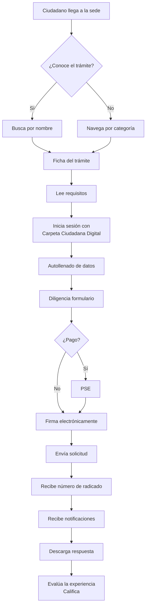

## Referencias

- Sección 1 · Marco normativo (`01-marco-normativo.md`) — arts. 8, 9, 10, 13, 14, 15, 16, 17 del Decreto 2106/2019.
- Sección 2 · Diseño (`02-diseno.md`) — CAG-01…CAG-34, Kit UI 9.2, layout-govco v5.
- Sección 3 · Accesibilidad (`03-accesibilidad.md`) — WCAG 2.1 AA obligatorio, WCAG 2.2 recomendado, Resolución 1519/2020.
- Sección 4 · Seguridad (`04-seguridad.md`) — SEG-001…SEG-018 + 24 criterios complementarios (RN, RT, RH, RA, RC, BAK).
- Sección 5 · Funcionalidad (`05-funcionalidad.md`) — FUN-001…FUN-060 + 14 derivados.
- Repositorio público del Kit UI: https://gitlab.com/govco/layout-govco/-/tree/v5
- Documentación oficial del Portal Único: https://www.gov.co/


---

## Apéndice A — Glosario

| Término | Definición | Fuente |
|---|---|---|
| **Carpeta Ciudadana Digital** | Sistema centralizado de identidad digital del ciudadano colombiano. | art. 9 DL 2106/2019 |
| **BDC v5** | Biblioteca Digital de Componentes de Gov.co, versión 5. | layout-govco v5 |
| **Sede Electrónica** | Sitio oficial de una entidad pública donde el ciudadano realiza trámites y accede a servicios. | art. 14 DL 2106/2019 |
| **WCAG 2.1 AA** | Estándar W3C de accesibilidad, nivel AA, obligatorio para entidades públicas colombianas. | Resolución 1519/2020 |
| **MSPI** | Modelo de Seguridad y Privacidad de la Información de MinTIC. | MinTIC |
| **PSE** | Pagos Seguros en Línea — pasarela de pagos colombiano. | ACH Colombia |
| **CSP** | Content Security Policy — cabecera HTTP de seguridad. | OWASP |
| **HSTS** | HTTP Strict Transport Security. | RFC 6797 |
| **CSIRT** | Computer Security Incident Response Team. | CCERT/ColCERT |
| **WAI-ARIA** | Suite de atributos que mejoran accesibilidad de componentes dinámicos. | W3C/WAI |
| **sr-only** | Clase CSS para contenido sólo visible para lectores de pantalla. | Bootstrap 5 |
| **SRI** | Subresource Integrity — hash criptográfico para validar recursos de CDN. | W3C |
| **MoSCoW** | Técnica de priorización (Must / Should / Could / Won't). | Dai Clegg, 1994 |
| **WCAG 2.2** | Versión 2.2 publicada por W3C (recomendación 5-oct-2023). | W3C |

## Apéndice B — Lista maestra de criterios (resumen)

Las secciones 2 a 5 producen un total de **~210 criterios** trazables. Resumen por dominio:

| Dominio | Código | Total | Fuente |
|---|---|---|---|
| Marco normativo | artículos DL 2106/2019 | 12 | Decreto 2106/2019 |
| Diseño | `CAG-NN` | 57 | Criterios aceptación diseño + Kit UI 9.2 |
| Accesibilidad | `ACC-NN` (WCAG) | 49 [F] + 75 [A] | WCAG 2.1 + Resolución 1519/2020 |
| Seguridad | `SEG-NN` + `RN` + `RT` + `RH` + `RA` + `RC` + `BAK` | 18 + 24 = 42 | PDF criterios + Decreto 2106/2019 + MSPI |
| Funcionalidad | `FUN-NN` | 74 | PDF criterios + PPT Puntos Claves |

Para el detalle de cada criterio, ir a la sección correspondiente y buscar por código.

## Apéndice C — Referencias consolidadas

### C.1 Normativa

- **Decreto Ley 2106 de 2019** — *Por el cual se dictan normas para simplificar, suprimir y reformar trámites, procesos y procedimientos innecesarios existentes en la administración pública.* Diario Oficial No. 51.145 de 12-nov-2019.
- **Ley 1581 de 2012** — *Régimen General de Protección de Datos Personales (Habeas Data).*
- **Decreto 1377 de 2013** — Reglamentación parcial de la Ley 1581/2012.
- **Resolución 1519 de 2020** (MinTIC) — *Estándares y directrices para publicar información en sitios web y aplicaciones móviles de entidades públicas.* (Deroga Resolución 3564 de 2015).
- **Resolución 500 de 2021** (MinTIC) — *Lineamientos para gestión de incidentes de seguridad digital en entidades públicas.*
- **Ley 2052 de 2020** — *Ley anticorrupción y de transparencia.*

### C.2 Documentos fuente (attachments)

| Documento | Tipo | Usado en |
|---|---|---|
| Decreto Ley 2106 de 2019.pdf | PDF normativo | §1 |
| Criterios de aceptación de diseño para tu sede electrónica.pdf | PDF | §2 |
| Criterios de aceptación de accesibilidad para Sedes Electrónicas / Accesibilidad web para Sedes Electrónicas | PPTX (×4) | §3 |
| Criterios de aceptación de seguridad para tu sede electrónica.pdf | PDF (×4) | §4 |
| Criterios de aceptación de funcionalidad para tu sede electrónica.pdf | PDF | §5 |
| Puntos claves de Sedes Electrónicas.pptx | PPTX (×3) | §5 |
| 65142f4c-971a-4e15-bf29-c11ade54ac20-kit-ui-9-2.pdf | PDF (Kit UI) | §2, §6 |

### C.3 Estándares técnicos

- **W3C/WCAG 2.1** — *Web Content Accessibility Guidelines*, recomendación 5-jun-2018. https://www.w3.org/TR/WCAG21/
- **W3C/WCAG 2.2** — *Web Content Accessibility Guidelines*, recomendación 5-oct-2023. https://www.w3.org/TR/WCAG22/
- **OWASP Top 10 2021** — https://owasp.org/Top10/
- **NIST SP 800-61r2** — *Computer Security Incident Handling Guide.*
- **ISO/IEC 27001:2022** — Sistema de gestión de seguridad de la información.
- **RFC 6797** — HTTP Strict Transport Security (HSTS).
- **RFC 7034** — X-Frame-Options.

### C.4 Repositorios y CDNs oficiales

- **Repositorio Kit UI:** https://gitlab.com/govco/layout-govco/-/tree/v5
- **CDN Kit UI v5:** https://cdn.www.gov.co/layout/v5/all.css y https://cdn.www.gov.co/layout/v5/script.js
- **Portal Único del Estado Colombiano:** https://www.gov.co/

---

*Documento generado el 2026-09-27.*
