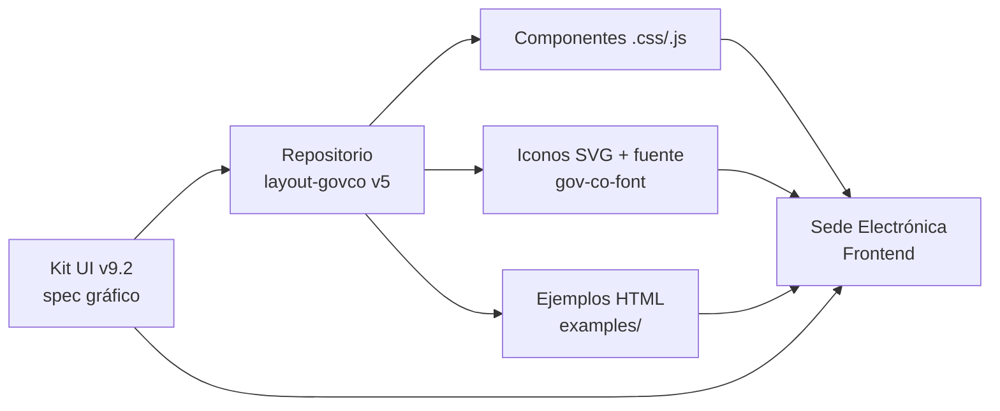
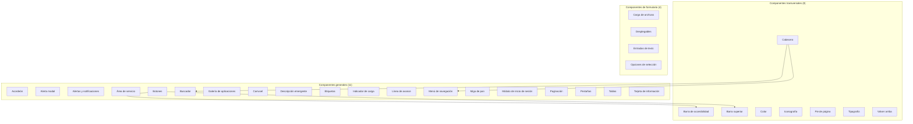
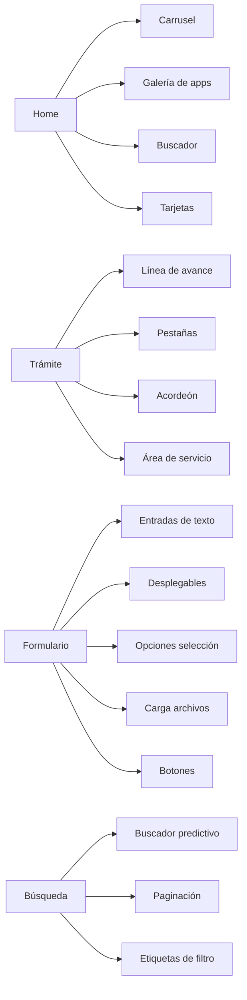

# 2. Diseño de la Sede Electrónica

> **Audiencia:** Diseñador UI/UX + Frontend Lead.
> **Propósito:** Establecer los criterios gráficos, el sistema de componentes y los requisitos de aceptación visual que regirán el maquetado de la Sede Electrónica, alineados al **Kit UI 9.2** (MinTIC · AND, agosto 2025) y al repositorio de código **`layout-govco` rama `v5`** (Biblioteca Digital de Componentes v5).
> **Fuentes primarias:**
> - `attachments/2d669a7f2d225e7d/Criterios de aceptación de diseño para tu sede electrónica.pdf` (infografía Pictoline — MinTIC · AND, 2022).
> - `attachments/293453edc7e28a0d/Criterios de aceptación de diseño para tu sede electrónica.pdf` (duplicado verificado por hash MD5 `1fa2bd2b…`).
> - `attachments/3f47348b6a2cb4e4/65142f4c-971a-4e15-bf29-c11ade54ac20-kit-ui-9-2.pdf` (Kit UI v9.2 — 37 páginas).
> - Repositorio GitLab: <https://gitlab.com/govco/layout-govco/-/tree/v5> (rama `v5`, alias **Layout gov.co 5.0**).

---

## 2.1 Principios de diseño

La Sede Electrónica adopta los principios gráficos y operativos del **Portal Único del Estado Colombiano (gov.co)** tal como los define el Kit UI v9.2 (págs. 1–3) y los formaliza el repositorio `layout-govco v5` (`README.md`):

| # | Principio | Definición operativa | Fuente |
|---|---|---|---|
| PD-01 | **Estandarización transversal** | Lograr una visual y un tono unificado para todas las entidades del Estado colombiano mediante la adopción obligatoria de los lineamientos del Kit UI. | Kit UI v9.2 pág. 2 |
| PD-02 | **Diseño atómico** | El sistema se basa en componentes atómicos (íconos) y moleculares (íconos + estilos) con estados definidos. | Kit UI v9.2 pág. 3 |
| PD-03 | **Biblioteca digital gov.co** | Todo componente se obtiene del repositorio `layout-govco v5`; los cambios en el componente maestro se propagan a todas las instancias. | Kit UI v9.2 pág. 3; `README.md` v5 |
| PD-04 | **Basado en Bootstrap 5.0.2** | El maquetado se construye sobre la librería Bootstrap 5.0.2; los estilos gov.co extienden sus clases y rejilla. | `README.md` v5 |
| PD-05 | **Accesibilidad por construcción (Resolución 1519/2020 + WCAG 2.1)** | Cada componente desacoplado cumple los criterios de accesibilidad actuales y se documenta con su matriz de estados Accesibilidad + Buenas prácticas. | Kit UI v9.2 pág. 2 (sección “Accesibilidad” en cada componente) |
| PD-06 | **Responsive-first** | Todos los componentes deben funcionar correctamente en sus versiones desktop y responsive; los breakpoints siguen la rejilla Bootstrap 5.0.2. | Kit UI v9.2 pág. 14 (Cuadrícula); transversal en cada componente |
| PD-07 | **Tres dominios tipográficos y de color** | Solo dos familias tipográficas (Nunito Sans + Verdana) y una paleta cerrada con CSS variables (`--govcolor-*`). | Kit UI v9.2 págs. 8 (Color) y 12 (Tipografía); `src/all.css` v5 |
| PD-08 | **GOV.CO como punto único** | La cabecera y el pie de página enlazan siempre al portal gov.co y muestran la marca país Colombia-CO. | Kit UI v9.2 págs. 7 (Barra superior) y 11 (Pie de página) |



---

## 2.2 Identidad visual

### 2.2.1 Paleta de colores

La paleta proviene de dos fuentes canónicas que deben estar sincronizadas en el build:

1. **Kit UI v9.2 — pág. 8** (sección *Color / Paleta de colores de GOV.CO*).
2. **`src/all.css` v5 líneas 203-223** (variables CSS oficiales).

| Token CSS v5 | Hex | Nombre comercial | Uso Kit UI v9.2 | Sección PDF |
|---|---|---|---|---|
| `--govcolor-cobalt` | `#0943B5` | **Cobalt** | Color principal gov.co, barra superior, fondo del menú, CTAs. | pág. 8 (Principales) |
| `--govcolor-black` | `#000000` | Black | Texto sobre fondos claros, alto contraste. | pág. 8 |
| `--govcolor-matterhorn` | `#4C4C4C` | Matterhorn | Texto secundario, color sustituto de los ministerios cuando el color asignado no cumple WCAG. | pág. 8 (Complementarios) |
| `--govcolor-grey` | `#7E7E7E` | Grey | Estados deshabilitados, texto auxiliar. | pág. 8 |
| `--govcolor-white` | `#FFFFFF` | White | Fondo base de la página. | pág. 8 |
| `--govcolor-havelock-lue` | `#4672C8` | Havelock Blue | Enlace hover, foco visible secundario. | pág. 8 |
| `--govcolor-tropical-blue` | `#B5C7E9` | Tropical Blue | Fondo de zonas informativas, hover claro. | pág. 8 |
| `--govcolor-golden-brown` | `#9D7700` | Golden Brown | Advertencia — pendientes, foco de atención. | pág. 8 (Tranquilo / Pendiente) |
| `--govcolor-sunglow` | `#FECC2F` | Sunglow | Acento amarillo, foco principal en inputs. | pág. 8 (Libre / Avanzar) |
| `--govcolor-vis-vis` | `#FEE697` | Vis Vis | Fondo de alertas suaves, amarillo claro. | pág. 8 |
| `--govcolor-silver` | `#B9B9B9` | Silver | Bordes, divisores. | pág. 8 |
| `--govcolor-silver-dis` | `#C8C8C8` | Silver-disabled | Estado disabled de inputs. | pág. 8 (Campos deshabilitados) |
| `--govcolor-solitude` | `#E5ECF8` | Solitude | Fondo del menú de navegación y secciones suaves. | pág. 8 (Fondos) |
| `--govcolor-corn-silk` | `#FFFAE8` | Corn Silk | Fondo de advertencia suave. | pág. 8 |
| `--govcolor-white-smoke` | `#F4F4F4` | White Smoke | Fondo neutro, secciones alternas. | pág. 8 (Fondos) |
| `--govcolor-portage` | `#83A0DA` | Portage | Acento azul claro, gráficos. | pág. 8 |
| `--govcolor-red` | `#A80521` | Red | Universal informativo — error, peligro. | pág. 8 (Universales informativos) |
| `--govcolor-orange` | `#F0572D` | Orange | Universal informativo — atención, prevención. | pág. 8 |
| `--govcolor-yellow` | `#FDAA29` | Yellow | Universal informativo — advertencia. | pág. 8 |
| `--govcolor-green` | `#158361` | Green | Universal informativo — confirmación, éxito. | pág. 8 |
| `--govcolor-tulip` | `#E8A045` | Tulip | Color característico del Ministerio TIC; ejemplo del pie de página. | pág. 11 (Buenas prácticas del footer) |

**Reglas duras (Kit UI v9.2 pág. 8 — sección *Buenas prácticas*):**

- RF-PAL-01 — Texto oscuro sobre fondo claro (y viceversa). Prohibido combinar colores similares con poca diferencia de luminosidad.
- RF-PAL-02 — Contraste mínimo **4.5:1** para texto normal / enlaces / texto de botones (WCAG 2.1 AA).
- RF-PAL-03 — Contraste mínimo **3:1** para títulos o texto grande.
- RF-PAL-04 — Las combinaciones de color deben respetar las convenciones internacionales del semáforo (verde = éxito, amarillo = advertencia, rojo = error).
- RF-PAL-05 — Cada Ministerio usa el color asignado por el Manual de imagen de Gobierno; si el color no cumple el ratio mínimo de contraste WCAG 2.1, se sustituye por **`#4C4C4C` (Matterhorn)**.

### 2.2.2 Tipografía

Fuentes cargadas desde `src/assets/fonts/` y declaradas en `src/all.css` (líneas 1-65):

| Familia | Variantes en repo v5 | Variable CSS | Uso Kit UI v9.2 |
|---|---|---|---|
| **Nunito Sans** | Regular, Bold, SemiBold, ExtraBold, Medium, Italic, SemiBoldItalic | `Nunito_Sans-Regular` … `NunitoSans-ExtraBold` | **Títulos** (h1-h6) y descripciones de sección. |
| **Verdana** | Regular, Bold, Italic, BoldItalic | `Verdana-Regular` … `Verdana-BoldItalic` | **Párrafos, leyendas, pies de foto, textos largos.** |

> El Kit UI v9.2 pág. 12 recomienda explícitamente: *“Usa solo 2 tipos de letra para unificar tu página a GOV.CO”*.

#### 2.2.2.1 Jerarquía tipográfica desktop

Confirmada contra `src/all.css` (líneas 73-116) y Kit UI v9.2 pág. 12:

| Elemento | Familia | Variable | Tamaño | Interlineado |
|---|---|---|---|---|
| h1 | Nunito Sans | Bold | **42 px** | 50 px |
| h2 | Nunito Sans | Bold | **34 px** | 42 px |
| h3 | Nunito Sans | Bold | **26 px** | 32 px |
| h4 | Nunito Sans | Bold | **22 px** | 26 px |
| h5 | Nunito Sans | Bold | **20 px** | 24 px |
| h6 | Nunito Sans | Bold | **16 px** | 22 px |
| Description (text1-govco) | Nunito Sans | SemiBold | **20 px** | 22 px |
| Body text 1 (text2-govco) | Verdana | Regular | **15 px** | 22 px |
| Body text 2 | Verdana | Regular | **14 px** | 20 px |
| Caption (text3-govco) | Verdana | Regular | **12 px** | 20 px |

#### 2.2.2.2 Reglas tipográficas

- RF-TIP-01 — Líneas de texto entre **45 y 75 caracteres**; párrafos breves.
- RF-TIP-02 — **Nunca justificar** el texto (Kit UI v9.2 pág. 12).
- RF-TIP-03 — Lenguaje común, evitar tecnicismos.
- RF-TIP-04 — Usar unidades relativas (`%`, `em`, `rem`) en lugar de píxeles fijos (responsive).
- RF-TIP-05 — Máximo contraste entre texto y fondo.

### 2.2.3 Espaciado y rejilla

| Concepto | Valor | Fuente |
|---|---|---|
| **Base de la rejilla** | Bootstrap 5.0.2 — 12 columnas | `README.md` v5 |
| **Breakpoints** | `xs <576` · `sm ≥576` · `md ≥768` · `lg ≥992` · `xl ≥1200` · `xxl ≥1400` | Kit UI v9.2 pág. 14 (Cuadrícula) |
| **Gutter por defecto** | **24 px** entre columnas (vertical y horizontal) | Kit UI v9.2 pág. 14 |
| **Diagramaciones canónicas** | 6-6, 8-4, 4-4-4, 3-3-3-3 | Kit UI v9.2 pág. 14 |
| **Unidad base de píxeles** | múltiplos de **8 px** (pixel-perfect del Top bar) | Kit UI v9.2 pág. 7 (Barra superior) |
| **Unidad base de íconos** | múltiplos de **4 px** | Kit UI v9.2 pág. 10 (Iconografía) |
| **Padding lateral alerta** | **40 px** | Kit UI v9.2 pág. 17 (Alertas y notificaciones) |
| **Ancho alerta desktop** | 70 % del navegador | Kit UI v9.2 pág. 17 |
| **Ancho alerta responsive** | 100 % | Kit UI v9.2 pág. 17 |
| **Área activa táctil mínima** | **44 × 44 px** | Kit UI v9.2 pág. 7 (Barra superior — logo) y pág. 30 (Paginación móvil) |

### 2.2.4 Iconografía

- **Cantidad:** ~499 archivos SVG en `src/assets/icons/` (verificado vía GitLab API con paginación; primera página = 99, total combinado **499 íconos** únicos).
- **Fuente iconográfica:** `src/assets/icons/fonts/gov-co-font.{eot,svg,ttf,woff,woff2}` (cinco formatos, mismo glifo).
- **Atribución:** Paquete derivado de **Font Awesome 5 Free** + íconos propios de Gov.co. La librería CSS los invoca con la clase `govco-icon govco-<nombre>` mapeada al archivo `assets/icons/<nombre>.svg` (verificado en `src/all.css` líneas 2373-2378 para `info-circle` e `info`).
- **Reglas Kit UI v9.2 pág. 10 (Buenas prácticas):**
  - RF-ICO-01 — Ancho de trazo y elementos internos consistentes; tamaño sugerido en múltiplos de 4 px.
  - RF-ICO-02 — Íconos **escalables y responsive**.
  - RF-ICO-03 — Contraste adecuado con el entorno (WCAG 2.1).
  - RF-ICO-04 — Estandarización y consistencia en todo el sitio.
  - RF-ICO-05 — Íconos interactivos deben ser accesibles por teclado.

### 2.2.5 Logos y marca país

- **Logo GOV.CO** en barra superior: 24 × 136 px, color azul Cobalt `#0943B5`, redirecciona a `https://www.gov.co/home/` (Kit UI v9.2 pág. 7).
- **Botón cambio de idioma**: 24 × 24 px, alineado a la derecha de la barra superior (Kit UI v9.2 pág. 7).
- **Pie de página**: logos de la autoridad + GOV.CO + marca país Colombia-CO (alineados a la izquierda) + logo "Colombia, potencia de la vida" cuando aplique (Kit UI v9.2 pág. 11).
- **Imágenes disponibles en repo**: `src/assets/images/{logo.svg, logo-colombia.svg, co-colombia.png, Colombia-Potencia.png, Logo-v1-MinTIC.png, Logo-v2-MinTIC.png}`.

---

## 2.3 Sistema de componentes del Kit UI 9.2

Todos los componentes se sirven desde el CDN oficial **v5**:

```html
<link href="https://cdn.www.gov.co/layout/v5/all.css" rel="stylesheet">
<script src="https://cdn.www.gov.co/layout/v5/script.js"></script>
```

> Fuente: Biblioteca Digital de Componentes v5 — `https://cdn.www.gov.co/v5/` (página de instalación).

El Kit UI v9.2 organiza **24 componentes** en **3 grupos** (pág. 5 — *Lista de contenido*). Cada uno se mapea a su ruta verificable en `layout-govco v5` (`src/<grupo>/<componente>.{css,js}` y `examples/<grupo>/<componente>.html`).

### 2.3.1 Componentes transversales (8)

| # | Componente | Ruta CSS/JS en v5 | Ejemplo HTML | Cuándo usarlo (Kit UI v9.2) | PDF |
|---|---|---|---|---|---|
| 1 | **Barra de accesibilidad** | [`src/transversal/barra-accesibilidad.{css,js}`](https://gitlab.com/govco/layout-govco/-/tree/v5/src/transversal) | [`examples/transversal/barra-accesibilidad.html`](https://gitlab.com/govco/layout-govco/-/blob/v5/examples/transversal/barra-accesibilidad.html) | Obligatoria en todas las páginas; oculta entre 768-992 px. Ofrece *Aumentar letra · Reducir letra · Contraste*. | pág. 6 |
| 2 | **Barra superior (Top bar)** | [`src/transversal/barra-superior.{css,js}`](https://gitlab.com/govco/layout-govco/-/tree/v5/src/transversal) | [`examples/transversal/barra-superior.html`](https://gitlab.com/govco/layout-govco/-/blob/v5/examples/transversal/barra-superior.html) | Siempre en la parte superior, contiene logo GOV.CO + (opcional) botón de cambio de idioma. | pág. 7 |
| 3 | **Color** | [`src/transversal/color.css`](https://gitlab.com/govco/layout-govco/-/tree/v5/src/transversal) | [`examples/transversal/color.html`](https://gitlab.com/govco/layout-govco/-/blob/v5/examples/transversal/color.html) | Documento de la paleta + variables CSS `--govcolor-*` (ver §2.2.1). | pág. 8 |
| 4 | **Cabecera (Header)** | [`src/transversal/cabecera.{css,js}`](https://gitlab.com/govco/layout-govco/-/tree/v5/src/transversal) | [`examples/transversal/cabecera.html`](https://gitlab.com/govco/layout-govco/-/blob/v5/examples/transversal/cabecera.html) | Top bar + logo de la autoridad + buscador + menú de navegación. Implementar *Saltar al contenido principal* con clase `sr-only sr-only-focusable`. | pág. 9 |
| 5 | **Iconografía** | [`src/transversal/iconografia.css`](https://gitlab.com/govco/layout-govco/-/tree/v5/src/transversal) · `src/assets/icons/*.svg` (499 archivos) | [`examples/transversal/iconografia.html`](https://gitlab.com/govco/layout-govco/-/blob/v5/examples/transversal/iconografia.html) | Catálogo de íconos SVG + fuente iconográfica `gov-co-font`. | pág. 10 |
| 6 | **Pie de página (Footer)** | [`src/transversal/pie-de-pagina.css`](https://gitlab.com/govco/layout-govco/-/tree/v5/src/transversal) | [`examples/transversal/pie-de-pagina.html`](https://gitlab.com/govco/layout-govco/-/blob/v5/examples/transversal/pie-de-pagina.html) | Versión A: 1-3 sedes · Versión B: más de 3 sedes. Subir contraste mínimo 4.5:1. | pág. 11 |
| 7 | **Tipografía** | [`src/transversal/tipografia.css`](https://gitlab.com/govco/layout-govco/-/tree/v5/src/transversal) | [`examples/transversal/tipografia.html`](https://gitlab.com/govco/layout-govco/-/blob/v5/examples/transversal/tipografia.html) | Nunito Sans (títulos) + Verdana (cuerpo). | pág. 12 |
| 8 | **Volver arriba** | [`src/transversal/volver-arriba.{css,js}`](https://gitlab.com/govco/layout-govco/-/tree/v5/src/transversal) | [`examples/transversal/volver-arriba.html`](https://gitlab.com/govco/layout-govco/-/blob/v5/examples/transversal/volver-arriba.html) | Botón flotante fijo en la esquina inferior derecha de páginas con scroll largo. | pág. 13 |

### 2.3.2 Componentes generales (11)

| # | Componente | Ruta CSS/JS en v5 | Ejemplo HTML | Cuándo usarlo (Kit UI v9.2) | PDF |
|---|---|---|---|---|---|
| 9 | **Acordeón** | [`src/general/acordeon.css`](https://gitlab.com/govco/layout-govco/-/tree/v5/src/general) | [`examples/general/acordeon.html`](https://gitlab.com/govco/layout-govco/-/blob/v5/examples/general/acordeon.html) | Desplegar/ocultar contenido con encabezado. Dos variantes: básico y con ícono/número. Atributo `aria-expanded` obligatorio. | pág. 15 |
| 10 | **Alerta modal** | [`src/general/alerta-modal.{css,js}`](https://gitlab.com/govco/layout-govco/-/tree/v5/src/general) | [`examples/general/alerta-modal.html`](https://gitlab.com/govco/layout-govco/-/blob/v5/examples/general/alerta-modal.html) | Diálogo emergente. Variantes: básica, advertencia, error, éxito, confirmación. Cerrar con `Esc` o clic fuera. | pág. 16 |
| 11 | **Alertas y notificaciones** | [`src/general/alerta-notificacion.{css,js}`](https://gitlab.com/govco/layout-govco/-/tree/v5/src/general) | [`examples/general/alerta-notificacion.html`](https://gitlab.com/govco/layout-govco/-/blob/v5/examples/general/alerta-notificacion.html) | Notificaciones tipo **toast** (parte superior de pantalla) y emergentes. 3 variantes: informativa, positiva (verde), negativa (rojo). | pág. 17 |
| 12 | **Área de servicio** | — (CSS sólo en transversal; sin archivo propio en `src/general/`) | — | Módulos de *¿Cómo fue tu experiencia?* y *¿Tienes dudas sobre este trámite?*. Solo en Trámites y servicios. | pág. 18 |
| 13 | **Botones** | [`src/assets/transversal/buttons/*.svg`](https://gitlab.com/govco/layout-govco/-/tree/v5/src/assets/transversal/buttons) | [`examples/general/botones.html`](https://gitlab.com/govco/layout-govco/-/blob/v5/examples/general/botones.html) | 5 tipos: **texto, contorno, contenido, simbólico, mixto**. 4 estados: Default · Hover · Focus · Disabled. 4 énfasis. | pág. 19 |
| 14 | **Buscador** | [`src/general/buscador.{css,js}`](https://gitlab.com/govco/layout-govco/-/tree/v5/src/general) | [`examples/general/buscador.html`](https://gitlab.com/govco/layout-govco/-/blob/v5/examples/general/buscador.html) | Básico y predictivo (con autocompletar e historial). Visible en top bar, cabecera, trámite o tabla. | pág. 20 |
| 15 | **Galería de aplicaciones** | [`src/general/galeria-de-aplicaciones.{css,js}`](https://gitlab.com/govco/layout-govco/-/tree/v5/src/general) | [`examples/general/galeria-de-aplicaciones.html`](https://gitlab.com/govco/layout-govco/-/blob/v5/examples/general/galeria-de-aplicaciones.html) | Menú superior (esquina) con apps del portal GOV.CO. Hasta 3 columnas verticales. | pág. 21 |
| 16 | **Carrusel** | [`src/general/carrusel.{css,js}`](https://gitlab.com/govco/layout-govco/-/tree/v5/src/general) | [`examples/general/carrusel.html`](https://gitlab.com/govco/layout-govco/-/blob/v5/examples/general/carrusel.html) | Conjunto de imágenes/texto en home o secciones principales. Obligatorio: indicadores de posición, controles reproducir/pausar y flechas. | pág. 22 |
| 17 | **Descripción emergente (Tooltip)** | — (estilos en `src/all.css` general) | — | Mensaje corto al pasar el cursor sobre un elemento interactivo. Atributo `role="tooltip"`. | pág. 23 |
| 18 | **Etiquetas** | — (estilos en `src/all.css`) | — | 4 tipos: informativa, de estado (verde/amarillo/rojo), de filtro, indicador de filtro. | pág. 24 |
| 19 | **Indicador de carga (Spinner)** | — | — | “spinner” Bootstrap con tamaño definido. Modal con fondo negro 20 % opacidad o fondo blanco. | pág. 25 |
| 20 | **Línea de avance (Stepper)** | — | — | 2 variantes: **posición** (sólo informativa) e **interacción** (ir atrás/adelante). Vertical u horizontal. | pág. 26 |
| 21 | **Menú de navegación** | [`src/general/menu-de-navegacion.{css,js}`](https://gitlab.com/govco/layout-govco/-/tree/v5/src/general) | [`examples/general/menu-de-navegacion.html`](https://gitlab.com/govco/layout-govco/-/blob/v5/examples/general/menu-de-navegacion.html) | Hasta **7 ítems principales**, hasta **4 secciones internas** con subsecciones (mega menú). `aria-label` obligatorio. | pág. 27 |
| 22 | **Miga de pan** | [`src/general/miga-de-pan.css`](https://gitlab.com/govco/layout-govco/-/tree/v5/src/general) | [`examples/general/miga-de-pan.html`](https://gitlab.com/govco/layout-govco/-/blob/v5/examples/general/miga-de-pan.html) | Bajo el header, en todas las secciones excepto el Home. Versión *contenido* (fondo claro) e *invertida* (fondo oscuro). | pág. 28 |
| 23 | **Módulo de inicio de sesión** | — (estilos en `src/all.css`; `src/form/` cubre los inputs) | — | Sub-variantes: Persona natural · Persona jurídica. Botones *Registrar nuevo usuario*, *Olvidé mi contraseña*, *Iniciar sesión*. | pág. 29 |
| 24 | **Paginación** | — | — | Numeración + *Anterior / Siguiente*. Tamaño mínimo 44 × 44 px en móvil. | pág. 30 |
| 25 | **Pestañas** | — | — | Horizontal (máx. 23 caracteres) o vertical (máx. 30 caracteres). No anidar desplegables. | pág. 31 |
| 26 | **Tablas** | [`src/general/tablas.{css,js}`](https://gitlab.com/govco/layout-govco/-/tree/v5/src/general) | [`examples/general/tablas.html`](https://gitlab.com/govco/layout-govco/-/blob/v5/examples/general/tablas.html) | Datos tabulares. Variantes: básica, fila acentuada, aplicaciones, diseño adaptativo/responsivo, anidamiento. | pág. 32 |
| 27 | **Tarjeta de información** | [`src/general/tarjetas-de-informacion.css`](https://gitlab.com/govco/layout-govco/-/tree/v5/src/general) | [`examples/general/tarjetas-de-informacion.html`](https://gitlab.com/govco/layout-govco/-/blob/v5/examples/general/tarjetas-de-informacion.html) | 3 tipos: **imagen+texto**, **ícono/ilustración+texto** (horizontal/vertical), **tipo módulo**. Enmarcar siempre con `<a>` o `<button>`. | pág. 33 |

### 2.3.3 Componentes de formulario (4)

| # | Componente | Ruta CSS/JS en v5 | Ejemplo HTML | Cuándo usarlo (Kit UI v9.2) | PDF |
|---|---|---|---|---|---|
| 28 | **Carga de archivos** | [`src/form/carga-archivos.{css,js}`](https://gitlab.com/govco/layout-govco/-/tree/v5/src/form) | [`examples/form/Carga-de-archivo.html`](https://gitlab.com/govco/layout-govco/-/blob/v5/examples/form/Carga-de-archivo.html) | Subir archivos. Peso máximo mostrado en texto auxiliar. Tipos admitidos declarados. | pág. 34 |
| 29 | **Desplegables (Select)** | [`src/form/desplegable.{css,js}`](https://gitlab.com/govco/layout-govco/-/tree/v5/src/form) | [`examples/form/desplegable.html`](https://gitlab.com/govco/layout-govco/-/blob/v5/examples/form/desplegable.html) | 4 tipos: **lista, con filtro de búsqueda, con casillas de verificación, calendario**. Lista: máx. 5 elementos visibles. | pág. 35 |
| 30 | **Entradas de texto** | [`src/form/entradas-texto.css` · `entradas-de-texto.js`](https://gitlab.com/govco/layout-govco/-/tree/v5/src/form) | [`examples/form/entradas-de-texto.html`](https://gitlab.com/govco/layout-govco/-/blob/v5/examples/form/entradas-de-texto.html) | 6 variantes: **básico, con contador, con nota, contraseña, correo, teléfono**. Asterisco `*` para obligatorio. | pág. 36 |
| 31 | **Opciones de selección** | [`src/form/opcion-de-seleccion.css`](https://gitlab.com/govco/layout-govco/-/tree/v5/src/form) | [`examples/form/opcion-de-seleccion.html`](https://gitlab.com/govco/layout-govco/-/blob/v5/examples/form/opcion-de-seleccion.html) | 3 controles: **casillas de verificación (checkbox)**, **interruptores (switch)**, **radio buttons**. Alineación vertical/horizontal. | pág. 37 |

> **Nota metodológica:** Los componentes 12 (Área de servicio), 17 (Descripción emergente), 18 (Etiquetas), 19 (Indicador de carga), 20 (Línea de avance), 23 (Módulo de inicio de sesión) y 24 (Paginación) figuran en el Kit UI v9.2 pero **no tienen carpeta propia en `src/`**. Sus estilos viven en `src/all.css` (CSS consolidado de 12 286 líneas) y/o se apoyan en clases Bootstrap 5.0.2. Esto es consistente con la práctica de *consolidar* los transversales/generales pequeños en el bundle final.

### 2.3.4 Diagrama de integración



---

## 2.4 Criterios de aceptación de diseño

> **Severidad:** 🔴 **Bloqueante** · 🟠 **Mayor** · 🟡 **Menor**

| ID | Criterio | Severidad | Evidencia / Fuente |
|---|---|---|---|
| **CAG-01** | Los elementos controladores del **carrusel** NO deben solaparse ni confundirse con las imágenes o fondos. Si ocurre, añadir fondo a los controles de navegación o ubicarlos fuera del carrusel. | 🔴 | Infografía Pictoline — `attachments/2d669a7f2d225e7d/Criterios de aceptación de diseño para tu sede electrónica.pdf` (única página, punto 1 y 2). |
| **CAG-02** | Carrusel: implementar indicadores de posición, flechas de navegación **y** controles de reproducción/pausa (todos obligatorios). | 🔴 | Kit UI v9.2 pág. 22 (Buenas prácticas del Carrusel). |
| **CAG-03** | Carrusel: ratio mínimo de contraste **4.5:1** entre contenido y controles. | 🔴 | Kit UI v9.2 pág. 22 (Accesibilidad del Carrusel). |
| **CAG-04** | Carrusel: las imágenes deben llevar `alt`, `aria-label` o `aria-labelledby`. | 🟠 | Kit UI v9.2 pág. 22. |
| **CAG-05** | Barra superior: logo GOV.CO 24 × 136 px, color `#0943B5` y enlaza a `https://www.gov.co/home/`. | 🔴 | Kit UI v9.2 pág. 7. |
| **CAG-06** | Botón de cambio de idioma: 24 × 24 px, alineado a la derecha, `aria-label` corto y descriptivo, idioma persistente. | 🟠 | Kit UI v9.2 pág. 7. |
| **CAG-07** | Barra de accesibilidad: incluir Aumentar letra · Reducir letra · Contraste; oculta entre 768-992 px. | 🔴 | Kit UI v9.2 pág. 6. |
| **CAG-08** | Cabecera: incluir enlace/en botón **“Saltar al contenido principal”** (clase `sr-only sr-only-focusable`, destino `#contenido-principal`). Obligatorio en Sedes electrónicas y Trámites y servicios. | 🔴 | Kit UI v9.2 pág. 9. |
| **CAG-09** | Menú de navegación: **máximo 7 ítems principales** y **máximo 4 secciones internas** (mega menú) por ítem principal. | 🔴 | Kit UI v9.2 pág. 27. |
| **CAG-10** | Menú de navegación: `aria-label` en el menú principal; navegación completa por teclado; contraste de foco ≥ 4.5:1. | 🔴 | Kit UI v9.2 pág. 27. |
| **CAG-11** | Miga de pan: presente en todas las secciones excepto Home. Versión *invertida* sólo sobre fondo oscuro. | 🔴 | Kit UI v9.2 pág. 28. |
| **CAG-12** | Pie de página: contraste mínimo 4.5:1. Incluir logo autoridad + GOV.CO + Colombia-CO (+ “Colombia, potencia de la vida” cuando aplique). | 🔴 | Kit UI v9.2 pág. 11. |
| **CAG-13** | Botones: usar `<button type="button">` con `aria-label` si sólo llevan ícono. Distinguir estados `:hover` y `:focus`. | 🔴 | Kit UI v9.2 pág. 19. |
| **CAG-14** | Botones deshabilitados: atributo `disabled`, fuera del orden de tabulación. | 🟠 | Kit UI v9.2 pág. 19. |
| **CAG-15** | Buscador: placeholder claro (ej. “Buscar aquí…”); permitir borrar el contenido; navegable por teclado. | 🟠 | Kit UI v9.2 pág. 20. |
| **CAG-16** | Campos de formulario: asterisco `*` para obligatorios + leyenda inicial. Etiquetas con `<label>` y `for=`. | 🟠 | Kit UI v9.2 págs. 29, 36 y 37. |
| **CAG-17** | Entradas de texto: borde con ratio mínimo de contraste; estados Default/Active/Focus/Disabled/Valid/Invalid; usar `autocomplete` cuando aplique. | 🟠 | Kit UI v9.2 pág. 36. |
| **CAG-18** | Desplegable-lista: máximo **5 elementos visibles** antes de scroll. | 🟡 | Kit UI v9.2 pág. 35. |
| **CAG-19** | Calendario: estilo debe ser similar al propuesto en la sección Desplegables. | 🟡 | Kit UI v9.2 pág. 35. |
| **CAG-20** | Línea de avance: contraste de foco ≥ 4.5:1; permitir saltar pasos libremente o bloquearlos según obligatoriedad. | 🟠 | Kit UI v9.2 pág. 26. |
| **CAG-21** | Alerta modal: cerrable con tecla **Esc** y clic fuera; no anidar modales; máximo 1 modal simultáneo. | 🔴 | Kit UI v9.2 pág. 16. |
| **CAG-22** | Notificaciones toast: duración suficiente para lectura + cierre automático programado por la entidad. | 🟠 | Kit UI v9.2 pág. 17. |
| **CAG-23** | Paginación: tamaño mínimo 44 × 44 px en móvil; `aria-current` en la página activa. | 🟠 | Kit UI v9.2 pág. 30. |
| **CAG-24** | Tablas: números alineados a la derecha; evitar scroll horizontal en responsive (usar adaptativo o responsive). | 🟡 | Kit UI v9.2 pág. 32. |
| **CAG-25** | Acordeón: `aria-expanded` obligatorio; **no abrir automáticamente** con foco; jerarquía de encabezados. | 🔴 | Kit UI v9.2 pág. 15. |
| **CAG-26** | Tarjeta de información: encerrada en `<a>` o `<button>`; 2 palabras máx. en el título (CTA). | 🟠 | Kit UI v9.2 pág. 33. |
| **CAG-27** | Tipografía: nunca justificar texto; 45-75 caracteres por línea; unidades relativas. | 🟡 | Kit UI v9.2 pág. 12. |
| **CAG-28** | Color: contraste 4.5:1 (texto normal) y 3:1 (texto grande). | 🔴 | Kit UI v9.2 pág. 8. |
| **CAG-29** | Indicador de carga: si > 10 s, informar al usuario del progreso. | 🟠 | Kit UI v9.2 pág. 25. |
| **CAG-30** | Volver arriba: ubicado en esquina inferior derecha, foco visible al recibir tabulación. | 🟡 | Kit UI v9.2 pág. 13. |
| **CAG-31** | Galería de aplicaciones: recorrido por teclado izquierda→derecha, arriba→abajo; abre con `Enter` y cierra con `Esc`. | 🟠 | Kit UI v9.2 pág. 21. |
| **CAG-32** | Todos los componentes: cumplir **Resolución 1519 de 2020** y **WCAG 2.1 AA**. | 🔴 | Kit UI v9.2 pág. 2 (sección Accesibilidad replicada en cada componente). |
| **CAG-33** | El código debe construirse sobre **Bootstrap 5.0.2** y los CSS variables `--govcolor-*` declarados en `src/all.css`. | 🔴 | `README.md` v5 + `src/all.css` (líneas 203-223). |
| **CAG-34** | El frontend debe servirse desde el CDN oficial **v5** (`https://cdn.www.gov.co/layout/v5/all.css` + `script.js`) o construir con la copia local del repo. | 🟠 | `cdn.www.gov.co/v5/` (página de instalación). |

> **Sobre la fuente “Criterios de aceptación de diseño para tu sede electrónica.pdf”**: el documento es una **infografía de 1 página** (formato 1200×1760 pt, fecha de creación 1-dic-2022, productor Adobe PDF library 16.07) centrada exclusivamente en el criterio **CAG-01** del carrusel. El segundo PDF (`293453edc7e28a0d/`) es un duplicado binario verificado por hash MD5 (`1fa2bd2b2865de47b56f1f414cdca270`). El grueso de los criterios de aceptación proviene, por tanto, del **Kit UI v9.2** y de la práctica descrita en el repositorio `layout-govco v5`.

---

## 2.5 Mapa página → componente del Kit UI

Mapa de las páginas típicas de una Sede Electrónica y los componentes del Kit UI v9.2 que deben instanciarse en cada una. Las filas marcadas **(REQ)** son obligatorias según el tipo de sede (Kit UI v9.2 pág. 5, *Requerido, mínimamente, en:*).

| Página / Sección | Componentes a usar | Notas |
|---|---|---|
| **Layout global (todas las páginas)** | Barra de accesibilidad · Barra superior · Cabecera · Menú de navegación · Miga de pan · Pie de página · Volver arriba | (REQ) Sedes electrónicas, Trámites y servicios, Ventanillas únicas y Portales transversales. |
| **Home / Inicio** | Carrusel · Tarjeta de información · Buscador · Galería de aplicaciones · Botones · Etiquetas | Usar **carrusel sin texto** o **carrusel múltiple** según el caso (Kit UI v9.2 pág. 22). |
| **Trámites y servicios (listado)** | Tablas · Paginación · Buscador predictivo · Tarjeta de información (tipo módulo) · Etiquetas de filtro · Acordeón | Tabla con filas acentuadas y ordenamiento ascendente/descendente (Kit UI v9.2 pág. 32). |
| **Detalle de trámite** | Línea de avance (stepper) · Pestañas · Área de servicio · Acordeón · Botones · Alertas y notificaciones | Stepper en variantes **horizontal** y **vertical** (Kit UI v9.2 pág. 26). |
| **Formularios (login, registro, solicitud)** | Módulo de inicio de sesión · Entradas de texto · Desplegables · Opciones de selección · Carga de archivos · Botones · Alertas y notificaciones | Variante persona natural/jurídica (Kit UI v9.2 pág. 29). |
| **Búsqueda y resultados** | Buscador (predictivo) · Paginación · Etiquetas de filtro · Tablas | Historial y autocompletar (Kit UI v9.2 pág. 20). |
| **Atención al ciudadano** | Área de servicio · Acordeón · Tarjeta de información · Buscador · Botones | Módulos *¿Cómo fue tu experiencia?* + *¿Tienes dudas?* (Kit UI v9.2 pág. 18). |
| **Ventanillas únicas / Portales transversales** | Todos los transversales + Tablas + Tarjetas + Botones + Buscador | Adaptar versión del Footer (Kit UI v9.2 pág. 11). |
| **Notificaciones globales** | Alertas y notificaciones (toast + emergente) | Sólo una alerta a la vez (Kit UI v9.2 pág. 17). |



---

## 2.6 Checklist pre-entrega de diseño

Lista de verificación que el **diseñador UI/UX** y el **frontend lead** deben firmar antes de mergear a `main`. Las verificaciones automáticas (lint/a11y) se realizan en CI; las manuales las ejecuta QA.

### 2.6.1 Sistema visual

- [ ] La paleta activa usa **únicamente** los 21 tokens `--govcolor-*` declarados en `src/all.css` (no se introducen colores nuevos sin justificación documentada).
- [ ] Tipografía: sólo **Nunito Sans** + **Verdana**; las jerarquías desktop y responsive coinciden con §2.2.2.
- [ ] Rejilla: **Bootstrap 5.0.2** con gutter 24 px y los 6 breakpoints estándar.
- [ ] Íconos: sólo se usan los 499 SVG de `src/assets/icons/` o la fuente `gov-co-font.{woff2,woff,ttf,svg,eot}`.
- [ ] Logos: barra superior → `https://www.gov.co/home/`; pie de página → autoridad + GOV.CO + Colombia-CO.

### 2.6.2 Componentes

- [ ] Los 8 transversales, 11 generales y 4 de formulario requeridos por el flujo de la Sede Electrónica están instanciados **desde el repositorio v5** (no se reimplementan a mano).
- [ ] Cada componente expone los **estados Accesibilidad** documentados (Default, Hover, Focus, Disabled cuando aplique).
- [ ] Los **ejemplos HTML** en `examples/<grupo>/<componente>.html` se han utilizado como referencia canónica.

### 2.6.3 Criterios de aceptación (CAG-01 a CAG-34)

- [ ] CAG-01 a CAG-04 (carrusel) — verificados manualmente en navegador y con DevTools.
- [ ] CAG-05 a CAG-08 (cabecera y barras) — verificados.
- [ ] CAG-09 a CAG-12 (menú, miga, pie) — verificados.
- [ ] CAG-13 a CAG-19 (botones, buscador, formularios) — verificados.
- [ ] CAG-20 a CAG-31 (stepper, modal, toast, paginación, tablas, acordeón, tarjeta, tipografía, color, spinner, volver arriba, galería) — verificados.
- [ ] CAG-32 (Resolución 1519/2020 + WCAG 2.1 AA) — **validado con axe-core / Lighthouse** (sin violaciones “Serious” o “Critical”).
- [ ] CAG-33 (Bootstrap 5.0.2 + variables `--govcolor-*`) — verificado en build.
- [ ] CAG-34 (CDN v5 o copia local) — la rama `v5` del repo está pinneada por SHA en `package.json`/`composer.json` o importada desde `https://cdn.www.gov.co/layout/v5/`.

### 2.6.4 Accesibilidad (resumen — ver sección 3 del expediente)

- [ ] Contraste mínimo **4.5:1** en texto normal; **3:1** en texto grande (verificado con WebAIM Contrast Checker).
- [ ] Navegación 100 % por teclado (`Tab`, `Shift+Tab`, `Enter`, `Esc`, flechas).
- [ ] Foco visible con outline ≥ 2 px y ratio de contraste suficiente.
- [ ] `aria-label`, `aria-expanded`, `aria-current`, `role="tooltip"` aplicados según el componente.
- [ ] Saltar al contenido principal en Sedes y Trámites.

### 2.6.5 Responsive

- [ ] Probado en los 6 breakpoints Bootstrap 5.0.2 (`xs`, `sm`, `md`, `lg`, `xl`, `xxl`).
- [ ] Sin scroll horizontal en `xs`.
- [ ] Carrusel, acordeón, tarjetas y tablas se adaptan correctamente.
- [ ] Barra de accesibilidad oculta entre 768 y 992 px.

### 2.6.6 Rendimiento y entrega

- [ ] `all.css` y `script.js` se sirven desde el CDN `https://cdn.www.gov.co/layout/v5/` o desde una copia local cacheada.
- [ ] Íconos SVG inline sólo cuando son críticos; resto vía clase `govco-icon govco-<nombre>`.
- [ ] Las fuentes Nunito Sans están en `font-display: swap`.
- [ ] Captura de pantalla (Desktop 1440 + Mobile 375) adjunta al PR.

### 2.6.7 Verificación automática

La lista anterior describe qué mirar; estas dos puertas lo comprueban y fallan
si algo se rompe. No sustituyen la revisión del diseñador, pero impiden que una
regresión visual llegue a `main`.

| Puerta | Comando | Qué acredita |
|---|---|---|
| Conformidad de diseño | `make diseno` | Tipografía efectiva, paleta efectiva, contraste de todo el texto, carrusel (CAG-01 a CAG-04), rejilla en los seis breakpoints, área activa táctil, buscador, formularios, galería de aplicaciones y los criterios que no aplican. Cada verificación cita el criterio que acredita (`frontend/tests/conformidad-diseno.mjs`). |
| Accesibilidad | `make accesibilidad` | axe-core sobre las 15 vistas públicas: sin hallazgos críticos ni serios (CAG-32, Resolución 1519/2020, WCAG 2.1 AA). |
| Evidencia visual | `node tests/captura-diseno.mjs` | Capturas completas a 1440 y 390 px de las seis vistas principales, más un resumen de la composición del inicio. |

Las desviaciones deliberadas respecto de los criterios —y los criterios que no
aplican porque el componente no existe en la sede— están declaradas y
justificadas en el **ADR-0015**; la matriz de trazabilidad las distingue de un
criterio simplemente pendiente.

---

## Referencias

### Documentos fuente

| Recurso | Ruta local / URL |
|---|---|
| Infografía Pictoline — “Criterios de aceptación de diseño para tu sede electrónica” (2022, 1 pág.) | `/workspace/attachments/2d669a7f2d225e7d/Criterios de aceptación de diseño para tu sede electrónica.pdf` |
| Duplicado verificado MD5 `1fa2bd2b2865de47b56f1f414cdca270` | `/workspace/attachments/293453edc7e28a0d/Criterios de aceptación de diseño para tu sede electrónica.pdf` |
| Kit UI v9.2 (MinTIC · AND, agosto 2025, 37 págs.) | `/workspace/attachments/3f47348b6a2cb4e4/65142f4c-971a-4e15-bf29-c11ade54ac20-kit-ui-9-2.pdf` |

### Repositorio y CDN oficiales

| Recurso | URL |
|---|---|
| Repositorio GitLab (rama `v5`) | <https://gitlab.com/govco/layout-govco/-/tree/v5> |
| README del proyecto | <https://gitlab.com/govco/layout-govco/-/blob/v5/README.md> |
| `src/all.css` (consolidado) | <https://gitlab.com/govco/layout-govco/-/blob/v5/src/all.css> |
| Índice `src/` (transversal · general · form) | <https://gitlab.com/govco/layout-govco/-/tree/v5/src> |
| Ejemplos HTML canónicos | <https://gitlab.com/govco/layout-govco/-/tree/v5/examples> |
| Activos (fuentes, íconos, imágenes) | <https://gitlab.com/govco/layout-govco/-/tree/v5/src/assets> |
| Biblioteca Digital de Componentes v5 (CDN) | <https://cdn.www.gov.co/v5/> |
| Wiki / Documentación v5 | <https://precdn.www.gov.co/v5/home> |

### Marco normativo vinculado

- Resolución **1519 de 2020** — MinTIC (accesibilidad web).
- WCAG 2.1 nivel AA — W3C.
- Directiva Presidencial **COLOMBIA POTENCIA DE LA VIDA** (2023-05-31) — uso de los colores Ministeriales.
- Manual de imagen de Gobierno — Presidencia de la República.

### Páginas citadas del Kit UI v9.2

| Sección | Páginas |
|---|---|
| Portada + navegación | 1–5 |
| Barra de accesibilidad | 6 |
| Barra superior | 7 |
| Color | 8 |
| Cabecera | 9 |
| Iconografía | 10 |
| Pie de página | 11 |
| Tipografía | 12 |
| Volver arriba | 13 |
| Cuadrícula | 14 |
| Acordeón | 15 |
| Alerta modal | 16 |
| Alertas y notificaciones | 17 |
| Área de servicio | 18 |
| Botones | 19 |
| Buscador | 20 |
| Galería de aplicaciones | 21 |
| Carrusel | 22 |
| Descripción emergente | 23 |
| Etiquetas | 24 |
| Indicador de carga | 25 |
| Línea de avance | 26 |
| Menú de navegación | 27 |
| Miga de pan | 28 |
| Módulo de inicio de sesión | 29 |
| Paginación | 30 |
| Pestañas | 31 |
| Tablas | 32 |
| Tarjeta de información | 33 |
| Carga de archivos | 34 |
| Desplegables | 35 |
| Entradas de texto | 36 |
| Opciones de selección | 37 |

---

> **Próximo paso editorial:** consolidar este documento con la **Sección 3 (Accesibilidad)**, donde se reproducirán y ampliarán los criterios WCAG 2.1 AA que el Kit UI v9.2 referencia en cada componente.
