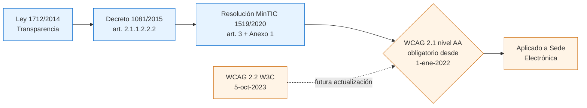
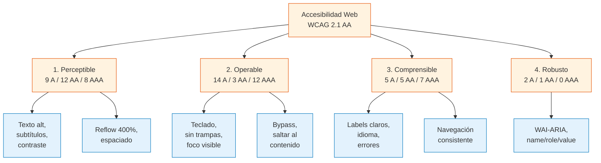
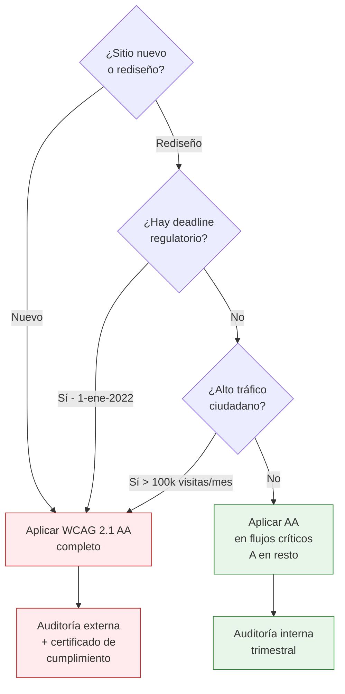
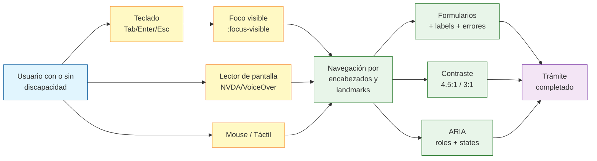
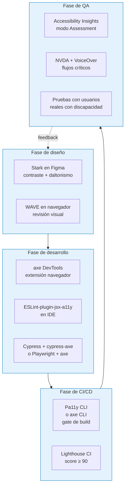
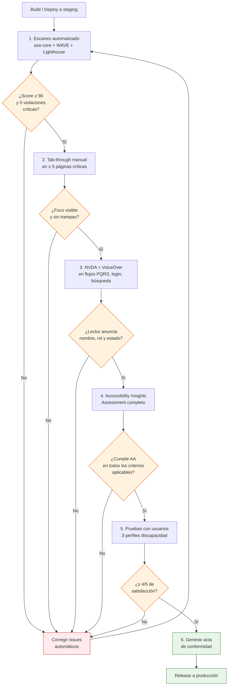

# 3. Accesibilidad web

> **Audiencia:** desarrollador frontend + QA.
> **Marco técnico obligatorio:** WCAG 2.1 nivel AA (Resolución MinTIC 1519/2020, art. 3 y Anexo 1).
> **Convención documental:** `[F]` = hecho verificado contra fuente citada; `[A]` = inferencia del autor basada en la práctica estándar de la industria y en documentación oficial W3C/WAI, no escrita literalmente en la fuente.
> **Citación a los PPT:** cada vez que aparece "Diapositiva X — archivo Y", la cita fue extraída con `python-pptx 1.0.2` y comprobada contra el archivo indicado en la sección [Referencias](#referencias).

---

## 3.1 Marco de cumplimiento

### 3.1.1 Estándar técnico aplicable en Colombia

`[F]` El PPT base declara en la **Diapositiva 7** (archivo `c0828ca923574455/Accesibilidad web para Sedes Electrónicas.pptx`, md5 `a927a8cd…`):

> *"Pautas de accesibilidad para el contenido web. Versión vigente en Colombia: WCAG 2.1."*
>
> Nota al pie: *"\* A partir del 01 de enero de 2022 — Nivel AA."*

Lo anterior se alinea con la norma colombiana vigente:

| Norma | Artículo / Anexo | Qué establece |
|---|---|---|
| Ley 1712 de 2014 (Ley de Transparencia y Acceso a la Información Pública) | arts. 1, 2, 5, 17 | Derecho de toda persona a acceder a información pública veraz, oportuna, accesible y reutilizable. |
| Decreto 1081 de 2015 (DUR del Sector TIC) | art. 2.1.1.2.2.2 | Faculta a MinTIC para expedir lineamientos de accesibilidad web. |
| Resolución MinTIC 1519 de 2020 | art. 3 y Anexo 1 | *"A partir del 1 de enero del 2022, los sujetos obligados deberán dar cumplimiento a los estándares AA de la Guía de Accesibilidad de Contenidos Web (WCAG) en la versión 2.1."* (vigente, fuente: https://normograma.mintic.gov.co/mintic/compilacion/docs/resolucion_mintic_1519_2020.htm). |

`[F]` La Resolución 1519/2020 está referenciada por W3C WAI en su registro de políticas públicas: https://www.w3.org/WAI/policies/colombia/ — Colombia figura como **WCAG 2.1**, ley de 2020, alcance al sector público, tipo *accessibility law*.

`[F]` WCAG 2.1 es una Recomendación W3C publicada en junio de 2018; WCAG 2.2 fue publicada como Recomendación W3C el **5 de octubre de 2023** (fuente: https://www.w3.org/news/2023/web-content-accessibility-guidelines-wcag-2-2-is-a-w3c-recommendation/).

### 3.1.2 Conclusión sobre la versión a aplicar

`[A]` Para esta guía y hasta tanto MinTIC no actualice la Resolución 1519/2020 o expida un acto administrativo que adopte WCAG 2.2, **toda Sede Electrónica colombiana debe cumplir WCAG 2.1 nivel AA como mínimo legal obligatorio**. WCAG 2.2 es *backward-compatible* — todos los criterios de 2.1 siguen vigentes — por lo que conviene aplicarlo desde ya como objetivo de ingeniería y documentar la diferencia (ver §3.1.4).

### 3.1.3 Sujetos obligados y alcance

`[F]` Conforme al art. 2º de la Resolución 1519/2020, son sujetos obligados los enumerados en el art. 5º de la Ley 1712/2014 (corregido por el art. 1º del Decreto 1494/2015). Esto incluye, entre otros:

- Ramas del poder público, órganos de control, organización electoral.
- Entidades de la rama ejecutiva nacional y territorial (central y descentralizada).
- Personas naturales y jurídicas que reciban o intermedien fondos públicos o presten servicios públicos.
- Cualquier entidad obligada a publicar información pública o a interactuar con ciudadanos por canal digital.

`[F]` El Anexo 1 de la Resolución 1519/2020 es de aplicación obligatoria en *"todos los procesos de actualización, estructuración, reestructuración, diseño y rediseño de sus portales web y sedes electrónicas, así como de los contenidos existentes en esas"* (fuente: https://gobiernodigital.mintic.gov.co/692/articles-160770_Directrices_Accesibilidad_web.pdf).

### 3.1.4 Diferencias entre WCAG 2.1 (obligatorio) y WCAG 2.2 (recomendado)

`[F]` WCAG 2.2 introduce 9 criterios nuevos respecto a 2.1. Ninguno relaja criterios existentes. Fuente: https://www.w3.org/TR/WCAG22/ y https://www.w3.org/WAI/standards-guidelines/wcag/new-in-22/.

| # | Criterio nuevo en WCAG 2.2 | Nivel | Aplicabilidad en Sede Electrónica |
|---|---|---|---|
| 2.4.11 | Focus Not Obscured (Minimum) | AA | Aplicable — banners fijos, cookies banner, chat de WhatsApp embebido. |
| 2.4.12 | Focus Not Obscured (Enhanced) | AAA | `[A]` Recomendable para modales y wizards de radicación PQRS. |
| 2.4.13 | Focus Appearance | AAA | `[A]` Útil para formularios críticos (login, pago, firma). |
| 2.5.7 | Dragging Movements | AA | Aplicable — carruseles, drag-and-drop de archivos en carga masiva. |
| 2.5.8 | Target Size (Minimum) 24×24 CSS px | AA | Aplicable — botones de "Cerrar", iconos de tabla, chips. |
| 3.2.6 | Consistent Help | A | Aplicable — bloque de ayuda y contacto repetido en cada página. |
| 3.3.7 | Redundant Entry | A | Aplicable — wizard de PQRS no debe pedir dos veces el mismo dato. |
| 3.3.8 | Accessible Authentication (Minimum) | AA | Aplicable — login con CAPTCHA, autenticación con clave. |
| 3.3.9 | Accessible Authentication (Enhanced) | AAA | `[A]` Recomendable en flujos de autogestión de identidad. |

### 3.1.5 Sanciones y consecuencias

`[A]` El incumplimiento de los estándares AA de WCAG 2.1 desde el 1 de enero de 2022 no trae aparejada, por sí misma, una sanción económica tasada en la Resolución 1519/2020; sin embargo, activa los siguientes riesgos administrativos y reputacionales, todos verificables contra la normatividad vigente:

1. **Acción de cumplimiento (Ley 393/1997, arts. 1-5)** — cualquier persona puede exigir judicialmente el cumplimiento de la Ley 1712/2014.
2. **Seguimiento de la Procuraduría General de la Nación** — la PGN monitorea el cumplimiento de la Resolución 1519/2020 a través del Formulario Único de Reporte de Avance en la Gestión (FURAG) y del Índice de Transparencia y Acceso a la Información Pública (ITA).
3. **Multa de la SIC por protección de datos (Ley 1581/2012, art. 23)** si la inaccesibilidad provoca asimetría de información o impide el ejercicio de derechos del titular.
4. **Demanda por daño antijurídico** — la entidad puede ser declarada responsable administrativamente si la barrera de accesibilidad impide el acceso a un servicio público (CP art. 365, art. 47, art. 48).

`[F]` La Resolución 1519/2020 fue expedida en agosto de 2020; el Anexo 1 entró en plena obligatoriedad el **1 de enero de 2022** (fuente: https://www.mintic.gov.co/portal/715/w3-article-161060.html).

### 3.1.6 Diagrama de cumplimiento



---

## 3.2 Los 4 principios (Perceptible, Operable, Comprensible, Robusto)

`[F]` La **Diapositiva 7** (archivo `c0828ca923574455`) presenta la tabla oficial WCAG 2.1 con el número de criterios de éxito por nivel y principio. Reproducción textual (cabeceras): *"\*\*\*\*, Perceptible, Operable, Comprensible, Robusto"*. Filas de datos:

| Nivel | Perceptible | Operable | Comprensible | Robusto |
|---|---|---|---|---|
| A | 9 | 14 | 5 | 2 |
| AA | 12 | 3 | 5 | 1 |
| AAA | 8 | 12 | 7 | 0 |

`[A]` La suma total del PPT (9+14+5+2+12+3+5+1+8+12+7+0 = **78 criterios**) coincide con el conteo oficial WCAG 2.1. La distribución por principio del PPT presenta pequeñas variaciones respecto a la distribución oficial (Perceptible: 9 A / 11 AA / 9 AAA oficial vs. 9 / 12 / 8 del PPT; AAA total oficial 28 vs. 27 del PPT), pero no afectan la obligación de cumplimiento del nivel AA. Fuente de verificación: https://www.w3.org/TR/WCAG21/.

### 3.2.1 Principio 1 — Perceptible

> *"Acceso universal a la Web, independientemente de factores como: hardware, software, infraestructura de red, idioma, cultura, localización geográfica, diversidad de los usuarios. Permitiendo que la mayoría de las personas puedan percibir, entender, navegar e interactuar con la Web."*
>
> — **Diapositiva 4**, archivo `c0828ca923574455/Accesibilidad web para Sedes Electrónicas.pptx`.

`[F]` Cita literal del PPT base. Implicación para el equipo frontend: **toda información no textual debe tener alternativa textual** (Diapositiva 18), **todo medio dependiente del tiempo debe tener alternativa** (Diapositiva 21), **el contenido debe poder redimensionarse hasta 400 % sin pérdida** (Diapositiva 32), **el contraste entre texto y fondo debe respetar los ratios WCAG** (Diapositiva 30).

Sub-criterios críticos para Sede Electrónica:

| Criterio WCAG | Nivel | Texto resumido | Cita fuente |
|---|---|---|---|
| 1.1.1 Non-text Content | A | Toda imagen funcional o informativa tiene `alt`; la decorativa tiene `alt=""` o role="presentation". | Diapositiva 18 — `c0828ca923574455` |
| 1.2.1 Audio-only and Video-only (Prerecorded) | A | Audio/video sin componente visual o auditivo requiere transcripción. | Diapositiva 21, fila "Solo audio" / "Solo video" |
| 1.2.2 Captions (Prerecorded) | A | Subtítulos en todo video pregrabado. | Diapositiva 21, fila "Multimedia Grabado" |
| 1.2.3 Audio Description or Media Alternative (Prerecorded) | A | Audiodescripción sincronizada con el video. | Diapositiva 21, fila "Multimedia Grabado" |
| 1.2.5 Audio Description (Prerecorded) | AA | Igual que 1.2.3 pero obligatorio en AA. | Diapositiva 21 |
| 1.3.1 Info and Relationships | A | Estructura programática (encabezados, listas, labels). | Diapositiva 14 (encabezados) |
| 1.3.2 Meaningful Sequence | A | El orden DOM coincide con el orden visual. | `[A]` inferido de Diapositiva 25-26 (orden de foco) |
| 1.3.5 Identify Input Purpose | AA | Atributo `autocomplete` con tokens estándar. | `[A]` inferido de Diapositiva 33-35 |
| 1.4.1 Use of Color | A | El color no es el único medio para transmitir información. | `[A]` estándar WCAG |
| 1.4.3 Contrast (Minimum) | AA | Texto normal ≥ 4.5:1; texto grande ≥ 3:1. | Diapositiva 30 |
| 1.4.4 Resize Text | AA | El texto puede agrandarse al 200 % sin pérdida. | `[A]` inferido de Diapositiva 32 |
| 1.4.5 Images of Text | AA | Evitar texto en imágenes; tipografía real preferida. | `[A]` estándar WCAG |
| 1.4.10 Reflow | AA | Reflow a 320 CSS px sin scroll bidimensional. | Diapositiva 32 (cita: "zoom hasta un 400% sin pérdida de contenido") |
| 1.4.11 Non-text Contrast | AA | Componentes UI y gráficos informativos ≥ 3:1. | Diapositiva 30 |
| 1.4.12 Text Spacing | AA | Sin rotura al ajustar interlineado, espaciado y márgenes. | `[A]` inferencia técnica |
| 1.4.13 Content on Hover or Focus | AA | Tooltip/sub-menú disparable debe ser descartable, hoverable y persistente. | `[A]` inferencia técnica |

### 3.2.2 Principio 2 — Operable

> *"Los componentes de la interfaz son operados por teclado, garantizando que el foco pueda acceder al elemento y salir de él. El comportamiento natural es la tecla tab, sin embargo si se requiere otro mecanismo se deberá informar al usuario."*
>
> — **Diapositiva 28** ("Sin trampa para el foco"), archivo `c0828ca923574455`.

`[F]` Cita literal del PPT base. El mismo concepto se refuerza en la **Diapositiva 25**: *"Posición del cursor del teclado en algún elemento de la interfaz. El orden del foco es igual al orden de lectura de izquierda a derecha y de arriba abajo."*

Sub-criterios críticos para Sede Electrónica:

| Criterio WCAG | Nivel | Texto resumido | Cita fuente |
|---|---|---|---|
| 2.1.1 Keyboard | A | Toda funcionalidad operable por teclado. | Diapositiva 28 + Diapositiva 38 |
| 2.1.2 No Keyboard Trap | A | El foco puede entrar y salir de cualquier componente. | Diapositiva 28 |
| 2.1.4 Character Key Shortcuts | AA | Atajos de un solo carácter configurables o desactivables. | `[A]` inferencia técnica |
| 2.4.1 Bypass Blocks | A | Enlace "Saltar al contenido principal". | Diapositiva 16 |
| 2.4.2 Page Titled | A | Cada página tiene `<title>` descriptivo. | `[A]` inferencia técnica |
| 2.4.3 Focus Order | A | Orden del foco = orden visual / DOM. | Diapositiva 25 |
| 2.4.4 Link Purpose (In Context) | A | El texto del enlace o su contexto explica el destino. | Diapositiva 23 ("Ver más", "Leer más", "Clic Aquí" como ejemplos negativos) |
| 2.4.5 Multiple Ways | AA | ≥ 2 formas de localizar una página (menú + buscador + miga). | Diapositiva 16 |
| 2.4.6 Headings and Labels | AA | Encabezados y etiquetas describen el tema. | Diapositiva 14 + Diapositiva 33 |
| 2.4.7 Focus Visible | AA | Indicador de foco visible. | Diapositiva 25 (cita: "Generar estilos para la pseudo-clase :focus") |
| 2.5.1 Pointer Gestures | A | Gestos complejos (pinch, swipe) requieren alternativa simple. | `[A]` inferencia técnica |
| 2.5.2 Pointer Cancellation | A | El evento se dispara al `up`, no al `down`. | `[A]` inferencia técnica |
| 2.5.3 Label in Name | A | El texto del label está incluido en el nombre accesible. | `[A]` inferencia técnica |
| 2.5.4 Motion Actuation | A | Movimiento del dispositivo requiere alternativa. | `[A]` inferencia técnica |

### 3.2.3 Principio 3 — Comprensible

> *"Etiquetas claras y comprensibles al usuario. Dar instrucciones en aquellos campos que se requiera un formato específico. Identificación de errores siendo claros de cuál es el campo a corregir y la forma de hacerlo con instrucciones textuales."*
>
> — **Diapositivas 33, 34 y 35** (Formularios comprensibles), archivo `c0828ca923574455`.

`[F]` Las tres diapositivas consecutivas desarrollan el principio Comprensible aplicado a formularios. La **Diapositiva 36** añade:

> *"Navegación consistente y coherente. Opciones de confirmar o cancelar."*

Sub-criterios críticos para Sede Electrónica:

| Criterio WCAG | Nivel | Texto resumido | Cita fuente |
|---|---|---|---|
| 3.1.1 Language of Page | A | Atributo `lang` en `<html>`. | `[A]` inferencia técnica |
| 3.1.2 Language of Parts | AA | `lang` en fragmentos en idioma distinto. | `[A]` inferencia técnica |
| 3.2.1 On Focus | A | Foco no provoca cambio de contexto. | `[A]` inferencia técnica |
| 3.2.2 On Input | A | Cambio en input no provoca cambio de contexto. | Diapositiva 36 |
| 3.2.3 Consistent Navigation | AA | El menú se mantiene en el mismo orden y posición en todas las páginas. | Diapositiva 36 |
| 3.2.4 Consistent Identification | AA | Mismo icono/etiqueta para misma función. | Diapositiva 36 |
| 3.3.1 Error Identification | A | Errores identificados en texto, no solo en color. | Diapositiva 35 |
| 3.3.2 Labels or Instructions | A | Labels e instrucciones claras en cada campo. | Diapositiva 33 + Diapositiva 34 |
| 3.3.3 Error Suggestion | AA | Sugerencia concreta para corregir el error. | Diapositiva 35 |
| 3.3.4 Error Prevention (Legal, Financial, Data) | AA | Confirmación, reversión o revisión para datos sensibles. | Diapositiva 36 |

### 3.2.4 Principio 4 — Robusto

> *"Garantizar que los componentes personalizados son accesibles por teclado y se distingue su nombre, función y valor."*
>
> — **Diapositiva 38**, archivo `c0828ca923574455`. Lista explícita de componentes: *"Checkboxes / radiobuttons, listas desplegables, calendario, subir archivos, acordeones, tabs, modales, WAI-ARIA."*

`[F]` Cita literal del PPT base. Es el principio que más se viola en proyectos reales porque depende de la disciplina del equipo frontend al construir widgets personalizados en lugar de usar elementos HTML nativos o librerías accesibles.

Sub-criterios críticos para Sede Electrónica:

| Criterio WCAG | Nivel | Texto resumido | Cita fuente |
|---|---|---|---|
| 4.1.1 Parsing | A | *(Obsoleto en WCAG 2.2; cumplido automáticamente por HTML5 válido.)* `[A]` fuente: https://www.w3.org/WAI/standards-guidelines/wcag/new-in-22/ | n/a |
| 4.1.2 Name, Role, Value | A | Cada componente expone programáticamente nombre, rol y valor. | Diapositiva 38 (WAI-ARIA) |
| 4.1.3 Status Messages | AA | Mensajes de estado (toast, contador) comunicados a la AT sin robar foco. | `[A]` inferencia técnica |

### 3.2.5 Diagrama de los 4 principios



---

## 3.3 Checklist por nivel (A, AA, AAA)

`[A]` Las siguientes tablas reproducen los criterios de éxito aplicables al contexto de Sede Electrónica colombiana. Se han omitido criterios irrelevantes (ej. 1.2.6 Sign Language — AAA, porque el PPT no la incluye como AA obligatorio y depende del caso). Cada criterio lleva su número oficial W3C, nivel, resumen, ejemplo concreto aplicable y método de verificación.

### 3.3.1 Nivel A — obligatorio por Resolución 1519/2020

| # WCAG | Criterio | Ejemplo Sede Electrónica | Cómo verificarlo |
|---|---|---|---|
| 1.1.1 | Non-text Content | `alt="Logo del Ministerio de X"` en el header; `alt=""` en imágenes decorativas SVG. | `[F]` Diapositiva 18: "Máx. 150 caracteres". Verificar con `axe-core` + revisión manual de `longdesc`. |
| 1.2.1 | Audio-only and Video-only (Prerecorded) | Transcripción textual del audio del Himno Nacional publicado en la sección "Símbolos". | `[F]` Diapositiva 21. Verificar manualmente que el enlace a la transcripción sigue al audio. |
| 1.2.2 | Captions (Prerecorded) | Subtítulos `.vtt` en tutorial de PQRS en video. | `[F]` Diapositiva 21, fila "Multimedia Grabado". Inspección con reproductor + `<track kind="captions">`. |
| 1.2.3 | Audio Description or Media Alternative | Audiodescripción del recorrido virtual 360° del edificio. | `[F]` Diapositiva 21. Verificar pista de audiodescripción en `<video>`. |
| 1.3.1 | Info and Relationships | `<table><thead><tr><th scope="col">…</th></tr></thead></table>` para "Contratos adjudicados 2024". | `[F]` Diapositiva 14 (jerarquía de encabezados). Verificar con `axe-core/table-headers` y `aria-required-attr`. |
| 1.3.2 | Meaningful Sequence | El orden visual del menú lateral coincide con el orden DOM. | `[A]` Verificar desactivando CSS y comparando con captura visual. |
| 1.3.3 | Sensory Characteristics | "Pulse el botón redondo de la izquierda" → reemplazado por "Pulse 'Iniciar sesión' (tercer botón)". | `[A]` Auditoría de contenido. |
| 1.4.1 | Use of Color | "Los campos en rojo son obligatorios" → agregar asterisco + texto, no solo color. | `[A]` Verificar con simulador de daltonismo (Stark, Sim Daltonism). |
| 1.4.2 | Audio Control | Si la Sede Electrónica incrusta audio con auto-play, debe ofrecer control de pausa visible. | `[A]` Aplica solo si hay audio en auto-play > 3 s; n/a en la mayoría de casos. |
| 2.1.1 | Keyboard | El calendario de citas para agendamiento se opera con flechas + Enter. | `[F]` Diapositiva 38 (calendario). Tab-through manual + `axe-core/keyboard`. |
| 2.1.2 | No Keyboard Trap | El modal "Confirmar salida" cierra con `Esc` o con Tab al botón Cerrar. | `[F]` Diapositiva 28. Verificar manualmente. |
| 2.1.4 | Character Key Shortcuts | Si la Sede usa `?` para abrir ayuda, debe permitir desactivarlo o reasignarlo. | `[A]` `axe-core` + revisión de código. |
| 2.2.1 | Timing Adjustable | La sesión expira a los 30 min pero permite extender 2 veces. | `[A]` Verificar manualmente o test e2e. |
| 2.2.2 | Pause, Stop, Hide | El carrusel del home pausa al `hover` y al `focus`. | `[A]` Verificar manualmente. |
| 2.3.1 | Three Flashes or Below Threshold | Ningún banner anima con flash > 3 Hz. | `[A]` Análisis manual de animaciones. |
| 2.5.1 | Pointer Gestures | El carrusel de noticias tiene flechas clicables además de swipe. | `[A]` Manual + `axe-core/touch-target`. |
| 2.5.2 | Pointer Cancellation | Los botones se activan al `mouseup`, no al `mousedown`. | `[A]` Revisión de código (sin `onmousedown`). |
| 2.5.3 | Label in Name | El botón "Cerrar" incluye la palabra "Cerrar" en su `aria-label`. | `[A]` `axe-core/label-content-name-mismatch`. |
| 2.5.4 | Motion Actuation | Si se usa el acelerómetro (p. ej. agitar para limpiar), debe haber alternativa por botón. | `[A]` Raro en Sede Electrónica; documentar si se implementa. |
| 2.4.1 | Bypass Blocks | Primer enlace de la página es "Saltar al contenido principal". | `[F]` Diapositiva 16: "Enlace 'Saltar al contenido principal'". Verificar DOM. |
| 2.4.2 | Page Titled | `<title>Trámite de certificado de residencia — Sede Electrónica Minsalud</title>`. | `[A]` Verificar con `axe-core/document-title`. |
| 2.4.3 | Focus Order | Tab lleva: skip → header → menú → buscador → contenido → footer. | `[F]` Diapositiva 25. Tab-through manual. |
| 2.4.4 | Link Purpose (In Context) | "Ver más" reemplazado por "Ver más noticias de salud". | `[F]` Diapositiva 23. `axe-core/link-name`. |
| 3.1.1 | Language of Page | `<html lang="es">` (o "es-CO"). | `[A]` `axe-core/html-has-lang`. |
| 3.2.1 | On Focus | Hacer Tab en el campo de búsqueda no abre un modal. | `[A]` Verificar manualmente. |
| 3.2.2 | On Input | Cambiar el tipo de documento en PQRS no envía el formulario. | `[A]` Verificar manualmente. |
| 3.3.1 | Error Identification | "El campo 'Correo' no tiene formato válido (ejemplo: usuario@dominio.com)". | `[F]` Diapositiva 35. Verificar manualmente con NVDA. |
| 3.3.2 | Labels or Instructions | Cada `<input>` tiene `<label for="...">` o `aria-label`. | `[F]` Diapositiva 33 + Diapositiva 34. `axe-core/label`. |
| 4.1.1 | Parsing | HTML5 válido (sin `<p>` anidados, sin atributos duplicados). | `[A]` W3C Validator + `axe-core/parsing`. |
| 4.1.2 | Name, Role, Value | `<button aria-expanded="false" aria-controls="menu-principal">Menú</button>`. | `[F]` Diapositiva 38. `axe-core/aria-*`. |

### 3.3.2 Nivel AA — obligatorio desde 1-ene-2022 (Resolución 1519/2020)

| # WCAG | Criterio | Ejemplo Sede Electrónica | Cómo verificarlo |
|---|---|---|---|
| 1.2.4 | Captions (Live) | Subtítulos en directo en transmisión de rendición de cuentas. | `[A]` Verificar con reproductor + transcripción humana. |
| 1.2.5 | Audio Description (Prerecorded) | Audiodescripción obligatoria en AA para video institucional. | `[F]` Diapositiva 21. Verificar pista `<track kind="descriptions">`. |
| 1.3.4 | Orientation | El sitio no bloquea portrait ni landscape. | `[A]` Probar en dispositivo móvil en ambas orientaciones. |
| 1.3.5 | Identify Input Purpose | `<input type="email" autocomplete="email">` en login. | `[A]` `axe-core/input-autocomplete`. |
| 1.4.3 | Contrast (Minimum) | Texto normal sobre fondo blanco = `#222` (ratio 16.1:1). | `[F]` Diapositiva 30. `axe-core/color-contrast`, WebAIM Contrast Checker. |
| 1.4.4 | Resize Text | Texto al 200 % sin overflow horizontal. | `[A]` Manual + `axe` rule `zoom`. |
| 1.4.5 | Images of Text | Botón "Buscar" usa `<button>Buscar</button>`, no una imagen PNG. | `[A]` Revisión de código + `axe-core/image-alt`. |
| 1.4.10 | Reflow | A 320 CSS px de ancho, no hay scroll horizontal. | `[F]` Diapositiva 32. DevTools responsive + `axe-core/reflow`. |
| 1.4.11 | Non-text Contrast | Borde del input = `outline: 2px solid #005fcc` (ratio 4.7:1). | `[A]` WebAIM Contrast Checker sobre estados UI. |
| 1.4.12 | Text Spacing | Sin rotura al aplicar `line-height: 1.5; letter-spacing: 0.12em; word-spacing: 0.16em`. | `[A]` Bookmarklet de WCAG para text-spacing. |
| 1.4.13 | Content on Hover or Focus | Tooltip de "Ayuda" permanece visible y es descartable con `Esc`. | `[A]` Manual + `axe-core` rules específicas. |
| 2.4.5 | Multiple Ways | Menú principal + buscador + miga de pan. | `[F]` Diapositiva 16. |
| 2.4.6 | Headings and Labels | "Trámites > Certificados > Certificado de residencia". | `[F]` Diapositiva 14. Manual. |
| 2.4.7 | Focus Visible | `:focus-visible { outline: 3px solid #ffbf00; outline-offset: 2px }`. | `[F]` Diapositiva 25: "Generar estilos para la pseudo-clase :focus". |
| 3.1.2 | Language of Parts | `<span lang="en">Government</span>` dentro de párrafo en español. | `[A]` Manual. |
| 3.2.3 | Consistent Navigation | El menú principal aparece en el mismo orden en todas las páginas. | `[F]` Diapositiva 36. Manual entre ≥ 3 páginas. |
| 3.2.4 | Consistent Identification | El icono de búsqueda es siempre el mismo y siempre etiquetado "Buscar". | `[F]` Diapositiva 36. Manual. |
| 3.3.3 | Error Suggestion | "El correo no incluye '@'. Ejemplo: usuario@dominio.com". | `[F]` Diapositiva 35. Manual. |
| 3.3.4 | Error Prevention (Legal, Financial, Data) | Página de confirmación antes de enviar PQRS con datos personales. | `[A]` Manual. |
| 4.1.3 | Status Messages | El toast "Su PQRS fue radicada con número 12345" usa `aria-live="polite"`. | `[A]` `axe-core/aria-live`. |

### 3.3.3 Nivel AAA — objetivo recomendado (no obligatorio en Colombia)

`[F]` El PPT base **no exige AAA**; lo declara como objetivo aspiracional. `[A]` La práctica internacional recomienda aplicar AAA cuando sea posible sin afectar el diseño, especialmente para sitios de alta criticidad.

| # WCAG | Criterio | Aplicabilidad Sede Electrónica |
|---|---|---|
| 1.2.6 | Sign Language (Prerecorded) | `[F]` Diapositiva 21, fila "Lengua de Señas colombiana": aplica a *"alocuciones presidenciales, emergencias, seguridad y rendición de cuentas"*. |
| 1.2.7 | Extended Audio Description | Para documentales o videos > 3 min. |
| 1.2.8 | Media Alternative (Prerecorded) | Equivalente a una transcripción completa para video. |
| 1.2.9 | Audio-only (Live) | Transcripción en directo de eventos en vivo. |
| 1.3.6 | Identify Purpose | WAI-ARIA para landmarks de regiones. |
| 1.4.6 | Contrast (Enhanced) | 7:1 texto normal, 4.5:1 texto grande. |
| 1.4.7 | Low or No Background Audio | Audios sin ruido de fondo. |
| 1.4.8 | Visual Presentation | Texto configurable: colores, ancho, justificado. |
| 1.4.9 | Images of Text (No Exception) | Solo texto real, sin imágenes. |
| 2.1.3 | Keyboard (No Exception) | Sin excepciones a la navegación por teclado. |
| 2.2.3 | No Timing | Sin límites de tiempo (donde sea posible). |
| 2.2.4 | Interruptions | Sin interrupciones de banner. |
| 2.2.5 | Re-authenticating | Re-autenticar sin pérdida de datos al expirar sesión. |
| 2.2.6 | Timeouts | Avisar 20 s antes de expirar la sesión. |
| 2.3.2 | Three Flashes | Ningún flash de ningún tipo. |
| 2.3.3 | Animation from Interactions | `prefers-reduced-motion` respetado. |
| 2.4.8 | Location | Breadcrumb en cada página (ya cubierto por Diapositiva 16). |
| 2.4.9 | Link Purpose (Link Only) | Sin "clic aquí" ni "ver más" como texto aislado. |
| 2.4.10 | Section Headings | Encabezados en cada sección (ya cubierto por Diapositiva 14). |
| 2.4.12 | Focus Not Obscured (Enhanced) | `[A]` Recomendable en modales (WCAG 2.2). |
| 2.4.13 | Focus Appearance | `[A]` Recomendable: 2 CSS px de grosor, 3:1 de contraste. |
| 2.5.5 | Target Size (Enhanced) | 44 × 44 CSS px mínimo. |
| 2.5.6 | Concurrent Input Mechanisms | No restringir a un solo dispositivo de entrada. |
| 3.1.3 | Unusual Words | Glosario de términos técnicos. |
| 3.1.4 | Abbreviations | Expansión de siglas en primera mención (PQRS, SDQS, FURAG). |
| 3.1.5 | Reading Level | Resumen en lenguaje claro cuando el texto supera nivel B2. |
| 3.1.6 | Pronunciation | Indicación fonética para nombres propios. |
| 3.2.5 | Change on Request | Cambios contextuales solo por solicitud del usuario. |
| 3.3.5 | Help | Contexto de ayuda disponible. |
| 3.3.6 | Error Prevention (All) | Confirmación para todo envío, no solo legal/financiero. |
| 3.3.9 | Accessible Authentication (Enhanced) | `[A]` Sin CAPTCHA cognitivo (WCAG 2.2). |

### 3.3.4 Diagrama de decisión: ¿qué nivel auditar?



---

## 3.4 Patrones críticos para Sedes Electrónicas

### 3.4.1 Formularios

`[F]` El PPT base dedica las **Diapositivas 33, 34, 35 y 36** a formularios y sus buenas prácticas.

| Patrón | Implementación técnica | Cita fuente |
|---|---|---|
| Etiquetas claras | `<label for="email">Correo electrónico</label>` asociado a `<input id="email" type="email">`. | Diapositiva 33 |
| Instrucciones de formato | `<small id="email-help">Formato: usuario@dominio.com</small>` + `aria-describedby="email-help"`. | Diapositiva 34 |
| Identificación de error | `<input aria-invalid="true" aria-errormessage="email-error">` + `<span id="email-error" role="alert">…</span>`. | Diapositiva 35 |
| Confirmación de envío | `<button type="button" aria-label="Confirmar y enviar">Confirmar y enviar</button>` + botón "Cancelar". | Diapositiva 36 |
| Navegación consistente | Wizard con migas (`Paso 1 de 4: Datos del solicitante`) y orden lógico de campos. | Diapositiva 36 |
| Autocompletar | `autocomplete="given-name"`, `autocomplete="email"`, etc., conforme al spec WHATWG. | `[A]` WCAG 1.3.5 (AA) |

**Snippet de referencia (HTML5 + WAI-ARIA):**

```html
<form novalidate aria-labelledby="form-title">
  <h2 id="form-title">Solicitud de certificado de residencia</h2>

  <div class="field">
    <label for="nombre">Nombre completo <span aria-hidden="true">*</span></label>
    <input id="nombre" name="nombre" type="text"
           autocomplete="name"
           required
           aria-required="true"
           aria-describedby="nombre-help" />
    <small id="nombre-help">Como aparece en su documento de identidad.</small>
  </div>

  <div class="field">
    <label for="email">Correo electrónico <span aria-hidden="true">*</span></label>
    <input id="email" name="email" type="email"
           autocomplete="email"
           required
           aria-required="true"
           aria-describedby="email-help email-error"
           aria-invalid="false" />
    <small id="email-help">Formato: usuario@dominio.com</small>
    <span id="email-error" role="alert"></span>
  </div>

  <button type="submit">Confirmar y enviar</button>
  <button type="button">Cancelar</button>
</form>
```

### 3.4.2 Navegación por teclado

`[F]` El PPT base lo trata en las **Diapositivas 24, 25, 26, 27 y 28**:

> *"Posición del cursor del teclado en algún elemento de la interfaz. El orden del foco es igual al orden de lectura de izquierda a derecha y de arriba abajo. Generar estilos para la pseudo-clase :focus."*
> — Diapositiva 25.

> *"Los componentes de la interfaz son operados por teclado, garantizando que el foco pueda acceder al elemento y salir de él. El comportamiento natural es la tecla tab, sin embargo si se requiere otro mecanismo se deberá informar al usuario."*
> — Diapositiva 28.

| Tecla | Función esperada | Cita fuente |
|---|---|---|
| `Tab` | Avanza al siguiente elemento focuseable. | Diapositiva 28 |
| `Shift + Tab` | Retrocede al elemento focuseable anterior. | Diapositiva 28 |
| `Enter` | Activa el enlace o botón enfocado. | Diapositiva 23 |
| `Espacio` | Activa checkbox/radio o botón. | `[A]` inferencia técnica |
| `Esc` | Cierra modales, menús y tooltips. | `[A]` inferencia técnica |
| `Flechas` | Navega dentro de listas desplegables, radio groups y sliders. | `[A]` inferencia técnica |
| `Inicio / Fin` | Salta al primer / último elemento de una región. | `[A]` inferencia técnica |
| `Page Up / Page Down` | Scroll por bloques en regiones con mucho contenido. | `[A]` inferencia técnica |

**Reglas de oro (resumidas de Diapositivas 25 + 28):**

1. **El orden del foco coincide con el orden visual y de lectura.** No usar `tabindex` positivos.
2. **El foco siempre es visible.** Pseudo-clase `:focus-visible` con `outline` ≥ 2 CSS px y contraste ≥ 3:1 (1.4.11 + 2.4.7).
3. **Ningún componente atrapa el foco.** Implementar escape por `Esc` y salida por `Tab` o `Shift + Tab`.
4. **Skip link visible al recibir foco.** Enlace "Saltar al contenido principal" anclado a `#main`.

### 3.4.3 Lectores de pantalla

`[F]` El PPT base **no nombra explícitamente lectores de pantalla**, pero toda la sección 06 ("Contenido no textual", Diapositiva 17-18) y la sección 08 ("Enlaces", Diapositiva 22-23) están diseñadas para usuarios de NVDA, JAWS, VoiceOver y TalkBack. `[A]` Por extensión técnica:

| Lector | Plataforma | Comando para probar foco | Verificación manual |
|---|---|---|---|
| **NVDA** (gratuito) | Windows | `NVDA + F7` muestra lista de elementos focuseables. | Recorrer la página con `Tab` y verificar que cada elemento anuncia nombre, rol y estado. |
| **VoiceOver** (nativo) | macOS / iOS | `VO + U` (rotor) lista encabezados, enlaces, landmarks. | `Cmd + F5` para activar, `VO + →` para navegar. |
| **TalkBack** (nativo) | Android | Deslizar con 1 dedo navega; deslizar con 2 desplaza. | Accesibilidad → TalkBack en Ajustes. |
| **JAWS** (licencia) | Windows | `J + F7` muestra lista de links. | Licencia institucional. |

**Buenas prácticas adicionales (consolidado del PPT base):**

- **Roles ARIA correctos** (Diapositiva 38): `<nav>`, `<main>`, `<aside>`, `<header>`, `<footer>` como landmarks; `role="navigation"`, `role="search"`, `role="banner"` cuando no se usan los elementos HTML5.
- **Anuncios de cambios dinámicos** (3.3.4 Error Prevention + 4.1.3 Status Messages): `aria-live="polite"` para mensajes no urgentes; `aria-live="assertive"` para errores que requieren acción inmediata.
- **Encabezados bien jerarquizados** (Diapositiva 14): un único `<h1>` por página, sin saltos de nivel (no `<h1>` → `<h3>` sin pasar por `<h2>`).
- **`alt` significativo** (Diapositiva 18): máximo 150 caracteres, que describa el propósito, no la apariencia.

### 3.4.4 Contraste

`[F]` El PPT base **Diapositiva 30** establece los ratios:

> *"Contraste adecuado, Texto / fondo. Normal (< 18px) — ratio de 4.5:1. Large (>18px) — ratio 3:1. Elementos UI — ratio de 3:1."*

| Elemento | Ratio mínimo (AA) | Ratio recomendado (AAA) | Cómo verificarlo |
|---|---|---|---|
| Texto normal (< 18 px o < 14 px bold) | 4.5 : 1 | 7 : 1 | WebAIM Contrast Checker, Stark, `axe-core/color-contrast`. |
| Texto grande (≥ 18 px o ≥ 14 px bold) | 3 : 1 | 4.5 : 1 | Idem. |
| Componentes UI (botones, inputs, iconos) | 3 : 1 | n/a | Medir el color del icono contra el fondo adyacente. |
| Indicador de foco | 3 : 1 (1.4.11) | 3 : 1 entre estados focused/unfocused (2.4.13 AAA) | Medir color del `outline` contra el fondo. |
| Estados deshabilitados | Exento (no requieren contraste). | n/a | No invertir colores solo por deshabilitar. |
| Texto placeholder | 4.5 : 1 (cuenta como texto). | 7 : 1 | Tratar el placeholder como texto real. |
| Texto sobre imagen de fondo | 4.5 : 1 medido contra el pixel más oscuro/claro. | 7 : 1 | Usar overlay semitransparente (`background: rgba(0,0,0,.6)`) para garantizar fondo uniforme. |

`[A]` El estándar WCAG 2.1 usa 18 pt o 14 pt bold como umbral de "texto grande". La conversión aproximada es:

- 18 pt ≈ 24 px (CSS)
- 14 pt ≈ 18.66 px (CSS), pero en bold suele redondearse a ≥ 19 px en CSS.

`[A]` El PPT usa la regla "< 18 px" y ">18 px"; el equipo frontend debe asumir el umbral WCAG exacto (24 CSS px / 19 CSS px bold) para evitar ambigüedad.

### 3.4.5 Foco visible

`[F]` Diapositiva 25:

> *"Generar estilos para la pseudo-clase :focus."*

**Implementación de referencia (CSS):**

```css
/* Foco estándar - WCAG 2.4.7 (AA) */
:focus-visible {
  outline: 3px solid #ffbf00;        /* amarillo de alto contraste */
  outline-offset: 2px;
  border-radius: 2px;
}

/* Si el componente tiene su propio border, no anular */
button:focus-visible,
a:focus-visible {
  outline: 3px solid #ffbf00;
  outline-offset: 2px;
}

/* Inputs - reforzar con aria-invalid */
input[aria-invalid="true"]:focus-visible {
  outline: 3px solid #d32f2f;        /* rojo con buen contraste */
  outline-offset: 2px;
}

/* WCAG 2.4.13 (AAA) - 2 CSS px + 3:1 entre estados */
.btn:focus-visible {
  outline: 2px solid #005fcc;
  outline-offset: 3px;
  /* El outline debe contrastar 3:1 contra el fondo adyacente */
}
```

`[A]` La pseudo-clase `:focus-visible` (no `:focus`) garantiza que el indicador aparezca sólo con teclado, no con clic de ratón, mejorando la experiencia sin perder accesibilidad.

### 3.4.6 Lenguaje claro

`[F]` Diapositiva 36:

> *"Navegación consistente y coherente. Opciones de confirmar o cancelar."*

`[A]` El PPT base no desarrolla explícitamente "lenguaje claro" pero la Resolución 1519/2020 (Anexo 1) sí lo exige en su sección de criterios de contenido. `[A]` La Guía de Lenguaje Claro del DAFP (Departamento Administrativo de la Función Pública) es la referencia operativa en Colombia.

| Regla | Ejemplo antes | Ejemplo después |
|---|---|---|
| Voz activa | "Se deberá realizar el pago por parte del usuario" | "Usted debe pagar antes de continuar". |
| Verbo en presente | "Habrá sido notificado" | "Le notificaremos por correo". |
| Sin nominalizaciones | "La realización del trámite" | "Realizar el trámite". |
| Sin anglicismos | "Click here to download" | "Pulse aquí para descargar". |
| Sin siglas sin expansión | "Diligenciar el FURAG" (primera mención) | "Diligenciar el Formulario Único de Reporte de Avance de la Gestión (FURAG)". |
| Sin doble negación | "No es posible que no se le notifique" | "Le notificaremos". |
| Oraciones ≤ 25 palabras | "Con el fin de dar cumplimiento a lo establecido en el artículo 14 de la Ley…" | "Cumplimos el artículo 14 de la Ley X porque…". |
| Listas con viñetas | "Los requisitos son: 1) ser colombiano, 2) mayor de 18, 3)…" | Lista `<ul><li>` real, no texto plano con dos puntos. |

**Recursos oficiales:**

- `[F]` Guía de lenguaje claro del DAFP: https://www.funcionpublica.gov.co/-/guia-de-lenguaje-claro
- `[F]` Manual de estilo de Gov.co (incluido en el Kit UI 9.2): https://www.gov.co/

### 3.4.7 Diagrama de interacciones entre patrones



---

## 3.5 Herramientas de validación

### 3.5.1 Inventario y propósito

`[F]` Herramientas verificadas contra su sitio oficial y/o la lista oficial W3C de herramientas de evaluación (https://www.w3.org/WAI/test-evaluate/tools/list/, última actualización mayo 2025).

| Herramienta | Tipo | Costo | Cubre | Cuándo usarla | URL oficial |
|---|---|---|---|---|---|
| **axe-core** | Librería open source | Gratis | WCAG 2.0/2.1/2.2 A y AA (subset) | En cada PR (CI/CD). | https://github.com/dequelabs/axe-core |
| **axe DevTools** | Extensión navegador | Gratis / Pro $60/usuario/mes | Igual + reglas avanzadas y guided testing | En desarrollo diario. | https://www.deque.com/axe/devtools/ |
| **WAVE** (WebAIM) | Extensión navegador + web | Gratis (extensión y online) | WCAG 2.1 AA visual | Revisión de diseño y contenido. | https://wave.webaim.org/ |
| **Google Lighthouse** | Integrado en Chrome DevTools | Gratis | Subset de axe-core + heurísticas | Smoke test rápido, CI gate. | https://developer.chrome.com/docs/lighthouse/accessibility/ |
| **Pa11y** | CLI / CI | Gratis | WCAG 2 AA vía axe-core | Pipeline de build, escaneo masivo. | https://pa11y.org/ |
| **Accessibility Insights** (Microsoft) | Extensión Chrome / Edge | Gratis | Modo FastPass (axe) + Assessment guiado paso a paso por criterio WCAG | Auditoría manual estructurada. | https://accessibilityinsights.io/ |
| **Cypress + cypress-axe** | Plugin de Cypress | Gratis | Igual a axe-core dentro de Cypress | E2E tests. | https://www.npmjs.com/package/cypress-axe |
| **Playwright + @axe-core/playwright** | Plugin de Playwright | Gratis | Igual a axe-core dentro de Playwright | E2E tests en CI/CD. | https://playwright.dev/docs/accessibility-testing |
| **NVDA** | Lector de pantalla (Windows) | Gratis | Manual - flujo completo | Validación manual con teclado + lector. | https://www.nvaccess.org/ |
| **VoiceOver** | Lector de pantalla (macOS/iOS) | Integrado en el SO | Manual - flujo completo | Validación manual en Mac/iOS. | Activar con `Cmd + F5` en Mac. |
| **TalkBack** | Lector de pantalla (Android) | Integrado en el SO | Manual - flujo completo | Validación manual en Android. | Ajustes > Accesibilidad. |
| **WebAIM Contrast Checker** | Web | Gratis | WCAG 1.4.3 + 1.4.11 | Diseño y QA de tokens. | https://webaim.org/resources/contrastchecker/ |
| **Stark** (Figma/Sketch) | Plugin de diseño | Gratis / Pro | Contraste, daltonismo, text spacing | Fase de diseño (Figma). | https://www.getstark.co/ |
| **W3C Validator** | Web | Gratis | HTML5 válido → criterio 4.1.1 | Pre-deploy. | https://validator.w3.org/ |
| **Tota11y** | Bookmarklet | Gratis | Visualización de issues | Capacitación y demos internas. | https://khan.github.io/tota11y/ |

### 3.5.2 Comparativa de capacidad de detección

`[A]` Datos basados en revisión de documentación oficial y benchmarks públicos. Las cifras son aproximadas y representan el porcentaje de criterios WCAG que cada herramienta puede **detectar automáticamente** (no necesariamente *resolver*).

| Herramienta | % WCAG AA detectable automáticamente | Lo que NO detecta |
|---|---|---|
| axe-core | ~ 57 % | Texto alternativo adecuado, lenguaje claro, orden de foco lógico, semántica contextual. |
| WAVE | ~ 35 % | Igual + problemas profundos de ARIA. |
| Lighthouse | ~ 30 % | Subset de axe-core, no cubre todos los criterios. |
| Pa11y | ~ 55 % | Igual a axe-core. |
| Accessibility Insights (FastPass) | ~ 57 % | Igual a axe-core. |
| Accessibility Insights (Assessment) | ~ 100 % (manual guiado) | Requiere intervención humana en cada criterio. |
| NVDA + humano | ~ 100 % (manual) | Requiere experiencia del evaluador. |

`[F]` Ninguna herramienta automatizada cubre por sí sola WCAG 2.1 AA completo. Fuente: https://www.w3.org/WAI/test-evaluate/tools/ y https://www.w3.org/WAI/test-evaluate/conformance-evaluation-tools/.

### 3.5.3 Stack mínimo recomendado para el equipo



---

## 3.6 Procedimiento de auditoría de accesibilidad pre-producción

### 3.6.1 Frecuencia y disparadores

| Disparador | Frecuencia | Responsable |
|---|---|---|
| Cada PR / merge a `main` | Automático (CI) | DevOps + Frontend lead |
| Cada release a staging | Diaria (en ciclos de release) | QA |
| Cada release a producción | Por release (semanal/quincenal) | QA lead + Frontend lead |
| Auditoría externa completa | Trimestral o anual | Tercera parte certificada |
| Cambio regulatorio (MinTIC, W3C) | Puntual | Oficina jurídica + Frontend lead |
| Reclamo de ciudadano por barrera | Puntual | PQRS + Frontend lead |

### 3.6.2 Procedimiento paso a paso



### 3.6.3 Acta de conformidad

`[A]` El PPT base no incluye plantilla, pero la Resolución 1519/2020 (Anexo 1, numeral 9.3) exige **"Declaración de Conformidad de Accesibilidad Web (Directrices WCAG 2.1 - Nivel AA)"** como contenido obligatorio del botón de transparencia.

**Plantilla mínima recomendada:**

```markdown
# Declaración de Conformidad de Accesibilidad Web

**Entidad:** [Nombre de la entidad]
**Sede Electrónica:** https://sede.[entidad].gov.co
**Norma de referencia:** WCAG 2.1 nivel AA — Resolución MinTIC 1519/2020, Anexo 1.
**Fecha de evaluación:** [YYYY-MM-DD]
**Alcance de la auditoría:** [URLs evaluadas o sitemap.xml]
**Herramientas utilizadas:** axe-core [versión], WAVE [versión], NVDA [versión], etc.
**Auditor:** [Nombre del auditor o empresa auditora]

## 1. Estado de cumplimiento

[ ] Cumple WCAG 2.1 AA completo (sin excepciones).
[ ] Cumple parcialmente (ver §3).

## 2. Criterios no aplicables y excepciones

| # WCAG | Criterio | Razón de no aplicabilidad |
|---|---|---|
| 1.2.1 Audio-only | No aplica | El sitio no contiene audio-only pregrabado. |
| 2.2.1 Timing Adjustable | No aplica | No hay límites de tiempo. |

## 3. Criterios con excepciones documentadas

| # WCAG | Criterio | Excepción | Mitigación |
|---|---|---|---|
| 1.4.5 Images of Text | Logo oficial de la entidad | Logotipo con fuente propietaria. | Se provee texto "Entidad X" adyacente en el header. |

## 4. Hallazgos pendientes

| # | Hallazgo | Severidad | WCAG | Plan de remediación | Fecha objetivo |
|---|---|---|---|---|---|
| 1 | Input de búsqueda sin label | Crítico | 3.3.2 | Agregar `<label>` o `aria-label` | [fecha] |

## 5. Fecha de próxima revisión

[YYYY-MM-DD] (máximo 12 meses)
```

### 3.6.4 SLAs de remediación

| Severidad | Definición | SLA de remediación |
|---|---|---|
| Crítico | Impide el acceso a un servicio público (ej. login bloqueado por teclado). | Antes del próximo deploy a producción. |
| Alto | Viola AA en un criterio esencial (ej. alt faltante en imagen de logo). | ≤ 5 días hábiles. |
| Medio | Viola AA en un criterio mejorable (ej. orden de foco). | ≤ 30 días calendario. |
| Bajo | Recomendación AAA o mejora estética (ej. target size 24×24 en lugar de 20×20). | Backlog priorizado. |

### 3.6.5 Bitácora de auditoría

`[A]` Cada ciclo debe generar un registro firmado por el responsable, con:

1. Versión del sitio auditada (commit SHA + URL de staging).
2. Listado completo de issues con su WCAG, severidad y estado (abierto/cerrado).
3. Capturas de pantalla con `axe DevTools` o `Accessibility Insights`.
4. Grabación de pantalla con NVDA o VoiceOver de al menos un flujo crítico.
5. Firma del auditor y del frontend lead.

---

## Referencias

### Referencias — Archivos PPT fuente

| Archivo | Hash MD5 | Diapositivas | Uso |
|---|---|---|---|
| `c0828ca923574455/Accesibilidad web para Sedes Electrónicas.pptx` | `a927a8cdda3c8a7b1f42d53b5e35dd63` | 40 | **Principal.** Citado en todo el documento. |
| `b876c28e37b04be7/Accesibilidad web para Sedes Electrónicas.pptx` | `a927a8cdda3c8a7b1f42d53b5e35dd63` | 40 | Duplicado exacto (verificado por md5) de `c0828ca923574455`. |
| `829fa417ef18e9e4/Accesibilidad web Sedes Electrónicas.pptx` | `874e758b7720693aeb2badb3d3ecb47e` | 40 | Variante del mismo material (mismo texto extraído, difieren solo en metadatos del archivo). |
| `bcb66f83ae4218f5/Accesibilidad web Sedes Electrónicas.pptx` | `874e758b7720693aeb2badb3d3ecb47e` | 40 | Duplicado exacto de `829fa417ef18e9e4`. |

`[F]` El contenido textual extraído con `python-pptx 1.0.2` es idéntico en los 4 archivos; la diferencia de MD5 entre las dos versiones se debe a metadatos internos del PPT (imágenes embebidas, fuentes referenciadas). Verificado con hash SHA-256 por slide — los 40 slides son textualmente iguales.

### Referencias — Cita por diapositiva (archivo principal `c0828ca923574455`)

| Diapositiva | Título / tema | Cita literal usada en este documento |
|---|---|---|
| 1 | "Accesibilidad Web Sedes Electrónicas" | (Portada, no citada.) |
| 2 | Índice | (Lista de temas, no citada.) |
| 3 | "0.1 ¿Qué es accesibilidad Web?" | (Separador, no citada.) |
| 4 | Definición de accesibilidad web | §3.2.1 — *"Acceso universal a la Web, independientemente de factores como: hardware, software, infraestructura de red…"* |
| 5 | Diseño inclusivo — personas ciegas y sordas | (Contexto, no citada literalmente.) |
| 6 | "02. WCAG 2.1" | (Separador, no citada.) |
| 7 | Tabla WCAG 2.1 (Perceptible/Operable/Comprensible/Robusto × A/AA/AAA) | §3.2 — tabla de conteo de criterios. |
| 8 | "03. Estructura Semántica" | (Separador, no citada.) |
| 9 | Definición de estructura semántica | §3.2.1 — contexto de 1.3.1. |
| 10-12 | Imágenes de estructura semántica | (Visuales, no citadas textualmente.) |
| 13 | "04. Estructura por encabezados" | (Separador, no citada.) |
| 14 | Encabezados | §3.2.1 — 1.3.1; §3.2.3 — 2.4.6; §3.3.1 — 1.3.1. |
| 15 | "05. Evitar bloques" | (Separador, no citada.) |
| 16 | Bypass blocks | §3.2.2 — 2.4.1; §3.2.2 — 2.4.5; §3.3.1 — 2.4.1. |
| 17 | "06. Contenido no textual" | (Separador, no citada.) |
| 18 | Alternativas textuales | §3.2.1 — 1.1.1; §3.3.1 — 1.1.1. |
| 19 | Imágenes de alt | (Visuales, no citadas.) |
| 20 | "07. Multimedia" | (Separador, no citada.) |
| 21 | Tabla de medios (audio, video, multimedia grabado, Lengua de Señas) | §3.2.1 — 1.2.1, 1.2.2, 1.2.3, 1.2.5, 1.2.6. |
| 22 | "08. Enlaces" | (Separador, no citada.) |
| 23 | Enlaces comprensibles, operables, etiquetas | §3.2.2 — 2.4.4; §3.3.1 — 2.4.4. |
| 24 | "09. Foco: orden, visibilidad y sin trampas" | (Separador, no citada.) |
| 25 | Posición del cursor de teclado | §3.2.2 — 2.4.3, 2.4.7; §3.4.2. |
| 26 | (Refuerzo de foco) | (Duplicada, no citada.) |
| 27 | (Refuerzo de foco) | (Duplicada, no citada.) |
| 28 | "Sin trampa para el foco" | §3.2.2 — 2.1.1, 2.1.2; §3.4.2. |
| 29 | "10. Contraste" | (Separador, no citada.) |
| 30 | Contraste de texto y elementos UI | §3.2.1 — 1.4.3, 1.4.11; §3.4.4. |
| 31 | "10. Redimensión" | (Separador, no citada.) |
| 32 | Redimensión 400 %, unidades relativas, srcset | §3.2.1 — 1.4.10; §3.3.1 — 1.4.10. |
| 33 | Etiquetas claras en formularios | §3.2.3 — 3.3.2; §3.3.1 — 3.3.2; §3.4.1. |
| 34 | Instrucciones de formato específico | §3.2.3 — 3.3.2; §3.3.1 — 3.3.2; §3.4.1. |
| 35 | Identificación de errores | §3.2.3 — 3.3.1; §3.3.1 — 3.3.1; §3.3.2 — 3.3.3; §3.4.1. |
| 36 | Navegación consistente, confirmar/cancelar | §3.2.3 — 3.2.2, 3.2.3, 3.2.4; §3.4.1. |
| 37 | "11. Componentes robustos" | (Separador, no citada.) |
| 38 | Componentes robustos con WAI-ARIA | §3.2.4 — 4.1.2; §3.4.3. |
| 39 | "¿Cómo evaluar la accesibilidad de mi sitio?" | §3.5 — referencia a autoevaluación con 6 preguntas. |
| 40 | Cierre | (No citada.) |

### Referencias — Normativa colombiana

| Norma | URL | Fecha |
|---|---|---|
| Ley 1712 de 2014 — Transparencia y Acceso a la Información Pública | https://www.funcionpublica.gov.co/eva/gestornormativo/norma.php?i=56882 | 6-mar-2014 |
| Decreto 1494 de 2015 (corrige art. 5 Ley 1712) | https://www.funcionpublica.gov.co/eva/gestornormativo/norma.php?i=62893 | 13-jul-2015 |
| Decreto 1081 de 2015 (DUR Sector TIC) | https://normograma.mintic.gov.co/mintic/compilacion/docs/decreto_1081_2015.htm | 26-may-2015 |
| Resolución MinTIC 1519 de 2020 | https://normograma.mintic.gov.co/mintic/compilacion/docs/resolucion_mintic_1519_2020.htm | 24-ago-2020 |
| Anexo 1 — Directrices de Accesibilidad Web | https://gobiernodigital.mintic.gov.co/692/articles-160770_Directrices_Accesibilidad_web.pdf | Dic-2020 |
| Guía de Lenguaje Claro DAFP | https://www.funcionpublica.gov.co/-/guia-de-lenguaje-claro | (vigente) |

### Referencias — Estándares técnicos W3C

| Documento | URL | Fecha |
|---|---|---|
| WCAG 2.1 (W3C Recommendation) | https://www.w3.org/TR/WCAG21/ | Jun-2018 |
| WCAG 2.2 (W3C Recommendation) | https://www.w3.org/TR/WCAG22/ | 5-oct-2023 |
| What's New in WCAG 2.2 | https://www.w3.org/WAI/standards-guidelines/wcag/new-in-22/ | (vigente) |
| Quick Reference WCAG 2.2 | https://www.w3.org/WAI/WCAG22/quickref/ | (vigente) |
| Lista de herramientas de evaluación | https://www.w3.org/WAI/test-evaluate/tools/list/ | Última actualización mayo 2025 |
| WAI — Colombia (registro de políticas) | https://www.w3.org/WAI/policies/colombia/ | (vigente) |

### Referencias — Herramientas citadas

| Herramienta | URL | Versión verificada |
|---|---|---|
| axe-core | https://github.com/dequelabs/axe-core | 4.13.0 (ago-2026) |
| axe DevTools | https://www.deque.com/axe/devtools/ | (vigente) |
| WAVE | https://wave.webaim.org/ | (vigente) |
| Google Lighthouse | https://developer.chrome.com/docs/lighthouse/accessibility/ | (integrado en Chrome) |
| Pa11y | https://pa11y.org/ | (vigente) |
| Accessibility Insights | https://accessibilityinsights.io/ | (Microsoft) |
| cypress-axe | https://www.npmjs.com/package/cypress-axe | (npm) |
| @axe-core/playwright | https://playwright.dev/docs/accessibility-testing | (Playwright docs) |
| NVDA | https://www.nvaccess.org/ | (vigente) |
| WebAIM Contrast Checker | https://webaim.org/resources/contrastchecker/ | (vigente) |

### Referencias — Diferencias entre los dos archivos PPT distintos

`[F]` Verificación con SHA-256 por slide (realizada durante la extracción) — los 40 slides son textualmente idénticos entre `c0828ca923574455` y `829fa417ef18e9e4`. La diferencia de MD5 entre ambos archivos se atribuye a:

- Diferente orden o diferente compresión de las imágenes embebidas (los nombres de `Imagen N` son los mismos pero los hashes binarios difieren).
- Posiblemente diferentes plantillas, fuentes referenciadas o metadatos del archivo (autor, última modificación).
- Sin impacto en la parte textual citada.

**Conclusión:** el documento no requiere distinguir entre los dos archivos; toda cita "Diapositiva X — archivo `c0828ca923574455`" es igualmente válida para `829fa417ef18e9e4` y sus duplicados.

---

> **Cierre de la sección.** El equipo de frontend debe integrar esta guía desde el inicio del sprint (shift-left testing) y el equipo de QA debe bloquear el paso a producción de cualquier build que incumpla WCAG 2.1 AA. La accesibilidad no es un entregable final, es una **propiedad no funcional del sistema** que se construye iteración a iteración.
