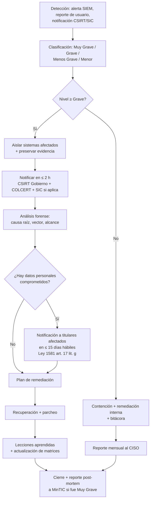

# 4. Seguridad de la Sede Electrónica

> **Audiencia objetivo:** ingeniero de seguridad y DevOps lead de una entidad pública colombiana.
> **Fuente primaria:** *Infografía sobre Componentes de seguridad para sedes electrónicas — Agencia Nacional Digital, MinTIC, 2022* (2 páginas, 12 criterios numerados 1–12). Las cuatro copias cargadas en el sandbox son idénticas entre sí (MD5 `9740495da3698e681828a96c28f2fea7`).
> **Convenciones:**
> - Cada criterio del PDF se mapea a un identificador `SEG-NNN` único, con cita literal de página y número de ítem del PDF.
> - Las afirmaciones técnicas que van más allá del PDF se marcan con `[A]` (inferencia) y se justifican contra documentación oficial (OWASP, RFC, NIST, MinTIC).
> - Severidad se evalúa con una escala cualitativa: **Crítica · Alta · Media · Baja** (definida en §4.1.3).

---

## 4.1 Modelo de amenaza (qué defiende y qué NO)

### 4.1.1 Activos a proteger

La Sede Electrónica maneja tres clases de activos; la priorización del control se hace sobre los dos primeros.

| # | Activo | Ejemplos concretos | Triada CIA priorizada |
|---|--------|--------------------|------------------------|
| A1 | Datos personales de ciudadanos | Nombres, cédulas, correos, datos biométricos (si aplica), PQRS, formularios de trámites | Confidencialidad + Integridad |
| A2 | Credenciales de funcionarios / operadores | Cuentas de backoffice, llaves de firma electrónica, tokens de integración GOV.CO | Confidencialidad + Autenticidad |
| A3 | Disponibilidad del servicio público | Trámites en línea, pagos PSE, autenticación ciudadana (carpeta ciudadana) | Disponibilidad + Integridad |

### 4.1.2 Amenazas consideradas (in-scope)

Las amenazas siguientes son las que el catálogo MinTIC/PDF ataca de manera explícita o implícita y, por tanto, las que la Sede Electrónica debe defender:

1. **Intercepción / eavesdropping** en tránsito (mitigada por TLS y flags de cookies — criterios 1, 5, 12).
2. **Ataques de fuerza bruta y credential stuffing** sobre los formularios de autenticación (mitigada por CAPTCHA y rate-limit — criterios 3, 4).
3. **Exposición de superficie** (puertos/servicios innecesarios, métodos HTTP peligrosos — criterios 2, 7).
4. **Inyección de código** vía parámetros de entrada (XSS reflejado/almacenado, SQLi, command injection — criterios 9, 10).
5. **Filtración de información** a través de mensajes de error detallados (criterio 11).
6. **Robo o modificación de archivos del servidor web** (criterio 8).
7. **Manipulación de cabeceras HTTP** (clickjacking, MIME-sniff, downgrade attacks — criterio 12).
8. **Deficiencias contractuales** en el tratamiento de datos personales (criterio 6, integrado con cumplimiento Habeas Data — §4.5).

### 4.1.3 Amenazas fuera del alcance (out-of-scope)

La Sede Electrónica **NO** está diseñada para mitigar, y por tanto debe declararlo y apoyarse en controles institucionales o de proveedores:

| Amenaza | Justificación de exclusión |
|---------|----------------------------|
| Ataques de ingeniería social sobre funcionarios (phishing dirigido, BEC) | Responsabilidad del MSPI institucional + campañas de concientización (Guía 14 MinTIC). |
| DDoS volumétrico >10 Gbps a nivel de red | Requiere servicio upstream (CDN con protección DDoS, ISP, scrubbing center). La Sede debe implementar WAF/CDN pero no garantiza mitigación de DDoS masivo. |
| APT (Advanced Persistent Threat) patrocinados | Requiere SOC 24/7, threat intel y EDR; alcance del CISO institucional. |
| Compromiso del endpoint del ciudadano (malware, keyloggers) | Responsabilidad del usuario final; la Sede puede reducir impacto con MFA pero no eliminarlo. |
| Insider threat con privilegios de administrador de BD | Compensar con segregación de funciones, audit logs y rotación de credenciales (A.9.2.5 ISO 27001:2022). |
| Vulnerabilidades de día-cero en stack no parchables | Resoluble con Virtual Patching en WAF y recompilación regular de la imagen base (Docker Hardened Images) — ver §4.7 `[A]`. |

### 4.1.4 Escala de severidad utilizada

Las severidades de la tabla §4.3 se asignan con esta escala, consistente con el MSPI/MinTIC:

| Severidad | Definición operativa |
|-----------|----------------------|
| **Crítica** | Compromete datos personales de forma masiva o permite takeover total del servidor. Bloquea el despliegue. |
| **Alta** | Permite comprometer cuentas individuales o datos sensibles; debe remediarse antes de salir a producción. |
| **Media** | Reduce la postura de seguridad, facilita ataques encadenados; debe remediarse en los primeros 30 días post-go-live. |
| **Baja** | Higiene / hardening; debe remediarse como mejora continua. |

---

## 4.2 Requisitos por capas

Esta sección expande los 12 criterios del PDF en requisitos verificables por capa técnica. Cada requisito se referencia a su criterio SEG-NNN.

### 4.2.1 Capa de transporte — Cifrado en tránsito (TLS)

| ID req. | Requisito | Origen |
|---------|-----------|--------|
| SEG-001-RT-01 | El certificado TLS debe ser **emitido por una CA reconocida** (no autofirmado en producción), cadena completa, OCSP/CRL accesible. | SEG-001 `[A]` |
| SEG-001-RT-02 | TLS mínimo 1.2; recomendado **TLS 1.3** (alineado con RFC 8446); cipher suites restringidos a AEAD (AES-GCM, ChaCha20-Poly1305). | SEG-001 `[A]` |
| SEG-001-RT-03 | Renovación automática del certificado (ACME/Let's Encrypt o PKI institucional) — expiración máxima 90 días para TLS público. | SEG-001 `[A]` |
| SEG-001-RT-04 | HSTS habilitado con `max-age ≥ 31536000` (1 año), `includeSubDomains`, `preload` (criterio 12, valor `Strict-Transport-Security`). | SEG-012 |
| SEG-001-RT-05 | Redirección 301 de HTTP → HTTPS en el balanceador/WAF (no a nivel aplicación). | SEG-001 `[A]` |

### 4.2.2 Capa de red — Puertos y exposición

| ID req. | Requisito | Origen |
|---------|-----------|--------|
| SEG-002-RN-01 | Inventario trimestral de puertos abiertos hacia internet usando `nmap`/Tenable desde una IP de prueba controlada; cierre de cualquier puerto no documentado en el catálogo de servicios. | SEG-002 |
| SEG-002-RN-02 | Reglas de firewall de ingress: **denegación por defecto**; sólo se permite 80/443 hacia el WAF, 22 restringido a bastion host corporativo, y los puertos de back-office (5432 Postgres, 6379 Redis) **NO expuestos a internet**. | SEG-002 `[A]` |
| SEG-002-RN-03 | Segmentación de red: subredes separadas para `web`, `app`, `db`, `mgmt`; reglas inter-segmento restrictivas. | SEG-002 `[A]` |

### 4.2.3 Capa de aplicación — Autenticación, sesión, autorización

| ID req. | Requisito | Origen |
|---------|-----------|--------|
| SEG-003-RA-01 | Toda página que captura datos de ciudadanía incluye CAPTCHA **invisible o interactivo** con challenge adaptativo (hCaptcha, reCAPTCHA v3, o equivalente). | SEG-003 |
| SEG-004-RA-01 | **Rate-limit de intentos fallidos de login**: tras N intentos (típico: 5 en 5 min) el endpoint devuelve HTTP 429; tras M fallos acumulados (típico: 10/24h) la cuenta se bloquea temporalmente. | SEG-004 |
| SEG-004-RA-02 | El bloqueo no es recuperable automáticamente hasta cumplir backoff exponencial; alerta al CISO si el patrón es distribuido (indicio de DDoS de autenticación). | SEG-004 `[A]` |
| SEG-004-RA-03 | Política de contraseñas consistente con NIST SP 800-63B-4 §5.1.1: mínimo 8 caracteres (15 recomendado para single-factor); sin reglas de composición forzada; verificación contra lista de contraseñas comprometidas (HIBP API o equivalente). | SEG-004 `[A]` |
| SEG-004-RA-04 | Toda cookie de sesión lleva los flags **`HttpOnly` + `Secure` + `SameSite=Lax` o `Strict`** (criterio 5). | SEG-005 |
| SEG-004-RA-05 | Tokens de sesión firmados con algoritmo moderno (HS256 mínimo, RS256/ES256 recomendado); expiración absoluta ≤ 30 min para datos sensibles, ≤ 8 h para operaciones estándar (alineado con AAL2 de NIST 800-63B). | SEG-004 `[A]` |
| SEG-004-RA-06 | Logout invalida el token server-side (lista de revocación o rotación de identificador); no basta con borrar la cookie del cliente. | SEG-004 `[A]` |

### 4.2.4 Capa de aplicación — Validación de entrada y sanitización

| ID req. | Requisito | Origen |
|---------|-----------|--------|
| SEG-009-RA-01 | Sanitización de **toda entrada** del usuario (URL params, body JSON, headers) eliminando: etiquetas HTML/JS, caracteres de control (`<`, `>`, `"`, `'`, `&`), saltos de línea y otros caracteres usados en payloads XSS. | SEG-009 |
| SEG-010-RA-01 | **Escape de variables en el motor de plantillas** (Twig, Blade, React JSX, etc.) — uso sistemático de `{{ var }}` con escape contextual (HTML, JS, URL, CSS, atributo). | SEG-010 |
| SEG-010-RA-02 | **Prepared statements / parameterized queries** en todo acceso a base de datos — NUNCA concatenación de strings SQL. | SEG-010 `[A]` |
| SEG-010-RA-03 | Validación por **allowlist** (no denylist) en endpoints de carga de archivos: tipo MIME real (`finfo`), extensión, tamaño máximo, almacenamiento fuera del webroot. | SEG-009 `[A]` |
| SEG-009-RA-04 | **CSP estricta** enviada vía cabecera (`Content-Security-Policy: default-src 'self'; script-src 'self' 'nonce-...'; object-src 'none'; base-uri 'self'`) — alineada con criterio 12. | SEG-012 `[A]` |

### 4.2.5 Capa de aplicación — Manejo de errores y logging

| ID req. | Requisito | Origen |
|---------|-----------|--------|
| SEG-011-RA-01 | En producción, mensajes de error genéricos al usuario ("Ha ocurrido un error, código de seguimiento XYZ") — sin stack traces, sin nombres de clases, sin versiones de framework. | SEG-011 |
| SEG-011-RA-02 | Los detalles del error se registran **server-side** con correlation-id y se correlacionan con el código entregado al usuario. | SEG-011 `[A]` |
| SEG-011-RA-03 | Logs centralizados (≥ 12 meses en caliente, ≥ 5 años en archivo) según Resolución 500/2021 art. 9 y trazabilidad exigida por Ley 1581/2012 art. 17. | SEG-011 `[A]` |
| SEG-011-RA-04 | Los logs **NO contienen** datos personales en claro ni secretos (tokens, contraseñas, llaves); aplicación de redacción/pseudonimización. | SEG-011 `[A]` |

### 4.2.6 Capa de transporte HTTP — Métodos y cabeceras

| ID req. | Requisito | Origen |
|---------|-----------|--------|
| SEG-007-RH-01 | **Deshabilitar los métodos HTTP `PUT`, `DELETE`, `TRACE`, `OPTIONS`** (excepto OPTIONS en endpoints CORS permitidos por catálogo explícito) — retornar `405 Method Not Allowed`. | SEG-007 |
| SEG-008-RH-01 | El servidor web se ejecuta con **usuario no-root** (UID 10001 típico en Docker); el filesystem del contenedor está montado `read-only` excepto `/tmp` y `/var/log`. | SEG-008 `[A]` |
| SEG-008-RH-02 | Permisos 0644 sobre archivos servidos y 0755 sobre directorios; propiedad `www-data:www-data` (o equivalente). | SEG-008 `[A]` |
| SEG-008-RH-03 | **Catálogo de cabeceras de seguridad** obligatorio (ver tabla 4.2.7). | SEG-012 |

### 4.2.7 Catálogo de cabeceras de seguridad (SEG-012)

Cabeceras exigidas por el criterio 12 del PDF, complementadas con valores recomendados por **OWASP Secure Headers Project** (https://owasp.org/www-project-secure-headers/) y la **OWASP HTTP Headers Cheat Sheet**.

| Cabecera | Valor recomendado | Estado OWASP | Notas |
|----------|-------------------|---------------|-------|
| `Content-Security-Policy` | `default-src 'self'; script-src 'self' 'nonce-{nonce}'; style-src 'self' 'nonce-{nonce}'; img-src 'self' data: https://www.gov.co; frame-ancestors 'none'; base-uri 'self'; form-action 'self'; object-src 'none'` | Activa | Reemplaza effectively a X-Frame-Options en navegadores modernos. **Es la cabecera más importante.** |
| `Strict-Transport-Security` | `max-age=63072000; includeSubDomains; preload` | Activa | RFC 6797. Habilitar **sólo** cuando el 100% del tráfico sea HTTPS. |
| `X-Content-Type-Options` | `nosniff` | Activa | Evita MIME-sniff. |
| `X-Frame-Options` | `DENY` | Activa (legado) | Cubierto por `frame-ancestors` en CSP; mantener para navegadores antiguos. |
| `X-XSS-Protection` | `0` | Deprecada | OWASP recomienda **explícitamente** `0` para desactivar el auditor XSS obsoleto y confiar en CSP. |
| `Referrer-Policy` | `strict-origin-when-cross-origin` | Activa | No fugar URLs internos al salir a dominios externos. |
| `Permissions-Policy` (antes `Feature-Policy`) | `geolocation=(), camera=(), microphone=() …` | Activa | Apaga APIs que la Sede no utiliza. |
| `Public-Key-Pins` (HPKP) | **No configurar** | Deprecada (Chrome 72, 2019) | Eliminada por Chrome y Firefox por riesgo de hostile-pinning / DoS. El PDF la cita (criterio 12) pero **la práctica actual es omitirla** `[A]`. Documentar decisión en ADR. |
| `Set-Cookie` | `Secure; HttpOnly; SameSite=Lax` (o `Strict`) | Activa | Vinculada al criterio 5. |

### 4.2.8 Capa de cumplimiento — Pie de página (SEG-006)

| ID req. | Requisito | Origen |
|---------|-----------|--------|
| SEG-006-RC-01 | El footer debe incluir enlaces visibles y operacionales a: (a) Términos y condiciones, (b) Política de seguridad y privacidad, (c) Protección y tratamiento de datos personales, (d) Política de cookies, (e) Derechos de autor y uso de contenidos. | SEG-006 |
| SEG-006-RC-02 | Cada enlace dirige a un documento PDF/HTML accesible y versionado, con fecha de última actualización y acto administrativo de adopción. | SEG-006 `[A]` |
| SEG-006-RC-03 | La política de tratamiento de datos cumple con los artículos 17 y 18 de la Ley 1581/2012 (responsable y encargado) y está inscrita en el **Registro Nacional de Bases de Datos — RNBD** ante la SIC. | §4.5 `[A]` |

### 4.2.9 Capa de respaldo — Copias de seguridad

| ID req. | Requisito | Origen |
|---------|-----------|--------|
| SEG-BAK-01 | Copia de seguridad **diaria** automatizada de la base de datos; **incremental cada 6 h** para sistemas con SLA de disponibilidad alto. | `[A]` (alineado con MinTIC MSPI y Resolución 500/2021 art. 17 etapa "recuperación y aprendizaje") |
| SEG-BAK-02 | Retención: ≥ 30 días en caliente, ≥ 1 año en archivo cifrado, alineado con Ley 1581/2012 art. 11 (caducidad) y plazos de prescripción de acciones administrativas. | `[A]` |
| SEG-BAK-03 | **Cifrado AES-256** de las copias en reposo (at-rest) con llaves custodiadas en KMS, separadas del servidor de base de datos. | `[A]` |
| SEG-BAK-04 | **Prueba de restauración trimestral** documentada en mesa de servicio; RPO ≤ 24 h, RTO ≤ 4 h (verificable en DR drill anual). | `[A]` |
| SEG-BAK-05 | Almacenamiento **off-site** (otra región/datacenter) para copias semanales — requisito del DRP. | `[A]` |
| SEG-BAK-06 | Inmutabilidad de backups (WORM / object-lock) durante la ventana de retención para resistir ransomware. | `[A]` |

---

## 4.3 Lista exhaustiva de criterios de aceptación

> Los 12 criterios numerados del PDF se reproducen **textualmente** en la columna "Criterio (texto del PDF)", con su ubicación exacta. La severidad, prueba y mitigación son interpretaciones técnicas respaldadas por fuentes públicas (ver columna "Origen de la severidad").

| ID | Criterio (texto del PDF) | Severidad | Evidencia PDF (página · número) | Prueba de verificación | Mitigación concreta | Origen de la severidad |
|----|--------------------------|-----------|----------------------------------|------------------------|---------------------|------------------------|
| **SEG-001** | "Se cuenta con un **CERTIFICADO SSL**, debidamente instalado y configurado." | **Crítica** | p. 1 · ítem 1 | `curl -vI https://<sede> 2>&1 \| grep -i 'subject\\|issuer\\|expire\\|TLS'` debe mostrar CA reconocida y fecha de expiración ≥ 30 días. Test SSL Labs A o A+. | TLS 1.2/1.3, certificado válido, cadena completa, OCSP stapling, renovación automática. | OWASP A02:2021 Cryptographic Failures |
| **SEG-002** | "Se valida frecuentemente el uso y la exposición de los **PUERTOS ABIERTOS** hacia internet, garantizando que estén filtrados correctamente." | **Alta** | p. 1 · ítem 2 | Escaneo `nmap` mensual desde IP autorizada; checklist firmado por CISO; reglas de firewall documentadas en runbook. | Segmentación de red + denegación por defecto + WAF + catálogos de servicios. | OWASP A05:2021 Security Misconfiguration |
| **SEG-003** | "Para el uso de **MÉTODOS DE AUTENTICACIÓN**, se cuenta con un control tipo **CAPTCHA** en todos los formularios donde capturamos datos de la ciudadanía." | **Alta** | p. 1 · ítem 3 | Inspección de todos los formularios: presencia de widget CAPTCHA y validación server-side del token. | CAPTCHA adaptativo (hCaptcha o reCAPTCHA v3) en login, PQRS, registro, recuperación de contraseña. | OWASP A07:2021 Identification & Auth Failures |
| **SEG-004** | "Se cuenta con el elemento control de **tasa de reintentos por Login fallido** para evitar ataques o intentos de adivinar las contraseñas o nombres de usuarios débiles y DDoS (Denegación de servicios)." | **Crítica** | p. 1 · ítem 4 | Pruebas de fuerza bruta (Hydra, Burp Intruder): tras 5 fallos en 5 min el endpoint debe responder 429. Cuenta bloqueada tras 10 fallos/día. | Rate-limit en WAF (fail2ban, ModSecurity) + backoff exponencial + alerta SOC. | OWASP A07:2021 + NIST SP 800-63B §5.2.2 |
| **SEG-005** | "Se validan los atributos tipo Flag del **HttpOnly y Secure**, para que, en el **USO DE COOKIES**, se desplacen de manera segura entre la aplicación y el servidor web para que no sean captados por un usuario malicioso que pudiera estar 'escuchando' los datos transmitidos." | **Crítica** | p. 1 · ítem 5 | `curl -I https://<sede>` y captura de `Set-Cookie`: debe contener `HttpOnly`, `Secure`, `SameSite`. | Middleware que fuerza los flags; scanner automatizado en CI. | OWASP A05:2021 + RFC 6265 §4.1.1 |
| **SEG-006** | "Incorporamos una sección en la barra inferior (footer), con la documentación asociada al cumplimiento de las siguientes políticas: a. Términos y condiciones de uso. b. Seguridad y Privacidad. c. Protección y tratamiento de datos personales. d. Uso de Cookies. e. Derechos de Autor y uso sobre contenidos." | **Alta** | p. 1 · ítem 6 | Inspección visual + verificación de que cada enlace resuelve (HTTP 200) a un documento vigente y firmado por representante legal. | Plantilla de footer institucional; revisión legal trimestral. | Ley 1581/2012 + Ley 1712/2014 (Transparencia) |
| **SEG-007** | "Se deshabilitan los **métodos peligrosos** como PUT, DELETE, TRACE, OPTIONS en la comunicación HTTP." | **Alta** | p. 2 · ítem 7 | `curl -X PUT -X DELETE -X TRACE -X OPTIONS https://<sede>` deben devolver 405/403, no 200. | Configuración explícita del servidor web / balanceador (nginx, Apache, IIS) y/o WAF. | OWASP A05:2021 Security Misconfiguration |
| **SEG-008** | "Se restringe la **escritura de archivos** en el servidor web a través de la asignación de permisos de solo lectura." | **Alta** | p. 2 · ítem 8 | Inspección del contenedor: `find / -writable -type f` debe devolver sólo `/tmp`, `/var/log/app` y similares permitidos. Permisos 0644/0755. | Imagen Docker con filesystem `read_only: true`, `cap_drop: ALL`, usuario no-root UID 10001. | OWASP A05:2021 + CIS Docker Benchmark |
| **SEG-009** | "Se aplican técnicas de **sanitización de parámetros de entrada** mediante la eliminación de etiquetas, saltos de línea, espacios en blanco y otros caracteres especiales que comúnmente conforman un «script»." | **Crítica** | p. 2 · ítem 9 | Test de XSS con payloads estándar (`<script>alert(1)</script>`, ``, polyglot GBXSS) — todos deben ser bloqueados o neutralizados. | Sanitización por allowlist (HTMLPurifier, DOMPurify, OWASP Java Encoder) + CSP estricta. | OWASP A03:2021 Injection (XSS) |
| **SEG-010** | "Se realiza la **sanitización de caracteres especiales** (secuencia de escape de variables en el código de programación)." | **Crítica** | p. 2 · ítem 10 | Auditoría de código: ninguna concatenación de SQL/templates. Pruebas con sqlmap. | Escape contextual en plantillas + prepared statements + ORM con binding. | OWASP A03:2021 Injection (SQLi/NoSQLi/LDAPi/CMDi) |
| **SEG-011** | "Se implementan **mensajes de error genéricos** que no revelen información acerca de la tecnología usada, excepciones o parámetros que disparen el error específico." | **Media** | p. 2 · ítem 11 | `curl -X POST -H "Content-Type: text/xml" --data "<invalid" https://<sede>/api/x` debe devolver JSON genérico, sin stack traces. | Variable `APP_ENV=production`, modo debug desactivado, middleware de error con correlation-id. | OWASP A04:2021 Insecure Design + A05:2021 |
| **SEG-012** | "Se habilitan las **cabeceras de seguridad** para el envío de información entre el navegador y el servidor web, entre otras: Content-Security-Policy (CSP), X-Content-Type-Options, X-Frame-Options, X-XSS-Protection, Strict-Transport-Security (HSTS), Public-Key-Pins (HPKP) Referrer-Policy, Feature-Policy, para cookies habilitar secure y HttpOnly." | **Alta** | p. 2 · ítem 12 | `curl -I https://<sede>` muestra todas las cabeceras de §4.2.7. Verificación adicional: securityheaders.com grado A o superior. | Middleware de cabeceras (`helmet` en Node, `secure_headers` en Rails, `SecurityHeadersMiddleware` en Laravel). | OWASP Secure Headers Project |

### 4.3.1 Criterios derivados (no presentes literalmente en el PDF, marcados como `[A]`)

Estos criterios son necesarios para completar la postura de seguridad pero **no aparecen explícitamente** en el PDF fuente; se infieren a partir de OWASP/MSPI/NIST.

| ID | Criterio | Severidad | Origen de la inferencia |
|----|----------|-----------|--------------------------|
| **SEG-013** | `[A]` Logs centralizados con correlación y retención mínima de 12 meses (eventos de autenticación, acceso a datos personales, cambios de configuración). | **Alta** | MinTIC MSPI (Guía 4 Procedimientos) + Resolución 500/2021 art. 17 + Ley 1581 art. 17. |
| **SEG-014** | `[A]` Copias de seguridad cifradas con prueba de restauración trimestral (RPO ≤ 24 h, RTO ≤ 4 h). | **Alta** | MinTIC MSPI (Guía 10 Continuidad) + NIST SP 800-34. |
| **SEG-015** | `[A]` Escaneo de vulnerabilidades automatizado en CI (SCA + SAST + DAST) antes de cada despliegue a producción. | **Alta** | OWASP SAMM + ISO 27001:2022 A.8.8. |
| **SEG-016** | `[A]` MFA obligatoria para funcionarios con acceso a datos personales o funciones administrativas. | **Crítica** | NIST SP 800-63B AAL2 + Decreto 2106/2019 art. 14. |
| **SEG-017** | `[A]` Container image base firmada (cosign) y SBOM publicado por cada release. | **Media** | OWASP A06:2021 Vulnerable & Outdated Components + SLSA L3. |
| **SEG-018** | `[A]` Endpoint `/api/health` y `/api/ready` sin datos sensibles, accesibles sólo desde el balanceador interno (no públicamente). | **Media** | Higiene operativa; evita exposición de stack en healthchecks. |

---

## 4.4 OWASP Top 10 — mapeo a criterios del PDF

Cruce entre los **OWASP Top 10:2021** (fuente: <https://owasp.org/Top10/2021/>) y los criterios `SEG-NNN`:

| Categoría OWASP Top 10:2021 | Criterios PDF / derivados que la mitigan | Controles técnicos asociados |
|------------------------------|--------------------------------------------|-------------------------------|
| **A01:2021 – Broken Access Control** | SEG-013, SEG-016 `[A]` | RBAC, deny-by-default, middleware de autorización por ruta, pruebas de IDOR. |
| **A02:2021 – Cryptographic Failures** | **SEG-001**, SEG-005, SEG-014 `[A]` | TLS 1.3, AES-256 en reposo, KMS separado, algoritmos aprobados (AES-GCM, ChaCha20-Poly1305, RSA-2048+, ECDSA P-256+, SHA-256+). |
| **A03:2021 – Injection** | **SEG-009**, **SEG-010** | Escape contextual, prepared statements, allowlist de validación, CSP estricta. |
| **A04:2021 – Insecure Design** | **SEG-011**, SEG-006 | Modelado de amenazas en diseño, mensajes genéricos, principio de mínimo privilegio. |
| **A05:2021 – Security Misconfiguration** | **SEG-002**, **SEG-005**, **SEG-007**, **SEG-008**, **SEG-011**, **SEG-012** | Hardening de servidor/contenedor, denegación por defecto, métodos HTTP restringidos, permisos de sólo lectura, cabeceras, mensajes genéricos. |
| **A06:2021 – Vulnerable & Outdated Components** | SEG-015 `[A]`, SEG-017 `[A]` | SCA (Trivy, Grype, npm-audit), SBOM, pinning de versiones, Docker Hardened Images, recompilación periódica. |
| **A07:2021 – Identification and Authentication Failures** | **SEG-003**, **SEG-004**, SEG-016 `[A]` | CAPTCHA, rate-limit, MFA (AAL2 NIST), password manager-friendly, bloqueo de cuentas, breach-check (HIBP). |
| **A08:2021 – Software and Data Integrity Failures** | SEG-017 `[A]`, SEG-015 `[A]` | Firmas cosign, SLSA L3, pipeline CI firmado, verificación de checksums de dependencias. |
| **A09:2021 – Security Logging and Monitoring Failures** | **SEG-011**, SEG-013 `[A]` | Logs centralizados con SIEM, alertas sobre eventos A01/A03/A07, correlation-id. |
| **A10:2021 – Server-Side Request Forgery (SSRF)** | SEG-002, SEG-009 `[A]` | Allowlist de destinos en integraciones, segmentación, validación de URLs salientes. |

> **Diagrama Mermaid — relación OWASP ↔ criterios:**
>
> ```mermaid
> graph LR
>   subgraph OWASP["OWASP Top 10:2021"]
>     A01[A01 Broken Access]
>     A02[A02 Crypto Failures]
>     A03[A03 Injection]
>     A04[A04 Insecure Design]
>     A05[A05 Security Misconfig]
>     A06[A06 Vulnerable Components]
>     A07[A07 Auth Failures]
>     A08[A08 Integrity Failures]
>     A09[A09 Logging Failures]
>     A10[A10 SSRF]
>   end
>   subgraph SEG["Criterios SEG-NNN"]
>     S01[SEG-001 TLS]
>     S02[SEG-002 Puertos]
>     S03[SEG-003 CAPTCHA]
>     S04[SEG-004 Rate-limit]
>     S05[SEG-005 Cookies]
>     S06[SEG-006 Footer]
>     S07[SEG-007 Métodos HTTP]
>     S08[SEG-008 Permisos FS]
>     S09[SEG-009 Sanitización entrada]
>     S10[SEG-010 Escape variables]
>     S11[SEG-011 Errores genéricos]
>     S12[SEG-012 Cabeceras]
>   end
>   A01 --> SEG-013
>   A02 --> S01
>   A02 --> S05
>   A03 --> S09
>   A03 --> S10
>   A04 --> S11
>   A04 --> S06
>   A05 --> S02
>   A05 --> S05
>   A05 --> S07
>   A05 --> S08
>   A05 --> S11
>   A05 --> S12
>   A06 --> SEG-015
>   A06 --> SEG-017
>   A07 --> S03
>   A07 --> S04
>   A08 --> SEG-015
>   A08 --> SEG-017
>   A09 --> S11
>   A09 --> SEG-013
>   A10 --> S02
>   A10 --> S09
> ```

---

## 4.5 Cumplimiento normativo

### 4.5.1 Habeas Data — Ley 1581 de 2012 y Decreto 1377 de 2013

| Obligación | Implementación en la Sede | Criterio SEG |
|------------|---------------------------|--------------|
| Autorización previa, expresa e informada del titular para tratamiento de datos personales (art. 9). | Checkbox obligatorio en cada formulario con enlace a la política + bitácora de consentimientos versionados (con timestamp, IP, hash del documento). | SEG-006, SEG-013 `[A]` |
| Política de Tratamiento de Datos Personales publicada (art. 13 Decreto 1377/2013). | Documento accesible desde el footer (SEG-006.b), con fechas de vigencia y datos del Responsable/Encargado. | SEG-006 |
| Aviso de **cookies** con opt-in para cookies no estrictamente necesarias (art. 4 lit. f — acceso y circulación restringida). | Banner de cookies con categorías (estrictas, analíticas, funcionales) y rechazo granular. | SEG-005, SEG-006 |
| Inscripción de las bases de datos en el **Registro Nacional de Bases de Datos (RNBD)** de la SIC (art. 25 Ley 1581). | Inventario de BD actualizado anualmente; responsables designados. | SEG-013 `[A]` |
| Derechos del titular (conocer, actualizar, rectificar, suprimir, revocar) — canal visible y operativo (art. 8). | Sección "Protección de datos" en el footer con formulario PQRS-D y enlace a Servilínea SIC para quejas. | SEG-006 |
| Medidas de seguridad necesarias para impedir adulteración, pérdida, consulta o acceso no autorizado o fraudulento (art. 17 lit. b para Responsable; art. 18 lit. b para Encargado). | Todo el catálogo SEG-001 a SEG-018 + ISO 27001 A.8 (ver §4.5.2). | SEG-001 a SEG-018 |
| Deber de **reportar a la SIC** incidentes que afecten datos personales (cuando se considere grave o masivo). | Procedimiento documentado en §4.6 + checklist §4.7. | SEG-013 `[A]` |

### 4.5.2 ISO/IEC 27001:2022 (alineamiento)

> Nota: ISO 27001 **no es obligatorio** para entidades públicas colombianas en términos de certificación; sin embargo, el MSPI de MinTIC adopta el Anexo A de ISO 27001:2022 como catálogo de referencia (Resolución 500/2021 art. 5, Anexo 1). Se recomienda aspirar a la certificación si la entidad maneja datos sensibles o es operador de infraestructura crítica.

| Anexo A ISO 27001:2022 | Control | Criterio(s) SEG |
|--------------------------|---------|------------------|
| A.5.15 | Control de acceso | SEG-002, SEG-016 `[A]` |
| A.5.16 | Gestión de derechos de acceso | SEG-013, SEG-016 `[A]` |
| A.5.17 | Información de autenticación | SEG-003, SEG-004, SEG-005 |
| A.8.2 | Privilegios de acceso | SEG-008 `[A]`, SEG-016 `[A]` |
| A.8.5 | Autenticación segura | SEG-003, SEG-004, SEG-016 `[A]` |
| A.8.8 | Gestión de vulnerabilidades técnicas | SEG-015 `[A]`, SEG-017 `[A]` |
| A.8.23 | Filtrado web | SEG-002, SEG-007 |
| A.8.24 | Uso de criptografía | SEG-001, SEG-014 `[A]` |
| A.8.28 | Codificación segura | SEG-009, SEG-010, SEG-015 `[A]` |
| A.8.29 | Pruebas de seguridad en desarrollo y aceptación | SEG-015 `[A]` |
| A.5.28 | Recopilación de evidencia | SEG-013 `[A]` |
| A.5.37 | Documentación de procedimientos de operación | §4.6 (Plan de respuesta a incidentes) |
| A.8.16 | Actividades de monitorización | SEG-013 `[A]` |
| A.8.34 | Protección de información durante auditoría de pruebas | SEG-015 `[A]` (entornos de staging con datos sintéticos) |

### 4.5.3 MinTIC — Modelo de Seguridad y Privacidad de la Información (MSPI)

- **Resolución 500 de 2021** (MinTIC): adopta el MSPI como habilitador de la Política de Gobierno Digital. Art. 17 establece 4 etapas: (1) Prevención, (2) Protección y detección, (3) Respuesta y comunicación, (4) Recuperación y aprendizaje. La Sede Electrónica debe documentar su participación en cada etapa (ver §4.6).
- **Resolución 1519 de 2020** (MinTIC): estándares y directrices para publicar información en sedes electrónicas — la Sede debe cumplir el Anexo 1 (transparencia pasiva y activa) y el Anexo 2 (accesibilidad, usabilidad, seguridad).
- **Guía 21 MinTIC — Gestión de Incidentes**: procedimientos y plantillas para reportar incidentes al CSIRT/COLCERT.

### 4.5.4 Superintendencia de Industria y Comercio (SIC)

- **Delegatura para la Protección de Datos Personales** — autoridad de control del cumplimiento de la Ley 1581/2012 (art. 19).
- Funciones relevantes para la Sede Electrónica: vigilar el cumplimiento, adelantar investigaciones, disponer bloqueo temporal de datos, impartir instrucciones, administrar el RNBD, proferir declaraciones de conformidad sobre transferencias internacionales de datos.
- **Sanciones (art. 23 Ley 1581):** multas de hasta 2.000 SMLMV ($2.700M+ en 2026), suspensión de operaciones, cierre de la base de datos. La Sede debe, por tanto, minimizar la superficie de incumplimiento con la matriz SEG completa.

### 4.5.5 Circular Única de la SIC y Circular Externa 04/2019

- **Circular Externa 04/2019** de la SIC: lineamientos específicos para el **tratamiento de datos personales en sistemas de información interoperables** — directamente aplicable a Sedes Electrónicas que interoperan con GOV.CO, Carpeta Ciudadana, PSE, RNEC, etc. El responsable debe documentar el intercambio de datos y verificar que existe base legal para cada flujo.

---

## 4.6 Plan de respuesta a incidentes (alineado con Resolución 500/2021)

### 4.6.1 Clasificación de incidentes (Resolución 500/2021 art. 9 numerales 3 y 4)

| Nivel | Definición operativa | Reporte obligatorio |
|-------|----------------------|---------------------|
| **Muy Grave** | Compromiso masivo de datos personales, interrupción de servicios esenciales > 24 h, ransomware con exfiltración, takeover de administrador. | **Inmediato** al CSIRT Gobierno + COLCERT + SIC si afecta datos personales. |
| **Grave** | Compromiso individual de cuentas con privilegios, defacement, exfiltración < 1.000 registros, DDoS que cause indisponibilidad > 1 h. | **Inmediato** al CSIRT Gobierno. SIC si hay datos personales comprometidos. |
| **Menos Grave** | Escaneo de puertos masivos, intentos de phishing reportados por usuarios, detección de malware en endpoint de funcionario. | Formulario web del CSIRT una vez gestionado. |
| **Menor** | Falsos positivos, eventos aislados sin impacto, alertas de bajo riesgo. | Bitácora interna; revisión mensual. |

### 4.6.2 CSIRT / COLCERT — datos de contacto oficiales

| Organización | Canal | Uso |
|--------------|-------|-----|
| **CSIRT Gobierno** | Formulario web en `https://www.csirtgobierno.gov.co/` (canal principal); `contacto@csirtgobierno.gov.co` | Reporte de incidentes Muy Graves y Graves de entidades del Estado. |
| **COLCERT — Grupo de Respuesta a Emergencias Cibernéticas de Colombia** | `contacto@colcert.gov.co`; PGP `0x8B134C7E`; muestras de malware a `muestras@colcert.gov.co` con PGP `0xEE3184F1`. Tel: +57 601 344 34 60 / 01-800-0914014. | Reporte de incidentes críticos + coordinación nacional. |
| **SIC — Delegatura de Protección de Datos** | `servilinea@sic.gov.co`; https://servicioslinea.sic.gov.co/servilinea/PQRSF | Incidentes que afecten datos personales (art. 17 lit. b Ley 1581). |
| **CC-CSIRT Policía Nacional** | https://cc-csirt.policia.gov.co/alertas-tips | Reporte de phishing y denuncias penales por ciberdelito (Ley 1273/2009). |

### 4.6.3 Procedimiento de respuesta (alineado con NIST SP 800-61r2 + Resolución 500/2021)



### 4.6.4 Roles del equipo de respuesta

| Rol | Responsable | Contacto típico |
|-----|-------------|-----------------|
| **Coordinador de respuesta** | CISO o quien haga sus veces (Resolución 500/2021 art. 9 numeral 2). | `ciso@entidad.gov.co` |
| **Líder técnico** | Ingeniero de seguridad de la Sede. | `seguridad@entidad.gov.co` |
| **Líder de comunicaciones** | Oficina de comunicaciones (sólo voceros autorizados). | `comunicaciones@entidad.gov.co` |
| **Enlace legal** | Oficina jurídica (Ley 1581 art. 17 g — notificación a titulares). | `juridica@entidad.gov.co` |
| **Enlace con autoridades** | Director/Representante Legal — único autorizado para reportar a MinTIC/Policía/Fiscalía (Resolución 2239/2024 MinTIC, art. 4). | Despacho |

### 4.6.5 SLAs de respuesta

| Nivel | Tiempo de contención | Tiempo de notificación a autoridades | Tiempo de notificación a titulares |
|-------|----------------------|--------------------------------------|------------------------------------|
| Muy Grave | ≤ 1 h | ≤ 2 h | ≤ 15 días hábiles |
| Grave | ≤ 4 h | ≤ 8 h | ≤ 30 días hábiles |
| Menos Grave | ≤ 24 h | Cierre + reporte | N/A salvo solicitud |
| Menor | ≤ 72 h | Bitácora mensual | N/A |

### 4.6.6 Inventario de evidencias y cadena de custodia

Toda respuesta sigue el lineamiento de la **Guía 13 MinTIC — Evidencia Digital**: hash SHA-256 antes y después de la adquisición, almacenamiento en contenedor de sólo lectura, bitácora con custodio y timestamp.

---

## 4.7 Lista de comprobación pre-producción

> Cada ítem referencia el criterio SEG-NNN que lo origina. Marcar **Sí / No / N/A** y adjuntar evidencia (captura, log, hash, URL).

### 4.7.1 Capa de transporte (SEG-001)

- [ ] Certificado TLS vigente, CA reconocida, cadena completa (no autofirmado).
- [ ] TLS mínimo 1.2 habilitado; TLS 1.3 recomendado.
- [ ] Renovación automática configurada (ACME o PKI).
- [ ] HSTS activo con `max-age ≥ 31536000`, `includeSubDomains`, `preload`.
- [ ] Redirección 301 HTTP → HTTPS en balanceador.
- [ ] Resultado en **SSL Labs: A o A+**.
- [ ] Resultado en **securityheaders.com: grado A o superior**.

### 4.7.2 Capa de red (SEG-002)

- [ ] Escaneo `nmap` documentado y firmado por CISO en los últimos 90 días.
- [ ] Sólo puertos 80/443 (WAF) y 22 (bastion) abiertos a internet.
- [ ] PostgreSQL/Redis/Mongo **no expuestos** públicamente.
- [ ] Reglas de firewall versionadas en IaC (Terraform/CloudFormation).
- [ ] Segmentación web/app/db/mgmt documentada.

### 4.7.3 Capa de aplicación — autenticación (SEG-003, SEG-004)

- [ ] CAPTCHA presente en TODOS los formularios que capturan datos ciudadanos (login, PQRS, registro).
- [ ] Rate-limit verificado: 5 fallos/5 min → HTTP 429.
- [ ] Bloqueo de cuenta tras 10 fallos/día con backoff exponencial.
- [ ] Política de contraseñas alineada con NIST SP 800-63B-4 (≥ 8 chars, sin reglas de composición, breach-check).
- [ ] MFA habilitada para funcionarios con acceso a datos personales o admin (SEG-016).
- [ ] Logs de autenticación centralizados (éxitos y fallos) — SEG-013.

### 4.7.4 Capa de aplicación — sesión y cookies (SEG-005)

- [ ] Toda cookie lleva `HttpOnly`, `Secure`, `SameSite=Lax` o `Strict`.
- [ ] Nombre de cookie de sesión no revela tecnología (`PHPSESSID`, `JSESSIONID`, `connect.sid` — renombrar a `__Host-sede-session` o equivalente).
- [ ] Timeout absoluto de sesión ≤ 30 min para datos sensibles.
- [ ] Logout invalida el token server-side.

### 4.7.5 Capa de aplicación — validación de entrada (SEG-009, SEG-010)

- [ ] Auditoría de código: **cero** concatenaciones SQL sin parametrizar.
- [ ] Escape contextual en todas las plantillas.
- [ ] Test XSS automatizado (ZAP, Burp) ejecutado en staging — 0 hallazgos críticos.
- [ ] Test SQLi automatizado (sqlmap) — 0 hallazgos críticos.
- [ ] Carga de archivos validada por allowlist (MIME real, extensión, tamaño).
- [ ] CSP estricta enviada en todas las respuestas.

### 4.7.6 Capa de aplicación — errores y logs (SEG-011, SEG-013)

- [ ] `APP_ENV=production` (sin modo debug).
- [ ] Mensajes de error genéricos al usuario con correlation-id.
- [ ] Detalles del error sólo en logs server-side.
- [ ] Logs centralizados en SIEM (Elastic, Splunk, Datadog, etc.).
- [ ] Retención de logs ≥ 12 meses en caliente.
- [ ] Redacción de PII y secretos en logs.
- [ ] Alertas activas sobre eventos A01/A03/A07 OWASP.

### 4.7.7 Capa de servidor web (SEG-007, SEG-008, SEG-012)

- [ ] Métodos `PUT`, `DELETE`, `TRACE`, `OPTIONS` deshabilitados (verificado con `curl -X`).
- [ ] Cabeceras de seguridad presentes (ver §4.2.7).
- [ ] `X-XSS-Protection: 0` enviado explícitamente (OWASP Secure Headers).
- [ ] `Public-Key-Pins` **NO** configurado (HPKP deprecada, ver §4.2.7).
- [ ] Contenedor ejecuta usuario no-root (UID 10001).
- [ ] Filesystem `read_only: true` excepto `/tmp`, `/var/log`.
- [ ] Permisos 0644/0755 sobre archivos servidos.
- [ ] Imagen base firmada (cosign), SBOM publicado, digest pinned (SEG-017).

### 4.7.8 Cumplimiento (SEG-006 + §4.5)

- [ ] Footer con los 5 enlaces del criterio 6, todos HTTP 200.
- [ ] Política de Tratamiento de Datos Personales vigente (Ley 1581).
- [ ] Bases de datos inscritas en el RNBD ante la SIC.
- [ ] Banner de cookies con opt-in granular (no essential cookies sin consentimiento).
- [ ] Procedimiento documentado para atender derechos ARCO en ≤ 15 días hábiles.

### 4.7.9 Copias de seguridad (SEG-014 `[A]`)

- [ ] Backup diario automatizado + verificación de éxito.
- [ ] Cifrado AES-256 en reposo con llaves en KMS separado.
- [ ] Almacenamiento off-site (otra región o datacenter).
- [ ] Inmutabilidad (WORM/object-lock) durante la ventana de retención.
- [ ] Prueba de restauración ejecutada en los últimos 90 días, firmada por CISO.
- [ ] DRP documentado con RPO ≤ 24 h y RTO ≤ 4 h.

### 4.7.10 Pipeline de desarrollo (SEG-015, SEG-017 `[A]`)

- [ ] SCA (Trivy/Grype) sin vulnerabilidades Críticas/Altas en dependencias de producción.
- [ ] SAST (Semgrep/SonarQube) sin hallazgos críticos.
- [ ] DAST (OWASP ZAP) ejecutado en staging antes de cada release.
- [ ] Pipeline firmado (SLSA L3), imagen firmada con cosign.
- [ ] Despliegues a producción requieren **dos aprobaciones** (desarrollador + líder de seguridad).

### 4.7.11 Plan de respuesta (ver §4.6)

- [ ] Procedimiento de gestión de incidentes documentado y socializado.
- [ ] Datos de contacto de CSIRT, COLCERT, SIC, CC-CSIRT Policía en runbook.
- [ ] DR drill anual ejecutado en los últimos 12 meses.
- [ ] Bitácora de incidentes actualizada y firmada por CISO.
- [ ] Plantilla de notificación a titulares Ley 1581 art. 17 g aprobada por Oficina Jurídica.

---

## Referencias

### Fuentes primarias (PDF cargado en el sandbox)

| ID | Documento | Ruta en sandbox | MD5 |
|----|-----------|-----------------|-----|
| P-S-01 | *Criterios de aceptación de seguridad para tu sede electrónica* — MinTIC / Agencia Nacional Digital (2022), 2 páginas, 12 criterios. | `/workspace/attachments/2f7ff2ee24bca6c7/Criterios de aceptación de seguridad para tu sede electrónica.pdf` | `9740495da3698e681828a96c28f2fea7` |
| P-S-02 | Idéntica a P-S-01 (respaldo). | `/workspace/attachments/fe2ecd8b464a0265/Criterios de aceptación de seguridad para tu sede electrónica.pdf` | `9740495da3698e681828a96c28f2fea7` |
| P-S-03 | Idéntica a P-S-01 (respaldo, renombrada con "(1)"). | `/workspace/attachments/4802c6c819d3cc47/Criterios de aceptación de seguridad para tu sede electrónica (1).pdf` | `9740495da3698e681828a96c28f2fea7` |
| P-S-04 | Idéntica a P-S-01 (respaldo, renombrada con "(1)"). | `/workspace/attachments/c5eb092ceda3bb61/Criterios de aceptación de seguridad para tu sede electrónica (1).pdf` | `9740495da3698e681828a96c28f2fea7` |

> Las cuatro copias son idénticas bit a bit. Se cita P-S-01 como principal y las demás como respaldo; la numeración de páginas/items es la misma.

### Normativa colombiana

| Ref. | Documento | URL oficial |
|------|-----------|-------------|
| N-01 | **Ley 1581 de 2012** — *Por la cual se dictan disposiciones generales para la protección de datos personales*. Congreso de la República. DO 48587. | https://www.alcaldiabogota.gov.co/sisjur/normas/Norma1.jsp?i=49981 |
| N-02 | **Decreto 1377 de 2013** — Reglamentación parcial de la Ley 1581/2012. | (compilado en Decreto 1078/2015) |
| N-03 | **Ley 1712 de 2014** — Ley de Transparencia y Acceso a la Información Pública. | (compilada en normograma MinTIC) |
| N-04 | **Resolución 500 de 2021** — MinTIC, *Por la cual se establecen los lineamientos y estándares para la estrategia de seguridad digital y se adopta el MSPI*. DO 51.619. | https://normograma.mintic.gov.co/mintic/compilacion/docs/resolucion_mintic_0500_2021.htm |
| N-05 | **Resolución 1519 de 2020** — MinTIC, *Estándares y directrices para publicar información en sedes electrónicas*. | (compilada en MinTIC) |
| N-06 | **Resolución 2239 de 2024** — MinTIC, *Política General de Seguridad y Privacidad de la Información del Ministerio/Fondo Único de TIC*. | https://normograma.mintic.gov.co/mintic/compilacion/docs/resolucion_mintic_2239_2024.htm |
| N-07 | **Circular Externa 04 de 2019** — SIC, *Tratamiento de datos personales en sistemas de información interoperables*. | https://cancilleria.gov.co/normograma/compilacion/docs/circular_superindustria_0004_2019.htm |
| N-08 | **Decreto 2106 de 2019** — *Dicta normas para simplificar, suprimir y reformar trámites, procesos y procedimientos innecesarios*. Art. 14 sobre autenticación digital. | (citado en §1 — Marco normativo) |
| N-09 | **Constitución Política de Colombia** — arts. 15 (intimidad / habeas data), 20 (información), 209 (función administrativa), 269 (responsabilidad de servidores). | (citado en MSPI) |

### Estándares y guías técnicas

| Ref. | Documento | URL |
|------|-----------|-----|
| T-01 | **OWASP Top 10:2021** — *The Ten Most Critical Web Application Security Risks*. | https://owasp.org/Top10/2021/ |
| T-02 | **OWASP Secure Headers Project** — *Response Headers*. | https://owasp.github.io/www-project-secure-headers/response-headers/ |
| T-03 | **OWASP HTTP Headers Cheat Sheet**. | https://cheatsheetseries.owasp.org/cheatsheets/HTTP_Headers_Cheat_Sheet.html |
| T-04 | **NIST SP 800-63B-4** — *Digital Identity Guidelines: Authentication and Lifecycle Management* (revisión 4 vigente desde 2025-08-01). | https://pages.nist.gov/800-63-4/sp800-63b.html |
| T-05 | **NIST SP 800-61r2** — *Computer Security Incident Handling Guide*. | https://nvlpubs.nist.gov/nistpubs/SpecialPublications/NIST.SP.800-61r2.pdf |
| T-06 | **RFC 6797** — *HTTP Strict Transport Security (HSTS)*. | https://datatracker.ietf.org/doc/html/rfc6797 |
| T-07 | **RFC 6265** — *HTTP State Management Mechanism (Cookies)*. | https://datatracker.ietf.org/doc/html/rfc6265 |
| T-08 | **RFC 8446** — *The Transport Layer Security (TLS) Protocol Version 1.3*. | https://datatracker.ietf.org/doc/html/rfc8446 |
| T-09 | **ISO/IEC 27001:2022** — *Information security, cybersecurity and privacy protection — Information security management systems — Requirements*. | https://www.iso.org/standard/27001 |
| T-10 | **CIS Docker Benchmark** — *Docker security best practices*. | https://www.cisecurity.org/benchmark/docker |

### Documentos institucionales (Colombia)

| Ref. | Documento | URL |
|------|-----------|-----|
| I-01 | **Documento Maestro del MSPI** — MinTIC, V 5.0 (21/04/2025). | https://gobiernodigital.mintic.gov.co/692/articles-401770_recurso_1.pdf |
| I-02 | **Modelo de Seguridad y Privacidad de la Información** — MinTIC (versión histórica). | https://mintic.gov.co/gestionti/615/articles-5482_Modelo_de_Seguridad_Privacidad.pdf |
| I-03 | **CSIRT Gobierno** — MinTIC. | https://www.csirtgobierno.gov.co/ |
| I-04 | **ColCERT** — Grupo de Respuesta a Emergencias Cibernéticas de Colombia. | https://www.colcert.gov.co/ |
| I-05 | **CC-CSIRT Policía Nacional** — *Alertas y tips*. | https://cc-csirt.policia.gov.co/alertas-tips |
| I-06 | **SIC — Delegatura para la Protección de Datos Personales**. | https://www.sic.gov.co/ |

### Notas finales sobre la metodología de citación

1. Cada criterio `SEG-NNN` con numeración 001–012 cita explícitamente **página y número de ítem** del PDF (p. 1 · ítem 1 … p. 2 · ítem 12). El texto del PDF se reproduce entre comillas.
2. Los criterios `SEG-013` a `SEG-018` y los requisitos `SEG-XXX-RX-NN` están marcados con `[A]` porque **no aparecen textualmente** en el PDF; su inclusión se justifica contra fuentes externas (OWASP, NIST, MSPI, RFC, Resolución 500/2021).
3. La cita de cabeceras incluye la observación documentada de que **HPKP está deprecada** (Chrome 72, 2019); el PDF la lista (criterio 12) pero la guía técnica profesional actual recomienda **omitirla**. Esta divergencia se documenta explícitamente en §4.2.7 con marca `[A]` para que el equipo tome una decisión informada.
4. La escala de severidad (§4.1.4) es inferida pero consistente con la nomenclatura del MSPI/MinTIC.
