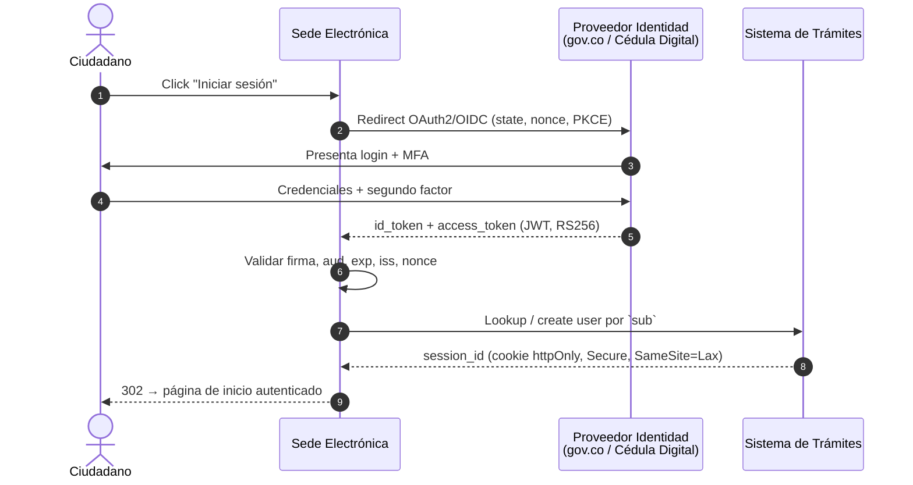
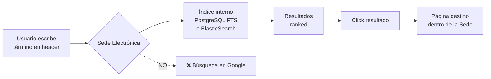
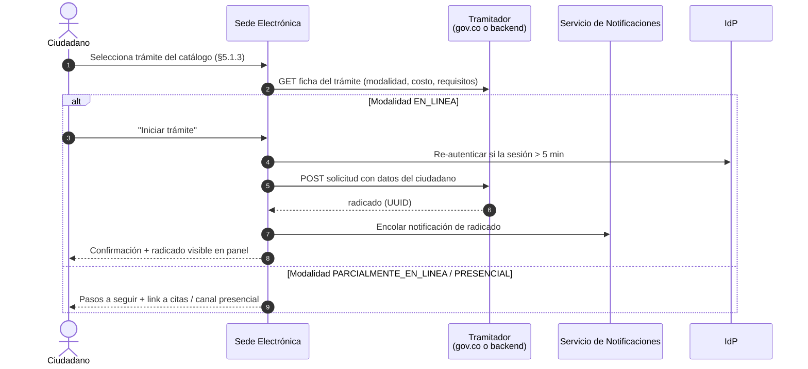
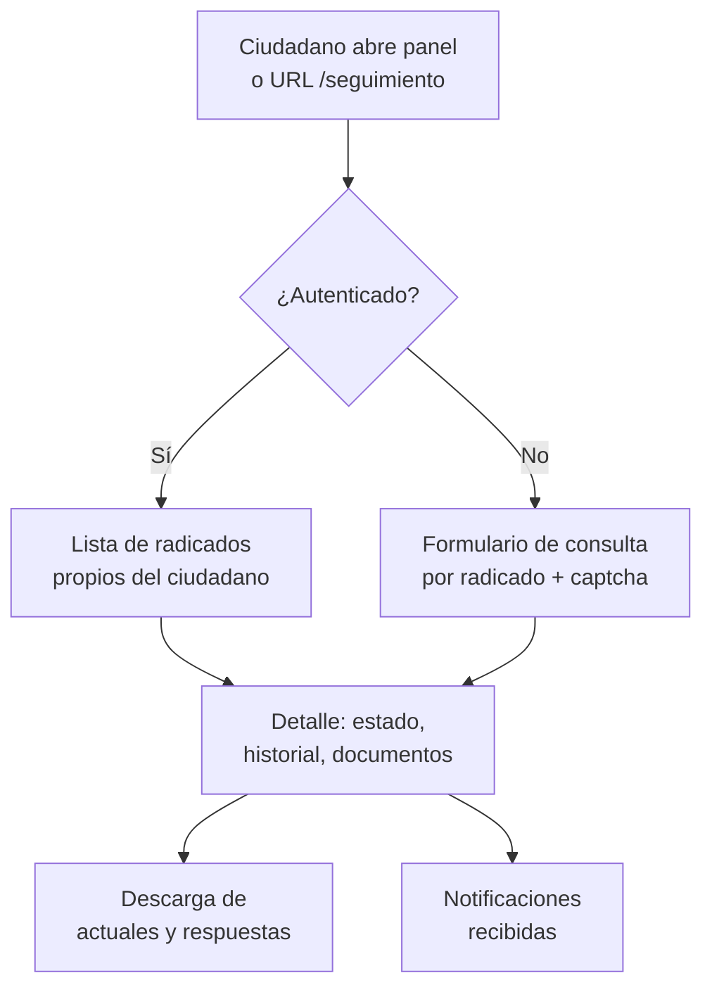
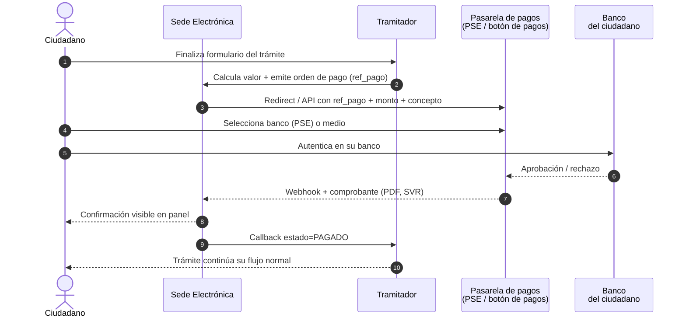
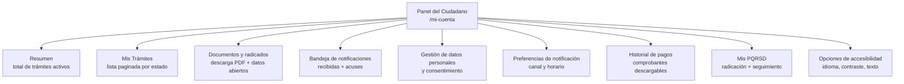

# 5. Funcionalidad de la Sede Electrónica

> **Audiencia:** Product Owner + desarrollador full-stack.
> **Propósito:** Consolidar los requisitos funcionales (qué debe *hacer* la Sede Electrónica) extraídos del PDF "Criterios de aceptación de funcionalidad para tu sede electrónica" (Mintic / Agencia Nacional Digital 2022) y de la presentación "Puntos claves de Sedes Electrónicas" (Mintic).
> **Alcance:** Esta sección cubre el catálogo de trámites y servicios, los flujos críticos end-to-end, los criterios de aceptación con IDs trazables, las integraciones externas obligatorias, el panel de autogestión del ciudadano y las métricas de éxito.
> **Documentos relacionados:** Esta sección se complementa con §2 (Diseño / Kit UI), §3 (Accesibilidad), §4 (Seguridad) y §1 (Marco normativo — Decreto 2106/2019).

---

## 5.1 Trámites y servicios que una Sede Electrónica debe ofrecer

La Sede Electrónica no es una página informativa: es un **canal único de interacción del ciudadano con la entidad** que debe soportar, como mínimo, los seis bloques funcionales detallados a continuación. El catálogo mínimo obligatorio se deriva de la composición de la Sede descrita en la diapositiva 5 del PPT "Puntos claves de Sedes Electrónicas" y del listado de ítems obligatorios de la diapositiva 10.

### 5.1.1 Catálogo obligatorio de bloques funcionales

| # | Bloque funcional | Componentes que agrupa | Cita |
|---|------------------|------------------------|------|
| B1 | **Contenido e información institucional** | Páginas estáticas, noticias, misión/visión, estructura orgánica, normatividad interna | PPT diap. 5 |
| B2 | **Trámites, OPAs y servicios** | Catálogo navegable, búsqueda, filtros, ficha del trámite, botón "Iniciar trámite" (en línea / parcialmente en línea / presencial) | PPT diap. 5 y 12 |
| B3 | **Acceso a la información pública** | Cumplimiento Ley 1712/2014 (Transparencia y acceso a la información pública — Resolución 1519/2020 Anexo 2) | PPT diap. 11 |
| B4 | **Ejercicios de participación ciudadana** | Noticias, portales transversales, encuestas, consultas, control social | PPT diap. 5 y 13 |
| B5 | **PQRSD (Peticiones, Quejas, Reclamos, Solicitudes, Denuncias)** | Formulario tipificado, radicado, consulta de estado, notificación | PPT diap. 12 |
| B6 | **Ventanillas únicas y canales de atención** | Canales presencial/virtual, agendamiento de citas, chat/CallCenter, correo de atención al usuario | PPT diap. 12 y 14 |

### 5.1.2 Items visuales obligatorios en todas las Sedes

Estos items deben estar presentes en la página principal y son verificables en revisión visual (ver §6.5 para el checklist pre-piloto):

| Item | Ubicación esperada | Cita |
|------|--------------------|------|
| Barra superior con logo **gov.co**, enlace al portal gov.co y enlaces de traducción a otros idiomas | Top de página | PPT diap. 9 |
| **Encabezado** con logo de la Entidad enlazado a la página principal, buscador general y enlace de inicio de sesión (opcional) | Cabecera | PPT diap. 9 |
| Menú principal con **máximo 7 opciones** y desplegables de **máximo 2 niveles** | Bajo del header | PPT diap. 10 |
| Sección **Transparencia y acceso a la información pública** | Bloque destacado | PPT diap. 10 y 11 |
| Sección **Servicios a la Ciudadanía** | Bloque destacado | PPT diap. 10 y 12 |
| Sección **Participa** (Noticias + portales transversales) | Bloque destacado | PPT diap. 10 y 13 |
| **Pie de página** con logo gov.co, marca país CO–Colombia, datos de la entidad, redes sociales, mapa del sitio y políticas | Footer | PPT diap. 14 |

### 5.1.3 Composición mínima de la sección "Servicios a la Ciudadanía"

Por cada trámite publicado (PPT diap. 12), la Sede debe indicar **explícitamente** los seis atributos del catálogo. Si falta cualquiera de ellos, el ítem no cumple criterio de aceptación:

| Atributo | Tipo de valor | Ejemplo |
|----------|---------------|---------|
| Modalidad | `EN_LINEA` \| `PARCIALMENTE_EN_LINEA` \| `PRESENCIAL` | EN_LINEA |
| Tiene costo | `GRATUITO` \| `CON_COSTO` | CON_COSTO |
| Tiempo de solución | Duración estimada (días hábiles) | 15 |
| Canal de inicio | URL gov.co o botón interno | https://gov.co/tramites/X |
| Mecanismo de consulta de estado | URL/endpoint de seguimiento | /seguimiento?radicado=… |
| Documentos / requisitos | Lista descargable en PDF | reqs.pdf |

---

## 5.2 Flujos críticos

Los seis flujos críticos del ciudadano son transversales a todas las Sedes Electrónicas. Cada flujo se documenta con un diagrama Mermaid `sequenceDiagram` (estándar de la guía) y se referencia a los criterios FUN-XXX que aplican en cada paso.

### 5.2.1 Flujo de autenticación ciudadana

El inicio de sesión es **opcional** en la página principal (PPT diap. 9), pero es **obligatorio** en cualquier trámite en línea que requiera tratamiento de datos personales o firma. Se debe integrar con el proveedor de identidad ciudadana definido en §5.4.

**Puntos de control:**
- Cookies de sesión con atributos `Secure`, `HttpOnly`, `SameSite=Lax/Strict`, expiración deslizante ≤ 30 min de inactividad.
- CSRF token para todo POST/PUT/DELETE contra el backend.
- Si el trámite requiere firma electrónica, encadenar la firma al `id_token` del ciudadano (no reutilizar tokens antiguos).

### 5.2.2 Flujo de búsqueda

**Reglas duras (PDF criterios 1 y 6):**
- El motor de búsqueda **debe estar contenido dentro de la Sede**; está prohibido usar un buscador de Google interno (PDF, criterio 1, pág. 1).
- Los resultados **no deben estar rotos** y deben direccionar a las páginas correctas (PDF, criterio 2, pág. 1).
- Si la búsqueda es en la sección de Transparencia, debe ser **dentro de la propia sección** y ordenada del más reciente al más antiguo (PPT diap. 11).

### 5.2.3 Flujo de solicitud de trámite

### 5.2.4 Flujo de seguimiento

Disponible siempre, autenticado o no (con captcha cuando no esté autenticado para evitar enumeración de radicados):

### 5.2.5 Flujo de notificación

Toda Sede Electrónica debe contar con un servicio de notificaciones al ciudadano. Los canales y reglas mínimas son:

| Canal | Obligatoriedad | Disparador típico | Cita |
|-------|----------------|-------------------|------|
| Correo electrónico | Obligatorio | Radicación, cambio de estado, respuesta final | PPT diap. 14 (correo de notificaciones judiciales) y criterio funcional común |
| Mensajería de texto (SMS) | Recomendado cuando hay costo/tiempo crítico | Radicación, vencimiento de términos | Inferencia técnica a partir de PPT diap. 20 (operación 24x7) |
| Notificación push (web/app) | Opcional | Cambios de estado | [A] Inferencia |
| Notificación electrónica con acuse (correo certificado / 4-72, Certicámara) | Obligatorio para actos administrativos | Actos administrativos que requieren notificación legal | Ley 1437/2011 art. 56 (sustituido por Ley 2080/2021) |
| Bandeja interna en el panel del ciudadano | Obligatorio | Cualquier comunicación | Derivado de PPT diap. 12 (mecanismos de consulta del estado) |

> **[A] Inferencia:** Las notificaciones electrónicas con acuse son obligatorias para actos administrativos en Colombia por la Ley 1437/2011 (CPACA) y Ley 2080/2021. El PPT no las detalla, pero el PDF de criterios funcionales sí exige "mecanismos de consulta del estado del trámite" (criterio equivalente).

### 5.2.6 Flujo de pago (si aplica)

Cuando el catálogo de la Sede incluya trámites con costo, la Sede **no procesa pagos directamente**: integra con un proveedor certificado (ver §5.4):

**Reglas duras:**
- El comprobante de pago debe quedar **almacenado** y ser **consultable** desde el panel del ciudadano.
- La Sede nunca debe almacenar datos de tarjeta; la captura de medios de pago ocurre exclusivamente en la pasarela certificada PCI-DSS.
- Soportar **reintento idempotente** del webhook (si la pasarela reenvía, no duplicar el pago).

---

## 5.3 Criterios de aceptación funcionales (FUN-XXX)

Cada criterio tiene un ID único `FUN-NNN`, una descripción verificable, la fuente literal (PDF página 1 o PPT diapositiva X) y el método de verificación.

### 5.3.1 Criterios literales del PDF "Criterios de aceptación de funcionalidad"

Estos son los **6 criterios numerados** del PDF principal (1 página). Deben marcarse como `Origen = PDF criterio N` y se conservan textuales:

| ID | Criterio (verbatim) | Fuente | Severidad | Cómo verificar |
|----|---------------------|--------|-----------|----------------|
| **FUN-001** | En el buscador se debe realizar la búsqueda **dentro de la Sede**. No se puede contemplar un buscador que use Google. | PDF pág. 1, criterio 1 | Crítica | Inspección del endpoint `/search` — no debe hacer proxy a `google.com/search`. Test: consultar con `site:example.gov.co` y validar que la respuesta proviene del índice propio. |
| **FUN-002** | Garantizar que los vínculos presentados en las páginas **no estén rotos** y direccionen a las páginas correctas. | PDF pág. 1, criterio 2 | Alta | Crawler automático semanal (ej. `linkchecker` o Screaming Frog) sobre toda la Sede; reportar 0 enlaces 4xx/5xx. |
| **FUN-003** | Cuando se direccione a una **página externa**, se recomienda que se abra en una **nueva pestaña** (`target="_blank"` + `rel="noopener noreferrer"`). | PDF pág. 1, criterio 3 | Media | Linter HTML en CI que verifique `target="_blank"` venga acompañado de `rel="noopener"`. |
| **FUN-004** | En **todos los formularios** donde se capturen datos personales se debe contar con: (a) aviso de privacidad y autorización para tratamiento de datos, (b) **Captcha**. | PDF pág. 1, criterio 4 | Crítica | Revisión de cada formulario + test automatizado que intenta POST sin captcha y debe ser rechazado. |
| **FUN-005** | Garantizar que los **campos obligatorios** dentro de los formularios cumplan esa condición. Los **vínculos de políticas** deben enlazar a: A) Términos y condiciones; B) Privacidad y tratamiento de datos; C) Derechos de autor y/o autorización de uso sobre los contenidos. | PDF pág. 1, criterio 5 | Alta | Test E2E: enviar el formulario vacío → debe mostrar error por cada campo obligatorio y los enlaces a políticas deben responder 200. |
| **FUN-006** | Si el usuario **no diligencia** los campos, debe **presentarse el mensaje de error** correspondiente. | PDF pág. 1, criterio 6 | Alta | Test E2E: cada formulario debe rechazar el submit con `aria-invalid="true"` y mensaje legible asociado. |

### 5.3.2 Criterios derivados del PPT "Puntos claves de Sedes Electrónicas"

Estos criterios amplían el alcance funcional de la Sede según los lineamientos del PPT y se marcan como `Origen = PPT diap. X`. Las inferencias se marcan con **[A]**.

#### 5.3.2.1 Estructura y navegación

| ID | Criterio | Fuente |
|----|----------|--------|
| **FUN-007** | La Sede debe contar con una dirección electrónica pública estable (no IP) que la identifique unívocamente. | PPT diap. 8 |
| **FUN-008** | Los contenidos deben estar en **castellano**; la entidad puede ofrecer otros idiomas conforme a Ley 1712/2014. | PPT diap. 8 |
| **FUN-009** | La **titularidad, administración y gestión** del sitio debe estar a cargo de la entidad (no de un tercero sin acto administrativo). | PPT diap. 8 |
| **FUN-010** | La barra superior debe incluir obligatoriamente: logo **gov.co**, enlace al portal gov.co y enlaces de traducción. | PPT diap. 9 |
| **FUN-011** | El encabezado debe incluir: logo de la entidad enlazado a inicio, **buscador general** y enlace de inicio de sesión (opcional). | PPT diap. 9 |
| **FUN-012** | El menú principal debe tener **máximo 7 opciones** y desplegables de **máximo 2 niveles**. | PPT diap. 10 |
| **FUN-013** | La Sede debe mostrar las tres secciones obligatorias: **Transparencia y acceso a la información pública**, **Servicios a la Ciudadanía** y **Participa**. | PPT diap. 10 |
| **FUN-014** | El pie de página debe incluir: logo gov.co, marca país CO–Colombia, datos completos de la entidad (nombre, dirección, código postal, teléfono, línea gratuita, línea anticorrupción, correo de atención al usuario, correo de notificaciones judiciales), redes sociales, mapa del sitio y enlace a políticas. | PPT diap. 14 |
| **FUN-015** | La Sede debe enlazar las tres políticas obligatorias: Términos y condiciones, Privacidad y tratamiento de datos, Derechos de autor y/o autorización de uso sobre los contenidos. | PPT diap. 15 |

#### 5.3.2.2 Transparencia y acceso a la información pública

| ID | Criterio | Fuente |
|----|----------|--------|
| **FUN-016** | La sección de Transparencia debe garantizar integridad, calidad, accesibilidad y disponibilidad de la información. | PPT diap. 11 |
| **FUN-017** | La sección de Transparencia debe contar con **buscador propio** dentro de la sección. | PPT diap. 11 |
| **FUN-018** | Los formatos publicados deben ser **accesibles** y permitir **descarga y uso sin restricciones**. | PPT diap. 11 |
| **FUN-019** | Toda la información o documentación debe llevar **fecha de publicación** y estar ordenada del más reciente al más antiguo. | PPT diap. 11 |
| **FUN-020** | Se debe evitar la **duplicidad** de información entre secciones. | PPT diap. 11 |

#### 5.3.2.3 Servicios a la Ciudadanía

| ID | Criterio | Fuente |
|----|----------|--------|
| **FUN-021** | Por cada trámite se debe indicar **modalidad** (en línea, parcialmente en línea, presencial), **costo** (gratuito/con costo) y **tiempo de solución**. | PPT diap. 12 |
| **FUN-022** | El catálogo de trámites debe incluir componentes de consulta, **criterios de búsqueda** y **paginación**. | PPT diap. 12 |
| **FUN-023** | Los trámites **en línea** o **parcialmente en línea** deben **direccionar a gov.co** (portal único del Estado) para su ejecución. | PPT diap. 12 |
| **FUN-024** | La Sede debe **disponer mecanismos de consulta del estado del trámite** por radicado. | PPT diap. 12 |
| **FUN-025** | La Sede debe ofrecer acceso a: **Trámites, OPAs, consulta de acceso a información pública, ventanillas únicas, canales de atención y PQRSD**. | PPT diap. 12 |

#### 5.3.2.4 Participa

| ID | Criterio | Fuente |
|----|----------|--------|
| **FUN-026** | La sección **Noticias** debe publicar las noticias más relevantes en la página principal y enlazar al archivo histórico. | PPT diap. 13 |
| **FUN-027** | La sección **Portales de programas transversales** debe enlazar a los portales de programas a cargo de la entidad. | PPT diap. 13 |
| **FUN-028** | Las noticias deben cumplir criterios de **lenguaje claro**, accesibilidad y usabilidad. | PPT diap. 13 |

#### 5.3.2.5 Formularios, captcha y datos personales

| ID | Criterio | Fuente |
|----|----------|--------|
| **FUN-029** | Todos los formularios que capturen datos personales deben incluir **aviso de privacidad** visible y **casilla de autorización** para el tratamiento de datos (Ley 1581/2012 — Habeas Data). | PDF pág. 1, criterio 4 + Ley 1581/2012 [A: marco legal colombiano de protección de datos] |
| **FUN-030** | Los formularios deben incluir un **Captcha** para evitar envíos automatizados. | PDF pág. 1, criterio 4 |
| **FUN-031** | Los **campos obligatorios** deben marcarse visualmente (ej. asterisco + texto "obligatorio") y validar tanto en cliente como en servidor. | PDF pág. 1, criterio 5 |
| **FUN-032** | Ante campos no diligenciados o con error de formato, la Sede debe **mostrar mensaje de error** claro, asociado al campo y accesible (`aria-describedby`). | PDF pág. 1, criterio 6 |
| **FUN-033** | Los enlaces de **Términos y condiciones**, **Privacidad y tratamiento de datos** y **Derechos de autor** deben estar presentes en todos los formularios donde aplique. | PDF pág. 1, criterio 5 |
| **FUN-034** | La Sede debe ofrecer un **sistema de gestión de cookies** que permita aceptar, denegar o revocar el consentimiento. | PPT diap. 15 |

#### 5.3.2.6 Seguimiento y notificaciones

| ID | Criterio | Fuente |
|----|----------|--------|
| **FUN-035** | La Sede debe permitir al ciudadano **consultar el estado** de sus trámites/solicitudes mediante radicado. | PPT diap. 12 (mecanismos de consulta del estado) |
| **FUN-036** | El ciudadano debe poder **descargar los documentos** asociados a cada trámite (radicado, respuesta, actos administrativos). | [A] Inferencia a partir del PPT diap. 11 ("formatos accesibles sin restricciones") |
| **FUN-037** | El ciudadano debe recibir **notificación** en al menos un canal (correo electrónico) cuando se produzcan eventos relevantes: radicación, cambio de estado, respuesta final. | PPT diap. 14 (correo de notificaciones judiciales y correo de atención al usuario) |
| **FUN-038** | La Sede debe contar con una **bandeja de notificaciones interna** accesible desde el panel del ciudadano. | [A] Inferencia a partir del PPT diap. 12 (mecanismos de consulta del estado) |
| **FUN-039** | Los actos administrativos que requieran notificación legal deben enviarse por **correo certificado** o mecanismo equivalente con acuse de recibo (Ley 1437/2011 art. 56 sustituido por Ley 2080/2021). | [A] Marco legal colombiano obligatorio |

#### 5.3.2.7 Pagos

| ID | Criterio | Fuente |
|----|----------|--------|
| **FUN-040** | Cuando un trámite tenga costo, la Sede debe **integrar con una pasarela certificada** (PSE / botón de pagos) — nunca capturar medios de pago directamente. | [A] Inferencia — buenas prácticas PCI-DSS y SFC Colombia |
| **FUN-041** | El **comprobante de pago** debe quedar almacenado y ser consultable desde el panel del ciudadano. | [A] Inferencia a partir de FUN-036 |
| **FUN-042** | La Sede debe **reconciliar** el estado del pago con la pasarela mediante **webhook idempotente**. | [A] Inferencia técnica estándar |

#### 5.3.2.8 Panel de autogestión del ciudadano

| ID | Criterio | Fuente |
|----|----------|--------|
| **FUN-043** | El panel debe mostrar el listado de **todos los trámites** del ciudadano autenticado, con su estado actual. | [A] Inferencia a partir de FUN-024 y FUN-035 |
| **FUN-044** | El panel debe permitir **actualizar datos de contacto** (correo, celular) y gestionar la **suscripción a notificaciones**. | [A] Inferencia a partir de FUN-037 |
| **FUN-045** | El panel debe permitir la **descarga masiva** de documentos y radicados en formatos abiertos (CSV / JSON / PDF). | [A] Inferencia (alineado con FUN-036 y formatos abiertos) |
| **FUN-046** | El panel debe mostrar un **historial de notificaciones** recibidas con acuse. | [A] Inferencia a partir de FUN-038 |

#### 5.3.2.9 Atributos de calidad (usabilidad funcional)

| ID | Criterio | Fuente |
|----|----------|--------|
| **FUN-047** | La Sede debe cumplir con la **guía de diseño** del Kit UI 9.2 (entidades nacionales de rama ejecutiva deben cumplir adicionalmente la Directiva 03/2019). | PPT diap. 17 |
| **FUN-048** | La Sede debe usar **lenguaje claro** en todos los contenidos visibles al ciudadano. | PPT diap. 17 |
| **FUN-049** | Los estilos deben estar **separados del contenido** (CSS externo, sin estilos inline críticos). | PPT diap. 17 |
| **FUN-050** | La Sede debe ser **independiente del navegador** y operable con los navegadores soportados por la entidad (mínimo: últimas 2 versiones de Chrome, Firefox, Edge, Safari). | PPT diap. 17 |
| **FUN-051** | La Sede debe tener **versión responsive** y adecuada en dispositivos móviles. | PPT diap. 17 |
| **FUN-052** | La Sede debe incluir una **encuesta de usabilidad** visible para el ciudadano. | PPT diap. 17 |

#### 5.3.2.10 Continuidad y preservación

| ID | Criterio | Fuente |
|----|----------|--------|
| **FUN-053** | La **disponibilidad** de la Sede debe ser **igual o superior al 95%**. | PPT diap. 19 |
| **FUN-054** | La Sede debe implementar **mecanismos de preservación documental** definidos por el Archivo General de la Nación (AGN). | PPT diap. 19 |
| **FUN-055** | La Sede debe contar con **planes de contingencia** ante vulnerabilidades. | PPT diap. 20 |
| **FUN-056** | La Sede debe contar con **plan de respaldo y copias de seguridad** y **sistema de control de versiones**. | PPT diap. 20 |
| **FUN-057** | La Sede debe contar con **mecanismos de manejo de errores** que no expongan información técnica sensible al ciudadano. | PPT diap. 20 |
| **FUN-058** | La información publicada debe estar **actualizada, veraz, oportuna y completa**. | PPT diap. 19 |
| **FUN-059** | Los archivos dispuestos deben permitir **libre uso**, bajo **licencia abierta**, sin restricciones legales y en **formatos de datos abiertos**. | PPT diap. 19 |
| **FUN-060** | La Sede debe tener **certificado SSL** vigente y **forzar HTTPS** en todas las páginas. | PPT diap. 20 |

### 5.3.3 Resumen de cobertura por fuente

| Fuente | # criterios | IDs |
|--------|-------------|-----|
| PDF "Criterios de aceptación de funcionalidad" (1 pág.) | 6 | FUN-001 a FUN-006 |
| PPT "Puntos claves de Sedes Electrónicas" — bloques temáticos | 38 | FUN-007 a FUN-019 (estructura), FUN-020 a FUN-028 (transparencia / participa), FUN-029 a FUN-034 (formularios), FUN-035 a FUN-039 (seguimiento y notificaciones), FUN-040 a FUN-042 (pagos), FUN-043 a FUN-046 (panel), FUN-047 a FUN-052 (calidad), FUN-053 a FUN-060 (continuidad) |
| **[A] Inferencia técnica / normativa complementaria** | 10 | Marcados con [A] en las tablas anteriores |
| **Total** | **60** | FUN-001 a FUN-060 |

---

## 5.4 Integraciones obligatorias

Las integraciones externas que toda Sede Electrónica colombiana debe soportar, con su propósito, normativa y referencia de contrato/API cuando aplique. Las marcadas como **(a confirmar)** no estaban detalladas en el PDF/PPT pero son exigidas por el marco normativo colombiano; se recomienda confirmar versión y contrato durante la fase de implementación.

| # | Integración | Propósito funcional | Normativa / Estándar | API / Contrato (referencia) |
|---|-------------|---------------------|----------------------|------------------------------|
| INT-01 | **Autenticación ciudadana (gov.co / Cédula Digital)** | Inicio de sesión del ciudadano para trámites en línea, perfil único y firma | Ley 2052/2020 (art. 8 — interoperabilidad de autenticación); Decreto 2106/2019 (art. 16 — autenticación digital) | OIDC/OAuth2 contra `id.gov.co` (a confirmar versión) |
| INT-02 | **Gov.co — Portal Único del Estado** | Los trámites en línea y parcialmente en línea deben direccionar al portal gov.co | PPT diap. 12 ("Los trámites en línea o parcialmente en línea, deben direccionar a gov.co") | https://www.gov.co — modelo de integración por iframe/redirect (a confirmar) |
| INT-03 | **PSE — Pagos Seguros en Línea** | Pasarela de pagos para trámites con costo | Resolución 0518/2020 SFC (reglas de canal de pago); PCI-DSS para certificación | API REST + webhook; documentación en https://www.pse.com.co (a confirmar versión) |
| INT-04 | **Botón de pagos (otros adquirentes)** | Alternativa a PSE: tarjetas crédito/débito, wallets | Ley 2069/2020 (economía digital); PCI-DDS | API REST estándar (a confirmar adquirente — Ej. PlaceToPay, PayU, Mercado Pago) |
| INT-05 | **Firma electrónica (AND / Certicámara / GSE)** | Firma de documentos cuando el trámite lo exija | Ley 527/1999; Decreto 2364/2012 (firma electrónica); Decreto 2106/2019 (art. 11 — entidades de certificación) | API SOAP/REST por proveedor (a confirmar) |
| INT-06 | **Correo certificado** | Notificación de actos administrativos con acuse de recibo | Ley 1437/2011 art. 56 (sustituido Ley 2080/2021); Decreto 491/2020 | Servicios 4-72 / Certicámara / Correo electrónico con acuse (a confirmar) |
| INT-07 | **Notificaciones electrónicas** (correo, SMS, push) | Comunicación de eventos del trámite (radicación, cambios, respuesta) | Ley 1437/2011 (notificaciones electrónicas); Decreto 491/2020 | SMTP/SES/SendGrid para correo; proveedor SMS (a confirmar) |
| INT-08 | **Archivo General de la Nación (AGN) — preservación documental** | Implementar mecanismos de preservación de la información pública | Ley 594/2000 (Ley General de Archivos); Decreto 2106/2019 (transparencia); PPT diap. 19 | Directrices técnicas AGN (a confirmar versión) |
| INT-09 | **Sistema de PQRSD** | Recepción, radicación, seguimiento y respuesta a PQRSD | Ley 1755/2011 (derecho de petición); Ley 1437/2011 (CPACA) | API propia o gov.co (a confirmar) |
| INT-10 | **Captcha / anti-bot** | Protección de formularios contra envíos automatizados | PDF pág. 1, criterio 4 | reCAPTCHA v3 / hCaptcha / Turnstile (a confirmar) |
| INT-11 | **Buscador interno indexado** | Búsqueda dentro de la Sede (prohibido usar Google) | PDF pág. 1, criterio 1 | PostgreSQL Full-Text Search, ElasticSearch u OpenSearch (a confirmar) |
| INT-12 | **Gestor de cookies / consent management** | Aceptar, denegar o revocar cookies | Ley 1581/2012 (Habeas Data); PPT diap. 15 | Cookiebot / OneTrust / implementación propia (a confirmar) |
| INT-13 | **Kit UI 9.2 — Gov.co** | Componentes UI oficiales para la Sede | Resolución 1519/2020 Anexo 2.1 | https://gitlab.com/govco/layout-govco/-/tree/v5 |
| INT-14 | **CSIRT / equipo de respuesta a incidentes** | Reporte y atención de incidentes de seguridad | Ley 1273/2009; Conpes 3701/2011; PPT diap. 20 | Canal CSIRT nacional: https://www.csirt.gov.co (a confirmar) |

> **Leyenda de la columna "API/Contrato":** Las entradas marcadas **(a confirmar)** deben validarse con el proveedor durante la fase de implementación; el PPT y PDF no especifican la versión del contrato. Para las integraciones con gov.co, PSE y firma electrónica se debe acordar NDA y pruebas de integración en Fase 3.

---

## 5.5 Panel de autogestión del ciudadano

El **panel del ciudadano** (también llamado "Carpeta ciudadana" o "Mi Sede") es el espacio autenticado donde el ciudadano gestiona toda su relación con la entidad. Su diseño se deriva de los requisitos de seguimiento (PPT diap. 12), notificaciones (PPT diap. 14) y autogestión de datos personales (PDF pág. 1, criterio 4 + Ley 1581/2012).

### 5.5.1 Componentes mínimos del panel

### 5.5.2 Trazabilidad con criterios FUN-XXX

| Componente | Criterios relacionados |
|------------|----------------------|
| Resumen | FUN-024, FUN-035, FUN-043 |
| Mis Trámites | FUN-024, FUN-035, FUN-043 |
| Documentos y radicados | FUN-036, FUN-045 |
| Bandeja de notificaciones | FUN-038, FUN-046 |
| Gestión de datos personales | FUN-029, FUN-033 (enlaces a políticas), Ley 1581/2012 |
| Preferencias de notificación | FUN-037, FUN-044 |
| Historial de pagos | FUN-041 |
| Mis PQRSD | FUN-025, FUN-035 |
| Opciones de accesibilidad | Derivado de WCAG 2.1 AA (PPT diap. 18) — ver §3 |

### 5.5.3 Reglas de privacidad y autogestión de datos

- El ciudadano debe poder **descargar todos sus datos personales** en formato abierto (portabilidad — Ley 1581/2012 art. 13 y Decreto 1377/2013).
- El ciudadano debe poder **solicitar la supresión** de sus datos cuando no exista obligación legal de conservarlos.
- Cualquier cambio en los datos de contacto debe **re-autenticar** al ciudadano (MFA) y dejar **trazabilidad de auditoría** (quién, cuándo, desde qué IP).
- El panel debe respetar la **finalidad** declarada en el aviso de privacidad: no puede usar los datos para fines distintos sin nueva autorización.

---

## 5.6 Métricas de éxito

Las métricas de éxito de la Sede se agrupan en cuatro dimensiones: **disponibilidad**, **SLA operativo**, **usabilidad** y **calidad funcional**. Cada métrica tiene un umbral mínimo, una fuente y una frecuencia de medición.

### 5.6.1 Disponibilidad y continuidad

| Métrica | Umbral mínimo | Fuente | Frecuencia |
|---------|---------------|--------|-----------|
| Disponibilidad mensual de la Sede | **≥ 95 %** | PPT diap. 19 | Mensual (medición continua) |
| Tiempo medio entre caídas (MTBF) | ≥ 720 horas | [A] Inferencia (buena práctica SRE) | Trimestral |
| Tiempo medio de recuperación (MTTR) | ≤ 30 minutos | [A] Inferencia (alineado con SLA 95 %) | Trimestral |
| RPO (Recovery Point Objective) | ≤ 1 hora | [A] Inferencia (alineado con disponibilidad 95 %) | Anual (DRP drill) |
| RTO (Recovery Time Objective) | ≤ 4 horas | [A] Inferencia | Anual (DRP drill) |

### 5.6.2 SLA operativo por flujo crítico

| Flujo | SLA | Fuente |
|-------|-----|--------|
| Radicación de PQRSD | Acuse inmediato al ciudadano (≤ 1 minuto tras envío) | Ley 1755/2011 art. 14 (términos de respuesta, derivación a SGC) |
| Respuesta a PQRSD de interés general | ≤ 15 días hábiles | Ley 1755/2011 art. 14 |
| Respuesta a PQRSD de interés particular | ≤ 15 días hábiles | Ley 1755/2011 art. 14 |
| Cambio de estado visible en panel | ≤ 5 minutos desde que el tramitador lo emite | [A] Inferencia (alineado con usabilidad esperada) |
| Notificación por correo electrónico | ≤ 2 minutos desde el evento | [A] Inferencia |
| Carga de página principal | ≤ 2,5 segundos en P95 (4G simulado) | PPT diap. 17 ("adecuado control del tiempo de carga") |

### 5.6.3 Usabilidad

| Métrica | Umbral | Fuente |
|---------|--------|--------|
| Disponibilidad de encuesta de usabilidad | Visible y operativa en ≥ 90 % de las páginas | PPT diap. 17 |
| Tasa de respuesta de la encuesta | ≥ 2 % de las sesiones autenticadas | [A] Inferencia |
| Tasa de abandono en formulario | ≤ 25 % (medido desde "inicio de trámite" hasta "submit exitoso") | [A] Inferencia |
| Tiempo promedio para completar un trámite en línea | ≤ 5 minutos para trámites simples; ≤ 15 minutos para complejos | [A] Inferencia |
| Mobile usability score (Lighthouse) | ≥ 90 | [A] Inferencia (alineado con WCAG/responsive PPT diap. 17) |

### 5.6.4 Calidad funcional y de datos

| Métrica | Umbral | Fuente |
|---------|--------|--------|
| Enlaces rotos en producción | **0** (medido semanalmente) | PDF pág. 1, criterio 2 |
| Formularios sin captcha | **0** | PDF pág. 1, criterio 4 |
| Formularios sin aviso de privacidad | **0** | PDF pág. 1, criterio 4 |
| Trámites del catálogo sin modalidad/costo/tiempo declarados | **0** | PPT diap. 12 |
| Secciones obligatorias presentes (Transparencia, Servicios, Participa) | 3 / 3 | PPT diap. 10 |
| Items visuales obligatorios (barra superior, header, footer) | 3 / 3 | PPT diap. 9, 10, 14 |
| Cobertura de los criterios FUN-001 a FUN-006 (PDF) | **100 % implementados** | PDF pág. 1 |

### 5.6.5 Reporte y monitoreo

- **Tablero interno** (Grafana + Prometheus o equivalente) con disponibilidad en tiempo real, latencia P50/P95/P99, tasa de error 5xx, número de trámites radicados/respondidos.
- **Reporte mensual** al Comité Institucional de Gestión y Desempeño (Ley 1753/2015 art. 133) con: disponibilidad, PQRSD atendidos/vencidos, resultados de la encuesta de usabilidad, incidentes de seguridad reportados al CSIRT.
- **Auditoría anual** de los criterios FUN-XXX (todos) y ACC-XXX/SEG-XXX (secciones 3 y 4).

---

## Referencias

### Fuentes principales utilizadas en esta sección

| Documento | Tipo | Ruta | Cobertura en esta sección |
|-----------|------|------|---------------------------|
| Criterios de aceptación de funcionalidad para tu sede electrónica | PDF (1 página) | `/workspace/attachments/70097a968f96e1c6/Criterios de aceptación de funcionalidad para tu sede electrónica.pdf` | FUN-001 a FUN-006 (criterios literales), soporte para FUN-029 a FUN-034 |
| Puntos claves de Sedes Electrónicas | PPT (24 diapositivas) | `/workspace/attachments/234f37ec228f7ed7/Puntos claves de Sedes Electrónicas.pptx` | FUN-007 a FUN-060 (todos los criterios derivados) |

### Archivos idénticos (duplicados verificados por hash)

Los siguientes archivos son copias bit-a-bit del PPT principal (MD5 `579286e5307b6394df29a723ee5607d1`) y se conservan como respaldo, no agregan contenido adicional:

| Duplicado | MD5 |
|-----------|-----|
| `/workspace/attachments/ba34de6054c6094c/Puntos claves de Sedes Electrónicas.pptx` | `579286e5307b6394df29a723ee5607d1` |
| `/workspace/attachments/5659da18da6802be/Puntos claves de Sedes Electrónicas (1).pptx` | `579286e5307b6394df29a723ee5607d1` |
| `/workspace/attachments/c7b2a1bbb9e3a258/Puntos claves de Sedes Electrónicas (1).pptx` | `579286e5307b6394df29a723ee5607d1` |

### Citas específicas (slide → ID de criterio)

| Diapositiva / Página | Tema | Criterios derivados |
|---------------------|------|---------------------|
| PDF pág. 1, criterio 1 | Buscador interno (no Google) | FUN-001, INT-11 |
| PDF pág. 1, criterio 2 | Vínculos no rotos | FUN-002 |
| PDF pág. 1, criterio 3 | Abrir externos en nueva pestaña | FUN-003 |
| PDF pág. 1, criterio 4 | Aviso de privacidad + captcha | FUN-004, FUN-029, FUN-030, INT-10 |
| PDF pág. 1, criterio 5 | Campos obligatorios + enlaces a políticas | FUN-005, FUN-031, FUN-033, INT-12 |
| PDF pág. 1, criterio 6 | Mensaje de error en campos no diligenciados | FUN-006, FUN-032 |
| PPT diap. 4 | Definición de Sede Electrónica | (Introducción §5.1) |
| PPT diap. 5 | Composición de la Sede | B1–B6 §5.1.1 |
| PPT diap. 7 | Ámbito de aplicación | (Referencia §1 — Decreto 1875/2015) |
| PPT diap. 8 | Lineamientos generales (idioma, titularidad, Ley 1712) | FUN-007 a FUN-009 |
| PPT diap. 9 | Barra superior y encabezado | FUN-010, FUN-011 |
| PPT diap. 10 | Secciones obligatorias y menú | FUN-012, FUN-013 |
| PPT diap. 11 | Transparencia y acceso a la información | FUN-016 a FUN-020, INT-08 |
| PPT diap. 12 | Servicios a la Ciudadanía | FUN-021 a FUN-025 |
| PPT diap. 13 | Participa (Noticias y portales) | FUN-026 a FUN-028 |
| PPT diap. 14 | Pie de página | FUN-014, INT-07 |
| PPT diap. 15 | Términos, privacidad, cookies | FUN-015, FUN-034 |
| PPT diap. 17 | Usabilidad | FUN-047 a FUN-052 |
| PPT diap. 18 | Accesibilidad (WCAG 2.1 AA) | (Referencia §3) |
| PPT diap. 19 | Calidad, disponibilidad, AGN | FUN-053, FUN-054, FUN-058, FUN-059 |
| PPT diap. 20 | Seguridad funcional | FUN-055 a FUN-057, FUN-060, INT-14 |
| PPT diap. 21 | Infraestructura (IP, DNS, nube) | (Referencia §4 — seguridad) |
| PPT diap. 23 | Recursos normativos (Resolución 02893/2020, 1519/2020) | INT-13 |

### Normativa referenciada (complementaria al PDF/PPT)

| Norma | Aplica a |
|-------|----------|
| Decreto 2106/2019 | Sede Electrónica, autenticación digital, interoperabilidad |
| Decreto 1875/2015 art. 2.2.17.1.2 | Ámbito de aplicación (PPT diap. 7) |
| Resolución 1519 de 2020 — Mintic | Estándares de publicación, accesibilidad, seguridad, datos abiertos (Anexos 1–4) |
| Resolución 02893 de 2020 — Mintic | Guía Técnica de Integración Sede Electrónica |
| Ley 1712/2014 | Transparencia y acceso a la información pública |
| Ley 1581/2012 + Decreto 1377/2013 | Habeas Data — protección de datos personales |
| Ley 1755/2011 | Derecho de petición — términos PQRSD |
| Ley 1437/2011 (CPACA) art. 56 sustituido por Ley 2080/2021 | Notificaciones electrónicas con acuse |
| Ley 527/1999 + Decreto 2364/2012 | Firma electrónica y entidades de certificación |
| Ley 1273/2009 | Delitos informáticos — canal CSIRT |
| Ley 2052/2020 | Interoperabilidad de autenticación |
| Conpes 3701/2011 | Lineamientos de seguridad digital |
| WCAG 2.1 nivel AA (Resolución 1519/2020 Anexo 1) | Accesibilidad web |

---

> **Notas para el editor de la guía (tarea `editor-merge`):**
> 1. Esta sección contiene **60 criterios funcionales con IDs únicos** (FUN-001 a FUN-060), de los cuales **6 son literales del PDF** y **54 derivados del PPT o por inferencia técnica [A]**.
> 2. Los criterios inferidos están marcados con **[A]** para facilitar la verificación adversarial final.
> 3. La columna **"API/Contrato"** de §5.4 contiene entradas **(a confirmar)** porque el PPT/PDF no especifica la versión del contrato; se deben validar en Fase 3 de implementación.
> 4. Los archivos PPT duplicados (mismo MD5) se referencian solo como respaldo; el contenido proviene exclusivamente del archivo principal `/workspace/attachments/234f37ec228f7ed7/`.
