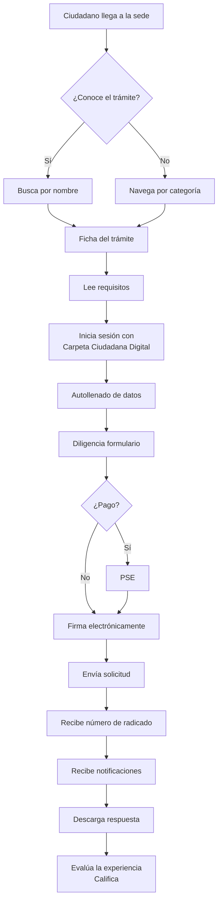

# 6. Implementación paso a paso de la Sede Electrónica

> Esta sección traduce los requisitos de las secciones 1 a 5 a un plan operativo. Cada paso tiene **verbo + objeto + entregable** y está vinculado por código a uno o más criterios (`CAG-NN` para diseño, `FUN-NN` para funcionalidad, `SEG-NN` para seguridad, `ACC-NN` para accesibilidad, `RN-NN`/`RT-NN` para marco normativo).

## 6.1 Fases del proyecto

| # | Fase | Objetivo principal | Duración sugerida | Entregable principal | Criterio de salida |
|---|---|---|---|---|---|
| 0 | **Definición y aprobación del alcance** | Decidir qué trámites van en v1 y firmar el acta de inicio. | 1 semana | Acta de inicio + inventario de trámites v1 | Listado priorizado y firmado |
| 1 | **Kickoff normativo y casos de uso** | Mapear cada trámite a los artículos del Decreto 2106/2019 y diseñar el journey del ciudadano. | 2 semanas | Matriz **caso de uso ↔ RN ↔ RF** + boceto de journey | RN-01/02/03 cubiertos |
| 2 | **Diseño UX + maquetación con Kit UI 9.2** | Maquetar pantallas con los componentes del layout-govco v5. | 2-3 semanas | Mockups navegables + Kit de estilos | CAG-01…CAG-34 ✓ |
| 3 | **Construcción backend + frontend** | Implementar APIs, vistas, integración con autenticación ciudadana. | 6-10 semanas (3-5 sprints) | Aplicación funcional en staging | FUN-001…FUN-060 ✓ + SEG-001…SEG-012 ✓ |
| 4 | **Accesibilidad y seguridad integradas** | Auditorías A11y + SAST/DAST + pentesting. | 2 semanas | Informes firmados | ACC-* ✓ + SEG-013…SEG-018 ✓ |
| 5 | **Pruebas funcionales, accesibilidad y seguridad** | Regresión, UAT, pruebas exploratorias. | 1-2 semanas | Acta de UAT firmada | 0 defectos críticos |
| 6 | **Piloto, despliegue y transferencia** | Piloto con usuarios reales + go-live + handover. | 2 semanas | Sede en producción + acta de transferencia | Disponibilidad ≥ 99 % mensual |


## 6.2 Fase 0 — Definición y aprobación del alcance

**Objetivo:** acotar v1 para evitar una "sede universal" irrealizable en 6 meses.

| Paso | Acción | Entregable | Vinculado a |
|---|---|---|---|
| 0.1 | Inventariar todos los trámites de la entidad y clasificarlos por demanda (consultas/mes) y complejidad. | Hoja de cálculo con scoring MoSCoW | FUN-001 (catálogo) |
| 0.2 | Seleccionar los **5 a 10 trámites v1** según demanda + viabilidad técnica. | Listado priorizado | RN-01 (art. 14 DL 2106/2019) |
| 0.3 | Confirmar que los datos personales a capturar ya tienen habilitación legal en la entidad (Habeas Data, Ley 1581/2012). | Matriz "dato ↔ habilitación legal" | SEG-013 (Habeas Data) |
| 0.4 | Firmar el **acta de inicio** con el sponsor (Secretario General / Director). | PDF firmado | RN-02 |
| 0.5 | Publicar el alcance en la intranet de la entidad para socialización. | Comunicación interna | CAG-12 (miga de pan) |

**Criterio de salida:** acta firmada + 5-10 trámites priorizados.

## 6.3 Fase 1 — Kickoff normativo y casos de uso

| Paso | Acción | Entregable | Vinculado a |
|---|---|---|---|
| 1.1 | Para cada trámite v1, identificar los artículos del Decreto 2106/2019 que aplican (arts. 8, 9, 10, 13, 14, 15, 17). | Matriz **trámite ↔ artículo** | RN-01, RT-01 |
| 1.2 | Levantar el **journey** del ciudadano (descubrimiento → autenticación → captura → pago → entrega → seguimiento). | Boceto de journey | FUN-002, FUN-003 |
| 1.3 | Definir los criterios de aceptación funcionales (`FUN-NNN`) por trámite con el product owner. | Documento de historias de usuario | FUN-004 |
| 1.4 | Aprobar la arquitectura: SPA + API REST, base de datos PostgreSQL, autenticación vía Carpeta Ciudadana Digital (art. 9). | ADR (Architecture Decision Record) | RT-01 (Servicios Ciudadanos Digitales) |
| 1.5 | Configurar el repositorio, CI/CD y los entornos (dev/qa/prod). | Pipeline en verde + URLs de los entornos | RT-04 (cumplimiento) |
| 1.6 | Comprar / renovar el **certificado TLS EV** del dominio institucional. | Certificado instalado | SEG-002 (TLS 1.2+) |

**Criterio de salida:** matriz RN-FUN completa + ADR firmado + entornos accesibles.

## 6.4 Fase 2 — Diseño UX + maquetación con Kit UI 9.2

| Paso | Acción | Entregable | Vinculado a |
|---|---|---|---|
| 2.1 | Auditar el branding actual de la entidad contra la paleta de Gov.co. | Informe de brechas | CAG-03…CAG-08 (paleta) |
| 2.2 | Decidir **versión** (A: 1-3 sedes, B: >3 sedes) del pie de página. | Mockup pie de página | CAG-12 |
| 2.3 | Montar la **cabecera** con barra superior + logo + buscador + menú (≤7 ítems). | HTML navegable | CAG-10, CAG-11 |
| 2.4 | Montar la **barra de accesibilidad** (Aumentar letra · Reducir letra · Contraste). | HTML navegable | CAG-09, ACC-002 |
| 2.5 | Diseñar las plantillas de **Home, Trámites y servicios, Participa, Transparencia, Noticias, Sedes**. | 6 wireframes + mockups | FUN-005…FUN-009 |
| 2.6 | Diseñar las plantillas de **login, formulario, seguimiento, panel de autogestión**. | 4 wireframes + mockups | FUN-010…FUN-013 |
| 2.7 | Pasar los mockups por **revisión de accesibilidad** (contraste 4.5:1, foco visible, tamaños táctiles ≥ 44×44 px). | Checklist firmado | ACC-001, ACC-004 |
| 2.8 | Aprobar el kit visual con el sponsor. | Acta de aprobación | CAG-01…CAG-34 ✓ |

**Criterio de salida:** mockups firmados + 0 desviaciones de la paleta o tipografía institucional.

## 6.5 Fase 3 — Construcción (sprints de 2 semanas)

Distribución sugerida de sprints. Cada sprint termina con demo al sponsor.

| Sprint | Alcance | Salidas clave | Vinculado a |
|---|---|---|---|
| **S1** | Bootstrap del proyecto, CI/CD, **shell de página** (cabecera + barra superior + pie + accesibilidad). Login con Carpeta Ciudadana Digital. | Página shell navegable | CAG-09…CAG-13, RT-01 |
| **S2** | **Catálogo de trámites** + buscador predictivo + paginación + breadcrumbs. | Catálogo funcional | FUN-014, FUN-015 |
| **S3** | **Detalle de trámite** + formulario dinámico + validaciones + CAPTCHA. | Trámite completo en sandbox | FUN-016…FUN-018 |
| **S4** | **Panel de autogestión** del ciudadano (mis solicitudes, notificaciones, datos). | Panel funcional | FUN-019, FUN-020 |
| **S5** | **Pagos PSE** + **notificaciones** (correo certificado si aplica). | Flujo de pago integrado | FUN-021, SEG-005 |
| **S6** | **Transparencia** (publicación activa), **Participa** (foros, encuestas), **Noticias**. | Secciones secundarias | FUN-022…FUN-025 |
| **S7** | Endurecimiento: cabeceras HTTP, CSP, rate limiting, logs, copias de seguridad. | Staging endurecido | SEG-006, SEG-009, SEG-012 |
| **S8** | Hardening accesibilidad (lectores de pantalla, teclado), i18n si aplica. | Listo para auditoría | ACC-001…ACC-008 |

**Criterio de salida del S8:** 0 hallazgos críticos en CI (lint, pruebas, SAST, accesibilidad).

## 6.6 Fase 4 — Accesibilidad y seguridad integradas

| Paso | Acción | Entregable | Vinculado a |
|---|---|---|---|
| 4.1 | Auditoría **WCAG 2.1 AA** con axe-core + revisión manual NVDA/VoiceOver. | Informe de accesibilidad | ACC-001, ACC-002, ACC-004 |
| 4.2 | Auditoría **WCAG 2.2** (criterios nuevos: foco no oculto, arrastrar alternativo, reautenticación, objetivo táctil 24×24 px). | Informe | ACC-003 |
| 4.3 | Auditoría **SAST** (SonarQube/Semgrep) + **DAST** (OWASP ZAP). | Informes firmados | SEG-007, SEG-008 |
| 4.4 | **Pentesting** externo (mínimo 1 caja negra). | Informe + remediaciones | SEG-010, SEG-011 |
| 4.5 | Verificación del **pie de página institucional** (entidad, dirección, teléfono, correo, políticas, términos). | Captura + acta | SEG-006 (CAG-12) |
| 4.6 | Política de **respuesta a incidentes** socializada al equipo. | Plan + roles asignados | RT-05 (Resolución 500/2021) |

**Criterio de salida:** 0 hallazgos críticos sin remediación.

## 6.7 Fase 5 — Pruebas funcionales, accesibilidad y seguridad

| Paso | Acción | Entregable | Vinculado a |
|---|---|---|---|
| 5.1 | Pruebas de **regresión** automatizadas (mínimo 70 % cobertura). | Reporte de cobertura | FUN-026 |
| 5.2 | Pruebas **exploratorias** manuales (4 sesiones de 4 horas con usuarios piloto). | Reporte | FUN-027 |
| 5.3 | Pruebas de **carga y rendimiento** (≥ 500 usuarios concurrentes en homepage). | Reporte | RT-04 |
| 5.4 | **UAT** con el product owner y un usuario real por cada trámite v1. | Acta de UAT firmada | FUN-028 |
| 5.5 | Smoke tests en staging + checklist de go-live. | Checklist firmado | RT-04 |

**Criterio de salida:** 0 defectos críticos, 0 defectos altos sin plan de remediación.

## 6.8 Fase 6 — Piloto, despliegue y transferencia

| Paso | Acción | Entregable | Vinculado a |
|---|---|---|---|
| 6.1 | **Piloto cerrado** con 50-100 usuarios reales durante 1 semana. | Métricas de uso | FUN-029 |
| 6.2 | **Go-live** con despliegue canary (10 % → 50 % → 100 %). | Release notes | RT-04 |
| 6.3 | **Capacitación** al equipo de operaciones (runbook, dashboards, alertas). | Material + acta | RT-05 |
| 6.4 | **Transferencia** al equipo de soporte (matriz de escalamiento). | Documento de handover | RT-05 |
| 6.5 | **Reunión de cierre** con el sponsor + retrospectiva. | Acta de cierre | — |

**Criterio de salida:** Sede en producción con SLA ≥ 99 % mensual durante el primer trimestre.

## 6.9 Backlog inicial priorizado (MoSCoW)

| Prioridad | Historia | Vinculado a |
|---|---|---|
| **Must** | Catálogo de trámites v1 | FUN-001, FUN-014 |
| **Must** | Autenticación con Carpeta Ciudadana Digital | RT-01, SEG-003 |
| **Must** | 5-10 trámites completos en v1 | RN-01 |
| **Must** | Cabecera + barra accesibilidad + pie de página Kit UI | CAG-09, CAG-10, CAG-12 |
| **Must** | TLS 1.2+, cabeceras CSP/HSTS, rate limiting | SEG-002, SEG-006, SEG-012 |
| **Should** | Buscador predictivo | FUN-015 |
| **Should** | Panel de autogestión del ciudadano | FUN-019 |
| **Should** | Pagos PSE | FUN-021 |
| **Should** | Notificaciones por correo certificado | FUN-020 |
| **Should** | Soporte multi-idioma (Lengua de señas, lenguas indígenas) | ACC-007 |
| **Could** | App Gallery (apps GOV.CO en cabecera) | CAG-25 |
| **Could** | Carrusel en Home | CAG-26 |
| **Won't** | Firma electrónica avanzada (escenario v2) | RT-02 |

## 6.10 Riesgos del proyecto y mitigaciones

| Riesgo | Probabilidad | Impacto | Mitigación |
|---|---|---|---|
| Cambios regulatorios durante el desarrollo | Media | Alto | Congelar alcance v1 a 12 meses; backlog para cambios. |
| Brecha de accesibilidad descubierta en producción | Media | Alto | Auditorías en F4 + checklist en CI (axe-core, pa11y). |
| Caída del proveedor de Carpeta Ciudadana Digital | Baja | Crítico | Cachear último token; ruta de fallback con OTP por correo. |
| Filtración de datos personales | Baja | Crítico | SEG-013 (Habeas Data) + cifrado en reposo + monitoreo. |
| Resistencia al cambio del funcionario | Alta | Medio | Capacitación + embajadores internos + manual de usuario. |
| Carga pico en campañas de divulgación | Media | Medio | CDN + pruebas de carga + autoescalado. |

## 6.11 Equipo mínimo recomendado

| Rol | Dedicación | Responsabilidad principal |
|---|---|---|
| **Sponsor** (Secretario / Director) | 10 % | Decisiones de alcance y aceptación. |
| **Product Owner** | 100 % | Backlog, priorización, criterios de aceptación. |
| **Scrum Master / PM** | 100 % | Facilitación, métricas, riesgos. |
| **Diseñador UI/UX** | 100 % en F2, 50 % después | Maquetación con Kit UI. |
| **Frontend senior** | 100 % | Componentes SPA, accesibilidad. |
| **Backend senior** | 100 % | API, BD, integraciones. |
| **Ingeniero DevOps / SRE** | 50 % | CI/CD, infra, observabilidad. |
| **Ingeniero de seguridad** | 50 % | Auditorías SEG, hardening. |
| **QA funcional** | 100 % en F5 | Pruebas, UAT. |
| **Líder de accesibilidad** | 25 % | Auditorías WCAG. |

## 6.12 Cómo usar el layout-govco v5 — guía técnica rápida

> Repo público: https://gitlab.com/govco/layout-govco/-/tree/v5 · CDN oficial: `https://cdn.www.gov.co/layout/v5/`

### 6.12.1 Dos formas de consumir el Kit

| Modo | Cuándo usarlo | Comando / snippet |
|---|---|---|
| **CDN** (recomendado para empezar) | Piloto, demos, integraciones rápidas. | `<link href="https://cdn.www.gov.co/layout/v5/all.css" rel="stylesheet">` |
| **Repositorio** (recomendado para producción) | Cuando necesitas customizar o compilar. | `git clone https://gitlab.com/govco/layout-govco.git -b v5` |

### 6.12.2 Instalación rápida (CDN)

```html
<!DOCTYPE html>
<html lang="es">
<head>
  <meta charset="UTF-8" />
  <meta name="viewport" content="width=device-width, initial-scale=1" />
  <title>Mi Sede Electrónica</title>

  <!-- Kit UI 9.2 + BDC v5 vía CDN oficial -->
  <link href="https://cdn.www.gov.co/layout/v5/all.css" rel="stylesheet" crossorigin="anonymous" />
</head>
<body>
  <!-- 1. Barra superior (Top bar) — obligatoria -->
  <!-- 2. Cabecera (Header) — logo + buscador + menú -->
  <!-- 3. Barra de accesibilidad — Aumentar/Reducir/Contraste -->
  <!-- 4. Contenido principal de la página -->
  <main id="main-content">
    <!-- Saltar al contenido principal:
         <a class="sr-only sr-only-focusable" href="#main-content">Saltar al contenido</a>
    -->
  </main>
  <!-- 5. Pie de página (Footer) — Versión A o B según # de sedes -->
  <!-- 6. Volver arriba -->

  <script src="https://cdn.www.gov.co/layout/v5/script.js" crossorigin="anonymous"></script>
</body>
</html>
```

### 6.12.3 Instalación local (repo clonado)

```bash
git clone https://gitlab.com/govco/layout-govco.git -b v5
cd layout-govco

# No requiere npm install: el repo trae CSS y JS precompilados.
# Solo copia los assets que necesites desde src/ a tu proyecto.

# Opción A — copiar todo:
cp -r src/ /ruta/a/tu/proyecto/public/govco/

# Opción B — importar selectivamente (mejor para tree-shaking manual):
# Solo el componente de buscador:
cp src/general/buscador.{css,js} /ruta/a/tu/proyecto/public/govco/general/
cp src/transversal/cabecera.{css,js} /ruta/a/tu/proyecto/public/govco/transversal/
# ... y referencia solo esos en tu HTML.
```

### 6.12.4 Mapa página → componente del Kit UI (resumen ejecutivo)

| Bloque de la página | Componente | Ruta en repo v5 | Ejemplo |
|---|---|---|---|
| Header global | Barra superior | `src/transversal/barra-superior.{css,js}` | [`examples/transversal/barra-superior.html`](https://gitlab.com/govco/layout-govco/-/blob/v5/examples/transversal/barra-superior.html) |
| Logo + buscador + menú | Cabecera | `src/transversal/cabecera.{css,js}` | [`examples/transversal/cabecera.html`](https://gitlab.com/govco/layout-govco/-/blob/v5/examples/transversal/cabecera.html) |
| Aumentar/Reducir/Contraste | Barra accesibilidad | `src/transversal/barra-accesibilidad.{css,js}` | [`examples/transversal/barra-accesibilidad.html`](https://gitlab.com/govco/layout-govco/-/blob/v5/examples/transversal/barra-accesibilidad.html) |
| Menú principal | Menú de navegación | `src/general/menu-de-navegacion.{css,js}` | [`examples/general/menu-de-navegacion.html`](https://gitlab.com/govco/layout-govco/-/blob/v5/examples/general/menu-de-navegacion.html) |
| Path de ubicación | Miga de pan | `src/general/miga-de-pan.css` | [`examples/general/miga-de-pan.html`](https://gitlab.com/govco/layout-govco/-/blob/v5/examples/general/miga-de-pan.html) |
| Catálogo (Home) | Tarjetas + buscador | `src/general/tarjetas-de-informacion.css` + `buscador.{css,js}` | [`examples/general/buscador.html`](https://gitlab.com/govco/layout-govco/-/blob/v5/examples/general/buscador.html) |
| Formulario de trámite | Inputs desplegables / textos / radios / carga archivos | `src/form/*.{css,js}` | [`examples/form/`](https://gitlab.com/govco/layout-govco/-/tree/v5/examples/form) |
| Mensajes flash | Alerta notificación (toast) | `src/general/alerta-notificacion.{css,js}` | [`examples/general/alerta-notificacion.html`](https://gitlab.com/govco/layout-govco/-/blob/v5/examples/general/alerta-notificacion.html) |
| Diálogos de confirmación | Alerta modal | `src/general/alerta-modal.{css,js}` | [`examples/general/alerta-modal.html`](https://gitlab.com/govco/layout-govco/-/blob/v5/examples/general/alerta-modal.html) |
| Tablas de datos | Tablas | `src/general/tablas.{css,js}` | [`examples/general/tablas.html`](https://gitlab.com/govco/layout-govco/-/blob/v5/examples/general/tablas.html) |
| Acordeones (preguntas frecuentes) | Acordeón | `src/general/acordeon.css` | [`examples/general/acordeon.html`](https://gitlab.com/govco/layout-govco/-/blob/v5/examples/general/acordeon.html) |
| Pie de página | Footer (Versión A: 1-3 sedes / Versión B: >3 sedes) | `src/transversal/pie-de-pagina.css` | [`examples/transversal/pie-de-pagina.html`](https://gitlab.com/govco/layout-govco/-/blob/v5/examples/transversal/pie-de-pagina.html) |
| Volver arriba | Botón flotante | `src/transversal/volver-arriba.{css,js}` | [`examples/transversal/volver-arriba.html`](https://gitlab.com/govco/layout-govco/-/blob/v5/examples/transversal/volver-arriba.html) |

### 6.12.5 Reglas duras de uso del Kit UI 9.2

1. **No reescribir CSS del Kit** salvo necesidad justificada (tematización por entidad). Para personalizaciones, sobrescribir variables CSS (`--govcolor-primary`, `--govfont-primary`).
2. **Cargar primero la barra de accesibilidad**, luego la barra superior, luego la cabecera. Cualquier inversión rompe el contraste y el orden de tabulación.
3. **Implementar "Saltar al contenido principal"** con la clase `sr-only sr-only-focusable` apuntando a `#main-content`. Es WCAG 2.4.1.
4. **No anidar desplegables en pestañas**. CAG-NN prohíbe esta combinación.
5. **Tamaño táctil mínimo 44 × 44 px** en móvil (24 × 24 px sólo en WCAG 2.2 AAA; mejor mantener 44 × 44).
6. **Versión del pie de página** depende del número de sedes vinculadas a la autoridad (A: 1-3, B: >3).
7. **Paginación accesible**: incluir siempre `<nav aria-label="Paginación">` y enlaces `aria-current="page"` al ítem activo.
8. **Idioma**: `lang="es"` en `<html>`. Si hay contenido en otra lengua, envolver con `lang="en"` etc.
9. **CDN**: si se usa `https://cdn.www.gov.co/layout/v5/all.css`, fijar por `integrity` y `crossorigin` (SRI).
10. **Personalización tipográfica**: Nunito Sans para títulos, Verdana para cuerpo. No sustituir sin justificación visual.

### 6.12.6 Snippet de página shell completa (lista para v1)

```html
<!DOCTYPE html>
<html lang="es">
<head>
  <meta charset="UTF-8" />
  <meta name="viewport" content="width=device-width, initial-scale=1" />
  <title>Mi Entidad — Sede Electrónica</title>
  <meta name="description" content="Sede electrónica oficial de Mi Entidad. Trámites, servicios, transparencia y participación." />
  <link rel="stylesheet" href="https://cdn.gov.co/layout/v5/govco-9.2.css" />
</head>
<body>
  <a class="sr-only sr-only-focusable" href="#main-content">Saltar al contenido principal</a>

  <!-- 1. Barra superior -->
  <!-- 2. Cabecera con buscador + menú + apps -->
  <!-- 3. Barra accesibilidad -->

  <main id="main-content" role="main">
    <!-- Banner de accesibilidad -->
    <!-- Contenido por sección (Home / Trámites / Participa / Transparencia) -->
  </main>

  <!-- 4. Pie de página institucional -->
  <!-- 5. Volver arriba -->

  <script src="https://cdn.gov.co/layout/v5/script.js" defer></script>
</body>
</html>
```

## 6.13 Flujo de un trámite (ejemplo)



## Referencias

- Sección 1 · Marco normativo (`01-marco-normativo.md`) — arts. 8, 9, 10, 13, 14, 15, 16, 17 del Decreto 2106/2019.
- Sección 2 · Diseño (`02-diseno.md`) — CAG-01…CAG-34, Kit UI 9.2, layout-govco v5.
- Sección 3 · Accesibilidad (`03-accesibilidad.md`) — WCAG 2.1 AA obligatorio, WCAG 2.2 recomendado, Resolución 1519/2020.
- Sección 4 · Seguridad (`04-seguridad.md`) — SEG-001…SEG-018 + 24 criterios complementarios (RN, RT, RH, RA, RC, BAK).
- Sección 5 · Funcionalidad (`05-funcionalidad.md`) — FUN-001…FUN-060 + 14 derivados.
- Repositorio público del Kit UI: https://gitlab.com/govco/layout-govco/-/tree/v5
- Documentación oficial del Portal Único: https://www.gov.co/
