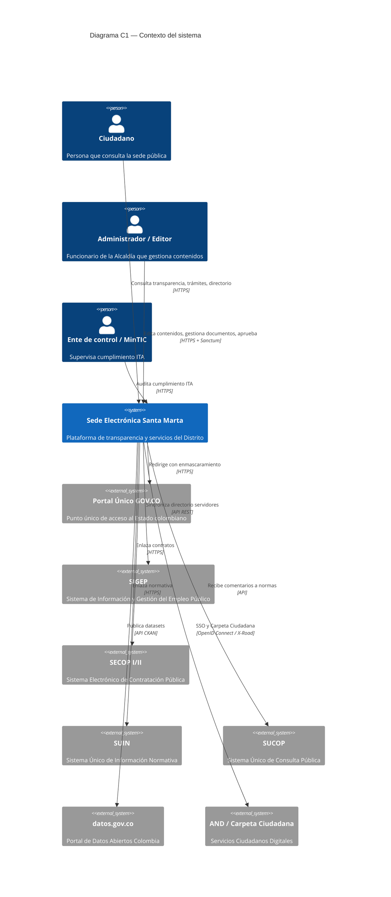
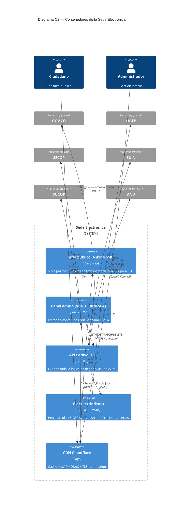

# 03 — Propuesta Arquitectónica

> **Propósito:** especificar la arquitectura del sistema completo (sede electrónica) para los módulos **01-estructura-identidad** y **02-transparencia**, incluyendo la base de datos `_bd/`. La arquitectura es **desacoplada por obligación** (RT-01): un único backend API Laravel 13 consumido por **dos clientes físicamente separados y con stacks diferenciados**:
> - **`sitio/`** → **Nuxt 4 + Vue 3 + TypeScript** (SSR para el ciudadano, SEO crítico para Ley 1712/2014, file-based routing, `$fetch` SSR-safe).
> - **`panel/`** → **Vue 3 + Vite + TypeScript** (SPA pura, autenticación Sanctum con cookie HttpOnly + MFA, Axios con `withCredentials`, `vue-router` manual).
>
> Ambos comparten únicamente los **tipos TS generados del OpenAPI** (`pnpm openapi:generar-ts`). **No comparten componentes, stores ni lógica de negocio.**
>
> **Marco:** C4 Model [16], ADRs (Michael Nygard), 13 zones architecture (#217).
> **Decisiones críticas:** documentadas como ADRs (≥5) con justificación normativa/técnica.

---

## Índice

| Documento | Contenido |
|---|---|
| `vision-arquitectonica.md` | Principios, objetivos, restricciones globales, vista C1 (contexto) |
| `diagramas-c4.md` | Diagramas C4: contexto (C1), contenedores (C2), componentes (C3), código (C4) |
| `adr.md` | **≥10 Architecture Decision Records** con justificación |
| `estructura-directorios.md` | Árbol completo de `backend/`, `sitio/`, `panel/` con justificación |
| `patron-comunicacion.md` | HTTP/JSON:API, versionado, rate limit, CORS, errores |
| `estrategia-despliegue.md` | Despliegue: contenedores, CI/CD, observabilidad |

---

## Resumen ejecutivo de la arquitectura

| Aspecto | Decisión | Justificación |
|---|---|---|
| Patrón arquitectónico | Desacoplado: API única + 2 clientes | RT-01, #217 |
| Backend | Laravel 13 + PHP 8.3 | Stack fijado |
| Frontend público | **Nuxt 4** (sitio) | SSR para SEO de transparencia (Ley 1712 Art. 9) |
| Frontend admin | **Vue 3 + Vite** (panel) | SPA pura, autenticación Sanctum + MFA |
| Serialización API | JSON:API 1.0 (Laravel nativo) | RT-02, [17] |
| Documentación API | OpenAPI 3.1 | RT-05, [15] |
| Autenticación | Laravel Sanctum (sesión SPA + Bearer) | RT-11, [19] |
| BD | PostgreSQL 15+ (MySQL 8.0+ opcional) | RT-04 |
| Cache/Queue | Redis | Rendimiento |
| Storage objetos | S3-compatible (MinIO en dev) | Almacenamiento documentos |
| Búsqueda | PostgreSQL FTS (ElasticSearch opcional a futuro) | Capacidad de búsqueda |
| Container | Docker + Docker Compose (dev), Kubernetes opcional (prod) | Despliegue |
| Despliegue | Cloudflare (CDN + WAF + DDoS) | Seguridad |
| Monitoreo | Laravel Telescope (dev), Prometheus + Grafana (prod), Sentry (errores) | Observabilidad |
| CI/CD | GitHub Actions | DevOps |
| Tests backend | Pest + Laravel Pint + Larastan | RT-12 |
| Tests frontend | Vitest + Vue Test Utils + Playwright + axe-core | RT-12 |

---

## Vista C1 — Contexto del sistema



---

## Vista C2 — Contenedores



---

## Vista C3 — Componentes del Backend

```mermaid
C4Component
    title Diagrama C3 — Componentes del Backend Laravel 13

    Container_Boundary(api, "API Laravel 13") {
        Component(routes, "Routes", "routes/api.php", "Declara endpoints /api/v1/*")
        Component(middleware, "Middleware", "Auth, CORS, RateLimit, JSON:API", "Filtros transversales")
        Component(controllers, "Controllers", "Api/V1/*Controller", "Adaptan HTTP a casos de uso")
        Component(formRequests, "Form Requests", "Validation rules", "Validan entrada")
        Component(resources, "JSON:API Resources", "Serialización", "Transforman modelos a JSON:API")
        Component(services, "Services", "Lógica de negocio", "TransparenciaService, IdentidadService, etc.")
        Component(repositories, "Repositories", "Acceso a datos", "Eloquent + QueryBuilder")
        Component(models, "Eloquent Models", "Modelos de dominio", "Entidades mapeadas")
        Component(jobs, "Jobs / Queues", "Tareas asíncronas", "HashDoc, SincronizarSigep, AlertaPublicacion")
        Component(events, "Events / Listeners", "Desacople", "Notificación enviada, etc.")
        Component(policies, "Policies", "Autorización", "Gates para panel")
    }

    ContainerDb(db, "PostgreSQL 15", "BD relacional")
    ContainerRedis(redis, "Redis 7", "Cache + Queue")
    ContainerS3(s3, "S3-compatible", "Storage objetos")

    Rel(routes, middleware, "")
    Rel(middleware, controllers, "")
    Rel(controllers, formRequests, "Valida")
    Rel(controllers, resources, "Serializa")
    Rel(controllers, services, "Delega")
    Rel(services, repositories, "")
    Rel(repositories, models, "")
    Rel(models, db, "Eloquent")
    Rel(controllers, jobs, "Encola")
    Rel(jobs, redis, "Persiste")
    Rel(services, s3, "Almacena docs")
    Rel(controllers, policies, "Autoriza")
    Rel(services, events, "Dispara")
```

---

## Estructura de directorios

Ver `estructura-directorios.md`.

---

## ADRs

Ver `adr.md` (≥10 decisiones).

---

## Estrategia de despliegue

Ver `estrategia-despliegue.md`.
