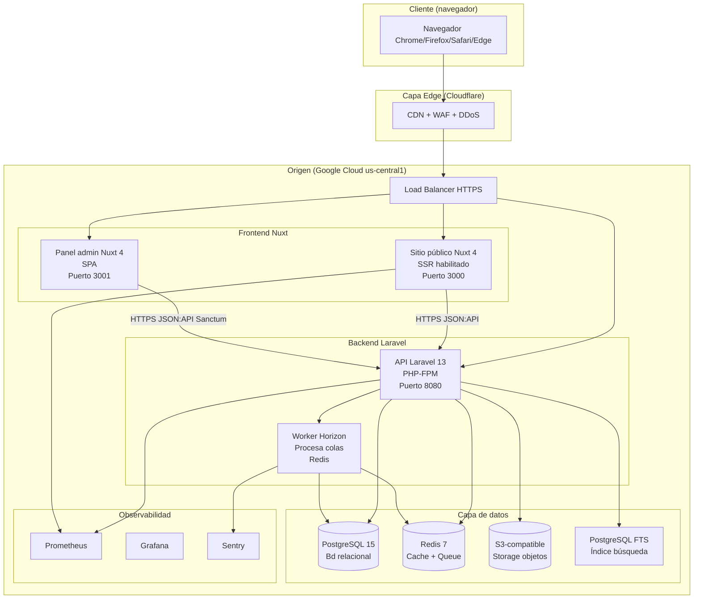
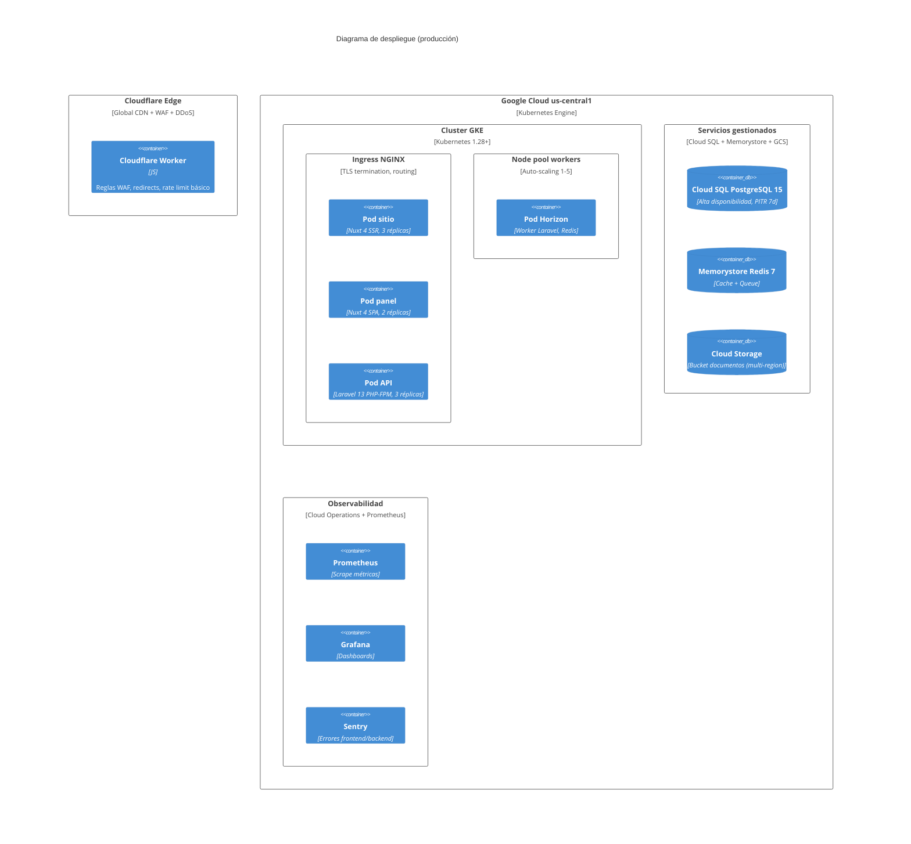
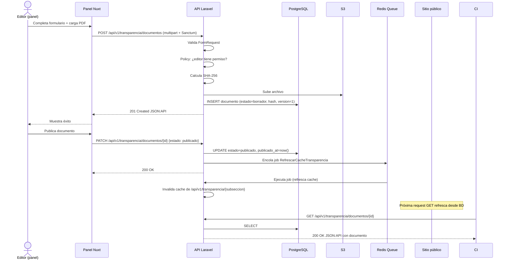

# Diagramas C4 — Modelado Arquitectónico

> **Marco:** C4 Model de Simon Brown [16]. Los 4 niveles son: C1 (Contexto), C2 (Contenedores), C3 (Componentes), C4 (Código).
> **Herramienta:** Mermaid `C4Context`, `C4Container`, `C4Component`, `C4Deployment`.
> **Trazabilidad:** cada diagrama referencia los ADRs que justifican las decisiones.

---

## C1 — Contexto del sistema

> Ver `vision-arquitectonica.md` §5 para el diagrama principal.

### Personas (actores externos)

| Persona | Descripción | Interacción |
|---|---|---|
| Ciudadano | Persona natural o jurídica, nacional o extranjera, identificada o anónima | Consulta pública de transparencia, trámites, directorio |
| Administrador / Editor | Funcionario de la Alcaldía con rol específico | Edita y publica contenidos, gestiona documentos |
| Ente de control | MinTIC, AGN, SIC, Procuraduría, Contraloría | Audita cumplimiento ITA, recibe reportes |
| Turista | Visitante del Distrito Turístico | Consulta información turística y de servicios |

### Sistemas externos

| Sistema | Función | Protocolo |
|---|---|---|
| GOV.CO | Portal único del Estado, redireccionamiento con enmascaramiento | HTTPS |
| SIGEP | Sistema de Información y Gestión del Empleo Público | API REST (DAFP) |
| SECOP I/II | Sistema Electrónico de Contratación Pública | HTTPS |
| SUIN | Sistema Único de Información Normativa | HTTPS |
| SUCOP | Sistema Único de Consulta Pública (normas en consulta) | API |
| datos.gov.co | Portal de Datos Abiertos Colombia | API CKAN |
| AND | Servicios Ciudadanos Digitales: SSO, Carpeta, Interoperabilidad | OpenID Connect / X-Road |

---

## C2 — Contenedores

### Vista lógica de despliegue



### Justificación de decisiones en C2

- **Sitio Nuxt con SSR habilitado:** SEO crítico para transparencia pública (Art. 9 Ley 1712). El SSR genera HTML con contenido real para los crawlers de búsqueda.
- **Panel Nuxt como SPA:** la autenticación Sanctum con cookies de sesión se beneficia de una SPA que puede manejar el CSRF y las cookies HttpOnly.
- **API Laravel única:** única superficie de negocio; evita duplicación de lógica entre los dos clientes.
- **Worker separado (Horizon):** tareas pesadas (sincronización SIGEP, cálculo de hash, generación de PDFs) no bloquean requests HTTP.
- **PostgreSQL como BD única:** soporta relacional, JSON, FTS, full ACID, partitioning, RLS.
- **Redis como cache + queue:** cache de respuestas API, sesiones Sanctum, colas de jobs.
- **S3 para documentos:** almacenamiento durable, replicación, ciclo de vida a Glacier.

---

## C3 — Componentes del Backend (Laravel)

> Ver `README.md` §3 para el diagrama principal.

### Servicios de aplicación clave

| Servicio | Responsabilidad | Patrón |
|---|---|---|
| `IdentidadService` | Top bar, footer, header, menú, navegación | Repository + Cache |
| `TransparenciaService` | 10 subsecciones, documentos, búsqueda, filtros | Repository + SearchIndex |
| `DocumentoService` | Upload, hash SHA-256, versionado, soft-delete | Strategy (StorageAdapter) + Event |
| `DirectorioService` | Servidores públicos, dependencias, sincronización SIGEP | Repository + Job (sincronización) |
| `NoticiaService` | Noticias, carrusel, paginación | Repository + Cache |
| `NormogramaService` | Normativa, SUIN, SUCOP | Repository + LinkValidator |
| `ContratacionService` | SECOP, manual de contratación | LinkValidator |
| `BusquedaService` | Full-text search, autocompletado, sugerencias | SearchEngineAdapter |
| `NotificacionService` | Emails, alertas, tablero interno | Event + Job |
| `AuditoriaService` | Log de auditoría, exportación | Middleware + Channel |

---

## C4 — Código (vista de paquetes)

### Estructura de paquetes del Backend

```
backend/
├── app/
│   ├── Console/
│   │   └── Commands/          # Comandos artisan (CLI)
│   ├── Enums/                 # Enumeraciones del dominio
│   ├── Events/                # Eventos de dominio
│   ├── Exceptions/            # Excepciones personalizadas
│   ├── Http/
│   │   ├── Controllers/
│   │   │   ├── Controller.php
│   │   │   └── Api/V1/
│   │   │       ├── Identidad/   # Endpoints identidad
│   │   │       ├── Transparencia/ # Endpoints transparencia
│   │   │       ├── Directorio/    # Endpoints directorio
│   │   │       ├── Busqueda/      # Endpoints búsqueda
│   │   │       └── ...
│   │   ├── Middleware/        # Auth, CORS, RateLimit, JSON:API
│   │   ├── Requests/          # Form Requests (validación)
│   │   └── Resources/         # JSON:API Resources
│   ├── Jobs/                  # Jobs encolados
│   ├── Listeners/             # Listeners de eventos
│   ├── Models/                # Eloquent Models
│   ├── Policies/              # Policies de autorización
│   ├── Providers/             # Service Providers
│   ├── Repositories/          # Repositorios (patrón)
│   ├── Rules/                 # Reglas de validación custom
│   ├── Services/              # Lógica de negocio
│   └── Support/               # Clases de soporte
├── bootstrap/
├── config/
├── database/
│   ├── factories/
│   ├── migrations/
│   ├── seeders/
│   └── datos/                 # SQL seed inicial (normas, dependencias)
├── public/
├── resources/
├── routes/
│   ├── api.php                # Rutas API
│   ├── console.php
│   ├── salud.php              # Health check
│   └── web.php                # Solo redirige a /api o al sitio
├── storage/
└── tests/
    ├── Feature/               # Tests de integración
    └── Unit/                  # Tests unitarios
```

### Estructura de paquetes del Frontend (Nuxt sitio)

```
sitio/
├── app/
│   ├── app.vue                # Root component
│   ├── error.vue              # Página de error
│   ├── assets/                # CSS, imágenes, fuentes
│   ├── components/
│   │   ├── identidad/         # TopBar, Footer, Header, Menu
│   │   ├── transparencia/     # DocumentoLista, SubseccionMenu, Buscador
│   │   ├── directorio/        # DirectorioCard, ServidorTable
│   │   ├── ui/                # Componentes base (botones, cards)
│   │   └── accesibilidad/     # BarraAccesibilidad, SkipLink
│   ├── composables/           # Composables (useApi, useFiltros, useIdioma)
│   ├── config/                # Constantes
│   ├── layouts/               # DefaultLayout, ErrorLayout
│   ├── pages/                 # Rutas (Nuxt file-based)
│   │   ├── index.vue
│   │   ├── transparencia/
│   │   │   ├── index.vue
│   │   │   ├── informacion-de-la-entidad/
│   │   │   ├── normativa/
│   │   │   └── ...
│   │   ├── directorio/
│   │   ├── noticias/
│   │   └── ...
│   ├── plugins/               # Plugins Nuxt
│   └── types/                 # Tipos TS generados del OpenAPI
├── public/
├── server/                    # Server middleware
├── tests/
└── nuxt.config.ts
```

### Estructura de paquetes del Frontend (Nuxt panel)

```
panel/
├── src/
│   ├── assets/
│   ├── components/
│   │   ├── admin/             # Componentes de gestión
│   │   ├── editor/            # Editor de texto enriquecido
│   │   ├── documentos/        # Upload, versionado, hash
│   │   ├── noticias/
│   │   ├── usuarios/          # Gestión usuarios y roles
│   │   ├── auditoria/         # Tabla de auditoría
│   │   ├── ita/               # Tablero ITA interno
│   │   └── ui/
│   ├── config/
│   ├── layouts/
│   ├── plugins/
│   ├── router/
│   ├── services/              # http.ts (cliente Axios + Sanctum)
│   ├── stores/                # Pinia stores
│   │   ├── sesion.ts
│   │   ├── transparencia.ts
│   │   ├── documentos.ts
│   │   └── ...
│   ├── types/
│   └── views/
│       ├── acceso/            # Login, MFA, recuperación
│       └── admin/             # Inicio, gestión
├── tests/
└── vite.config.ts
```

---

## Diagrama de despliegue



---

## Mapa de flujos transversales

### Flujo de publicación de un documento (CRUD panel → sitio público)



---

## Convenciones de diagramación

- **Colores:** no usar color en los Mermaid (problemas de accesibilidad al imprimir).
- **Etiquetas:** usar nombres descriptivos (no abreviaturas oscuras).
- **Agrupación:** usar `subgraph` para delimitar contextos físicos o lógicos.
- **Trazabilidad:** cada diagrama referencia los ADRs que justifican sus decisiones.
