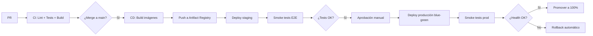
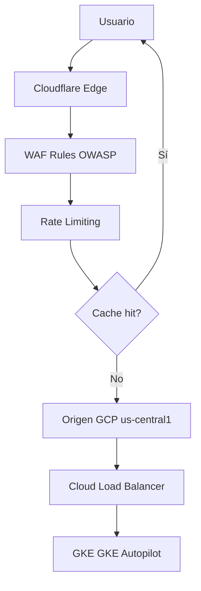

# Estrategia de Despliegue

> **Marco:** ADR-015 (Google Cloud), Cloudflare Edge, GitHub Actions CI/CD, observabilidad Prometheus/Grafana/Sentry.
> **Entornos:** `local` (dev), `staging` (pre-producción), `production`.

---

## 1. Entornos

### 1.1 Local
- **Stack:** Docker Compose con servicios `postgres`, `redis`, `minio`, `backend`, `sitio`, `panel`.
- **Dominios:** `http://localhost:3000` (sitio), `http://localhost:3001` (panel), `http://localhost:8080` (API), `http://localhost:9000` (MinIO console).
- **Semilla:** `composer seed:dev` carga datos ficticios.

### 1.2 Staging
- **Stack:** GCP proyecto `sede-staging`, mismo stack que producción pero con datos sintéticos.
- **Dominios:** `https://staging.santamarta.gov.co`, `https://panel-staging.santamarta.gov.co`.
- **Base de datos:** snapshot anonimizado de producción con periodicidad semanal.

### 1.3 Producción
- **Stack:** GCP proyecto `sede-prod` con HA en multi-zona.
- **Dominios:** `https://www.santamarta.gov.co`, `https://panel.santamarta.gov.co`.
- **Base de datos:** Cloud SQL con PITR 7 días, backups diarios a GCS Coldline.

---

## 2. CI/CD con GitHub Actions

### 2.1 Pipelines



### 2.2 Etapas del CI

| Etapa | Backend | Frontend |
|---|---|---|
| Lint | `pint --test` | `eslint`, `prettier --check` |
| Análisis estático | `larastan analyse` | `tsc --noEmit` |
| Tests | `pest --coverage` | `vitest --coverage` |
| Accesibilidad | — | `playwright test --grep @a11y` |
| Build | `composer install --no-dev` | `pnpm build` |
| OpenAPI drift | `php artisan contract:verificar-drift` | `pnpm openapi:generar-ts` |

### 2.3 Etapas del CD

| Etapa | Acción |
|---|---|
| Build imágenes | Kaniko → Artifact Registry |
| Deploy staging | `kubectl apply -k deploy/kubernetes/overlays/staging` |
| Smoke E2E | Playwright sobre URLs críticas |
| Deploy prod (canary 10%) | Knative serving con traffic split 10/90 |
| Validación canary | 5 min con métricas OK (errores < 0.1%, latencia p95 < 500 ms) |
| Promoción a 100% | `kubectl patch service` con `traffic=100` |
| Notificación | Slack + email al G-CIO |

---

## 3. Observabilidad

### 3.1 Logs
- **Stack:** Loki + Promtail.
- **Estructura:** JSON con `request_id`, `user_id`, `route`, `latency_ms`, `status_code`, `level`.
- **Retención:** 30 días hot, 1 año cold en GCS.

### 3.2 Métricas
- **Stack:** Prometheus + Grafana.
- **Métricas clave:**
  - `http_requests_total{method,route,status}` — counter.
  - `http_request_duration_seconds{method,route}` — histogram.
  - `cache_hit_ratio{service}` — gauge.
  - `queue_size{queue}` — gauge.
  - `db_query_duration_seconds{query_type}` — histogram.
  - `it_tableros_no_cumplen` — gauge (negocio).
  - `documentos_pendientes_publicar` — gauge (negocio).

### 3.3 Trazas distribuidas
- **Stack:** OpenTelemetry + Jaeger.
- **Propagación:** `traceparent` header (W3C Trace Context).

### 3.4 Errores
- **Stack:** Sentry.
- **Configuración:** tracing sample rate 0.1 en producción, 1.0 en staging.

### 3.5 Alertas (PagerDuty / Slack)

| Alerta | Condición | Severidad |
|---|---|---|
| `ErrorRateAlta` | `http_requests_total{status=~"5.."}` / total > 1% por 5 min | P2 |
| `LatenciaAlta` | p95 > 500 ms por 5 min | P3 |
| `BDCaida` | `pg_up == 0` por 1 min | P1 |
| `ColaAtrasada` | `queue_size > 1000` por 10 min | P3 |
| `DiscoLleno` | `disk_usage > 85%` | P2 |
| `CertificadoExpira` | `cert_expires_in_days < 30` | P3 |

---

## 4. Backups

| Recurso | Frecuencia | Retención | Almacenamiento |
|---|---|---|---|
| PostgreSQL (PITR) | Continuo (WAL archiving) | 7 días | Cloud SQL automático |
| PostgreSQL (full) | Diario 02:00 UTC | 30 días | GCS Nearline |
| PostgreSQL (mensual) | Mensual | 1 año | GCS Coldline |
| Documentos S3 | Continuo (versionado) | Indefinido | GCS Standard |
| Configuración Kubernetes | GitOps (cada commit) | Indefinido | GitHub |
| Secrets | — | — | GCP Secret Manager |

---

## 5. Plan de disaster recovery

| Escenario | RTO | RPO | Mitigación |
|---|---|---|---|
| Caída de una zona GCP | 30 min | 0 (HA multi-zona) | GKE multi-zona + Cloud SQL HA |
| Caída completa GCP | 4 horas | 1 hora | Restaurar desde backup en otra región |
| Pérdida de BD | 4 horas | 1 hora | PITR + restore desde Cloud Storage |
| Pérdida de documentos | N/A | 0 (versionado S3) | Restaurar versión desde S3 |
| Corrupción de código | 1 hora | 0 (Git) | Revert a commit anterior + redeploy |

---

## 6. Cloudflare — configuración



### 6.1 Reglas WAF (Managed Rules)
- Cloudflare OWASP ModSecurity CRS: ON.
- Bot Fight Mode: ON (excepto para crawlers verificados).
- Browser Integrity Check: ON.

### 6.2 Rate Limiting
- `/api/v1/*`: 60 req/min por IP (complementa el rate limit Laravel).
- `/api/v1/panel/login`: 10 req/min por IP (más estricto que Laravel).

### 6.3 Caching
- `*.js`, `*.css`, `*.woff2`, `*.png`, `*.jpg`: `Cache-Control: public, max-age=31536000, immutable`.
- `*.html`, `/`: `Cache-Control: public, max-age=300, must-revalidate`.
- `/api/v1/*`: bypass (cachear en Laravel, no en Cloudflare).

---

## 7. Costos estimados mensuales (USD)

| Recurso | Costo |
|---|---|
| GKE Autopilot (3 pods API + 2 sitios + 2 panel + 1 horizon) | 280 |
| Cloud SQL PostgreSQL HA (4 vCPU, 16 GB RAM, 100 GB SSD) | 320 |
| Memorystore Redis HA (2 GB) | 60 |
| Cloud Storage (500 GB Standard + lifecycle) | 12 |
| Cloud Load Balancer | 18 |
| Egress (estimado 200 GB/mes) | 12 |
| Cloudflare Business | 200 |
| Sentry (Team plan) | 26 |
| Datadog/Prometheus (alternativa) | 0 (self-hosted) |
| **Total operación** | **~USD 928/mes** |
| Reserva para picos (+30%) | +280 |
| **Total presupuesto** | **~USD 1200/mes** |

---

## 8. Procedimiento de deploy manual de emergencia

Si GitHub Actions falla y se requiere deploy urgente:

```bash
# 1. Autenticarse
gcloud auth login
gcloud config set project sede-prod

# 2. Build manual
docker build -t gcr.io/sede-prod/api:$TAG backend/
docker push gcr.io/sede-prod/api:$TAG

# 3. Deploy
kubectl set image deployment/api api=gcr.io/sede-prod/api:$TAG -n sede
kubectl rollout status deployment/api -n sede

# 4. Validar
curl https://api.santamarta.gov.co/api/v1/salud
```

**Antes de cualquier deploy manual:** comunicar al G-CIO, documentar en bitácora, abrir PR retroactivo.
