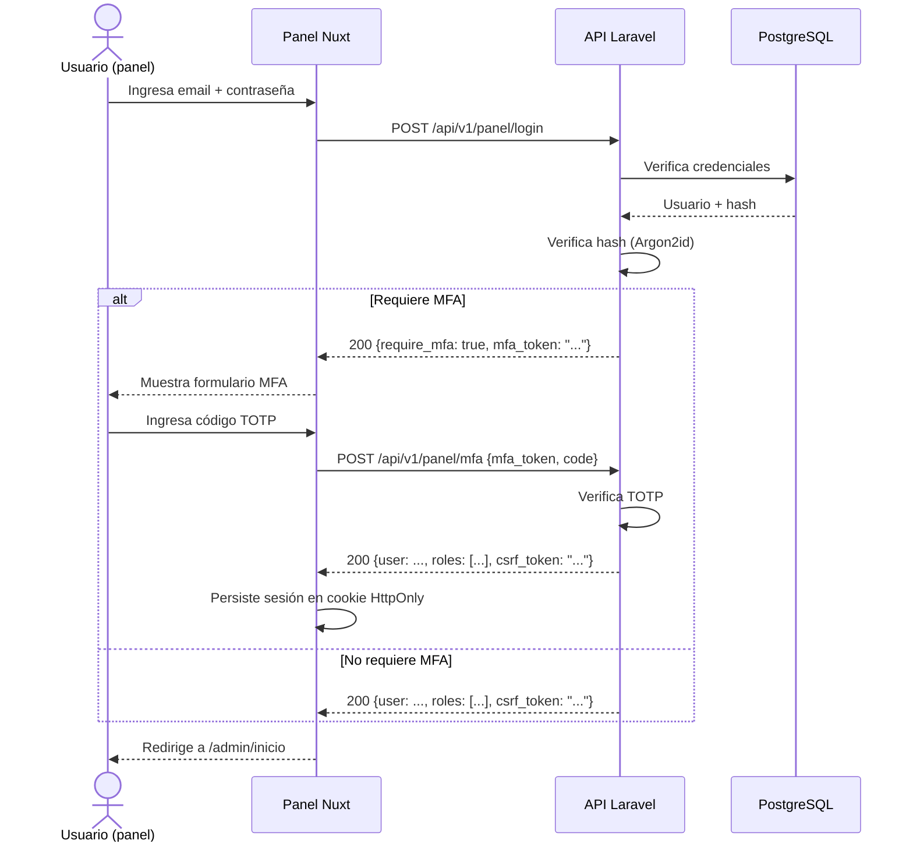

# Patrón de Comunicación Frontend ↔ Backend

> **Marco:** REST + JSON:API 1.0 + Sanctum + CORS + Rate Limit + Versionado URL.
> **Trazabilidad:** RT-02, RT-05, RT-07, RT-11, ADR-004, ADR-005, ADR-006.

---

## 1. Anatomía de una request

### 1.1 Request típico del sitio público

```http
GET /api/v1/transparencia/documentos?filter[subseccion]=normativa&sort=-fecha_publicacion&page[number]=1&page[size]=20&include=metadatos HTTP/1.1
Host: api.santamarta.gov.co
Accept: application/vnd.api+json
Accept-Language: es-CO,es;q=0.9
User-Agent: Mozilla/5.0 ...
X-Request-ID: 01HXYZABC...
```

### 1.2 Request típico del panel (autenticado)

```http
POST /api/v1/panel/documentos HTTP/1.1
Host: api.santamarta.gov.co
Accept: application/vnd.api+json
Content-Type: application/vnd.api+json
Authorization: Bearer <token-o-cookie>
X-Request-ID: 01HXYZDEF...
X-CSRF-TOKEN: <csrf-token>
Referer: https://panel.santamarta.gov.co

{
  "data": {
    "type": "documento",
    "attributes": {
      "titulo": "Plan de Acción 2026",
      "subseccion": "planeacion",
      "categoria": "plan_accion",
      "fecha_publicacion": "2026-01-15"
    },
    "relationships": {
      "archivo": {
        "data": { "type": "archivo", "id": "nuevo" }
      }
    }
  }
}
```

---

## 2. Versionado de la API

- **Estrategia:** versionado por URL (`/api/v1/`, `/api/v2/`).
- **Política de compatibilidad:**
  - Aditivos (nuevos campos, nuevos endpoints): compatibles hacia atrás.
  - Eliminación de campo o cambio de tipo: requiere nueva versión major.
  - Deprecación: anuncio en `Sunset` header con fecha de retirement ≥ 6 meses.
- **CI:** verifica que los tipos TS generados coincidan con la spec OpenAPI (`contract:verificar-drift`).

---

## 3. JSON:API 1.0 — Capacidades clave

### 3.1 Sorting

```
GET /api/v1/transparencia/documentos?sort=-fecha_publicacion,titulo
```

### 3.2 Filtering (específico por recurso)

```
GET /api/v1/transparencia/documentos?filter[subseccion]=normativa&filter[vigencia]=2026
```

### 3.3 Sparse fieldsets

```
GET /api/v1/transparencia/documentos?fields[documento]=titulo,fecha_publicacion,hash_sha256
```

### 3.4 Include (relaciones)

```
GET /api/v1/transparencia/documentos/123?include=metadatos,archivo
GET /api/v1/transparencia/documentos?include=metadatos.subseccion
```

### 3.5 Pagination

```
GET /api/v1/transparencia/documentos?page[number]=2&page[size]=20
```

Respuesta con metadatos:
```json
{
  "links": {
    "first": "/api/v1/transparencia/documentos?page[number]=1&page[size]=20",
    "last": "/api/v1/transparencia/documentos?page[number]=42&page[size]=20",
    "prev": "/api/v1/transparencia/documentos?page[number]=1&page[size]=20",
    "next": "/api/v1/transparencia/documentos?page[number]=3&page[size]=20"
  },
  "meta": {
    "total": 832
  },
  "data": [...]
}
```

---

## 4. Autenticación (Sanctum)

### 4.1 Sitio público
- **Sin autenticación.** Las rutas son `security: []` en OpenAPI.
- Cookies de sesión NO se emiten.

### 4.2 Panel admin
- **Cookie HttpOnly + CSRF token** para sesión de navegador.
- **Bearer Token** opcional para integraciones externas (CI/CD, scripts).
- **MFA TOTP** obligatorio para roles `editor`, `aprobador`, `administrador`, `seguridad`.
- **Bloqueo:** 5 intentos fallidos → bloqueo 15 min (RNF-SEG-02).

### 4.3 Flujo de login del panel



---

## 5. CORS

Configuración en `backend/config/cors.php`:

```php
<?php

return [
    'paths' => ['api/*', 'sanctum/csrf-cookie'],
    'allowed_methods' => ['GET', 'POST', 'PATCH', 'PUT', 'DELETE', 'OPTIONS'],
    'allowed_origins' => [
        'https://www.santamarta.gov.co',
        'https://santamarta.gov.co',
        'https://panel.santamarta.gov.co',
        // Dev
        'http://localhost:3000',
        'http://localhost:3001',
        'http://127.0.0.1:3000',
        'http://127.0.0.1:3001',
    ],
    'allowed_origins_patterns' => [],
    'allowed_headers' => ['Content-Type', 'Authorization', 'X-Requested-With', 'X-CSRF-TOKEN', 'Accept'],
    'exposed_headers' => ['X-Request-ID', 'X-RateLimit-Remaining', 'X-RateLimit-Reset'],
    'max_age' => 86400,
    'supports_credentials' => true,
];
```

---

## 6. Rate Limiting

| Endpoint | Límite | Ventana | Key |
|---|---|---|---|
| `GET /api/v1/*` (público) | 60 req | 1 min | IP |
| `POST /api/v1/panel/login` | 5 req | 15 min | IP + email |
| `POST /api/v1/panel/mfa` | 5 req | 15 min | IP + mfa_token |
| `GET /api/v1/buscar` | 120 req | 1 min | IP |
| Otros `POST/PATCH/DELETE` (autenticado) | 300 req | 1 min | user_id |

Cabeceras de respuesta:
```http
X-RateLimit-Limit: 60
X-RateLimit-Remaining: 45
X-RateLimit-Reset: 1700000000
Retry-After: 60
```

---

## 7. Manejo de errores (JSON:API)

### 7.1 Formato de error estándar

```json
{
  "jsonapi": {
    "version": "1.0"
  },
  "errors": [
    {
      "status": "422",
      "code": "VALIDATION_FAILED",
      "title": "Validación fallida",
      "detail": "El campo 'titulo' es obligatorio",
      "source": {
        "pointer": "/data/attributes/titulo"
      },
      "meta": {
        "request_id": "01HXYZABC..."
      }
    }
  ]
}
```

### 7.2 Catálogo de errores

| HTTP | Código | Descripción |
|---|---|---|
| 400 | BAD_REQUEST | Parámetros mal formados |
| 401 | UNAUTHENTICATED | Falta token o expiró |
| 403 | UNAUTHORIZED | Permisos insuficientes |
| 404 | NOT_FOUND | Recurso no existe |
| 405 | METHOD_NOT_ALLOWED | Método no soportado en la ruta |
| 409 | CONFLICT | Conflicto (ej. versión obsoleta) |
| 422 | VALIDATION_FAILED | Validación de FormRequest fallida |
| 429 | TOO_MANY_REQUESTS | Rate limit excedido |
| 500 | INTERNAL_SERVER_ERROR | Error no controlado |
| 503 | SERVICE_UNAVAILABLE | BD o servicio dependiente caído |

---

## 8. Idempotencia

Operaciones de escritura críticas aceptan header `Idempotency-Key`:

```http
POST /api/v1/panel/documentos HTTP/1.1
Idempotency-Key: 01HXYZ12345
```

- TTL: 24 horas.
- Si se repite la misma `Idempotency-Key` con el mismo body, se devuelve la respuesta cacheada.
- Si se repite con body distinto, se devuelve HTTP 409 CONFLICT.

---

## 9. Versionado de los tipos TypeScript

```bash
# CI pipeline
npm run -w contract openapi:generar-ts
# → genera sitio/app/types/api.d.ts y panel/src/types/api.d.ts
```

Los clientes consumen **siempre** los tipos generados; nunca declaran tipos manualmente para objetos que vienen de la API.

---

## 10. Logging y trazabilidad

Cada request genera:
- Log estructurado en JSON (Laravel `Log::info(...)`) con `request_id`, `user_id`, `route`, `latency_ms`, `status_code`.
- Métrica Prometheus: `http_requests_total{method,route,status}`, `http_request_duration_seconds{method,route}`.
- Correlación con Sentry si `status >= 500`.

```
[GIN] 2026-10-01 17:00:00.000 GET /api/v1/transparencia/documentos | 200 | 45ms | request_id=01HXYZABC... user_id=null
```
