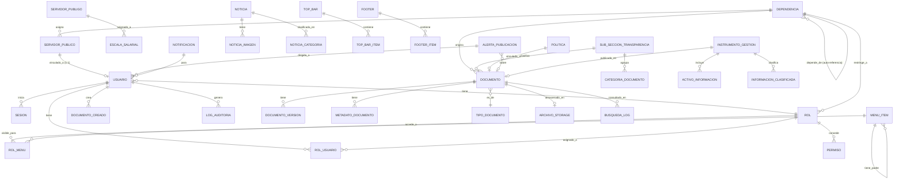

# 04 — Diseño de Base de Datos

> **Alcance:** esquema relacional completo para los módulos **01-estructura-identidad** y **02-transparencia** de la Sede Electrónica del Distrito de Santa Marta.
> **Motor:** PostgreSQL 15+ (ADR-003) con extensiones `pg_trgm`, `unaccent`, `uuid-ossp`.
> **Normalización objetivo:** 3FN mínimo; BCNF cuando es posible; 4FN para polimorfismos.
> **Trazabilidad:** cada tabla referencia los RF/RNF que la motivan.
> **Inspección rápida:** ver `sede-electronica-doc/_bd/03-modelo-logico.md` y `04-modelo-fisico.md` para el modelo integrado de toda la sede (este paquete cubre solo los dos módulos en alcance + `_bd` común).

---

## Índice

| Archivo | Contenido |
|---|---|
| `modelo-er.md` | Diagrama ER Mermaid + lista de tablas y relaciones |
| `normalizacion-1fn-2fn-3fn.md` | Análisis de normalización tabla por tabla (1FN/2FN/3FN/BCNF) |
| `diccionario-datos.md` | Diccionario de datos completo: columnas, tipos, defaults, restricciones |
| `indices-y-rendimiento.md` | Índices, planes de ejecución esperados, particionamiento |
| `migraciones-seeders.md` | Listado de migraciones Laravel 13 + seeders |
| `politicas-integridad.md` | Triggers, constraints, RLS (Row Level Security) |

---

## Resumen ejecutivo

| Métrica | Valor |
|---|---|
| Total de tablas nuevas | **27** |
| Tablas adicionales de `_bd` común reutilizadas | ~15 (usuarios, roles, auditoría, etc.) |
| Tablas con particionamiento | 2 (`log_auditoria`, `documento_version`) |
| Tablas con RLS | 4 (las que contienen datos personales) |
| Vistas materializadas | 2 (`mv_documentos_subseccion`, `mv_servidor_publico`) |
| Extensiones PostgreSQL requeridas | `pg_trgm`, `unaccent`, `uuid-ossp`, `pgcrypto` |
| Forma normal mínima alcanzada | **BCNF** (3FN estricto + eliminación de DF redundantes) |

---

## Diagrama ER — visión general

---

## Tablas por módulo

### Módulo 01 — Estructura-Identidad (8 tablas)

| Tabla | Propósito | Forma Normal |
|---|---|---|
| `dependencia` | Organigrama (secretarías, oficinas, gerencias) | BCNF |
| `servidor_publico` | Directorio de servidores públicos (vinculado a SIGEP) | BCNF |
| `escala_salarial` | Escala salarial por cargo | BCNF |
| `menu_item` | Menú principal de navegación (estructura jerárquica) | BCNF |
| `rol_menu` | Visibilidad de ítems de menú por rol | BCNF |
| `top_bar` y `top_bar_item` | Barra superior GOV.CO | BCNF |
| `footer` y `footer_item` | Pie de página GOV.CO | BCNF |
| `noticia` y `noticia_imagen` | Noticias del home y detalle | BCNF |

### Módulo 02 — Transparencia (15 tablas)

| Tabla | Propósito | Forma Normal |
|---|---|---|
| `subseccion_transparencia` | 10 subsecciones de Ley 1712/2014 | BCNF |
| `categoria_documento` | Categorías dentro de cada subsección | BCNF |
| `tipo_documento` | PDF, XLSX, CSV, JSON, RDF, ODF, ... | BCNF |
| `documento` | Documento principal (cabecera) | BCNF |
| `documento_version` | Versiones históricas de un documento | BCNF |
| `metadato_documento` | Metadatos extendidos (Dublin Core + GOV.CO) | BCNF |
| `archivo_storage` | Metadata del archivo en S3 (path, hash, mime) | BCNF |
| `busqueda_log` | Log de búsquedas para mejorar ranking | BCNF |
| `alerta_publicacion` | Alertas de vencimiento de publicaciones obligatorias | BCNF |
| `instrumento_gestion` | 5 instrumentos Ley 1712 (Registro, Índice, Esquema, PGD, TRD) | BCNF |
| `activo_informacion` | Registro de activos de información | BCNF |
| `informacion_clasificada` | Índice de información clasificada | BCNF |
| `politica` | Términos, privacidad, cookies, derechos autor, accesibilidad | BCNF |
| `dependencia_origen_documento` | N:M dependencia↔documento | BCNF |
| `ita_item` | Items del tablero ITA interno | BCNF |
| `ita_evaluacion` | Evaluaciones del ITA por periodo | BCNF |

### `_bd` común (4 tablas transversales)

| Tabla | Propósito | Forma Normal |
|---|---|---|
| `usuario` | Usuarios del panel (interno y externo) | BCNF |
| `rol` y `rol_usuario` | RBAC | BCNF |
| `permiso` | Permisos granulares | BCNF |
| `log_auditoria` | Log de auditoría inmutable (PARTICIONADA) | BCNF |

> **Detalle completo:** ver `diccionario-datos.md` con todas las columnas, tipos, restricciones e índices.
