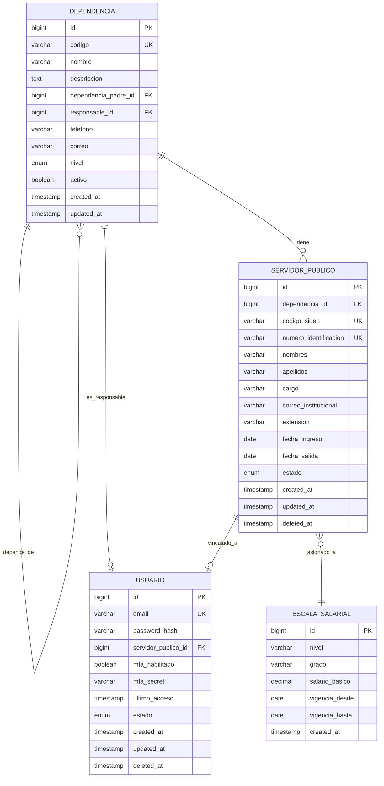
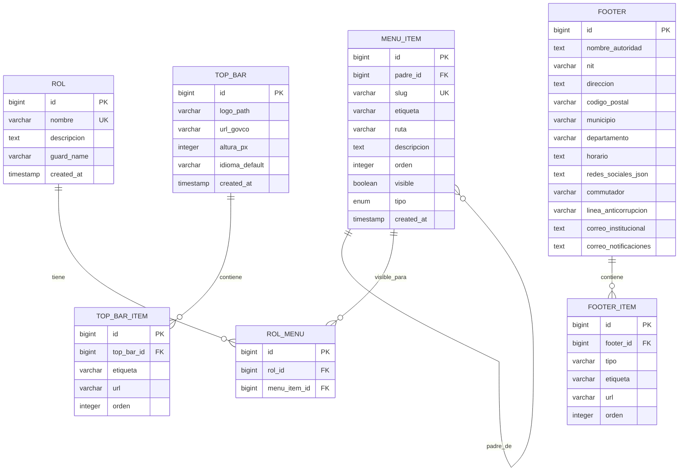
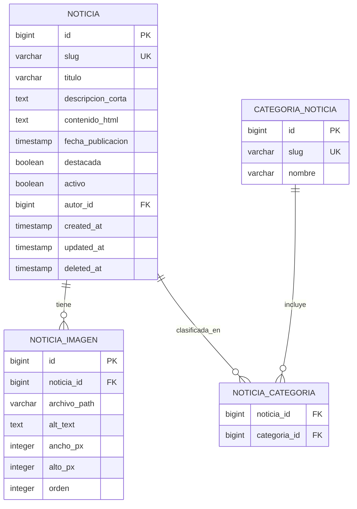
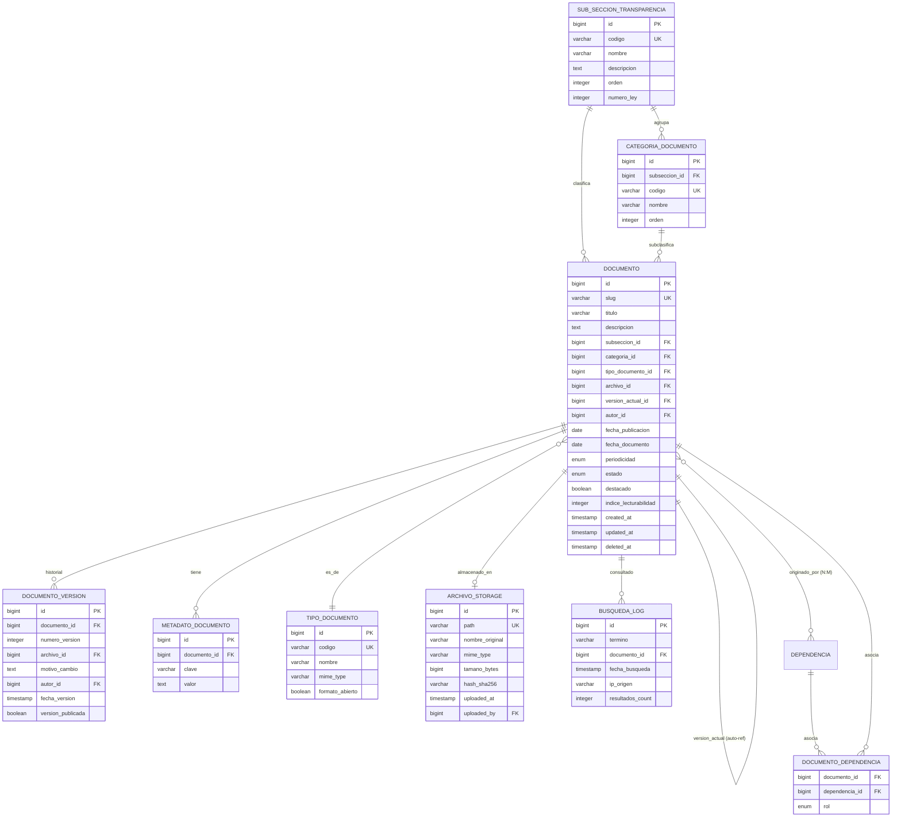
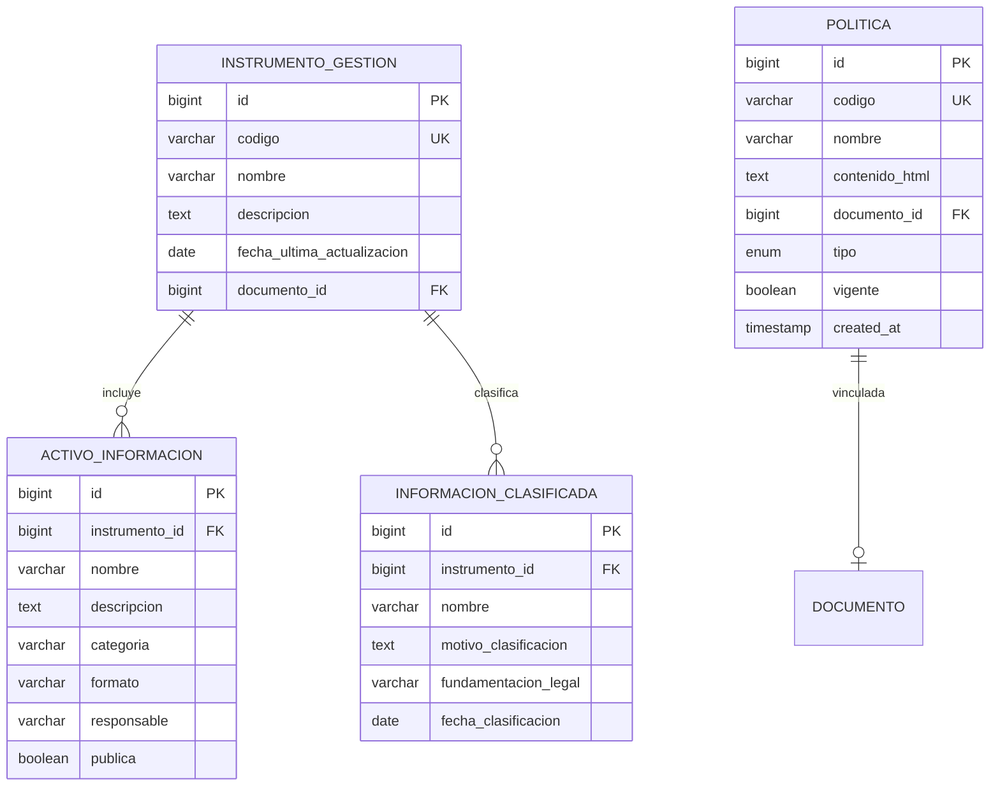
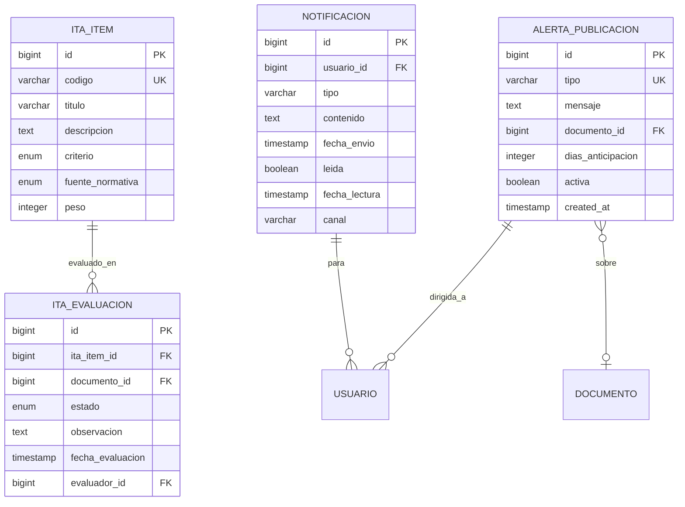
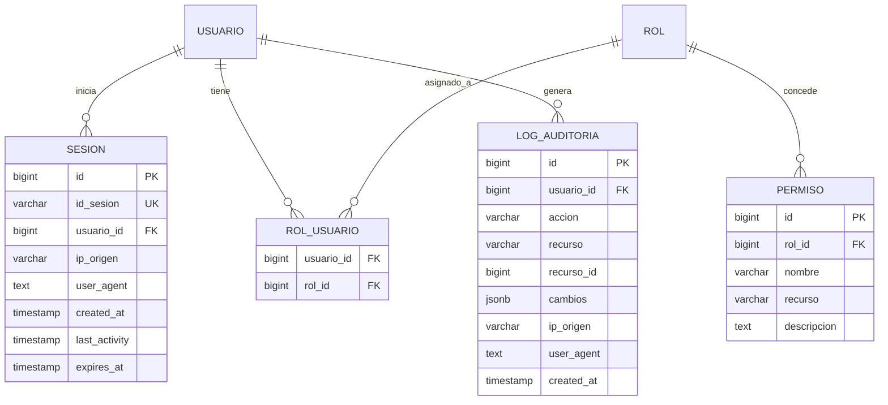

# Modelo Entidad-Relación (Mermaid)

> **Sintaxis:** Mermaid `erDiagram`.
> **Leyenda:** `||--o{` = uno a cero-o-muchos; `}o--||` = cero-o-muchos a uno; `}o--o{` = muchos a muchos.
> **Convención:** nombres de tabla en `snake_case` (PostgreSQL), PK = `id BIGINT` (excepto catálogos que usan PK natural).

---

## 1. Núcleo de Identidad (Módulo 01)



---

## 2. Menú e Identidad GOV.CO



---

## 3. Noticias y contenido dinámico



---

## 4. Transparencia — Núcleo (Módulo 02)



---

## 5. Transparencia — Instrumentos y Políticas



---

## 6. Tablero ITA y Alertas



---

## 7. Auditoría y RBAC (`_bd` común)



---

## 8. Vistas materializadas (para performance)

```sql
-- Documentos por subsección, listos para servir en /api/v1/transparencia/subseccion/{slug}
CREATE MATERIALIZED VIEW mv_documentos_subseccion AS
SELECT
  d.id,
  d.slug,
  d.titulo,
  d.descripcion,
  d.fecha_publicacion,
  d.periodicidad,
  d.estado,
  st.codigo AS subseccion_codigo,
  st.nombre AS subseccion_nombre,
  cd.codigo AS categoria_codigo,
  td.codigo AS tipo_codigo,
  a.path AS archivo_path,
  a.hash_sha256,
  d.indice_lecturabilidad,
  to_tsvector('spanish', coalesce(d.titulo, '') || ' ' || coalesce(d.descripcion, '')) AS fts
FROM documento d
JOIN subseccion_transparencia st ON d.subseccion_id = st.id
LEFT JOIN categoria_documento cd ON d.categoria_id = cd.id
JOIN tipo_documento td ON d.tipo_documento_id = td.id
JOIN archivo_storage a ON d.archivo_id = a.id
WHERE d.deleted_at IS NULL
  AND d.estado = 'publicado';

CREATE UNIQUE INDEX idx_mv_doc_subsec ON mv_documentos_subseccion (id);
CREATE INDEX idx_mv_doc_subsec_subsec ON mv_documentos_subseccion (subseccion_codigo);
CREATE INDEX idx_mv_doc_subsec_fts ON mv_documentos_subseccion USING GIN (fts);

-- Servidores por dependencia
CREATE MATERIALIZED VIEW mv_servidor_publico AS
SELECT
  sp.id,
  sp.codigo_sigep,
  sp.nombres,
  sp.apellidos,
  sp.cargo,
  sp.correo_institucional,
  sp.extension,
  d.codigo AS dependencia_codigo,
  d.nombre AS dependencia_nombre,
  sp.estado
FROM servidor_publico sp
JOIN dependencia d ON sp.dependencia_id = d.id
WHERE sp.deleted_at IS NULL
  AND sp.estado = 'activo';

CREATE UNIQUE INDEX idx_mv_serv ON mv_servidor_publico (id);
CREATE INDEX idx_mv_serv_dep ON mv_servidor_publico (dependencia_codigo);
```

---

## 9. Resumen de cardinalidades clave

| Relación | Tipo | Justificación |
|---|---|---|
| `dependencia` → `servidor_publico` | 1:N | Una dependencia agrupa N servidores |
| `dependencia` → `dependencia` | 1:N (auto-ref) | Organigrama jerárquico (secretaría → oficina) |
| `subseccion_transparencia` → `categoria_documento` | 1:N | Una subsección agrupa N categorías |
| `subseccion_transparencia` → `documento` | 1:N | Una subsección contiene N documentos |
| `documento` → `documento_version` | 1:N | Historial de versiones |
| `documento` → `metadato_documento` | 1:N | Metadatos Dublin Core (pares clave-valor) |
| `documento` ↔ `dependencia` | N:M | Un documento puede ser de varias dependencias |
| `usuario` ↔ `rol` | N:M | Un usuario tiene N roles; un rol tiene N usuarios |
| `menu_item` → `rol_menu` → `rol` | N:M | Visibilidad de menú por rol |
| `alerta_publicacion` → `usuario` | N:M (implícita por notificación) | Alertas dirigidas a N usuarios |
