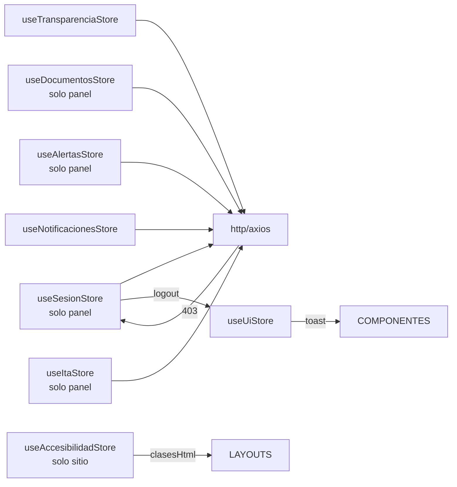

# Stores Pinia

> **Patrón:** Pinia con composition API (`defineStore` con función de setup).
> **Tipado:** `defineStore<State>()`, estado tipado, getters computados, actions async tipadas.
> **Persistencia:** selectiva en `localStorage` solo para preferencias de UI y sesión.
>
> **Ubicación según cliente:**
> - **Stores del `sitio/` (Nuxt 4):** `sitio/app/stores/*.ts` — auto-imported por Nuxt.
> - **Stores del `panel/` (Vue 3 + Vite):** `panel/src/stores/*.ts` — importados manualmente.
>
> **Stores exclusivos del panel:** `useSesionStore`, `useDocumentosStore`, `useAlertasStore`, `useNotificacionesStore`, `useItaStore` (todas requieren autenticación Sanctum).
> **Stores exclusivos del sitio:** `useAccesibilidadStore` (gestión de la barra de accesibilidad del ciudadano).
> **Stores comunes (ambos):** `useTransparenciaStore`, `useUiStore`.

---

## 1. `useSesionStore` (solo `panel/`)

```typescript
// src/stores/sesion.ts
import { defineStore } from 'pinia';
import { ref, computed } from 'vue';
import { http } from '@/plugins/axios';
import type { SesionActiva, RolUsuario } from '@/types/panel';

export const useSesionStore = defineStore('sesion', () => {
  const usuario = ref<SesionActiva['usuario'] | null>(null);
  const csrfToken = ref<string | null>(null);
  const bearerToken = ref<string | null>(null);
  const mfaPendiente = ref<string | null>(null);
  const cargando = ref(false);
  const error = ref<string | null>(null);

  const autenticado = computed(() => usuario.value !== null);
  const roles = computed<RolUsuario[]>(() => usuario.value?.roles ?? []);
  const tieneRol = (rol: RolUsuario) => roles.value.includes(rol);

  async function login(email: string, password: string): Promise<{ requiereMfa: boolean }> {
    cargando.value = true;
    error.value = null;
    try {
      const { data } = await http.post<{ data: any; meta: any }>('/panel/login', {
        data: {
          type: 'sesion',
          attributes: { email, password },
        },
      });

      if (data.meta.require_mfa) {
        mfaPendiente.value = data.meta.mfa_token;
        return { requiereMfa: true };
      }

      usuario.value = data.meta.user;
      csrfToken.value = data.meta.csrf_token;
      return { requiereMfa: false };
    } catch (e: any) {
      error.value = e?.response?.data?.errors?.[0]?.detail ?? 'Error desconocido';
      throw e;
    } finally {
      cargando.value = false;
    }
  }

  async function verificarMfa(code: string): Promise<void> {
    if (!mfaPendiente.value) throw new Error('No hay MFA pendiente');
    cargando.value = true;
    error.value = null;
    try {
      const { data } = await http.post<{ meta: any }>('/panel/mfa', {
        data: {
          type: 'mfa',
          attributes: { mfa_token: mfaPendiente.value, code },
        },
      });
      usuario.value = data.meta.user;
      csrfToken.value = data.meta.csrf_token;
      mfaPendiente.value = null;
    } catch (e: any) {
      error.value = e?.response?.data?.errors?.[0]?.detail ?? 'Código MFA inválido';
      throw e;
    } finally {
      cargando.value = false;
    }
  }

  async function logout(): Promise<void> {
    await http.post('/panel/logout');
    limpiar();
  }

  function limpiar() {
    usuario.value = null;
    csrfToken.value = null;
    bearerToken.value = null;
    mfaPendiente.value = null;
  }

  return {
    usuario,
    csrfToken,
    bearerToken,
    mfaPendiente,
    cargando,
    error,
    autenticado,
    roles,
    tieneRol,
    login,
    verificarMfa,
    logout,
    limpiar,
  };
}, {
  persist: {
    paths: ['usuario', 'csrfToken'], // NO persistir bearerToken ni mfaPendiente
  },
});
```

---

## 2. `useTransparenciaStore` (`sitio/` y `panel/`)

```typescript
// app/stores/transparencia.ts (sitio)
// src/stores/transparencia.ts (panel)
import { defineStore } from 'pinia';
import { ref, computed } from 'vue';
import { useApi } from '~/composables/useApi';

interface Subseccion {
  id: string;
  codigo: string;
  nombre: string;
  descripcion: string;
  orden: number;
  numero_ley: number;
}

export const useTransparenciaStore = defineStore('transparencia', () => {
  const subsecciones = ref<Subseccion[]>([]);
  const cargando = ref(false);
  const ultimaActualizacion = ref<Date | null>(null);

  const subseccionPorCodigo = computed(() => {
    return (codigo: string) => subsecciones.value.find(s => s.codigo === codigo);
  });

  async function cargarSubsecciones(forzar = false): Promise<void> {
    if (!forzar && subsecciones.value.length > 0) return;
    cargando.value = true;
    try {
      const { call } = useApi();
      const respuesta: any = await call('/transparencia/subsecciones', { method: 'GET' });
      subsecciones.value = respuesta.data.map((item: any) => ({
        id: item.id,
        ...item.attributes,
      }));
      ultimaActualizacion.value = new Date();
    } finally {
      cargando.value = false;
    }
  }

  return {
    subsecciones,
    cargando,
    ultimaActualizacion,
    subseccionPorCodigo,
    cargarSubsecciones,
  };
}, {
  persist: { paths: ['subsecciones', 'ultimaActualizacion'] },
});
```

---

## 3. `useDocumentosStore` (panel)

```typescript
// src/stores/documentos.ts
import { defineStore } from 'pinia';
import { ref, computed } from 'vue';
import { http } from '@/plugins/axios';

interface DocumentoItem {
  id: string;
  slug: string;
  titulo: string;
  descripcion: string;
  fecha_publicacion: string | null;
  estado: 'borrador' | 'revision' | 'publicado' | 'despublicado' | 'archivado';
  hash_sha256: string;
}

export const useDocumentosStore = defineStore('documentos', () => {
  const documentos = ref<DocumentoItem[]>([]);
  const cargando = ref(false);
  const filtros = ref<{ subseccion?: string; estado?: string; q?: string }>({});
  const total = ref(0);

  const documentosFiltrados = computed(() => documentos.value);

  async function listar(pagina = 1, tamano = 20): Promise<void> {
    cargando.value = true;
    try {
      const params = new URLSearchParams();
      params.set('page[number]', String(pagina));
      params.set('page[size]', String(tamano));
      if (filtros.value.subseccion) params.set('filter[subseccion]', filtros.value.subseccion);
      if (filtros.value.estado) params.set('filter[estado]', filtros.value.estado);
      if (filtros.value.q) params.set('filter[q]', filtros.value.q);

      const { data, meta } = await http.get(`/panel/transparencia/documentos?${params}`);
      documentos.value = data.data.map((d: any) => ({ id: d.id, ...d.attributes }));
      total.value = meta.total;
    } finally {
      cargando.value = false;
    }
  }

  async function publicar(id: string): Promise<void> {
    await http.patch(`/panel/transparencia/documentos/${id}`, {
      data: { type: 'documento', id, attributes: { estado: 'publicado' } },
    });
    await listar();
  }

  async function subir(formData: FormData): Promise<DocumentoItem> {
    const { data } = await http.post('/panel/transparencia/documentos', formData, {
      headers: { 'Content-Type': 'multipart/form-data' },
    });
    return { id: data.data.id, ...data.data.attributes };
  }

  function setFiltro(clave: keyof typeof filtros.value, valor: string): void {
    filtros.value[clave] = valor;
  }

  return {
    documentos,
    cargando,
    filtros,
    total,
    documentosFiltrados,
    listar,
    publicar,
    subir,
    setFiltro,
  };
});
```

---

## 4. `useUiStore` (común a ambos clientes)

```typescript
// src/stores/ui.ts
import { defineStore } from 'pinia';
import { ref } from 'vue';

interface Toast {
  id: string;
  tipo: 'info' | 'success' | 'warning' | 'error';
  mensaje: string;
  duracion_ms: number;
}

export const useUiStore = defineStore('ui', () => {
  const menuLateralAbierto = ref(false);
  const modalAbierto = ref<string | null>(null);
  const toasts = ref<Toast[]>([]);

  function alternarMenuLateral(): void {
    menuLateralAbierto.value = !menuLateralAbierto.value;
  }

  function abrirModal(id: string): void {
    modalAbierto.value = id;
  }

  function cerrarModal(): void {
    modalAbierto.value = null;
  }

  function mostrarToast(opts: Omit<Toast, 'id'>): void {
    const id = crypto.randomUUID();
    toasts.value.push({ id, ...opts });
    setTimeout(() => eliminarToast(id), opts.duracion_ms);
  }

  function eliminarToast(id: string): void {
    toasts.value = toasts.value.filter(t => t.id !== id);
  }

  return {
    menuLateralAbierto,
    modalAbierto,
    toasts,
    alternarMenuLateral,
    abrirModal,
    cerrarModal,
    mostrarToast,
    eliminarToast,
  };
});
```

---

## 5. `useAccesibilidadStore` (`sitio/`)

```typescript
// app/stores/accesibilidad.ts
import { defineStore } from 'pinia';
import { ref, computed, watch } from 'vue';

export type ModoContraste = 'normal' | 'alto' | 'invertido';
export type TamanoFuente = 'normal' | 'grande' | 'muy-grande';

export const useAccesibilidadStore = defineStore('accesibilidad', () => {
  const contraste = ref<ModoContraste>(
    (localStorage.getItem('acc.contraste') as ModoContraste) || 'normal'
  );
  const tamanoFuente = ref<TamanoFuente>(
    (localStorage.getItem('acc.tamano') as TamanoFuente) || 'normal'
  );
  const espaciadoAmplio = ref<boolean>(localStorage.getItem('acc.espaciado') === 'true');
  const ocultarImagenes = ref<boolean>(localStorage.getItem('acc.sinImagenes') === 'true');
  const modoLectura = ref<boolean>(localStorage.getItem('acc.lectura') === 'true');

  const clasesHtml = computed(() => ({
    'acc-contraste-alto': contraste.value === 'alto',
    'acc-contraste-invertido': contraste.value === 'invertido',
    'acc-fuente-grande': tamanoFuente.value === 'grande',
    'acc-fuente-muy-grande': tamanoFuente.value === 'muy-grande',
    'acc-espaciado-amplio': espaciadoAmplio.value,
    'acc-sin-imagenes': ocultarImagenes.value,
    'acc-modo-lectura': modoLectura.value,
  }));

  watch(contraste, (v) => localStorage.setItem('acc.contraste', v), { immediate: false });
  watch(tamanoFuente, (v) => localStorage.setItem('acc.tamano', v), { immediate: false });
  watch(espaciadoAmplio, (v) => localStorage.setItem('acc.espaciado', String(v)), { immediate: false });
  watch(ocultarImagenes, (v) => localStorage.setItem('acc.sinImagenes', String(v)), { immediate: false });
  watch(modoLectura, (v) => localStorage.setItem('acc.lectura', String(v)), { immediate: false });

  function resetear(): void {
    contraste.value = 'normal';
    tamanoFuente.value = 'normal';
    espaciadoAmplio.value = false;
    ocultarImagenes.value = false;
    modoLectura.value = false;
  }

  return {
    contraste,
    tamanoFuente,
    espaciadoAmplio,
    ocultarImagenes,
    modoLectura,
    clasesHtml,
    resetear,
  };
});
```

---

## 6. `useAlertasStore` (panel)

```typescript
// src/stores/alertas.ts
import { defineStore } from 'pinia';
import { ref, computed } from 'vue';
import { http } from '@/plugins/axios';

interface Alerta {
  id: string;
  tipo: string;
  mensaje: string;
  dias_anticipacion: number;
  activa: boolean;
  documento_id: string | null;
}

export const useAlertasStore = defineStore('alertas', () => {
  const alertas = ref<Alerta[]>([]);
  const cargando = ref(false);

  const alertasActivas = computed(() => alertas.value.filter(a => a.activa));
  const conteoPorTipo = computed(() => {
    const map: Record<string, number> = {};
    for (const a of alertasActivas.value) {
      map[a.tipo] = (map[a.tipo] ?? 0) + 1;
    }
    return map;
  });

  async function cargar(): Promise<void> {
    cargando.value = true;
    try {
      const { data } = await http.get('/panel/alertas');
      alertas.value = data.data.map((a: any) => ({ id: a.id, ...a.attributes }));
    } finally {
      cargando.value = false;
    }
  }

  async function resolver(id: string): Promise<void> {
    await http.post(`/panel/alertas/${id}/resolver`);
    await cargar();
  }

  return { alertas, cargando, alertasActivas, conteoPorTipo, cargar, resolver };
});
```

---

## 7. `useNotificacionesStore` (común)

```typescript
// src/stores/notificaciones.ts
import { defineStore } from 'pinia';
import { ref } from 'vue';
import { http } from '@/plugins/axios';

interface Notificacion {
  id: string;
  tipo: string;
  contenido: string;
  fecha_envio: string;
  leida: boolean;
}

export const useNotificacionesStore = defineStore('notificaciones', () => {
  const items = ref<Notificacion[]>([]);
  const noLeidas = ref(0);

  async function cargar(): Promise<void> {
    const { data } = await http.get('/panel/notificaciones');
    items.value = data.data.map((n: any) => ({ id: n.id, ...n.attributes }));
    noLeidas.value = items.value.filter(n => !n.leida).length;
  }

  async function marcarLeida(id: string): Promise<void> {
    await http.patch(`/panel/notificaciones/${id}`, {
      data: { type: 'notificacion', id, attributes: { leida: true } },
    });
    await cargar();
  }

  return { items, noLeidas, cargar, marcarLeida };
});
```

---

## 8. Diagrama de stores y sus relaciones



---

## 9. Convenciones Pinia

| Aspecto | Convención |
|---|---|
| Naming | `useXxxStore` con camelCase para el nombre |
| Tipo | `defineStore('xxx', () => {...})` con composition API |
| Persistencia | Plugin `pinia-plugin-persistedstate` selectivo por paths |
| Errores | `try/catch` en actions; emisión a `useUiStore` para toast |
| Loading | `cargando: ref(false)` en cada store |
| Cache | TTL en memoria + `localStorage` para preferencias UI |
