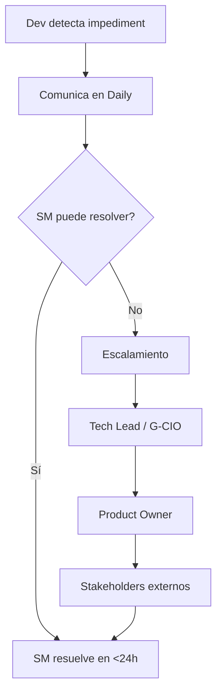

# Ceremonias Scrum y Artefactos

> **Marco:** Scrum Guide 2020 + adaptación a la realidad del proyecto (4 backend + 3 frontend + 1 DevOps + 1 G-CIO).
> **Sprint:** 2 semanas (10 días hábiles).
> **Husos horarios:** GMT-5 (Colombia).

---

## 1. Roles

| Rol | Persona | Responsabilidades |
|---|---|---|
| **Product Owner** | G-CIO / Director TI | Define qué construir; prioriza backlog; acepta historias |
| **Scrum Master** | Tech Lead | Facilita ceremonias; elimina impedimentos; protege al equipo |
| **Equipo de desarrollo** | 4 BE + 3 FE + 1 DevOps + 1 QA | Construye el producto; auto-organización |
| **Stakeholders** | Alcalde, Ofic. Protección Datos, Entes de control | Observan demos; dan feedback |

---

## 2. Calendario de ceremonias (recurrente cada sprint)

| Ceremonia | Día | Hora | Duración | Asistentes |
|---|---|---|---|---|
| **Sprint Planning** | Lunes semana 1 | 09:00 - 12:00 | 3 h | Todo el equipo + PO |
| **Daily Standup** | Diario (L-V) | 09:00 - 09:15 | 15 min | Equipo dev |
| **Backlog Refinement** | Miércoles | 14:00 - 16:00 | 2 h | Equipo + PO |
| **Sprint Review** | Viernes semana 2 | 14:00 - 16:00 | 2 h | Equipo + PO + stakeholders |
| **Sprint Retrospective** | Viernes semana 2 | 16:00 - 17:00 | 1 h | Solo equipo + SM |

**Total horas ceremonias/sprint:** 3 + (15 × 8) + 2 + 2 + 1 = **28 horas**

---

## 3. Ceremonias en detalle

### 3.1 Sprint Planning (lunes semana 1, 9-12)

**Objetivo:** definir el Sprint Goal y seleccionar las historias del Product Backlog que se comprometen a entregar.

**Agenda:**
1. **Sprint Goal** (PO, 15 min): PO presenta el objetivo del sprint y por qué.
2. **Discusión de historias** (60 min): equipo pregunta, clarifica criterios de aceptación.
3. **Estimación y compromiso** (60 min): Planning Poker para historias nuevas; ajuste de capacidad.
4. **Decomposición en tareas** (45 min): cada historia se divide en tareas técnicas; se asignan dependencias.

**Salidas:**
- Sprint Backlog ( Jira / GitHub Projects).
- Sprint Goal claro y medible.
- Capacidad comprometida.

**Capacidad del equipo:** velocity objetivo 80 pts/sprint.

---

### 3.2 Daily Standup (diario 9-9:15)

**Objetivo:** sincronizar al equipo, identificar impedimentos.

**Formato:** cada persona responde:
1. ¿Qué hice ayer?
2. ¿Qué haré hoy?
3. ¿Tengo algún impedimento?

**Reglas:**
- Máximo 15 min totales (timebox estricto).
- De pie.
- Solo equipo dev (PO no asiste salvo impediment grave).
- Conversaciones técnicas se difieren a "after standup".

**Para equipos remotos:** Google Meet con cámara abierta; mismo formato.

---

### 3.3 Backlog Refinement (miércoles 14-16)

**Objetivo:** preparar historias para próximos sprints; garantizar DoR.

**Agenda:**
1. PO presenta historias candidatas (5-10 historias).
2. Equipo clarifica, identifica dependencias, propone descomposición.
3. Planning Poker para estimación inicial.
4. PO confirma priorización y criterios de aceptación.

**Salidas:** historias refinadas con DoR cumplido listas para próximos sprints.

**Meta:** tener siempre 2 sprints de anticipación en el backlog.

---

### 3.4 Sprint Review (viernes semana 2, 14-16)

**Objetivo:** demostrar el incremento terminado al PO y stakeholders; recibir feedback.

**Agenda:**
1. **Demo de historias completadas** (60 min): cada dev presenta su trabajo en staging.
2. **Métricas del sprint** (15 min): burndown, velocity, calidad.
3. **Feedback de stakeholders** (30 min): observaciones, nuevos requisitos, cambios.
4. **Próximo sprint preview** (15 min): qué viene.

**Salidas:**
- Historias aceptadas / rechazadas / devueltas.
- Feedback para backlog.
- Actualización de stakeholders.

**Criterio de aceptación:** solo se demuestra lo que cumple DoD.

---

### 3.5 Sprint Retrospective (viernes semana 2, 16-17)

**Objetivo:** mejorar continuamente el proceso del equipo.

**Formato:** 4L (Liked, Learned, Lacked, Longed for) o Start/Stop/Continue.

**Agenda:**
1. **Recolectar** (15 min): cada miembro escribe items en post-its (digital o físico).
2. **Discutir** (30 min): votar top 3-5, discutir causas raíz.
3. **Comprometer acciones** (15 min): 1-3 acciones concretas con dueño y fecha.

**Salidas:** acciones SMART para el próximo sprint.

**Seguimiento:** el SM verifica que las acciones se ejecuten al inicio del siguiente sprint.

---

## 4. Artefactos

### 4.1 Product Backlog

- **Herramienta:** GitHub Projects o Jira.
- **Estructura:** columnas = To Do | In Progress | In Review | Done.
- **Priorización:** MoSCoW + valor de negocio.
- **Tamaño:** 50-100 items activos.
- **Refinamiento:** continuo (cada Backlog Refinement).

### 4.2 Sprint Backlog

- **Selección:** 80 pts de capacidad.
- **Compromiso:** Sprint Goal claro.
- **Visibilidad:** tablero público para stakeholders.

### 4.3 Incremento

- **Definición:** suma de historias completadas (DoD cumplido) del sprint.
- **Formato:** desplegado en staging automáticamente.
- **Frecuencia de release:** cada sprint (potencialmente cada 2 semanas a producción).

### 4.4 Burndown Chart

```
Puntos
80 ┤●
   │ ●●
70 ┤   ●●
   │     ●
60 ┤     ●●
   │       ●
50 ┤        ●
   │         ●
40 ┤          ●●
   │            ●
30 ┤             ●
   │              ●
20 ┤               ●●
   │                 ●
10 ┤                  ●
   │                   ●●
 0 ┤                     ●●●
   └──────────────────────────
   L  M  M  J  V  L  M  M  J  V
```

**Interpretación:** línea ideal vs. real; el equipo actúa si la real está consistentemente por encima.

---

## 5. Herramientas

| Función | Herramienta |
|---|---|
| Tablero Scrum | GitHub Projects |
| Repositorio código | GitHub (monorepo `sede`) |
| CI/CD | GitHub Actions |
| Comunicación síncrona | Google Meet + Slack |
| Documentación | Markdown en `entidad-transparencia/` |
| Monitoreo | Grafana + Sentry + PagerDuty |
| Documentación API | OpenAPI 3.1 (Swagger UI en staging) |

---

## 6. Impedimentos — flujo de escalamiento



**Tiempo máximo sin resolver:** 48 h hábiles.

---

## 7. Definition of Success por sprint

Un sprint es exitoso si:
- ≥ 90% de los puntos comprometidos se completan.
- 0 historias rechazadas en Sprint Review.
- 0 incidentes de producción introducidos.
- Velocity se mantiene estable (± 10%).
- Acciones de la retrospectiva anterior se ejecutaron.

---

## 8. Calendario de los 4 meses (8 sprints)

| Sprint | Inicio | Fin | Sprint Goal |
|---|---|---|---|
| S-01 | 2026-10-13 (L) | 2026-10-24 (V) | Cimientos: BD, auth Sanctum, infraestructura |
| S-02 | 2026-10-27 (L) | 2026-11-07 (V) | Identidad: top bar, footer, menú, políticas |
| S-03 | 2026-11-10 (L) | 2026-11-21 (V) | Transparencia núcleo: 10 subsecciones, listado |
| S-04 | 2026-11-24 (L) | 2026-12-05 (V) | Búsqueda FTS + directorio SIGEP |
| S-05 | 2026-12-08 (L) | 2026-12-19 (V) | CRUD documentos con versionado y hash |
| S-06 | 2026-12-22 (L) | 2027-01-09 (V) | Noticias + accesibilidad WCAG |
| S-07 | 2027-01-12 (L) | 2027-01-23 (V) | ITA + alertas + subsecciones restantes |
| S-08 | 2027-01-26 (L) | 2027-02-06 (V) | Hardening + go-live |

**Notas:**
- S-06 incluye semana de Navidad (impacto: -10% capacidad).
- S-08 cierra el viernes antes del retorno a clases (lanzamiento en horario no laboral).
