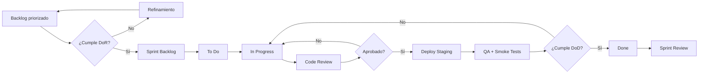

# Definition of Ready (DoR) y Definition of Done (DoD)

> **DoR:** criterios que una historia/tarea debe cumplir antes de entrar al sprint.
> **DoD:** criterios que una historia/tarea debe cumplir antes de considerarse terminada.
> **Propósito:** evitar ambigüedad en el flujo Scrum y garantizar calidad desde el inicio.

---

## 1. Definition of Ready (DoR)

Una historia/tarea está **lista** para entrar al sprint cuando cumple **todos** los siguientes criterios:

### 1.1 Claridad

- [ ] Título claro y descriptivo (verbo en infinitivo + objeto).
- [ ] Descripción de 2-5 párrafos con el QUÉ y POR QUÉ.
- [ ] Criterios de aceptación explícitos (formato Gherkin o checklist medible).

### 1.2 Estimación y dependencias

- [ ] Estimada en story points por al menos 2 miembros del equipo (Planning Poker).
- [ ] Dependencias técnicas/de equipo identificadas y mapeadas en el tablero.
- [ ] Tamaño apropiado (≤ 8 pts; si > 8, dividir en historias más pequeñas).

### 1.3 Trazabilidad

- [ ] Mapeada a al menos 1 requisito (RF/RNF/RN).
- [ ] Al menos 1 test planificado (PT-XX).
- [ ] Al menos 1 endpoint OpenAPI o 1 componente Vue identificado (si aplica).

### 1.4 Diseño y especificación

- [ ] Mockups/wireframes disponibles si requiere UI.
- [ ] Schema de BD migrado a diseño si requiere cambios de datos.
- [ ] Endpoints OpenAPI diseñados o actualizados.

### 1.5 Verificabilidad

- [ ] Criterios de aceptación verificables manualmente o con tests automatizados.
- [ ] Al menos 1 test de aceptación definido (Gherkin o equivalente).

### 1.6 Aprobación

- [ ] Product Owner valida que aporta valor de negocio.
- [ ] Tech Lead confirma viabilidad técnica.
- [ ] QA confirma que es testeable.

---

## 2. Definition of Done (DoD)

Una historia/tarea está **terminada** cuando cumple **todos** los siguientes criterios:

### 2.1 Código

- [ ] Código escrito siguiendo guías del proyecto (PSR-12 + Laravel Pint para backend; ESLint + Prettier para frontend).
- [ ] Sin `TODO`, `FIXME` o placeholders en el código de producción.
- [ ] Sin código comentado "para luego".
- [ ] Sin credenciales o secrets en el código.
- [ ] Sin queries SQL crudas sin bindings (Eloquent o QueryBuilder).

### 2.2 Tests

- [ ] Tests unitarios escritos (cobertura ≥ 80% backend, ≥ 70% frontend).
- [ ] Tests de integración / feature pasando.
- [ ] Tests E2E (Playwright) pasando si aplica.
- [ ] Tests de accesibilidad (axe-core) pasando sin violaciones serias.
- [ ] Todos los tests verdes en CI antes del merge.

### 2.3 Revisión

- [ ] Code review aprobado por al menos 1 par.
- [ ] Sin comentarios sin resolver en el PR.
- [ ] PR squash-merged a `develop` (o `main` si es hotfix).

### 2.4 Documentación

- [ ] OpenAPI spec actualizada (si afecta API).
- [ ] Tipos TS regenerados desde OpenAPI (`pnpm openapi:generar-ts`).
- [ ] Docstrings / JSDoc en funciones públicas complejas.
- [ ] CHANGELOG actualizado si hay breaking changes.
- [ ] Migraciones de BD documentadas (UP y DOWN reversibles).

### 2.5 Despliegue

- [ ] Deploy a staging exitoso.
- [ ] Smoke tests post-despliegue pasando.
- [ ] Verificación manual del flujo principal.
- [ ] Sin errores 5xx en logs (Sentry / Grafana) durante 24 h.

### 2.6 Cumplimiento

- [ ] WCAG 2.1 AA verificado en las pantallas afectadas.
- [ ] Cabeceras de seguridad verificadas (Helmet, CSP, HSTS).
- [ ] Sin nuevos hallazgos en auditoría ITA.
- [ ] Cumple con Ley 1581/2012 (datos personales) si aplica.

### 2.7 Trazabilidad final

- [ ] RF/RNF actualizado (estado "implementado").
- [ ] Matriz de trazabilidad actualizada.
- [ ] Story points marcados como completados en Jira/GitHub.

---

## 3. Flujo del trabajo

---

## 4. Métricas de cumplimiento DoD

| Métrica | Objetivo | Cómo medir |
|---|---|---|
| % historias que cumplen DoD al cierre del sprint | ≥ 95% | Jira/GitHub Issues |
| % PRs con code review aprobado antes de merge | 100% | GitHub |
| % cobertura de tests en sprint | ≥ 80% | Codecov / Coveralls |
| % tareas con smoke tests post-deploy | 100% | Manual + k6 |
| Tiempo promedio de revisión de PR | < 4 h hábiles | GitHub API |
| Bugs encontrados en producción / sprint | ≤ 2 severidad media | Sentry |

---

## 5. Anti-patrones (a evitar)

| Anti-patrón | Por qué se rechaza |
|---|---|
| "Historia demasiado grande" (> 13 pts) | No se puede estimar con precisión; alto riesgo |
| "Como desarrollador, quiero..." | El usuario siempre es la prioridad |
| Criterios de aceptación vagos ("funciona bien") | No verificable |
| Sin tests automatizados | No escalable, regresiones garantizadas |
| Sin documentación OpenAPI | Drift inevitable |
| Mergear sin review | Baja calidad, bugs en producción |
| Hacer deploy sin smoke test | Riesgo de downtime |
| Tocar 5+ archivos sin story dedicada | Necesita descomposición |

---

## 6. Criterios de aceptación — checklist para Sprint Review

Antes de presentar una historia al Product Owner en Sprint Review:

- [ ] Demo funcional en staging.
- [ ] Criterios de aceptación cumplidos y verificados.
- [ ] Métricas de éxito alcanzadas (si aplica).
- [ ] Sin deuda técnica documentada pendiente relacionada.
- [ ] DoD cumplidos al 100%.
- [ ] Aceptación explícita del Product Owner.

Si el PO no acepta, se reabre la historia y se vuelve al sprint backlog con notas del PO.
