# Dependencias Externas

> **Definición:** una dependencia externa es cualquier sistema, persona, proveedor o condición fuera del control directo del equipo del proyecto que es necesaria para el éxito.
> **Convención:** cada dependencia tiene tipo (sistema/persona/proveedor/normativa), criticidad, fecha límite, plan de mitigación si no está disponible.

---

## 1. Dependencias de sistemas externos

### DEP-01 — SIGEP (DAFP)
- **Tipo:** Sistema externo / API REST
- **Descripción:** Sistema de Información y Gestión del Empleo Público del Departamento Administrativo de la Función Pública. Provee el directorio oficial de servidores públicos.
- **Criticidad:** Crítica (RF-02-006)
- **Fecha límite:** Sprint 4
- **Endpoint:** https://www1.funcionpublica.gov.co/web/sigep2/directorio (oficial) o API documentada.
- **Riesgo si no disponible:** R-TEC-01.
- **Mitigación:**
  - Cliente con retry + circuit breaker.
  - Cache local como fallback.
  - Stub para desarrollo.
  - Solicitud formal a DAFP en Sprint 0.
- **Estado:** Pendiente confirmación.
- **Dueño:** G-CIO.

### DEP-02 — SECOP I/II
- **Tipo:** Sistema externo
- **Descripción:** Sistema Electrónico de Contratación Pública. Provee datos de contratos y procesos.
- **Criticidad:** Alta (RF-02-010)
- **Fecha límite:** Sprint 4
- **URL:** https://www.contratos.gov.co/ (SECOP I), https://community.secop.gov.co/ (SECOP II)
- **Riesgo si no disponible:** Solo se pierde el enlace directo; la información se publica manualmente en el sitio.
- **Mitigación:** Validación de enlaces externos periódica; aviso si caen.
- **Dueño:** Oficina de Contratación + Tech Lead.

### DEP-03 — SUIN (Rama Judicial)
- **Tipo:** Sistema externo
- **Descripción:** Sistema Único de Información Normativa. Provee la normativa nacional consolidada.
- **Criticidad:** Alta (RF-02-009)
- **Fecha límite:** Sprint 4
- **URL:** https://www.suin-juriscol.gov.co/
- **Riesgo si no disponible:** Solo se pierde el enlace al SUIN; la normativa propia se publica independientemente.
- **Mitigación:** Enlace validado mensualmente.
- **Dueño:** Oficina Jurídica.

### DEP-04 — SUCOP (MinTIC)
- **Tipo:** Sistema externo
- **Descripción:** Sistema Único de Consulta Pública para proyectos normativos.
- **Criticidad:** Media (RF-02-009)
- **URL:** https://www.sucop.gov.co/
- **Riesgo si no disponible:** Solo se pierde la integración con SUCOP; no bloquea go-live.
- **Mitigación:** Enlace validado mensualmente.
- **Dueño:** Oficina Jurídica.

### DEP-05 — KOGUI (Procuraduría)
- **Tipo:** Sistema externo
- **Descripción:** Sistema de seguimiento a PQRSD.
- **Criticidad:** Media (RF-02-013)
- **URL:** https://www.procuraduria.gov.co/kogui
- **Riesgo si no disponible:** La Alcaldía reporta manualmente a KOGUI.
- **Mitigación:** Enlace + email de contacto en la sección de informes PQRSD.
- **Dueño:** Of. Atención al Ciudadano.

### DEP-06 — datos.gov.co
- **Tipo:** Sistema externo / portal CKAN
- **Descripción:** Portal de Datos Abiertos Colombia.
- **Criticidad:** Media (RF-02-017)
- **URL:** https://www.datos.gov.co/
- **API:** CKAN.
- **Riesgo si no disponible:** El portal puede tener caídas puntuales; mostrar mensaje.
- **Mitigación:** Aviso + caché local de datasets publicados.
- **Dueño:** Of. TIC.

### DEP-07 — GOV.CO (proxy de MinTIC)
- **Tipo:** Servicio de MinTIC
- **Descripción:** Portal Único del Estado + servicio de redireccionamiento con enmascaramiento URL.
- **Criticidad:** Alta (RF-01-001..005, RF-01-022)
- **URL:** https://www.gov.co/
- **Riesgo si no disponible:** La sede funciona sin redireccionamiento (RF-01-022).
- **Mitigación:** El proyecto es funcional sin proxy GOV.CO; el enmascaramiento es mejora estética.
- **Dueño:** G-CIO + MinTIC.

### DEP-08 — SUIT (DAFP)
- **Tipo:** Sistema externo
- **Descripción:** Sistema Único de Trámites; catálogo oficial de trámites.
- **Criticidad:** Alta (RF-02-018)
- **URL:** https://www.suit.gov.co/
- **Riesgo si no disponible:** La Alcaldía publica su propio catálogo de trámites.
- **Mitigación:** Catálogo propio + sincronización periódica con SUIT cuando esté disponible.
- **Dueño:** Of. Atención al Ciudadano.

### DEP-09 — AND (Agencia Nacional Digital)
- **Tipo:** Sistema externo / servicios
- **Descripción:** Servicios Ciudadanos Digitales: SSO, Carpeta Ciudadana, Interoperabilidad (X-Road).
- **Criticidad:** Media (módulos fuera del alcance 01-02; relevante para 03-servicios-tramites)
- **Riesgo si no disponible:** Para los módulos 01-02 no es crítico.
- **Mitigación:** El módulo 03 (servicios) se abordará en fase posterior.
- **Dueño:** Of. TIC.

### DEP-10 — AGN (Archivo General de la Nación)
- **Tipo:** Entidad reguladora
- **Descripción:** Lineamientos de gestión documental (TRD, PINAR).
- **Criticidad:** Alta (RN-03, instrumento PGD y TRD)
- **URL:** https://www.archivogeneral.gov.co/
- **Riesgo si no disponible:** Se aplican los lineamientos generales del AGN (PINAR 2026-2029 ya publicado).
- **Mitigación:** Documentación interna de los instrumentos.
- **Dueño:** Gestión Documental del Distrito.

---

## 2. Dependencias de proveedores

### DEP-11 — GitHub (repositorio y CI/CD)
- **Tipo:** Proveedor SaaS
- **Descripción:** Repositorio Git + Actions para CI/CD.
- **Criticidad:** Crítica
- **SLA:** 99.9% según contrato.
- **Plan B:** GitLab on-premise si GitHub cae más de 24 h.
- **Dueño:** DevOps.

### DEP-12 — Cloudflare (CDN, WAF, DDoS)
- **Tipo:** Proveedor SaaS
- **Descripción:** Plan Business para CDN + seguridad.
- **Criticidad:** Alta
- **SLA:** 100% uptime para plan Business.
- **Plan B:** AWS CloudFront + WAF (más caro).
- **Dueño:** DevOps.

### DEP-13 — Google Cloud Platform
- **Tipo:** Proveedor IaaS/PaaS
- **Descripción:** GKE, Cloud SQL, Memorystore, GCS.
- **Criticidad:** Crítica
- **SLA:** 99.95% por servicio.
- **Plan B:** AWS (migración costosa, ~2 sprints).
- **Dueño:** DevOps.

### DEP-14 — SendGrid o Mailgun (envío de emails)
- **Tipo:** Proveedor SaaS
- **Descripción:** SMTP transaccional para alertas, recuperación de contraseña.
- **Criticidad:** Media
- **Costo:** USD 15-100/mes según volumen.
- **Plan B:** SMTP propio con Postfix (más complejo, riesgo de spam).
- **Dueño:** DevOps.

---

## 3. Dependencias normativas

### DEP-15 — Aprobación del Plan de Integración GOV.CO por MinTIC
- **Tipo:** Regulatorio
- **Descripción:** MinTIC debe aprobar el plan de integración de la sede al portal GOV.CO.
- **Criticidad:** Media
- **Tiempo estimado:** 4-8 semanas desde envío.
- **Riesgo si no disponible:** La integración técnica funciona; solo falta la URL enmascarada.
- **Mitigación:** Empezar el proceso en Sprint 0; no bloquea go-live.
- **Dueño:** G-CIO.

### DEP-16 — Registro Nacional de Bases de Datos (SIC)
- **Tipo:** Regulatorio
- **Descripción:** Registro de todas las BD que contienen datos personales.
- **Criticidad:** Alta (RNF-PD-01)
- **Acción:** Registro previo al go-live.
- **Dueño:** Of. Protección de Datos.

### DEP-17 — Certificación accesibilidad (opcional)
- **Tipo:** Regulatorio
- **Descripción:** Certificación externa de accesibilidad WCAG 2.1 AA.
- **Criticidad:** Media (no obligatoria)
- **Mitigación:** Auditoría interna anual + axe-core + Lighthouse.
- **Dueño:** G-CIO.

---

## 4. Dependencias internas (entre equipos del Distrito)

### DEP-18 — Oficina de Contratación (datos de contratos)
- **Tipo:** Persona/equipo interno
- **Descripción:** Carga inicial de contratos históricos.
- **Criticidad:** Alta
- **Fecha límite:** Sprint 5
- **Acción:** Capacitación + carga de datos legados.
- **Dueño:** Of. Contratación + G-CIO.

### DEP-19 — Gestión Documental (instrumentos Ley 1712)
- **Tipo:** Persona/equipo interno
- **Descripción:** Carga del PINAR, PGD, TRD, registro de activos.
- **Criticidad:** Alta
- **Fecha límite:** Sprint 7
- **Acción:** Taller de definición de metadatos + carga.
- **Dueño:** Gestión Documental + G-CIO.

### DEP-20 — Oficina de Comunicaciones (noticias y carrusel)
- **Tipo:** Persona/equipo interno
- **Descripción:** Creación de noticias y contenido multimedia del home.
- **Criticidad:** Media
- **Fecha límite:** Sprint 6
- **Acción:** Capacitación + redacción de primeros 20 noticias.
- **Dueño:** Of. Comunicaciones.

### DEP-21 — Oficina de Hacienda (información tributaria)
- **Tipo:** Persona/equipo interno
- **Descripción:** Datos de predial, ICA, calendario tributario.
- **Criticidad:** Alta (RF-02-015, RF-02-016)
- **Fecha límite:** Sprint 7
- **Acción:** Carga de tarifas y fechas.
- **Dueño:** Of. Hacienda.

### DEP-22 — Talento Humano (directorio de servidores)
- **Tipo:** Persona/equipo interno
- **Descripción:** Sincronización inicial del directorio desde SIGEP o fuente interna.
- **Criticidad:** Alta (RF-02-006)
- **Fecha límite:** Sprint 4
- **Acción:** Validación de codigo_sigep; resolución de inconsistencias.
- **Dueño:** Talento Humano.

### DEP-23 — TIC (infraestructura y soporte)
- **Tipo:** Persona/equipo interno
- **Descripción:** Mantenimiento de la infraestructura, DNS, certificados.
- **Criticidad:** Crítica
- **Fecha límite:** Continuo
- **Acción:** Equipo de guardia 24/7 post-go-live.
- **Dueño:** Of. TIC.

---

## 5. Dependencias técnicas internas

### DEP-24 — Migración de datos legados
- **Tipo:** Datos
- **Descripción:** Cargar al nuevo sistema: directorio actual, documentos, noticias, políticas.
- **Criticidad:** Alta
- **Fecha límite:** Sprint 5-6
- **Acción:** ETL + script de migración + validación.
- **Dueño:** Tech Lead Backend.

### DEP-25 — Diseño UX/UI (mockups)
- **Tipo:** Diseño
- **Descripción:** Mockups de todas las pantallas.
- **Criticidad:** Media
- **Fecha límite:** Sprint 2
- **Acción:** Designer + sesión con stakeholders.
- **Dueño:** UX Designer.

### DEP-26 — Redacción de contenido
- **Tipo:** Contenido
- **Descripción:** Redacción de las 5 políticas, misiones, visiones.
- **Criticidad:** Media
- **Fecha límite:** Sprint 2-3
- **Acción:** Equipo de comunicaciones.
- **Dueño:** Of. Comunicaciones.

---

## 6. Mapa de dependencias críticas

```mermaid
graph TD
    PROYECTO[Proyecto Sede Electrónica]

    PROYECTO -->|Crítica| SIGEP[DEP-01 SIGEP]
    PROYECTO -->|Crítica| GITHUB[DEP-11 GitHub]
    PROYECTO -->|Crítica| GCP[DEP-13 GCP]
    PROYECTO -->|Crítica| TALENTO[DEP-22 Talento Humano]
    PROYECTO -->|Crítica| TIC[DEP-23 TIC]
    PROYECTO -->|Crítica| MIGRACION[DEP-24 Migración datos]

    PROYECTO -->|Alta| SECOP[DEP-02 SECOP]
    PROYECTO -->|Alta| SUIN[DEP-03 SUIN]
    PROYECTO -->|Alta| SUIT[DEP-08 SUIT]
    PROYECTO -->|Alta| CLOUDFLARE[DEP-12 Cloudflare]
    PROYECTO -->|Alta| AGN[DEP-10 AGN]
    PROYECTO -->|Alta| SIC[DEP-16 SIC]
    PROYECTO -->|Alta| CONTRATACION[DEP-18 Contratación]
    PROYECTO -->|Alta| GESTIONDOC[DEP-19 Gestión Documental]
    PROYECTO -->|Alta| HACIENDA[DEP-21 Hacienda]

    PROYECTO -->|Media| GOVCO[DEP-07 GOV.CO]
    PROYECTO -->|Media| KOGUI[DEP-05 KOGUI]
    PROYECTO -->|Media| SUCOP[DEP-04 SUCOP]
    PROYECTO -->|Media| DATOS[DEP-06 datos.gov.co]
    PROYECTO -->|Media| AND[DEP-09 AND]
    PROYECTO -->|Media| SMTP[DEP-14 SMTP]
    PROYECTO -->|Media| APROBACION[DEP-15 MinTIC]
    PROYECTO -->|Media| COMUNICACIONES[DEP-20 Comunicaciones]
    PROYECTO -->|Media| DISENO[DEP-25 Diseño]
    PROYECTO -->|Media| CONTENIDO[DEP-26 Contenido]
```

---

## 7. Plan de mitigación consolidado

| Dependencia | Plan A | Plan B |
|---|---|---|
| SIGEP caído | Cache local 7 días | Stubs para desarrollo |
| SECOP caído | Enlace manual + aviso | Datos propios de la Alcaldía |
| GitHub caído | CI local | GitLab on-premise |
| GCP caído | — | AWS (migración 2 sprints) |
| Cloudflare caído | — | AWS CloudFront (más caro) |
| Talento Humano no entrega | Datos de RR.HH. interna | Carga manual desde planillas |
| Datos legados incompletos | Carga progresiva | OCR de PDFs existentes |
| MinTIC no aprueba plan GOV.CO | URL directa al sitio | Re-intento en 3 meses |
| AGN no responde | Aplicar PINAR genérico | Consultoría externa |

---

## 8. Cronograma de dependencias

| Sprint | Dependencias críticas a resolver |
|---|---|
| Sprint 0 | DEP-01, DEP-02, DEP-03, DEP-11, DEP-12, DEP-13 (kick-off y suscripciones) |
| Sprint 1 | DEP-25, DEP-26, DEP-23 |
| Sprint 2 | DEP-22 (directorio) |
| Sprint 3 | DEP-22, DEP-18 |
| Sprint 4 | DEP-01, DEP-02, DEP-08 |
| Sprint 5 | DEP-24 (migración), DEP-18 (contratos) |
| Sprint 6 | DEP-20 (noticias) |
| Sprint 7 | DEP-19, DEP-21, DEP-16, DEP-10 |
| Sprint 8 | DEP-15, DEP-17, DEP-14 |
| Go-live | DEP-23, DEP-11, DEP-12, DEP-13 (24/7) |
