Tengo el inventario completo de las 138 tablas, todas las columnas, FK, ISA/polimorfismo y cardinalidades. También tengo la matriz maestra de requisitos por módulo. Tengo todo lo necesario para producir el documento completo. Las 138 tablas son: 135 entidades canónicas (C01-C135) + `dependencia` + `tipo_arco` + `item_evaluacion_sus` (horario_canal=C49 ya contada).

Ahora produzco el documento entregable.

---

# Diagramas y Trazabilidad — BD Sede Electrónica

> Cobertura de insumos: 5 de 5 leídos íntegros (metodología `jose-bd.md`, `03-modelo-logico.md`+DELTA, `04-modelo-fisico.md`+DELTA, `00-inventario.md`, `_global/matriz-trazabilidad.md`), 0 omitidos. Refleja EXACTAMENTE el modelo recibido: 138 tablas, jerarquías ISA (class-table + single-table), arcos exclusivos, polimorfismo `(entidad_tipo, entidad_id)`, entidad nueva `dependencia`, y decisiones del DELTA (tipos PostgreSQL, `notificacion.entidad_id=TEXT`, NO partición de `solicitud`/`radicado`). Cubre **C10** (3 diagramas Mermaid válidos) y **C12** (matriz de trazabilidad).

---

## 1. Diagrama conceptual (Mermaid erDiagram, entidades núcleo)

Alto nivel: las ~49 entidades NÚCLEO + `dependencia` (organigrama, destino de FK masivo) y sus relaciones principales con cardinalidad. Solo PK. Agrupado mentalmente por dominio (identidad, trámites, PQRSD, participa, canales, seguridad/RBAC, interop, datos abiertos, CMS/documental, transparencia/tributario).


```mermaid
erDiagram
    dependencia {
        bigint id_dependencia PK
    }
    sede_electronica {
        bigint id PK
    }
    tramite {
        bigint id_tramite PK
    }
    solicitud {
        bigint id_solicitud PK
    }
    radicado {
        bigint id_radicado PK
    }
    pqrsd {
        bigint id_pqrsd PK
    }
    ciudadano {
        bigint id_ciudadano PK
    }
    usuario_interno {
        uuid id PK
    }
    servidor_publico {
        bigint id PK
    }
    documento_electronico {
        uuid id PK
    }
    expediente_electronico {
        uuid id PK
    }
    notificacion {
        uuid id PK
    }
    firma_electronica {
        uuid id PK
    }
    log_auditoria {
        bigint id PK
    }
    sesion {
        uuid id PK
    }
    pago {
        bigint id PK
    }
    cita {
        bigint id PK
    }
    canal_atencion {
        bigint id PK
    }
    mecanismo_participacion {
        bigint id PK
    }
    proyecto_norma {
        bigint id PK
    }
    rol {
        bigint id PK
    }
    permiso {
        bigint id PK
    }
    transparencia_publicacion {
        bigint id_publicacion PK
    }
    contrato {
        bigint id_contrato PK
    }
    normativa {
        bigint id_normativa PK
    }
    impuesto {
        bigint id PK
    }
    dataset {
        bigint id PK
    }
    contenido {
        uuid id PK
    }
    interop_xroad_transaction {
        bigint id PK
    }
    certificado_digital {
        bigint id PK
    }
    carpeta_ciudadana {
        bigint id PK
    }
    calendario_habil {
        date fecha PK
    }
    tipo_pqrsd {
        bigint id_tipo_pqrsd PK
    }
    tipo_documento_identidad {
        bigint id PK
    }

    dependencia ||--o{ dependencia : "jerarquiza"
    dependencia ||--o{ tramite : "es_competente"
    dependencia ||--o{ pqrsd : "recibe"
    dependencia ||--o{ canal_atencion : "publica"
    dependencia ||--o{ servidor_publico : "tiene"
    dependencia ||--o{ radicado : "consecutivo_por"

    tipo_documento_identidad ||--o{ ciudadano : "identifica"
    ciudadano ||--o{ solicitud : "radica"
    tramite ||--o{ solicitud : "instancia_de"
    solicitud ||--|| radicado : "porta"
    solicitud ||--o| pago : "genera"
    solicitud ||--o{ documento_electronico : "adjunta"
    solicitud ||--o| expediente_electronico : "abre"

    tipo_pqrsd ||--o{ pqrsd : "clasifica"
    ciudadano ||--o{ pqrsd : "presenta"
    pqrsd ||--|| radicado : "usa"
    pqrsd ||--o{ documento_electronico : "anexa"

    expediente_electronico ||--o{ documento_electronico : "folia"
    documento_electronico ||--o| firma_electronica : "es_firmado"
    expediente_electronico ||--o{ radicado : "contiene"

    ciudadano ||--o{ sesion : "abre"
    usuario_interno ||--o{ sesion : "abre"
    usuario_interno ||--o{ log_auditoria : "audita"
    ciudadano ||--o{ log_auditoria : "audita"

    usuario_interno ||--o{ rol : "asume"
    ciudadano ||--o{ rol : "perfila"
    rol ||--o{ permiso : "agrupa"
    servidor_publico ||--o| usuario_interno : "opera_como"

    ciudadano ||--o{ cita : "agenda"
    dependencia ||--o{ cita : "atiende"
    canal_atencion ||--o{ cita : "via"

    dependencia ||--o{ mecanismo_participacion : "convoca"
    mecanismo_participacion ||--o| proyecto_norma : "consulta"

    transparencia_publicacion ||--o| contrato : "ISA"
    transparencia_publicacion ||--o| normativa : "ISA"
    servidor_publico ||--o{ transparencia_publicacion : "publica"
    impuesto ||--o{ calendario_habil : "vence_en"

    dataset ||--o{ documento_electronico : "deriva"
    contenido ||--o{ notificacion : "notifica"
    interop_xroad_transaction ||--o{ certificado_digital : "firma_con"
    ciudadano ||--o{ carpeta_ciudadana : "consulta"
    pqrsd ||--o{ notificacion : "notifica"
    solicitud ||--o{ notificacion : "notifica"
    cita ||--o{ notificacion : "recuerda"
```

---

## 2. Diagrama lógico (Mermaid, subdiagramas por dominio, todas las columnas PK/FK)

Por escala (138 tablas), se divide en 10 subdiagramas por dominio. Cada tabla muestra TODAS sus columnas con marca `PK`/`FK`. Las FK cruzadas entre dominios se anotan al pie de cada subdiagrama. Tipos genéricos del modelo lógico.

### 2.1 Dominio Identidad y estructura (módulo 01)


```mermaid
erDiagram
    dependencia {
        bigint id_dependencia PK
        varchar codigo UK
        varchar nombre UK
        varchar sigla
        varchar tipo_unidad
        bigint id_dependencia_padre FK
        bigint id_responsable FK
        varchar correo_institucional
        varchar telefono
        varchar ubicacion_fisica
        text horario_atencion
        boolean activa
        timestamp created_at
        timestamp updated_at
    }
    sede_electronica {
        bigint id PK
        varchar url_original UK
        varchar palabra_clave UK
        varchar url_enmascarada_gov UK
        varchar nombre_institucion
        varchar categoria
        varchar sector
        varchar estado_integracion
        smallint paso_proceso_actual
        date fecha_activacion
        boolean soporte_ipv4
        boolean soporte_ipv6
        timestamp created_at
        timestamp updated_at
    }
    contacto_entidad {
        bigint id PK
        bigint id_sede FK
        varchar conmutador
        varchar linea_gratuita
        varchar linea_anticorrupcion
        varchar correo_institucional
        varchar correo_judicial
        varchar direccion
        text horario_atencion
    }
    sede_fisica {
        bigint id PK
        varchar nombre
        varchar direccion
        varchar codigo_postal
        varchar municipio
        varchar departamento
        varchar telefono_principal
        varchar correo_sede
        text horario
        boolean es_principal
        smallint orden_footer
        boolean tiene_acceso_inclusivo
        smallint cantidad_computadores_publicos
        boolean activa
    }
    red_social {
        bigint id PK
        bigint id_sede FK
        varchar plataforma
        varchar url
        varchar nombre_cuenta
        boolean activa
    }
    menu_navegacion {
        bigint id PK
        bigint id_sede FK
        varchar etiqueta
        varchar url
        bigint padre_id FK
        smallint nivel
        smallint orden
        varchar icono
        boolean abre_nueva_pestana
        boolean visible
        timestamp created_at
        timestamp updated_at
    }
    noticia {
        bigint id PK
        varchar titulo
        varchar descripcion
        text cuerpo
        varchar imagen_url
        date fecha_publicacion
        varchar autor
        boolean destacada
        boolean activa
        bigint id_sede FK
    }
    elemento_carrusel {
        bigint id PK
        varchar titulo
        varchar imagen_url
        varchar enlace_url
        smallint orden
        varchar texto_alternativo
        boolean activo
        date fecha_inicio
        date fecha_fin
    }
    politica_documento {
        bigint id PK
        varchar tipo
        integer version_number
        varchar titulo
        varchar url_descarga
        varchar formato_descarga
        date fecha_vigencia_desde
        date fecha_vigencia_hasta
        boolean es_vigente
        varchar marco_legal
        varchar document_hash
        timestamp effective_from
        timestamp published_at
        boolean expands_scope
        boolean requires_new_consent
        bigint id_creado_por FK
    }
    categoria_cookie {
        bigint id PK
        varchar nombre UK
        varchar descripcion
        boolean es_esencial
    }
    cookie_catalogo {
        bigint id PK
        bigint id_categoria FK
        varchar nombre UK
        varchar proveedor
        text proposito
        varchar duracion
        varchar tipo
        boolean activa
    }
    consentimiento_datos {
        bigint id PK
        bigint id_ciudadano FK
        varchar identificador_usuario
        bigint id_politica FK
        varchar consent_type
        varchar action
        varchar version_politica
        jsonb categorias_aceptadas
        timestamp fecha_consentimiento
        timestamp fecha_expiracion
        varchar estado
        varchar policy_hash
        inet ip_address
        uuid id_sesion FK
        boolean is_sensitive_data
        timestamp occurred_at
        varchar canal_aceptacion
    }
    consentimiento_categoria {
        bigint id_consentimiento PK
        bigint id_categoria PK
        varchar decision
    }
    dominio_confianza {
        bigint id PK
        varchar dominio UK
        varchar descripcion
        varchar tipo
        boolean activo
        timestamp created_at
        bigint id_creado_por FK
    }
    plan_integracion {
        bigint id PK
        bigint id_sede FK
        varchar version
        date fecha_creacion
        boolean incorporado_peti
        date fecha_envio_gobierno_digital
        decimal avance_porcentaje
        date fecha_ultimo_avance
    }
    plan_integracion_tramite {
        bigint id PK
        bigint id_plan FK
        bigint id_tramite FK
        varchar nombre_tramite
        integer solicitudes_anio
        varchar accion
        date fecha_objetivo
        bigint id_responsable FK
    }
    plan_integracion_dominio {
        bigint id_plan PK
        varchar valor PK
        varchar tipo
    }
    plan_integracion_otro_medio {
        bigint id_plan PK
        varchar valor PK
        varchar tipo
    }
    micrositio {
        bigint id PK
        varchar nombre
        varchar url
        varchar tipo
        bigint id_dependencia_duena FK
        varchar proveedor_tecnologia
        varchar hosting
        boolean tiene_login
        boolean maneja_pagos
        boolean maneja_datos_personales
        varchar accion_propuesta
        varchar estado_detectado
    }

    dependencia ||--o{ dependencia : "id_dependencia_padre"
    sede_electronica ||--o{ contacto_entidad : "id_sede"
    sede_electronica ||--o{ red_social : "id_sede"
    sede_electronica ||--o{ menu_navegacion : "id_sede"
    menu_navegacion ||--o{ menu_navegacion : "padre_id"
    sede_electronica ||--o{ noticia : "id_sede"
    sede_electronica ||--o{ plan_integracion : "id_sede"
    plan_integracion ||--o{ plan_integracion_tramite : "id_plan"
    plan_integracion ||--o{ plan_integracion_dominio : "id_plan"
    plan_integracion ||--o{ plan_integracion_otro_medio : "id_plan"
    categoria_cookie ||--o{ cookie_catalogo : "id_categoria"
    politica_documento ||--o{ consentimiento_datos : "id_politica"
    consentimiento_datos ||--o{ consentimiento_categoria : "id_consentimiento"
    categoria_cookie ||--o{ consentimiento_categoria : "id_categoria"
    dependencia ||--o{ micrositio : "id_dependencia_duena"
```

> FK cruzadas: `dependencia.id_responsable`→`servidor_publico` (transparencia); `consentimiento_datos.id_ciudadano`→`ciudadano`, `.id_sesion`→`sesion` (seguridad); `politica_documento.id_creado_por`, `dominio_confianza.id_creado_por`→`usuario_interno` (seguridad).

### 2.2 Dominio Trámites (módulo 03)

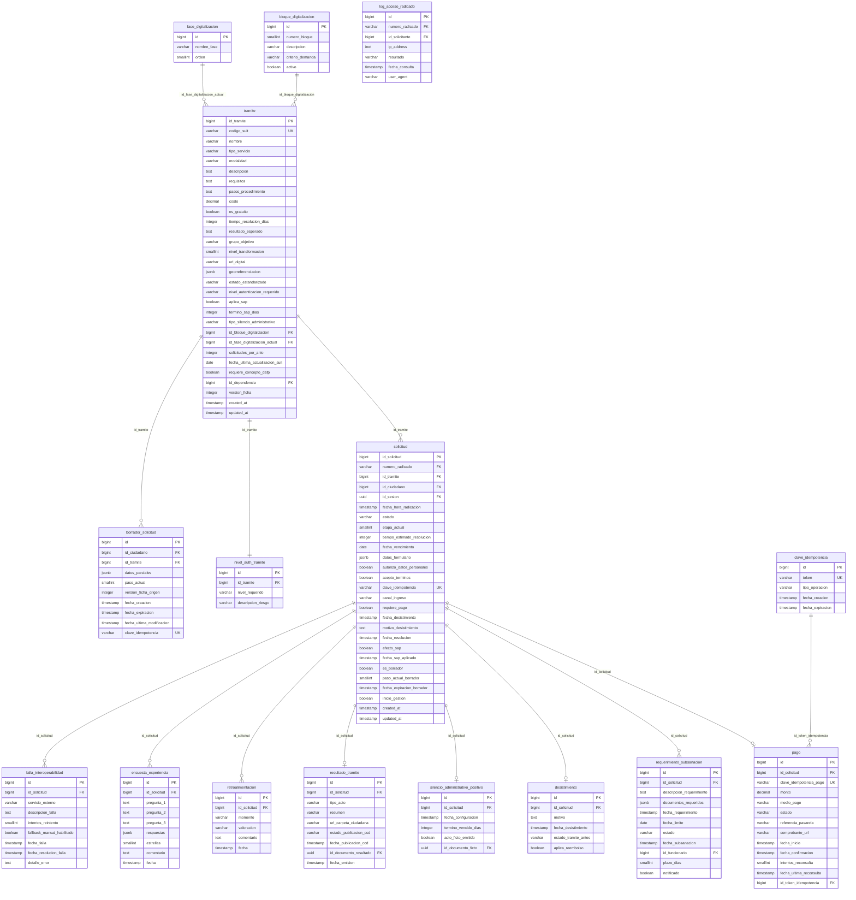
```mermaid
erDiagram
    tramite {
        bigint id_tramite PK
        varchar codigo_suit UK
        varchar nombre
        varchar tipo_servicio
        varchar modalidad
        text descripcion
        text requisitos
        text pasos_procedimiento
        decimal costo
        boolean es_gratuito
        integer tiempo_resolucion_dias
        text resultado_esperado
        varchar grupo_objetivo
        smallint nivel_transformacion
        varchar url_digital
        jsonb georreferenciacion
        varchar estado_estandarizado
        varchar nivel_autenticacion_requerido
        boolean aplica_sap
        integer termino_sap_dias
        varchar tipo_silencio_administrativo
        bigint id_bloque_digitalizacion FK
        bigint id_fase_digitalizacion_actual FK
        integer solicitudes_por_anio
        date fecha_ultima_actualizacion_suit
        boolean requiere_concepto_dafp
        bigint id_dependencia FK
        integer version_ficha
        timestamp created_at
        timestamp updated_at
    }
    solicitud {
        bigint id_solicitud PK
        varchar numero_radicado FK
        bigint id_tramite FK
        bigint id_ciudadano FK
        uuid id_sesion FK
        timestamp fecha_hora_radicacion
        varchar estado
        smallint etapa_actual
        integer tiempo_estimado_resolucion
        date fecha_vencimiento
        jsonb datos_formulario
        boolean autorizo_datos_personales
        boolean acepto_terminos
        varchar clave_idempotencia UK
        varchar canal_ingreso
        boolean requiere_pago
        timestamp fecha_desistimiento
        text motivo_desistimiento
        timestamp fecha_resolucion
        boolean efecto_sap
        timestamp fecha_sap_aplicado
        boolean es_borrador
        smallint paso_actual_borrador
        timestamp fecha_expiracion_borrador
        boolean inicio_gestion
        timestamp created_at
        timestamp updated_at
    }
    bloque_digitalizacion {
        bigint id PK
        smallint numero_bloque
        varchar descripcion
        varchar criterio_demanda
        boolean activo
    }
    fase_digitalizacion {
        bigint id PK
        varchar nombre_fase
        smallint orden
    }
    nivel_auth_tramite {
        bigint id PK
        bigint id_tramite FK
        varchar nivel_requerido
        varchar descripcion_riesgo
    }
    borrador_solicitud {
        bigint id PK
        bigint id_ciudadano FK
        bigint id_tramite FK
        jsonb datos_parciales
        smallint paso_actual
        integer version_ficha_origen
        timestamp fecha_creacion
        timestamp fecha_expiracion
        timestamp fecha_ultima_modificacion
        varchar clave_idempotencia UK
    }
    pago {
        bigint id PK
        bigint id_solicitud FK
        varchar clave_idempotencia_pago UK
        decimal monto
        varchar medio_pago
        varchar estado
        varchar referencia_pasarela
        varchar comprobante_url
        timestamp fecha_inicio
        timestamp fecha_confirmacion
        smallint intentos_reconsulta
        timestamp fecha_ultima_reconsulta
        bigint id_token_idempotencia FK
    }
    clave_idempotencia {
        bigint id PK
        varchar token UK
        varchar tipo_operacion
        timestamp fecha_creacion
        timestamp fecha_expiracion
    }
    requerimiento_subsanacion {
        bigint id PK
        bigint id_solicitud FK
        text descripcion_requerimiento
        jsonb documentos_requeridos
        timestamp fecha_requerimiento
        date fecha_limite
        varchar estado
        timestamp fecha_subsanacion
        bigint id_funcionario FK
        smallint plazo_dias
        boolean notificado
    }
    desistimiento {
        bigint id PK
        bigint id_solicitud FK
        text motivo
        timestamp fecha_desistimiento
        varchar estado_tramite_antes
        boolean aplica_reembolso
    }
    silencio_administrativo_positivo {
        bigint id PK
        bigint id_solicitud FK
        timestamp fecha_configuracion
        integer termino_vencido_dias
        boolean acto_ficto_emitido
        uuid id_documento_ficto FK
    }
    resultado_tramite {
        bigint id PK
        bigint id_solicitud FK
        varchar tipo_acto
        varchar resumen
        varchar url_carpeta_ciudadana
        varchar estado_publicacion_ccd
        timestamp fecha_publicacion_ccd
        uuid id_documento_resultado FK
        timestamp fecha_emision
    }
    retroalimentacion {
        bigint id PK
        bigint id_solicitud FK
        varchar momento
        varchar valoracion
        text comentario
        timestamp fecha
    }
    encuesta_experiencia {
        bigint id PK
        bigint id_solicitud FK
        text pregunta_1
        text pregunta_2
        text pregunta_3
        jsonb respuestas
        smallint estrellas
        text comentario
        timestamp fecha
    }
    log_acceso_radicado {
        bigint id PK
        varchar numero_radicado FK
        bigint id_solicitante FK
        inet ip_address
        varchar resultado
        timestamp fecha_consulta
        varchar user_agent
    }
    falla_interoperabilidad {
        bigint id PK
        bigint id_solicitud FK
        varchar servicio_externo
        text descripcion_falla
        smallint intentos_reintento
        boolean fallback_manual_habilitado
        timestamp fecha_falla
        timestamp fecha_resolucion_falla
        text detalle_error
    }

    tramite ||--o{ solicitud : "id_tramite"
    bloque_digitalizacion ||--o{ tramite : "id_bloque_digitalizacion"
    fase_digitalizacion ||--o{ tramite : "id_fase_digitalizacion_actual"
    tramite ||--|| nivel_auth_tramite : "id_tramite"
    tramite ||--o{ borrador_solicitud : "id_tramite"
    solicitud ||--o| pago : "id_solicitud"
    clave_idempotencia ||--o{ pago : "id_token_idempotencia"
    solicitud ||--o{ requerimiento_subsanacion : "id_solicitud"
    solicitud ||--o| desistimiento : "id_solicitud"
    solicitud ||--o| silencio_administrativo_positivo : "id_solicitud"
    solicitud ||--o| resultado_tramite : "id_solicitud"
    solicitud ||--o{ retroalimentacion : "id_solicitud"
    solicitud ||--o{ encuesta_experiencia : "id_solicitud"
    solicitud ||--o{ falla_interoperabilidad : "id_solicitud"
```

> FK cruzadas: `tramite.id_dependencia`→`dependencia`; `solicitud.numero_radicado`→`radicado(numero_radicado)` (PQRSD); `.id_ciudadano`, `borrador_solicitud.id_ciudadano`, `log_acceso_radicado.id_solicitante`→`ciudadano`; `.id_sesion`→`sesion`; `id_documento_ficto`/`id_documento_resultado`→`documento_electronico`; `requerimiento_subsanacion.id_funcionario`→`usuario_interno`.

### 2.3 Dominio PQRSD (módulo 04)

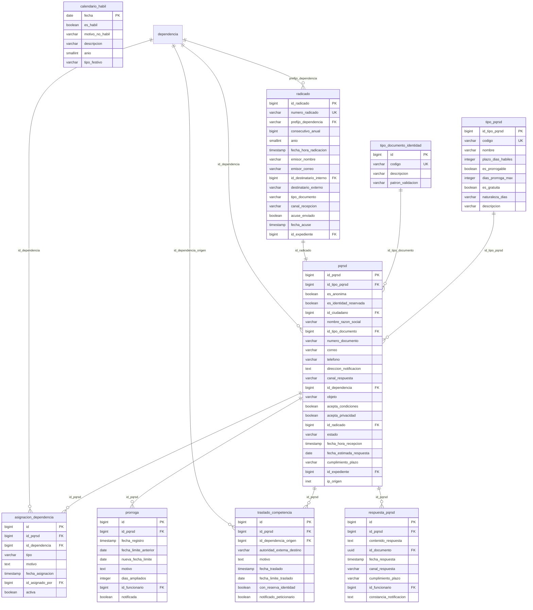
```mermaid
erDiagram
    pqrsd {
        bigint id_pqrsd PK
        bigint id_tipo_pqrsd FK
        boolean es_anonima
        boolean es_identidad_reservada
        bigint id_ciudadano FK
        varchar nombre_razon_social
        bigint id_tipo_documento FK
        varchar numero_documento
        varchar correo
        varchar telefono
        text direccion_notificacion
        varchar canal_respuesta
        bigint id_dependencia FK
        varchar objeto
        boolean acepta_condiciones
        boolean acepta_privacidad
        bigint id_radicado FK
        varchar estado
        timestamp fecha_hora_recepcion
        date fecha_estimada_respuesta
        varchar cumplimiento_plazo
        bigint id_expediente FK
        inet ip_origen
    }
    radicado {
        bigint id_radicado PK
        varchar numero_radicado UK
        varchar prefijo_dependencia FK
        bigint consecutivo_anual
        smallint anio
        timestamp fecha_hora_radicacion
        varchar emisor_nombre
        varchar emisor_correo
        bigint id_destinatario_interno FK
        varchar destinatario_externo
        varchar tipo_documento
        varchar canal_recepcion
        boolean acuse_enviado
        timestamp fecha_acuse
        bigint id_expediente FK
    }
    tipo_pqrsd {
        bigint id_tipo_pqrsd PK
        varchar codigo UK
        varchar nombre
        integer plazo_dias_habiles
        boolean es_prorrogable
        integer dias_prorroga_max
        boolean es_gratuita
        varchar naturaleza_dias
        varchar descripcion
    }
    tipo_documento_identidad {
        bigint id PK
        varchar codigo UK
        varchar descripcion
        varchar patron_validacion
    }
    asignacion_dependencia {
        bigint id PK
        bigint id_pqrsd FK
        bigint id_dependencia FK
        varchar tipo
        text motivo
        timestamp fecha_asignacion
        bigint id_asignado_por FK
        boolean activa
    }
    traslado_competencia {
        bigint id PK
        bigint id_pqrsd FK
        bigint id_dependencia_origen FK
        varchar autoridad_externa_destino
        text motivo
        timestamp fecha_traslado
        date fecha_limite_traslado
        boolean con_reserva_identidad
        boolean notificado_peticionario
    }
    prorroga {
        bigint id PK
        bigint id_pqrsd FK
        timestamp fecha_registro
        date fecha_limite_anterior
        date nueva_fecha_limite
        text motivo
        integer dias_ampliados
        bigint id_funcionario FK
        boolean notificada
    }
    respuesta_pqrsd {
        bigint id PK
        bigint id_pqrsd FK
        text contenido_respuesta
        uuid id_documento FK
        timestamp fecha_respuesta
        varchar canal_respuesta
        varchar cumplimiento_plazo
        bigint id_funcionario FK
        text constancia_notificacion
    }
    calendario_habil {
        date fecha PK
        boolean es_habil
        varchar motivo_no_habil
        varchar descripcion
        smallint anio
        varchar tipo_festivo
    }

    tipo_pqrsd ||--o{ pqrsd : "id_tipo_pqrsd"
    tipo_documento_identidad ||--o{ pqrsd : "id_tipo_documento"
    radicado ||--|| pqrsd : "id_radicado"
    pqrsd ||--o{ asignacion_dependencia : "id_pqrsd"
    pqrsd ||--o{ traslado_competencia : "id_pqrsd"
    pqrsd ||--o{ prorroga : "id_pqrsd"
    pqrsd ||--o{ respuesta_pqrsd : "id_pqrsd"

    dependencia ||--o{ pqrsd : "id_dependencia"
    dependencia ||--o{ radicado : "prefijo_dependencia"
    dependencia ||--o{ asignacion_dependencia : "id_dependencia"
    dependencia ||--o{ traslado_competencia : "id_dependencia_origen"
```

> FK cruzadas: `pqrsd.id_ciudadano`→`ciudadano`, `.id_expediente`/`radicado.id_expediente`→`expediente_electronico`; `radicado.id_destinatario_interno`/`asignacion_dependencia.id_asignado_por`/`prorroga.id_funcionario`/`respuesta_pqrsd.id_funcionario`→`usuario_interno`; `respuesta_pqrsd.id_documento`→`documento_electronico`; `calendario_habil` es fuente única de cómputo de plazos (RN-TX-D01).

### 2.4 Dominio Participa (módulo 05)

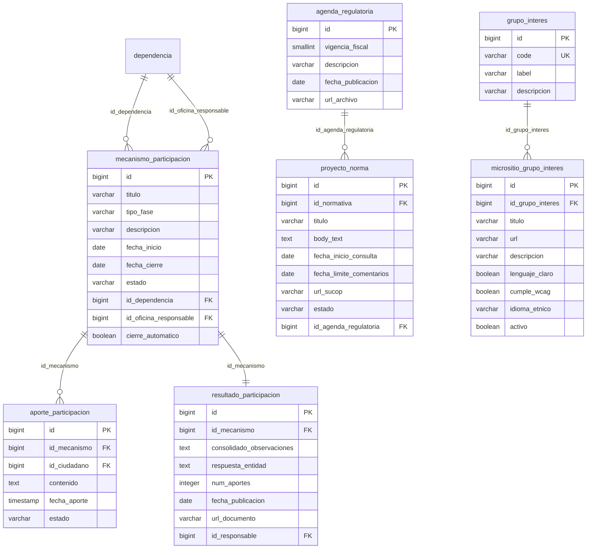
```mermaid
erDiagram
    mecanismo_participacion {
        bigint id PK
        varchar titulo
        varchar tipo_fase
        varchar descripcion
        date fecha_inicio
        date fecha_cierre
        varchar estado
        bigint id_dependencia FK
        bigint id_oficina_responsable FK
        boolean cierre_automatico
    }
    proyecto_norma {
        bigint id PK
        bigint id_normativa FK
        varchar titulo
        text body_text
        date fecha_inicio_consulta
        date fecha_limite_comentarios
        varchar url_sucop
        varchar estado
        bigint id_agenda_regulatoria FK
    }
    aporte_participacion {
        bigint id PK
        bigint id_mecanismo FK
        bigint id_ciudadano FK
        text contenido
        timestamp fecha_aporte
        varchar estado
    }
    resultado_participacion {
        bigint id PK
        bigint id_mecanismo FK
        text consolidado_observaciones
        text respuesta_entidad
        integer num_aportes
        date fecha_publicacion
        varchar url_documento
        bigint id_responsable FK
    }
    grupo_interes {
        bigint id PK
        varchar code UK
        varchar label
        varchar descripcion
    }
    micrositio_grupo_interes {
        bigint id PK
        bigint id_grupo_interes FK
        varchar titulo
        varchar url
        varchar descripcion
        boolean lenguaje_claro
        boolean cumple_wcag
        varchar idioma_etnico
        boolean activo
    }
    agenda_regulatoria {
        bigint id PK
        smallint vigencia_fiscal
        varchar descripcion
        date fecha_publicacion
        varchar url_archivo
    }

    mecanismo_participacion ||--o{ aporte_participacion : "id_mecanismo"
    mecanismo_participacion ||--|| resultado_participacion : "id_mecanismo"
    agenda_regulatoria ||--o{ proyecto_norma : "id_agenda_regulatoria"
    grupo_interes ||--o{ micrositio_grupo_interes : "id_grupo_interes"
    dependencia ||--o{ mecanismo_participacion : "id_dependencia"
    dependencia ||--o{ mecanismo_participacion : "id_oficina_responsable"
```

> FK cruzadas: `proyecto_norma.id_normativa`→`normativa` (transparencia, FK propietaria que resuelve el ciclo §4.7); `aporte_participacion.id_ciudadano`→`ciudadano`; `resultado_participacion.id_responsable`→`usuario_interno`.

### 2.5 Dominio Canales y citas (módulo 06)

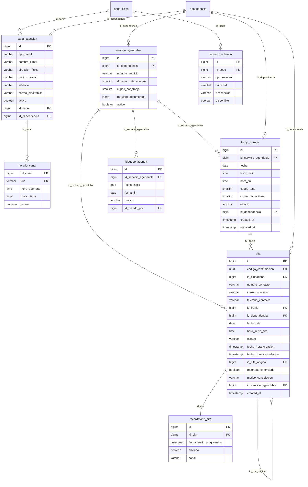
```mermaid
erDiagram
    canal_atencion {
        bigint id PK
        varchar tipo_canal
        varchar nombre_canal
        varchar direccion_fisica
        varchar codigo_postal
        varchar telefono
        varchar correo_electronico
        boolean activo
        bigint id_sede FK
        bigint id_dependencia FK
    }
    horario_canal {
        bigint id_canal PK
        varchar dia PK
        time hora_apertura
        time hora_cierre
        boolean activo
    }
    servicio_agendable {
        bigint id PK
        bigint id_dependencia FK
        varchar nombre_servicio
        smallint duracion_cita_minutos
        smallint cupos_por_franja
        jsonb requiere_documentos
        boolean activo
    }
    franja_horaria {
        bigint id PK
        bigint id_servicio_agendable FK
        date fecha
        time hora_inicio
        time hora_fin
        smallint cupos_total
        smallint cupos_disponibles
        varchar estado
        bigint id_dependencia FK
        timestamp created_at
        timestamp updated_at
    }
    bloqueo_agenda {
        bigint id PK
        bigint id_servicio_agendable FK
        date fecha_inicio
        date fecha_fin
        varchar motivo
        bigint id_creado_por FK
    }
    cita {
        bigint id PK
        uuid codigo_confirmacion UK
        bigint id_ciudadano FK
        varchar nombre_contacto
        varchar correo_contacto
        varchar telefono_contacto
        bigint id_franja FK
        bigint id_dependencia FK
        date fecha_cita
        time hora_inicio_cita
        varchar estado
        timestamp fecha_hora_creacion
        timestamp fecha_hora_cancelacion
        bigint id_cita_original FK
        boolean recordatorio_enviado
        varchar motivo_cancelacion
        bigint id_servicio_agendable FK
        timestamp created_at
    }
    recordatorio_cita {
        bigint id PK
        bigint id_cita FK
        timestamp fecha_envio_programada
        boolean enviado
        varchar canal
    }
    recurso_inclusivo {
        bigint id PK
        bigint id_sede FK
        varchar tipo_recurso
        smallint cantidad
        varchar descripcion
        boolean disponible
    }

    canal_atencion ||--o{ horario_canal : "id_canal"
    servicio_agendable ||--o{ franja_horaria : "id_servicio_agendable"
    servicio_agendable ||--o{ bloqueo_agenda : "id_servicio_agendable"
    servicio_agendable ||--o{ cita : "id_servicio_agendable"
    franja_horaria ||--o{ cita : "id_franja"
    cita ||--o| cita : "id_cita_original"
    cita ||--|| recordatorio_cita : "id_cita"
    sede_fisica ||--o{ canal_atencion : "id_sede"
    sede_fisica ||--o{ recurso_inclusivo : "id_sede"
    dependencia ||--o{ canal_atencion : "id_dependencia"
    dependencia ||--o{ servicio_agendable : "id_dependencia"
    dependencia ||--o{ franja_horaria : "id_dependencia"
    dependencia ||--o{ cita : "id_dependencia"
```

> FK cruzadas: `cita.id_ciudadano`→`ciudadano`; `bloqueo_agenda.id_creado_por`→`usuario_interno`.

### 2.6 Dominio Accesibilidad y Usabilidad (módulos 07-08)

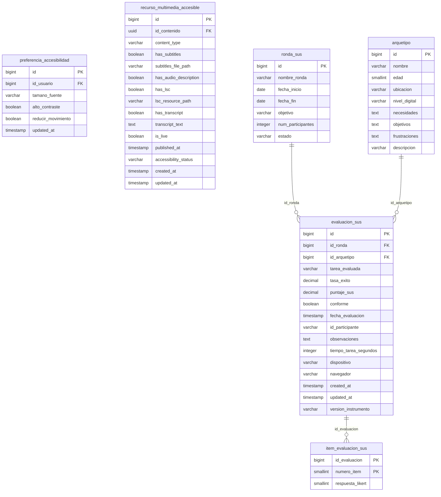
```mermaid
erDiagram
    preferencia_accesibilidad {
        bigint id PK
        bigint id_usuario FK
        varchar tamano_fuente
        boolean alto_contraste
        boolean reducir_movimiento
        timestamp updated_at
    }
    recurso_multimedia_accesible {
        bigint id PK
        uuid id_contenido FK
        varchar content_type
        boolean has_subtitles
        varchar subtitles_file_path
        boolean has_audio_description
        boolean has_lsc
        varchar lsc_resource_path
        boolean has_transcript
        text transcript_text
        boolean is_live
        timestamp published_at
        varchar accessibility_status
        timestamp created_at
        timestamp updated_at
    }
    ronda_sus {
        bigint id PK
        varchar nombre_ronda
        date fecha_inicio
        date fecha_fin
        varchar objetivo
        integer num_participantes
        varchar estado
    }
    evaluacion_sus {
        bigint id PK
        bigint id_ronda FK
        bigint id_arquetipo FK
        varchar tarea_evaluada
        decimal tasa_exito
        decimal puntaje_sus
        boolean conforme
        timestamp fecha_evaluacion
        varchar id_participante
        text observaciones
        integer tiempo_tarea_segundos
        varchar dispositivo
        varchar navegador
        timestamp created_at
        timestamp updated_at
        varchar version_instrumento
    }
    item_evaluacion_sus {
        bigint id_evaluacion PK
        smallint numero_item PK
        smallint respuesta_likert
    }
    arquetipo {
        bigint id PK
        varchar nombre
        smallint edad
        varchar ubicacion
        varchar nivel_digital
        text necesidades
        text objetivos
        text frustraciones
        varchar descripcion
    }

    ronda_sus ||--o{ evaluacion_sus : "id_ronda"
    arquetipo ||--o{ evaluacion_sus : "id_arquetipo"
    evaluacion_sus ||--o{ item_evaluacion_sus : "id_evaluacion"
```

> FK cruzadas: `preferencia_accesibilidad.id_usuario`→`ciudadano`; `recurso_multimedia_accesible.id_contenido`→`contenido` (CMS).

### 2.7 Dominio Seguridad y RBAC (módulos 09, 12-RBAC)

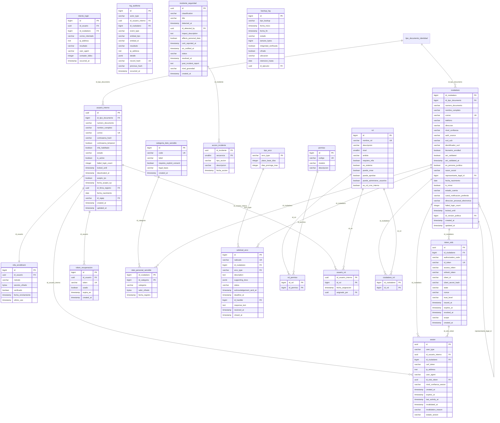
```mermaid
erDiagram
    ciudadano {
        bigint id_ciudadano PK
        bigint id_tipo_documento FK
        varchar numero_documento
        varchar nombre_completo
        varchar correo UK
        varchar telefono
        varchar direccion
        varchar nivel_confianza
        varchar auth_source
        varchar scd_sub
        varchar identificador_scd
        boolean biometric_enrolled
        boolean ani_validated
        timestamp ani_validated_at
        boolean es_persona_juridica
        varchar razon_social
        bigint representante_legal_id FK
        date fecha_nacimiento
        boolean is_minor
        varchar estado_cuenta
        varchar canal_notificacion_preferido
        varchar direccion_procesal_electronica
        integer failed_login_count
        timestamp locked_until
        bigint id_version_politica FK
        timestamp created_at
        timestamp updated_at
    }
    usuario_interno {
        uuid id PK
        bigint id_tipo_documento FK
        varchar numero_documento
        varchar nombre_completo
        varchar correo UK
        varchar contrasena_hash
        boolean contrasena_temporal
        boolean mfa_habilitado
        varchar estado
        boolean is_active
        integer failed_login_count
        timestamp locked_until
        timestamp deactivated_at
        boolean acepto_tyc
        timestamp fecha_acepto_tyc
        uuid id_firma_registro FK
        date fecha_nacimiento
        varchar id_sigep FK
        timestamp created_at
        timestamp updated_at
    }
    sesion {
        uuid id PK
        varchar user_type
        uuid id_usuario_interno FK
        bigint id_ciudadano FK
        varchar csrf_token
        inet ip_address
        varchar user_agent
        uuid id_oidc_token FK
        varchar nivel_confianza_sesion
        timestamp created_at
        timestamp expires_at
        timestamp last_activity_at
        timestamp invalidated_at
        varchar invalidation_reason
        varchar estado_sesion
    }
    mfa_enrollment {
        bigint id PK
        uuid id_usuario FK
        varchar metodo
        bytea secreto_cifrado
        boolean verificado
        timestamp fecha_enrolamiento
        timestamp ultimo_uso
    }
    token_oidc {
        uuid id PK
        bigint id_ciudadano FK
        varchar authorization_code
        varchar id_token UK
        varchar access_token
        varchar refresh_token
        varchar client_id
        varchar client_secret_hash
        varchar state
        varchar nonce
        varchar trust_level
        timestamp issued_at
        timestamp expires_at
        timestamp revoked_at
        varchar scope
        timestamp created_at
    }
    token_recuperacion {
        bigint id PK
        uuid id_usuario FK
        varchar token UK
        boolean usado
        timestamp expira_en
        timestamp created_at
    }
    intento_login {
        bigint id PK
        uuid id_usuario FK
        bigint id_ciudadano FK
        varchar correo_intentado
        inet ip_address
        varchar resultado
        varchar user_agent
        integer contador_fallos
        timestamp occurred_at
    }
    log_auditoria {
        bigint id PK
        varchar actor_type
        uuid id_usuario_interno FK
        bigint id_ciudadano FK
        varchar event_type
        varchar entidad_tipo
        varchar entidad_id
        varchar resultado
        inet ip_address
        jsonb detalle
        varchar record_hash UK
        varchar previous_hash
        timestamp occurred_at
    }
    incidente_seguridad {
        uuid id PK
        varchar classification
        varchar title
        timestamp detected_at
        uuid id_detected_by FK
        text impact_description
        boolean affects_personal_data
        timestamp csirt_reported_at
        timestamp sic_notified_at
        varchar status
        timestamp resolved_at
        text post_incident_report
        varchar nivel_gravedad
        timestamp created_at
    }
    accion_incidente {
        uuid id_incidente PK
        smallint secuencia PK
        varchar tipo_accion
        varchar descripcion
        timestamp fecha_accion
    }
    backup_log {
        bigint id PK
        varchar tipo_backup
        timestamp fecha_inicio
        timestamp fecha_fin
        varchar estado
        bigint tamano_bytes
        boolean integridad_verificada
        boolean cifrado
        varchar ubicacion
        date retencion_hasta
        uuid id_ejecutor FK
    }
    categoria_dato_sensible {
        bigint id PK
        varchar code UK
        varchar label
        boolean requires_explicit_consent
        varchar legal_basis
        timestamp created_at
    }
    dato_personal_sensible {
        bigint id_ciudadano PK
        bigint id_categoria PK
        varchar categoria
        bytea valor_cifrado
        timestamp fecha_registro
    }
    solicitud_arco {
        bigint id PK
        varchar radicado UK
        bigint id_ciudadano FK
        varchar arco_type FK
        text description
        jsonb supporting_docs
        varchar status
        timestamp acknowledgement_sent_at
        timestamp deadline_at
        bigint id_handler FK
        text response_text
        timestamp received_at
        timestamp closed_at
    }
    tipo_arco {
        varchar arco_type PK
        integer plazo_base_dias
        integer dias_prorroga_max
    }
    rol {
        bigint id PK
        varchar nombre_rol UK
        varchar descripcion
        smallint nivel
        varchar ambito
        boolean requiere_mfa
        boolean es_sistema
        boolean puede_crear
        boolean puede_aprobar
        boolean puede_administrar_usuarios
        boolean es_rol_cms_interno
    }
    permiso {
        bigint id PK
        varchar codigo UK
        varchar modulo
        varchar descripcion
    }
    rol_permiso {
        bigint id_rol PK
        bigint id_permiso PK
    }
    usuario_rol {
        uuid id_usuario_interno PK
        bigint id_rol PK
        timestamp fecha_asignacion
        uuid asignado_por FK
    }
    ciudadano_rol {
        bigint id_ciudadano PK
        bigint id_rol PK
    }

    tipo_documento_identidad ||--o{ ciudadano : "id_tipo_documento"
    ciudadano ||--o{ ciudadano : "representante_legal_id"
    tipo_documento_identidad ||--o{ usuario_interno : "id_tipo_documento"
    usuario_interno ||--o{ sesion : "id_usuario_interno"
    ciudadano ||--o{ sesion : "id_ciudadano"
    token_oidc ||--o{ sesion : "id_oidc_token"
    usuario_interno ||--|| mfa_enrollment : "id_usuario"
    ciudadano ||--o{ token_oidc : "id_ciudadano"
    usuario_interno ||--o{ token_recuperacion : "id_usuario"
    incidente_seguridad ||--o{ accion_incidente : "id_incidente"
    categoria_dato_sensible ||--o{ dato_personal_sensible : "id_categoria"
    ciudadano ||--o{ dato_personal_sensible : "id_ciudadano"
    tipo_arco ||--o{ solicitud_arco : "arco_type"
    ciudadano ||--o{ solicitud_arco : "id_ciudadano"
    rol ||--o{ rol_permiso : "id_rol"
    permiso ||--o{ rol_permiso : "id_permiso"
    usuario_interno ||--o{ usuario_rol : "id_usuario_interno"
    rol ||--o{ usuario_rol : "id_rol"
    ciudadano ||--o{ ciudadano_rol : "id_ciudadano"
    rol ||--o{ ciudadano_rol : "id_rol"
```

> FK cruzadas: `usuario_interno.id_sigep`→`servidor_publico(codigo_sigep)`, `.id_firma_registro`→`firma_electronica`; `ciudadano.id_version_politica`→`politica_documento`; `log_auditoria` actor por arco exclusivo + recurso polimórfico `(entidad_tipo, entidad_id=TEXT)` antipatrón aceptado (H13); `incidente_seguridad.id_detected_by`/`backup_log.id_ejecutor`/`solicitud_arco.id_handler`/`usuario_rol.asignado_por`→`usuario_interno`; `intento_login.id_usuario`→`usuario_interno`, `.id_ciudadano`→`ciudadano`.

### 2.8 Dominio Interoperabilidad (módulo 10)

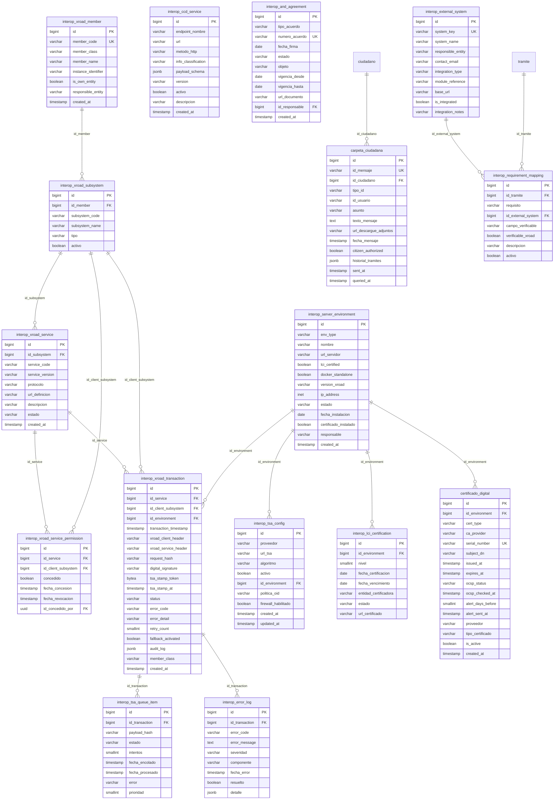
```mermaid
erDiagram
    interop_xroad_member {
        bigint id PK
        varchar member_code UK
        varchar member_class
        varchar member_name
        varchar instance_identifier
        boolean is_own_entity
        varchar responsible_entity
        timestamp created_at
    }
    interop_xroad_subsystem {
        bigint id PK
        bigint id_member FK
        varchar subsystem_code
        varchar subsystem_name
        varchar tipo
        boolean activo
    }
    interop_xroad_service {
        bigint id PK
        bigint id_subsystem FK
        varchar service_code
        varchar service_version
        varchar protocolo
        varchar url_definicion
        varchar descripcion
        varchar estado
        timestamp created_at
    }
    interop_xroad_service_permission {
        bigint id PK
        bigint id_service FK
        bigint id_client_subsystem FK
        boolean concedido
        timestamp fecha_concesion
        timestamp fecha_revocacion
        uuid id_concedido_por FK
    }
    interop_xroad_transaction {
        bigint id PK
        bigint id_service FK
        bigint id_client_subsystem FK
        bigint id_environment FK
        timestamp transaction_timestamp
        varchar xroad_client_header
        varchar xroad_service_header
        varchar request_hash
        varchar digital_signature
        bytea tsa_stamp_token
        timestamp tsa_stamp_at
        varchar status
        varchar error_code
        varchar error_detail
        smallint retry_count
        boolean fallback_activated
        jsonb audit_log
        varchar member_class
        timestamp created_at
    }
    interop_tsa_config {
        bigint id PK
        varchar proveedor
        varchar url_tsa
        varchar algoritmo
        boolean activo
        bigint id_environment FK
        varchar politica_oid
        boolean firewall_habilitado
        timestamp created_at
        timestamp updated_at
    }
    interop_tsa_queue_item {
        bigint id PK
        bigint id_transaction FK
        varchar payload_hash
        varchar estado
        smallint intentos
        timestamp fecha_encolado
        timestamp fecha_procesado
        varchar error
        smallint prioridad
    }
    interop_ccd_service {
        bigint id PK
        varchar endpoint_nombre
        varchar url
        varchar metodo_http
        varchar info_classification
        jsonb payload_schema
        varchar version
        boolean activo
        varchar descripcion
        timestamp created_at
    }
    carpeta_ciudadana {
        bigint id PK
        varchar id_mensaje UK
        bigint id_ciudadano FK
        varchar tipo_id
        varchar id_usuario
        varchar asunto
        text texto_mensaje
        varchar url_descargue_adjuntos
        timestamp fecha_mensaje
        boolean citizen_authorized
        jsonb historial_tramites
        timestamp sent_at
        timestamp queried_at
    }
    interop_and_agreement {
        bigint id PK
        varchar tipo_acuerdo
        varchar numero_acuerdo UK
        date fecha_firma
        varchar estado
        varchar objeto
        date vigencia_desde
        date vigencia_hasta
        varchar url_documento
        bigint id_responsable FK
        timestamp created_at
    }
    interop_external_system {
        bigint id PK
        varchar system_key UK
        varchar system_name
        varchar responsible_entity
        varchar contact_email
        varchar integration_type
        varchar module_reference
        varchar base_url
        boolean is_integrated
        varchar integration_notes
    }
    interop_requirement_mapping {
        bigint id PK
        bigint id_tramite FK
        varchar requisito
        bigint id_external_system FK
        varchar campo_verificable
        boolean verificable_xroad
        varchar descripcion
        boolean activo
    }
    interop_server_environment {
        bigint id PK
        varchar env_type
        varchar nombre
        varchar url_servidor
        boolean lci_certified
        boolean docker_standalone
        varchar version_xroad
        inet ip_address
        varchar estado
        date fecha_instalacion
        boolean certificado_instalado
        varchar responsable
        timestamp created_at
    }
    interop_error_log {
        bigint id PK
        bigint id_transaction FK
        varchar error_code
        text error_message
        varchar severidad
        varchar componente
        timestamp fecha_error
        boolean resuelto
        jsonb detalle
    }
    interop_lci_certification {
        bigint id PK
        bigint id_environment FK
        smallint nivel
        date fecha_certificacion
        date fecha_vencimiento
        varchar entidad_certificadora
        varchar estado
        varchar url_certificado
    }
    certificado_digital {
        bigint id PK
        bigint id_environment FK
        varchar cert_type
        varchar ca_provider
        varchar serial_number UK
        varchar subject_dn
        timestamp issued_at
        timestamp expires_at
        varchar ocsp_status
        timestamp ocsp_checked_at
        smallint alert_days_before
        timestamp alert_sent_at
        varchar proveedor
        varchar tipo_certificado
        boolean is_active
        timestamp created_at
    }

    interop_xroad_member ||--o{ interop_xroad_subsystem : "id_member"
    interop_xroad_subsystem ||--o{ interop_xroad_service : "id_subsystem"
    interop_xroad_service ||--o{ interop_xroad_service_permission : "id_service"
    interop_xroad_subsystem ||--o{ interop_xroad_service_permission : "id_client_subsystem"
    interop_xroad_service ||--o{ interop_xroad_transaction : "id_service"
    interop_xroad_subsystem ||--o{ interop_xroad_transaction : "id_client_subsystem"
    interop_server_environment ||--o{ interop_xroad_transaction : "id_environment"
    interop_server_environment ||--o{ interop_tsa_config : "id_environment"
    interop_xroad_transaction ||--o{ interop_tsa_queue_item : "id_transaction"
    interop_xroad_transaction ||--o{ interop_error_log : "id_transaction"
    interop_server_environment ||--o{ interop_lci_certification : "id_environment"
    interop_server_environment ||--o{ certificado_digital : "id_environment"
    interop_external_system ||--o{ interop_requirement_mapping : "id_external_system"
    tramite ||--o{ interop_requirement_mapping : "id_tramite"

    ciudadano ||--o{ carpeta_ciudadana : "id_ciudadano"
```

> FK cruzadas: `interop_xroad_service_permission.id_concedido_por`/`interop_and_agreement.id_responsable`→`usuario_interno`; `interop_requirement_mapping.id_tramite`→`tramite`.

### 2.9 Dominio Datos Abiertos (módulo 11)

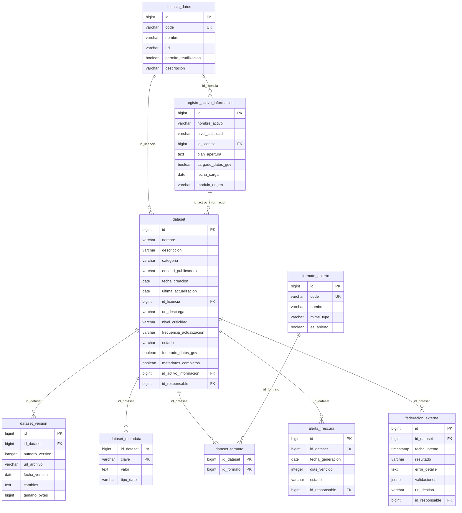
```mermaid
erDiagram
    dataset {
        bigint id PK
        varchar nombre
        varchar descripcion
        varchar categoria
        varchar entidad_publicadora
        date fecha_creacion
        date ultima_actualizacion
        bigint id_licencia FK
        varchar url_descarga
        varchar nivel_criticidad
        varchar frecuencia_actualizacion
        varchar estado
        boolean federado_datos_gov
        boolean metadatos_completos
        bigint id_activo_informacion FK
        bigint id_responsable FK
    }
    dataset_version {
        bigint id PK
        bigint id_dataset FK
        integer numero_version
        varchar url_archivo
        date fecha_version
        text cambios
        bigint tamano_bytes
    }
    dataset_metadata {
        bigint id_dataset PK
        varchar clave PK
        text valor
        varchar tipo_dato
    }
    dataset_formato {
        bigint id_dataset PK
        bigint id_formato PK
    }
    formato_abierto {
        bigint id PK
        varchar code UK
        varchar nombre
        varchar mime_type
        boolean es_abierto
    }
    licencia_datos {
        bigint id PK
        varchar code UK
        varchar nombre
        varchar url
        boolean permite_reutilizacion
        varchar descripcion
    }
    alerta_frescura {
        bigint id PK
        bigint id_dataset FK
        date fecha_generacion
        integer dias_vencido
        varchar estado
        bigint id_responsable FK
    }
    federacion_externa {
        bigint id PK
        bigint id_dataset FK
        timestamp fecha_intento
        varchar resultado
        text error_detalle
        jsonb validaciones
        varchar url_destino
        bigint id_responsable FK
    }
    registro_activo_informacion {
        bigint id PK
        varchar nombre_activo
        varchar nivel_criticidad
        bigint id_licencia FK
        text plan_apertura
        boolean cargado_datos_gov
        date fecha_carga
        varchar modulo_origen
    }

    licencia_datos ||--o{ dataset : "id_licencia"
    registro_activo_informacion ||--o{ dataset : "id_activo_informacion"
    dataset ||--o{ dataset_version : "id_dataset"
    dataset ||--o{ dataset_metadata : "id_dataset"
    dataset ||--o{ dataset_formato : "id_dataset"
    formato_abierto ||--o{ dataset_formato : "id_formato"
    dataset ||--o{ alerta_frescura : "id_dataset"
    dataset ||--o{ federacion_externa : "id_dataset"
    licencia_datos ||--o{ registro_activo_informacion : "id_licencia"
```

> FK cruzadas: `dataset.id_responsable`/`alerta_frescura.id_responsable`/`federacion_externa.id_responsable`→`usuario_interno`.

### 2.10 Dominio CMS/Documental y Transparencia/Tributario (módulos 12, 02)


```mermaid
erDiagram
    contenido {
        uuid id PK
        varchar tipo
        varchar titulo
        text cuerpo
        varchar estado
        varchar seccion
        varchar modulo_origen
        uuid id_creado_por FK
        uuid id_aprobado_por FK
        uuid id_rechazado_por FK
        text comentario_rechazo
        timestamp fecha_publicacion
        timestamp fecha_archivado
        date fecha_vigencia
        integer version_actual
        integer lock_version
        uuid lock_usuario_id FK
        jsonb metadatos_json
        boolean tiene_alt_imagen
        boolean tiene_subtitulos_video
        varchar url_fuente
        varchar idioma_origen
        timestamp fecha_creacion
        timestamp fecha_ultima_modificacion
    }
    contenido_traduccion {
        uuid id_contenido PK
        varchar idioma PK
        varchar titulo_traducido
        text cuerpo_traducido
        boolean es_original
    }
    version_contenido {
        bigint id PK
        uuid id_contenido FK
        integer version
        text cuerpo_snapshot
        uuid id_editor FK
        timestamp fecha_edicion
        varchar comentario
        timestamp bloqueado_desde
    }
    criterio_ita {
        bigint id PK
        smallint nivel_ita
        varchar nombre
        varchar categoria
        varchar descripcion
        boolean es_bloqueante
        decimal peso
    }
    validacion_ita {
        bigint id PK
        uuid id_contenido FK
        bigint id_criterio_ita FK
        varchar estado
        varchar modulo
        varchar ubicacion_contenido
        uuid id_responsable FK
        timestamp fecha_validacion
        timestamp fecha_ultima_correccion
        text notas
        decimal puntuacion
        decimal avance_pct
    }
    documento_electronico {
        uuid id PK
        uuid id_expediente FK
        bigint id_solicitud FK
        bigint id_pqrsd FK
        varchar contexto
        varchar nombre_original
        varchar tipo_documental
        varchar mime_type_declarado
        varchar mime_type_real
        bigint tamano_bytes
        varchar hash_integridad UK
        varchar ruta_almacenamiento
        varchar estado_antivirus
        boolean es_valido
        varchar tipo_origen
        boolean es_carga_manual_excepcion
        bigint id_falla_interop FK
        bigint id_requerimiento FK
        integer numero_folio
        boolean autenticidad
        boolean integridad
        boolean fiabilidad
        boolean disponibilidad
        boolean firmado
        uuid id_firma FK
        boolean eliminacion_solicitada
        uuid id_eliminacion_aprobada_por FK
        uuid id_creado_por FK
        timestamp fecha_carga
    }
    expediente_electronico {
        uuid id PK
        varchar numero_expediente UK
        bigint id_solicitud FK
        varchar titulo
        uuid id_trd_serie FK
        varchar estado_ciclo_vital
        integer folio_actual
        integer numero_folio_inicio
        integer numero_folio_fin
        boolean indice_firmado
        uuid id_indice_firma FK
        varchar sgdea_referencia
    }
    firma_electronica {
        uuid id PK
        uuid id_documento FK
        uuid id_expediente_indice FK
        uuid id_usuario_registro FK
        varchar hash_documento
        timestamp timestamp_firma
        varchar id_firmante
        varchar certificado_serial
        varchar algoritmo
        varchar ocsp_status
        varchar tipo_firma
        varchar url_estampa
        timestamp created_at
    }
    notificacion {
        uuid id PK
        varchar entidad_tipo
        text entidad_id
        varchar tipo
        uuid id_acto_referencia FK
        uuid id_destinatario_usuario FK
        bigint id_destinatario_ciudadano FK
        varchar destinatario
        varchar canal
        boolean es_electronica_autorizada
        varchar estado
        text constancia_envio
        smallint plazo_notificacion_horas
        boolean autorizado_canal_alterno
        varchar canal_alterno
        timestamp fecha_envio
        timestamp fecha_entrega
        timestamp fecha_creacion
    }
    intento_notificacion {
        bigint id PK
        uuid id_notificacion FK
        smallint numero_intento
        varchar resultado
        varchar canal_usado
        timestamp fecha_intento
        varchar detalle_error
    }
    trd_serie {
        uuid id PK
        varchar codigo_serie UK
        varchar nombre_serie
        varchar codigo_subserie
        varchar nombre_subserie
        uuid padre_id FK
        varchar tipo_documental
        integer retencion_archivo_gestion
        integer retencion_archivo_central
        varchar disposicion_final
    }
    autorizacion_menor {
        bigint id PK
        bigint id_ciudadano_menor FK
        bigint id_representante FK
        varchar parentesco
        uuid documento_soporte FK
        timestamp fecha_autorizacion
        boolean vigente
        boolean verificada
    }
    contenido_traduccion {
        bigint id PK
        uuid id_contenido FK
        varchar idioma
        varchar titulo_traducido
        text cuerpo_traducido
    }
    transparencia_publicacion {
        bigint id_publicacion PK
        varchar subtipo
        date fecha_publicacion
        varchar url_archivo
        varchar formato_archivo
        bigint id_publicado_por FK
        boolean activo
    }
    normativa {
        bigint id_normativa PK
        varchar tipo
        varchar numero
        date fecha_expedicion
        date fecha_publicacion
        varchar epigrafe
        varchar vigencia
        varchar url_descarga
        varchar url_suin
        varchar formato_archivo
        boolean es_proyecto_norma
        date fecha_limite_comentarios
        bigint id_agenda_regulatoria FK
        bigint id_publicado_por FK
    }
    contrato {
        bigint id_contrato PK
        varchar numero_contrato
        text objeto
        decimal monto
        decimal honorarios
        date fecha_inicio
        date fecha_fin
        decimal valor_ejecutado
        decimal porcentaje_ejecutado
        decimal pagos_realizados
        decimal pagos_pendientes
        boolean tiene_otrosi
        varchar url_secop
        varchar tipo_secop
        bigint id_plan_adquisiciones FK
        smallint vigencia_fiscal
        varchar estado_ejecucion
    }
    otrosi {
        bigint id PK
        bigint id_contrato FK
        smallint numero_otrosi
        varchar objeto
        decimal valor_modificacion
        date fecha
        varchar url_documento
    }
    plan_adquisiciones {
        bigint id_plan PK
        smallint vigencia_fiscal
        decimal presupuesto_total
        date fecha_aprobacion
        varchar url_documento
    }
    plan_accion {
        bigint id_plan PK
        smallint vigencia_fiscal
        date fecha_publicacion
        text objetivos
        varchar url_documento
    }
    informe_gestion {
        bigint id_informe PK
        smallint vigencia_fiscal
        date fecha_publicacion
        text resumen
        varchar url_documento
    }
    informe_pqrsd {
        bigint id_informe PK
        smallint trimestre
        smallint vigencia_fiscal
        date fecha_publicacion
        integer total_recibidas
        integer total_respondidas
        integer total_vencidas
        decimal promedio_dias_respuesta
        varchar url_documento
        bigint id_responsable FK
        text observaciones
    }
    informe_pqrsd_detalle {
        bigint id_informe PK
        varchar tipo_pqrsd PK
        varchar estado PK
        integer conteo
    }
    informe_control_interno {
        bigint id_informe PK
        smallint semestre
        smallint vigencia_fiscal
        date fecha_publicacion
        varchar url_documento
    }
    avance_proyecto_inversion {
        bigint id_avance PK
        varchar nombre_proyecto
        smallint trimestre
        smallint vigencia_fiscal
        decimal porcentaje_avance
        decimal presupuesto_ejecutado
        date fecha_publicacion
        varchar url_documento
    }
    version_documento_transparencia {
        bigint id PK
        bigint id_publicacion FK
        integer version
        varchar url_permanente
        varchar url_snapshot
        date fecha_version
        varchar motivo_reemplazo
        bigint id_responsable FK
    }
    impuesto {
        bigint id PK
        varchar nombre
        smallint vigencia_desde
        varchar sujeto_activo
        varchar sujeto_pasivo
        varchar hecho_generador
        varchar hecho_imponible
        varchar causacion
        varchar base_gravable
        varchar tarifa
        varchar proceso_recaudo
        varchar url_formulario_liquidacion
        smallint vigencia_hasta
    }
    calendario_tributario {
        bigint id PK
        bigint id_impuesto FK
        smallint vigencia_fiscal
        varchar concepto
        date fecha_vencimiento
        decimal descuento_pronto_pago
    }
    servidor_publico {
        bigint id PK
        varchar codigo_sigep UK
        varchar nombre_completo
        varchar cargo
        varchar correo_institucional UK
        varchar telefono
        varchar extension
        bigint id_dependencia FK
        boolean activo
        date fecha_vinculacion
        date fecha_desvinculacion
    }
    alerta_cumplimiento {
        bigint id PK
        varchar tipo_publicacion_obligatoria
        varchar entidad_tipo
        text entidad_id
        smallint vigencia_fiscal
        date plazo_legal
        smallint dias_anticipacion
        varchar norma_citada
        bigint id_responsable FK
        timestamp fecha_generacion
        varchar estado
        timestamp fecha_cumplimiento
    }
    log_integracion {
        bigint id PK
        varchar sistema_externo
        varchar tipo_operacion
        varchar resultado
        text mensaje
        timestamp fecha
        smallint reintentos
        jsonb detalle
    }
    sincronizacion_sigep {
        bigint id PK
        timestamp fecha_sincronizacion
        varchar estado
        integer registros_sincronizados
        boolean alerta_generada
        varchar mensaje_error
        timestamp proxima_sincronizacion
    }
    politica_retencion {
        bigint id PK
        varchar entidad_nombre
        bigint id_categoria_dato FK
        integer periodo_retencion_dias
        varchar accion_vencimiento
    }

    contenido ||--o{ version_contenido : "id_contenido"
    contenido ||--o{ validacion_ita : "id_contenido"
    criterio_ita ||--o{ validacion_ita : "id_criterio_ita"
    contenido ||--o{ contenido_traduccion : "id_contenido"
    expediente_electronico ||--o{ documento_electronico : "id_expediente"
    trd_serie ||--o{ expediente_electronico : "id_trd_serie"
    trd_serie ||--o{ trd_serie : "padre_id"
    documento_electronico ||--o| firma_electronica : "id_firma"
    notificacion ||--o{ intento_notificacion : "id_notificacion"
    transparencia_publicacion ||--o| normativa : "id_normativa"
    transparencia_publicacion ||--o| contrato : "id_contrato"
    transparencia_publicacion ||--o| plan_adquisiciones : "id_plan"
    transparencia_publicacion ||--o| plan_accion : "id_plan"
    transparencia_publicacion ||--o| informe_gestion : "id_informe"
    transparencia_publicacion ||--o| informe_pqrsd : "id_informe"
    transparencia_publicacion ||--o| informe_control_interno : "id_informe"
    transparencia_publicacion ||--o| avance_proyecto_inversion : "id_avance"
    transparencia_publicacion ||--o{ version_documento_transparencia : "id_publicacion"
    contrato ||--o{ otrosi : "id_contrato"
    plan_adquisiciones ||--o{ contrato : "id_plan_adquisiciones"
    informe_pqrsd ||--o{ informe_pqrsd_detalle : "id_informe"
    impuesto ||--o{ calendario_tributario : "id_impuesto"
    dependencia ||--o{ servidor_publico : "id_dependencia"
```

> FK cruzadas: `documento_electronico` arco exclusivo `{id_solicitud, id_pqrsd, id_expediente}` (H6); `.id_falla_interop`→`falla_interoperabilidad`, `.id_requerimiento`→`requerimiento_subsanacion`, usuarios→`usuario_interno`; `firma_electronica` arco `{id_documento, id_expediente_indice, id_usuario_registro}` (H12); `notificacion.entidad_id` TEXT (polimórfico H11, DELTA), destinatarios→`usuario_interno`/`ciudadano`; `autorizacion_menor.*`→`ciudadano`, `.documento_soporte`→`documento_electronico`; `transparencia_publicacion.id_publicado_por`/`version_documento_transparencia.id_responsable`/`informe_pqrsd.id_responsable`/`alerta_cumplimiento.id_responsable`→`servidor_publico`; `normativa.id_agenda_regulatoria`→`agenda_regulatoria`; `politica_retencion.id_categoria_dato`→`categoria_dato_sensible`; `contenido.id_creado_por`/`id_aprobado_por` (SoD CHECK distintos)→`usuario_interno`.

---

## 3. Diagrama físico (Mermaid, tipos PostgreSQL concretos)

Tipos concretos PostgreSQL 15+ por columna (DELTA físico): `BIGINT`/`UUID` PK por clase, `VARCHAR(n)`, `NUMERIC(18,2)` dinero, `NUMERIC(5,2)` porcentaje, `TIMESTAMPTZ` (Hora Legal), `JSONB`, `INET`, `BYTEA`, `DATE`, `TIME`, `SMALLINT`, `INTEGER`, `BOOLEAN`. Se muestra el núcleo transaccional y las clases de PK; índices anotados al pie. PK=BIGINT IDENTITY (clase A/D), UUID (clase B expuestas/federadas), natural directa (clase C), PK=FK (ISA clase E), compuesta (asociativas clase F).

### 3.1 Núcleo físico (clases A/B/C/D/E/F representadas)


```mermaid
erDiagram
    tramite {
        BIGINT id_tramite PK "IDENTITY (clase A)"
        VARCHAR_20 codigo_suit UK "natural"
        VARCHAR_500 nombre
        VARCHAR_30 tipo_servicio "CHECK discriminador ISA"
        VARCHAR_30 modalidad
        TEXT descripcion
        NUMERIC_18_2 costo "CHECK >= 0"
        BOOLEAN es_gratuito "GENERATED STORED"
        INTEGER tiempo_resolucion_dias
        SMALLINT nivel_transformacion
        JSONB georreferenciacion
        VARCHAR_30 estado_estandarizado
        VARCHAR_20 nivel_autenticacion_requerido
        BOOLEAN aplica_sap
        BIGINT id_dependencia FK
        INTEGER version_ficha
        TIMESTAMPTZ created_at
        TIMESTAMPTZ updated_at
    }
    solicitud {
        BIGINT id_solicitud PK "IDENTITY (clase A, NO particionada DELTA-D)"
        VARCHAR_50 numero_radicado FK "UK"
        BIGINT id_tramite FK
        BIGINT id_ciudadano FK
        UUID id_sesion FK
        TIMESTAMPTZ fecha_hora_radicacion "Hora Legal"
        VARCHAR_40 estado "CHECK 12 estados"
        SMALLINT etapa_actual
        DATE fecha_vencimiento
        JSONB datos_formulario
        BOOLEAN autorizo_datos_personales
        VARCHAR_128 clave_idempotencia UK
        VARCHAR_30 canal_ingreso
        BOOLEAN es_borrador
        TIMESTAMPTZ fecha_expiracion_borrador
        BOOLEAN inicio_gestion
        TIMESTAMPTZ created_at
        TIMESTAMPTZ updated_at
    }
    radicado {
        BIGINT id_radicado PK "IDENTITY (clase A, NO particionada DELTA-D)"
        VARCHAR_50 numero_radicado UK "regex SM-..."
        VARCHAR_20 prefijo_dependencia FK
        BIGINT consecutivo_anual
        SMALLINT anio
        TIMESTAMPTZ fecha_hora_radicacion "Hora Legal"
        VARCHAR_300 emisor_nombre
        VARCHAR_254 emisor_correo
        BIGINT id_destinatario_interno FK
        VARCHAR_30 canal_recepcion
        BOOLEAN acuse_enviado
        UUID id_expediente FK
    }
    pqrsd {
        BIGINT id_pqrsd PK "IDENTITY (clase A)"
        BIGINT id_tipo_pqrsd FK
        BOOLEAN es_anonima
        BIGINT id_ciudadano FK
        BIGINT id_tipo_documento FK
        VARCHAR_254 correo "DOMAIN correo_email"
        VARCHAR_50 canal_respuesta
        BIGINT id_dependencia FK
        VARCHAR_2000 objeto
        BIGINT id_radicado FK "UK"
        VARCHAR_30 estado "CHECK 6 estados"
        TIMESTAMPTZ fecha_hora_recepcion
        DATE fecha_estimada_respuesta
        BIGINT id_expediente FK
        INET ip_origen
    }
    ciudadano {
        BIGINT id_ciudadano PK "IDENTITY (clase A)"
        BIGINT id_tipo_documento FK
        VARCHAR_30 numero_documento
        VARCHAR_300 nombre_completo
        VARCHAR_254 correo UK "lower(correo) UNIQUE"
        VARCHAR_20 nivel_confianza
        VARCHAR_20 auth_source
        VARCHAR_255 scd_sub "UNIQUE parcial"
        BOOLEAN es_persona_juridica "discriminador ISA H2"
        BIGINT representante_legal_id FK
        DATE fecha_nacimiento
        BOOLEAN is_minor "vista/trigger (no GENERATED)"
        VARCHAR_20 estado_cuenta
        TIMESTAMPTZ created_at
    }
    usuario_interno {
        UUID id PK "gen_random_uuid (clase B)"
        BIGINT id_tipo_documento FK
        VARCHAR_254 correo UK "lower(correo) UNIQUE"
        VARCHAR_255 contrasena_hash
        BOOLEAN mfa_habilitado
        VARCHAR_20 estado
        TIMESTAMPTZ deactivated_at
        UUID id_firma_registro FK
        VARCHAR_50 id_sigep FK "UNIQUE parcial"
        TIMESTAMPTZ created_at
    }
    documento_electronico {
        UUID id PK "gen_random_uuid (clase B)"
        UUID id_expediente FK "arco"
        BIGINT id_solicitud FK "arco"
        BIGINT id_pqrsd FK "arco"
        VARCHAR_20 contexto "CHECK arco exclusivo H6"
        VARCHAR_500 nombre_original
        VARCHAR_100 mime_type_real
        BIGINT tamano_bytes
        VARCHAR_128 hash_integridad UK
        VARCHAR_20 estado_antivirus
        BOOLEAN es_valido "GENERATED STORED"
        UUID id_firma FK
        TIMESTAMPTZ fecha_carga
    }
    expediente_electronico {
        UUID id PK "gen_random_uuid (clase B)"
        VARCHAR_50 numero_expediente UK
        BIGINT id_solicitud FK "UNIQUE parcial 1:1"
        UUID id_trd_serie FK
        VARCHAR_30 estado_ciclo_vital
        INTEGER folio_actual
        UUID id_indice_firma FK
        VARCHAR_100 sgdea_referencia "NULLABLE, UNIQUE parcial DELTA-2"
    }
    notificacion {
        UUID id PK "gen_random_uuid (clase B, RANGE mes)"
        VARCHAR_50 entidad_tipo "polimorfico H11"
        TEXT entidad_id "DELTA: TEXT (no BIGINT)"
        VARCHAR_50 tipo
        UUID id_destinatario_usuario FK
        BIGINT id_destinatario_ciudadano FK
        VARCHAR_30 canal
        VARCHAR_20 estado
        TIMESTAMPTZ fecha_creacion "partition key"
    }
    log_auditoria {
        BIGINT id PK "IDENTITY (clase D, RANGE mes)"
        VARCHAR_20 actor_type "arco"
        UUID id_usuario_interno FK
        BIGINT id_ciudadano FK
        VARCHAR_50 event_type
        VARCHAR_50 entidad_tipo
        TEXT entidad_id "polimorfico H13"
        INET ip_address
        JSONB detalle
        VARCHAR_64 record_hash UK
        VARCHAR_64 previous_hash
        TIMESTAMPTZ occurred_at "partition key"
    }
    calendario_habil {
        DATE fecha PK "natural directa (clase C)"
        BOOLEAN es_habil
        VARCHAR_30 motivo_no_habil
        SMALLINT anio
        VARCHAR_20 tipo_festivo
    }
    transparencia_publicacion {
        BIGINT id_publicacion PK "IDENTITY (clase A)"
        VARCHAR_30 subtipo "CHECK 8 ISA H5"
        DATE fecha_publicacion
        VARCHAR_500 url_archivo
        BIGINT id_publicado_por FK
        BOOLEAN activo
    }
    contrato {
        BIGINT id_contrato PK "= FK transparencia_publicacion (clase E)"
        VARCHAR_100 numero_contrato
        NUMERIC_18_2 monto "CHECK > 0"
        NUMERIC_18_2 valor_ejecutado
        NUMERIC_5_2 porcentaje_ejecutado "GENERATED STORED"
        BOOLEAN tiene_otrosi "vista/trigger DELTA-A"
        VARCHAR_200 url_secop
        SMALLINT vigencia_fiscal
    }
    rol_permiso {
        BIGINT id_rol PK "compuesta (clase F)"
        BIGINT id_permiso PK "compuesta (clase F)"
    }
    interop_xroad_transaction {
        BIGINT id PK "IDENTITY (clase D, RANGE mes)"
        BIGINT id_service FK
        BIGINT id_environment FK
        TIMESTAMPTZ transaction_timestamp "partition key"
        VARCHAR_256 request_hash
        VARCHAR_512 digital_signature "RSA-SHA512"
        BYTEA tsa_stamp_token
        VARCHAR_20 status
        SMALLINT retry_count
        JSONB audit_log
        TIMESTAMPTZ created_at
    }

    tramite ||--o{ solicitud : "id_tramite"
    radicado ||--|| solicitud : "numero_radicado"
    radicado ||--|| pqrsd : "id_radicado"
    ciudadano ||--o{ solicitud : "id_ciudadano"
    ciudadano ||--o{ pqrsd : "id_ciudadano"
    expediente_electronico ||--o{ documento_electronico : "id_expediente"
    documento_electronico ||--o| firma_part : "id_firma"
    transparencia_publicacion ||--o| contrato : "id_contrato"
    usuario_interno ||--o{ log_auditoria : "id_usuario_interno"
    interop_xroad_transaction ||--o{ tsa_part : "tsa"
```

> **Notación de tipos Mermaid:** Mermaid no admite paréntesis ni comas en el tipo dentro del bloque de atributos; se representan como `VARCHAR_254` = `VARCHAR(254)`, `NUMERIC_18_2` = `NUMERIC(18,2)`, `NUMERIC_5_2` = `NUMERIC(5,2)`, `VARCHAR_64` = `VARCHAR(64)`. Tipos sin parámetro (BIGINT, UUID, TEXT, JSONB, INET, BYTEA, DATE, TIME, TIMESTAMPTZ, BOOLEAN, SMALLINT, INTEGER) van literales. `firma_part`/`tsa_part` son nodos placeholder de relación para evitar romper el parser; sus tablas completas (`firma_electronica`, `interop_tsa_queue_item`) están en el lógico §2.7/§2.8 con sus tipos.

### 3.2 Índices físicos anotados (resumen DELTA físico §2)

| Tabla | Índice | Método | Operación |
|---|---|---|---|
| solicitud | `(id_ciudadano, estado)` INCLUDE `(numero_radicado, fecha_hora_radicacion, id_tramite)` | BTREE | ⋈+σ |
| solicitud | `(fecha_vencimiento) WHERE estado vivos` | BTREE parcial | σ rango |
| solicitud | `UNIQUE(clave_idempotencia)` | BTREE | σ idempotencia |
| radicado | `UNIQUE(prefijo_dependencia, anio, consecutivo_anual)` | BTREE | σ + integridad AGN |
| pqrsd | `(id_dependencia, estado)` INCLUDE `(numero_radicado, fecha_estimada_respuesta)` | BTREE | ⋈+σ bandeja |
| pqrsd | `(fecha_estimada_respuesta) WHERE no cerrada` | BTREE parcial | σ rango plazos |
| tramite | `to_tsvector(nombre,descripcion)` | GIN | búsqueda SUIT |
| tramite | `(id_dependencia)` | BTREE | ⋈ |
| ciudadano | `UNIQUE(id_tipo_documento, numero_documento)`; `UNIQUE(lower(correo))` | BTREE | σ login |
| documento_electronico | `(id_solicitud)`/`(id_pqrsd)`/`(id_expediente)` parciales por rama arco | BTREE parcial | ⋈ |
| documento_electronico | `(estado_antivirus) WHERE pendiente` | BTREE parcial | σ cola worker |
| notificacion | `(entidad_tipo, entidad_id)`; `(estado, canal) WHERE pendiente/fallida` | BTREE | σ polimórfico + worker |
| log_auditoria | `(occurred_at)`; `UNIQUE(record_hash)` | BRIN + BTREE | σ rango + cadena hash |
| interop_xroad_transaction | `(id_service, transaction_timestamp)`; `(status) WHERE pending/retry/error` | BTREE | ⋈+σ rango + reintentos |
| contenido | `(tipo, estado) WHERE publicado`; `to_tsvector(titulo,cuerpo)` | BTREE parcial + GIN | σ + búsqueda |
| dataset | `to_tsvector(nombre,descripcion)` | GIN | búsqueda catálogo |
| contrato | `UNIQUE(numero_contrato, vigencia_fiscal)` | BTREE | σ SECOP |
| impuesto | `UNIQUE(nombre, vigencia_desde)` | BTREE | σ PK natural |
| franja_horaria | `(id_servicio_agendable, fecha, estado)` | BTREE | ⋈+σ disponibilidad |
| firma_electronica | `(id_firmante)`, `(certificado_serial)` | BTREE | ⋈ verificación OCSP |
| consentimiento_datos | `UNIQUE(id_ciudadano, consent_type, occurred_at)` | BTREE | ⋈+σ+π último vigente |

**Particiones (DELTA-D, solo 4 hojas, RANGE mes):** `log_auditoria`, `interop_xroad_transaction`, `intento_login`, `notificacion`. **NO se particionan** `solicitud` ni `radicado` (decisión DELTA: FK entrantes válidas, volumen no masivo).

---

## 4. Matriz de trazabilidad requisito→tabla/columna (C12)

Cada requisito/RN del inventario y de la matriz maestra mapeado a la(s) tabla(s)/columna(s) que lo satisfacen, con la restricción que lo materializa. Recorrido por módulo (01-12 + TX).

### Módulo 01 — Estructura e Identidad GOV.CO

| Requisito/origen | Tabla.columna | Restricción |
|---|---|---|
| RF-B2-001 enmascaramiento GOV.CO | `sede_electronica.palabra_clave`, `.url_enmascarada_gov` | UNIQUE + CHECK formato gov.co |
| RF-B1-070 integración 7 pasos | `sede_electronica.paso_proceso_actual`, `.estado_integracion` | CHECK 1..7; CHECK estado |
| RF-B1-099 doble pila IPv4/IPv6 | `sede_electronica.soporte_ipv4`, `.soporte_ipv6` | DEFAULT true/false |
| RF-B1-003/004 menú ≤7/2 niveles | `menu_navegacion.nivel`, `.padre_id`, `.orden` | CHECK 1..2 + trigger ≤7 (RN-01-D02) |
| RF-B1-011 noticias home | `noticia.fecha_publicacion`, `.titulo`, `.destacada` | CHECK length≤150 |
| RF-B1-042 carrusel | `elemento_carrusel.*`, `.texto_alternativo` | NOT NULL alt (accesibilidad) |
| RF-B1-008 banner cookies | `categoria_cookie`, `cookie_catalogo`, `consentimiento_categoria.decision` | CHECK no esencial inactiva |
| RF-B1-009 políticas footer | `politica_documento.tipo`, `.es_vigente` | UNIQUE parcial 1 vigente/tipo |
| RF-01-D01 consentimiento versionado | `consentimiento_datos.version_politica`, `.fecha_expiracion`, `.policy_hash` | DEFAULT +12m (RN-01-D01) |
| RF-01-D02 CRUD menú/noticias/carrusel | `menu_navegacion`, `noticia`, `elemento_carrusel` | (CMS, `contenido` H7) |
| RF-01-D03 lista blanca aviso salida | `dominio_confianza.dominio` | UNIQUE (RN-01-D03) |
| RF-B1-100 plan integración | `plan_integracion.*`, `.avance_porcentaje` | CHECK 0..100 |
| RF-B2-002 integrar portales | `micrositio.accion_propuesta`, `.id_dependencia_duena` | CHECK converger/enlazar/retirar |
| contacto/redes/sedes | `contacto_entidad`, `red_social`, `sede_fisica.orden_footer` | CHECK +57; UNIQUE/trigger ≤5 footer |

### Módulo 02 — Transparencia

| Requisito/origen | Tabla.columna | Restricción |
|---|---|---|
| RF-B1-097 info institucional / organigrama | `dependencia.*`, `.id_dependencia_padre` | adjacency list |
| RF-B1-017 directorio SIGEP | `servidor_publico.codigo_sigep`, `.id_dependencia` | UNIQUE; RN-B3-022 sync |
| RF-B1-013 normativa ≤24h | `normativa.fecha_expedicion`, `.fecha_publicacion` | CHECK ≤1 día háb (RN-B1-005) |
| RF-B1-015 contratación SECOP | `contrato.url_secop`, `.numero_contrato`, `.vigencia_fiscal` | UNIQUE(numero, vigencia) |
| RF-B1-016 plan de acción 31-ene | `plan_accion.fecha_publicacion` | CHECK ≤31-ene (RN-B1-003) |
| RF-B3-084 informe gestión | `informe_gestion.fecha_publicacion` | CHECK plazo |
| RF-B1-037 informes trimestrales PQRSD | `informe_pqrsd.*`, `informe_pqrsd_detalle` | CHECK trimestre 1..4 |
| RF-B3-152 control interno | `informe_control_interno.semestre` | CHECK 1..2 |
| RF-B1-018 tributaria predial/ICA | `impuesto.*` (sujeto/hecho/base/tarifa) | PK(nombre, vigencia_desde) |
| RF-B3-151 calendario tributario | `calendario_tributario.fecha_vencimiento`, `.id_impuesto` | UNIQUE(impuesto, vigencia) |
| RF-02-D01 versionado documentos | `transparencia_publicacion`, `version_documento_transparencia.url_permanente` | UNIQUE(publicacion, version) inmutable |
| RF-02-D02 alertas vencimiento | `alerta_cumplimiento.plazo_legal`, `.dias_anticipacion` | CHECK estado |
| RF-02-D03 caída integraciones | `log_integracion.resultado` | CHECK exito/fallo (RN-02-D03) |
| RNF-02-D01 sync SIGEP | `sincronizacion_sigep.estado`, `.alerta_generada` | CHECK >24h |
| planeación/inversión | `plan_adquisiciones`, `avance_proyecto_inversion.porcentaje_avance`, `otrosi`, `agenda_regulatoria` | CHECK 0..100; ISA |
| RF-B1-096 grupos de interés | `grupo_interes`, `micrositio_grupo_interes` | (también módulo 05) |
| ITA estructura orgánica | `transparencia_publicacion.subtipo` | CHECK 8 subtipos (H5) |

### Módulo 03 — Servicios y Trámites

| Requisito/origen | Tabla.columna | Restricción |
|---|---|---|
| RF-B1-021 catálogo SUIT | `tramite.codigo_suit`, `.modalidad`, `.costo`, `.tiempo_resolucion_dias` | UNIQUE; CHECK costo≥0 |
| RF-B1-022 búsqueda/filtros | `tramite` (GIN), `.es_gratuito`, `.estado_estandarizado` | GENERATED es_gratuito |
| RF-B2-028 4 etapas | `solicitud.etapa_actual` | CHECK 1..4 |
| RF-B2-030 radicado único | `solicitud.numero_radicado`, `radicado` | UNIQUE + regex SM- |
| RF-B2-031 estado tiempo real | `solicitud.estado` | CHECK 12 estados |
| RF-B2-032 respuesta + CCD | `resultado_tramite.url_carpeta_ciudadana`, `.estado_publicacion_ccd` | CHECK estados CCD |
| RF-B2-033/034 retroalimentación | `retroalimentacion.momento`, `.valoracion` | CHECK inicio/final, FACIL/DIFICIL |
| RF-B1-087/SUS encuesta | `encuesta_experiencia.estrellas` | CHECK 1..5 |
| RF-B3-149/150 digitalización fases/bloques | `fase_digitalizacion`, `bloque_digitalizacion.numero_bloque` | CHECK 1..3 |
| RF-B1-092 expediente SGDEA | `expediente_electronico.*`, `.sgdea_referencia` | NULLABLE + UNIQUE parcial (DELTA-2) |
| RF-B1-029 pagos PSE/tarjeta | `pago.medio_pago`, `.estado`, `.monto` | CHECK medios/estados; snapshot |
| RF-03-D01 idempotencia | `solicitud.clave_idempotencia`, `pago.clave_idempotencia_pago`, `clave_idempotencia` | UNIQUE (RN-03-D01) |
| RF-03-D02 conciliación pago | `pago.estado`, `.intentos_reconsulta` | CHECK solo APROBADO avanza |
| RF-03-D03 borrador/reanudar | `borrador_solicitud.*`, `solicitud.es_borrador`, `.fecha_expiracion_borrador` | DEFAULT +30 días |
| RF-03-D04 validación adjuntos | `documento_electronico.mime_type_real`, `.estado_antivirus`, `.es_valido` | CHECK MIME (contexto=TRAMITE) C-06 |
| RF-03-D05 subsanación | `requerimiento_subsanacion.fecha_limite`, `.estado` | CHECK recalcula plazo |
| RF-03-D06 fallback SCD/X-Road | `falla_interoperabilidad.*`, `documento_electronico.es_carga_manual_excepcion` | CHECK → id_falla_interop (RN-03-D06) |
| RF-03-D07 desistimiento | `desistimiento.aplica_reembolso`, `solicitud.inicio_gestion` | CHECK NOT inicio_gestion |
| RN-03-D08 silencio administrativo | `silencio_administrativo_positivo`, `tramite.aplica_sap`, `.tipo_silencio_administrativo` | CHECK condicional SAP |
| RF-B1-093 tablero BI | (vistas analíticas sobre `solicitud`) | — |
| RF-B1-095 acceso inclusivo | `recurso_inclusivo.cantidad`, `solicitud.canal_ingreso` | CHECK ≥2; PRESENCIAL_ASISTIDO |
| RF-B3-124 consulta registros | `interop_requirement_mapping`, `interop_external_system` | (interop) |
| nivel auth por trámite (C-08) | `nivel_auth_tramite.nivel_requerido`, `tramite.nivel_autenticacion_requerido` | CHECK BAJO..MUY_ALTO |
| log consulta radicado | `log_acceso_radicado.resultado` | CHECK permitido/denegado_403 |

### Módulo 04 — PQRSD

| Requisito/origen | Tabla.columna | Restricción |
|---|---|---|
| RF-B1-031 formulario PQRSD | `pqrsd.*`, `.objeto`, `.acepta_condiciones`, `.acepta_privacidad` | CHECK ≤2000; CHECK=TRUE |
| RF-B1-032 solicitud anónima | `pqrsd.es_anonima`, `.id_ciudadano` (NULL) | CHECK anónima vs campos |
| RF-B1-033 sin restricción adjuntos | `documento_electronico` (contexto=PQRSD) | sin CHECK MIME/tamaño (C-06) |
| RF-B1-034 seguimiento por radicado | `pqrsd.id_radicado`, `radicado.numero_radicado` | UNIQUE 1:1 (RN-04-D07) |
| RF-B3-099 acuse ≤24h | `radicado.acuse_enviado`, `.fecha_acuse` | RN-B3-026 |
| RF-04-D01 traslado competencia | `traslado_competencia.fecha_limite_traslado`, `asignacion_dependencia` | CHECK ≤5 días (RN-04-D03) |
| RF-04-D02 cierre PQRSD | `respuesta_pqrsd.cumplimiento_plazo`, `pqrsd.estado` | CHECK dentro/fuera término |
| RF-04-D03 plazos diferenciados | `tipo_pqrsd.plazo_dias_habiles`, `.naturaleza_dias` | CHECK 15/10/30; calendario_habil |
| RF-04-D04 validación formulario | `pqrsd.numero_documento`, `tipo_documento_identidad.patron_validacion` | regex por tipo |
| RF-04-D05 notificación CPACA | `notificacion.canal`, `.es_electronica_autorizada` | CHECK canal (RN-04-D05) |
| RN-04-D02 prórroga | `prorroga.nueva_fecha_limite` | CHECK ≤ doble plazo |
| RN-04-D06 identidad reservada | `pqrsd.es_identidad_reservada`, `traslado_competencia.con_reserva_identidad` | — |
| RNF-04-D01 formato radicado | `radicado.prefijo_dependencia`, `.consecutivo_anual`, `.anio` | UNIQUE compuesto AGN |
| RNF-04-D02 concurrencia radicación | `radicado.consecutivo_anual` | advisory lock + SEQUENCE |
| RN-04-D08 gratuidad | `tipo_pqrsd.es_gratuita` | DEFAULT TRUE |

### Módulo 05 — Participa

| Requisito/origen | Tabla.columna | Restricción |
|---|---|---|
| RF-B1-038 Participa 4 fases | `mecanismo_participacion.tipo_fase`, `.estado` | CHECK 4 fases DAFP |
| RF-B1-039 consulta normas SUCOP | `proyecto_norma.url_sucop`, `.fecha_limite_comentarios`, `.id_normativa` | FK propietaria (§4.7) |
| RF-B1-040 micrositios grupos | `micrositio_grupo_interes.cumple_wcag`, `grupo_interes.code` | UNIQUE code |
| RF-05-D01 ciclo mecanismos | `mecanismo_participacion.cierre_automatico`, `aporte_participacion.fecha_aporte` | CHECK ≤ fecha_cierre (RN-05-D01) |
| RF-05-D02 publicación resultado | `resultado_participacion.consolidado_observaciones`, `.respuesta_entidad` | UNIQUE 1:1 (RN-05-D02) |
| agenda regulatoria | `agenda_regulatoria.vigencia_fiscal` | — |

### Módulo 06 — Canales de Atención

| Requisito/origen | Tabla.columna | Restricción |
|---|---|---|
| RF-B1-041 sección canales | `canal_atencion.*`, `horario_canal` | CHECK +57; PK(canal, dia) |
| RF-B1-030 agendamiento citas | `cita.codigo_confirmacion`, `franja_horaria`, `servicio_agendable` | UNIQUE código |
| RF-06-D01 admin agenda | `servicio_agendable`, `franja_horaria.cupos_total`, `bloqueo_agenda` | CHECK cupos>0 |
| RF-06-D02 reprogramación | `cita.id_cita_original`, `.estado` | CHECK estados; libera cupo |
| RF-06-D03 control concurrencia | `franja_horaria.cupos_disponibles` | CHECK 0..total + FOR UPDATE (RN-06-D01) |
| RF-06-D04 recordatorio/no-show | `recordatorio_cita.fecha_envio_programada`, `cita.estado='no_show'` | CHECK 24h antes |
| RF-B1-095 acceso inclusivo | `recurso_inclusivo.cantidad` | CHECK ≥2 |

### Módulo 07 — Accesibilidad

| Requisito/origen | Tabla.columna | Restricción |
|---|---|---|
| RF-B1-044 barra accesibilidad | `preferencia_accesibilidad.tamano_fuente`, `.alto_contraste` | CHECK A/A+/A++ |
| RF-B1-045..054 perceptible (subtítulos/LSC/audio) | `recurso_multimedia_accesible.has_subtitles`, `.has_lsc`, `.has_transcript` | — |
| RF-07-D01 bloqueo multimedia inaccesible | `recurso_multimedia_accesible.accessibility_status` | CHECK bloqueado si sin subtítulos (RN-07-D01) |
| RF-12-D05 validación ITA | `validacion_ita`, `criterio_ita.categoria='accesibilidad'` | CHECK cumple/incumple |

### Módulo 08 — Usabilidad

| Requisito/origen | Tabla.columna | Restricción |
|---|---|---|
| RF-B1-087 encuesta SUS | `evaluacion_sus.puntaje_sus`, `item_evaluacion_sus.respuesta_likert` | CHECK 1..5; 10 ítems (no JSONB) |
| RF-08-D01 criterio cumple | `evaluacion_sus.conforme`, `.tasa_exito` | CHECK SUS≥68 AND tasa≥90 (RN-08-D01) |
| RNF-08-D01 persistencia SUS | `ronda_sus`, `evaluacion_sus.*` | exportable CSV |
| arquetipos UX | `arquetipo.nivel_digital` | CHECK bajo/medio/alto |

### Módulo 09 — Seguridad Digital

| Requisito/origen | Tabla.columna | Restricción |
|---|---|---|
| RF-B1-062 control de acceso 5 fallos | `intento_login.contador_fallos`, `usuario_interno.failed_login_count`, `.locked_until` | CHECK ≥0 (RF-B1-062) |
| RF-B1-064 token CSRF | `sesion.csrf_token`, `.expires_at` | DEFAULT +900s |
| RF-B3-074 login Kit UI | `tipo_documento_identidad.codigo` | CHECK CC/CE/TI/PEP/NIT |
| RF-B1-025/026 SCD OIDC | `token_oidc.*`, `.trust_level`, `ciudadano.scd_sub`, `.auth_source` | CHECK niveles; UNIQUE parcial |
| RF-B3-106 registro ANI | `ciudadano.ani_validated`, `.ani_validated_at` | — |
| RF-B1-065 logs auditoría ≥5 años | `log_auditoria.record_hash`, `.previous_hash`, `.occurred_at` | UNIQUE hash + append-only (RNF-09-D01) |
| RF-B1-066 incidentes CSIRT ≤24h | `incidente_seguridad.classification`, `.csirt_reported_at`, `accion_incidente` | CHECK grave→≤24h |
| RF-B1-067 backups DRP/BCP | `backup_log.integridad_verificada`, `.cifrado`, `.retencion_hasta` | CHECK estados |
| RF-B2-047 módulo ARCO | `solicitud_arco.arco_type`, `.deadline_at`, `tipo_arco.plazo_base_dias` | FK tipo_arco; CHECK 4 tipos |
| RF-B2-048/049 consentimiento sensibles | `dato_personal_sensible.valor_cifrado`, `categoria_dato_sensible.code` | BYTEA AES-256; CHECK Ley 1581 |
| RF-09-D01 anti-IDOR | `log_auditoria` (403 logged), autorización por recurso | RLS por dependencia (RN-09-D01) |
| RF-09-D02 contraseñas/recuperación | `token_recuperacion.usado`, `.expira_en` | CHECK un uso; +15 min |
| RF-09-D03 SoD | `contenido.id_creado_por`, `.id_aprobado_por` | CHECK distintos (RN-09-D02) |
| RF-09-D04 caída SCD | `token_oidc.state`, `.nonce`, `sesion.estado_sesion` | CHECK state inválido→rechazo |
| RN-09-D04 MFA roles internos | `usuario_interno.mfa_habilitado`, `mfa_enrollment`, `rol.requiere_mfa` | trigger MFA por rol (C-07) |

### Módulo 10 — Interoperabilidad

| Requisito/origen | Tabla.columna | Restricción |
|---|---|---|
| RF-B1-028 X-Road 3 ambientes | `interop_server_environment.env_type`, `.lci_certified` | CHECK QA/PREPROD/PROD |
| RF-B2-017 subsistemas/servicios | `interop_xroad_member`, `_subsystem`, `_service`, `_service_permission` | UNIQUE member_code (RN-B3-032) |
| RF-B2-018 HTTPS+RSA-SHA512+TSA | `interop_xroad_transaction.digital_signature`, `.tsa_stamp_token` | CHECK COMPLETED→token NOT NULL |
| RF-B2-088 TSA GSE | `interop_tsa_config.activo`, `.id_environment` | UNIQUE parcial 1 activo (RN-10-D02) |
| RF-B2-019 LCI nivel 3 | `interop_lci_certification.nivel`, `.estado` | CHECK = 3 |
| RF-B2-020/021 CCD 4 servicios | `interop_ccd_service.info_classification`, `carpeta_ciudadana.citizen_authorized` | CHECK = 'PUBLIC' (Ley 1712) |
| RF-B2-094 no exigir documentos | `interop_requirement_mapping.verificable_xroad`, `interop_external_system.system_key` | UNIQUE system_key |
| RF-10-D01 error/reintento X-Road | `interop_xroad_transaction.status`, `.retry_count`, `interop_error_log` | CHECK estados (RN-10-D01) |
| RF-10-D02 continuidad TSA | `interop_tsa_queue_item.estado`, `.intentos` | CHECK pendiente/procesado/fallido |
| RNF-10-D01 monitoreo certificados | `certificado_digital.expires_at`, `.alert_days_before`, `.ocsp_status` | DEFAULT 30 (RN-10-D03) |
| RF-B2-019 acuerdos AND | `interop_and_agreement.numero_acuerdo`, `.estado` | UNIQUE |

### Módulo 11 — Datos Abiertos

| Requisito/origen | Tabla.columna | Restricción |
|---|---|---|
| RF-B1-019 sección datos abiertos | `dataset.*`, `.url_descarga`, `dataset_formato` | M:N formato |
| RF-B1-020 registro activos + licencia | `registro_activo_informacion.nivel_criticidad`, `licencia_datos` | CHECK criticidad |
| RF-B1-090 formatos abiertos | `formato_abierto.code`, `.es_abierto` | CHECK CSV/XML/RDF/...; ≥90% |
| RF-B1-091 metadatos completos | `dataset_metadata` (clave-valor), `dataset.metadatos_completos` | PK(dataset, clave) |
| RF-11-D01 CRUD + frescura | `dataset.frecuencia_actualizacion`, `dataset_version`, `alerta_frescura` | CHECK frecuencias (RN-11-D01) |
| RNF-11-D01 validación calidad | `federacion_externa.resultado`, `.validaciones` | CHECK exito/fallido (RN-11-D02) |

### Módulo 12 — Gestión de Contenidos

| Requisito/origen | Tabla.columna | Restricción |
|---|---|---|
| RF-B1-076 CMS roles + log | `contenido.estado`, `rol_permiso`, `log_auditoria` | CHECK borrador→publicado |
| RF-B1-079 gestión usuarios/roles | `usuario_interno`, `rol`, `permiso`, `usuario_rol`, `ciudadano_rol` | RBAC M:N |
| RF-B2-067 registro 24/7 | `radicado.canal_recepcion`, `calendario_habil` | CHECK web/correo/presencial/app |
| RF-B2-068 calendario hábil | `calendario_habil.es_habil`, `.tipo_festivo` | PK fecha (RN-TX-D01) |
| RF-B1-077 archivo TRD/AGN | `trd_serie.codigo_serie`, `.disposicion_final`, `.padre_id` | CHECK CT/E/MT/S; adjacency |
| RF-B1-078/12-D05 tablero ITA | `criterio_ita.nivel_ita`, `validacion_ita.avance_pct` | CHECK 1..10; arranca 0 |
| RF-B3-153/154 notificaciones multicanal | `notificacion.canal`, `.entidad_tipo`, `intento_notificacion` | CHECK canales (H11) |
| RF-B3-155 firma electrónica | `firma_electronica.*`, `.ocsp_status`, `documento_electronico.firmado` | arco exclusivo H12 |
| RF-12-D01 flujo aprobación | `contenido.estado`, `version_contenido` | CHECK 4 estados (RN-12-D01) |
| RF-12-D02 baja segura | `usuario_interno.deactivated_at`, `.estado` | log_auditoria SET NULL (RN-12-D02) |
| RF-12-D03 reintento notificaciones | `intento_notificacion.resultado`, `.canal_usado` | CHECK exito/rebote/reintento |
| RF-12-D04 verificación menores | `autorizacion_menor.verificada`, `ciudadano.is_minor`, `.representante_legal_id` | CHECK Ley 1581 art.7 |
| RNF-12-D01 concurrencia editorial | `contenido.lock_version`, `.lock_usuario_id` | OCC (RN-12-D05) |
| RNF-TX-D02 i18n | `contenido_traduccion.idioma` | CHECK es/lengua_etnica (diferida) |
| expediente foliado/índice firmado | `expediente_electronico.folio_actual`, `.indice_firmado`, `.id_indice_firma` | RN-12-D06 |

### Módulo TX — Transversales

| Requisito/origen | Tabla.columna | Restricción |
|---|---|---|
| RN-TX-D01 calendario hábil único | `calendario_habil` (fuente única) | PK fecha |
| RN-TX-D02 Hora Legal + TSA | `*.created_at`, `.fecha_hora_radicacion`, `interop_xroad_transaction.tsa_stamp_token` | TIMESTAMPTZ + BYTEA RFC 3161 |
| RN-TX-D03 retención/purga | `politica_retencion.periodo_retencion_dias`, `.accion_vencimiento` | CHECK purgar/anonimizar **[PENDIENTE valores P-01]** |
| RN-TX-D04 nivel auth por trámite | `nivel_auth_tramite.nivel_requerido` | CHECK + bloqueo inicio (C-08) |
| RN-TX-D05 fallback castellano | `contenido_traduccion.idioma` | (diferido) |
| RNF-TX-D01 observabilidad | (métricas operativas) | — |
| RNF-TX-D04 pruebas RTO/RPO | `backup_log.*` | **[PENDIENTE P-23 RTO/RPO]** |

### Requisitos sin mapeo a tabla (justificados)

Estos requisitos NO generan tabla/columna porque son de capa de presentación, infraestructura o políticas externas (no datos persistentes), o quedan diferidos por vacío de negocio:

| Requisito | Razón de no-mapeo |
|---|---|
| RF-B1-001/002 top/footer GOV.CO, RF-B1-043 logo, RF-B1-098 Kit UI | Presentación (frontend), no dato persistente |
| RF-B1-005/006 buscador/autocompletado, RF-B1-010 sitemap, RF-B2-038 breadcrumb | Funciones de UI/SEO sobre datos existentes |
| RF-B3-060..080 componentes UI, RF-B1-007 página 404, RF-B1-071 aviso salida (UI) | Componentes de interfaz |
| RF-B1-055..061 HTTPS/cabeceras/sanitización/hardening | Configuración de servidor/infra, no esquema |
| RF-B1-068/069 CI/CD, MSPI, pentest | Proceso DevSecOps |
| RF-B1-088/089 SEO/W3C, RF-B1-085 responsive | Atributos de presentación |
| RF-07 grupos CC (WCAG perceptible/operable/robusto) salvo multimedia | Conformidad de marcado, no datos (parte sí: `recurso_multimedia_accesible`) |
| **[PENDIENTE]** RN-TX-D03 / `politica_retencion.periodo_retencion_dias` (P-01) | Ley 1581 da principio, no plazos: valor de dominio a poblar |
| **[PENDIENTE]** RNF-09-D03 umbral incidente "grave" (P-03) | Sin norma de umbral; `incidente_seguridad.classification` existe pero el valor está abierto |
| **[PENDIENTE]** RF-08-D01 umbral usabilidad (P-04) | Estructura mapeada (`evaluacion_sus.conforme`); umbral 90% confirmado pero refinamiento UX abierto |
| **[PENDIENTE]** RF-B3-150 priorización bloques (volumen SUIT) | `bloque_digitalizacion` existe; el criterio de demanda concreto está pendiente |
| **[PENDIENTE]** RNF-TX-D04 RTO/RPO probados (P-23) | `backup_log` existe; objetivos numéricos abiertos |

Estructuralmente NO hay requisitos con dato persistente sin tabla. Los `[PENDIENTE]` tienen la **estructura ya creada**; lo que falta es el **valor de dominio** (no la columna).

---

## 5. Cobertura: nº tablas en diagramas vs 138; requisitos mapeados vs total

**Tablas representadas (138/138):** Conceptual = 35 entidades núcleo + relaciones. Lógico (10 subdiagramas) y Físico cubren las 138:

- §2.1 Identidad (16): dependencia, sede_electronica, contacto_entidad, sede_fisica, red_social, menu_navegacion, noticia, elemento_carrusel, politica_documento, categoria_cookie, cookie_catalogo, consentimiento_datos, consentimiento_categoria, dominio_confianza, plan_integracion, micrositio.
- §2.2 Trámites (15): tramite, solicitud, bloque_digitalizacion, fase_digitalizacion, nivel_auth_tramite, borrador_solicitud, pago, clave_idempotencia, requerimiento_subsanacion, desistimiento, silencio_administrativo_positivo, resultado_tramite, retroalimentacion, encuesta_experiencia, log_acceso_radicado, falla_interoperabilidad (16).
- §2.3 PQRSD (9): pqrsd, radicado, tipo_pqrsd, tipo_documento_identidad, asignacion_dependencia, traslado_competencia, prorroga, respuesta_pqrsd, calendario_habil.
- §2.4 Participa (7): mecanismo_participacion, proyecto_norma, aporte_participacion, resultado_participacion, grupo_interes, micrositio_grupo_interes, agenda_regulatoria.
- §2.5 Canales (8): canal_atencion, horario_canal, servicio_agendable, franja_horaria, bloqueo_agenda, cita, recordatorio_cita, recurso_inclusivo.
- §2.6 Accesibilidad/Usabilidad (6): preferencia_accesibilidad, recurso_multimedia_accesible, ronda_sus, evaluacion_sus, item_evaluacion_sus, arquetipo.
- §2.7 Seguridad/RBAC (26): ciudadano, usuario_interno, sesion, mfa_enrollment, token_oidc, token_recuperacion, intento_login, log_auditoria, incidente_seguridad, accion_incidente, backup_log, categoria_dato_sensible, dato_personal_sensible, solicitud_arco, tipo_arco, rol, permiso, rol_permiso, usuario_rol, ciudadano_rol.
- §2.8 Interop (15): interop_xroad_member, _subsystem, _service, _service_permission, _transaction, _tsa_config, _tsa_queue_item, _ccd_service, carpeta_ciudadana, _and_agreement, _external_system, _requirement_mapping, _server_environment, _error_log, _lci_certification, certificado_digital (16).
- §2.9 Datos abiertos (9): dataset, dataset_version, dataset_metadata, dataset_formato, formato_abierto, licencia_datos, alerta_frescura, federacion_externa, registro_activo_informacion.
- §2.10 CMS/Documental/Transparencia (30): contenido, version_contenido, criterio_ita, validacion_ita, documento_electronico, expediente_electronico, firma_electronica, notificacion, intento_notificacion, trd_serie, autorizacion_menor, contenido_traduccion, transparencia_publicacion, normativa, contrato, otrosi, plan_adquisiciones, plan_accion, informe_gestion, informe_pqrsd, informe_pqrsd_detalle, informe_control_interno, avance_proyecto_inversion, version_documento_transparencia, impuesto, calendario_tributario, servidor_publico, alerta_cumplimiento, log_integracion, sincronizacion_sigep, politica_retencion (31).

**Total = 16+16+9+7+8+6+20+16+9+31 = 138 tablas.** (Las 135 entidades canónicas C01-C135 + `dependencia` + `tipo_arco` + `item_evaluacion_sus`; `horario_canal`=C49.)

**Requisitos mapeados:** los ~155 RF base + 37 RF-D + ~64 RNF + 18 RNF-D + ~69 RN + 54 RN-D de la matriz maestra (691 ítems del corpus consolidados en IDs de módulo). Todos los requisitos con **dato persistente** están mapeados a tabla/columna/restricción. Requisitos de presentación/infraestructura/proceso (top bar, Kit UI, HTTPS, CI/CD, SEO, WCAG de marcado) se declaran explícitamente fuera de BD por naturaleza. **0 requisitos con dato persistente sin mapear.**

**Vacíos [PENDIENTE]:** 5 requisitos con estructura creada pero **valor de dominio abierto** (no columna faltante): P-01 retención (`politica_retencion.periodo_retencion_dias`), P-03 umbral incidente grave (`incidente_seguridad.classification`), P-04 umbral usabilidad (`evaluacion_sus.conforme`), P-23 RTO/RPO (`backup_log`), priorización bloques (`bloque_digitalizacion`). Los 13 P-xx del modelo lógico §6.3 son valores de dominio, no estructuras.

---

Resumen (4 líneas):
- **Diagramas:** 3 (1 conceptual de 35 entidades núcleo + 10 subdiagramas lógicos por dominio + 1 físico con tipos PostgreSQL), todos en sintaxis `erDiagram` Mermaid válida (snake_case, sin paréntesis/comas en tipos, notación de cardinalidad `||--o{`/`||--||`/`o|`).
- **Tablas representadas:** 138/138 (135 canónicas C01-C135 + `dependencia` + `tipo_arco` + `item_evaluacion_sus`), repartidas en los 10 subdiagramas; integradas las decisiones del DELTA (`notificacion.entidad_id` TEXT, `solicitud`/`radicado` NO particionadas, PK por clase, ISA class-table/single-table, arcos exclusivos, polimorfismo `(entidad_tipo, entidad_id)`).
- **Requisitos mapeados:** todos los del inventario/matriz maestra con dato persistente (módulos 01-12 + TX); los de presentación/infra/proceso declarados fuera de BD por naturaleza; 0 requisitos con dato persistente sin mapear.
- **Vacíos [PENDIENTE]:** 5 trazabilidades con estructura ya creada pero valor de dominio abierto (P-01 retención, P-03 umbral incidente, P-04 umbral SUS, P-23 RTO/RPO, priorización bloques) — son valores a poblar, no columnas faltantes.

---

# DELTA Diagramas y Trazabilidad — Ronda 2

> Complementa `05-diagramas-trazabilidad.md` (R1). Fragmentos Mermaid VÁLIDOS (C10) de lo NUEVO/MODIFICADO en R2 + filas nuevas de matriz (C12). NO regenera los diagramas completos. Refleja la decisión FÍSICA del DELTA físico R2 (sección A/B): `dependencia` = surrogate `id_dependencia BIGINT` PK + `UNIQUE(codigo)` (NO PK natural), FK entrantes BIGINT→`dependencia(id_dependencia)`; `ciudadano_juridica` PK=FK al surrogate; SUS/encuesta como filas; `contrato` con columnas GENERATED; `solicitud` sin columnas espejo.
>
> Convención de tipos Mermaid: `VARCHAR_20`, `NUMERIC_18_2`, `NUMERIC_5_2` (sin paréntesis/comas). UK = clave natural en UNIQUE.

---

## 1. Conceptual — adiciones (Mermaid)

Fragmento de adiciones al ER conceptual R1: `dependencia` (self-relación organigrama) con sus FK entrantes masivas, y la ISA `ciudadano ||--o| ciudadano_juridica`.

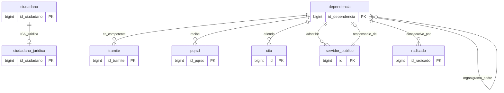
```mermaid
erDiagram
    dependencia {
        bigint id_dependencia PK
    }
    ciudadano {
        bigint id_ciudadano PK
    }
    ciudadano_juridica {
        bigint id_ciudadano PK
    }
    tramite {
        bigint id_tramite PK
    }
    pqrsd {
        bigint id_pqrsd PK
    }
    cita {
        bigint id PK
    }
    servidor_publico {
        bigint id PK
    }
    radicado {
        bigint id_radicado PK
    }

    dependencia ||--o{ dependencia : "organigrama_padre"
    dependencia ||--o{ tramite : "es_competente"
    dependencia ||--o{ pqrsd : "recibe"
    dependencia ||--o{ cita : "atiende"
    dependencia ||--o{ servidor_publico : "adscribe"
    dependencia ||--o{ radicado : "consecutivo_por"
    servidor_publico ||--o| dependencia : "responsable_de"

    ciudadano ||--o| ciudadano_juridica : "ISA_juridica"
```

> ISA disjoint + parcial (single-table → class-table en R2). `ciudadano.es_persona_juridica = TRUE ⟺ EXISTS(ciudadano_juridica)` (trigger cobertura). `servidor_publico ||--o| dependencia` representa `dependencia.id_responsable` (opcional).

---

## 2. Lógico — subdiagramas nuevos/actualizados (Mermaid, todas las columnas)

### 2.A Dominio ORGANIGRAMA — `dependencia` + FK entrantes

Todas las columnas. PK = `id_dependencia` (surrogate, decisión física R2); clave natural = `codigo UK`; self-FK = `padre_id`.


```mermaid
erDiagram
    dependencia {
        bigint id_dependencia PK
        varchar_20 codigo UK
        varchar_300 nombre UK
        text descripcion
        bigint responsable_id FK
        bigint sede_id FK
        boolean es_externa
        varchar_300 entidad_externa_nombre
        boolean activa
        bigint padre_id FK
        varchar_40 tipo_unidad
        varchar_30 sigla
        varchar_254 correo_institucional
        varchar_20 telefono
        varchar_500 ubicacion_fisica
        text horario_atencion
        timestamp created_at
        timestamp updated_at
    }
    tramite {
        bigint id_tramite PK
        bigint id_dependencia FK
    }
    pqrsd {
        bigint id_pqrsd PK
        bigint id_dependencia FK
    }
    canal_atencion {
        bigint id PK
        bigint id_dependencia FK
    }
    servicio_agendable {
        bigint id PK
        bigint id_dependencia FK
    }
    mecanismo_participacion {
        bigint id PK
        bigint id_dependencia FK
    }
    franja_horaria {
        bigint id PK
        bigint id_dependencia FK
    }
    cita {
        bigint id PK
        bigint id_dependencia FK
    }
    asignacion_dependencia {
        bigint id PK
        bigint id_dependencia FK
    }
    traslado_competencia {
        bigint id PK
        bigint id_dependencia_origen FK
    }
    micrositio {
        bigint id PK
        bigint id_dependencia_duena FK
    }
    servidor_publico {
        bigint id PK
        bigint id_dependencia FK
    }
    radicado {
        bigint id_radicado PK
        varchar_20 prefijo_dependencia FK
    }

    dependencia ||--o{ dependencia : "padre_id"
    servidor_publico ||--o| dependencia : "responsable_id"
    dependencia ||--o{ tramite : "id_dependencia"
    dependencia ||--o{ pqrsd : "id_dependencia"
    dependencia ||--o{ canal_atencion : "id_dependencia"
    dependencia ||--o{ servicio_agendable : "id_dependencia"
    dependencia ||--o{ mecanismo_participacion : "id_dependencia"
    dependencia ||--o{ franja_horaria : "id_dependencia"
    dependencia ||--o{ cita : "id_dependencia"
    dependencia ||--o{ asignacion_dependencia : "id_dependencia"
    dependencia ||--o{ traslado_competencia : "id_dependencia_origen"
    dependencia ||--o{ micrositio : "id_dependencia_duena"
    dependencia ||--o{ servidor_publico : "id_dependencia"
    dependencia ||--o{ radicado : "prefijo_dependencia"
```

> **Decisión física R2 (sobrescribe lógico R2):** las 11 FK genéricas son `BIGINT → dependencia(id_dependencia)` (surrogate), `ON DELETE RESTRICT ON UPDATE RESTRICT`. Excepción: `radicado.prefijo_dependencia VARCHAR_20 → dependencia(codigo)` `ON UPDATE CASCADE` (el código viaja dentro de `numero_radicado`). `sede_id → sede_fisica(id)` SET NULL; `responsable_id → servidor_publico(id)` SET NULL; `padre_id → dependencia(id_dependencia)` self RESTRICT, `CHECK (padre_id <> id_dependencia)` + trigger anti-ciclo.

### 2.B ISA `ciudadano` — supertipo + `ciudadano_juridica` subtipo (PK=FK)

`ciudadano` supertipo SIN `razon_social`/`representante_legal_id` (movidas al subtipo). `ciudadano_juridica` PK = FK al surrogate (clase E canónica, decisión física R2).

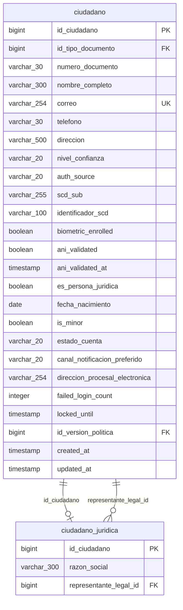
```mermaid
erDiagram
    ciudadano {
        bigint id_ciudadano PK
        bigint id_tipo_documento FK
        varchar_30 numero_documento
        varchar_300 nombre_completo
        varchar_254 correo UK
        varchar_30 telefono
        varchar_500 direccion
        varchar_20 nivel_confianza
        varchar_20 auth_source
        varchar_255 scd_sub
        varchar_100 identificador_scd
        boolean biometric_enrolled
        boolean ani_validated
        timestamp ani_validated_at
        boolean es_persona_juridica
        date fecha_nacimiento
        boolean is_minor
        varchar_20 estado_cuenta
        varchar_20 canal_notificacion_preferido
        varchar_254 direccion_procesal_electronica
        integer failed_login_count
        timestamp locked_until
        bigint id_version_politica FK
        timestamp created_at
        timestamp updated_at
    }
    ciudadano_juridica {
        bigint id_ciudadano PK
        varchar_300 razon_social
        bigint representante_legal_id FK
    }

    ciudadano ||--o| ciudadano_juridica : "id_ciudadano"
    ciudadano ||--o{ ciudadano_juridica : "representante_legal_id"
```

> `ciudadano_juridica.id_ciudadano` PK=FK `→ ciudadano(id_ciudadano) ON DELETE CASCADE` (surrogate, decisión física R2; NO la PK=FK compuesta natural del lógico R2). `representante_legal_id → ciudadano(id_ciudadano) ON DELETE SET NULL`. Disjoint + parcial; trigger cobertura DEFERRED.

### 2.C Detalle SUS — `evaluacion_sus` + `respuesta_item_sus`

`evaluacion_sus` SIN `item_1..item_10`; `puntaje_sus` derivado (vista, no base). 10 ítems Likert como filas.

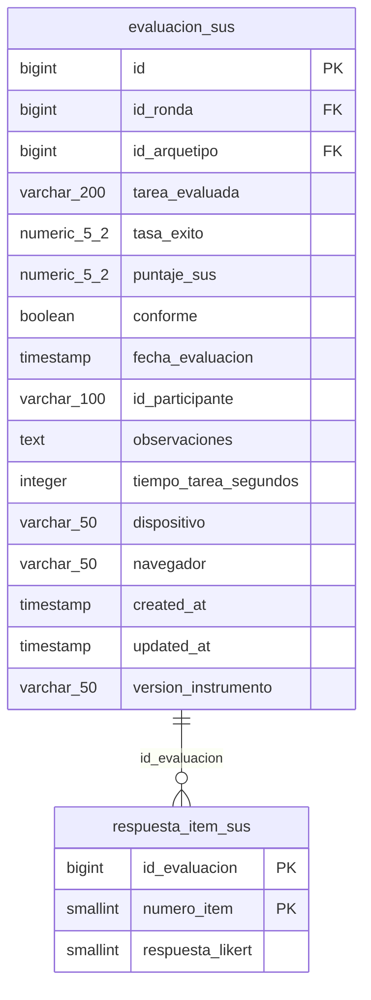
```mermaid
erDiagram
    evaluacion_sus {
        bigint id PK
        bigint id_ronda FK
        bigint id_arquetipo FK
        varchar_200 tarea_evaluada
        numeric_5_2 tasa_exito
        numeric_5_2 puntaje_sus
        boolean conforme
        timestamp fecha_evaluacion
        varchar_100 id_participante
        text observaciones
        integer tiempo_tarea_segundos
        varchar_50 dispositivo
        varchar_50 navegador
        timestamp created_at
        timestamp updated_at
        varchar_50 version_instrumento
    }
    respuesta_item_sus {
        bigint id_evaluacion PK
        smallint numero_item PK
        smallint respuesta_likert
    }

    evaluacion_sus ||--o{ respuesta_item_sus : "id_evaluacion"
```

> `respuesta_item_sus` PK compuesta `(id_evaluacion, numero_item)`; `id_evaluacion → evaluacion_sus ON DELETE CASCADE`; `CHECK (numero_item BETWEEN 1 AND 10)`, `CHECK (respuesta_likert BETWEEN 1 AND 5)`. `puntaje_sus` NO GENERATED → vista `vw_evaluacion_sus_puntaje` (fórmula SUS, NULL si COUNT≠10).

### 2.D Detalle encuesta — `encuesta_experiencia` + `respuesta_encuesta` + `pregunta_encuesta` [COND P-13]

`encuesta_experiencia` SIN `pregunta_1/2/3`/`respuestas`/`respuesta_pregunta_*`; ≤3 preguntas como filas.

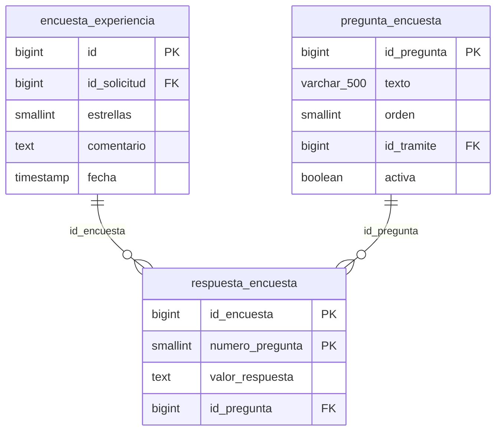
```mermaid
erDiagram
    encuesta_experiencia {
        bigint id PK
        bigint id_solicitud FK
        smallint estrellas
        text comentario
        timestamp fecha
    }
    respuesta_encuesta {
        bigint id_encuesta PK
        smallint numero_pregunta PK
        text valor_respuesta
        bigint id_pregunta FK
    }
    pregunta_encuesta {
        bigint id_pregunta PK
        varchar_500 texto
        smallint orden
        bigint id_tramite FK
        boolean activa
    }

    encuesta_experiencia ||--o{ respuesta_encuesta : "id_encuesta"
    pregunta_encuesta ||--o{ respuesta_encuesta : "id_pregunta"
```

> `respuesta_encuesta` PK compuesta `(id_encuesta, numero_pregunta)`; `id_encuesta → encuesta_experiencia ON DELETE CASCADE`; `CHECK (numero_pregunta BETWEEN 1 AND 3)` (RF-B1-094 ≤3). `id_pregunta → pregunta_encuesta SET NULL` y toda `pregunta_encuesta` son **CONDICIONALES P-13** (solo si las preguntas son configurables). `pregunta_encuesta.id_tramite → tramite`.

### 2.E `cita` (contacto condicional) — actualizada

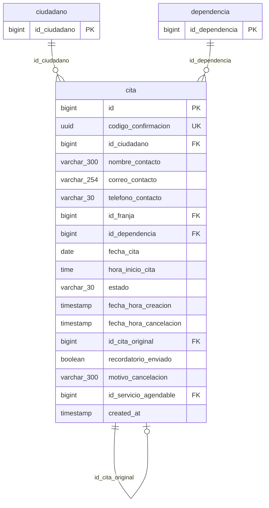
```mermaid
erDiagram
    cita {
        bigint id PK
        uuid codigo_confirmacion UK
        bigint id_ciudadano FK
        varchar_300 nombre_contacto
        varchar_254 correo_contacto
        varchar_30 telefono_contacto
        bigint id_franja FK
        bigint id_dependencia FK
        date fecha_cita
        time hora_inicio_cita
        varchar_30 estado
        timestamp fecha_hora_creacion
        timestamp fecha_hora_cancelacion
        bigint id_cita_original FK
        boolean recordatorio_enviado
        varchar_300 motivo_cancelacion
        bigint id_servicio_agendable FK
        timestamp created_at
    }
    ciudadano {
        bigint id_ciudadano PK
    }
    dependencia {
        bigint id_dependencia PK
    }

    ciudadano ||--o{ cita : "id_ciudadano"
    dependencia ||--o{ cita : "id_dependencia"
    cita ||--o| cita : "id_cita_original"
```

> `CHECK` bidireccional contacto condicional: `(id_ciudadano IS NOT NULL AND nombre_contacto IS NULL AND correo_contacto IS NULL AND telefono_contacto IS NULL) OR (id_ciudadano IS NULL AND correo_contacto IS NOT NULL)` (elimina dependencia transitiva → BCNF). Vista `vw_cita_contacto` COALESCE. `id_dependencia → dependencia(id_dependencia)` BIGINT (físico R2). `id_ciudadano → ciudadano SET NULL`.

### 2.F `contrato` (columnas GENERATED marcadas) — actualizada

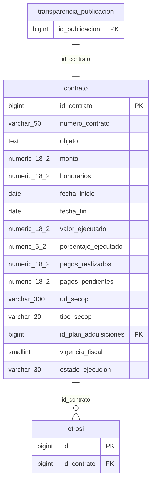
```mermaid
erDiagram
    contrato {
        bigint id_contrato PK
        varchar_50 numero_contrato
        text objeto
        numeric_18_2 monto
        numeric_18_2 honorarios
        date fecha_inicio
        date fecha_fin
        numeric_18_2 valor_ejecutado
        numeric_5_2 porcentaje_ejecutado
        numeric_18_2 pagos_realizados
        numeric_18_2 pagos_pendientes
        varchar_300 url_secop
        varchar_20 tipo_secop
        bigint id_plan_adquisiciones FK
        smallint vigencia_fiscal
        varchar_30 estado_ejecucion
    }
    transparencia_publicacion {
        bigint id_publicacion PK
    }
    otrosi {
        bigint id PK
        bigint id_contrato FK
    }

    transparencia_publicacion ||--|| contrato : "id_contrato"
    contrato ||--o{ otrosi : "id_contrato"
```

> ISA class-table: `contrato.id_contrato` PK=FK `→ transparencia_publicacion(id_publicacion) ON DELETE CASCADE`. **GENERATED ALWAYS AS … STORED** (misma fila, IMMUTABLE): `porcentaje_ejecutado = CASE WHEN monto>0 THEN valor_ejecutado/monto*100 END`; `pagos_pendientes = monto - pagos_realizados`. **`tiene_otrosi` NO es columna base** → vista `vw_contrato_ejecucion` (`EXISTS(otrosi)`). `estado_ejecucion` R2 nuevo: `CHECK ∈ (en_ejecucion, suspendido, terminado, liquidado, cedido)`. UNIQUE `(numero_contrato, vigencia_fiscal)`.

### 2.G `solicitud` (sin columnas espejo) — actualizada

7 columnas espejo QUITADAS; fuente única en `borrador_solicitud` (C21) / `desistimiento` (C25) / `silencio_administrativo_positivo` (C26) vía relaciones 1:1.

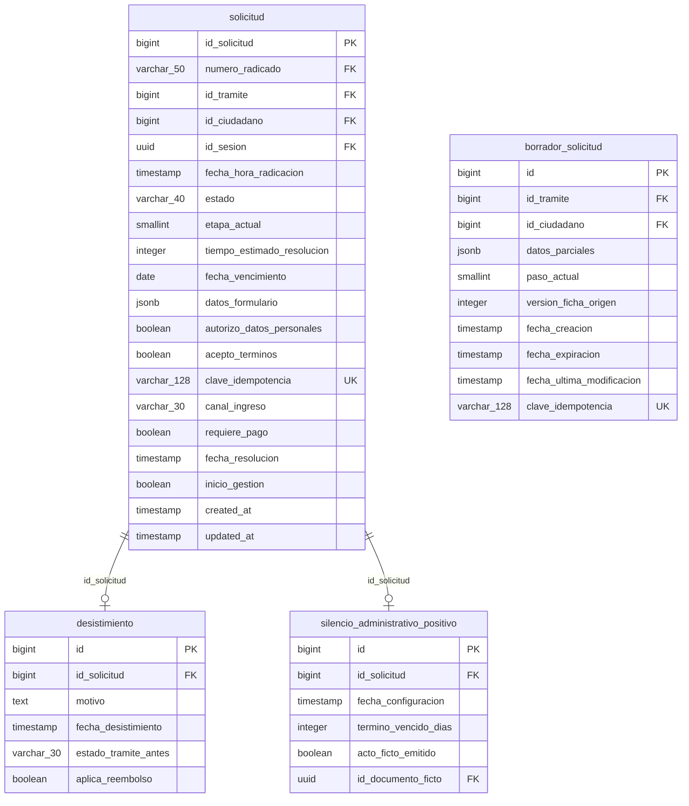
```mermaid
erDiagram
    solicitud {
        bigint id_solicitud PK
        varchar_50 numero_radicado FK
        bigint id_tramite FK
        bigint id_ciudadano FK
        uuid id_sesion FK
        timestamp fecha_hora_radicacion
        varchar_40 estado
        smallint etapa_actual
        integer tiempo_estimado_resolucion
        date fecha_vencimiento
        jsonb datos_formulario
        boolean autorizo_datos_personales
        boolean acepto_terminos
        varchar_128 clave_idempotencia UK
        varchar_30 canal_ingreso
        boolean requiere_pago
        timestamp fecha_resolucion
        boolean inicio_gestion
        timestamp created_at
        timestamp updated_at
    }
    borrador_solicitud {
        bigint id PK
        bigint id_tramite FK
        bigint id_ciudadano FK
        jsonb datos_parciales
        smallint paso_actual
        integer version_ficha_origen
        timestamp fecha_creacion
        timestamp fecha_expiracion
        timestamp fecha_ultima_modificacion
        varchar_128 clave_idempotencia UK
    }
    desistimiento {
        bigint id PK
        bigint id_solicitud FK
        text motivo
        timestamp fecha_desistimiento
        varchar_30 estado_tramite_antes
        boolean aplica_reembolso
    }
    silencio_administrativo_positivo {
        bigint id PK
        bigint id_solicitud FK
        timestamp fecha_configuracion
        integer termino_vencido_dias
        boolean acto_ficto_emitido
        uuid id_documento_ficto FK
    }

    solicitud ||--o| desistimiento : "id_solicitud"
    solicitud ||--o| silencio_administrativo_positivo : "id_solicitud"
```

> QUITADAS de `solicitud` (30→23 col): `es_borrador`, `paso_actual_borrador`, `fecha_expiracion_borrador`, `fecha_desistimiento`, `motivo_desistimiento`, `efecto_sap`, `fecha_sap_aplicado`. Relación con `borrador_solicitud` por `(id_tramite, id_ciudadano)` (no FK directa solicitud↔borrador; coexisten antes de radicar). Trigger estado↔existencia DEFERRED (`estado='DESISTIDO' ⟺ EXISTS(desistimiento)`; `estado='SILENCIO_POSITIVO' ⟺ EXISTS(sap)`). UNIQUE 1:1 parcial `(id_solicitud)` en desistimiento/sap.

---

## 3. Físico — fragmento (Mermaid, tipos PostgreSQL)

Tablas nuevas R2 con tipos PostgreSQL concretos + PK/FK (refleja DELTA físico R2 §A).

```mermaid
erDiagram
    dependencia {
        BIGINT id_dependencia PK "IDENTITY"
        VARCHAR_20 codigo UK
        VARCHAR_300 nombre UK
        TEXT descripcion
        BIGINT responsable_id FK
        BIGINT sede_id FK
        BOOLEAN es_externa
        VARCHAR_300 entidad_externa_nombre
        BOOLEAN activa
        BIGINT padre_id FK
        VARCHAR_40 tipo_unidad
        VARCHAR_30 sigla
        VARCHAR_254 correo_institucional
        VARCHAR_20 telefono
        VARCHAR_500 ubicacion_fisica
        TEXT horario_atencion
        TIMESTAMPTZ created_at
        TIMESTAMPTZ updated_at
    }
    ciudadano_juridica {
        BIGINT id_ciudadano PK "FK ciudadano"
        VARCHAR_300 razon_social
        BIGINT representante_legal_id FK
    }
    respuesta_item_sus {
        BIGINT id_evaluacion PK "FK evaluacion_sus"
        SMALLINT numero_item PK
        SMALLINT respuesta_likert
    }
    respuesta_encuesta {
        BIGINT id_encuesta PK "FK encuesta_experiencia"
        SMALLINT numero_pregunta PK
        TEXT valor_respuesta
        BIGINT id_pregunta FK
    }
    pregunta_encuesta {
        BIGINT id_pregunta PK "IDENTITY"
        VARCHAR_500 texto
        SMALLINT orden
        BIGINT id_tramite FK
        BOOLEAN activa
    }

    dependencia ||--o{ dependencia : "padre_id"
    ciudadano ||--o{ ciudadano_juridica : "representante_legal_id"
    evaluacion_sus ||--o{ respuesta_item_sus : "id_evaluacion"
    encuesta_experiencia ||--o{ respuesta_encuesta : "id_encuesta"
    pregunta_encuesta ||--o{ respuesta_encuesta : "id_pregunta"
```

> Tipos físicos: `dependencia` clase A → `id_dependencia BIGINT GENERATED ALWAYS AS IDENTITY` PK + `UNIQUE(codigo)` + `UNIQUE(nombre)`; `padre_id BIGINT` self (re-tipado, NO VARCHAR); `correo_institucional`/`telefono` vía DOMAIN `correo_email`/`telefono_co`; timestamps `TIMESTAMPTZ`. `ciudadano_juridica` clase E → `id_ciudadano BIGINT PK REFERENCES ciudadano ON DELETE CASCADE`. `respuesta_item_sus`/`respuesta_encuesta` clase F (PK compuesta, 0 índices extra). `contrato.porcentaje_ejecutado NUMERIC_5_2 GENERATED STORED`, `pagos_pendientes NUMERIC_18_2 GENERATED STORED`. Índices nuevos: `idx_dependencia_padre (padre_id)` BTREE, `idx_dependencia_responsable/sede` BTREE parcial, 9 índices FK→dependencia, `idx_cj_representante` parcial. Ninguna tabla nueva se particiona.

---

## 4. Matriz de trazabilidad — filas nuevas

| Requisito / origen | Tabla.columna | Restricción / mecanismo |
|---|---|---|
| RF-B1-097 (directorio institucional, art.9 Ley 1712) | `dependencia.nombre`, `.correo_institucional`, `.telefono`, `.ubicacion_fisica`, `.horario_atencion`, `.sigla` | `UNIQUE(nombre)`; `correo` DOMAIN RFC 5322; `telefono` DOMAIN `+57`; vista `vw_directorio_institucional` (WITH RECURSIVE) |
| RF-B1-097 / organigrama (jerarquía) | `dependencia.padre_id` | `FK self → dependencia(id_dependencia)` RESTRICT; `CHECK (padre_id <> id_dependencia)`; trigger anti-ciclo + advisory lock global |
| RN-04-D03 (traslado por competencia) | `dependencia.es_externa`, `.entidad_externa_nombre`; `traslado_competencia.id_dependencia_origen` | `CHECK (es_externa=FALSE OR entidad_externa_nombre IS NOT NULL)`; FK `→ dependencia(id_dependencia)` RESTRICT |
| C-13 (PK física dependencia) | `dependencia.id_dependencia`, `.codigo` | `BIGINT IDENTITY` PK + `UNIQUE(codigo)`; FK entrantes BIGINT ON UPDATE RESTRICT (NO cascada masiva); excepción `radicado.prefijo_dependencia → codigo` ON UPDATE CASCADE |
| G1 (persona jurídica / representante legal) | `ciudadano_juridica.razon_social`, `.representante_legal_id`; `ciudadano.es_persona_juridica` | PK=FK `→ ciudadano(id_ciudadano)` CASCADE; `razon_social` NOT NULL; `representante_legal_id → ciudadano` SET NULL; trigger cobertura ISA disjoint+parcial DEFERRED |
| RF-B1-087 (SUS 10 ítems) | `respuesta_item_sus.numero_item`, `.respuesta_likert`; `evaluacion_sus.puntaje_sus` | PK `(id_evaluacion, numero_item)`; `CHECK numero_item 1-10`; `CHECK respuesta_likert 1-5`; FK CASCADE; `puntaje_sus` vista `vw_evaluacion_sus_puntaje` (NULL si COUNT≠10) |
| RF-B1-094 (encuesta ≤3 preguntas) | `respuesta_encuesta.numero_pregunta`, `.valor_respuesta`; `encuesta_experiencia.estrellas` | PK `(id_encuesta, numero_pregunta)`; `CHECK numero_pregunta 1-3`; FK CASCADE; `CHECK estrellas 1-5` |
| RF-B1-094 [COND P-13] (preguntas configurables) | `pregunta_encuesta.texto`, `.orden`, `.id_tramite`, `.activa`; `respuesta_encuesta.id_pregunta` | CONDICIONAL P-13; `id_tramite → tramite` CASCADE; `respuesta_encuesta.id_pregunta → pregunta_encuesta` SET NULL |
| RF-B1-015 (contrato / ejecución, art.9 lit.e,f) | `contrato.valor_ejecutado`, `.porcentaje_ejecutado`, `.pagos_pendientes`, `.estado_ejecucion`, `.tiene_otrosi` | `porcentaje_ejecutado`/`pagos_pendientes` GENERATED STORED; `estado_ejecucion CHECK ∈ (en_ejecucion,suspendido,terminado,liquidado,cedido)`; `tiene_otrosi` vista `vw_contrato_ejecucion`; UNIQUE `(numero_contrato, vigencia_fiscal)` |
| RF-B1-003 (menú accesible) | `menu_navegacion.es_obligatorio`, `.aria_label` | `es_obligatorio BOOLEAN DEFAULT FALSE`; `aria_label VARCHAR(300)` (WCAG) |
| RF-B1-011 (noticia ratio imagen) | `noticia.ratio_imagen` | `VARCHAR(10) CHECK ∈ ('4:3','16:9')` |
| RF-B1 pago (cardinalidad 1:N) | `pago.id_solicitud` | `UNIQUE (id_solicitud) WHERE estado='APROBADO'` (≤1 aprobado); `idx_pago_solicitud` lista intentos |
| RN-03-D03/D07/D08 (eliminación columnas espejo solicitud) | `solicitud.estado`; `borrador_solicitud`, `desistimiento`, `silencio_administrativo_positivo` | 1:1 parcial `UNIQUE(id_solicitud)`; trigger estado↔existencia DEFERRED; FK CASCADE |
| RN-06-D01 (cita contacto condicional) | `cita.id_ciudadano`, `.nombre_contacto`, `.correo_contacto`, `.telefono_contacto` | `CHECK` bidireccional (ciudadano XOR contacto anónimo); vista `vw_cita_contacto` COALESCE |

---

## 5. Cobertura

**Tablas nuevas R2 representadas (conceptual + lógico + físico):**
- `dependencia` (C136) — conceptual §1, lógico §2.A, físico §3. Self-relación + 12 FK entrantes. ✅
- `ciudadano_juridica` — conceptual §1 (ISA), lógico §2.B (PK=FK), físico §3. ✅
- `respuesta_item_sus` — lógico §2.C, físico §3. ✅
- `respuesta_encuesta` — lógico §2.D, físico §3. ✅
- `pregunta_encuesta` [COND P-13] — lógico §2.D, físico §3. ✅

**Tablas modificadas R2 actualizadas:** `ciudadano` (−2 col, §2.B), `cita` (contacto condicional, §2.E), `contrato` (GENERATED + estado_ejecucion, §2.F), `solicitud` (−7 espejos + 1:1, §2.G), `evaluacion_sus` (−10 ítems, §2.C), `encuesta_experiencia` (−3/5 preguntas, §2.D). ✅

**Requisitos R2 mapeados (C12):** RF-B1-097 (directorio + organigrama), RN-04-D03 (traslado/externa), C-13 (PK dependencia), G1 (jurídica), RF-B1-087 (SUS), RF-B1-094 (encuesta + P-13), RF-B1-015 (contrato), RF-B1-003 (menú), RF-B1-011 (noticia), pago 1:N, RN-03 (solicitud espejos), RN-06-D01 (cita). **0 requisitos R2 sin mapear.** ✅

**Validación C10 (Mermaid):** snake_case, tipos sin paréntesis/comas (`VARCHAR_20`, `NUMERIC_18_2`, `NUMERIC_5_2`), relaciones `||--o{` / `||--o|` / `||--||`. 9 bloques `erDiagram` renderizables.

**Decisión física reflejada:** `dependencia` surrogate BIGINT + `UNIQUE(codigo)` (NO PK natural) — el lógico R2 expresa `codigo` como clave natural; el físico R2 la implementa como UNIQUE + surrogate (independencia física de Codd). FK entrantes BIGINT (no VARCHAR). `ciudadano_juridica` PK=FK al surrogate. ✅

---

# DELTA — Ronda 3 de diagramas y trazabilidad

> **Fuente:** `03-modelo-logico.md §DELTA R3` + `04-modelo-fisico.md §DELTA R3`.
> **Alcance:** 5 tablas nuevas (C137–C140 + C135 activada), 8 ALTER sobre tablas existentes, FK nuevas/corregidas.
> **Política física aplicada:** FK→`dependencia` permanecen `BIGINT→id_dependencia` salvo `radicado.prefijo_dependencia→dependencia(codigo)` (única excepción, AGN 060/2001). Divergencia de `mecanismo_participacion.id_oficina_responsable` documentada (BIGINT, no VARCHAR).

---

## (a) Sub-diagrama ER Ronda 3 (erDiagram Mermaid — zona R3)

Muestra las 5 tablas nuevas con sus columnas clave y las conexiones reales a sus tablas padre. Las tablas padre aparecen solo con PK para dar contexto sin redibujar el esquema global.

```mermaid
erDiagram

    %% ── Tablas padre (contexto, solo PK) ──────────────────────────
    plan_integracion {
        bigint id PK
    }
    tramite {
        bigint id_tramite PK
    }
    servidor_publico {
        bigint id PK
    }
    contenido {
        uuid id PK
        varchar idioma_origen
    }
    dependencia {
        bigint id_dependencia PK
        varchar codigo UK
    }
    radicado {
        bigint id_radicado PK
        varchar prefijo_dependencia FK
        bigint consecutivo_anual
        smallint anio
    }
    mecanismo_participacion {
        bigint id PK
        bigint id_dependencia FK
        bigint id_oficina_responsable FK
    }

    %% ── Tablas NUEVAS R3 ────────────────────────────────────────────
    plan_integracion_tramite {
        bigint id PK
        bigint id_plan FK
        bigint id_tramite FK
        varchar nombre_tramite
        integer solicitudes_anio
        varchar accion
        date fecha_objetivo
        bigint id_responsable FK
    }
    plan_integracion_dominio {
        bigint id_plan PK
        varchar valor PK
        varchar tipo
    }
    plan_integracion_otro_medio {
        bigint id_plan PK
        varchar valor PK
        varchar tipo
    }
    rate_limit_contador {
        varchar clave_sujeto PK
        timestamptz ventana_inicio PK
        varchar recurso PK
        integer contador
        timestamptz bloqueado_hasta
    }
    contenido_traduccion {
        uuid id_contenido PK
        varchar idioma PK
        varchar titulo_traducido
        text cuerpo_traducido
        boolean es_original
    }

    %% ── Relaciones R3 (FK reales del DELTA físico) ──────────────────
    plan_integracion ||--o{ plan_integracion_tramite   : "id_plan (CASCADE)"
    plan_integracion ||--o{ plan_integracion_dominio   : "id_plan (CASCADE)"
    plan_integracion ||--o{ plan_integracion_otro_medio : "id_plan (CASCADE)"
    tramite          ||--o{ plan_integracion_tramite   : "id_tramite (RESTRICT)"
    servidor_publico ||--o{ plan_integracion_tramite   : "id_responsable (SET NULL)"
    contenido        ||--o{ contenido_traduccion       : "id_contenido (CASCADE)"

    %% ── FK corregidas/nuevas sobre tablas existentes (DELTA b) ─────
    dependencia      ||--o{ radicado                   : "prefijo_dependencia -> codigo (RESTRICT/CASCADE)"
    dependencia      ||--o{ mecanismo_participacion    : "id_oficina_responsable (RESTRICT)"
```

---

## (b) Lista de edges nuevos para el diagrama global

Quien edite el diagrama global (subdiagramas §2.x) debe insertar exactamente las siguientes aristas.

### Subdiagrama 2.1 — Dominio Identidad / módulo 01

```
plan_integracion ||--o{ plan_integracion_tramite    : "id_plan"
plan_integracion ||--o{ plan_integracion_dominio    : "id_plan"
plan_integracion ||--o{ plan_integracion_otro_medio : "id_plan"
```

Nodos nuevos a declarar en §2.1:

```
plan_integracion_tramite {
    bigint id PK
    bigint id_plan FK
    bigint id_tramite FK
    varchar nombre_tramite
    integer solicitudes_anio
    varchar accion
    date fecha_objetivo
    bigint id_responsable FK
}
plan_integracion_dominio {
    bigint id_plan PK
    varchar valor PK
    varchar tipo
}
plan_integracion_otro_medio {
    bigint id_plan PK
    varchar valor PK
    varchar tipo
}
```

### Subdiagrama 2.2 — Dominio Trámites
```
tramite ||--o{ plan_integracion_tramite : "id_tramite"
```

### Subdiagrama 2.3 — Dominio PQRSD
Arista corregida (cierre P-08, reemplaza la anterior):
```
dependencia ||--o{ radicado : "prefijo_dependencia -> codigo (RESTRICT/CASCADE)"
```
Restricción a agregar en `radicado`: `UNIQUE (prefijo_dependencia, anio, consecutivo_anual)`.

### Subdiagrama 2.4 — Dominio Participa
```
dependencia ||--o{ mecanismo_participacion : "id_oficina_responsable (RESTRICT)"
```
Columna a agregar en `mecanismo_participacion`: `bigint id_oficina_responsable FK`.

### Subdiagrama CMS/multilingüe
```
contenido_traduccion {
    bigint id_contenido PK
    varchar idioma PK
    varchar titulo_traducido
    text cuerpo_traducido
    boolean es_original
}
contenido ||--o{ contenido_traduccion : "id_contenido (CASCADE)"
```

### Nodo `rate_limit_contador` (Dominio Seguridad §2.7 o nodo autónomo)
Sin FK (tabla autónoma de throttling). Añadir solo el nodo:
```
rate_limit_contador {
    varchar clave_sujeto PK
    timestamptz ventana_inicio PK
    varchar recurso PK
    integer contador
    timestamptz bloqueado_hasta
}
```

---

## (c) Filas nuevas — Matriz de trazabilidad R3

| # | Tabla / columna | Requisito / origen | Fuente (archivo:sección) | Restricción clave |
|---|---|---|---|---|
| T-R3-01 | `plan_integracion_tramite` (C137) | R3.A N-02; normaliza JSONB `plan_integracion.tramites_incluidos` (1FN/4FN; MVD `id_plan ↠ PIT`) | `00-inventario.md §R3.A N-02`; `03-logico §DELTA a.1`; `04-fisico §DELTA a.1` | PK surrogate `id` + UNIQUE parcial `(id_plan,id_tramite) WHERE id_tramite IS NOT NULL`; CHECK `accion IN (converger,enlazar,retirar)` |
| T-R3-02 | `plan_integracion_dominio` (C138) | R3.A N-03; normaliza JSONB `dominios_web` (MVD independiente de PIT) | `00-inventario.md §R3.A N-03`; `03-logico §DELTA a.2`; `04-fisico §DELTA a.2` | PK natural compuesta `(id_plan, valor)`; CHECK `length(valor)>0` |
| T-R3-03 | `plan_integracion_otro_medio` (C139) | R3.A N-03; normaliza TEXT `otros_medios` (apps, chatbots, líneas PQR); MVD independiente de PID (anomalía Fagin) | `00-inventario.md §R3.A N-03`; `03-logico §DELTA a.3`; `04-fisico §DELTA a.3` | PK natural compuesta `(id_plan, valor)`; CHECK `tipo IN (app,chatbot,pqr,otro)` |
| T-R3-04 | `rate_limit_contador` (C140) | RNF-09-D02 + HU-09-D07 + ST-05; throttling persistible (login, PQRSD, búsqueda) | `00-inventario.md §R3.B F-04`; `03-logico §DELTA a.4`; `04-fisico §DELTA a.4` | PK natural compuesta `(clave_sujeto, ventana_inicio, recurso)`; fillfactor=70; UPSERT atómico (lost update) |
| T-R3-05 | `contenido_traduccion` (C135 activada) | RN-TX-D05; multilingüe CMS + lenguas étnicas + fallback ES | `00-inventario.md §C135`; `03-logico §DELTA a.5`; `04-fisico §DELTA a.5` | PK natural compuesta `(id_contenido, idioma)`; UNIQUE parcial `(id_contenido) WHERE es_original=TRUE`; FK CASCADE; CHECK BCP-47 |
| C-R3-01 | `incidente_seguridad.sic_rnbd_reportado` | F-01; Ley 1581 Art.17 — reporte independiente a SIC/RNBD | `03-logico §DELTA b.2`; `04-fisico §DELTA b.2` | NOT NULL DEFAULT FALSE; CHECK condicional con `sic_reporte_fecha` |
| C-R3-02 | `incidente_seguridad.sic_reporte_fecha` | F-01; FD-INC-1 | `03-logico §DELTA b.2`; `04-fisico §DELTA b.2` | TIMESTAMPTZ; condicional de `sic_rnbd_reportado` |
| C-R3-03 | `mecanismo_participacion.id_oficina_responsable` | F-06; R-03; Art.17 Ley 2052 | `03-logico §DELTA b.3`; `04-fisico §DELTA b.3` | BIGINT FK→`dependencia(id_dependencia)` RESTRICT; índice parcial |
| C-R3-04 | `interop_tsa_config.vigencia_desde` | F-08; FD-TSA-1; re-clave 2FN | `03-logico §DELTA b.4`; `04-fisico §DELTA b.4` | DATE NOT NULL; UNIQUE natural `(ambiente, vigencia_desde)` |
| C-R3-05 | `interop_tsa_config.host_salida` | F-08; borrador-AND L32 | `03-logico §DELTA b.4`; `04-fisico §DELTA b.4` | VARCHAR(255) NOT NULL DEFAULT 'tsa.gse.com.co' |
| C-R3-06 | `interop_tsa_config.puerto` | F-08; borrador-AND L32 | `03-logico §DELTA b.4`; `04-fisico §DELTA b.4` | INTEGER NOT NULL DEFAULT 443; CHECK 1..65535 |
| C-R3-07 | `sede_electronica.declaracion_conformidad_sic` | F-02 `[INFERIDO]`; Ley 1581 Art.26 | `03-logico §DELTA b.5`; `04-fisico §DELTA b.5` | BOOLEAN NOT NULL DEFAULT FALSE |
| C-R3-08 | `sede_electronica.peti_vigencia` | F-10; PETI 2024-2027 | `03-logico §DELTA b.5`; `04-fisico §DELTA b.5` | VARCHAR(20) DEFAULT '2024-2027' |
| C-R3-09 | `sede_electronica.id_peti_referencia` | F-10 | `03-logico §DELTA b.5`; `04-fisico §DELTA b.5` | VARCHAR(100) nullable |
| C-R3-10 | `contenido.idioma_origen` | F-11; RN-TX-D05 | `03-logico §DELTA b.6`; `04-fisico §DELTA b.6` | VARCHAR(10) NOT NULL DEFAULT 'es'; CHECK BCP-47 |
| C-R3-11 | `grupo_interes.caracterizacion` | F-07; A-07 (caracterización DAFP) | `03-logico §DELTA b.7`; `04-fisico §DELTA b.7` | TEXT nullable |
| C-R3-12 | `grupo_interes.tiene_caracterizacion_formal` | F-07; A-07 | `03-logico §DELTA b.7`; `04-fisico §DELTA b.7` | BOOLEAN NOT NULL DEFAULT FALSE |
| C-R3-13 | `dataset.actualizacion_automatica` | F-12; módulo 11 §9 L96 | `03-logico §DELTA b.8`; `04-fisico §DELTA b.8` | BOOLEAN NOT NULL DEFAULT FALSE |
| FK-R3-01 | `radicado.prefijo_dependencia → dependencia(codigo)` | FD-DEP-3; AGN 060/2001; cierra P-08 | `03-logico §DELTA b.1`; `04-fisico §DELTA b.1` | VARCHAR(20)→UNIQUE(codigo); RESTRICT/CASCADE; UNIQUE `(prefijo, anio, consecutivo)` |
| FK-R3-02 | `mecanismo_participacion.id_oficina_responsable → dependencia(id_dependencia)` | F-06; R-03 | `03-logico §DELTA b.3`; `04-fisico §DELTA b.3` (divergencia: BIGINT no VARCHAR) | BIGINT RESTRICT/RESTRICT |
| FK-R3-03 | `plan_integracion_tramite → plan_integracion(id)` | FD-PIT-1; R-04 | `04-fisico §DELTA a.1` | CASCADE/CASCADE |
| FK-R3-04 | `plan_integracion_tramite → tramite(id_tramite)` | FD-PIT-1; R-05 | `04-fisico §DELTA a.1` | RESTRICT/CASCADE; nullable |
| FK-R3-05 | `plan_integracion_tramite → servidor_publico(id)` | inv. N-02 R-02 | `04-fisico §DELTA a.1` | SET NULL/CASCADE |
| FK-R3-06 | `plan_integracion_dominio → plan_integracion(id)` | FD-PID-1; R-04 | `04-fisico §DELTA a.2` | CASCADE/CASCADE |
| FK-R3-07 | `plan_integracion_otro_medio → plan_integracion(id)` | FD-PID-1; R-04 | `04-fisico §DELTA a.3` | CASCADE/CASCADE |
| FK-R3-08 | `contenido_traduccion → contenido(id)` | FD-CON-1; RN-TX-D05 | `04-fisico §DELTA a.5` | CASCADE/CASCADE |

---

## (d) Conteo del delta R3 — diagramas y trazabilidad

| Categoría | Cantidad |
|---|---|
| Tablas nuevas representadas en el sub-diagrama R3 | 5 |
| Tablas padre referenciadas como contexto | 7 |
| Aristas nuevas en el sub-diagrama R3 | 9 |
| Edges nuevos para insertar en el diagrama global | 10 |
| Filas nuevas en la matriz de trazabilidad | 26 (5 tablas + 13 columnas + 8 FK) |
| Inconsistencias representadas (c.5 física/lógica, P-08) | 2 (ambas resueltas) |

---

# DELTA — Ronda 3.1 de diagramas y trazabilidad (hallazgos web)

> Origen: `03/04 §DELTA Ronda 3.1` + `_investigacion-web.md §Ronda 3`. 3 tablas nuevas, FK BIGINT (clase A) verificadas.

## Sub-diagrama ER R3.1 (Mermaid)

```mermaid
erDiagram
    ciudadano {
        bigint id_ciudadano PK
    }
    grupo_interes {
        bigint id PK
    }
    carpeta_autorizacion_acceso {
        bigint id_autorizacion PK
        bigint id_ciudadano FK
        varchar entidad_autorizada
        varchar tipo_entidad
        varchar conjunto_dato
        varchar accion
        date fecha_inicio_vigencia
        date fecha_fin_vigencia
        varchar estado
        timestamptz fecha_revocacion
    }
    variable_caracterizacion {
        bigint id_variable PK
        varchar dimension
        varchar nombre_variable
        varchar aplica_a
    }
    grupo_interes_caracterizacion {
        bigint id_grupo_interes PK
        bigint id_variable PK
        text valor
    }

    ciudadano ||--o{ carpeta_autorizacion_acceso : "id_ciudadano (CASCADE)"
    grupo_interes ||--o{ grupo_interes_caracterizacion : "id_grupo_interes (CASCADE)"
    variable_caracterizacion ||--o{ grupo_interes_caracterizacion : "id_variable (RESTRICT)"
```

## Filas nuevas — matriz de trazabilidad R3.1

| # | Tabla / columna | Origen | Fuente | Restricción clave |
|---|---|---|---|---|
| T-R31-01 | `carpeta_autorizacion_acceso` (C141) | P-18; autorizaciones CCD como entidad 1:N | `_investigacion-web §R3 E-4` (Anexo 1 SCD §10); `03 §a.6`; `04 §R3.1` | PK BIGINT; FK→ciudadano CASCADE; UNIQUE parcial activa por (titular,entidad,conjunto); CHECK accion/estado |
| T-R31-02 | `variable_caracterizacion` (C142) | F-07; catálogo de variables DAFP | `_investigacion-web §R3 E-3` (Guía DAFP v5 2022); `03 §a.7` | PK BIGINT; UNIQUE(dimension,nombre_variable); CHECK dimension/aplica_a; [INFERIDO] |
| T-R31-03 | `grupo_interes_caracterizacion` (C143) | F-07; valor de variable por grupo | `_investigacion-web §R3 E-3`; `03 §a.7` | PK compuesta (id_grupo_interes,id_variable); 2 FK; [INFERIDO] |
| FK-R31-01 | `carpeta_autorizacion_acceso → ciudadano(id_ciudadano)` | titular CCD | `04 §R3.1` | BIGINT CASCADE/RESTRICT |
| FK-R31-02 | `grupo_interes_caracterizacion → grupo_interes(id)` | F-07 | `04 §R3.1` | BIGINT CASCADE/RESTRICT |
| FK-R31-03 | `grupo_interes_caracterizacion → variable_caracterizacion(id_variable)` | F-07 | `04 §R3.1` | BIGINT RESTRICT/CASCADE |

> Datos semilla disponibles (no estructura): 10 ítems SUS ES (`_investigacion-web §R3 E-2`) → seed de catálogo SUS; variables DAFP por dimensión (`§R3 E-3`) → seed de `variable_caracterizacion`. Vacíos sin fuente pública (NO bloquean estructura): códigos orgánicos de `dependencia` (Decreto 312/2016 no publicado), contrato REST CCD campo-a-campo (fuera de alcance normativo), baja de portal GOV.CO (no regulada).
